# Advanced AI Application Sequence Diagrams
## Enterprise FinTech AI Applications - Detailed Workflow Analysis

### **5.1 AI-Powered Real-time Fraud Detection System**

```mermaid
sequenceDiagram
    participant Transaction as Transaction Source
    participant L1_SEC as Layer 1 - Enhanced Security
    participant L2_MON as Layer 2 - AI Monitoring
    participant L4_FE as Layer 4 - Fraud Detection Frontend
    participant L5_API as Layer 5 - API Gateway
    participant L6_MCP_GW as Layer 6 - MCP Gateway
    participant L7_MCP_FW as Layer 7 - Enhanced MCP Framework
    participant L8_AI as Layer 8 - Fraud Detection AI Platform
    participant L9_MS as Layer 9 - Fraud Detection Microservices
    participant L10_MQ as Layer 10 - Message Queue
    participant L11_ES as Layer 11 - Event Streaming
    participant L12_DATA as Layer 12 - Fraud Data Platform
    participant L13_INFRA as Layer 13 - Real-time Infrastructure
    
    Transaction->>L1_SEC: Real-time transaction event
    L1_SEC->>L1_SEC: Transaction security validation
    L1_SEC->>L2_MON: Log transaction security metrics
    
    L1_SEC->>L5_API: POST /ai/fraud/real-time-detection
    L5_API->>L6_MCP_GW: Route to fraud detection MCP
    L6_MCP_GW->>L7_MCP_FW: Initiate fraud detection workflow
    
    %% Real-time AI Fraud Detection Orchestration
    L7_MCP_FW->>L8_AI: Deploy Fraud Detection Agent Network
    
    Note over L8_AI: Fraud Detection AI Agents:<br/>• Behavioral Analysis Agent<br/>• Pattern Recognition Agent<br/>• Anomaly Detection Agent<br/>• Risk Scoring Agent<br/>• Network Analysis Agent
    
    %% Parallel Real-time Fraud Analysis
    par Behavioral Analysis
        L8_AI->>L9_MS: Behavioral Agent → Customer Behavior Service
        L9_MS->>L12_DATA: Query customer behavioral patterns
        L12_DATA->>L13_INFRA: Real-time ML inference (Azure ML)
        L13_INFRA->>L12_DATA: Behavioral anomaly score
        L12_DATA->>L9_MS: Customer behavior analysis
        L9_MS->>L10_MQ: Publish BehavioralAnalysisCompleted event
    and Pattern Recognition
        L8_AI->>L9_MS: Pattern Agent → Historical Patterns Service
        L9_MS->>L12_DATA: Query fraud pattern database
        L12_DATA->>L13_INFRA: Pattern matching ML models (AWS Bedrock)
        L13_INFRA->>L12_DATA: Pattern similarity scores
        L12_DATA->>L9_MS: Pattern recognition results
        L9_MS->>L10_MQ: Publish PatternRecognitionCompleted event
    and Anomaly Detection
        L8_AI->>L9_MS: Anomaly Agent → Anomaly Detection Service
        L9_MS->>L12_DATA: Query transaction feature store
        L12_DATA->>L13_INFRA: Isolation Forest & LSTM models (GCP Vertex)
        L13_INFRA->>L12_DATA: Anomaly probability scores
        L12_DATA->>L9_MS: Anomaly detection results
        L9_MS->>L10_MQ: Publish AnomalyDetectionCompleted event
    and Risk Scoring
        L8_AI->>L9_MS: Risk Agent → Risk Assessment Service
        L9_MS->>L12_DATA: Query comprehensive risk factors
        L12_DATA->>L13_INFRA: Gradient boosting risk models
        L13_INFRA->>L12_DATA: Composite risk scores
        L12_DATA->>L9_MS: Risk scoring results
        L9_MS->>L10_MQ: Publish RiskScoringCompleted event
    and Network Analysis
        L8_AI->>L9_MS: Network Agent → Graph Analysis Service
        L9_MS->>L12_DATA: Query transaction network graph
        L12_DATA->>L13_INFRA: Graph neural network analysis
        L13_INFRA->>L12_DATA: Network fraud indicators
        L12_DATA->>L9_MS: Network analysis results
        L9_MS->>L10_MQ: Publish NetworkAnalysisCompleted event
    end
    
    %% Real-time Fraud Decision Fusion
    L10_MQ->>L11_ES: Stream all fraud detection events
    L11_ES->>L8_AI: Trigger Fraud Decision Fusion Agent
    
    L8_AI->>L8_AI: Apply Ensemble Decision Fusion
    Note over L8_AI: Real-time Decision Fusion:<br/>• Weighted ensemble of all agents<br/>• Real-time threshold adaptation<br/>• Confidence interval calculation<br/>• Explainable fraud reasoning
    
    alt High Fraud Probability (>0.8)
        L8_AI->>L9_MS: Block transaction immediately
        L9_MS->>L10_MQ: Publish TransactionBlocked event
        L10_MQ->>L4_FE: Real-time fraud alert
        L9_MS->>L12_DATA: Store fraud case details
        L4_FE->>L2_MON: Update fraud prevention metrics
    else Medium Fraud Probability (0.5-0.8)
        L8_AI->>L9_MS: Flag for manual review
        L9_MS->>L10_MQ: Publish TransactionFlagged event
        L10_MQ->>L4_FE: Manual review notification
        L9_MS->>L12_DATA: Store flagged transaction
    else Low Fraud Probability (<0.5)
        L8_AI->>L9_MS: Allow transaction
        L9_MS->>L10_MQ: Publish TransactionApproved event
        L9_MS->>L12_DATA: Store transaction approval
    end
    
    %% Continuous Learning and Model Updates
    L11_ES->>L8_AI: Stream transaction outcomes
    L8_AI->>L12_DATA: Update fraud detection models
    L12_DATA->>L2_MON: Update model performance metrics
    
    Note over L2_MON: Real-time Fraud Monitoring:<br/>• Sub-second detection latency<br/>• False positive rate tracking<br/>• Model drift detection<br/>• Fraud loss prevention measurement
```

### **5.2 Intelligent Algorithmic Trading Analytics**

### **5.3 Automated Loan Processing with AI Decision Engine**

### **5.4 Real-time Market Intelligence and News Analytics**

```mermaid
sequenceDiagram
    participant Analyst as Financial Analyst
    participant L1_SEC as Layer 1 - Enhanced Security
    participant L2_MON as Layer 2 - AI Monitoring
    participant L4_FE as Layer 4 - Market Intelligence Frontend
    participant L5_API as Layer 5 - API Gateway
    participant L6_MCP_GW as Layer 6 - MCP Gateway
    participant L7_MCP_FW as Layer 7 - Enhanced MCP Framework
    participant L8_AI as Layer 8 - Market Intelligence AI Platform
    participant L9_MS as Layer 9 - Market Data Microservices
    participant L10_MQ as Layer 10 - Message Queue
    participant L11_ES as Layer 11 - Event Streaming
    participant L12_DATA as Layer 12 - Market Data Platform
    participant L13_INFRA as Layer 13 - Real-time Infrastructure
    
    Analyst->>L1_SEC: Request real-time market intelligence
    L1_SEC->>L1_SEC: Analyst authorization validation
    L1_SEC->>L2_MON: Log market intelligence session
    
    L1_SEC->>L4_FE: Authenticated market intelligence request
    L4_FE->>L5_API: POST /ai/market/real-time-intelligence
    L5_API->>L6_MCP_GW: Route to market intelligence MCP
    
    %% Real-time Market Intelligence Orchestration
    L6_MCP_GW->>L7_MCP_FW: Initiate market intelligence workflow
    L7_MCP_FW->>L8_AI: Deploy Market Intelligence Agent Network
    
    Note over L8_AI: Market Intelligence AI Agents:<br/>• News Analytics Agent<br/>• Social Media Sentiment Agent<br/>• Economic Indicator Agent<br/>• Corporate Events Agent<br/>• Market Movement Agent<br/>• Volatility Prediction Agent
    
    %% Parallel Real-time Market Analysis
    par News Analytics
        L8_AI->>L9_MS: News Agent → News Analytics Service
        L9_MS->>L12_DATA: Query real-time news feeds
        L12_DATA->>L13_INFRA: NLP news impact analysis (Claude 3.5)
        L13_INFRA->>L12_DATA: News sentiment and impact scores
        L12_DATA->>L9_MS: News analytics results
        L9_MS->>L10_MQ: Publish NewsAnalyticsCompleted event
    and Social Media Sentiment
        L8_AI->>L9_MS: Social Agent → Social Media Service
        L9_MS->>L12_DATA: Query social media sentiment data
        L12_DATA->>L13_INFRA: Social sentiment ML models
        L13_INFRA->>L12_DATA: Real-time sentiment indicators
        L12_DATA->>L9_MS: Social sentiment results
        L9_MS->>L10_MQ: Publish SocialSentimentCompleted event
    and Economic Indicators
        L8_AI->>L9_MS: Economic Agent → Economic Data Service
        L9_MS->>L12_DATA: Query economic indicators and forecasts
        L12_DATA->>L13_INFRA: Economic impact ML models
        L13_INFRA->>L12_DATA: Economic indicator analysis
        L12_DATA->>L9_MS: Economic analysis results
        L9_MS->>L10_MQ: Publish EconomicAnalysisCompleted event
    and Corporate Events
        L8_AI->>L9_MS: Corporate Agent → Corporate Events Service
        L9_MS->>L12_DATA: Query earnings, M&A, and corporate actions
        L12_DATA->>L13_INFRA: Corporate event impact models
        L13_INFRA->>L12_DATA: Event impact predictions
        L12_DATA->>L9_MS: Corporate events analysis
        L9_MS->>L10_MQ: Publish CorporateEventsCompleted event
    and Market Movement Analysis
        L8_AI->>L9_MS: Movement Agent → Price Movement Service
        L9_MS->>L12_DATA: Query real-time price and volume data
        L12_DATA->>L13_INFRA: Market movement prediction models
        L13_INFRA->>L12_DATA: Price movement forecasts
        L12_DATA->>L9_MS: Market movement analysis
        L9_MS->>L10_MQ: Publish MarketMovementCompleted event
    and Volatility Prediction
        L8_AI->>L9_MS: Volatility Agent → Volatility Modeling Service
        L9_MS->>L12_DATA: Query volatility surface data
        L12_DATA->>L13_INFRA: GARCH and ML volatility models
        L13_INFRA->>L12_DATA: Volatility forecasts
        L12_DATA->>L9_MS: Volatility prediction results
        L9_MS->>L10_MQ: Publish VolatilityPredictionCompleted event
    end
    
    %% Real-time Market Intelligence Fusion
    L10_MQ->>L11_ES: Stream all market intelligence events
    L11_ES->>L8_AI: Trigger Market Intelligence Fusion Agent
    
    L8_AI->>L8_AI: Apply Real-time Market Intelligence Fusion
    Note over L8_AI: Market Intelligence Fusion:<br/>• Multi-source data synthesis<br/>• Real-time market regime detection<br/>• Event-driven impact analysis<br/>• Predictive market alerts
    
    alt Critical Market Event Detected
        L8_AI->>L9_MS: Generate critical market alert
        L9_MS->>L10_MQ: Publish CriticalMarketAlert event
        L10_MQ->>L4_FE: Immediate alert notification
        L9_MS->>L12_DATA: Store critical event details
        L4_FE->>L2_MON: Update critical event metrics
    else Significant Market Movement
        L8_AI->>L9_MS: Generate significant movement alert
        L9_MS->>L10_MQ: Publish SignificantMovementAlert event
        L10_MQ->>L4_FE: Movement alert notification
        L9_MS->>L12_DATA: Store movement analysis
    else Normal Market Conditions
        L8_AI->>L9_MS: Generate routine market intelligence
        L9_MS->>L10_MQ: Publish RoutineMarketIntelligence event
        L10_MQ->>L4_FE: Regular intelligence update
        L9_MS->>L12_DATA: Store routine analysis
    end
    
    %% Market Intelligence Response
    L9_MS->>L8_AI: Return comprehensive market intelligence
    L8_AI->>L7_MCP_FW: Format intelligence with insights
    L7_MCP_FW->>L6_MCP_GW: Return market intelligence
    L6_MCP_GW->>L5_API: API response with analytics
    L5_API->>L4_FE: Market intelligence dashboard
    L4_FE->>Analyst: Display real-time market insights
    
    %% Continuous Market Intelligence Learning
    L11_ES->>L8_AI: Stream market outcome validation
    L8_AI->>L12_DATA: Update market intelligence models
    L12_DATA->>L2_MON: Update intelligence accuracy metrics
    
    Note over L2_MON: Market Intelligence Monitoring:<br/>• Prediction accuracy tracking<br/>• Alert effectiveness measurement<br/>• Intelligence latency optimization<br/>• Market impact correlation analysis
```

### **5.5 AI-Driven Portfolio Management and Optimization**

```mermaid
sequenceDiagram
    participant Portfolio_Manager as Portfolio Manager
    participant L1_SEC as Layer 1 - Enhanced Security
    participant L2_MON as Layer 2 - AI Monitoring
    participant L4_FE as Layer 4 - Portfolio Management Frontend
    participant L5_API as Layer 5 - API Gateway
    participant L6_MCP_GW as Layer 6 - MCP Gateway
    participant L7_MCP_FW as Layer 7 - Enhanced MCP Framework
    participant L8_AI as Layer 8 - Portfolio Intelligence Platform
    participant L9_MS as Layer 9 - Portfolio Microservices
    participant L10_MQ as Layer 10 - Message Queue
    participant L11_ES as Layer 11 - Event Streaming
    participant L12_DATA as Layer 12 - Portfolio Data Platform
    participant L13_INFRA as Layer 13 - Optimization Infrastructure
    
    Portfolio_Manager->>L1_SEC: Request portfolio optimization
    L1_SEC->>L1_SEC: Portfolio manager authentication
    L1_SEC->>L2_MON: Log portfolio optimization session
    
    L1_SEC->>L4_FE: Authenticated portfolio request
    L4_FE->>L5_API: POST /ai/portfolio/intelligent-optimization
    L5_API->>L6_MCP_GW: Route to portfolio optimization MCP
    
    %% AI-Powered Portfolio Optimization Orchestration
    L6_MCP_GW->>L7_MCP_FW: Initiate portfolio optimization workflow
    L7_MCP_FW->>L8_AI: Deploy Portfolio Intelligence Agent Network
    
    Note over L8_AI: Portfolio AI Agents:<br/>• Asset Allocation Agent<br/>• Risk Budgeting Agent<br/>• Factor Exposure Agent<br/>• Performance Attribution Agent<br/>• Rebalancing Strategy Agent<br/>• ESG Compliance Agent
    
    %% Comprehensive Portfolio Analysis
    par Asset Allocation Optimization
        L8_AI->>L9_MS: Allocation Agent → Asset Allocation Service
        L9_MS->>L12_DATA: Query current portfolio composition
        L12_DATA->>L13_INFRA: Black-Litterman + ML optimization
        L13_INFRA->>L12_DATA: Optimal asset allocation weights
        L12_DATA->>L9_MS: Asset allocation recommendations
        L9_MS->>L10_MQ: Publish AssetAllocationOptimized event
    and Risk Budgeting Analysis
        L8_AI->>L9_MS: Risk Agent → Risk Budgeting Service
        L9_MS->>L12_DATA: Query risk factor exposures
        L12_DATA->>L13_INFRA: Risk parity and budgeting models
        L13_INFRA->>L12_DATA: Optimal risk allocations
        L12_DATA->>L9_MS: Risk budgeting results
        L9_MS->>L10_MQ: Publish RiskBudgetingCompleted event
    and Factor Exposure Analysis
        L8_AI->>L9_MS: Factor Agent → Factor Analysis Service
        L9_MS->>L12_DATA: Query factor exposure data
        L12_DATA->>L13_INFRA: Multi-factor risk models
        L13_INFRA->>L12_DATA: Factor exposure analysis
        L12_DATA->>L9_MS: Factor analysis results
        L9_MS->>L10_MQ: Publish FactorAnalysisCompleted event
    and Performance Attribution
        L8_AI->>L9_MS: Performance Agent → Attribution Service
        L9_MS->>L12_DATA: Query portfolio performance history
        L12_DATA->>L13_INFRA: Performance attribution models
        L13_INFRA->>L12_DATA: Return source analysis
        L12_DATA->>L9_MS: Performance attribution results
        L9_MS->>L10_MQ: Publish PerformanceAttributionCompleted event
    and Rebalancing Strategy
        L8_AI->>L9_MS: Rebalancing Agent → Rebalancing Service
        L9_MS->>L12_DATA: Query transaction costs and constraints
        L12_DATA->>L13_INFRA: Optimal rebalancing algorithms
        L13_INFRA->>L12_DATA: Rebalancing recommendations
        L12_DATA->>L9_MS: Rebalancing strategy results
        L9_MS->>L10_MQ: Publish RebalancingStrategyCompleted event
    and ESG Compliance Analysis
        L8_AI->>L9_MS: ESG Agent → ESG Analytics Service
        L9_MS->>L12_DATA: Query ESG scores and constraints
        L12_DATA->>L13_INFRA: ESG-constrained optimization
        L13_INFRA->>L12_DATA: ESG-compliant allocations
        L12_DATA->>L9_MS: ESG compliance results
        L9_MS->>L10_MQ: Publish ESGComplianceCompleted event
    end
    
    %% Portfolio Optimization Decision Fusion
    L10_MQ->>L11_ES: Stream all portfolio analysis events
    L11_ES->>L8_AI: Trigger Portfolio Optimization Fusion Agent
    
    L8_AI->>L8_AI: Apply Comprehensive Portfolio Optimization
    Note over L8_AI: Portfolio Optimization Fusion:<br/>• Multi-objective optimization<br/>• Dynamic risk adjustment<br/>• Transaction cost optimization<br/>• Regulatory constraint handling
    
    alt Major Portfolio Rebalancing Required
        L8_AI->>L9_MS: Generate comprehensive rebalancing plan
        L9_MS->>L10_MQ: Publish MajorRebalancingPlan event
        L10_MQ->>L4_FE: Major rebalancing notification
        L9_MS->>L12_DATA: Store rebalancing plan details
        L12_DATA->>L2_MON: Update rebalancing metrics
    else Minor Portfolio Adjustments
        L8_AI->>L9_MS: Generate minor adjustment recommendations
        L9_MS->>L10_MQ: Publish MinorAdjustments event
        L10_MQ->>L4_FE: Minor adjustment suggestions
        L9_MS->>L12_DATA: Store adjustment recommendations
    else Portfolio Optimization Complete
        L8_AI->>L9_MS: Portfolio already optimized
        L9_MS->>L10_MQ: Publish PortfolioOptimal event
        L10_MQ->>L4_FE: Optimization status confirmation
        L9_MS->>L12_DATA: Store optimization validation
    end
    
    %% Portfolio Optimization Response
    L9_MS->>L8_AI: Return portfolio optimization insights
    L8_AI->>L7_MCP_FW: Format optimization recommendations
    L7_MCP_FW->>L6_MCP_GW: Return portfolio optimization
    L6_MCP_GW->>L5_API: API response with recommendations
    L5_API->>L4_FE: Portfolio optimization dashboard
    L4_FE->>Portfolio_Manager: Display optimization insights and actions
    
    %% Continuous Portfolio Performance Monitoring
    L11_ES->>L8_AI: Stream portfolio performance data
    L8_AI->>L12_DATA: Update portfolio optimization models
    L12_DATA->>L2_MON: Update portfolio performance metrics
    
    Note over L2_MON: Portfolio Intelligence Monitoring:<br/>• Real-time performance tracking<br/>• Risk-adjusted return optimization<br/>• Benchmark outperformance analysis<br/>• Optimization effectiveness measurement
```

---

## 📊 Summary: Enhanced AI Application Portfolio

### **Application Coverage Matrix**

| **AI Application** | **Primary Use Case** | **AI Techniques** | **Business Impact** | **Implementation Priority** |
|-------------------|-------------------|------------------|-------------------|---------------------------|
| **Fraud Detection** | Real-time transaction monitoring | Multi-agent ensemble, anomaly detection | 95% fraud prevention | **Critical** |
| **Trading Analytics** | Algorithmic trading optimization | Multi-modal AI, market sentiment | 40% alpha improvement | **High** |
| **Loan Processing** | Automated credit decisions | Document AI, risk modeling | 80% faster processing | **High** |
| **Market Intelligence** | Real-time market insights | NLP, predictive analytics | 60% better decisions | **Medium** |
| **Portfolio Management** | Investment optimization | Multi-objective optimization | 25% better returns | **Medium** |

### **Cross-Application Integration Benefits**

1. **Unified AI Platform**: All applications leverage the same 13-layer architecture
2. **Shared Learning**: Models learn across applications for better performance
3. **Real-time Intelligence**: Event-driven architecture enables instant insights
4. **Regulatory Compliance**: Built-in compliance across all financial applications
5. **Scalable Infrastructure**: Multi-cloud deployment with edge computing support

This comprehensive suite of AI applications demonstrates the power and versatility of your enhanced 13-layer enterprise architecture across diverse FinTech use cases.