# Advanced Enterprise Patterns & Enhancements
## Additional Sequence Diagrams for Production-Grade Features

## 8. Distributed Tracing & Observability

## 9. Chaos Engineering & Resilience Testing

```mermaid
sequenceDiagram
    participant Engineer as 👨‍🔬 Chaos Engineer
    participant Chaos as 🐒 Chaos Engine
    participant Monitor as 📊 Monitoring
    participant App as 🖥️ Application
    participant K8s as ☸️ Kubernetes
    participant DB as 🗃️ Database
    participant Alert as 🚨 Alert System

    Note over Engineer, Alert: Chaos Engineering Experiment
    
    Engineer->>Chaos: Define experiment parameters
    Engineer->>Chaos: Set hypothesis (99% requests succeed)
    Engineer->>Monitor: Establish baseline metrics
    
    Note over Chaos, Alert: Experiment Execution
    Chaos->>K8s: Kill random pods (10% of instances)
    K8s->>App: Terminate selected containers
    App->>Monitor: Report pod failures
    
    Chaos->>DB: Inject network latency (500ms)
    DB->>Monitor: Report connection timeouts
    
    Chaos->>App: Increase CPU load (80% utilization)
    App->>Monitor: Report performance degradation
    
    Note over Monitor, Alert: System Response
    Monitor->>Monitor: Analyze failure patterns
    K8s->>K8s: Auto-scale new pods
    App->>App: Circuit breaker activation
    App->>App: Fallback to cached data
    
    alt System Resilient
        Monitor->>Chaos: Experiment successful
        Monitor-->>Engineer: Hypothesis confirmed
        Engineer->>Engineer: Document learnings
    else System Degraded
        Monitor->>Alert: Trigger emergency response
        Alert->>Engineer: System instability detected
        Engineer->>Chaos: Stop experiment
        Engineer->>Engineer: Analyze failure points
    end
    
    Note over Engineer, Alert: Benefits: Proactive weakness discovery, Improved system resilience
```

## 10. Multi-Layer Caching Strategy

```mermaid
sequenceDiagram
    participant User as 👤 User
    participant CDN as 🌐 CDN Layer
    participant App as 🖥️ App Cache
    participant Redis as 🚀 Redis Cluster
    participant API as ⚡ API Layer
    participant DB as 🗃️ Database
    participant Cache as 💾 Cache Manager

    Note over User, Cache: Multi-Layer Cache Strategy
    
    User->>CDN: GET /api/products
    CDN->>CDN: Check edge cache (TTL: 1 hour)
    
    alt CDN Cache Hit
        CDN-->>User: Cached response (< 50ms)
    else CDN Cache Miss
        CDN->>App: Forward to application
        App->>App: Check in-memory cache (TTL: 5 min)
        
        alt App Cache Hit
            App-->>CDN: Response from memory
            CDN->>CDN: Cache at edge
            CDN-->>User: Cached response
        else App Cache Miss
            App->>Redis: Check distributed cache
            Redis->>Redis: Check cluster (TTL: 30 min)
            
            alt Redis Cache Hit
                Redis-->>App: Cached data
                App->>App: Store in memory cache
                App-->>CDN: Response
                CDN-->>User: Fresh response
            else Redis Cache Miss
                App->>API: Request fresh data
                API->>DB: Database query
                DB-->>API: Fresh data
                API-->>App: JSON response
                
                Note over App, Cache: Cache Population
                App->>Redis: Store in distributed cache
                App->>App: Store in memory cache
                App->>Cache: Trigger cache warming
                Cache->>Cache: Pre-populate related data
                
                App-->>CDN: Fresh response
                CDN->>CDN: Cache at edge
                CDN-->>User: Fresh response
            end
        end
    end
    
    Note over User, Cache: Cache Invalidation
    API->>Cache: Data updated in database
    Cache->>Redis: Invalidate related keys
    Cache->>App: Clear memory cache
    Cache->>CDN: Purge CDN cache
    
    Note over User, Cache: Benefits: Sub-second response times, Reduced database load
```

## 11. Zero-Trust Security Implementation

```mermaid
sequenceDiagram
    participant User as 👤 User
    participant WAF as 🛡️ Web Application Firewall
    participant Gateway as 🚪 API Gateway
    participant Mesh as 🕸️ Service Mesh
    participant Auth as 🔐 Identity Provider
    participant App as 🖥️ Application
    participant Vault as 🔐 Secret Manager
    participant Audit as 📋 Security Audit

    Note over User, Audit: Zero-Trust Security Flow
    
    User->>WAF: HTTPS Request
    WAF->>WAF: DDoS protection & threat detection
    WAF->>Gateway: Validated request
    
    Gateway->>Auth: Validate JWT token
    Auth->>Auth: Check token signature & expiry
    Auth-->>Gateway: Token validation result
    
    Gateway->>Mesh: Route to service
    Mesh->>Mesh: mTLS certificate verification
    Mesh->>App: Encrypted service communication
    
    Note over App, Vault: Secret Management
    App->>Vault: Request database credentials
    Vault->>Vault: Verify service identity
    Vault->>Vault: Check access policies
    Vault-->>App: Temporary credentials (30 min TTL)
    
    Note over App, Audit: Data Access
    App->>App: Validate user permissions
    App->>Audit: Log access attempt
    App->>App: Execute authorized operation
    App->>Audit: Log successful operation
    
    App-->>Mesh: Response data
    Mesh->>Mesh: Encrypt response
    Mesh-->>Gateway: Secure response
    Gateway-->>WAF: Filtered response
    WAF-->>User: Secure delivery
    
    Note over Vault, Audit: Continuous Monitoring
    Vault->>Audit: Log credential access
    Mesh->>Audit: Log service communications
    Auth->>Audit: Log authentication events
    
    Note over User, Audit: Benefits: Defense in depth, Complete audit trail, Minimal attack surface
```

## 12. Global Database Replication & Consistency

```mermaid
sequenceDiagram
    participant User as 👤 Global User
    participant App as 🖥️ Regional App
    participant Primary as 🗃️ Primary DB (US-East)
    participant Replica1 as 🗃️ Read Replica (EU-West)
    participant Replica2 as 🗃️ Read Replica (Asia-Pacific)
    participant Sync as 🔄 Sync Manager
    participant Monitor as 📊 Replication Monitor

    Note over User, Monitor: Global Database Strategy
    
    User->>App: Read request (user profile)
    App->>App: Determine optimal replica
    App->>Replica1: Query nearest replica
    Replica1-->>App: Data response (< 100ms)
    App-->>User: Fast read response
    
    Note over User, Monitor: Write Operations
    User->>App: Write request (update profile)
    App->>Primary: Write to primary database
    Primary->>Primary: Execute transaction
    Primary->>Sync: Trigger replication
    
    Note over Sync, Monitor: Asynchronous Replication
    par Replica Synchronization
        Sync->>Replica1: Replicate changes
        Replica1->>Monitor: Confirm replication
        and
        Sync->>Replica2: Replicate changes  
        Replica2->>Monitor: Confirm replication
    end
    
    Primary-->>App: Write confirmation
    App-->>User: Success response
    
    Note over Monitor, Monitor: Consistency Monitoring
    Monitor->>Monitor: Check replication lag
    Monitor->>Monitor: Verify data consistency
    
    alt High Replication Lag
        Monitor->>Sync: Alert on lag (> 1 second)
        Sync->>Sync: Prioritize critical data
        Sync->>Primary: Request faster sync
    else Consistency Error
        Monitor->>Primary: Data inconsistency detected
        Primary->>Sync: Trigger full resync
        Sync->>Replica1: Full data refresh
        Sync->>Replica2: Full data refresh
    end
    
    Note over User, Monitor: Benefits: Global performance, Data consistency, Automatic failover
```

## Enhancement Implementation Priority

### 🏆 **Critical Enhancements (Implement First)**

1. **Distributed Tracing** 
   - OpenTelemetry integration
   - Performance bottleneck identification
   - End-to-end request visibility

2. **Advanced Caching**
   - Multi-layer cache implementation
   - Intelligent cache invalidation
   - Performance optimization

3. **Enhanced Security**
   - Zero-trust networking
   - Secret rotation automation
   - Comprehensive audit logging

### 🚀 **High-Impact Enhancements (Next Phase)**

4. **Chaos Engineering**
   - Automated resilience testing
   - Failure scenario simulation
   - System reliability improvement

5. **Global Database Strategy**
   - Multi-region replication
   - Consistency management
   - Automatic failover

6. **Real User Monitoring**
   - Core Web Vitals tracking
   - User experience analytics
   - Performance optimization insights

Would you like me to implement any of these specific enhancements or create detailed implementation plans for the priority items?
