# AI Platform Architecture Summary

## 🏗️ 1. End-to-End Logical Enterprise Architecture

### **Architecture Patterns Foundation**

Our logical enterprise architecture is built on proven architectural patterns, independent of any physical infrastructure implementation:

#### **Core Architecture Patterns**

```mermaid
graph TB
    subgraph "Presentation Layer - UI/UX Patterns"
        UI[Micro Frontend Pattern]
        BFF[Backend for Frontend Pattern]
        UI --> BFF
    end
    
    subgraph "Application Layer - Service Patterns"
        CMD[Command Pattern]
        QRY[Query Pattern - CQRS]
        MED[Mediator Pattern]
        
        CMD --> MED
        QRY --> MED
    end
    
    subgraph "Domain Layer - Business Patterns"
        AGG[Aggregate Root Pattern]
        DDD[Domain-Driven Design]
        ES[Event Sourcing Pattern]
        SAGA[Saga Pattern]
        
        AGG --> DDD
        DDD --> ES
        ES --> SAGA
    end
    
    subgraph "Infrastructure Layer - Integration Patterns"
        HEX[Hexagonal Architecture]
        REPO[Repository Pattern]
        UOW[Unit of Work Pattern]
        OBS[Observer Pattern]
        
        HEX --> REPO
        REPO --> UOW
        UOW --> OBS
    end
    
    subgraph "Cross-Cutting Patterns"
        DI[Dependency Injection]
        AOP[Aspect-Oriented Programming]
        CB[Circuit Breaker Pattern]
        RETRY[Retry Pattern]
        
        DI --> AOP
        AOP --> CB
        CB --> RETRY
    end
```

#### **Domain-Driven Design Bounded Contexts**

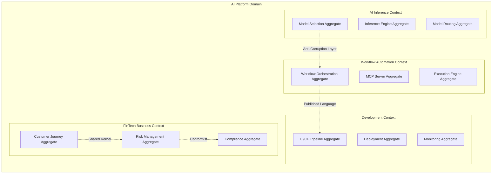

#### **Event-Driven Architecture Patterns**

```mermaid
graph TB
    subgraph "Event Sourcing Pattern"
        CMD[Command Handler]
        AGG[Aggregate Root]
        ES[Event Store]
        PROJ[Event Projections]
        
        CMD --> AGG
        AGG --> ES
        ES --> PROJ
    end
    
    subgraph "CQRS Pattern"
        WRITE[Write Side - Commands]
        READ[Read Side - Queries]
        EVENT[Domain Events]
        
        WRITE --> EVENT
        EVENT --> READ
    end
    
    subgraph "Publish-Subscribe Pattern"
        PUB[Event Publishers]
        BUS[Event Bus]
        SUB[Event Subscribers]
        
        PUB --> BUS
        BUS --> SUB
    end
    
    subgraph "Saga Pattern"
        ORCH[Orchestration Saga]
        CHOR[Choreography Saga]
        COMP[Compensation Actions]
        
        ORCH --> COMP
        CHOR --> COMP
    end
```

#### **Hexagonal Architecture (Ports and Adapters)**

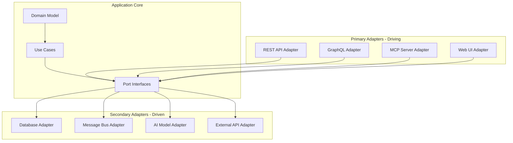

### **Layered Architecture Pattern**

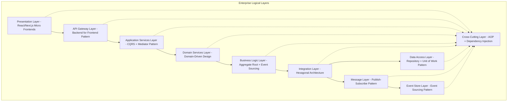

---

## ☁️ 2. Cloud Infrastructure Implementation

### **Azure Physical Infrastructure Topology**

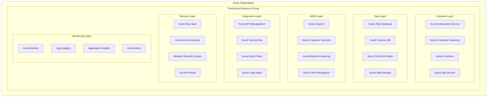

### **Network Architecture - Azure Virtual Network**

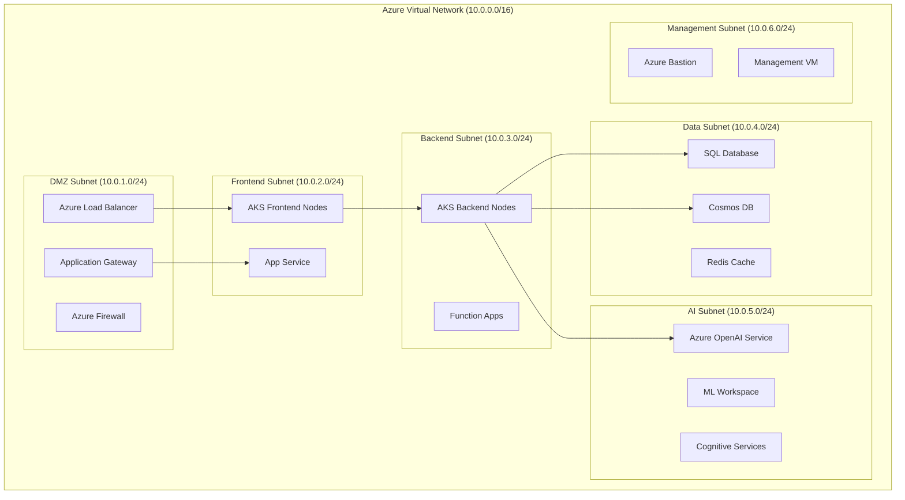

### **Deployment Pipeline - Azure DevOps**

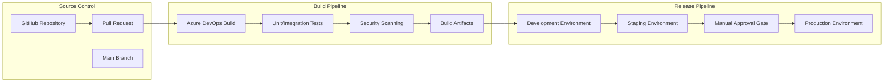

---

## 🔄 3. Sequence Diagrams for AI Applications

### **3.1 AI Inference Application - Foundation Model Selection**

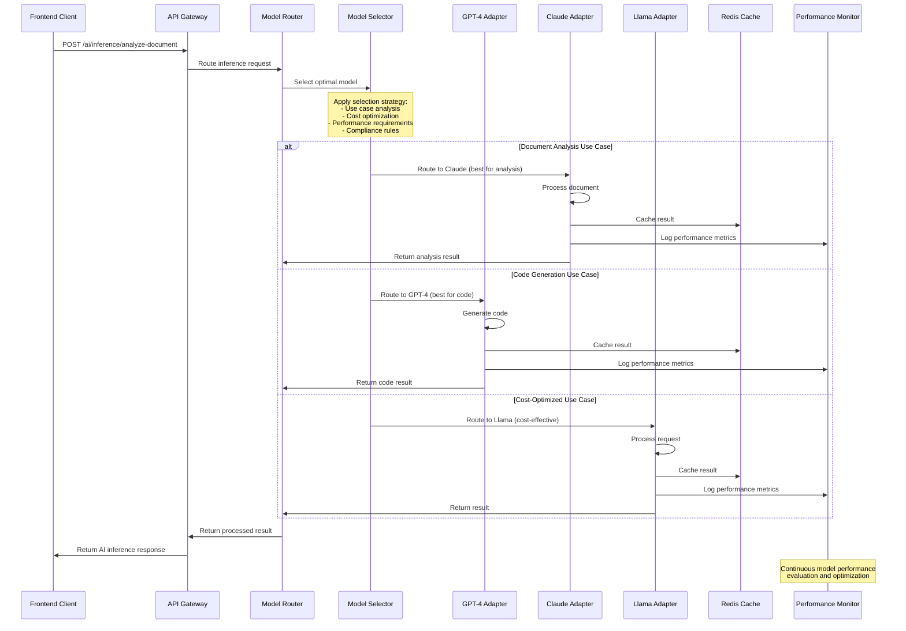

### **3.2 Agentic Business Workflow Automation - MCP Orchestration**

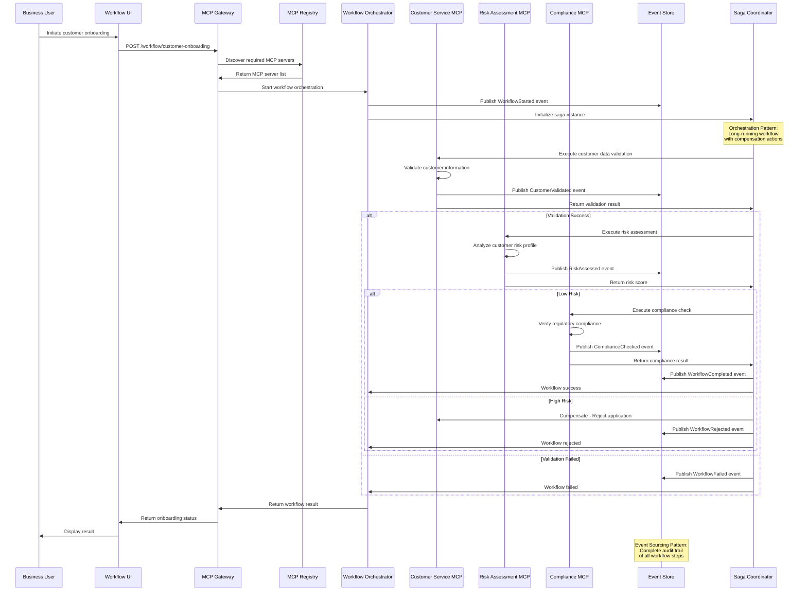

### **3.3 Agentic End-to-End Development - Automated Pipeline**

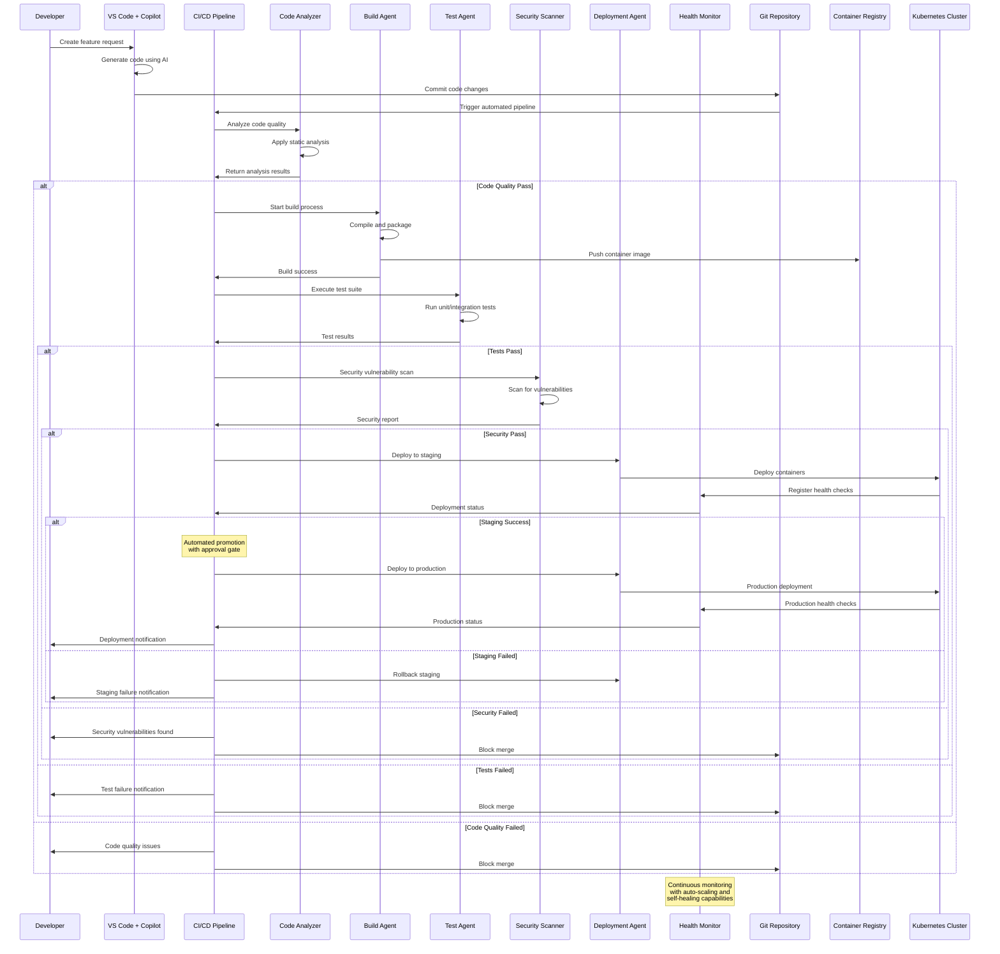

---

## 📋 Architecture Summary

### **Key Architectural Decisions**

1. **Logical Separation**: Clear distinction between architectural patterns and physical infrastructure
2. **Pattern-First Design**: Architecture patterns drive implementation, not infrastructure constraints
3. **Event-Driven Foundation**: Event sourcing and CQRS enable scalability and auditability
4. **Domain-Driven Design**: Bounded contexts ensure clear business domain separation
5. **Hexagonal Architecture**: Ports and adapters enable testability and flexibility
6. **Cloud-Native Implementation**: Azure services provide enterprise-grade scalability and reliability

### **Architecture Benefits**

- **Maintainability**: Clear separation of concerns through layered architecture
- **Scalability**: Event-driven patterns support horizontal scaling
- **Testability**: Hexagonal architecture enables comprehensive testing
- **Flexibility**: Adapter patterns allow technology stack evolution
- **Reliability**: Saga patterns ensure consistent distributed transactions
- **Observability**: Event sourcing provides complete system audit trails

### **Technology Stack Alignment**

| **Logical Pattern** | **Azure Implementation** | **Purpose** |
|-------------------|------------------------|-------------|
| **Micro Frontend Pattern** | Azure Static Web Apps | Frontend scalability |
| **API Gateway Pattern** | Azure API Management | Centralized API management |
| **Event Sourcing** | Azure Event Hubs + Cosmos DB | Event persistence |
| **CQRS Pattern** | Azure SQL + Cosmos DB | Read/write optimization |
| **Saga Pattern** | Azure Service Bus + Logic Apps | Distributed transactions |
| **Circuit Breaker** | Azure Application Gateway | Resilience patterns |
| **Repository Pattern** | Azure Data Factory | Data access abstraction |

This architecture summary provides a comprehensive view of how logical architectural patterns map to cloud infrastructure implementation while maintaining clear separation of concerns.
