# AI Platform Architecture Summary

## 🏗️ 1. End-to-End Logical Enterprise Architecture

### **Architecture Patterns Foundation**

Our logical enterprise architecture is built on proven architectural patterns, independent of any physical infrastructure implementation:

#### **Core Architecture Patterns**


#### **Domain-Driven Design Bounded Contexts**


#### **Event-Driven Architecture Patterns**


#### **Hexagonal Architecture (Ports and Adapters)**


### **13-Layer Enterprise Architecture Stack**

Our platform implements a comprehensive enterprise architecture spanning all critical business and technical layers:

#### **Enterprise Stack Overview**

| **Layer** | **Purpose** | **Key Technologies** | **Business Impact** |
|-----------|-------------|---------------------|-------------------|
| **Security** | Zero Trust Protection | OAuth 2.0, JWT, Azure AD | Comprehensive data protection & compliance |
| **Monitoring** | Real-time Observability | Application Insights, Prometheus | Proactive issue detection & resolution |
| **DevOps** | Automated Operations | Azure DevOps, GitHub Actions | Accelerated delivery & reduced errors |
| **Frontend** | User Experience | React 19, Next.js 15 | Enhanced user engagement & productivity |
| **API Gateway** | Service Orchestration | Spring Cloud Gateway | Simplified integration & performance |
| **MCP Gateway** | AI Tool Coordination | Custom MCP Implementation | Intelligent workflow automation |
| **MCP Framework** | AI Agent Platform | Java MCP, Spring AI | Agentic business process automation |
| **AI Platform** | Machine Intelligence | Azure ML, OpenAI | Advanced decision support & prediction |
| **Microservices** | Business Domains | Spring Boot, Domain Services | Scalable business capability delivery |
| **Message Queue** | Event Communication | Azure Service Bus, Kafka | Reliable real-time data exchange |
| **Event Streaming** | Real-time Processing | Apache Kafka, Flink | Live business intelligence & response |
| **Data Platform** | Analytics & ML | Azure Databricks, Spark | Data-driven business insights |
| **Infrastructure** | Cloud Foundation | Azure Kubernetes Service | Scalable, resilient platform foundation |

#### **Enhanced 13-Layer Enterprise Architecture Stack**

Our platform implements a comprehensive enterprise architecture spanning all critical business and technical layers with detailed architectural patterns:

##### **Comprehensive Layer Analysis**

| **Layer** | **Purpose** | **Key Technologies** | **Architectural Patterns** | **Business Impact** |
|-----------|-------------|---------------------|---------------------------|-------------------|
| **Security** | Zero Trust Protection | OAuth 2.0, JWT, Azure AD, RBAC, SAML | Identity Provider Pattern, Token Validation Pattern, Zero Trust Architecture | Comprehensive data protection & compliance |
| **Monitoring** | Real-time Observability | Application Insights, Prometheus, Grafana, ELK Stack | Observer Pattern, Circuit Breaker, Health Check Pattern | Proactive issue detection & resolution |
| **DevOps** | Automated Operations | Azure DevOps, GitHub Actions, Terraform, Helm | Pipeline Pattern, Infrastructure as Code, GitOps | Accelerated delivery & reduced errors |
| **Frontend** | User Experience | React 19, Next.js 15, Micro-Frontends, PWA | Micro Frontend Pattern, BFF Pattern, State Management | Enhanced user engagement & productivity |
| **API Gateway** | Service Orchestration | Spring Cloud Gateway, Kong, Istio Service Mesh | Gateway Pattern, Rate Limiting, Load Balancing | Simplified integration & performance |
| **MCP Gateway** | AI Tool Coordination | Custom MCP Implementation, OpenAPI, GraphQL | Adapter Pattern, Facade Pattern, Command Pattern | Intelligent workflow automation |
| **MCP Framework** | AI Agent Platform | Java MCP, Spring AI, LangChain4j | Agent Pattern, Strategy Pattern, Chain of Responsibility | Agentic business process automation |
| **AI Platform** | Machine Intelligence | Azure ML, OpenAI, Hugging Face, MLflow | Model Factory Pattern, Inference Pipeline, A/B Testing | Advanced decision support & prediction |
| **Microservices** | Business Domains | Spring Boot, Domain Services, Docker, K8s | Domain-Driven Design, Hexagonal Architecture, CQRS | Scalable business capability delivery |
| **Message Queue** | Event Communication | Azure Service Bus, RabbitMQ, Apache Kafka | Publisher-Subscriber, Message Router, Dead Letter Queue | Reliable real-time data exchange |
| **Event Streaming** | Real-time Processing | Apache Kafka, Apache Flink, Azure Stream Analytics | Event Sourcing, CQRS, Saga Pattern | Live business intelligence & response |
| **Data Platform** | Analytics & ML | Azure Databricks, Apache Spark, Delta Lake | Data Lake Pattern, Lambda Architecture, Data Mesh | Data-driven business insights |
| **Infrastructure** | Cloud Foundation | Azure Kubernetes Service, Docker, Terraform | Container Orchestration, Auto-scaling, Blue-Green | Scalable, resilient platform foundation |

##### **Layer Interaction Architecture**

```mermaid
graph TB
    subgraph "Cross-Cutting Concerns"
        SEC[Security Layer<br/>• Zero Trust Architecture<br/>• Identity Provider Pattern<br/>• Token Validation]
        MON[Monitoring Layer<br/>• Observer Pattern<br/>• Circuit Breaker<br/>• Health Check Pattern]
        DEV[DevOps Layer<br/>• Pipeline Pattern<br/>• Infrastructure as Code<br/>• GitOps Pattern]
    end
    
    subgraph "Enterprise Technology Stack"
        FE[Frontend Layer<br/>• Micro Frontend Pattern<br/>• BFF Pattern<br/>• State Management]
        API[API Gateway Layer<br/>• Gateway Pattern<br/>• Rate Limiting<br/>• Load Balancing]
        MCP_GW[MCP Gateway Layer<br/>• Adapter Pattern<br/>• Facade Pattern<br/>• Command Pattern]
        MCP_FW[MCP Framework Layer<br/>• Agent Pattern<br/>• Strategy Pattern<br/>• Chain of Responsibility]
        AI[AI Platform Layer<br/>• Model Factory Pattern<br/>• Inference Pipeline<br/>• A/B Testing]
        MS[Microservices Layer<br/>• Domain-Driven Design<br/>• Hexagonal Architecture<br/>• CQRS]
        MQ[Message Queue Layer<br/>• Publisher-Subscriber<br/>• Message Router<br/>• Dead Letter Queue]
        ES[Event Streaming Layer<br/>• Event Sourcing<br/>• CQRS<br/>• Saga Pattern]
        DP[Data Platform Layer<br/>• Data Lake Pattern<br/>• Lambda Architecture<br/>• Data Mesh]
        INFRA[Infrastructure Layer<br/>• Container Orchestration<br/>• Auto-scaling<br/>• Blue-Green Deployment]
    end
    
    SEC -.->|Zero Trust Security| FE
    SEC -.->|Identity & Access| API
    SEC -.->|Service-to-Service Auth| MS
    SEC -.->|Data Encryption| DP
    
    MON -.->|User Experience Metrics| FE
    MON -.->|API Performance| API
    MON -.->|Service Health| MS
    MON -.->|Infrastructure Metrics| INFRA
    
    DEV -.->|Frontend Deployment| FE
    DEV -.->|API Deployment| API
    DEV -.->|Service Deployment| MS
    DEV -.->|Infrastructure Provisioning| INFRA
    
    FE --> API
    API --> MCP_GW
    MCP_GW --> MCP_FW
    MCP_FW --> AI
    AI --> MS
    MS --> MQ
    MQ --> ES
    ES --> DP
    DP --> INFRA
    
    classDef securityLayer fill:#ff6b6b,stroke:#d63031,stroke-width:2px,color:#fff
    classDef monitoringLayer fill:#74b9ff,stroke:#0984e3,stroke-width:2px,color:#fff
    classDef devopsLayer fill:#00b894,stroke:#00a085,stroke-width:2px,color:#fff
    classDef applicationLayer fill:#fdcb6e,stroke:#e17055,stroke-width:2px,color:#000
    
##### **13-Layer Data Flow Architecture**

```mermaid
graph TD
    subgraph "User Interaction Flow"
        USER[End User]
        AUTH[Authentication Gateway]
        UI[React Frontend - Layer 4]
    end
    
    subgraph "Security Layer - Layer 1"
        SEC_GATEWAY[Security Gateway]
        SEC_VAULT[Key Vault]
        SEC_POLICY[Policy Engine]
    end
    
    subgraph "Monitoring Layer - Layer 2"
        MON_COLLECT[Metrics Collector]
        MON_ALERT[Alert Manager]
        MON_DASH[Monitoring Dashboard]
    end
    
    subgraph "DevOps Layer - Layer 3"
        DEV_PIPELINE[CI/CD Pipeline]
        DEV_CONFIG[Config Manager]
        DEV_DEPLOY[Deployment Engine]
    end
    
    subgraph "API & Service Orchestration"
        API_GW[API Gateway - Layer 5]
        MCP_GW[MCP Gateway - Layer 6]
        MCP_FW[MCP Framework - Layer 7]
    end
    
    subgraph "Intelligence Layer"
        AI_PLATFORM[AI Platform - Layer 8]
        AI_MODELS[Foundation Models]
        AI_INFERENCE[Inference Engine]
    end
    
    subgraph "Business Logic Layer"
        MICROSERVICES[Microservices - Layer 9]
        DOMAIN_SERVICES[Domain Services]
        BUSINESS_RULES[Business Rules Engine]
    end
    
    subgraph "Communication Layer"
        MESSAGE_QUEUE[Message Queue - Layer 10]
        EVENT_STREAMING[Event Streaming - Layer 11]
        EVENT_STORE[Event Store]
    end
    
    subgraph "Data & Infrastructure"
        DATA_PLATFORM[Data Platform - Layer 12]
        ANALYTICS[Analytics Engine]
        INFRASTRUCTURE[Infrastructure - Layer 13]
        COMPUTE[Compute Resources]
        STORAGE[Storage Systems]
    end
    
    %% User Flow
    USER --> AUTH
    AUTH --> SEC_GATEWAY
    SEC_GATEWAY --> UI
    
    %% Security Cross-Cutting
    SEC_GATEWAY -.->|Secure All Layers| API_GW
    SEC_VAULT -.->|Secrets Management| MCP_FW
    SEC_POLICY -.->|Access Control| MICROSERVICES
    
    %% Monitoring Cross-Cutting
    MON_COLLECT -.->|Metrics| UI
    MON_COLLECT -.->|Metrics| API_GW
    MON_COLLECT -.->|Metrics| MICROSERVICES
    MON_ALERT -.->|Alerts| DEV_PIPELINE
    
    %% DevOps Cross-Cutting
    DEV_PIPELINE -.->|Deploy| UI
    DEV_PIPELINE -.->|Deploy| API_GW
    DEV_PIPELINE -.->|Deploy| MICROSERVICES
    DEV_CONFIG -.->|Configuration| INFRASTRUCTURE
    
    %% Main Data Flow
    UI --> API_GW
    API_GW --> MCP_GW
    MCP_GW --> MCP_FW
    MCP_FW --> AI_PLATFORM
    AI_PLATFORM --> AI_MODELS
    AI_MODELS --> AI_INFERENCE
    AI_INFERENCE --> MICROSERVICES
    MICROSERVICES --> DOMAIN_SERVICES
    DOMAIN_SERVICES --> BUSINESS_RULES
    MICROSERVICES --> MESSAGE_QUEUE
    MESSAGE_QUEUE --> EVENT_STREAMING
    EVENT_STREAMING --> EVENT_STORE
    EVENT_STREAMING --> DATA_PLATFORM
    DATA_PLATFORM --> ANALYTICS
    DATA_PLATFORM --> INFRASTRUCTURE
    INFRASTRUCTURE --> COMPUTE
    INFRASTRUCTURE --> STORAGE
    
    %% Feedback Loops
    ANALYTICS -.->|Insights| AI_PLATFORM
    EVENT_STORE -.->|Event Replay| MICROSERVICES
    STORAGE -.->|Persistence| MICROSERVICES
```

##### **Enterprise Pattern Flow by Layer**

```mermaid
graph LR
    subgraph "Layer 1-3: Cross-Cutting Concerns"
        SEC[Security Patterns<br/>• Zero Trust<br/>• Identity Provider<br/>• Token Validation]
        MON[Monitoring Patterns<br/>• Observer<br/>• Circuit Breaker<br/>• Health Check]
        DEV[DevOps Patterns<br/>• Pipeline<br/>• Infrastructure as Code<br/>• GitOps]
    end
    
    subgraph "Layer 4-7: Presentation & Gateway"
        FE[Frontend Patterns<br/>• Micro Frontend<br/>• BFF<br/>• State Management]
        API[API Gateway Patterns<br/>• Gateway<br/>• Rate Limiting<br/>• Load Balancing]
        MCP_G[MCP Gateway Patterns<br/>• Adapter<br/>• Facade<br/>• Command]
        MCP_F[MCP Framework Patterns<br/>• Agent<br/>• Strategy<br/>• Chain of Responsibility]
    end
    
    subgraph "Layer 8-9: Intelligence & Business"
        AI[AI Platform Patterns<br/>• Model Factory<br/>• Inference Pipeline<br/>• A/B Testing]
        MS[Microservice Patterns<br/>• DDD<br/>• Hexagonal<br/>• CQRS]
    end
    
    subgraph "Layer 10-13: Data & Infrastructure"
        MQ[Message Queue Patterns<br/>• Publisher-Subscriber<br/>• Message Router<br/>• Dead Letter Queue]
        ES[Event Streaming Patterns<br/>• Event Sourcing<br/>• CQRS<br/>• Saga]
        DP[Data Platform Patterns<br/>• Data Lake<br/>• Lambda Architecture<br/>• Data Mesh]
        INFRA[Infrastructure Patterns<br/>• Container Orchestration<br/>• Auto-scaling<br/>• Blue-Green]
    end
    
    SEC --> FE
    MON --> API
    DEV --> MCP_G
    
    FE --> API
    API --> MCP_G
    MCP_G --> MCP_F
    MCP_F --> AI
    AI --> MS
    MS --> MQ
    MQ --> ES
    ES --> DP
    DP --> INFRA
```



---

| **Layer** | **Primary Patterns** | **Supporting Patterns** | **Integration Patterns** |
|-----------|---------------------|------------------------|------------------------|
| **Security** | Zero Trust, Identity Provider | Token Validation, RBAC, Multi-Factor Auth | SAML Federation, OAuth 2.0 Flow |
| **Monitoring** | Observer, Circuit Breaker | Health Check, Bulkhead, Timeout | Distributed Tracing, Log Aggregation |
| **DevOps** | Pipeline, Infrastructure as Code | GitOps, Blue-Green Deployment | Feature Flags, Canary Releases |
| **Frontend** | Micro Frontend, BFF | State Management, Component Library | Module Federation, Lazy Loading |
| **API Gateway** | Gateway, Rate Limiting | Load Balancing, Request/Response Transform | Service Discovery, API Composition |
| **MCP Gateway** | Adapter, Facade | Command, Proxy | Protocol Translation, Message Routing |
| **MCP Framework** | Agent, Strategy | Chain of Responsibility, Observer | Workflow Orchestration, Event Handling |
| **AI Platform** | Model Factory, Pipeline | A/B Testing, Feature Store | Model Registry, Inference Caching |
| **Microservices** | DDD, Hexagonal | CQRS, Event Sourcing | Bounded Context, Anti-Corruption Layer |
| **Message Queue** | Publisher-Subscriber, Router | Dead Letter Queue, Priority Queue | Message Transformation, Retry Logic |
| **Event Streaming** | Event Sourcing, CQRS | Saga, Outbox | Event Store, Projection Building |
| **Data Platform** | Data Lake, Lambda Architecture | Data Mesh, CQRS | ETL Pipeline, Data Lineage |
| **Infrastructure** | Container Orchestration, Auto-scaling | Blue-Green, Immutable Infrastructure | Service Mesh, Configuration Management |

##### **Cross-Layer Communication Patterns**


---

## ☁️ 2. Cloud Infrastructure Implementation

### **Azure Physical Infrastructure Topology**


### **Network Architecture - Azure Virtual Network**


### **Deployment Pipeline - Azure DevOps**


---

## 🔄 3. Sequence Diagrams for AI Applications

### **3.1 AI Inference Application - Foundation Model Selection**


### **3.2 Agentic Business Workflow Automation - MCP Orchestration**


### **3.3 Agentic End-to-End Development - Automated Pipeline**


---

## 🏛️ 4. Enterprise Patterns Implementation Guide

### **Layer-Specific Pattern Implementation**

#### **Layer 1: Security Patterns**


**Security Pattern Implementation:**
- **Zero Trust**: Never trust, always verify - all requests authenticated and authorized
- **Identity Provider**: Centralized identity management with Azure AD integration
- **Token Validation**: JWT token validation at each service boundary
- **RBAC**: Fine-grained permissions based on roles and policies
- **MFA**: Multi-factor authentication for sensitive operations

#### **Layer 2: Monitoring Patterns**


**Monitoring Pattern Implementation:**
- **Observer**: Real-time event monitoring and notification
- **Circuit Breaker**: Automatic failure detection and recovery
- **Health Check**: Continuous service health validation
- **Bulkhead**: Resource isolation to prevent cascade failures
- **Timeout**: Request timeout management for resilience

#### **Layer 3: DevOps Patterns**


**DevOps Pattern Implementation:**
- **Pipeline**: Automated CI/CD with quality gates
- **Infrastructure as Code**: Terraform-managed infrastructure
- **GitOps**: Git-driven deployment and configuration
- **Blue-Green**: Zero-downtime deployments
- **Canary**: Gradual feature rollouts with monitoring

#### **Layer 6-7: MCP Gateway & Framework Patterns**


**MCP Pattern Implementation:**
- **Adapter**: Protocol translation between different AI tools
- **Facade**: Simplified interface for complex MCP operations
- **Command**: Encapsulation of MCP requests as objects
- **Agent**: Autonomous AI agents with specific capabilities
- **Strategy**: Dynamic selection of AI tools and models
- **Chain of Responsibility**: Sequential processing through MCP servers

#### **Layer 8: AI Platform Patterns**


**AI Platform Pattern Implementation:**
- **Model Factory**: Dynamic creation of AI model instances
- **Inference Pipeline**: Standardized AI inference workflow
- **A/B Testing**: Continuous model performance comparison
- **Feature Store**: Centralized feature management
- **Model Registry**: Versioned model artifact management

### **Cross-Layer Pattern Integration**

#### **Event-Driven Architecture Across All Layers**


---

## 📋 Architecture Summary

### **Key Architectural Decisions**

1. **13-Layer Enterprise Stack**: Comprehensive coverage from infrastructure to security with cross-cutting concerns
2. **Logical Separation**: Clear distinction between architectural patterns and physical infrastructure  
3. **Pattern-First Design**: Architecture patterns drive implementation, not infrastructure constraints
4. **Event-Driven Foundation**: Event sourcing and CQRS enable scalability and auditability
5. **Domain-Driven Design**: Bounded contexts ensure clear business domain separation
6. **Hexagonal Architecture**: Ports and adapters enable testability and flexibility
7. **MCP Framework Integration**: AI agent platform enabling agentic business process automation
8. **Cloud-Native Implementation**: Azure services provide enterprise-grade scalability and reliability

### **Architecture Benefits**

- **Maintainability**: Clear separation of concerns through layered architecture
- **Scalability**: Event-driven patterns support horizontal scaling
- **Testability**: Hexagonal architecture enables comprehensive testing
- **Flexibility**: Adapter patterns allow technology stack evolution
- **Reliability**: Saga patterns ensure consistent distributed transactions
- **Observability**: Event sourcing provides complete system audit trails

### **Technology Stack Alignment**

| **Logical Pattern** | **Azure Implementation** | **Purpose** |
|-------------------|------------------------|-------------|
| **Micro Frontend Pattern** | Azure Static Web Apps | Frontend scalability |
| **API Gateway Pattern** | Azure API Management | Centralized API management |
| **Event Sourcing** | Azure Event Hubs + Cosmos DB | Event persistence |
| **CQRS Pattern** | Azure SQL + Cosmos DB | Read/write optimization |
| **Saga Pattern** | Azure Service Bus + Logic Apps | Distributed transactions |
| **Circuit Breaker** | Azure Application Gateway | Resilience patterns |
| **Repository Pattern** | Azure Data Factory | Data access abstraction |

This architecture summary provides a comprehensive view of how logical architectural patterns map to cloud infrastructure implementation while maintaining clear separation of concerns.
