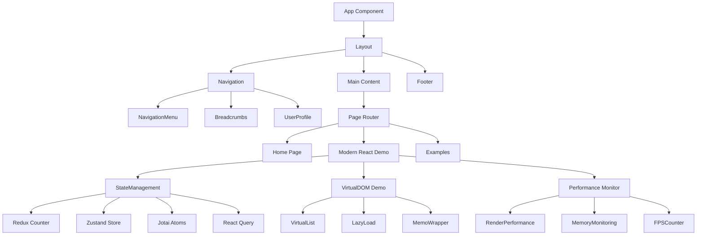
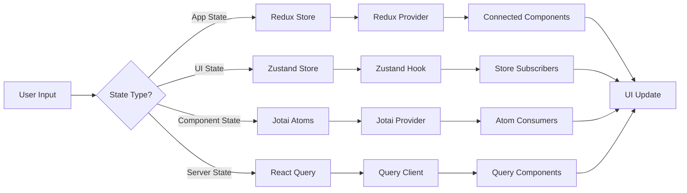
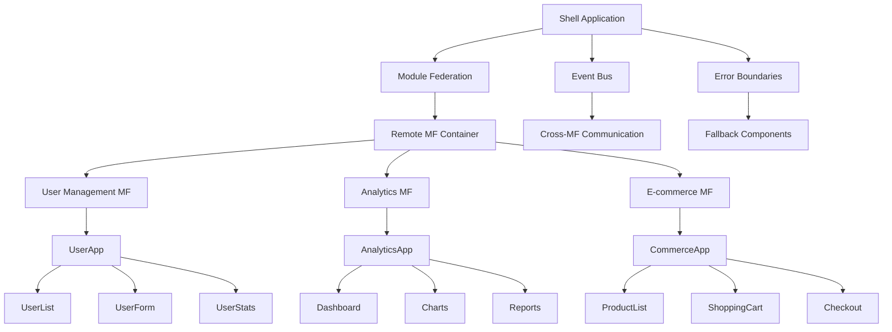
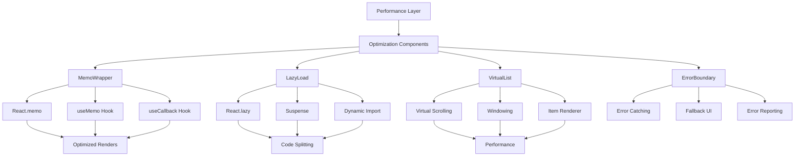
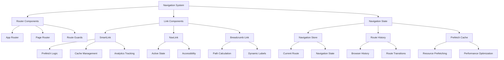
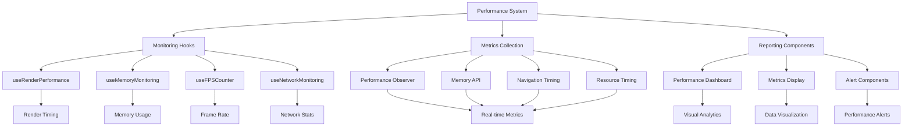
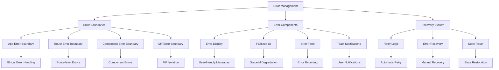
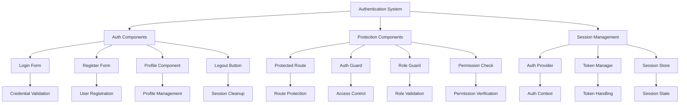
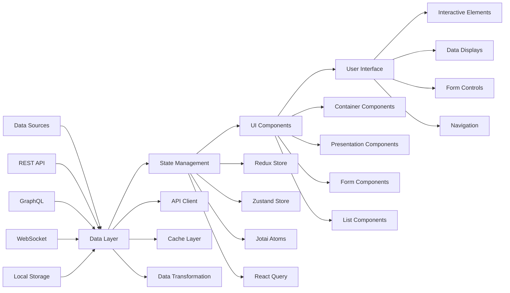
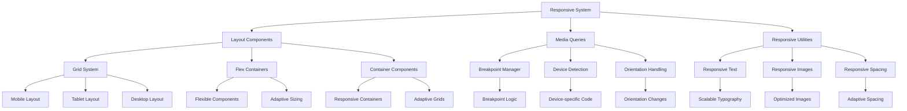

# Component Interaction Diagrams

This document contains detailed component interaction diagrams for the React + Next.js architecture.

## 1. React Component Hierarchy

## 2. State Management Component Flow

## 3. Micro-Frontend Component Architecture

## 4. Virtual DOM Optimization Components

## 5. Navigation Component System

## 6. Performance Monitoring Components

## 7. Error Handling Component Tree

## 8. Authentication Component Flow

## 9. Data Flow Component Architecture

## 10. Responsive Design Component System

## Component Interaction Summary

These diagrams illustrate:

1. **Component Hierarchy**: How React components are organized and nested
2. **State Flow**: How different state management patterns interact with components
3. **Micro-Frontend Structure**: Component organization in a micro-frontend architecture
4. **Performance Optimization**: Components responsible for Virtual DOM optimization
5. **Navigation System**: How routing and navigation components work together
6. **Monitoring Integration**: Performance monitoring component relationships
7. **Error Handling**: Error boundary and recovery component structure
8. **Authentication Flow**: Security and authentication component interactions
9. **Data Architecture**: How data flows through the component system
10. **Responsive Design**: Component structure for responsive layouts

Each diagram shows the relationships between components and how they collaborate to create a cohesive, performant, and maintainable application architecture.
