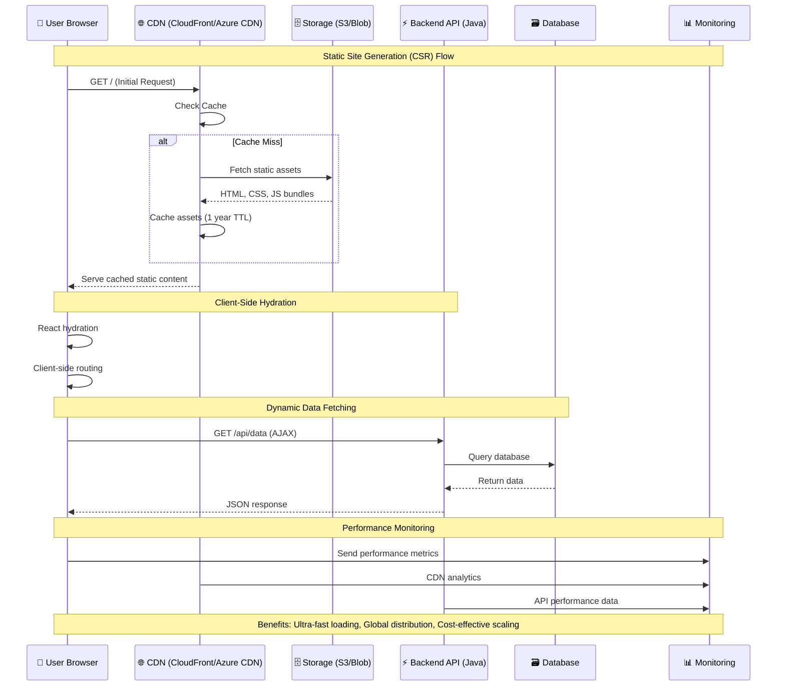
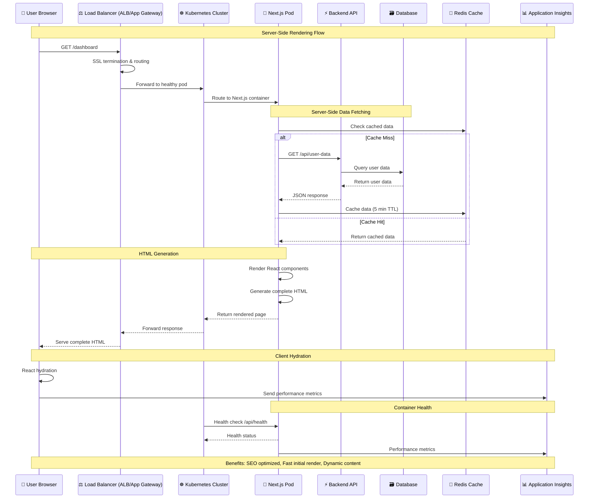
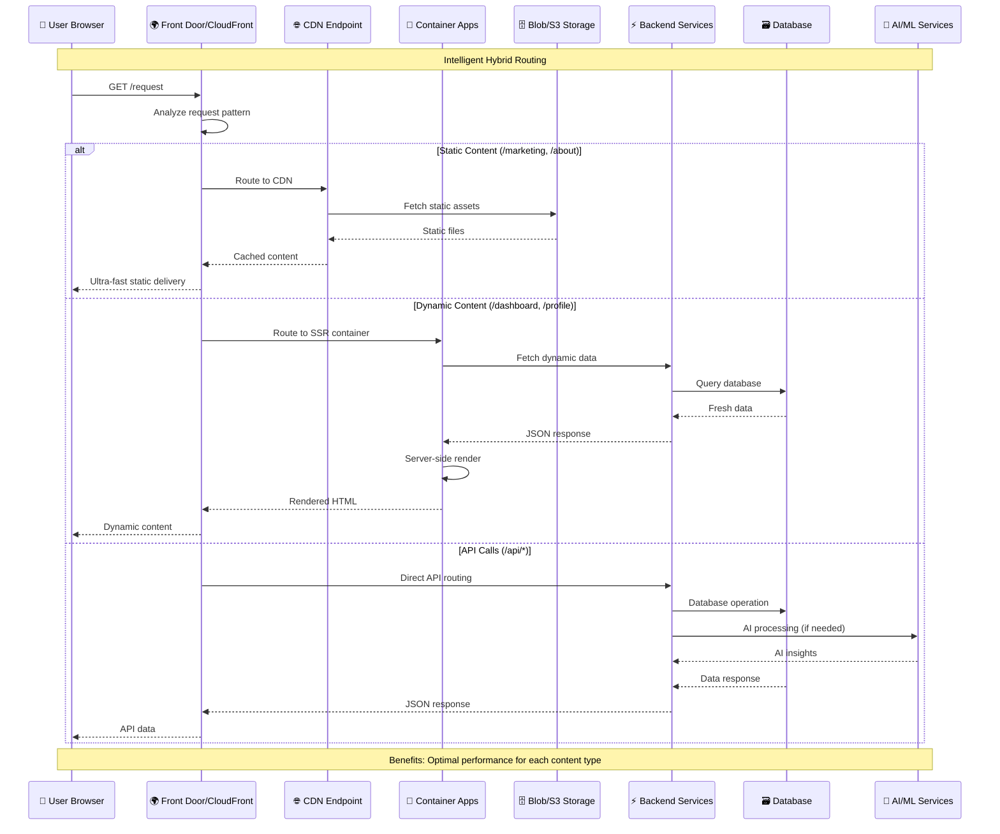
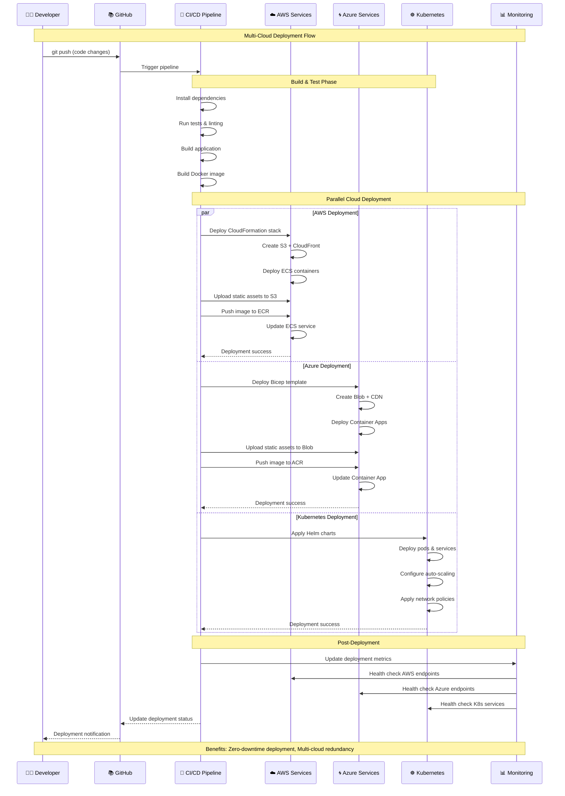
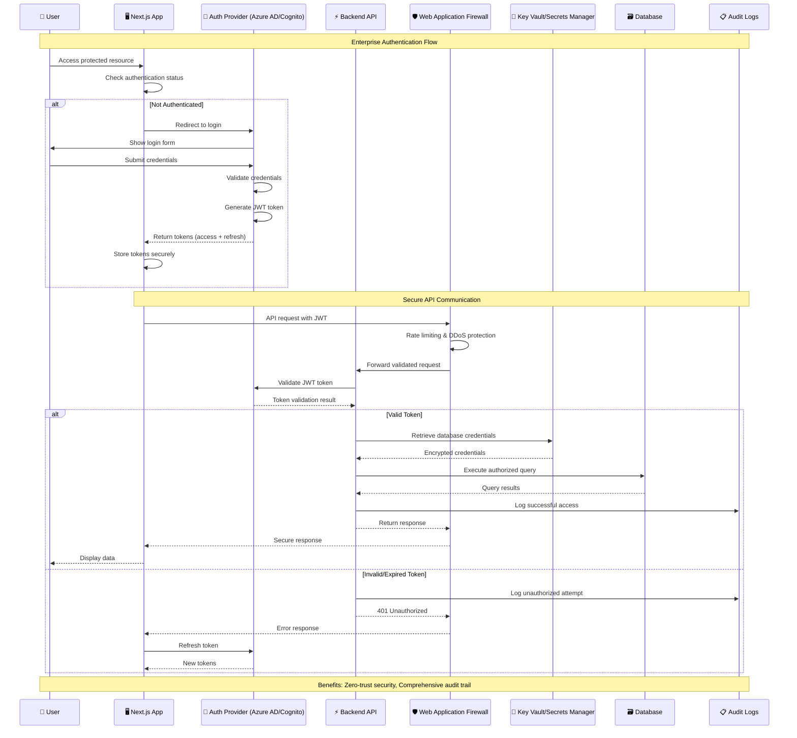
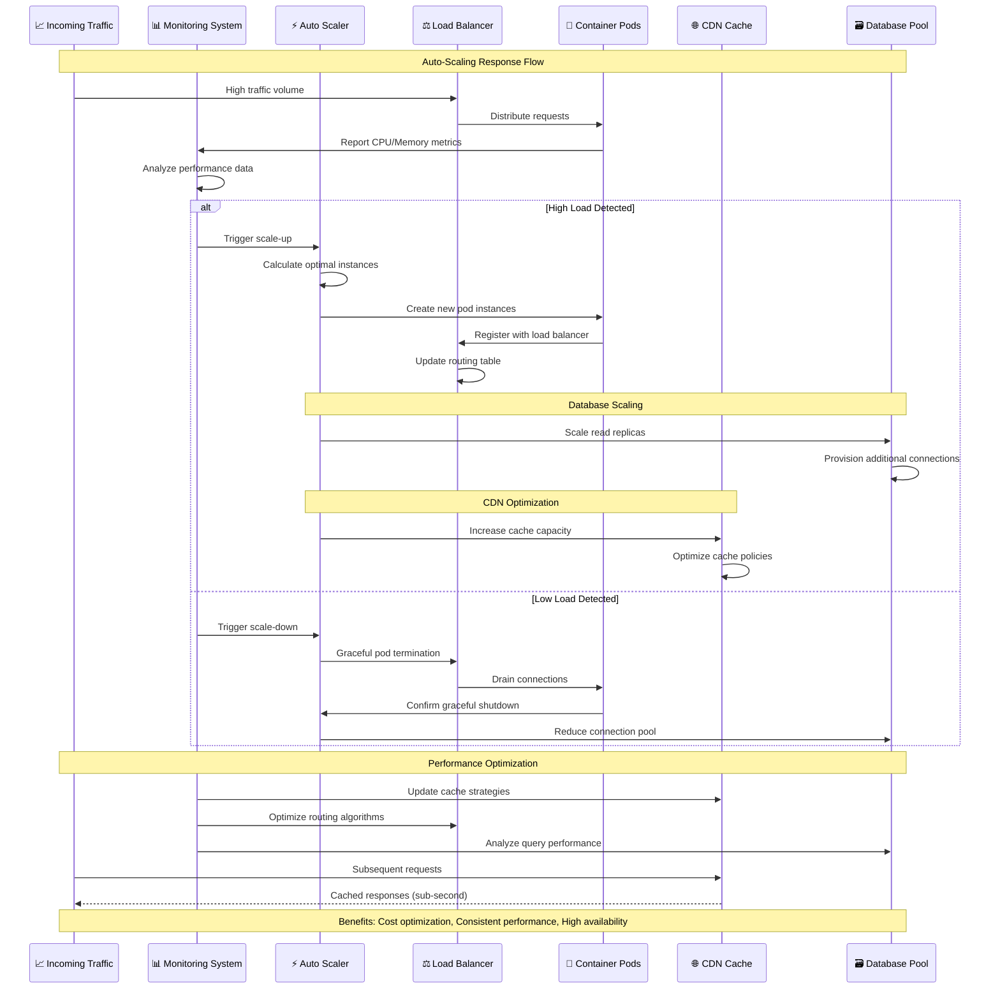
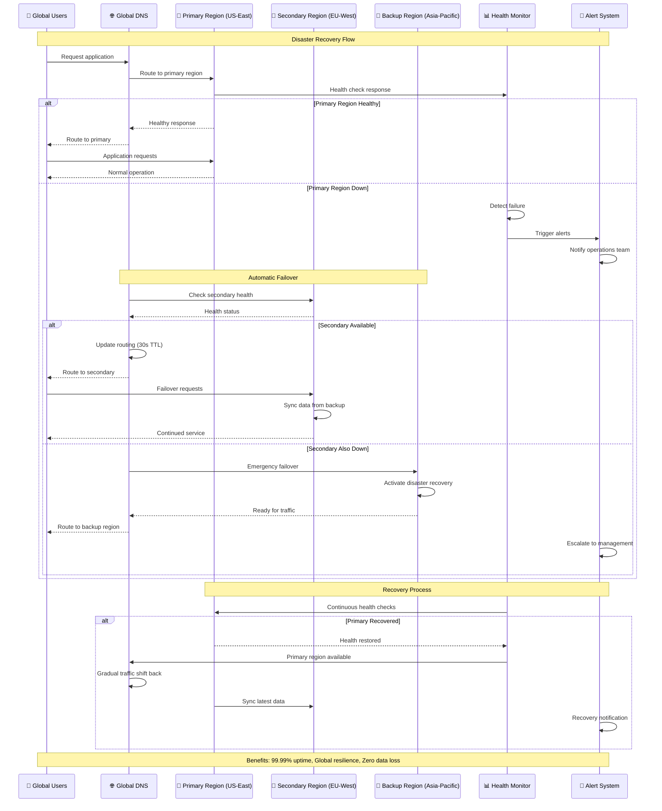

# Enterprise-Grade Modern Web Application Architecture
## Sequence Diagrams for Production Design

This document contains comprehensive sequence diagrams that illustrate the enterprise-grade design patterns and architectural flows of our modern React/Next.js application with multi-cloud deployment capabilities.

## 1. Static Generation (CSR) with CDN Architecture



## 2. Server-Side Rendering (SSR) with Container Architecture



## 3. Hybrid Architecture with Intelligent Routing



## 4. Multi-Cloud Deployment Pipeline



## 5. Enterprise Security & Authentication Flow



## 6. Auto-Scaling & Performance Optimization



## 7. Disaster Recovery & Multi-Region Failover



## Analysis & Enhancement Recommendations

Based on these sequence diagrams, here are the areas we should enhance:

### 🔍 **Current Strengths**
1. ✅ **Multi-Cloud Architecture**: Comprehensive AWS/Azure support
2. ✅ **Hybrid Deployment**: Static + SSR optimization  
3. ✅ **Container Orchestration**: Kubernetes with auto-scaling
4. ✅ **Security**: Enterprise-grade authentication & authorization
5. ✅ **Monitoring**: Application Insights & health checks

### 🚀 **Recommended Enhancements**

#### 1. **Advanced Observability** 
```
Need: Distributed tracing, APM, custom metrics
Implementation: OpenTelemetry, Jaeger, Prometheus
```

#### 2. **Chaos Engineering**
```
Need: Resilience testing, failure simulation
Implementation: Chaos Monkey, Gremlin integration
```

#### 3. **Advanced Caching Strategy**
```
Need: Multi-layer caching, cache invalidation
Implementation: Redis Cluster, CDN purging APIs
```

#### 4. **Global Database Strategy**
```
Need: Multi-region database replication
Implementation: Cosmos DB, Aurora Global Database
```

#### 5. **Enhanced Security**
```
Need: Zero-trust networking, secrets rotation
Implementation: Service mesh, HashiCorp Vault
```

#### 6. **Performance Analytics**
```
Need: Real User Monitoring (RUM), Core Web Vitals
Implementation: Google Analytics 4, Azure Monitor
```

Would you like me to implement any of these enhancements or create additional sequence diagrams for specific areas?
