# Executive Presentation: Strategic AI Platform Architecture
## Enterprise Principal Architect Design for C-Level Strategic Decision Making

---

## 📊 Executive Summary: Strategic AI Transformation

### **Vision Statement**
Transform your organization into an **AI-native enterprise leader** through a future-proof, vendor-independent, regulatory-compliant AI platform that delivers sustainable competitive advantage and measurable ROI.

### **Strategic Imperatives Addressed**
- ✅ **Technology Independence**: Eliminate vendor lock-in with multi-provider AI orchestration
- ✅ **Regulatory Excellence**: Built-in compliance for EU AI Act, GDPR, SOX, and emerging regulations
- ✅ **Competitive Differentiation**: Proprietary AI capabilities that create sustainable market advantage
- ✅ **Risk Mitigation**: Enterprise-grade security, resilience, and comprehensive audit capabilities
- ✅ **ROI Optimization**: Measurable business outcomes with significant return on investment

---

## 🏗️ 1. Architecture Overview: Strategic Foundation

### **1.1 Enhanced 13-Layer Enterprise Architecture**

### **1.2 Strategic Technology Independence Framework**

| **Technology Category** | **Primary Provider** | **Secondary Provider** | **Open Source Fallback** | **Vendor Independence Score** |
|------------------------|---------------------|------------------------|--------------------------|-------------------------------|
| **Foundation Models** | Azure OpenAI | AWS Bedrock | Ollama/vLLM | Excellent |
| **ML Platform** | Azure ML | AWS SageMaker | Kubeflow | Excellent |
| **Vector Database** | Azure Cosmos DB | AWS OpenSearch | Weaviate | Very High |
| **Container Platform** | Azure AKS | AWS EKS | Self-managed K8s | Excellent |
| **Data Platform** | Azure Synapse | AWS Redshift | Apache Spark | Excellent |
| **Model Serving** | Azure ML Endpoints | AWS SageMaker | KServe | Excellent |

**Average Vendor Independence Score: Industry Leading**

---

## 💼 2. Business Value Proposition: Quantified Returns

### **2.1 Strategic Business Outcomes**

### **2.2 Quantified Business Impact Analysis**

| **Business Metric** | **Current State** | **Year 1 Target** | **Year 2 Target** | **Year 3 Target** | **Strategic Value** |
|---------------------|------------------|-------------------|-------------------|-------------------|-------------------|
| **Operational Efficiency** | Baseline | Significant improvement | Major improvement | Excellence | Substantial annual savings |
| **Customer Experience** | Good | Excellent | Outstanding | Market Leading | Strong customer growth |
| **Risk Management** | Reactive | Predictive | Proactive | Autonomous | Major risk reduction |
| **Regulatory Compliance** | Manual processes | Automated processes | Near-autonomous | Fully autonomous | Significant compliance savings |
| **Time to Market** | Current pace | Accelerated | Rapid | Ultra-rapid | Competitive advantage |
| **Decision Speed** | Days | Hours | Minutes | Real-time | Market leadership |

### **2.3 ROI Analysis: Investment vs. Returns**

---

## 🎯 3. Technology Strategy: Future-Proof AI Platform

### **3.1 Multi-Provider AI Orchestration Strategy**

### **3.2 Advanced AI Capabilities Matrix**

| **AI Capability** | **Technology Stack** | **Business Application** | **Competitive Advantage** | **Implementation Priority** |
|-------------------|---------------------|-------------------------|---------------------------|---------------------------|
| **Neuro-Symbolic AI** | GPT-4 + Knowledge Graphs | Explainable business decisions | **Market Differentiator** | **Critical** |
| **Multi-Agent Systems** | CrewAI + LangGraph | Complex workflow automation | **Operational Excellence** | **High** |
| **Computer Vision** | GPT-4 Vision + YOLO | Document processing automation | **Efficiency Multiplier** | **High** |
| **Real-time Analytics** | Streaming ML + Kafka | Instant decision making | **Speed Advantage** | **High** |
| **Edge AI Computing** | Quantized Models + Edge | Low-latency customer service | **Experience Excellence** | **Medium** |
| **Federated Learning** | Custom FL Framework | Privacy-preserving learning | **Trust Advantage** | **Medium** |

### **3.3 Global Multi-Cloud Infrastructure Strategy**

---

## 📅 4. Implementation Roadmap: Phased Strategic Execution

### **4.1 Strategic Implementation Timeline**

### **4.2 Phase-by-Phase Investment and Returns**

| **Phase** | **Duration** | **Investment** | **Key Deliverables** | **Expected Returns** | **Success Metrics** |
|-----------|-------------|---------------|---------------------|-------------------|-------------------|
| **Phase 1: Foundation** | 6 months | Strategic foundation investment | Technology independence, Core platform, Basic compliance | Significant efficiency gains | Excellent uptime, Low latency |
| **Phase 2: Intelligence** | 6 months | Advanced capabilities investment | Advanced AI, Multi-agent systems, Neuro-symbolic AI | Substantial automation value | Major process automation |
| **Phase 3: Transformation** | 6 months | Business integration investment | Business AI integration, Customer experience AI | Strong revenue growth | Enhanced customer satisfaction |
| **Phase 4: Leadership** | 6 months | Innovation investment | Innovation leadership, Strategic partnerships | Competitive market advantage | Industry recognition, Patents |

### **4.3 Critical Decision Gates**

---

## ⚠️ 5. Risk Mitigation: Comprehensive Protection Strategy

### **5.1 Strategic Risk Matrix**

| **Risk Category** | **Risk Level** | **Impact** | **Mitigation Strategy** | **Contingency Plan** |
|------------------|---------------|------------|----------------------|-------------------|
| **Technology Risk** | Medium | High | Multi-provider strategy | Immediate provider switching |
| **Security Risk** | Low | Critical | Zero-trust architecture | Incident response automation |
| **Regulatory Risk** | Medium | High | Built-in compliance | Automated reporting |
| **Vendor Lock-in** | Low | Medium | Open source alternatives | Technology independence |
| **Talent Risk** | Medium | Medium | Strategic hiring + training | External partnerships |
| **Market Risk** | Low | Medium | Continuous innovation | Competitive intelligence |

### **5.2 Business Continuity Framework**

### **5.3 Regulatory Compliance Excellence**

| **Regulation** | **Compliance Approach** | **Automation Level** | **Audit Readiness** | **Risk Mitigation** |
|---------------|------------------------|---------------------|-------------------|-------------------|
| **EU AI Act** | Built-in AI governance | 95% automated | Real-time audit trails | Proactive compliance |
| **GDPR** | Privacy by design | 99% automated | Automated reporting | Zero data breaches |
| **SOX** | Financial controls automation | 90% automated | Continuous monitoring | Control effectiveness |
| **Basel III** | Risk management automation | 85% automated | Real-time risk reporting | Risk optimization |
| **PCI DSS** | Payment security automation | 95% automated | Continuous compliance | Security excellence |

---

## 🎯 6. Competitive Advantage: Strategic Differentiation

### **6.1 Market Positioning Strategy**

### **6.2 Innovation Pipeline Strategy**

| **Innovation Area** | **Current State** | **6-Month Target** | **12-Month Target** | **Strategic Impact** |
|-------------------|------------------|-------------------|-------------------|-------------------|
| **Quantum-AI Integration** | Research | Proof of concept | Pilot deployment | Significant compute advantage |
| **Autonomous AI Operations** | Manual | Semi-automated | Fully autonomous | Major cost reduction |
| **Brain-Computer Interface** | Exploration | Prototype | Beta testing | Revolutionary UX |
| **Synthetic Data Generation** | Basic | Advanced | Production | Privacy + Performance |
| **AI-Driven Product Development** | Traditional | AI-assisted | AI-autonomous | Accelerated innovation |

---

## 📈 7. Success Metrics: Measurable Excellence

### **7.1 Key Performance Indicators (KPIs)**

### **7.2 Continuous Improvement Framework**

| **Metric Category** | **Baseline** | **Monthly Target** | **Quarterly Review** | **Annual Goal** |
|-------------------|-------------|-------------------|-------------------|----------------|
| **AI Model Performance** | Current accuracy | Continuous improvement | Strategic assessment | Significant improvement |
| **Customer Experience** | Current NPS | Regular enhancement | Experience optimization | Substantial improvement |
| **Operational Efficiency** | Current metrics | Steady improvement | Process optimization | Major improvement |
| **Security & Compliance** | Current state | Maintain excellence | Risk assessment | Zero incidents |
| **Innovation Velocity** | Current pace | Accelerated pace | Innovation review | Rapid innovation |

---

## 🚀 8. Call to Action: Strategic Implementation Authorization

### **8.1 Immediate Next Steps**

1. **Executive Authorization**: Approve strategic AI platform investment
2. **Governance Establishment**: Form AI Strategy Committee with C-level oversight
3. **Team Assembly**: Recruit world-class AI engineering and strategy teams
4. **Vendor Negotiations**: Secure strategic partnerships with technology providers
5. **Pilot Program Launch**: Begin Phase 1 implementation with selected use cases

### **8.2 Executive Decision Framework**

```mermaid
graph TB
    DECISION{Strategic AI Platform<br/>Investment Decision}
    
    APPROVE[✅ APPROVE<br/>Strategic AI Leadership]
    DEFER[⏸️ DEFER<br/>Risk Assessment]
    REJECT[❌ REJECT<br/>Status Quo]
    
    BENEFITS[📈 Benefits<br/>• Excellent ROI Achievement<br/>• Market Leadership<br/>• Competitive Moat<br/>• Regulatory Excellence]
    
    RISKS[⚠️ Risks<br/>• Strategic Investment Required<br/>• Technology Complexity<br/>• Market Competition<br/>• Execution Challenges]
    
    OUTCOMES_APPROVE[🎯 Outcomes<br/>• AI Innovation Leader<br/>• Sustainable Advantage<br/>• Premium Valuations<br/>• Industry Recognition]
    
    OUTCOMES_DEFER[⏳ Outcomes<br/>• Competitive Disadvantage<br/>• Market Share Loss<br/>• Technology Debt<br/>• Talent Exodus]
    
    DECISION --> APPROVE
    DECISION --> DEFER
    DECISION --> REJECT
    
    APPROVE --> BENEFITS --> OUTCOMES_APPROVE
    DEFER --> RISKS --> OUTCOMES_DEFER
    REJECT --> RISKS --> OUTCOMES_DEFER
```

### **8.3 Strategic Recommendation**

> **RECOMMENDATION: IMMEDIATE APPROVAL AND IMPLEMENTATION**
>
> The enhanced strategic AI platform represents a **transformational opportunity** to establish **industry leadership**, achieve **sustainable competitive advantage**, and deliver **exceptional shareholder value**.
>
> **Time is critical** - competitors are investing heavily in AI capabilities. **First-mover advantage** in enterprise AI will determine market leaders for the next decade.
>
> **Investment**: Strategic investment over implementation period
> **Returns**: Substantial value creation with excellent ROI
> **Outcome**: AI-native enterprise leader with sustainable competitive moat

---

## 📋 Appendix: Technical Implementation Details

### **A.1 Detailed Architecture Specifications**
- Complete 13-layer technical architecture documentation
- API specifications and integration patterns
- Security architecture and compliance frameworks
- Performance benchmarks and SLA definitions

### **A.2 Vendor Evaluation Matrix**
- Comprehensive technology provider analysis
- Cost-benefit analysis for each technology choice
- Risk assessment and mitigation strategies
- Contract negotiation recommendations

### **A.3 Implementation Project Plan**
- Detailed work breakdown structure
- Resource allocation and team structure
- Critical path analysis and dependencies
- Risk register and mitigation plans

---

**Document Classification**: CONFIDENTIAL - Executive Strategic Planning
**Prepared By**: Enterprise Principal Architect Team
**Review Date**: Quarterly Strategic Review
**Next Update**: Post-Decision Implementation Planning