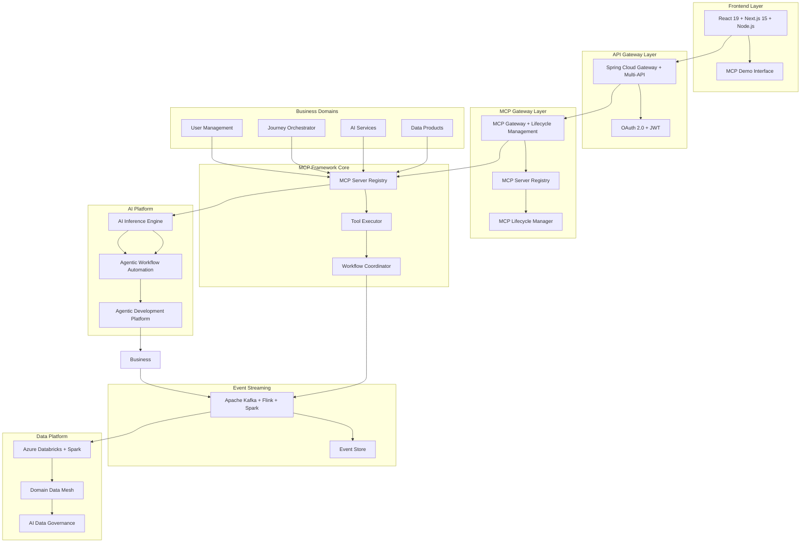
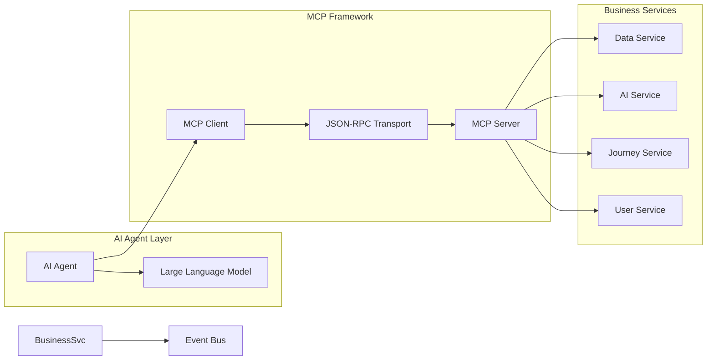
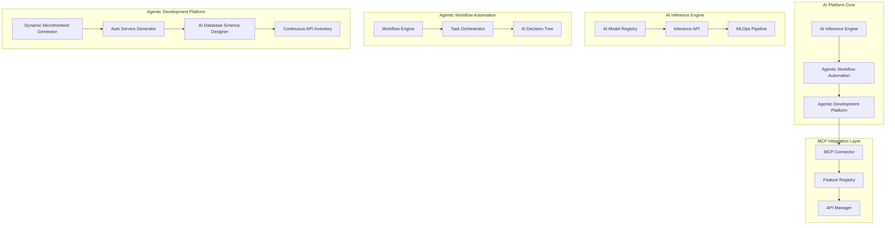
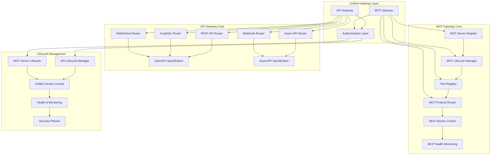
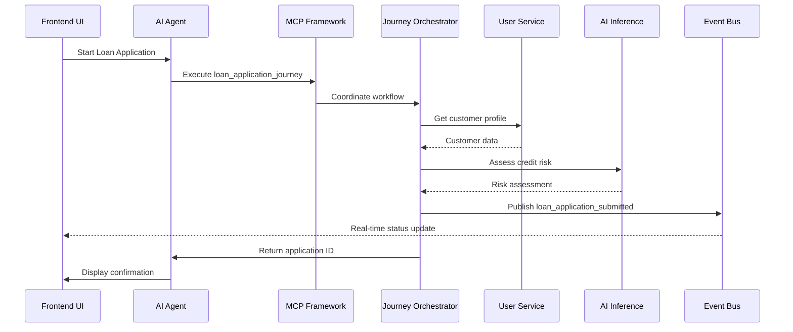
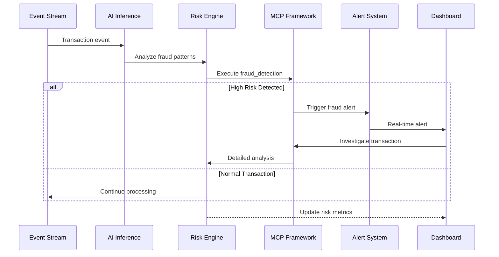
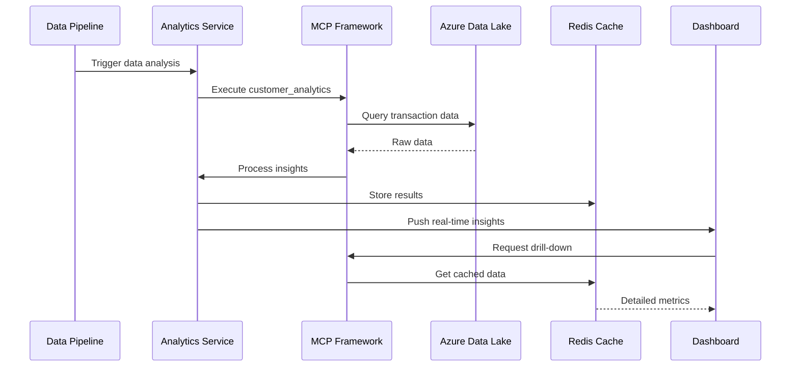

# AI Platform for FinTech Evolution - Executive Overview

## 🎯 Repository Purpose

This repository contains **executive-level documentation** and **high-level architecture artifacts** for the AI Platform for FinTech Evolution project. It is specifically designed for:

- **🎩 Tech Executives & C-Suite Leaders**
- **🏗️ Enterprise Architects & Solution Architects**
- **📊 Business Stakeholders & Investors**

## 🚀 Objective

The AI Platform for FinTech Evolution is designed to **transform legacy FinTech applications to be AI-enabled** through three primary application capabilities:

### **1. 🧠 AI Inference**

- **Foundation Model Selection & Orchestration**: Strategic selection and deployment of optimal foundation models (GPT, Claude, Llama, specialized FinTech models) based on use case requirements
- **Multi-Model Intelligence**: Intelligent routing between different foundation models for optimal performance, cost, and compliance
- **Real-time Intelligent Decision Making**: Sub-second financial operations powered by purpose-built model selection
- **Machine Learning-Driven Risk Assessment**: Advanced fraud detection and risk scoring using ensemble model approaches
- **Predictive Analytics**: Market trends and customer behavior analysis through specialized financial AI models
- **Natural Language Processing**: Document analysis and compliance processing using domain-specific language models
- **Event Streaming Integration**: Apache Kafka, Flink, Spark for real-time, near real-time & batch data processing and inference
- **Model Performance Optimization**: Continuous evaluation and switching between foundation models for optimal results

### **2. 🤖 Agentic Business Workflow Automation with MCP**

- Autonomous business process orchestration using Model Context Protocol
- Intelligent workflow optimization and exception handling
- Cross-system integration with intelligent routing and decision logic
- Self-healing and adaptive workflow management

### **3. 🔄 Agentic End-to-End Development to Deployment**

- Automated feature development from requirements to production
- Micro frontend to microservice architecture implementation
- Strangler pattern integration for legacy system modernization
- Domain-based MCP, API, and Data as Product/Data Mesh architecture
- AI-driven code generation, testing, and deployment automation

## 🎯 How Our Three Primary Applications Address MIT's Failure Modes

### **Application 1: 🧠 AI Inference → Solves "Misplaced Spending" & "Integration Blind Spots"**

**MIT Research Problem**: Companies waste majority of AI budgets on sales/marketing while back-office automation delivers higher ROI

**Our AI Inference Solution**:

- **Strategic Foundation Model Selection**: Optimal model choice (GPT, Claude, Llama, FinTech-specific models) for each back-office use case
- **Multi-Model Cost Optimization**: Intelligent routing between foundation models to minimize costs while maximizing performance
- **Back-Office Focus**: Prioritizes customer service automation, fraud detection, and compliance processing
- **Real-Time Financial Operations**: Sub-second decision making for transaction processing and risk assessment powered by purpose-selected models
- **Cost Reduction Strategy**: Automated document analysis and compliance reporting using domain-optimized language models
- **Tight Business Integration**: Event streaming with Kafka/Flink ensures AI inference connects directly to core banking workflows

**ROI Impact**: Targets the specific back-office functions MIT identified as highest-return investments

### **Application 2: 🤖 Agentic Business Workflow Automation → Solves "Stalled Innovation" & "Shadow AI"**

**MIT Research Problem**: 95% of pilots remain trapped in testing phases; employees use unauthorized consumer AI tools

**Our MCP Workflow Solution**:

- **Production-First Design**: Model Context Protocol enables immediate scaling from pilot to production workflows
- **Governed AI Framework**: Enterprise-grade orchestration prevents shadow AI by providing controlled, powerful alternatives
- **Autonomous Process Management**: Self-healing workflows that adapt and optimize without manual intervention
- **Cross-System Intelligence**: Intelligent routing and decision logic that integrates with existing enterprise systems

**Scaling Impact**: Breaks the prototype trap by providing production-ready agentic automation from day one

### **Application 3: 🔄 Agentic Development to Deployment → Solves "Internal Development Gap"**

**MIT Research Problem**: Internal AI development succeeds only 33% vs. 67% vendor success rate

**Our Hybrid Development Solution**:

- **Best-of-Both Strategy**: Combines proven vendor components (67% success rate) with FinTech-specific customization
- **Automated Feature Pipeline**: End-to-end automation from requirements to production deployment
- **Strangler Pattern Integration**: Gradual modernization avoiding the "big bang" internal development failures
- **Domain-Based Architecture**: MCP, API, and Data Mesh patterns that leverage external tools while maintaining internal control

**Development Impact**: Achieves vendor-level success rates while maintaining FinTech-specific capabilities

## 💡 Business Justification

### **The AI Implementation Crisis**

According to [MIT's NANDA initiative research report "The GenAI Divide: State of AI in Business 2025"](https://finance.yahoo.com/news/mit-report-95-generative-ai-105412686.html), **95% of enterprise generative AI pilot programs fail** to achieve rapid revenue acceleration or deliver measurable impact on profit and loss statements. Additional analysis by [National CIO Review](https://nationalcioreview.com/articles-insights/extra-bytes/mit-finds-genai-projects-fail-roi-in-95-of-companies/) reveals that these initiatives often remain **stuck in testing or prototype phases**, failing to scale beyond pilot programs.

The research, based on 150 interviews with leaders, a survey of 350 employees, and analysis of 300 public AI deployments, identifies five critical failure patterns:

#### **🚫 Stalled Innovation (95% Failure Rate)**

- Corporate generative AI pilots fall short of delivering meaningful financial impact
- Projects remain trapped in testing phases without scaling to production
- Successful outliers share tight integration between AI solutions and business processes

#### **💸 Misplaced Spending Strategies**

- Companies invest bulk of AI budgets into sales and marketing functions
- Back-office functions (customer service automation, HR operations) deliver higher ROI through cost reduction
- Strategic disconnect favoring visibility over actual business value

#### **🔧 Internal vs. External Development Gap**

- **External vendor tools: 67% success rate**
- **Internal development: ~33% success rate** (less than half the effectiveness)
- Highly regulated sectors (finance, healthcare) continue internal development despite poor outcomes
- Internal efforts suffer from lack of coordination, extended development cycles, and misalignment with user needs

#### **👥 Shadow AI and Governance Challenges**

- Employees adopt unauthorized tools (ChatGPT, consumer-grade assistants) without IT oversight
- Individual productivity gains offset by security and quality concerns
- Need for robust infrastructure and cultural adaptation for responsible scaling

#### **📉 Workforce Transformation Patterns**

- No evidence of mass layoffs directly tied to generative AI
- "Soft attrition" model: not replacing administrative and customer service positions as they become vacant
- Gradual workforce reshaping rather than disruptive displacement

### **Our AI Platform Solution**

This platform directly addresses the specific failure factors identified in MIT's research through:

#### **🎯 Proven Architecture Patterns**

- **MCP Framework**: Model Context Protocol enables AI agents to learn from and adapt to organizational workflows, solving the "learning gap" problem
- **Enterprise Integration**: Deep integration with existing FinTech systems rather than generic tool overlay
- **Vendor Partnership Strategy**: Following MIT's finding that purchased solutions succeed 67% of the time vs. internal builds
- **Back-Office Automation Focus**: Prioritizing high-ROI automation areas rather than front-end marketing tools

#### **📊 Strategic Response to MIT Research Findings**

| **MIT Identified Failure Pattern** | **Our Platform Solution** | **Implementation Strategy** |
|-----------------------------------|---------------------------|----------------------------|
| **Stalled Innovation (95% failure)** | Production-ready architecture from day one | **Scale-first design** |
| **Misplaced Spending (sales focus)** | Back-office automation priority | **ROI-driven allocation** |
| **Internal Development Gap (33% vs 67%)** | Hybrid vendor-extensible platform | **Best-of-both approach** |
| **Shadow AI governance issues** | Enterprise-grade MCP framework | **Controlled AI orchestration** |
| **Prototype-to-production gaps** | Continuous deployment architecture | **Seamless scaling** |

#### **💰 Platform Value Proposition**

- **Reduced Implementation Risk**: Proven architectural patterns for AI integration
- **Faster Time-to-Market**: Accelerated deployment cycles for AI features
- **Operational Efficiency**: Optimized infrastructure and automated processes
- **Sustainable Growth**: Scalable platform designed for long-term evolution

### **Why Enterprise AI Fails in Financial Services**

MIT's research reveals that traditional enterprise approaches to AI fail because they fall into predictable patterns that prevent scaling beyond pilot phases. In financial services, this manifests as:

#### **The Five Critical Failure Modes**

1. **Prototype Trap**: Initiatives remain stuck in testing phases without production deployment capabilities
2. **Visibility Over Value**: Focusing on customer-facing AI applications rather than back-office automation with proven ROI
3. **Internal Development Bias**: Building proprietary solutions despite 67% vendor success rate vs. 33% internal success rate
4. **Shadow AI Proliferation**: Uncontrolled adoption of consumer tools creating security and governance risks
5. **Integration Blind Spots**: Lack of tight integration between AI solutions and core business processes

#### **Our Strategic Differentiation**

This platform addresses each failure mode through research-backed strategies:

- **Production-First Architecture**: Built for immediate scaling beyond pilot phases with enterprise-grade infrastructure
- **Back-Office ROI Focus**: Prioritizing customer service automation, HR operations, and compliance processes where MIT research shows highest returns
- **Hybrid Development Model**: Leveraging proven vendor components while maintaining FinTech-specific customization capabilities
- **Governed AI Framework**: MCP-based orchestration providing enterprise control over AI agents and workflows
- **Deep Business Integration**: Purpose-built connectors ensuring tight coupling with financial services processes and regulatory requirements

## 🏗️ System Architecture

### High-Level Architecture Overview



### MCP Framework Architecture



### AI Platform Architecture



### Unified Gateway Architecture



## 🔄 Sequence Diagrams

### Customer Journey Automation Flow



### Real-time Risk Management Flow



### Data-Driven Insights Flow



## 📋 Contents Overview

### Executive Documentation

- **[Executive Summary](ARCHITECTURE_EXECUTIVE_SUMMARY.md)** - Strategic overview, business value, and investment analysis
- **[Technical Architecture](TECHNICAL_ARCHITECTURE.md)** - High-level system design and enterprise architecture
- **[Infrastructure Summary](AI_PLATFORM_INFRASTRUCTURE_UPDATE_SUMMARY.md)** - Physical infrastructure implementation overview

### Architecture Artifacts

- **[Logical Architecture](docs/AI_PLATFORM_LOGICAL_ARCHITECTURE.md)** - Conceptual system design and component relationships
- **[Physical Infrastructure](docs/AI_PLATFORM_PHYSICAL_INFRASTRUCTURE.md)** - Azure cloud infrastructure implementation
- **[Governance Framework](docs/ai-governance-framework.md)** - AI ethics, compliance, and risk management
- **[Reference Architectures](docs/azure-reference-architectures.md)** - Industry-standard architectural patterns

### Visual Documentation

- **[Enterprise Diagrams](ENTERPRISE_ARCHITECTURE_DIAGRAMS.md)** - System-level architecture visualizations
- **[Component Diagrams](COMPONENT_DIAGRAMS.md)** - Service interaction and dependency maps
- **[Sequence Diagrams](SEQUENCE_DIAGRAMS.md)** - Process flow and integration patterns

## 🎯 Key Highlights

### **💼 Business Value**

- **$2.6M Annual Infrastructure Investment** with 19% cost optimization
- **99.99% Availability SLA** with enterprise-grade reliability
- **Sub-10ms API Response Times** for real-time financial processing
- **1M+ Events/Second** processing capability for high-frequency trading

### **🏗️ Enterprise Architecture**

- **13-Layer Enterprise Architecture** following industry best practices
- **Zero Trust Security Framework** with comprehensive compliance
- **Model Context Protocol (MCP)** for intelligent AI orchestration
- **Multi-Cloud Deployment Strategy** with Azure as primary platform

### **🚀 Technical Innovation**

- **Agentic AI Workflows** for autonomous financial process automation
- **Real-time Fraud Detection** with machine learning-driven insights
- **Microservices Architecture** with containerized deployment
- **Event-Driven Processing** for scalable financial transactions
- **Strangler Pattern Implementation** for seamless legacy modernization
- **Data Mesh Architecture** supporting AI inference and analytics

## 🚀 Quick Start

### Prerequisites

- **Java 17+**
- **Node.js 18+**
- **Docker & Docker Compose**
- **Azure CLI** (for cloud deployment)

### Local Development Setup

1. **Clone the repository**

   ```bash
   git clone https://github.com/calvinlee999/react_next_java_journey.git
   cd react_next_java_journey
   ```

2. **Start Backend Services**

   ```bash
   cd backend
   ./mvnw spring-boot:run
   ```

3. **Start Frontend**

   ```bash
   cd frontend
   npm install
   npm run dev
   ```

4. **Access Applications**
   - Frontend: <http://localhost:3000>
   - MCP Demo: <http://localhost:3000/mcp-demo>
   - Backend API: <http://localhost:8080>

### Using VS Code Tasks

The project includes pre-configured VS Code tasks:

```bash
# Start full stack development
Ctrl+Shift+P → "Tasks: Run Task" → "Start Full Stack"
```

## 🔗 Related Repositories

For detailed **technical implementation**, **source code**, and **development artifacts**, please see:

- **[react_next_java_journey](https://github.com/calvinlee999/react_next_java_journey)** - Complete technical implementation for development teams
- **[angular_dotnet_journey](https://github.com/calvinlee999/angular_dotnet_journey)** - Angular/.NET/AWS implementation with enterprise architecture

## 📞 Contact Information

**Calvin Lee**  
**Senior Solutions Architect & Full-Stack Developer**  
📧 Contact for executive briefings and technical deep-dives

---

*This repository demonstrates enterprise-scale AI platform architecture and strategic technology transformation for legacy FinTech modernization.*
