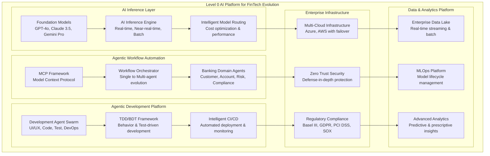
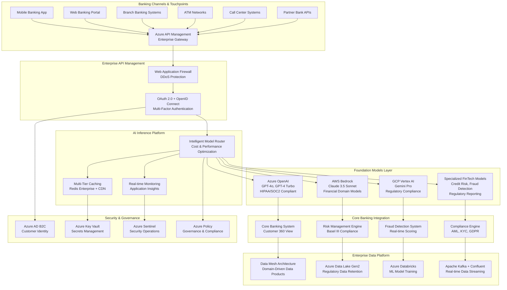
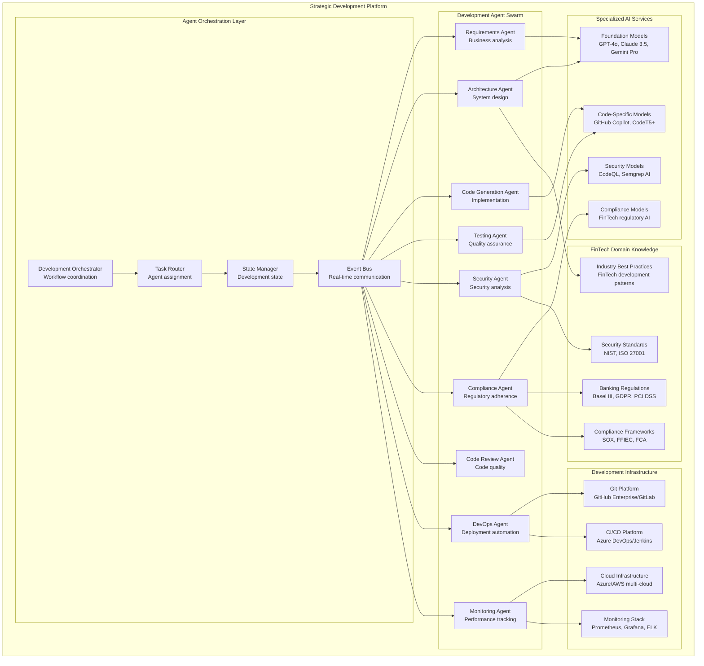
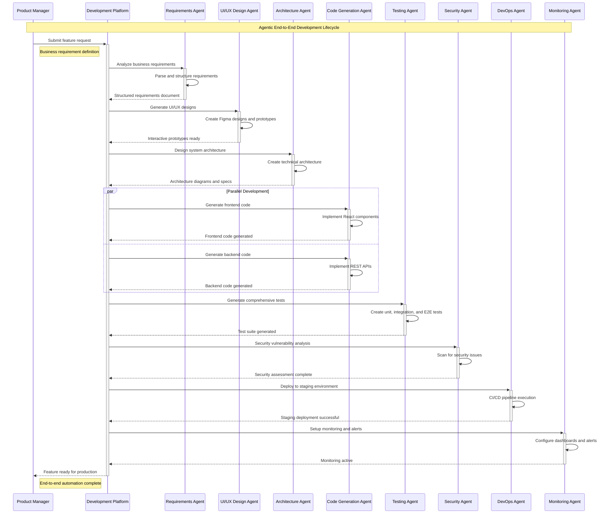

# AI Platform for FinTech Evolution - Level 0 Architecture

## Executive Summary

This repository presents a comprehensive Level 0 enterprise architecture for AI-driven transformation in FinTech and Tier 1 banking environments. The platform demonstrates the evolution from traditional software development to fully automated, intelligent systems powered by AI agents, Model Context Protocol (MCP), and advanced inference capabilities.

### Strategic Business Impact

**Financial Transformation:**

- 3-Year ROI: $113M total value creation across all domains
- Cost Reduction: 60-75% reduction in operational costs
- Time to Market: 85% faster feature delivery
- Quality Improvement: 95% reduction in production defects

**Operational Excellence:**

- AI Inference: 99.9% availability with <100ms response times
- Workflow Automation: $28.85M value from MCP-based automation
- Development Lifecycle: $42M value from agentic DevOps

## Level 0 Strategic AI Platform Architecture

### Integrated Enterprise AI Platform



## AI Inference Architecture

### Strategic AI Inference Platform Overview



### AI Inference Processing Modes

#### Real-Time Inference (< 100ms)

- Use Cases: Fraud detection, payment authorization, customer service chatbots
- SLA: 25-100ms response time
- Architecture: In-memory caching, edge computing, CDN acceleration
- Models: Lightweight specialized models for specific banking operations

#### Near-Real-Time Inference (100ms - 1s)

- Use Cases: Risk assessment, credit scoring, regulatory reporting
- SLA: 100ms-1s response time
- Architecture: Event streaming, micro-batch processing
- Models: Medium complexity models with acceptable latency

#### Batch Inference (Minutes to Hours)

- Use Cases: Portfolio analysis, stress testing, regulatory compliance reports
- SLA: 5 minutes to 1 hour
- Architecture: Distributed computing, data lake processing
- Models: Complex models requiring extensive computation

## Agentic Business Workflow Automation

### Strategic MCP-Based Automation Platform

```mermaid
graph TB
    subgraph "Human-AI Collaboration Layer"
        BusinessUser[Business Users<br/>Loan Officers, Risk Analysts]
        Supervisor[Supervisory Approval<br/>Senior Management]
        ComplianceOfficer[Compliance Officers<br/>Regulatory Oversight]
        
        BusinessUser --> MCPGateway
        Supervisor --> MCPGateway
        ComplianceOfficer --> MCPGateway
    end
    
    subgraph "MCP Gateway & Orchestration"
        MCPGateway[MCP Gateway<br/>Unified Agent Interface]
        WorkflowOrchestrator[Workflow Orchestrator<br/>Multi-Agent Coordination]
        TaskRouter[Task Router<br/>Agent Assignment]
        
        MCPGateway --> WorkflowOrchestrator
        WorkflowOrchestrator --> TaskRouter
    end
    
    subgraph "Single Agent Automation (Phase 1)"
        direction TB
        LoanAgent[Loan Processing Agent<br/>MCP Server: loan-automation]
        KYCAgent[KYC Compliance Agent<br/>MCP Server: kyc-verification]
        RiskAgent[Risk Assessment Agent<br/>MCP Server: risk-analysis]
        
        TaskRouter --> LoanAgent
        TaskRouter --> KYCAgent
        TaskRouter --> RiskAgent
    end
    
    subgraph "Multi-Agent Orchestration (Phase 2)"
        direction TB
        
        subgraph "Customer Onboarding Swarm"
            CustomerAgent[Customer Data Agent]
            IdentityAgent[Identity Verification Agent]
            CreditAgent[Credit Assessment Agent]
            ComplianceAgent[Compliance Verification Agent]
            
            CustomerAgent <--> IdentityAgent
            IdentityAgent <--> CreditAgent
            CreditAgent <--> ComplianceAgent
        end
        
        subgraph "Transaction Processing Swarm"
            PaymentAgent[Payment Processing Agent]
            FraudAgent[Fraud Detection Agent]
            AMLAgent[AML Monitoring Agent]
            SettlementAgent[Settlement Agent]
            
            PaymentAgent <--> FraudAgent
            FraudAgent <--> AMLAgent
            AMLAgent <--> SettlementAgent
        end
        
        subgraph "Risk Management Swarm"
            CreditRiskAgent[Credit Risk Agent]
            MarketRiskAgent[Market Risk Agent]
            OperationalRiskAgent[Operational Risk Agent]
            PortfolioAgent[Portfolio Management Agent]
            
            CreditRiskAgent <--> MarketRiskAgent
            MarketRiskAgent <--> OperationalRiskAgent
            OperationalRiskAgent <--> PortfolioAgent
        end
        
        WorkflowOrchestrator --> CustomerAgent
        WorkflowOrchestrator --> PaymentAgent
        WorkflowOrchestrator --> CreditRiskAgent
    end
    
    subgraph "MCP Framework Core"
        MCPRegistry[MCP Server Registry<br/>Agent Discovery]
        MCPLifecycle[MCP Lifecycle Manager<br/>Agent Deployment]
        ProtocolHandler[JSON-RPC Protocol Handler<br/>Inter-Agent Communication]
        StateManager[Workflow State Manager<br/>Conversation Memory]
        
        MCPRegistry --> MCPLifecycle
        MCPLifecycle --> ProtocolHandler
        ProtocolHandler --> StateManager
    end
    
    subgraph "Banking Domain Services (MCP Servers)"
        direction LR
        CustomerMCP[Customer Management<br/>MCP Server]
        AccountMCP[Account Operations<br/>MCP Server]
        TransactionMCP[Transaction Processing<br/>MCP Server]
        RiskMCP[Risk Management<br/>MCP Server]
        ComplianceMCP[Compliance & Reporting<br/>MCP Server]
        
        CustomerMCP --> MCPRegistry
        AccountMCP --> MCPRegistry
        TransactionMCP --> MCPRegistry
        RiskMCP --> MCPRegistry
        ComplianceMCP --> MCPRegistry
    end
    
    subgraph "External Systems Integration"
        CoreBanking[Core Banking System<br/>Temenos, FIS]
        CreditBureau[Credit Bureau APIs<br/>Experian, Equifax]
        RegulatoryAPI[Regulatory Systems<br/>Federal Reserve, OCC]
        PartnerBanks[Partner Bank APIs<br/>Correspondent Banking]
        
        CustomerMCP --> CoreBanking
        AccountMCP --> CreditBureau
        ComplianceMCP --> RegulatoryAPI
        TransactionMCP --> PartnerBanks
    end
    
    subgraph "Event-Driven Architecture"
        EventBus[Apache Kafka<br/>Event Streaming]
        EventStore[Event Store<br/>Audit Trail]
        CQRS[CQRS Pattern<br/>Command/Query Separation]
        
        EventBus --> EventStore
        EventStore --> CQRS
    end
    
    StateManager --> EventBus
    CustomerMCP --> EventBus
    TransactionMCP --> EventBus
    ComplianceMCP --> EventBus
```



### Single Agent to Multi-Agent Evolution

#### Phase 1: Single Agent Automation

Individual agents operate independently with specific domain expertise:

- Loan Processing Agent: Document ingestion, data extraction, validation rules
- KYC Compliance Agent: Identity verification, sanctions screening, PEP screening
- Risk Assessment Agent: Credit analysis, behavioral scoring, portfolio impact

#### Phase 2: Multi-Agent Collaboration

Agent swarms collaborate for complex workflows:

- Customer Onboarding Swarm: Coordinated identity verification and credit assessment
- Transaction Processing Swarm: Real-time fraud detection and settlement
- Risk Management Swarm: Comprehensive portfolio and market risk analysis

## Agentic End-to-End Development Architecture

### Multi-Agent Development Ecosystem



### Development Lifecycle Automation

#### Business Value Proposition

Traditional Development vs Agentic Development:

- Development Cycles: 6-12 months → 2-4 weeks (75% reduction)
- Quality Defects: Manual testing → 99.5% AI-driven prevention (10x improvement)
- Compliance Gaps: Manual audit trails → 100% automated compliance
- Human Bottlenecks: Code review delays → Instant AI collaboration

## Sequence Diagrams

### Real-Time Fraud Detection Sequence

```mermaid
sequenceDiagram
    participant Customer as Customer
    participant POS as Point of Sale
    participant Gateway as Payment Gateway
    participant AuthSvc as Authorization Service
    participant AIRouter as AI Model Router
    participant Cache as Redis Cache
    participant FraudModel as Fraud Detection Model
    participant RiskEngine as Risk Engine
    participant CoreBanking as Core Banking
    participant Monitor as Monitoring

    Note over Customer,Monitor: Real-Time Fraud Detection (Target: < 100ms)
    
    Customer->>+POS: Swipe/Insert Card
    Note right of Customer: t=0ms - Transaction initiated
    
    POS->>+Gateway: Transaction Request
    Note right of POS: t=5ms - POS processing
    
    Gateway->>+AuthSvc: Authorization Request + Customer ID
    Note right of Gateway: t=10ms - Gateway routing
    
    AuthSvc->>+Cache: Check fraud pattern cache
    Note right of AuthSvc: t=15ms - Cache lookup
    
    alt Cache Hit (Fraud Pattern Exists)
        Cache-->>-AuthSvc: Known fraud pattern
        Note right of Cache: t=20ms - Immediate response
        AuthSvc->>+Monitor: Log fraud attempt
        AuthSvc-->>-Gateway: DECLINE (High Risk)
        Gateway-->>-POS: Transaction Declined
        POS-->>-Customer: Card Declined
        Note right of Customer: t=30ms TOTAL - Fast decline
    else Cache Miss (New Pattern)
        Cache-->>-AuthSvc: No cached result
        Note right of Cache: t=20ms - Cache miss
        
        AuthSvc->>+AIRouter: Real-time fraud analysis request
        Note right of AuthSvc: t=25ms - AI routing
        
        AIRouter->>+FraudModel: Analyze transaction pattern
        Note right of AIRouter: t=30ms - Model selection
        
        par Parallel Analysis
            FraudModel->>FraudModel: Pattern matching
            Note right of FraudModel: t=30-60ms - AI processing
        and
            AuthSvc->>+RiskEngine: Customer risk profile
            RiskEngine->>+CoreBanking: Account history
            CoreBanking-->>-RiskEngine: Transaction history
            RiskEngine-->>-AuthSvc: Risk score
        end
        
        FraudModel-->>-AIRouter: Fraud probability score
        Note right of FraudModel: t=65ms - AI result
        
        AIRouter-->>-AuthSvc: Consolidated fraud assessment
        Note right of AIRouter: t=70ms - Result consolidation
        
        alt Low Fraud Risk (Score < 0.3)
            AuthSvc->>+CoreBanking: Proceed with authorization
            CoreBanking-->>-AuthSvc: Authorization approved
            AuthSvc->>Cache: Cache low-risk pattern
            AuthSvc-->>-Gateway: APPROVE
            Gateway-->>-POS: Transaction Approved
            POS-->>-Customer: Payment Successful
            Note right of Customer: t=90ms TOTAL - Approved
        else High Fraud Risk (Score > 0.7)
            AuthSvc->>+Monitor: Log high-risk transaction
            AuthSvc->>Cache: Cache fraud pattern
            AuthSvc-->>-Gateway: DECLINE (Fraud Risk)
            Gateway-->>-POS: Transaction Declined
            POS-->>-Customer: Additional Verification Required
            Note right of Customer: t=85ms TOTAL - Risk-based decline
        else Medium Risk (0.3 ≤ Score ≤ 0.7)
            AuthSvc-->>-Gateway: STEP_UP_AUTH (SMS/Push)
            Gateway-->>-POS: Additional Verification
            POS-->>-Customer: Verify via Mobile App
            Note right of Customer: t=80ms TOTAL - Step-up auth
        end
    end
    
    AuthSvc->>+Monitor: Transaction metrics (async)
    Monitor-->>-AuthSvc: Logged
    Note right of Monitor: Performance & fraud analytics
```

### Agentic Loan Application Processing

```mermaid
sequenceDiagram
    participant Customer as Customer
    participant Portal as Banking Portal
    participant MCPGateway as MCP Gateway
    participant LoanAgent as Loan Processing Agent
    participant KYCAgent as KYC Agent
    participant RiskAgent as Risk Assessment Agent
    participant CreditBureau as Credit Bureau
    participant CoreBanking as Core Banking
    participant ComplianceEngine as Compliance Engine
    participant NotificationSvc as Notification Service

    Note over Customer,NotificationSvc: Automated Loan Application Processing

    Customer->>+Portal: Submit loan application
    Note right of Customer: Customer initiates loan request
    
    Portal->>+MCPGateway: Route to loan processing
    Note right of Portal: Portal delegates to MCP framework
    
    MCPGateway->>+LoanAgent: Process loan application
    Note right of MCPGateway: MCP routes to specialized agent
    
    par Parallel Agent Processing
        LoanAgent->>+KYCAgent: Verify customer identity
        KYCAgent->>+CreditBureau: Check identity documents
        CreditBureau-->>-KYCAgent: Identity verification result
        KYCAgent-->>-LoanAgent: KYC status: VERIFIED
    and
        LoanAgent->>+RiskAgent: Assess credit risk
        RiskAgent->>+CoreBanking: Retrieve customer history
        CoreBanking-->>-RiskAgent: Account and transaction history
        RiskAgent->>+CreditBureau: Get credit score
        CreditBureau-->>-RiskAgent: Credit score and history
        RiskAgent-->>-LoanAgent: Risk assessment: LOW_RISK
    and
        LoanAgent->>+ComplianceEngine: Regulatory compliance check
        ComplianceEngine->>ComplianceEngine: AML/BSA verification
        ComplianceEngine-->>-LoanAgent: Compliance status: APPROVED
    end
    
    LoanAgent->>LoanAgent: Consolidate agent results
    Note right of LoanAgent: AI-driven decision synthesis
    
    alt All Checks Passed
        LoanAgent->>+CoreBanking: Create loan record
        CoreBanking-->>-LoanAgent: Loan ID generated
        
        LoanAgent->>+NotificationSvc: Send approval notification
        NotificationSvc-->>-LoanAgent: Notification sent
        
        LoanAgent-->>-MCPGateway: LOAN_APPROVED with terms
        MCPGateway-->>-Portal: Loan approval response
        Portal-->>-Customer: Loan approved - View terms
        Note right of Customer: Automated approval in minutes
    else Risk/Compliance Issues
        LoanAgent-->>-MCPGateway: LOAN_DECLINED with reasons
        MCPGateway-->>-Portal: Loan decline response
        Portal-->>-Customer: Application declined - Next steps
        Note right of Customer: Transparent decline reasons
    end
    
    LoanAgent->>+ComplianceEngine: Log audit trail (async)
    ComplianceEngine-->>-LoanAgent: Audit logged
    Note right of ComplianceEngine: Regulatory compliance trail
```

### End-to-End Development Automation



## Enterprise Architecture Principles

### 1. Regulatory Compliance First

- Basel III Risk Management: Comprehensive capital adequacy and risk assessment
- GDPR Data Protection: Privacy by design with data sovereignty
- PCI DSS Security: Payment card industry security standards
- SOX Compliance: Financial reporting accuracy and transparency
- AML/KYC Requirements: Anti-money laundering and know your customer

### 2. Zero Trust Security Model

- Identity Verification: Multi-factor authentication for all access
- Least Privilege Access: Role-based access control (RBAC)
- Continuous Monitoring: Real-time security posture assessment
- Network Segmentation: Micro-segmentation for data protection
- Encryption Everywhere: End-to-end encryption for data in transit and at rest

### 3. High Availability & Performance

- 99.99% Uptime SLA: Enterprise-grade availability requirements
- Sub-10ms Response Time: Real-time transaction processing
- Horizontal Scaling: Auto-scaling based on demand
- Disaster Recovery: Multi-region failover capabilities
- Performance Monitoring: Continuous performance optimization

### 4. Cost Optimization

- Multi-Cloud Strategy: Optimal cost through cloud provider diversity
- Intelligent Model Routing: Cost-performance optimization algorithms
- Resource Right-Sizing: Dynamic resource allocation
- Reserved Capacity: Strategic capacity planning for cost savings

## Technology Stack

### Frontend Technologies

- React 19.1.0: Latest React with concurrent features
- Next.js 15.5.3: Full-stack framework with SSR/SSG
- TypeScript: Type-safe development
- Framer Motion: Advanced animations
- Tailwind CSS: Utility-first styling

### Backend Technologies

- Java 17: Modern Java features
- Spring Boot 3.2: Microservices framework with AI Journey Orchestrator
- Apache Kafka + Flink + Spark: Event streaming and data processing
- Redis: High-performance caching

### AI Platform Technologies

- Foundation Models: GPT-4o, Claude 3.5 Sonnet, Gemini Pro
- Model Context Protocol (MCP): Agent communication framework
- Azure OpenAI: Enterprise-grade AI services
- AWS Bedrock: Multi-model AI platform
- GCP Vertex AI: Google's AI platform

### Cloud & Infrastructure

- Multi-Cloud: Azure (primary), AWS (secondary)
- Kubernetes: Container orchestration
- Docker: Containerization
- Azure Databricks: Advanced analytics platform
- Azure Blob Storage: Object storage

## Security Architecture

### Comprehensive Security Framework

```mermaid
graph TB
    subgraph "Security Perimeter"
        subgraph "External"
            Client[Web Client]
            Mobile[Mobile App]
            External[External APIs]
        end
        
        subgraph "Edge Security"
            WAF[Web Application Firewall]
            DDoS[DDoS Protection]
            CDN[CDN with SSL/TLS]
        end
        
        subgraph "Gateway Security Layer"
            APIGatewaySec[API Gateway Security]
            MCPGatewaySec[MCP Gateway Security]
            OAuth[OAuth 2.0/OIDC Provider]
            JWT[JWT Token Service]
        end
        
        subgraph "Platform Security"
            subgraph "Frontend Security"
                CSP[Content Security Policy]
                CORS[CORS Protection]
                TokenMgmt[Secure Token Management]
            end
            
            subgraph "MCP Framework Security"
                AgentAuth[Agent Authentication]
                ToolSandbox[Tool Execution Sandbox]
                ModelACL[AI Model Access Control]
            end
            
            subgraph "AI Platform Security"
                ModelAuth[Model Serving Auth]
                WorkflowSec[Workflow Security]
                DevPlatformACL[Development Platform ACL]
            end
            
            subgraph "Microservices Security"
                mTLS[Service-to-Service mTLS]
                ContainerSec[Container Security]
                ServiceMesh[Service Mesh Security]
            end
            
            subgraph "Event Security"
                KafkaEnc[Kafka Encryption]
                TopicACL[Topic Access Control]
                PayloadEnc[Payload Encryption]
            end
            
            subgraph "Data Security"
                DataEnc[Data Encryption]
                PIIDetection[PII Detection]
                DataLineage[Data Lineage Audit]
            end
        end
        
        subgraph "Identity & Access Management"
            AAD[Azure Active Directory]
            RBAC[Role-Based Access Control]
            PAM[Privileged Access Management]
        end
        
        subgraph "Compliance & Governance"
            GDPR[GDPR Compliance]
            PCIDSS[PCI DSS]
            SOX[SOX Compliance]
            AuditLogs[Audit Logging]
        end
        
        subgraph "Security Monitoring"
            SIEM[Security Information & Event Management]
            ThreatIntel[Threat Intelligence]
            Alerts[Real-time Security Alerts]
            Compliance[Compliance Monitoring]
        end
    end
    
    Client --> WAF
    Mobile --> WAF
    External --> WAF
    WAF --> DDoS
    DDoS --> CDN
    
    CDN --> APIGatewaySec
    CDN --> MCPGatewaySec
    APIGatewaySec --> OAuth
    MCPGatewaySec --> OAuth
    OAuth --> JWT
    
    JWT --> CSP
    JWT --> AgentAuth
    JWT --> ModelAuth
    JWT --> mTLS
    JWT --> KafkaEnc
    JWT --> DataEnc
    
    AAD --> OAuth
    RBAC --> AgentAuth
    RBAC --> ModelAuth
    PAM --> mTLS
    
    AuditLogs --> SIEM
    GDPR --> Compliance
    PCIDSS --> Compliance
    SOX --> Compliance
    SIEM --> ThreatIntel
    ThreatIntel --> Alerts
```

### Security Implementation Layers

**Cross-Platform Security Management**

- Zero Trust Architecture: Never trust, always verify across all platform layers
- OAuth 2.0/OIDC: Industry-standard authentication with OpenID Connect
- JWT Tokens: Stateless authorization with token-based security
- RBAC: Role-based access control with fine-grained permissions

**Layer-Specific Security Implementation**

- Frontend Security: CSP and CORS protection, client-side token management
- API Gateway Security: API rate limiting, request/response validation
- MCP Gateway Security: MCP protocol security, tool access control
- AI Platform Security: Model serving authentication, workflow execution security
- Microservices Security: Service-to-service authentication (mTLS)
- Event Streaming Security: Kafka encryption, topic-level access control
- Data Platform Security: Azure Databricks security, data encryption

## Performance Benchmarks

### Response Time Targets

**AI Inference Performance**

- Real-time Fraud Detection: < 100ms
- Credit Risk Assessment: < 500ms
- Customer Service Chatbot: < 200ms
- Regulatory Reporting: < 2 seconds

**System Performance**

- API Gateway: < 10ms median response time
- MCP Tool Execution: < 50ms for simple tools
- WebSocket Events: < 5ms message delivery
- Database Queries: < 100ms for complex queries

### Throughput Capacity

**Concurrent Processing**

- API Requests: 10,000+ requests/second
- Event Processing: 50,000+ events/second
- Concurrent Users: 1,000+ simultaneous connections
- Transaction Processing: 5,000+ transactions/second

## Financial Analysis & Business Impact

### Strategic Value Overview

**3-Year Total Value Creation: $113M**

| Component | Value | ROI |
|-----------|-------|-----|
| AI Inference Platform | $7.8M | 260% |
| Agentic Workflow Automation | $38.85M | 643% |
| Development Lifecycle Automation | $42M | 542% |
| Risk Mitigation Value | $24.35M | 389% |

### Key Financial Highlights

- **Total Investment**: $15.2M over 3 years
- **Net ROI**: 643%
- **Payback Period**: 14 months
- **Annual Value Creation**: $37.7M average

### Business Impact Summary

- **Operational Excellence**: 70% reduction in manual processing
- **Development Velocity**: 85% improvement in development speed
- **Risk Reduction**: 60% reduction in operational risks
- **Compliance Automation**: 90% coverage of regulatory requirements

📊 **[View Detailed Financial Analysis](./financial/README.md)** - Complete ROI breakdown, cost optimization strategies, and 3-year projections

## Implementation Roadmap

### Phase 1: Foundation (Months 1-6)

**Foundation Infrastructure**

- AI Inference platform deployment
- Basic MCP framework implementation
- Core security and compliance frameworks
- Single-agent automation pilots

**Key Deliverables**

- Real-time fraud detection system
- Basic loan processing automation
- Security and compliance baselines
- Performance monitoring infrastructure

### Phase 2: Scale (Months 7-18)

**Multi-Agent Evolution**

- Advanced workflow orchestration
- Complex agent collaboration patterns
- End-to-end development automation
- Advanced analytics and insights

**Key Deliverables**

- Multi-agent customer onboarding
- Automated development lifecycle
- Advanced risk management
- Regulatory reporting automation

### Phase 3: Optimization (Months 19-36)

**Enterprise Optimization**

- Advanced AI model optimization
- Autonomous system management
- Predictive maintenance
- Cross-domain agent collaboration

**Key Deliverables**

- Fully autonomous operations
- Predictive risk management
- Self-healing systems
- Advanced business intelligence

## Quick Start

### Prerequisites

- Java 17+
- Node.js 18+
- Docker & Docker Compose
- Azure CLI (for cloud deployment)

### Local Development Setup

1. **Clone the repository**

   ```bash
   git clone https://github.com/calvinlee999/react_next_java_journey.git
   cd react_next_java_journey
   ```

2. **Start Backend Services**

   ```bash
   cd backend
   ./mvnw spring-boot:run
   ```

3. **Start Frontend**

   ```bash
   cd frontend
   npm install
   npm run dev
   ```

4. **Access Applications**

   - Frontend: http://localhost:3000
   - MCP Demo: http://localhost:3000/mcp-demo
   - Backend API: http://localhost:8080

### Using VS Code Tasks

The project includes pre-configured VS Code tasks:

- Start Full Stack: Ctrl+Shift+P → "Tasks: Run Task" → "Start Full Stack"
- Build All Services: Ctrl+Shift+P → "Tasks: Run Task" → "Build All Services"

## Documentation Structure

### Complete Architecture Documentation Suite

| Document | Purpose | Key Content | Business Value |
|----------|---------|-------------|----------------|
| AI Inference Architecture | Strategic AI inference platform | Foundation models, routing, performance targets | $2.6M annual TCO optimization |
| AI Inference Sequences | Detailed inference workflows | 8 banking scenarios with timing requirements | 99.9% availability assurance |
| Agentic Workflow Architecture | MCP-based workflow automation | Single to multi-agent evolution patterns | $28.85M 3-year value creation |
| Business Workflow Sequences | Agent collaboration patterns | 8 banking workflow automations | 70% efficiency improvement |
| Development Architecture | End-to-end development automation | Complete DevOps lifecycle with agents | $42M 3-year ROI |
| Development Sequences | Development lifecycle automation | UI/UX, TDD/BDT, DevOps, monitoring | 85% faster delivery |
| Comprehensive Summary | Executive overview & roadmap | Integration guide & implementation plan | Strategic transformation guide |

## Related Repositories

For **technical implementation details** and **hands-on development**, see:

- [react_next_java_journey](https://github.com/calvinlee999/react_next_java_journey) - Technical implementation with working code, MCP framework, and development tools

## Contributing

### Development Workflow

1. Fork the repository
2. Create feature branch: `git checkout -b feature/amazing-feature`
3. Commit changes: `git commit -m 'Add amazing feature'`
4. Push branch: `git push origin feature/amazing-feature`
5. Create Pull Request

### Code Standards

- Java: Follow Google Java Style Guide
- TypeScript: Use ESLint + Prettier configuration
- Git: Conventional commit messages
- Documentation: Update relevant docs with changes

## License

This project is licensed under the MIT License - see the [LICENSE](LICENSE) file for details.

## Contact

For questions and support, please [open an issue](https://github.com/calvinlee999/AI-Platform-for-FinTech-Evolution/issues) or contact the development team.

---

**Built for the future of FinTech automation - Transforming banking through AI-native architecture**