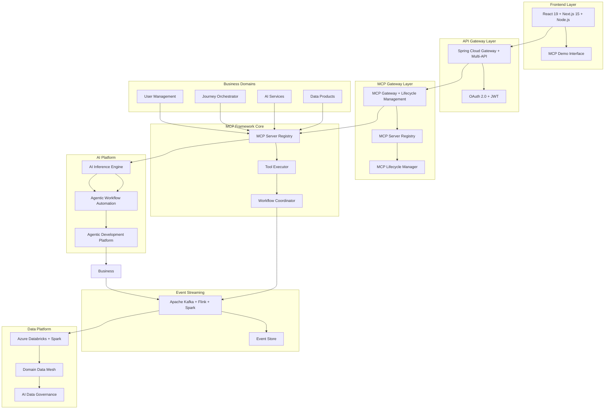
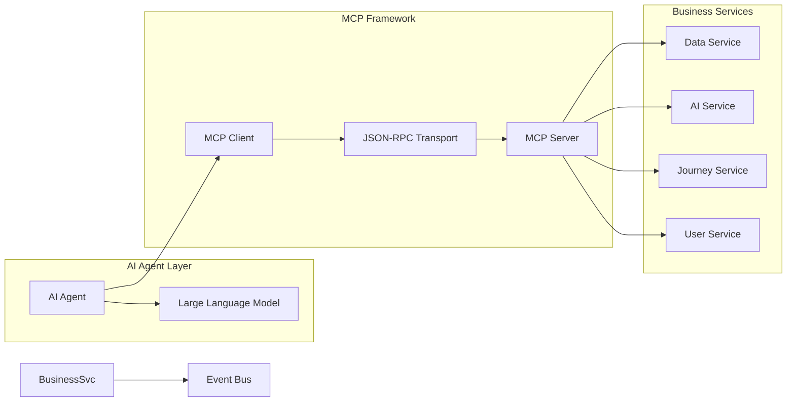
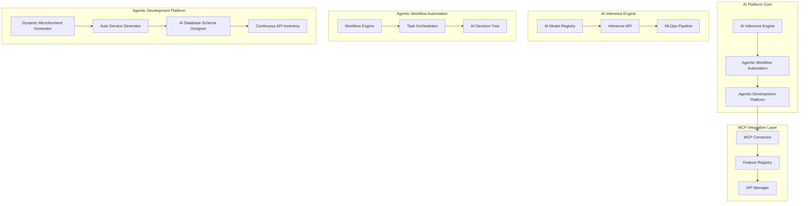
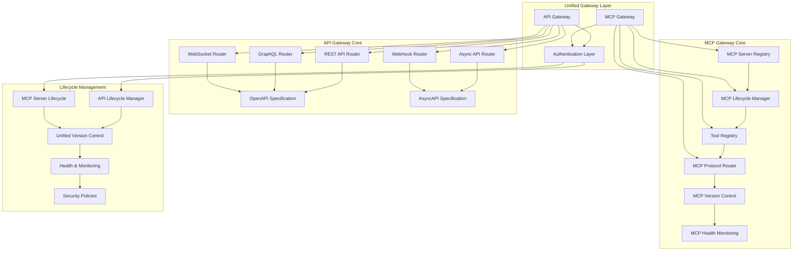
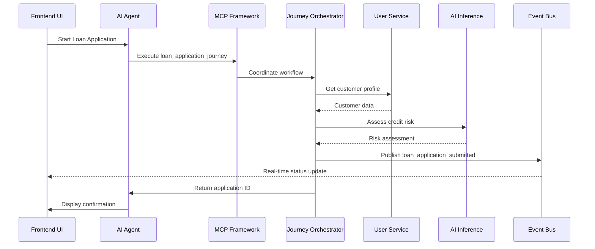
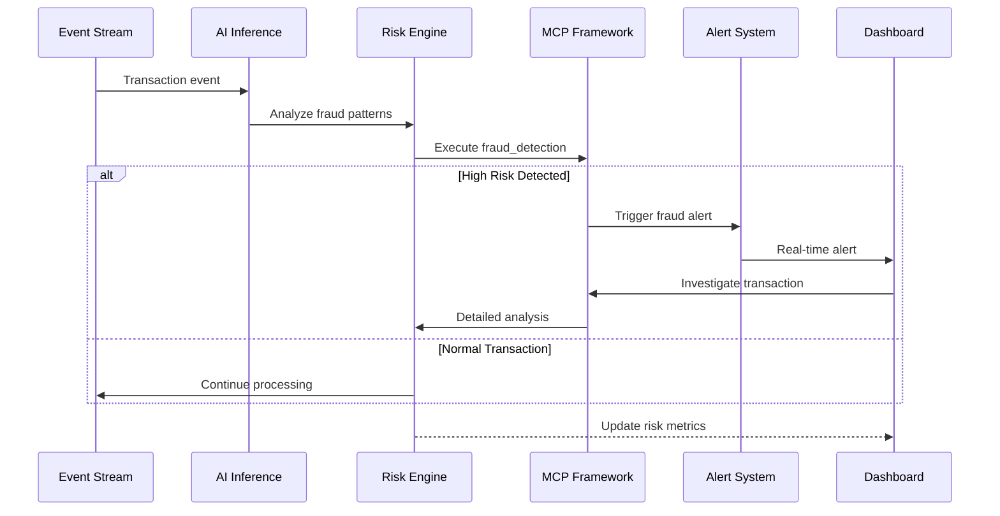
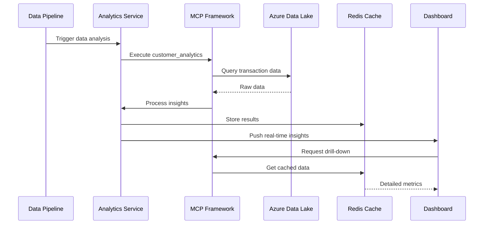

# AI Platform for FinTech Evolution - Executive Overview

## 🎯 Repository Purpose

This repository contains **executive-level documentation** and **high-level architecture artifacts** for the AI Platform for FinTech Evolution project. It is specifically designed for:

- **🎩 Tech Executives & C-Suite Leaders**
- **🏗️ Enterprise Architects & Solution Architects**
- **📊 Business Stakeholders & Investors**

## 🚀 Objective

The AI Platform for FinTech Evolution is designed to **transform legacy FinTech applications to be AI-enabled** through three primary application capabilities:

### **1. 🧠 AI Inference**

- Real-time intelligent decision making for financial operations
- Machine learning-driven risk assessment and fraud detection
- Predictive analytics for market trends and customer behavior
- Natural language processing for document analysis and compliance
- Event Streaming with Apache Kafka, Flink, Spark for real-time, near real-time & batch data processing and inference

### **2. 🤖 Agentic Business Workflow Automation with MCP**

- Autonomous business process orchestration using Model Context Protocol
- Intelligent workflow optimization and exception handling
- Cross-system integration with intelligent routing and decision logic
- Self-healing and adaptive workflow management

### **3. 🔄 Agentic End-to-End Development to Deployment**

- Automated feature development from requirements to production
- Micro frontend to microservice architecture implementation
- Strangler pattern integration for legacy system modernization
- Domain-based MCP, API, and Data as Product/Data Mesh architecture
- AI-driven code generation, testing, and deployment automation

## 🏗️ System Architecture

### High-Level Architecture Overview



### MCP Framework Architecture



### AI Platform Architecture



### Unified Gateway Architecture



## 🔄 Sequence Diagrams

### Customer Journey Automation Flow



### Real-time Risk Management Flow



### Data-Driven Insights Flow



## 📋 Contents Overview

### Executive Documentation

- **[Executive Summary](ARCHITECTURE_EXECUTIVE_SUMMARY.md)** - Strategic overview, business value, and investment analysis
- **[Technical Architecture](TECHNICAL_ARCHITECTURE.md)** - High-level system design and enterprise architecture
- **[Infrastructure Summary](AI_PLATFORM_INFRASTRUCTURE_UPDATE_SUMMARY.md)** - Physical infrastructure implementation overview

### Architecture Artifacts

- **[Logical Architecture](docs/AI_PLATFORM_LOGICAL_ARCHITECTURE.md)** - Conceptual system design and component relationships
- **[Physical Infrastructure](docs/AI_PLATFORM_PHYSICAL_INFRASTRUCTURE.md)** - Azure cloud infrastructure implementation
- **[Governance Framework](docs/ai-governance-framework.md)** - AI ethics, compliance, and risk management
- **[Reference Architectures](docs/azure-reference-architectures.md)** - Industry-standard architectural patterns

### Visual Documentation

- **[Enterprise Diagrams](ENTERPRISE_ARCHITECTURE_DIAGRAMS.md)** - System-level architecture visualizations
- **[Component Diagrams](COMPONENT_DIAGRAMS.md)** - Service interaction and dependency maps
- **[Sequence Diagrams](SEQUENCE_DIAGRAMS.md)** - Process flow and integration patterns

## 🎯 Key Highlights

### **💼 Business Value**

- **$2.6M Annual Infrastructure Investment** with 19% cost optimization
- **99.99% Availability SLA** with enterprise-grade reliability
- **Sub-10ms API Response Times** for real-time financial processing
- **1M+ Events/Second** processing capability for high-frequency trading

### **🏗️ Enterprise Architecture**

- **13-Layer Enterprise Architecture** following industry best practices
- **Zero Trust Security Framework** with comprehensive compliance
- **Model Context Protocol (MCP)** for intelligent AI orchestration
- **Multi-Cloud Deployment Strategy** with Azure as primary platform

### **🚀 Technical Innovation**

- **Agentic AI Workflows** for autonomous financial process automation
- **Real-time Fraud Detection** with machine learning-driven insights
- **Microservices Architecture** with containerized deployment
- **Event-Driven Processing** for scalable financial transactions
- **Strangler Pattern Implementation** for seamless legacy modernization
- **Data Mesh Architecture** supporting AI inference and analytics

## 🚀 Quick Start

### Prerequisites

- **Java 17+**
- **Node.js 18+**
- **Docker & Docker Compose**
- **Azure CLI** (for cloud deployment)

### Local Development Setup

1. **Clone the repository**

   ```bash
   git clone https://github.com/calvinlee999/react_next_java_journey.git
   cd react_next_java_journey
   ```

2. **Start Backend Services**

   ```bash
   cd backend
   ./mvnw spring-boot:run
   ```

3. **Start Frontend**

   ```bash
   cd frontend
   npm install
   npm run dev
   ```

4. **Access Applications**
   - Frontend: <http://localhost:3000>
   - MCP Demo: <http://localhost:3000/mcp-demo>
   - Backend API: <http://localhost:8080>

### Using VS Code Tasks

The project includes pre-configured VS Code tasks:

```bash
# Start full stack development
Ctrl+Shift+P → "Tasks: Run Task" → "Start Full Stack"
```

## 🔗 Related Repositories

For detailed **technical implementation**, **source code**, and **development artifacts**, please see:

- **[react_next_java_journey](https://github.com/calvinlee999/react_next_java_journey)** - Complete technical implementation for development teams
- **[angular_dotnet_journey](https://github.com/calvinlee999/angular_dotnet_journey)** - Angular/.NET/AWS implementation with enterprise architecture

## 📞 Contact Information

**Calvin Lee**  
**Senior Solutions Architect & Full-Stack Developer**  
📧 Contact for executive briefings and technical deep-dives

---

*This repository demonstrates enterprise-scale AI platform architecture and strategic technology transformation for legacy FinTech modernization.*