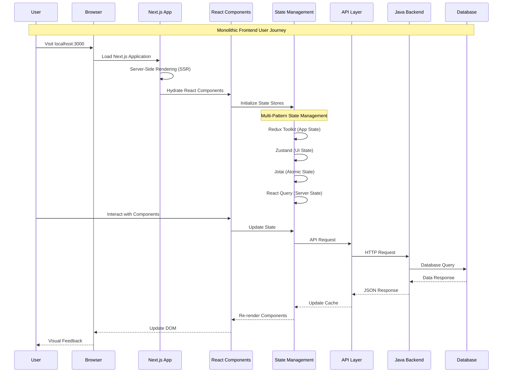
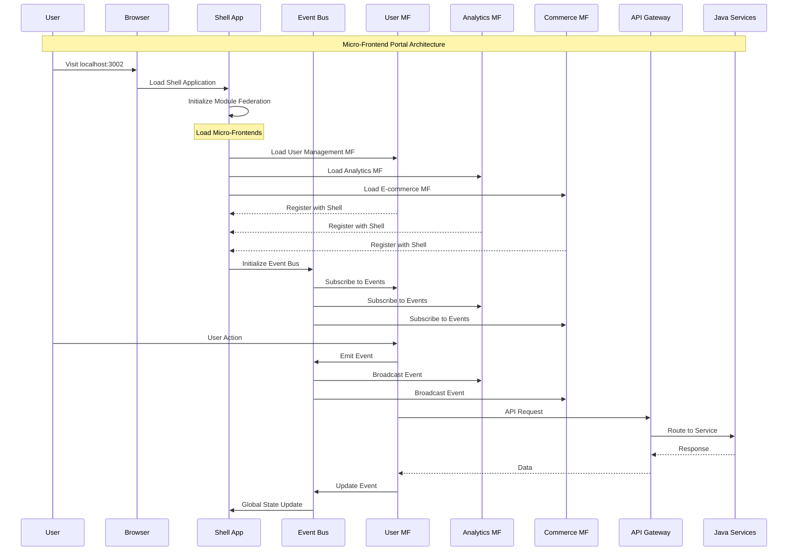
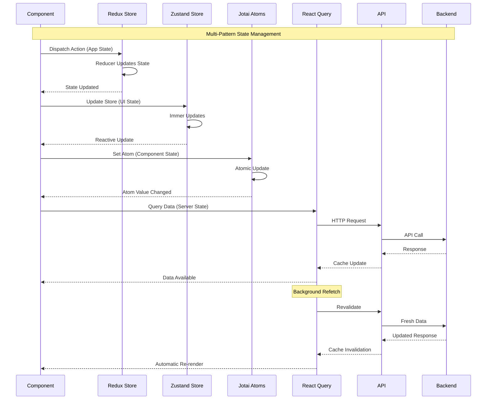
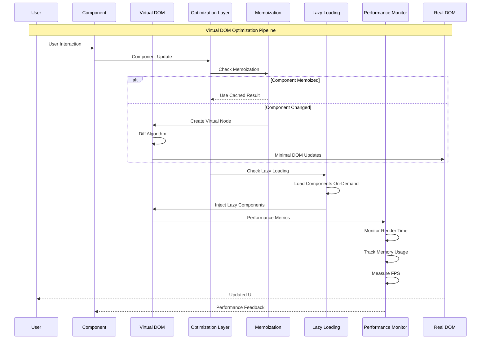
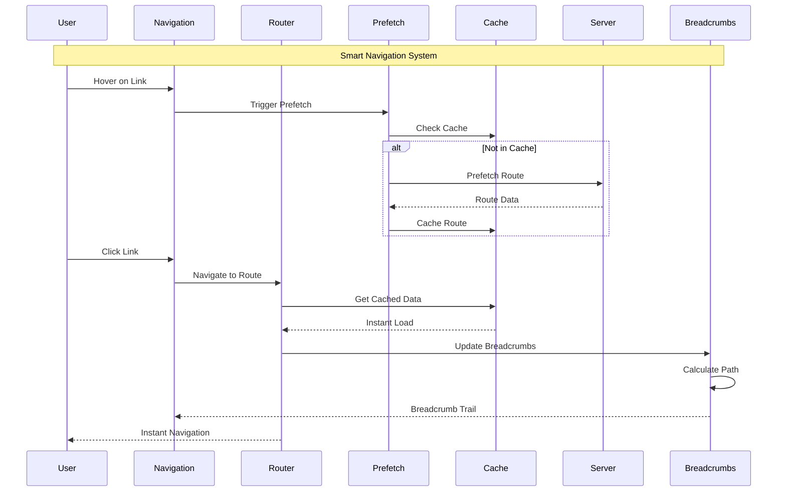
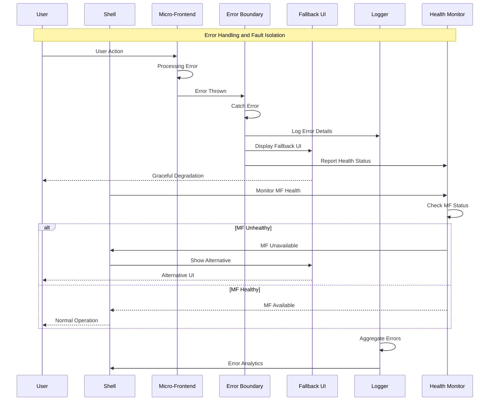
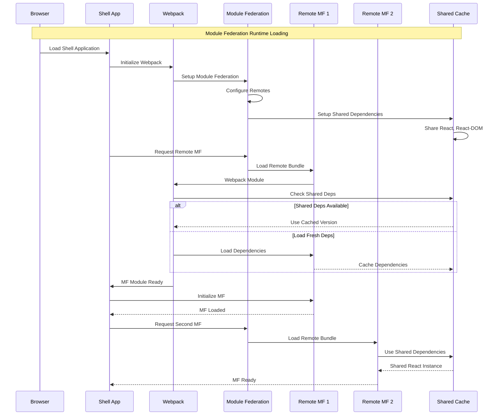
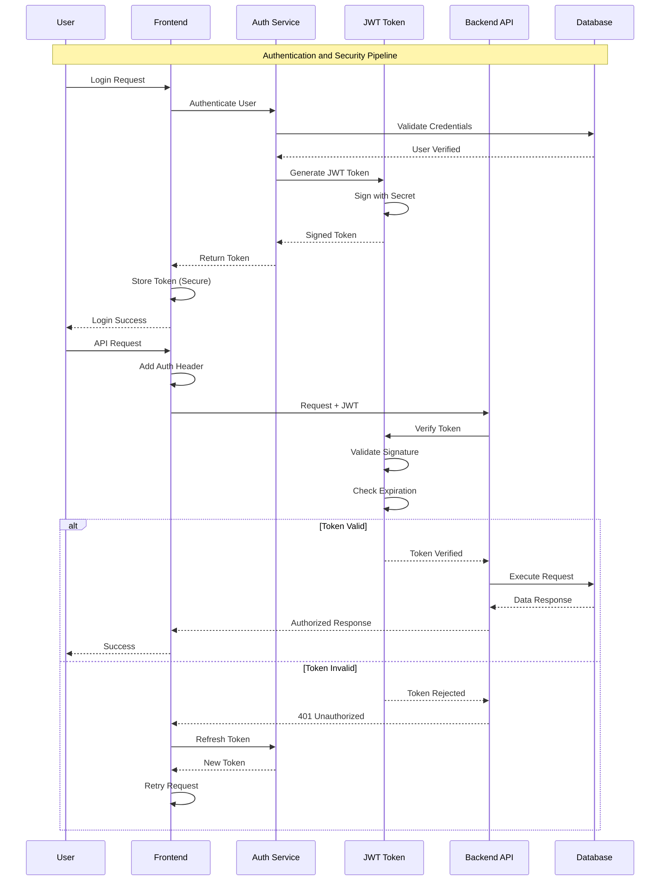
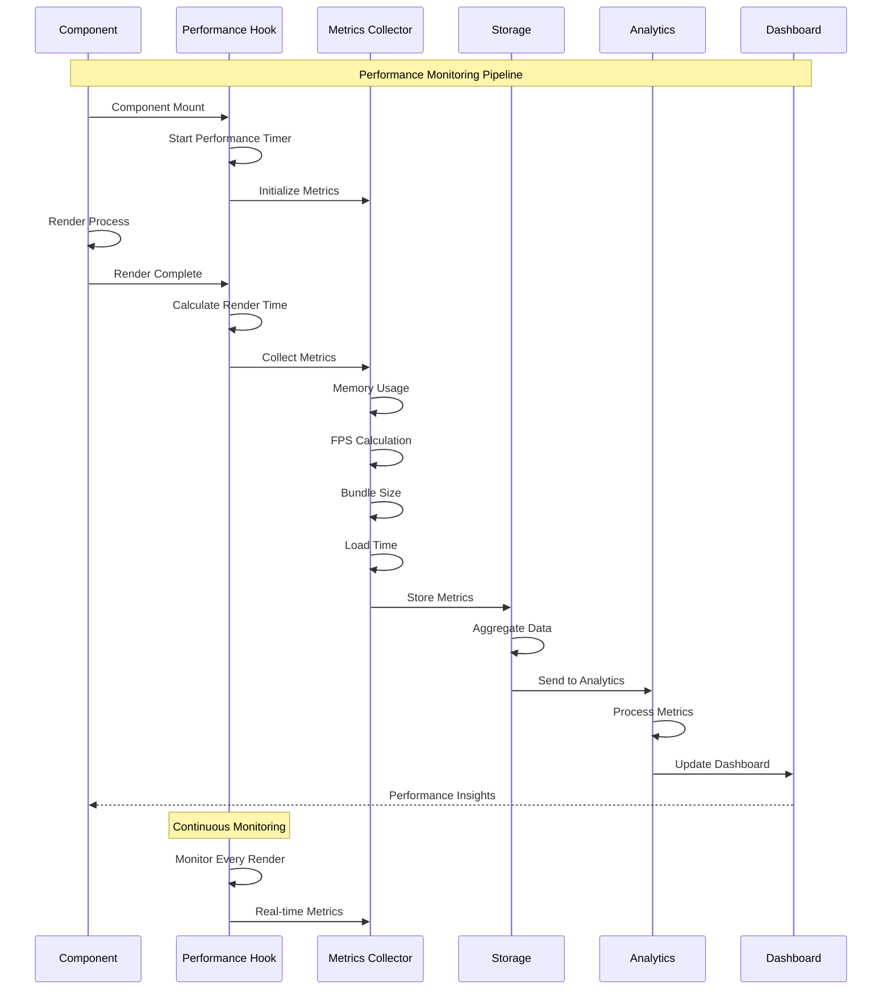
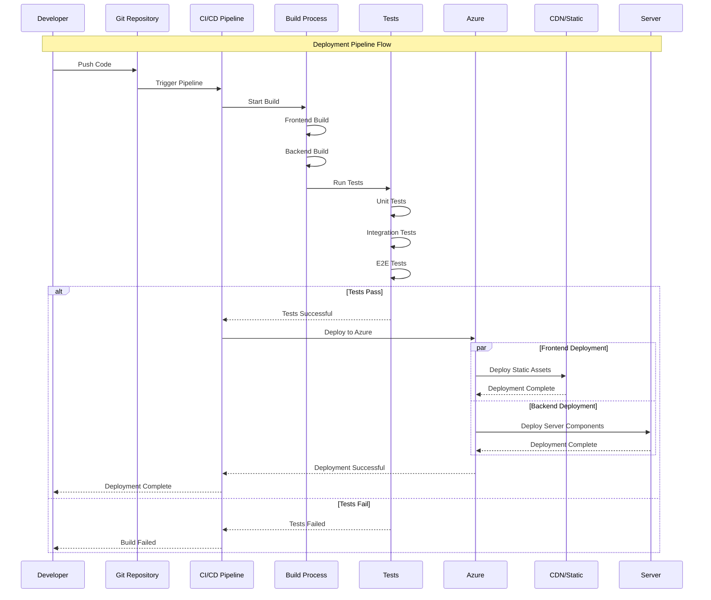

# Architecture Sequence Diagrams

This document contains comprehensive sequence diagrams for the React + Next.js + Java + Azure architecture.

## 1. Monolithic Frontend Architecture Flow

## 2. Micro-Frontend Architecture Flow

## 3. State Management Architecture

## 4. Virtual DOM Optimization Flow

## 5. Navigation and Routing Flow

## 6. Error Handling and Fault Isolation

## 7. Module Federation Loading

## 8. Authentication and Security Flow

## 9. Performance Monitoring Flow

## 10. CI/CD Deployment Pipeline

## Diagram Usage

These sequence diagrams illustrate:

1. **Monolithic vs Micro-Frontend** comparison
2. **State Management** patterns and interactions
3. **Virtual DOM** optimization strategies
4. **Navigation** and smart prefetching
5. **Error Handling** and fault isolation
6. **Module Federation** runtime behavior
7. **Authentication** security flow
8. **Performance Monitoring** collection
9. **CI/CD Pipeline** deployment process

Each diagram shows the complete flow from user interaction through to system response, helping understand the architecture decisions and implementation patterns used in this Golden Path template.
