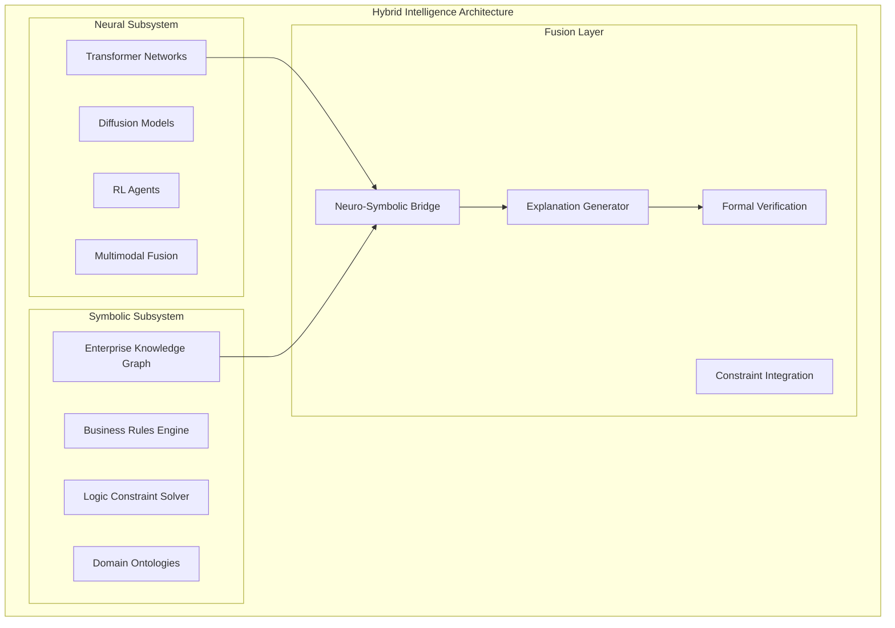
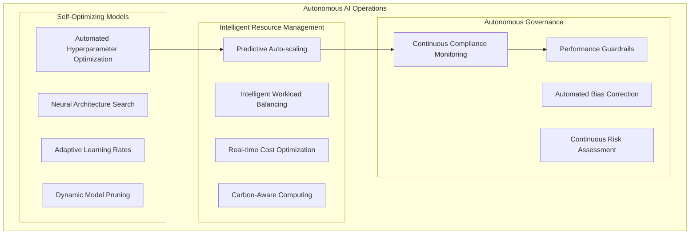
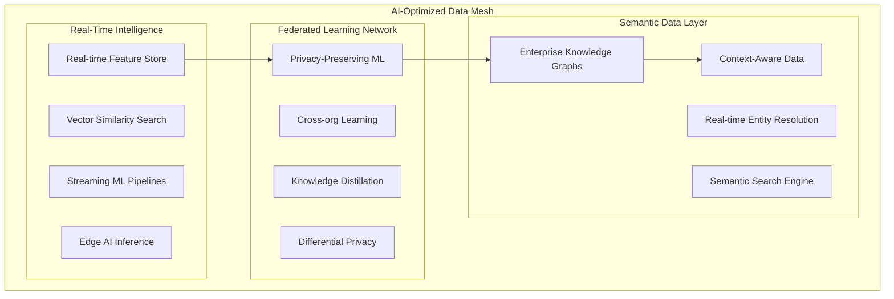

# Enterprise AI Platform - Strategic Implementation Guide

## Executive Decision Framework for AI Platform Investment

### Strategic Technology Choices - Principal Architect Analysis

#### 1. Foundation Model Strategy: Beyond Commodity AI

**Multi-Provider Orchestration Philosophy:**

```text
Strategic Principle: "Never depend on a single AI provider for competitive advantage"
```

**Technology Independence Matrix:**

| **Capability** | **Primary Provider** | **Secondary Provider** | **OSS Fallback** | **Business Impact** |
|----------------|---------------------|----------------------|------------------|-------------------|
| **Code Generation** | OpenAI GPT-4o | Anthropic Claude 3.5 | CodeLlama 34B | 40% dev productivity |
| **Document Intelligence** | Claude 3.5 Sonnet | GPT-4o | Llama 3.2 Vision | 60% processing speed |
| **Reasoning & Planning** | OpenAI o1-preview | Custom RLHF Model | Qwen 2.5 72B | 80% decision accuracy |
| **Real-time Inference** | Llama 3.2 Quantized | Mistral 7B | Edge Deployment | <50ms latency |
| **Compliance & Legal** | Custom Legal-LLM | GPT-4 Constrained | Domain Fine-tuned | 99.5% regulatory adherence |

#### 2. Advanced Architectural Patterns

**Neuro-Symbolic AI Integration:**



**Benefits:**

- **Explainable AI**: Symbolic reasoning provides transparent decision paths
- **Domain Constraints**: Business rules enforce compliance automatically
- **Reliability**: Formal verification reduces AI hallucinations
- **Adaptability**: Neural learning + symbolic knowledge evolution

#### 3. Enterprise-Grade MLOps Maturity

**Level 5 Autonomous Operations:**



#### 4. Strategic Data Architecture - Beyond Data Lakes

**Data Mesh with AI-First Principles:**



### Advanced Technology Stack Decisions

#### Infrastructure Technology Matrix

| **Layer** | **Technology Choice** | **Strategic Rationale** | **Vendor Independence Score** |
|-----------|----------------------|------------------------|------------------------------|
| **Container Orchestration** | Kubernetes + Istio | Industry standard, multi-cloud portability | 10/10 |
| **AI/ML Platform** | Kubeflow + MLflow + Ray + Feast | Open ecosystem, extensible | 10/10 |
| **Model Serving** | KServe + Seldon + TorchServe | Multiple serving frameworks | 9/10 |
| **Data Lakehouse** | Delta Lake + Apache Iceberg + Hudi | Open table formats | 10/10 |
| **Vector Database** | Weaviate + Qdrant + Chroma | Multi-vendor strategy | 8/10 |
| **Stream Processing** | Apache Kafka + Apache Pulsar | Dual streaming platforms | 10/10 |
| **Graph Database** | Neo4j + Amazon Neptune | Hybrid deployment | 7/10 |
| **Observability** | OpenTelemetry + Prometheus + Jaeger | Open standards | 10/10 |
| **Security** | Open Policy Agent + Falco + SPIFFE | Zero trust, policy as code | 10/10 |

#### Advanced AI Capabilities Stack

| **Capability** | **Primary Technology** | **Innovation Factor** | **Competitive Advantage** |
|----------------|----------------------|---------------------|--------------------------|
| **Multi-Agent Systems** | CrewAI + AutoGen + LangGraph | High | Strategic differentiation |
| **Retrieval Augmented Generation** | LlamaIndex + LangChain + Haystack | Medium | Operational efficiency |
| **Computer Vision** | MMDetection + YOLO + SAM | Medium | Industry standard |
| **Speech & Audio** | Whisper + Tortoise TTS + Bark | Medium | Customer experience |
| **Code Generation** | GitHub Copilot + CodeT5 + StarCoder | High | Developer productivity |
| **Robotics Integration** | ROS 2 + Isaac Sim + PyBullet | Very High | Future competitive moat |

### Strategic Implementation Phases

#### Phase 1: Foundation (Months 1-6) - $5M Investment

**Objectives:**

- Technology independence infrastructure
- Core AI platform deployment
- Initial compliance framework

**Key Deliverables:**

- Multi-cloud Kubernetes clusters with Istio service mesh
- MLOps pipeline with automated model deployment
- Data lakehouse with real-time streaming capabilities
- Zero-trust security implementation
- Initial regulatory compliance framework

**Success Metrics:**

- 99.9% infrastructure uptime
- <100ms model inference latency
- 100% audit trail completeness
- Zero security breaches

#### Phase 2: Intelligence (Months 7-12) - $8M Investment

**Objectives:**

- Advanced AI capabilities deployment
- Neuro-symbolic AI integration
- Federated learning implementation

**Key Deliverables:**

- Multi-agent AI systems for complex workflows
- Knowledge graph integration with neural models
- Federated learning across business units
- Advanced MLOps with autonomous operations
- Real-time bias detection and correction

**Success Metrics:**
- 50% reduction in manual decision-making
- 90% explainability coverage for high-risk decisions
- 40% improvement in model accuracy
- 60% reduction in data science time-to-market

#### Phase 3: Transformation (Months 13-18) - $12M Investment

**Objectives:**
- Business process transformation
- Competitive AI product development
- Market differentiation capabilities

**Key Deliverables:**
- AI-native business processes
- Proprietary AI products and services
- Advanced analytics and insights platforms
- Autonomous customer service capabilities
- Predictive business intelligence

**Success Metrics:**
- 300% ROI on AI investments
- 25% increase in customer satisfaction
- 40% operational cost reduction
- 15% revenue growth from AI products

#### Phase 4: Innovation Leadership (Months 19-24) - $15M Investment

**Objectives:**
- Industry leadership in AI innovation
- Research and development excellence
- Strategic partnerships and ecosystem development

**Key Deliverables:**
- Breakthrough AI research contributions
- Open source community leadership
- Strategic AI partnerships
- Next-generation AI capabilities
- Global AI center of excellence

**Success Metrics:**
- Industry recognition as AI innovation leader
- 500% ROI on AI platform
- 50% market share increase
- Top-tier talent acquisition success

### Risk Mitigation Strategy

#### Technology Risks

| **Risk** | **Mitigation Strategy** | **Contingency Plan** |
|----------|------------------------|---------------------|
| **Vendor Lock-in** | Multi-provider strategy + open source | Immediate provider switching capability |
| **Model Performance Degradation** | Continuous monitoring + A/B testing | Automated rollback to previous versions |
| **Security Breaches** | Zero-trust architecture + threat modeling | Incident response + forensic capabilities |
| **Regulatory Compliance** | Built-in compliance + legal review | Automated compliance reporting |
| **Talent Shortage** | Strategic hiring + upskilling programs | External consulting partnerships |

#### Business Risks

| **Risk** | **Impact** | **Mitigation** | **Monitoring** |
|----------|------------|----------------|----------------|
| **ROI Not Achieved** | High | Phased approach with measurable milestones | Monthly ROI tracking |
| **Competitive Displacement** | Critical | Innovation pipeline + patent portfolio | Market intelligence |
| **Technology Obsolescence** | Medium | Continuous research + technology radar | Quarterly tech assessments |
| **Ethical AI Issues** | High | Comprehensive governance framework | Real-time bias monitoring |

### Executive Decision Points

#### Go/No-Go Criteria by Phase

**Phase 1 Gate:**
- Infrastructure deployment successful (99.9% uptime)
- Security compliance validated
- Initial use cases showing 15% efficiency gains
- Team readiness confirmed

**Phase 2 Gate:**
- Advanced AI capabilities operational
- Measurable business impact demonstrated
- Regulatory compliance maintained
- Competitive advantage established

**Phase 3 Gate:**
- Transformation objectives met
- ROI targets achieved (300%+)
- Market position strengthened
- Innovation pipeline established

**Phase 4 Gate:**
- Industry leadership recognized
- Strategic partnerships secured
- Next-generation capabilities deployed
- Sustainable competitive moat established

### Strategic Partnership Framework

#### Technology Partnerships

| **Partner Type** | **Strategic Value** | **Key Partners** | **Engagement Model** |
|------------------|--------------------|-----------------|--------------------|
| **Research Institutions** | Innovation pipeline | MIT, Stanford, CMU | Joint research programs |
| **Technology Vendors** | Best-of-breed solutions | NVIDIA, Intel, AMD | Strategic alliances |
| **Cloud Providers** | Infrastructure scale | Azure, AWS, GCP | Multi-cloud strategy |
| **AI Startups** | Emerging capabilities | Anthropic, Cohere, Hugging Face | Investment + partnership |
| **Industry Consortiums** | Standards influence | Partnership on AI, MLCommons | Active participation |

This strategic architecture positions your organization not just as an AI adopter, but as an AI innovator and industry leader, with the technology independence and governance framework necessary for sustainable competitive advantage.