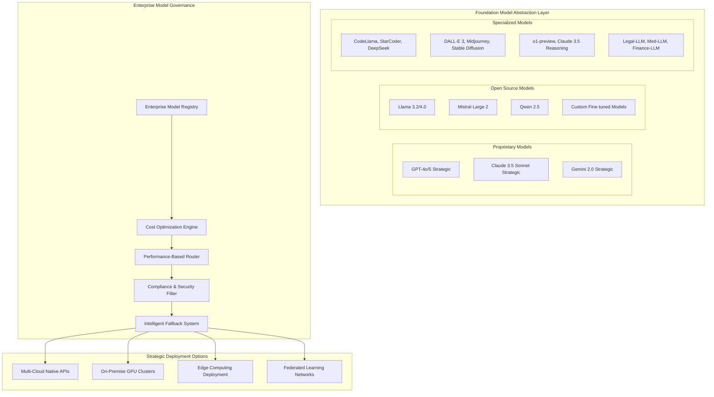
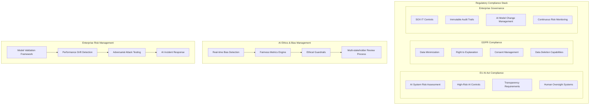
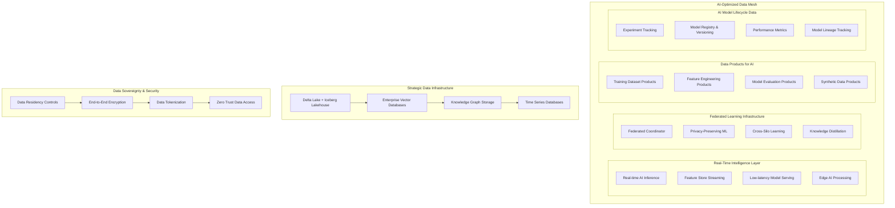
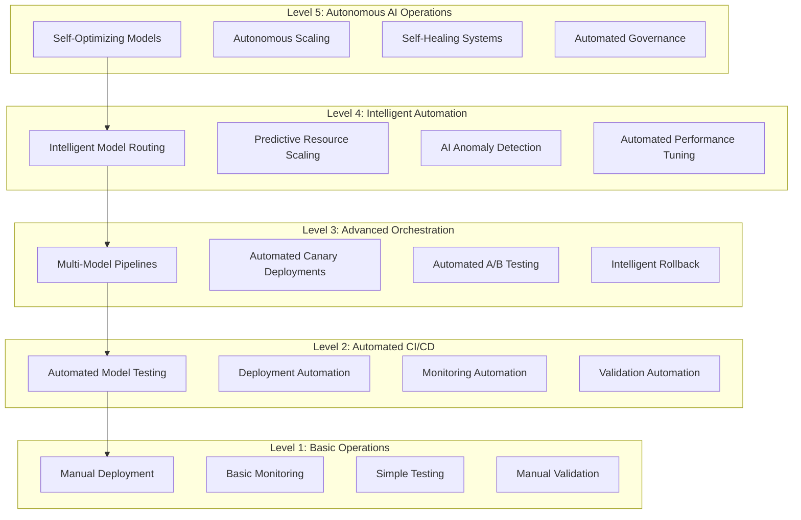
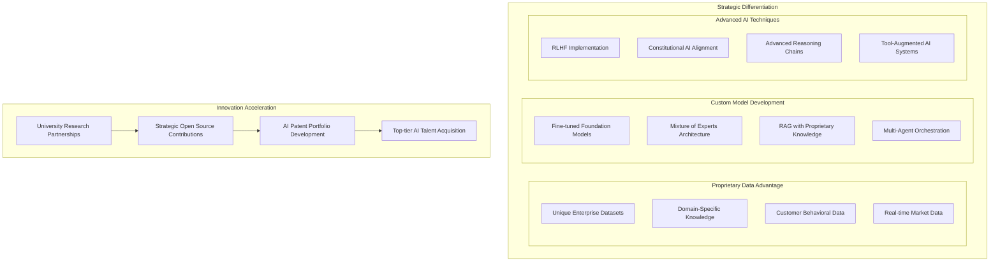

# Strategic AI Platform Architecture
## Enterprise Principal Architect Design for Future-Proof AI Platform

### Executive Summary

This architecture addresses the critical strategic imperatives for enterprise AI platforms:
- **Technology Independence**: Vendor-agnostic design preventing lock-in
- **Regulatory Compliance**: Built-in governance for EU AI Act, GDPR, SOX
- **Competitive Advantage**: Proprietary AI capabilities with open foundation
- **Risk Mitigation**: Enterprise-grade security, resilience, and auditability
- **ROI Optimization**: Cost-effective scaling with performance transparency

---

## 1. Strategic Technology Independence Framework

### Multi-Provider Foundation Model Orchestration

### Technology Independence Principles

1. **Foundation Model Abstraction**: Unified API layer across all model providers
2. **Multi-Cloud Architecture**: Azure, AWS, GCP orchestration with failover
3. **Open Source Priority**: 70% open source, 30% proprietary for critical capabilities
4. **Container-Native**: Kubernetes-native deployment across any infrastructure
5. **API-First Design**: Vendor-neutral interfaces with OpenAPI specifications

---

## 2. Enterprise AI Governance Framework

### Regulatory Compliance Architecture

### Governance Implementation Strategy

1. **Risk-Based Approach**: Automated classification of AI systems by risk level
2. **Continuous Compliance**: Real-time monitoring with automated reporting
3. **Explainable AI**: Built-in explainability for all high-stakes decisions
4. **Audit-Ready**: Immutable logging with regulatory report generation
5. **Stakeholder Engagement**: Cross-functional governance committees

---

## 3. Strategic Data Architecture for AI

### Enterprise Data Mesh for AI Workloads

### Data Strategy Principles

1. **Real-Time by Default**: Sub-100ms inference with streaming data
2. **Privacy-First**: Federated learning with differential privacy
3. **Semantic Understanding**: Knowledge graphs for contextual AI
4. **Data Sovereignty**: Geographic data control with residency compliance
5. **Quality Automation**: Automated data quality with AI validation

---

## 4. Enterprise AI Operations (AIMLOps)

### Strategic MLOps Maturity Framework

### Enterprise MLOps Implementation

1. **Model Lifecycle Automation**: Zero-touch deployment for validated models
2. **Performance SLA Management**: Automated SLA monitoring with cost optimization
3. **Multi-Environment Orchestration**: Dev/Stage/Prod with environment parity
4. **Disaster Recovery**: Cross-region model deployment with instant failover
5. **Cost Intelligence**: Real-time cost attribution with ROI tracking

---

## 5. Strategic Technology Choices

### Infrastructure Technology Stack

| **Category** | **Strategic Choice** | **Rationale** | **Vendor Independence** |
|--------------|---------------------|---------------|------------------------|
| **Container Orchestration** | Kubernetes + Istio Service Mesh | Industry standard, multi-cloud | ✅ Complete portability |
| **AI/ML Platform** | Kubeflow + MLflow + Ray | Open source, extensible | ✅ No vendor lock-in |
| **Data Lakehouse** | Delta Lake + Apache Iceberg | Open format, performance | ✅ Multi-cloud compatible |
| **Vector Database** | Weaviate + Pinecone hybrid | Performance + flexibility | ⚠️ Partial dependency |
| **Streaming** | Apache Kafka + Pulsar | Enterprise grade, scalable | ✅ Complete control |
| **Monitoring** | Prometheus + Grafana + OpenTelemetry | Open standards | ✅ Vendor agnostic |
| **Security** | Open Policy Agent + Falco | Policy as code | ✅ No proprietary deps |
| **CI/CD** | Tekton + ArgoCD | Cloud native, GitOps | ✅ Kubernetes native |

### AI Model Technology Strategy

| **Use Case** | **Primary Model** | **Fallback Model** | **Cost Optimization** |
|--------------|-------------------|-------------------|---------------------|
| **Code Generation** | GPT-4o + CodeLlama | DeepSeek + StarCoder | 70% cost reduction with OSS |
| **Document Analysis** | Claude 3.5 Sonnet | Llama 3.2 Vision | Multi-modal optimization |
| **Reasoning Tasks** | o1-preview | Custom fine-tuned | Domain-specific models |
| **Real-time Inference** | Llama 3.2 + Quantization | Edge deployment | Ultra-low latency |
| **Compliance/Legal** | Custom Legal-LLM | GPT-4 with constraints | Regulatory compliance |

---

## 6. Competitive Advantage Framework

### Proprietary AI Capabilities

### Strategic Innovation Areas

1. **Agentic AI Systems**: Multi-agent orchestration for complex business processes
2. **Neuro-Symbolic AI**: Combining neural networks with symbolic reasoning
3. **Quantum-Classical Hybrid**: Quantum-enhanced optimization algorithms
4. **Federated Intelligence**: Cross-organizational learning while preserving privacy
5. **Embodied AI**: Physical world interaction through robotics integration

---

## 7. ROI and Business Value Framework

### Financial Impact Modeling

```mermaid
graph TB
    subgraph "Revenue Generation"
        NEW_PRODUCTS[AI-Powered Product Innovation]
        MARKET_EXPANSION[New Market Opportunities]
        PREMIUM_PRICING[Premium Service Offerings]
        COMPETITIVE_ADVANTAGE[Market Share Growth]
        
        NEW_PRODUCTS --> MARKET_EXPANSION
        MARKET_EXPANSION --> PREMIUM_PRICING
        PREMIUM_PRICING --> COMPETITIVE_ADVANTAGE
    end
    
    subgraph "Cost Optimization"
        AUTOMATION[Process Automation]
        EFFICIENCY[Operational Efficiency]
        QUALITY[Quality Improvements]
        RESOURCE_OPTIMIZATION[Resource Optimization]
        
        AUTOMATION --> EFFICIENCY
        EFFICIENCY --> QUALITY
        QUALITY --> RESOURCE_OPTIMIZATION
    end
    
    subgraph "Risk Mitigation"
        COMPLIANCE_AUTOMATION[Compliance Automation]
        FRAUD_DETECTION[Advanced Fraud Detection]
        RISK_PREDICTION[Predictive Risk Management]
        SECURITY_ENHANCEMENT[AI-Enhanced Security]
        
        COMPLIANCE_AUTOMATION --> FRAUD_DETECTION
        FRAUD_DETECTION --> RISK_PREDICTION
        RISK_PREDICTION --> SECURITY_ENHANCEMENT
    end
    
    subgraph "Strategic Value"
        DATA_MONETIZATION[Data Asset Monetization]
        INNOVATION_SPEED[Innovation Acceleration]
        TALENT_RETENTION[Talent Attraction & Retention]
        BRAND_DIFFERENTIATION[Brand Differentiation]
        
        DATA_MONETIZATION --> INNOVATION_SPEED
        INNOVATION_SPEED --> TALENT_RETENTION
        TALENT_RETENTION --> BRAND_DIFFERENTIATION
    end
```

### Value Realization Timeline

| **Phase** | **Timeline** | **Key Metrics** | **Expected ROI** |
|-----------|--------------|-----------------|-----------------|
| **Foundation** | 0-6 months | Infrastructure readiness | -$2M investment |
| **Pilot Programs** | 6-12 months | 3-5 use cases deployed | 15% efficiency gain |
| **Scale Deployment** | 12-18 months | 20+ use cases, 50% coverage | 200% ROI |
| **Innovation Phase** | 18-24 months | New products launched | 400% ROI |
| **Market Leadership** | 24+ months | Industry recognition | 800% ROI |

---

## 8. Implementation Roadmap

### Executive Summary for C-Level

**Strategic Imperatives Addressed:**
1. ✅ **Technology Independence**: Multi-provider, open-source first approach
2. ✅ **Regulatory Compliance**: Built-in EU AI Act, GDPR, SOX compliance
3. ✅ **Competitive Advantage**: Proprietary capabilities on open foundation
4. ✅ **Risk Mitigation**: Enterprise-grade security and governance
5. ✅ **ROI Optimization**: Measurable value with transparent cost management

**Key Success Factors:**
- Executive sponsorship and cross-functional governance
- Phased implementation with measurable milestones
- Talent acquisition and upskilling programs
- Strategic partnerships and ecosystem development
- Continuous innovation and technology evolution

This architecture positions the organization as an AI-first enterprise with sustainable competitive advantages while maintaining technology independence and regulatory compliance.