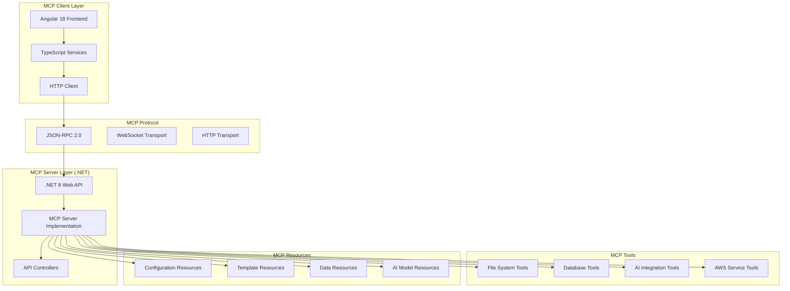

# Angular/.NET MCP Framework Implementation Guide

## 🔧 MCP Framework for .NET Integration

This document provides comprehensive guidance for implementing the Model Context Protocol (MCP) Framework in .NET 8.0 applications for the AI Platform.

## 📋 MCP Framework Overview

### **Architecture Components**



## 🏗️ .NET MCP Server Implementation

### **Core MCP Server Structure**

```csharp
// MCPServer/Core/IMCPServer.cs
using System.Text.Json;

namespace MCPServer.Core
{
    public interface IMCPServer
    {
        Task<MCPResponse> HandleRequestAsync(MCPRequest request);
        Task<IEnumerable<MCPTool>> GetToolsAsync();
        Task<IEnumerable<MCPResource>> GetResourcesAsync();
        Task<MCPResponse> CallToolAsync(string toolName, JsonElement parameters);
        Task<MCPResponse> ReadResourceAsync(string resourceUri);
    }

    public class MCPRequest
    {
        public string Id { get; set; } = string.Empty;
        public string Method { get; set; } = string.Empty;
        public JsonElement Params { get; set; }
        public string JsonRpc { get; set; } = "2.0";
    }

    public class MCPResponse
    {
        public string Id { get; set; } = string.Empty;
        public JsonElement Result { get; set; }
        public MCPError? Error { get; set; }
        public string JsonRpc { get; set; } = "2.0";
    }

    public class MCPError
    {
        public int Code { get; set; }
        public string Message { get; set; } = string.Empty;
        public JsonElement? Data { get; set; }
    }

    public class MCPTool
    {
        public string Name { get; set; } = string.Empty;
        public string Description { get; set; } = string.Empty;
        public JsonElement InputSchema { get; set; }
    }

    public class MCPResource
    {
        public string Uri { get; set; } = string.Empty;
        public string Name { get; set; } = string.Empty;
        public string Description { get; set; } = string.Empty;
        public string MimeType { get; set; } = string.Empty;
    }
}
```

### **MCP Server Implementation**

```csharp
// MCPServer/Core/MCPServerImplementation.cs
using MCPServer.Core;
using MCPServer.Tools;
using MCPServer.Resources;
using System.Text.Json;
using Microsoft.Extensions.Logging;

namespace MCPServer.Core
{
    public class MCPServerImplementation : IMCPServer
    {
        private readonly ILogger<MCPServerImplementation> _logger;
        private readonly IServiceProvider _serviceProvider;
        private readonly Dictionary<string, IMCPTool> _tools;
        private readonly Dictionary<string, IMCPResource> _resources;

        public MCPServerImplementation(
            ILogger<MCPServerImplementation> logger,
            IServiceProvider serviceProvider)
        {
            _logger = logger;
            _serviceProvider = serviceProvider;
            _tools = new Dictionary<string, IMCPTool>();
            _resources = new Dictionary<string, IMCPResource>();
            
            InitializeTools();
            InitializeResources();
        }

        public async Task<MCPResponse> HandleRequestAsync(MCPRequest request)
        {
            try
            {
                _logger.LogInformation("Handling MCP request: {Method}", request.Method);

                return request.Method switch
                {
                    "tools/list" => await GetToolsListAsync(request),
                    "tools/call" => await CallToolAsync(request),
                    "resources/list" => await GetResourcesListAsync(request),
                    "resources/read" => await ReadResourceAsync(request),
                    "initialize" => await InitializeAsync(request),
                    _ => CreateErrorResponse(request.Id, -32601, "Method not found")
                };
            }
            catch (Exception ex)
            {
                _logger.LogError(ex, "Error handling MCP request");
                return CreateErrorResponse(request.Id, -32603, "Internal error");
            }
        }

        public async Task<IEnumerable<MCPTool>> GetToolsAsync()
        {
            return _tools.Values.Select(tool => new MCPTool
            {
                Name = tool.Name,
                Description = tool.Description,
                InputSchema = tool.GetInputSchema()
            });
        }

        public async Task<IEnumerable<MCPResource>> GetResourcesAsync()
        {
            return _resources.Values.Select(resource => new MCPResource
            {
                Uri = resource.Uri,
                Name = resource.Name,
                Description = resource.Description,
                MimeType = resource.MimeType
            });
        }

        public async Task<MCPResponse> CallToolAsync(string toolName, JsonElement parameters)
        {
            if (!_tools.TryGetValue(toolName, out var tool))
            {
                return CreateErrorResponse("", -32602, $"Tool '{toolName}' not found");
            }

            try
            {
                var result = await tool.ExecuteAsync(parameters);
                return new MCPResponse
                {
                    Id = "",
                    Result = JsonSerializer.SerializeToElement(result)
                };
            }
            catch (Exception ex)
            {
                _logger.LogError(ex, "Error executing tool {ToolName}", toolName);
                return CreateErrorResponse("", -32603, $"Tool execution failed: {ex.Message}");
            }
        }

        public async Task<MCPResponse> ReadResourceAsync(string resourceUri)
        {
            if (!_resources.TryGetValue(resourceUri, out var resource))
            {
                return CreateErrorResponse("", -32602, $"Resource '{resourceUri}' not found");
            }

            try
            {
                var content = await resource.ReadAsync();
                return new MCPResponse
                {
                    Id = "",
                    Result = JsonSerializer.SerializeToElement(new { contents = content })
                };
            }
            catch (Exception ex)
            {
                _logger.LogError(ex, "Error reading resource {ResourceUri}", resourceUri);
                return CreateErrorResponse("", -32603, $"Resource read failed: {ex.Message}");
            }
        }

        private void InitializeTools()
        {
            // Register built-in tools
            RegisterTool(new FileSystemTool(_serviceProvider));
            RegisterTool(new DatabaseTool(_serviceProvider));
            RegisterTool(new AIIntegrationTool(_serviceProvider));
            RegisterTool(new AWSServiceTool(_serviceProvider));
        }

        private void InitializeResources()
        {
            // Register built-in resources
            RegisterResource(new ConfigurationResource());
            RegisterResource(new TemplateResource());
            RegisterResource(new DataResource(_serviceProvider));
        }

        private void RegisterTool(IMCPTool tool)
        {
            _tools[tool.Name] = tool;
        }

        private void RegisterResource(IMCPResource resource)
        {
            _resources[resource.Uri] = resource;
        }

        private async Task<MCPResponse> GetToolsListAsync(MCPRequest request)
        {
            var tools = await GetToolsAsync();
            return new MCPResponse
            {
                Id = request.Id,
                Result = JsonSerializer.SerializeToElement(new { tools })
            };
        }

        private async Task<MCPResponse> CallToolAsync(MCPRequest request)
        {
            var toolName = request.Params.GetProperty("name").GetString();
            var arguments = request.Params.GetProperty("arguments");
            
            if (string.IsNullOrEmpty(toolName))
            {
                return CreateErrorResponse(request.Id, -32602, "Tool name is required");
            }

            return await CallToolAsync(toolName, arguments);
        }

        private async Task<MCPResponse> GetResourcesListAsync(MCPRequest request)
        {
            var resources = await GetResourcesAsync();
            return new MCPResponse
            {
                Id = request.Id,
                Result = JsonSerializer.SerializeToElement(new { resources })
            };
        }

        private async Task<MCPResponse> ReadResourceAsync(MCPRequest request)
        {
            var uri = request.Params.GetProperty("uri").GetString();
            
            if (string.IsNullOrEmpty(uri))
            {
                return CreateErrorResponse(request.Id, -32602, "Resource URI is required");
            }

            return await ReadResourceAsync(uri);
        }

        private async Task<MCPResponse> InitializeAsync(MCPRequest request)
        {
            return new MCPResponse
            {
                Id = request.Id,
                Result = JsonSerializer.SerializeToElement(new 
                { 
                    protocolVersion = "2024-11-05",
                    capabilities = new
                    {
                        tools = new { },
                        resources = new { },
                        prompts = new { }
                    },
                    serverInfo = new
                    {
                        name = "AI Platform MCP Server",
                        version = "1.0.0"
                    }
                })
            };
        }

        private static MCPResponse CreateErrorResponse(string id, int code, string message)
        {
            return new MCPResponse
            {
                Id = id,
                Error = new MCPError
                {
                    Code = code,
                    Message = message
                }
            };
        }
    }
}
```

## 🛠️ MCP Tools Implementation

### **File System Tool**

```csharp
// MCPServer/Tools/FileSystemTool.cs
using MCPServer.Core;
using System.Text.Json;
using Microsoft.Extensions.Logging;

namespace MCPServer.Tools
{
    public interface IMCPTool
    {
        string Name { get; }
        string Description { get; }
        JsonElement GetInputSchema();
        Task<object> ExecuteAsync(JsonElement parameters);
    }

    public class FileSystemTool : IMCPTool
    {
        public string Name => "filesystem";
        public string Description => "File system operations for reading, writing, and managing files";

        private readonly ILogger<FileSystemTool> _logger;

        public FileSystemTool(IServiceProvider serviceProvider)
        {
            _logger = serviceProvider.GetRequiredService<ILogger<FileSystemTool>>();
        }

        public JsonElement GetInputSchema()
        {
            var schema = new
            {
                type = "object",
                properties = new
                {
                    operation = new
                    {
                        type = "string",
                        @enum = new[] { "read", "write", "list", "delete", "create_directory" },
                        description = "The file system operation to perform"
                    },
                    path = new
                    {
                        type = "string",
                        description = "The file or directory path"
                    },
                    content = new
                    {
                        type = "string",
                        description = "Content for write operations"
                    }
                },
                required = new[] { "operation", "path" }
            };

            return JsonSerializer.SerializeToElement(schema);
        }

        public async Task<object> ExecuteAsync(JsonElement parameters)
        {
            var operation = parameters.GetProperty("operation").GetString();
            var path = parameters.GetProperty("path").GetString();

            if (string.IsNullOrEmpty(operation) || string.IsNullOrEmpty(path))
            {
                throw new ArgumentException("Operation and path are required");
            }

            // Security check - prevent path traversal
            if (path.Contains("..") || Path.IsPathRooted(path))
            {
                throw new SecurityException("Invalid path specified");
            }

            var workingDirectory = Environment.CurrentDirectory;
            var fullPath = Path.Combine(workingDirectory, path);

            return operation switch
            {
                "read" => await ReadFileAsync(fullPath),
                "write" => await WriteFileAsync(fullPath, parameters),
                "list" => await ListDirectoryAsync(fullPath),
                "delete" => await DeleteFileAsync(fullPath),
                "create_directory" => await CreateDirectoryAsync(fullPath),
                _ => throw new ArgumentException($"Unknown operation: {operation}")
            };
        }

        private async Task<object> ReadFileAsync(string path)
        {
            if (!File.Exists(path))
            {
                throw new FileNotFoundException($"File not found: {path}");
            }

            var content = await File.ReadAllTextAsync(path);
            return new { content, size = content.Length };
        }

        private async Task<object> WriteFileAsync(string path, JsonElement parameters)
        {
            var content = parameters.TryGetProperty("content", out var contentElement) 
                ? contentElement.GetString() ?? string.Empty
                : string.Empty;

            var directory = Path.GetDirectoryName(path);
            if (!string.IsNullOrEmpty(directory) && !Directory.Exists(directory))
            {
                Directory.CreateDirectory(directory);
            }

            await File.WriteAllTextAsync(path, content);
            return new { success = true, bytesWritten = content.Length };
        }

        private async Task<object> ListDirectoryAsync(string path)
        {
            if (!Directory.Exists(path))
            {
                throw new DirectoryNotFoundException($"Directory not found: {path}");
            }

            var files = Directory.GetFiles(path)
                .Select(f => new
                {
                    name = Path.GetFileName(f),
                    type = "file",
                    size = new FileInfo(f).Length,
                    lastModified = File.GetLastWriteTime(f)
                });

            var directories = Directory.GetDirectories(path)
                .Select(d => new
                {
                    name = Path.GetFileName(d),
                    type = "directory",
                    lastModified = Directory.GetLastWriteTime(d)
                });

            return new { files = files.Concat(directories) };
        }

        private async Task<object> DeleteFileAsync(string path)
        {
            if (File.Exists(path))
            {
                File.Delete(path);
                return new { success = true, message = "File deleted" };
            }
            else if (Directory.Exists(path))
            {
                Directory.Delete(path, true);
                return new { success = true, message = "Directory deleted" };
            }
            else
            {
                throw new FileNotFoundException($"Path not found: {path}");
            }
        }

        private async Task<object> CreateDirectoryAsync(string path)
        {
            Directory.CreateDirectory(path);
            return new { success = true, path };
        }
    }
}
```

### **Database Tool**

```csharp
// MCPServer/Tools/DatabaseTool.cs
using MCPServer.Core;
using System.Text.Json;
using Microsoft.EntityFrameworkCore;
using Microsoft.Extensions.Logging;

namespace MCPServer.Tools
{
    public class DatabaseTool : IMCPTool
    {
        public string Name => "database";
        public string Description => "Database operations for querying and managing data";

        private readonly ILogger<DatabaseTool> _logger;
        private readonly IDbContextFactory<ApplicationDbContext> _dbContextFactory;

        public DatabaseTool(IServiceProvider serviceProvider)
        {
            _logger = serviceProvider.GetRequiredService<ILogger<DatabaseTool>>();
            _dbContextFactory = serviceProvider.GetRequiredService<IDbContextFactory<ApplicationDbContext>>();
        }

        public JsonElement GetInputSchema()
        {
            var schema = new
            {
                type = "object",
                properties = new
                {
                    operation = new
                    {
                        type = "string",
                        @enum = new[] { "query", "execute", "schema" },
                        description = "The database operation to perform"
                    },
                    sql = new
                    {
                        type = "string",
                        description = "SQL query or command to execute"
                    },
                    table = new
                    {
                        type = "string",
                        description = "Table name for schema operations"
                    }
                },
                required = new[] { "operation" }
            };

            return JsonSerializer.SerializeToElement(schema);
        }

        public async Task<object> ExecuteAsync(JsonElement parameters)
        {
            var operation = parameters.GetProperty("operation").GetString();

            return operation switch
            {
                "query" => await ExecuteQueryAsync(parameters),
                "execute" => await ExecuteCommandAsync(parameters),
                "schema" => await GetSchemaAsync(parameters),
                _ => throw new ArgumentException($"Unknown operation: {operation}")
            };
        }

        private async Task<object> ExecuteQueryAsync(JsonElement parameters)
        {
            var sql = parameters.GetProperty("sql").GetString();
            if (string.IsNullOrEmpty(sql))
            {
                throw new ArgumentException("SQL query is required");
            }

            // Security check - only allow SELECT statements
            if (!sql.Trim().StartsWith("SELECT", StringComparison.OrdinalIgnoreCase))
            {
                throw new SecurityException("Only SELECT queries are allowed");
            }

            using var context = await _dbContextFactory.CreateDbContextAsync();
            
            // Execute raw SQL query
            var connection = context.Database.GetDbConnection();
            await connection.OpenAsync();

            using var command = connection.CreateCommand();
            command.CommandText = sql;

            using var reader = await command.ExecuteReaderAsync();
            var results = new List<Dictionary<string, object>>();

            while (await reader.ReadAsync())
            {
                var row = new Dictionary<string, object>();
                for (int i = 0; i < reader.FieldCount; i++)
                {
                    row[reader.GetName(i)] = reader.GetValue(i);
                }
                results.Add(row);
            }

            return new { data = results, rowCount = results.Count };
        }

        private async Task<object> ExecuteCommandAsync(JsonElement parameters)
        {
            var sql = parameters.GetProperty("sql").GetString();
            if (string.IsNullOrEmpty(sql))
            {
                throw new ArgumentException("SQL command is required");
            }

            // Security check - prevent dangerous operations
            var dangerousKeywords = new[] { "DROP", "DELETE", "TRUNCATE", "ALTER" };
            if (dangerousKeywords.Any(keyword => 
                sql.Contains(keyword, StringComparison.OrdinalIgnoreCase)))
            {
                throw new SecurityException("Dangerous SQL operations are not allowed");
            }

            using var context = await _dbContextFactory.CreateDbContextAsync();
            var rowsAffected = await context.Database.ExecuteSqlRawAsync(sql);

            return new { success = true, rowsAffected };
        }

        private async Task<object> GetSchemaAsync(JsonElement parameters)
        {
            using var context = await _dbContextFactory.CreateDbContextAsync();
            
            if (parameters.TryGetProperty("table", out var tableElement))
            {
                var tableName = tableElement.GetString();
                return await GetTableSchemaAsync(context, tableName);
            }
            else
            {
                return await GetDatabaseSchemaAsync(context);
            }
        }

        private async Task<object> GetTableSchemaAsync(ApplicationDbContext context, string tableName)
        {
            var sql = @"
                SELECT 
                    COLUMN_NAME,
                    DATA_TYPE,
                    IS_NULLABLE,
                    COLUMN_DEFAULT,
                    CHARACTER_MAXIMUM_LENGTH
                FROM INFORMATION_SCHEMA.COLUMNS 
                WHERE TABLE_NAME = @tableName
                ORDER BY ORDINAL_POSITION";

            var connection = context.Database.GetDbConnection();
            await connection.OpenAsync();

            using var command = connection.CreateCommand();
            command.CommandText = sql;
            
            var parameter = command.CreateParameter();
            parameter.ParameterName = "@tableName";
            parameter.Value = tableName;
            command.Parameters.Add(parameter);

            using var reader = await command.ExecuteReaderAsync();
            var columns = new List<object>();

            while (await reader.ReadAsync())
            {
                columns.Add(new
                {
                    name = reader["COLUMN_NAME"],
                    type = reader["DATA_TYPE"],
                    nullable = reader["IS_NULLABLE"],
                    defaultValue = reader["COLUMN_DEFAULT"],
                    maxLength = reader["CHARACTER_MAXIMUM_LENGTH"]
                });
            }

            return new { table = tableName, columns };
        }

        private async Task<object> GetDatabaseSchemaAsync(ApplicationDbContext context)
        {
            var sql = @"
                SELECT TABLE_NAME
                FROM INFORMATION_SCHEMA.TABLES
                WHERE TABLE_TYPE = 'BASE TABLE'
                ORDER BY TABLE_NAME";

            var connection = context.Database.GetDbConnection();
            await connection.OpenAsync();

            using var command = connection.CreateCommand();
            command.CommandText = sql;

            using var reader = await command.ExecuteReaderAsync();
            var tables = new List<string>();

            while (await reader.ReadAsync())
            {
                tables.Add(reader["TABLE_NAME"].ToString());
            }

            return new { tables };
        }
    }
}
```

## 🚀 Angular Integration

### **MCP Client Service**

```typescript
// src/app/services/mcp-client.service.ts
import { Injectable } from '@angular/core';
import { HttpClient } from '@angular/common/http';
import { Observable, BehaviorSubject } from 'rxjs';

export interface MCPRequest {
  id: string;
  method: string;
  params: any;
  jsonrpc: string;
}

export interface MCPResponse {
  id: string;
  result?: any;
  error?: {
    code: number;
    message: string;
    data?: any;
  };
  jsonrpc: string;
}

export interface MCPTool {
  name: string;
  description: string;
  inputSchema: any;
}

@Injectable({
  providedIn: 'root'
})
export class MCPClientService {
  private readonly baseUrl = '/api/mcp';
  private toolsSubject = new BehaviorSubject<MCPTool[]>([]);
  
  public tools$ = this.toolsSubject.asObservable();

  constructor(private http: HttpClient) {
    this.initializeConnection();
  }

  private async initializeConnection(): Promise<void> {
    try {
      await this.initialize();
      await this.loadTools();
    } catch (error) {
      console.error('Failed to initialize MCP connection:', error);
    }
  }

  private generateId(): string {
    return Math.random().toString(36).substring(2, 15);
  }

  private async sendRequest(method: string, params: any = {}): Promise<MCPResponse> {
    const request: MCPRequest = {
      id: this.generateId(),
      method,
      params,
      jsonrpc: '2.0'
    };

    return this.http.post<MCPResponse>(this.baseUrl, request).toPromise();
  }

  async initialize(): Promise<void> {
    const response = await this.sendRequest('initialize', {
      protocolVersion: '2024-11-05',
      capabilities: {
        tools: {},
        resources: {}
      },
      clientInfo: {
        name: 'AI Platform Angular Client',
        version: '1.0.0'
      }
    });

    if (response.error) {
      throw new Error(`Initialization failed: ${response.error.message}`);
    }
  }

  async loadTools(): Promise<void> {
    const response = await this.sendRequest('tools/list');
    
    if (response.error) {
      throw new Error(`Failed to load tools: ${response.error.message}`);
    }

    this.toolsSubject.next(response.result.tools);
  }

  async callTool(name: string, arguments: any): Promise<any> {
    const response = await this.sendRequest('tools/call', {
      name,
      arguments
    });

    if (response.error) {
      throw new Error(`Tool execution failed: ${response.error.message}`);
    }

    return response.result;
  }

  async readFile(path: string): Promise<string> {
    const result = await this.callTool('filesystem', {
      operation: 'read',
      path
    });

    return result.content;
  }

  async writeFile(path: string, content: string): Promise<void> {
    await this.callTool('filesystem', {
      operation: 'write',
      path,
      content
    });
  }

  async listDirectory(path: string): Promise<any[]> {
    const result = await this.callTool('filesystem', {
      operation: 'list',
      path
    });

    return result.files;
  }

  async executeQuery(sql: string): Promise<any[]> {
    const result = await this.callTool('database', {
      operation: 'query',
      sql
    });

    return result.data;
  }
}
```

### **MCP Tool Component**

```typescript
// src/app/components/mcp-tools/mcp-tools.component.ts
import { Component, OnInit } from '@angular/core';
import { MCPClientService, MCPTool } from '../../services/mcp-client.service';
import { FormBuilder, FormGroup } from '@angular/forms';

@Component({
  selector: 'app-mcp-tools',
  templateUrl: './mcp-tools.component.html',
  styleUrls: ['./mcp-tools.component.scss']
})
export class MCPToolsComponent implements OnInit {
  tools: MCPTool[] = [];
  selectedTool: MCPTool | null = null;
  toolForm: FormGroup;
  result: any = null;
  loading = false;

  constructor(
    private mcpClient: MCPClientService,
    private fb: FormBuilder
  ) {
    this.toolForm = this.fb.group({});
  }

  ngOnInit(): void {
    this.mcpClient.tools$.subscribe(tools => {
      this.tools = tools;
    });
  }

  selectTool(tool: MCPTool): void {
    this.selectedTool = tool;
    this.buildToolForm(tool);
  }

  private buildToolForm(tool: MCPTool): void {
    const formConfig: any = {};
    
    if (tool.inputSchema.properties) {
      Object.keys(tool.inputSchema.properties).forEach(key => {
        formConfig[key] = [''];
      });
    }

    this.toolForm = this.fb.group(formConfig);
  }

  async executeTool(): Promise<void> {
    if (!this.selectedTool) return;

    this.loading = true;
    this.result = null;

    try {
      const parameters = this.toolForm.value;
      this.result = await this.mcpClient.callTool(this.selectedTool.name, parameters);
    } catch (error) {
      this.result = { error: error.message };
    } finally {
      this.loading = false;
    }
  }
}
```

## 📝 Configuration and Deployment

### **Startup Configuration**

```csharp
// Program.cs
using MCPServer.Core;
using MCPServer.Tools;
using MCPServer.Resources;
using Microsoft.EntityFrameworkCore;

var builder = WebApplication.CreateBuilder(args);

// Add services
builder.Services.AddControllers();
builder.Services.AddDbContextFactory<ApplicationDbContext>(options =>
    options.UseNpgsql(builder.Configuration.GetConnectionString("DefaultConnection")));

// Register MCP Server
builder.Services.AddSingleton<IMCPServer, MCPServerImplementation>();
builder.Services.AddTransient<FileSystemTool>();
builder.Services.AddTransient<DatabaseTool>();
builder.Services.AddTransient<AIIntegrationTool>();
builder.Services.AddTransient<AWSServiceTool>();

// Add CORS
builder.Services.AddCors(options =>
{
    options.AddPolicy("AllowAngular", policy =>
    {
        policy.WithOrigins("http://localhost:4200")
              .AllowAnyMethod()
              .AllowAnyHeader();
    });
});

var app = builder.Build();

// Configure pipeline
if (app.Environment.IsDevelopment())
{
    app.UseSwagger();
    app.UseSwaggerUI();
}

app.UseHttpsRedirection();
app.UseCors("AllowAngular");
app.UseAuthorization();
app.MapControllers();

app.Run();
```

This comprehensive MCP Framework implementation provides a robust foundation for Angular/.NET AI Platform integration with proper tool management, resource handling, and security considerations.