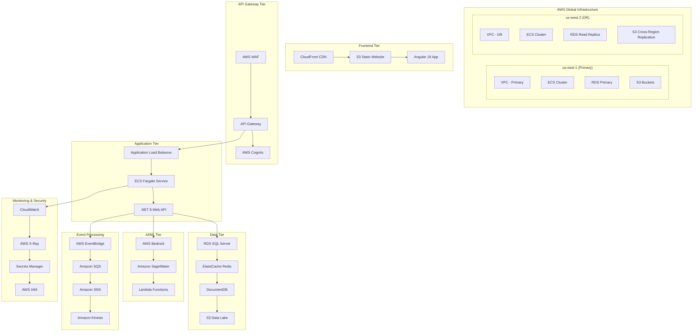

# AWS Infrastructure Implementation - AI Platform

## 🏗️ Complete AWS Infrastructure for Angular/.NET AI Platform

This document provides comprehensive AWS infrastructure implementation for the AI Platform using Infrastructure as Code (Terraform) with AWS best practices.

## 📋 Infrastructure Overview

### **AWS Services Architecture**



## 🛠️ Terraform Infrastructure

### **Main Infrastructure Configuration**

```hcl
# main.tf
terraform {
  required_version = ">= 1.0"
  required_providers {
    aws = {
      source  = "hashicorp/aws"
      version = "~> 5.0"
    }
  }
  
  backend "s3" {
    bucket = "ai-platform-terraform-state"
    key    = "infrastructure/terraform.tfstate"
    region = "us-east-1"
  }
}

provider "aws" {
  region = var.aws_region
  
  default_tags {
    tags = {
      Project     = "ai-platform"
      Environment = var.environment
      ManagedBy   = "terraform"
    }
  }
}

# Variables
variable "aws_region" {
  description = "AWS region"
  type        = string
  default     = "us-east-1"
}

variable "environment" {
  description = "Environment name"
  type        = string
  default     = "prod"
}

variable "app_name" {
  description = "Application name"
  type        = string
  default     = "ai-platform"
}

# VPC Module
module "vpc" {
  source = "./modules/vpc"
  
  app_name    = var.app_name
  environment = var.environment
  
  vpc_cidr             = "10.0.0.0/16"
  availability_zones   = ["us-east-1a", "us-east-1b", "us-east-1c"]
  public_subnet_cidrs  = ["10.0.1.0/24", "10.0.2.0/24", "10.0.3.0/24"]
  private_subnet_cidrs = ["10.0.4.0/24", "10.0.5.0/24", "10.0.6.0/24"]
}

# ECS Cluster
module "ecs_cluster" {
  source = "./modules/ecs"
  
  app_name    = var.app_name
  environment = var.environment
  vpc_id      = module.vpc.vpc_id
  subnet_ids  = module.vpc.private_subnet_ids
}

# RDS Database
module "database" {
  source = "./modules/rds"
  
  app_name    = var.app_name
  environment = var.environment
  vpc_id      = module.vpc.vpc_id
  subnet_ids  = module.vpc.private_subnet_ids
  
  engine_version    = "15.3"
  instance_class    = "db.r6g.xlarge"
  allocated_storage = 100
}

# API Gateway
module "api_gateway" {
  source = "./modules/api-gateway"
  
  app_name    = var.app_name
  environment = var.environment
  
  target_url = module.ecs_cluster.alb_dns_name
}

# S3 Buckets
module "s3" {
  source = "./modules/s3"
  
  app_name    = var.app_name
  environment = var.environment
}

# CloudFront Distribution
module "cloudfront" {
  source = "./modules/cloudfront"
  
  app_name    = var.app_name
  environment = var.environment
  
  s3_bucket_domain = module.s3.frontend_bucket_domain
  api_gateway_domain = module.api_gateway.api_gateway_domain
}

# Cognito User Pool
module "cognito" {
  source = "./modules/cognito"
  
  app_name    = var.app_name
  environment = var.environment
}

# ElastiCache Redis
module "elasticache" {
  source = "./modules/elasticache"
  
  app_name    = var.app_name
  environment = var.environment
  vpc_id      = module.vpc.vpc_id
  subnet_ids  = module.vpc.private_subnet_ids
}

# EventBridge
module "eventbridge" {
  source = "./modules/eventbridge"
  
  app_name    = var.app_name
  environment = var.environment
}

# Lambda Functions
module "lambda" {
  source = "./modules/lambda"
  
  app_name    = var.app_name
  environment = var.environment
  vpc_id      = module.vpc.vpc_id
  subnet_ids  = module.vpc.private_subnet_ids
}

# CloudWatch Monitoring
module "monitoring" {
  source = "./modules/monitoring"
  
  app_name    = var.app_name
  environment = var.environment
  
  ecs_cluster_name = module.ecs_cluster.cluster_name
  rds_instance_id  = module.database.instance_id
}
```

### **ECS Service Configuration**

```hcl
# modules/ecs/main.tf
resource "aws_ecs_cluster" "main" {
  name = "${var.app_name}-${var.environment}"
  
  configuration {
    execute_command_configuration {
      logging = "OVERRIDE"
      
      log_configuration {
        cloud_watch_log_group_name = aws_cloudwatch_log_group.ecs.name
      }
    }
  }
}

resource "aws_ecs_cluster_capacity_providers" "main" {
  cluster_name = aws_ecs_cluster.main.name
  
  capacity_providers = ["FARGATE", "FARGATE_SPOT"]
  
  default_capacity_provider_strategy {
    base              = 1
    weight            = 100
    capacity_provider = "FARGATE"
  }
}

# Task Definition
resource "aws_ecs_task_definition" "app" {
  family                   = "${var.app_name}-${var.environment}"
  requires_compatibilities = ["FARGATE"]
  network_mode            = "awsvpc"
  cpu                     = 1024
  memory                  = 2048
  execution_role_arn      = aws_iam_role.ecs_execution_role.arn
  task_role_arn          = aws_iam_role.ecs_task_role.arn
  
  container_definitions = jsonencode([
    {
      name  = "ai-platform-api"
      image = "${var.ecr_repository_url}:latest"
      
      essential = true
      
      portMappings = [
        {
          containerPort = 80
          protocol      = "tcp"
        }
      ]
      
      environment = [
        {
          name  = "ASPNETCORE_ENVIRONMENT"
          value = var.environment
        },
        {
          name  = "ConnectionStrings__DefaultConnection"
          value = var.database_connection_string
        }
      ]
      
      secrets = [
        {
          name      = "JWT_SECRET"
          valueFrom = aws_secretsmanager_secret.jwt_secret.arn
        }
      ]
      
      logConfiguration = {
        logDriver = "awslogs"
        options = {
          awslogs-group         = aws_cloudwatch_log_group.ecs.name
          awslogs-region        = var.aws_region
          awslogs-stream-prefix = "ecs"
        }
      }
      
      healthCheck = {
        command = ["CMD-SHELL", "curl -f http://localhost/health || exit 1"]
        interval = 30
        timeout = 5
        retries = 3
      }
    }
  ])
}

# ECS Service
resource "aws_ecs_service" "app" {
  name            = "${var.app_name}-${var.environment}"
  cluster         = aws_ecs_cluster.main.id
  task_definition = aws_ecs_task_definition.app.arn
  desired_count   = var.desired_count
  
  capacity_provider_strategy {
    capacity_provider = "FARGATE"
    weight           = 100
  }
  
  network_configuration {
    security_groups  = [aws_security_group.ecs_tasks.id]
    subnets         = var.subnet_ids
    assign_public_ip = false
  }
  
  load_balancer {
    target_group_arn = aws_lb_target_group.app.arn
    container_name   = "ai-platform-api"
    container_port   = 80
  }
  
  depends_on = [aws_lb_listener.app]
  
  lifecycle {
    ignore_changes = [desired_count]
  }
}

# Application Load Balancer
resource "aws_lb" "app" {
  name               = "${var.app_name}-${var.environment}"
  internal           = true
  load_balancer_type = "application"
  security_groups    = [aws_security_group.alb.id]
  subnets           = var.subnet_ids
  
  enable_deletion_protection = false
}

resource "aws_lb_target_group" "app" {
  name        = "${var.app_name}-${var.environment}"
  port        = 80
  protocol    = "HTTP"
  vpc_id      = var.vpc_id
  target_type = "ip"
  
  health_check {
    enabled             = true
    healthy_threshold   = 2
    unhealthy_threshold = 2
    timeout            = 5
    interval           = 30
    path               = "/health"
    matcher            = "200"
  }
}

resource "aws_lb_listener" "app" {
  load_balancer_arn = aws_lb.app.arn
  port              = "80"
  protocol          = "HTTP"
  
  default_action {
    type             = "forward"
    target_group_arn = aws_lb_target_group.app.arn
  }
}
```

### **RDS Configuration**

```hcl
# modules/rds/main.tf
resource "aws_db_subnet_group" "main" {
  name       = "${var.app_name}-${var.environment}"
  subnet_ids = var.subnet_ids
  
  tags = {
    Name = "${var.app_name}-${var.environment}-db-subnet-group"
  }
}

resource "aws_db_parameter_group" "main" {
  family = "postgres15"
  name   = "${var.app_name}-${var.environment}"
  
  parameter {
    name  = "log_statement"
    value = "all"
  }
}

resource "aws_db_instance" "main" {
  identifier = "${var.app_name}-${var.environment}"
  
  engine         = "postgres"
  engine_version = var.engine_version
  instance_class = var.instance_class
  
  allocated_storage     = var.allocated_storage
  max_allocated_storage = var.allocated_storage * 2
  
  db_name  = var.database_name
  username = var.database_username
  password = var.database_password
  
  vpc_security_group_ids = [aws_security_group.rds.id]
  db_subnet_group_name   = aws_db_subnet_group.main.name
  parameter_group_name   = aws_db_parameter_group.main.name
  
  backup_retention_period = 7
  backup_window          = "03:00-04:00"
  maintenance_window     = "Sun:04:00-Sun:05:00"
  
  storage_encrypted = true
  kms_key_id       = aws_kms_key.rds.arn
  
  deletion_protection = true
  skip_final_snapshot = false
  final_snapshot_identifier = "${var.app_name}-${var.environment}-final-snapshot"
  
  performance_insights_enabled = true
  monitoring_interval         = 60
  monitoring_role_arn        = aws_iam_role.rds_monitoring.arn
  
  tags = {
    Name = "${var.app_name}-${var.environment}-database"
  }
}

# Read Replica for DR
resource "aws_db_instance" "read_replica" {
  identifier = "${var.app_name}-${var.environment}-read-replica"
  
  replicate_source_db = aws_db_instance.main.id
  
  instance_class = var.instance_class
  
  storage_encrypted = true
  
  tags = {
    Name = "${var.app_name}-${var.environment}-read-replica"
  }
}
```

## 🚀 Deployment Strategy

### **Environment Configuration**

```yaml
# environments/prod.tfvars
aws_region  = "us-east-1"
environment = "prod"
app_name    = "ai-platform"

# ECS Configuration
desired_count = 3
cpu          = 1024
memory       = 2048

# RDS Configuration
instance_class     = "db.r6g.xlarge"
allocated_storage  = 100
database_name      = "aiplatform"
multi_az          = true

# ElastiCache Configuration
node_type         = "cache.r6g.large"
num_cache_nodes   = 3

# Auto Scaling Configuration
min_capacity = 2
max_capacity = 10
```

### **Deployment Commands**

```bash
# Initialize Terraform
terraform init

# Plan deployment
terraform plan -var-file="environments/prod.tfvars"

# Apply infrastructure
terraform apply -var-file="environments/prod.tfvars"

# Deploy application
aws ecs update-service \
  --cluster ai-platform-prod \
  --service ai-platform-prod \
  --force-new-deployment
```

## 🔐 Security Implementation

### **IAM Policies**

```json
{
  "Version": "2012-10-17",
  "Statement": [
    {
      "Effect": "Allow",
      "Action": [
        "bedrock:InvokeModel",
        "bedrock:ListModels"
      ],
      "Resource": "*"
    },
    {
      "Effect": "Allow",
      "Action": [
        "s3:GetObject",
        "s3:PutObject"
      ],
      "Resource": "arn:aws:s3:::ai-platform-*/*"
    }
  ]
}
```

### **VPC Security Groups**

```hcl
resource "aws_security_group" "ecs_tasks" {
  name_prefix = "${var.app_name}-ecs-tasks"
  vpc_id      = var.vpc_id
  
  ingress {
    protocol        = "tcp"
    from_port       = 80
    to_port         = 80
    security_groups = [aws_security_group.alb.id]
  }
  
  egress {
    protocol    = "-1"
    from_port   = 0
    to_port     = 0
    cidr_blocks = ["0.0.0.0/0"]
  }
}
```

## 📊 Cost Optimization

### **Monthly Cost Estimate**

| **Service** | **Configuration** | **Monthly Cost** |
|------------|------------------|------------------|
| ECS Fargate | 3 tasks, 1vCPU, 2GB | $65 |
| RDS PostgreSQL | db.r6g.xlarge | $340 |
| ElastiCache Redis | cache.r6g.large x3 | $245 |
| API Gateway | 1M requests | $3.50 |
| CloudFront | 1TB transfer | $85 |
| S3 Storage | 100GB | $2.30 |
| CloudWatch | Standard monitoring | $15 |
| **Total** | | **~$756/month** |

### **Cost Optimization Strategies**

1. **Reserved Instances**: 40% savings on RDS and ElastiCache
2. **Spot Instances**: 70% savings on non-critical ECS tasks
3. **S3 Intelligent Tiering**: Automatic cost optimization
4. **CloudWatch Logs Retention**: 30-day retention policy

## 🔄 Continuous Deployment

### **CodePipeline Configuration**

```yaml
version: 0.2
phases:
  pre_build:
    commands:
      - echo Logging in to Amazon ECR...
      - aws ecr get-login-password --region $AWS_DEFAULT_REGION | docker login --username AWS --password-stdin $AWS_ACCOUNT_ID.dkr.ecr.$AWS_DEFAULT_REGION.amazonaws.com
  build:
    commands:
      - echo Build started on `date`
      - echo Building the Docker image...
      - docker build -t $IMAGE_REPO_NAME:$IMAGE_TAG .
      - docker tag $IMAGE_REPO_NAME:$IMAGE_TAG $AWS_ACCOUNT_ID.dkr.ecr.$AWS_DEFAULT_REGION.amazonaws.com/$IMAGE_REPO_NAME:$IMAGE_TAG
  post_build:
    commands:
      - echo Build completed on `date`
      - echo Pushing the Docker image...
      - docker push $AWS_ACCOUNT_ID.dkr.ecr.$AWS_DEFAULT_REGION.amazonaws.com/$IMAGE_REPO_NAME:$IMAGE_TAG
```

This comprehensive AWS infrastructure provides enterprise-grade scalability, security, and reliability for the Angular/.NET AI Platform implementation.