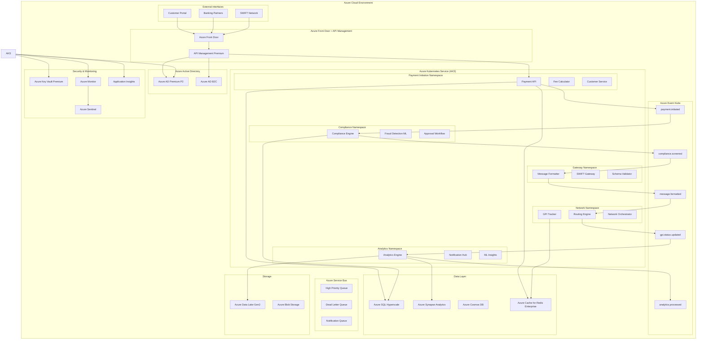

# Azure Enterprise Cross-Border Payment Architecture

## 🎯 Executive Overview

This document presents a comprehensive Azure-native implementation of the Level 0 Enterprise Cross-Border Payment Architecture, specifically designed for Tier 1 banks and FinTech organizations requiring enterprise-grade security, compliance, and scalability.

### 🏗️ Architecture Principles

- **Cloud-Native Design**: Built specifically for Azure services and capabilities
- **Enterprise Security**: Zero-trust architecture with Azure Active Directory integration
- **Financial Compliance**: PCI DSS Level 1, SOX, GDPR, and PMPG Use-Case 1a compliance
- **High Availability**: 99.95% uptime SLA with multi-region disaster recovery
- **Elastic Scaling**: Auto-scaling capabilities to handle peak transaction volumes
- **Cost Optimization**: Pay-as-you-scale model with reserved instance optimization

## 🏛️ Azure Service Mapping Overview

| **Architecture Layer** | **Azure Service** | **Purpose** | **Enterprise Benefits** |
|------------------------|-------------------|-------------|------------------------|
| **API Gateway** | Azure API Management Premium | Enterprise API gateway with OAuth 2.0 | Rate limiting, API versioning, developer portal |
| **Identity & Access** | Azure Active Directory Premium P2 | Zero-trust identity management | MFA, conditional access, PIM |
| **Compute Platform** | Azure Kubernetes Service (AKS) | Container orchestration | Auto-scaling, service mesh, blue-green deployments |
| **Event Streaming** | Azure Event Hubs Premium | High-throughput event ingestion | 20MB/s throughput, Apache Kafka compatibility |
| **Message Queues** | Azure Service Bus Premium | Reliable message queuing | Dead letter queues, duplicate detection |
| **Databases** | Azure SQL Database Hyperscale | Operational data store | 100TB scalability, read replicas |
| **Analytics** | Azure Synapse Analytics | Enterprise data warehouse | Unlimited compute, Apache Spark integration |
| **Caching** | Azure Cache for Redis Enterprise | High-performance caching | 99.95% SLA, clustering support |
| **Security** | Azure Key Vault Premium | Secrets and certificate management | HSM-backed keys, audit logging |
| **Monitoring** | Azure Monitor + Application Insights | Full-stack observability | APM, distributed tracing, alerting |

## 🏗️ Azure-Native Architecture Diagram



## 🚀 Stage-by-Stage Azure Implementation

### Stage 1: Payment Initiation (Azure API Management + AKS)

#### **Azure Services Configuration**

```yaml
azure_api_management:
  tier: "Premium"
  capacity: 4
  features:
    - "Virtual Network Integration"
    - "Multi-region deployment"
    - "OAuth 2.0 / OpenID Connect"
    - "Rate limiting per customer tier"
    - "API versioning (v1, v2, v3)"
    - "Developer portal"
    - "Analytics and monitoring"
  
  policies:
    authentication:
      - "JWT validation with Azure AD"
      - "Certificate-based authentication for B2B"
      - "Rate limiting: 1000/5000/10000 req/min by tier"
    
    transformation:
      - "Request/response transformation"
      - "Header injection for correlation IDs"
      - "Backend routing based on customer tier"

azure_kubernetes_service:
  cluster_configuration:
    node_pools:
      system_pool:
        vm_size: "Standard_D4s_v3"
        node_count: 3
        auto_scaling: "enabled"
        max_count: 10
      
      payment_pool:
        vm_size: "Standard_D8s_v3" 
        node_count: 5
        auto_scaling: "enabled"
        max_count: 20
        
      ml_pool:
        vm_size: "Standard_D16s_v3"
        node_count: 2
        auto_scaling: "enabled"
        max_count: 10
    
    networking:
      network_plugin: "azure"
      service_cidr: "10.0.0.0/16"
      dns_service_ip: "10.0.0.10"
      pod_cidr: "10.244.0.0/16"
    
    security:
      rbac: "enabled"
      azure_ad_integration: "enabled"
      pod_security_standards: "restricted"
      network_policies: "azure"

payment_initiation_services:
  payment_api:
    deployment:
      replicas: 5
      resources:
        requests: {cpu: "500m", memory: "1Gi"}
        limits: {cpu: "2000m", memory: "4Gi"}
      
    azure_integrations:
      identity: "Azure AD Managed Identity"
      secrets: "Azure Key Vault integration"
      monitoring: "Application Insights"
      logging: "Azure Monitor Logs"
    
    endpoints:
      - "POST /api/v1/payments/initiate"
      - "GET /api/v1/payments/{uetr}/status"
      - "PUT /api/v1/payments/{uetr}/cancel"
      - "GET /api/v1/customers/{id}/payments"
    
    performance_targets:
      response_time: "< 100ms P95"
      throughput: "5,000 TPS"
      availability: "99.95%"

  fee_calculator:
    deployment:
      replicas: 3
      resources:
        requests: {cpu: "250m", memory: "512Mi"}
        limits: {cpu: "1000m", memory: "2Gi"}
    
    azure_integrations:
      pricing_data: "Azure Cosmos DB"
      caching: "Azure Cache for Redis"
      ml_models: "Azure Machine Learning"
```

### Stage 2: Compliance & Risk Management (Azure AI + ML Services)

#### **Azure AI/ML Integration**

```yaml
azure_cognitive_services:
  fraud_detection:
    service: "Azure Machine Learning"
    model_deployment:
      compute_type: "Azure Container Instances"
      scaling: "Auto-scaling enabled"
      performance: "< 50ms inference time"
    
    features:
      - "Real-time transaction scoring"
      - "Behavioral analytics"
      - "Anomaly detection"
      - "Geographic risk assessment"
    
    data_sources:
      - "Transaction history from Azure SQL"
      - "Customer profiles from Cosmos DB"
      - "External threat intelligence feeds"

compliance_engine:
  aml_screening:
    service: "Azure Cognitive Services"
    capabilities:
      - "Entity recognition for sanctions screening"
      - "Fuzzy name matching"
      - "PEP (Politically Exposed Person) detection"
      - "Watch list integration"
    
    performance_targets:
      screening_time: "< 200ms per transaction"
      accuracy: "> 99.5% true positive rate"
      false_positive_rate: "< 2%"

  ofac_integration:
    data_source: "Real-time OFAC feeds"
    update_frequency: "Every 4 hours"
    storage: "Azure Cosmos DB with global distribution"
    caching: "Azure Cache for Redis for hot data"

azure_sql_database:
  configuration:
    service_tier: "Hyperscale"
    compute_tier: "Gen5"
    vcores: 16
    storage: "Auto-scaling up to 100TB"
    backup_retention: "35 days"
    geo_replication: "Active geo-replication to secondary region"
  
  compliance_tables:
    - "customer_risk_profiles"
    - "sanctions_screening_results"
    - "transaction_compliance_scores"
    - "audit_trails"
    
  performance_optimization:
    - "Columnstore indexes for analytics queries"
    - "Read scale-out replicas for reporting"
    - "Intelligent query processing"
    - "Automatic tuning enabled"
```

### Stage 3: Message Processing (Azure Integration Services)

#### **Azure Integration Architecture**

```yaml
azure_service_bus:
  namespace_tier: "Premium"
  messaging_units: 4
  features:
    - "Virtual Network integration"
    - "Geo-disaster recovery"
    - "Message sessions for ordered processing"
    - "Dead letter queue handling"
    - "Duplicate detection"

  queues:
    swift_message_queue:
      max_size: "80GB"
      ttl: "14 days"
      duplicate_detection: "enabled"
      sessions: "enabled"
      
    priority_payment_queue:
      max_size: "40GB"
      ttl: "7 days"
      priority_levels: 3
      
    notification_queue:
      max_size: "20GB"
      ttl: "3 days"
      batch_processing: "enabled"

azure_logic_apps:
  swift_message_formatter:
    plan: "Premium"
    features:
      - "Virtual network connectivity"
      - "SWIFT message template library"
      - "ISO 20022 schema validation"
      - "Message transformation (MT to MX)"
      - "Error handling and retry logic"
    
    triggers:
      - "Service Bus queue trigger"
      - "Event Hub trigger for real-time processing"
      - "HTTP trigger for API-based requests"
    
    connectors:
      - "SWIFT Alliance Gateway"
      - "Azure SQL Database"
      - "Azure Key Vault"
      - "Azure Event Hubs"

message_processing_services:
  iso20022_processor:
    technology: "Azure Container Apps"
    scaling:
      min_replicas: 2
      max_replicas: 20
      scaling_rules:
        - "CPU > 70%"
        - "Queue length > 100 messages"
    
    capabilities:
      - "pacs.008 payment message generation"
      - "pain.001 payment initiation processing" 
      - "MT103 to MX format conversion"
      - "Schema validation and enrichment"
    
    performance_targets:
      processing_time: "< 500ms per message"
      throughput: "10,000 messages/hour"
      error_rate: "< 0.1%"
```

### Stage 4: Network Operations (Azure Event Grid + Networking)

#### **Azure Event-Driven Architecture**

```yaml
azure_event_hubs:
  namespace_tier: "Premium"
  throughput_units: 20
  features:
    - "Auto-inflate enabled"
    - "Kafka endpoint enabled"
    - "Virtual network integration"
    - "Customer-managed keys"

  event_hubs:
    payment_lifecycle:
      partitions: 32
      retention: "7 days"
      consumer_groups: ["analytics", "notifications", "compliance"]
      
    gpi_status_updates:
      partitions: 16
      retention: "30 days"
      consumer_groups: ["real-time-dashboard", "customer-portal"]
      
    network_events:
      partitions: 8
      retention: "14 days"
      consumer_groups: ["routing-engine", "performance-monitoring"]

azure_event_grid:
  system_topics:
    - "Storage account events"
    - "Key Vault events"
    - "SQL Database events"
    - "Service Bus events"
  
  custom_topics:
    payment_status_changes:
      schema: "Event Grid Schema"
      subscribers:
        - "Customer notification function"
        - "Dashboard update function"
        - "Audit logging function"

gpi_tracking_integration:
  azure_functions:
    runtime: "Java 17"
    hosting_plan: "Premium EP2"
    features:
      - "Virtual network integration"
      - "Managed identity authentication"
      - "Application Insights integration"
    
    functions:
      gpi_status_poller:
        trigger: "Timer (every 30 seconds)"
        memory: "2GB"
        timeout: "10 minutes"
        
      real_time_status_updater:
        trigger: "Event Hub"
        memory: "1GB"
        timeout: "5 minutes"
        
      customer_notification_sender:
        trigger: "Service Bus"
        memory: "512MB"
        timeout: "2 minutes"

azure_traffic_manager:
  routing_method: "Performance"
  monitoring:
    protocol: "HTTPS"
    port: 443
    path: "/health"
    interval: "30 seconds"
  
  endpoints:
    primary_region: "East US 2"
    secondary_region: "West Europe"
    disaster_recovery: "Southeast Asia"
```

### Stage 5: Analytics & Integration (Azure Synapse + Power BI)

#### **Azure Analytics Platform**

```yaml
azure_synapse_analytics:
  workspace_configuration:
    compute:
      sql_pools:
        dedicated_pool:
          performance_level: "DW1000c"
          auto_scale: "enabled"
          max_dwu: "DW3000c"
        
        serverless_pool:
          auto_scaling: "enabled"
          query_timeout: "30 minutes"
      
      spark_pools:
        analytics_pool:
          node_size: "Medium (8 cores, 64GB)"
          auto_scale: "enabled"
          min_nodes: 3
          max_nodes: 20

  data_integration:
    pipelines:
      real_time_ingestion:
        source: "Azure Event Hubs"
        destination: "Azure Data Lake Gen2"
        format: "Parquet with Delta Lake"
        frequency: "Continuous streaming"
        
      batch_processing:
        source: "Azure SQL Database"
        destination: "Synapse dedicated SQL pool"
        frequency: "Every 4 hours"
        transformation: "Apache Spark"
      
      compliance_reporting:
        source: "Multiple sources"
        destination: "Power BI Premium"
        frequency: "Daily"
        automation: "Azure Logic Apps"

azure_data_lake_gen2:
  storage_configuration:
    performance_tier: "Premium"
    replication: "Geo-redundant storage (GRS)"
    encryption: "Customer-managed keys"
    access_tier: "Hot"
  
  data_organization:
    bronze_layer:
      path: "/raw-data/"
      retention: "90 days"
      format: "JSON, Avro, Parquet"
      
    silver_layer:
      path: "/cleansed-data/"
      retention: "2 years"
      format: "Delta Lake"
      
    gold_layer:
      path: "/business-ready/"
      retention: "7 years"
      format: "Optimized Parquet"

power_bi_premium:
  workspace_configuration:
    capacity: "P2 (20GB, 40 vCores)"
    features:
      - "Large datasets support"
      - "Incremental refresh"
      - "Real-time dashboards"
      - "Row-level security"
      - "Automated machine learning"
  
  dashboards:
    executive_dashboard:
      refresh_frequency: "Every 15 minutes"
      data_sources: ["Synapse", "Azure SQL", "Real-time datasets"]
      users: "C-level executives, VP-level"
      
    operations_dashboard:
      refresh_frequency: "Every 1 minute"
      data_sources: ["Event Hubs", "Service Bus", "Application Insights"]
      users: "Operations teams, support staff"
      
    compliance_dashboard:
      refresh_frequency: "Every 30 minutes"  
      data_sources: ["Compliance database", "Audit logs"]
      users: "Compliance officers, auditors"

ml_analytics_integration:
  azure_machine_learning:
    workspace_configuration:
      compute_instances: "Standard_DS3_v2"
      compute_clusters: "Standard_STANDARD_D13_V2"
      auto_scaling: "enabled"
    
    models:
      payment_delay_prediction:
        algorithm: "XGBoost"
        features: ["corridor", "amount", "time_of_day", "correspondent_performance"]
        accuracy: "> 85%"
        deployment: "Azure Container Instances"
        
      fraud_detection_ensemble:
        algorithm: "Random Forest + Neural Network"
        features: ["transaction_patterns", "user_behavior", "geographic_indicators"]
        performance: "< 50ms inference time"
        deployment: "Azure Kubernetes Service"
        
      customer_lifetime_value:
        algorithm: "Gradient Boosting"
        features: ["transaction_history", "product_usage", "support_interactions"]
        refresh_frequency: "Weekly"
        deployment: "Batch scoring pipeline"
```

## 🔒 Azure Security & Compliance Framework

### **Enterprise Security Configuration**

```yaml
azure_active_directory:
  license: "Premium P2"
  features:
    multi_factor_authentication:
      - "Azure AD MFA with conditional access"
      - "FIDO2 security keys for admin accounts"
      - "Risk-based authentication"
      - "Location-based access policies"
    
    privileged_identity_management:
      - "Just-in-time admin access"
      - "Access reviews and certifications"
      - "Approval workflows for sensitive roles"
      - "PIM alerts and monitoring"
    
    identity_protection:
      - "Risk-based conditional access"
      - "Anonymous IP detection"
      - "Impossible travel detection"
      - "Leaked credentials detection"

azure_key_vault:
  configuration:
    sku: "Premium (HSM-backed)"
    features:
      - "FIPS 140-2 Level 2 validated HSMs"
      - "Soft delete protection"
      - "Purge protection"
      - "RBAC access policies"
      - "Virtual network service endpoints"
    
    secrets_management:
      database_connections: "Encrypted connection strings"
      api_keys: "Third-party service credentials"
      certificates: "TLS/SSL certificates with auto-rotation"
      encryption_keys: "Customer-managed encryption keys"

azure_security_center:
  tier: "Standard"
  features:
    - "Advanced threat protection"
    - "Just-in-time VM access"
    - "Adaptive application controls"
    - "File integrity monitoring"
    - "Security recommendations"
    - "Compliance dashboards"

network_security:
  azure_firewall:
    tier: "Premium"
    features:
      - "Threat intelligence-based filtering"
      - "IDPS (Intrusion Detection and Prevention)"
      - "TLS inspection"
      - "Application and network rules"
    
  network_security_groups:
    inbound_rules:
      - "Allow HTTPS (443) from Internet"
      - "Allow SSH (22) from admin subnet only"
      - "Allow Azure Load Balancer health probes"
      - "Deny all other inbound traffic"
    
    outbound_rules:
      - "Allow HTTPS to SWIFT network"
      - "Allow Azure service endpoints"
      - "Allow DNS (53) to Azure DNS"
      - "Deny all other outbound traffic"

  application_gateway:
    sku: "WAF_v2"
    features:
      - "Web Application Firewall (WAF)"
      - "SSL termination"
      - "URL-based routing"
      - "Auto-scaling"
      - "DDoS protection"
```

### **Compliance & Governance**

```yaml
compliance_framework:
  pci_dss_level_1:
    requirements:
      - "Network segmentation with Azure Virtual Networks"
      - "Encryption in transit and at rest"
      - "Regular vulnerability scanning"
      - "Access logging and monitoring"
      - "Strong access control measures"
    
    azure_services:
      - "Azure Security Center for compliance tracking"
      - "Azure Policy for governance enforcement"
      - "Azure Monitor for audit logging"
      - "Azure Key Vault for secrets management"

  gdpr_compliance:
    data_protection:
      - "Data encryption with customer-managed keys"
      - "Data residency controls"
      - "Right to be forgotten implementation"
      - "Data processing agreements"
    
    privacy_controls:
      - "Consent management system"
      - "Data lineage tracking"
      - "Privacy impact assessments"
      - "Breach notification automation"

  sox_compliance:
    financial_controls:
      - "Segregation of duties"
      - "Change management processes"
      - "Access reviews and certifications"
      - "Audit trail maintenance"
    
    automation:
      - "Azure Policy for compliance enforcement"
      - "Azure Automation for change control"
      - "Azure Monitor for audit logging"
      - "Power BI for compliance reporting"

azure_policy:
  governance_policies:
    resource_governance:
      - "Require tags on all resources"
      - "Enforce naming conventions"
      - "Restrict resource types and locations"
      - "Require encryption for storage accounts"
    
    security_policies:
      - "Require HTTPS for web applications"
      - "Block public IP addresses on VMs"
      - "Require Azure AD authentication"
      - "Enable diagnostic logging"
    
    cost_management:
      - "Set resource spending limits"
      - "Require approval for expensive resources"
      - "Auto-shutdown non-production VMs"
      - "Optimize resource sizing"
```

## 📊 Azure Monitoring & Operations

### **Comprehensive Observability Stack**

```yaml
azure_monitor:
  configuration:
    log_analytics_workspace:
      retention: "730 days"
      pricing_tier: "Per GB"
      daily_cap: "100 GB"
      
    metrics_collection:
      platform_metrics: "enabled"
      guest_os_metrics: "enabled"
      custom_metrics: "enabled"
      
    alerting:
      action_groups:
        critical_alerts: "PagerDuty, SMS, Email"
        warning_alerts: "Email, Teams"
        info_alerts: "Email only"

application_insights:
  features:
    - "Application performance monitoring"
    - "Distributed tracing with correlation IDs"
    - "Custom events and metrics"
    - "Live metrics streaming"
    - "Profiler for performance analysis"
    - "Snapshot debugger for exceptions"
  
  configuration:
    sampling_rate: "10% for normal traffic, 100% for errors"
    retention: "90 days"
    daily_cap: "10 GB"
    
  custom_telemetry:
    business_metrics:
      - "Payment processing time by corridor"
      - "Fraud detection accuracy"
      - "Customer satisfaction scores"
      - "Compliance screening success rates"

azure_sentinel:
  configuration:
    pricing_tier: "Pay-as-you-go"
    data_retention: "90 days"
    
  data_connectors:
    - "Azure Active Directory"
    - "Azure Activity Logs"
    - "Azure Security Center"
    - "Office 365"
    - "Threat Intelligence Platforms"
  
  analytics_rules:
    security_incidents:
      - "Multiple failed login attempts"
      - "Unusual data access patterns"
      - "Privileged account usage"
      - "Suspicious API calls"
    
    compliance_monitoring:
      - "Unauthorized configuration changes"
      - "Data access by non-authorized users"
      - "Failed compliance checks"
      - "Policy violations"

performance_monitoring:
  key_performance_indicators:
    availability:
      target: "99.95%"
      measurement: "Azure Monitor availability tests"
      alerting: "< 99.9% triggers critical alert"
      
    response_time:
      target: "< 100ms P95 for API calls"
      measurement: "Application Insights"
      alerting: "> 200ms triggers warning alert"
      
    throughput:
      target: "> 10,000 TPS"
      measurement: "Custom metrics"
      alerting: "< 8,000 TPS triggers warning alert"
      
    error_rate:
      target: "< 0.1%"
      measurement: "Application Insights failure rate"
      alerting: "> 0.5% triggers critical alert"

cost_monitoring:
  azure_cost_management:
    budgets:
      monthly_budget: "$50,000"
      alert_thresholds: [70%, 90%, 100%]
      
    cost_analysis:
      breakdown_by: ["Resource group", "Service", "Location"]
      optimization_recommendations: "enabled"
      
    automation:
      cost_alerts: "Azure Monitor action groups"
      auto_scaling: "Based on usage patterns"
      resource_cleanup: "Automated for non-production"
```

## 🚀 Deployment & Operations Guide

### **Infrastructure as Code (Bicep/ARM)**

```yaml
deployment_strategy:
  infrastructure_as_code:
    tool: "Azure Bicep"
    repository: "Azure DevOps Git"
    ci_cd_pipeline: "Azure DevOps Pipelines"
    
  environments:
    development:
      resource_group: "rg-payments-dev"
      region: "East US 2"
      scaling: "Minimal (cost-optimized)"
      
    staging:
      resource_group: "rg-payments-stage"
      region: "East US 2"
      scaling: "Production-like"
      
    production:
      resource_group: "rg-payments-prod"
      primary_region: "East US 2"
      secondary_region: "West Europe"
      scaling: "Full enterprise scale"

azure_devops_pipeline:
  stages:
    infrastructure_deployment:
      - "Bicep template validation"
      - "Security scanning"
      - "Infrastructure deployment"
      - "Configuration validation"
      
    application_deployment:
      - "Container image build"
      - "Security scanning"
      - "Unit and integration tests"
      - "Deployment to AKS"
      
    validation:
      - "Health checks"
      - "Smoke tests"
      - "Performance tests"
      - "Security tests"

disaster_recovery:
  strategy: "Active-Passive"
  rto: "< 4 hours"
  rpo: "< 15 minutes"
  
  implementation:
    data_replication:
      azure_sql: "Active geo-replication"
      cosmos_db: "Global distribution"
      storage: "Geo-redundant storage"
      
    application_failover:
      traffic_manager: "Automatic failover"
      aks: "Cross-region cluster deployment"
      event_hubs: "Geo-disaster recovery"
    
    testing:
      frequency: "Quarterly"
      scope: "Full end-to-end failover"
      documentation: "Runbooks and procedures"
```

## 💰 Azure Cost Optimization

### **Enterprise Cost Management**

```yaml
cost_optimization_strategy:
  reserved_instances:
    azure_sql_database: "3-year reservations (40% savings)"
    virtual_machines: "3-year reservations (60% savings)"
    cosmos_db: "1-year reservations (20% savings)"
    
  azure_hybrid_benefit:
    windows_server: "Use existing licenses"
    sql_server: "Use existing licenses"
    
  auto_scaling:
    aks_cluster: "Scale 5-20 nodes based on demand"
    sql_database: "Auto-scale compute and storage"
    event_hubs: "Auto-inflate throughput units"
    
  resource_optimization:
    storage_tiering: "Hot/Cool/Archive based on access patterns"
    vm_sizing: "Right-size based on usage metrics"
    unused_resources: "Automated cleanup policies"

estimated_monthly_costs:
  compute_services:
    aks_cluster: "$8,000"
    azure_functions: "$2,000"
    azure_container_apps: "$1,500"
    
  data_services:
    azure_sql_hyperscale: "$12,000"
    cosmos_db: "$4,000"
    azure_synapse: "$15,000"
    
  messaging_services:
    event_hubs_premium: "$3,000"
    service_bus_premium: "$1,500"
    
  ai_ml_services:
    azure_machine_learning: "$5,000"
    cognitive_services: "$2,000"
    
  security_monitoring:
    azure_sentinel: "$3,000"
    azure_security_center: "$1,000"
    
  total_estimated_monthly: "$58,000"
  annual_estimate: "$696,000"
  
cost_savings_opportunities:
  reserved_instances: "30% savings = $208,800/year"
  auto_scaling: "20% savings = $139,200/year"
  resource_optimization: "15% savings = $104,400/year"
  
  total_annual_savings: "$452,400"
  optimized_annual_cost: "$243,600"
```

## 🎯 Implementation Roadmap

### **Phase 1: Foundation (Months 1-2)**
- Azure landing zone setup
- Identity and access management (Azure AD)
- Network security configuration
- Basic monitoring and logging

### **Phase 2: Core Services (Months 3-4)**
- AKS cluster deployment
- API Management setup
- Event Hubs and Service Bus configuration
- Database provisioning (Azure SQL, Cosmos DB)

### **Phase 3: Payment Processing (Months 5-6)**
- Payment initiation services
- Compliance and fraud detection
- SWIFT message processing
- Real-time status tracking

### **Phase 4: Analytics & ML (Months 7-8)**
- Azure Synapse Analytics setup
- Machine learning model deployment
- Power BI dashboard development
- Advanced monitoring and alerting

### **Phase 5: Production Readiness (Months 9-10)**
- Security hardening
- Performance optimization
- Disaster recovery testing
- Go-live preparation

This Azure-native architecture provides a robust, scalable, and compliant foundation for enterprise cross-border payment processing, leveraging the full spectrum of Azure services while maintaining cost efficiency and operational excellence.