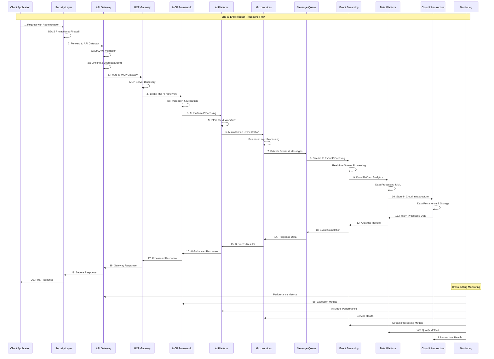
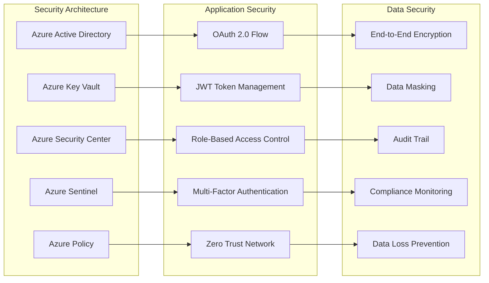
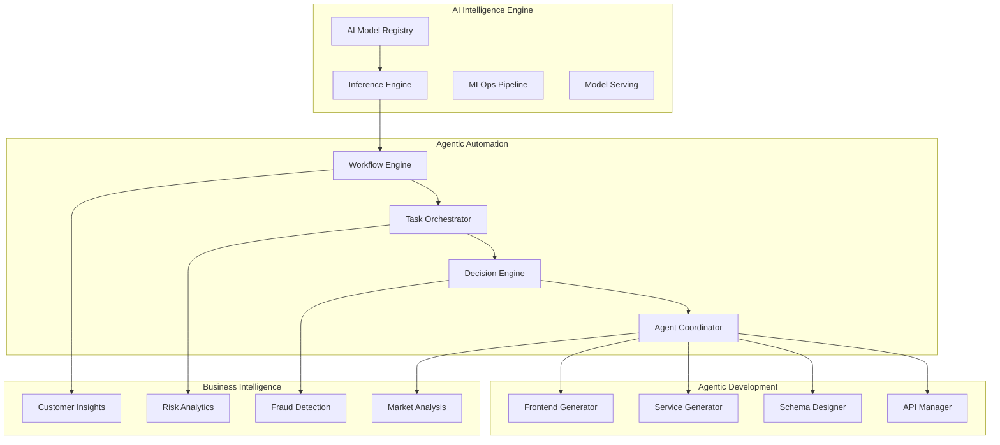
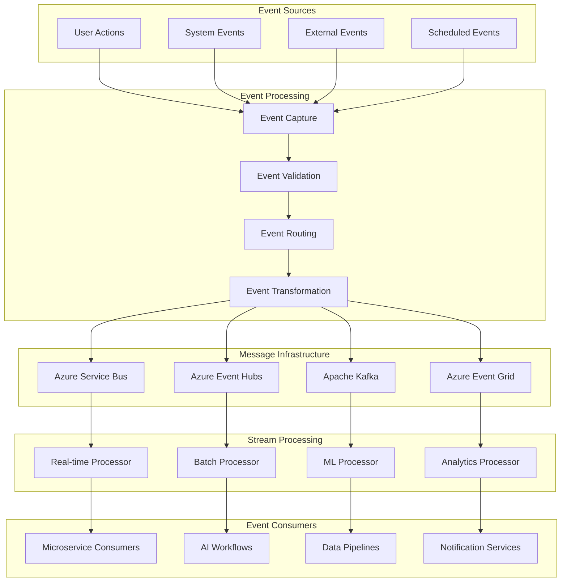
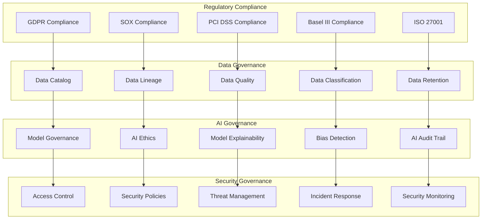

# AI Platform Logical Architecture - End-to-End Enterprise Stack

## 🎯 **Architecture Overview**

This document provides a comprehensive end-to-end logical architecture for the AI Platform for FinTech Evolution, covering all 13 layers of the Enterprise Architecture Stack with detailed component interactions, data flows, and integration patterns.

## 🏗️ **Complete End-to-End Logical Architecture**

### **Comprehensive 13-Layer Architecture Diagram**

```mermaid
graph TB
    %% External Layer
    subgraph "External Interfaces"
        Client[Web Browser]
        Mobile[Mobile Apps]
        APIs[External APIs]
        ThirdParty[Third-Party Services]
    end
    
    %% Security Layer (Layer 1)
    subgraph "Security Layer"
        WAF[Web Application Firewall]
        DDoS[DDoS Protection]
        OAuth[OAuth 2.0 + OIDC]
        JWT[JWT Token Manager]
        ZeroTrust[Zero Trust Architecture]
        IAM[Identity & Access Management]
        Encryption[End-to-End Encryption]
        Compliance[Compliance Engine]
        RBAC[Role-Based Access Control]
        AuditLog[Audit Logging]
    end
    
    %% Monitoring & Observability Layer (Layer 2)
    subgraph "Monitoring & Observability"
        APM[Application Performance Monitoring]
        LogAggregation[Log Aggregation & Analytics]
        MetricsCollection[Metrics Collection]
        TraceDistributed[Distributed Tracing]
        AlertSystem[Real-time Alerting]
        Dashboard[Observability Dashboards]
        HealthCheck[Health Check System]
        SLI_SLO[SLI/SLO Monitoring]
    end
    
    %% DevOps & CI/CD Layer (Layer 3)
    subgraph "DevOps & CI/CD"
        SourceControl[Source Control & Git]
        BuildPipeline[Build & Test Pipeline]
        DeploymentPipeline[Deployment Pipeline]
        ContainerRegistry[Container Registry]
        IaC[Infrastructure as Code]
        AutoTesting[Automated Testing]
        ReleaseManagement[Release Management]
        ConfigManagement[Configuration Management]
    end
    
    %% Frontend Layer (Layer 4)
    subgraph "Frontend Layer"
        React[React 19 Components]
        NextJS[Next.js 15 Framework]
        SSR[Server-Side Rendering]
        SSG[Static Site Generation]
        PWA[Progressive Web App]
        MicroFrontend[Micro-Frontend Architecture]
        StateManagement[State Management]
        UIComponents[UI Component Library]
    end
    
    %% API Gateway Layer (Layer 5)
    subgraph "API Gateway"
        APIGatewayCore[API Gateway Core]
        RESTRouter[REST API Router]
        AsyncRouter[Async API Router]
        GraphQLRouter[GraphQL Router]
        WebHookRouter[WebHook Handler]
        WebSocketRouter[WebSocket Manager]
        RateLimiting[Rate Limiting & Throttling]
        LoadBalancer[Load Balancing]
        CacheLayer[API Response Caching]
        OpenAPISpec[OpenAPI Specification]
        AsyncAPISpec[AsyncAPI Specification]
    end
    
    %% MCP Gateway Layer (Layer 6)
    subgraph "MCP Gateway"
        MCPRegistry[MCP Server Registry]
        MCPLifecycle[MCP Lifecycle Manager]
        ToolRegistry[Tool Registry & Discovery]
        MCPRouter[MCP Protocol Router]
        MCPVersioning[MCP Version Control]
        MCPMonitoring[MCP Health Monitoring]
        MCPSecurity[MCP Security & Auth]
        MCPOrchestration[MCP Orchestration Engine]
    end
    
    %% MCP Framework Layer (Layer 7)
    subgraph "MCP Framework"
        MCPServer[MCP Server Implementation]
        MCPClient[MCP Client SDK]
        JSONRPCTransport[JSON-RPC Transport]
        ToolExecutor[Tool Execution Engine]
        WorkflowCoordinator[Workflow Coordinator]
        MCPProtocol[MCP Protocol Handler]
        ToolValidation[Tool Validation & Safety]
        MCPStateManagement[MCP State Management]
    end
    
    %% AI Platform Layer (Layer 8)
    subgraph "AI Platform"
        AIInferenceEngine[AI Inference Engine]
        ModelRegistry[AI Model Registry]
        MLOpsPipeline[MLOps Pipeline]
        AgenticWorkflow[Agentic Workflow Automation]
        WorkflowEngine[Workflow Execution Engine]
        TaskOrchestrator[Task Orchestrator]
        DecisionTree[AI Decision Tree]
        AgenticDevelopment[Agentic Development Platform]
        MicrofrontendGenerator[Dynamic Microfrontend Generator]
        ServiceGenerator[Auto Service Generator]
        DatabaseSchemaDesigner[AI Database Schema Designer]
        APIInventory[Continuous API Inventory]
        FeatureRegistry[Feature Registry]
        IntelligentAutomation[Intelligent Automation Engine]
    end
    
    %% Microservices Layer (Layer 9)
    subgraph "Microservices"
        ServiceMesh[Service Mesh]
        UserService[User Management Service]
        JourneyService[Customer Journey Service]
        PaymentService[Payment Processing Service]
        RiskService[Risk Assessment Service]
        FraudService[Fraud Detection Service]
        AnalyticsService[Analytics Service]
        NotificationService[Notification Service]
        AuditService[Audit Service]
        ComplianceService[Compliance Service]
        DomainMCPServices[Domain-Specific MCP Services]
        BusinessRuleEngine[Business Rule Engine]
    end
    
    %% Message Queue & Broker Layer (Layer 10)
    subgraph "Message Queue & Broker"
        ServiceBus[Azure Service Bus]
        EventHub[Azure Event Hubs]
        StorageQueues[Azure Storage Queues]
        RedisCache[Redis Cache & Pub/Sub]
        EventGrid[Azure Event Grid]
        MessageRouting[Message Routing & Filtering]
        DeadLetterQueue[Dead Letter Queue]
        MessagePersistence[Message Persistence]
        PubSubPatterns[Pub/Sub Patterns]
    end
    
    %% Event Streaming Layer (Layer 11)
    subgraph "Event Streaming"
        ApacheKafka[Apache Kafka Cluster]
        KafkaConnect[Kafka Connect]
        SchemaRegistry[Schema Registry]
        StreamProcessing[Stream Processing]
        FlinkProcessor[Apache Flink]
        SparkStreaming[Spark Streaming]
        EventSourcing[Event Sourcing]
        CQRS[Command Query Responsibility Segregation]
        EventStore[Event Store]
        ChangeDataCapture[Change Data Capture]
    end
    
    %% Data Platform Layer (Layer 12)
    subgraph "Data Platform"
        DataLake[Azure Data Lake Storage]
        DataWarehouse[Azure Synapse Analytics]
        Databricks[Azure Databricks]
        SparkCluster[Apache Spark Cluster]
        DataMesh[Domain Data Mesh]
        DataGovernance[AI Data Governance]
        DataLineage[Data Lineage Tracking]
        DataQuality[Data Quality Engine]
        DataCatalog[Data Catalog & Discovery]
        MachineLearning[Machine Learning Platform]
        RealTimeAnalytics[Real-time Analytics]
        BatchProcessing[Batch Processing Engine]
    end
    
    %% Cloud Infrastructure Layer (Layer 13)
    subgraph "Cloud Infrastructure"
        Kubernetes[Azure Kubernetes Service]
        ContainerInstances[Azure Container Instances]
        VirtualMachines[Azure Virtual Machines]
        Networking[Azure Virtual Networks]
        Storage[Azure Storage Services]
        SQLDatabase[Azure SQL Database]
        CosmosDB[Azure Cosmos DB]
        RedisEnterprise[Azure Cache for Redis]
        ResourceManagement[Azure Resource Manager]
        AutoScaling[Auto-scaling Groups]
        CloudSecurity[Cloud Security Services]
    end
    
    %% Data Flow Connections
    Client --> WAF
    Mobile --> WAF
    APIs --> WAF
    ThirdParty --> WAF
    
    WAF --> OAuth
    OAuth --> JWT
    JWT --> APIGatewayCore
    JWT --> MCPRegistry
    
    APIGatewayCore --> RESTRouter
    APIGatewayCore --> AsyncRouter
    APIGatewayCore --> GraphQLRouter
    APIGatewayCore --> WebHookRouter
    APIGatewayCore --> WebSocketRouter
    
    MCPRegistry --> MCPLifecycle
    MCPRegistry --> ToolRegistry
    MCPRegistry --> MCPRouter
    
    MCPRouter --> MCPServer
    MCPServer --> ToolExecutor
    ToolExecutor --> WorkflowCoordinator
    
    WorkflowCoordinator --> AIInferenceEngine
    WorkflowCoordinator --> AgenticWorkflow
    WorkflowCoordinator --> ServiceMesh
    
    ServiceMesh --> UserService
    ServiceMesh --> JourneyService
    ServiceMesh --> PaymentService
    ServiceMesh --> RiskService
    ServiceMesh --> FraudService
    ServiceMesh --> AnalyticsService
    
    UserService --> ServiceBus
    JourneyService --> EventHub
    PaymentService --> ApacheKafka
    RiskService --> ApacheKafka
    FraudService --> RedisCache
    
    ApacheKafka --> FlinkProcessor
    ApacheKafka --> SparkStreaming
    EventHub --> StreamProcessing
    
    FlinkProcessor --> DataLake
    SparkStreaming --> Databricks
    StreamProcessing --> DataWarehouse
    
    DataLake --> SparkCluster
    Databricks --> MachineLearning
    DataWarehouse --> RealTimeAnalytics
    
    SparkCluster --> Kubernetes
    MachineLearning --> Kubernetes
    RealTimeAnalytics --> Kubernetes
    
    Kubernetes --> VirtualMachines
    Kubernetes --> Storage
    Kubernetes --> SQLDatabase
    Kubernetes --> CosmosDB
    
    %% Cross-layer Monitoring
    APM --> ServiceMesh
    APM --> AIInferenceEngine
    APM --> ApacheKafka
    APM --> Kubernetes
    
    LogAggregation --> UserService
    LogAggregation --> PaymentService
    LogAggregation --> DataLake
    
    MetricsCollection --> APIGatewayCore
    MetricsCollection --> MCPRegistry
    MetricsCollection --> ServiceBus
    
    %% DevOps Integration
    BuildPipeline --> ContainerRegistry
    DeploymentPipeline --> Kubernetes
    IaC --> ResourceManagement
    AutoTesting --> ServiceMesh
    
    %% Security Cross-cutting
    ZeroTrust --> ServiceMesh
    Encryption --> DataLake
    Compliance --> AuditService
    RBAC --> IAM
    
    classDef securityLayer fill:#ff6b6b,stroke:#333,stroke-width:2px,color:#fff
    classDef monitoringLayer fill:#4ecdc4,stroke:#333,stroke-width:2px,color:#fff
    classDef devopsLayer fill:#45b7d1,stroke:#333,stroke-width:2px,color:#fff
    classDef frontendLayer fill:#96ceb4,stroke:#333,stroke-width:2px,color:#fff
    classDef gatewayLayer fill:#ffeaa7,stroke:#333,stroke-width:2px,color:#333
    classDef mcpLayer fill:#dda0dd,stroke:#333,stroke-width:2px,color:#333
    classDef aiLayer fill:#98d8c8,stroke:#333,stroke-width:2px,color:#333
    classDef microservicesLayer fill:#f7dc6f,stroke:#333,stroke-width:2px,color:#333
    classDef messageLayer fill:#bb8fce,stroke:#333,stroke-width:2px,color:#fff
    classDef streamingLayer fill:#85c1e9,stroke:#333,stroke-width:2px,color:#333
    classDef dataLayer fill:#f8c471,stroke:#333,stroke-width:2px,color:#333
    classDef infraLayer fill:#aed6f1,stroke:#333,stroke-width:2px,color:#333
    
    class WAF,DDoS,OAuth,JWT,ZeroTrust,IAM,Encryption,Compliance,RBAC,AuditLog securityLayer
    class APM,LogAggregation,MetricsCollection,TraceDistributed,AlertSystem,Dashboard,HealthCheck,SLI_SLO monitoringLayer
    class SourceControl,BuildPipeline,DeploymentPipeline,ContainerRegistry,IaC,AutoTesting,ReleaseManagement,ConfigManagement devopsLayer
    class React,NextJS,SSR,SSG,PWA,MicroFrontend,StateManagement,UIComponents frontendLayer
    class APIGatewayCore,RESTRouter,AsyncRouter,GraphQLRouter,WebHookRouter,WebSocketRouter,RateLimiting,LoadBalancer,CacheLayer,OpenAPISpec,AsyncAPISpec gatewayLayer
    class MCPRegistry,MCPLifecycle,ToolRegistry,MCPRouter,MCPVersioning,MCPMonitoring,MCPSecurity,MCPOrchestration mcpLayer
    class AIInferenceEngine,ModelRegistry,MLOpsPipeline,AgenticWorkflow,WorkflowEngine,TaskOrchestrator,DecisionTree,AgenticDevelopment,MicrofrontendGenerator,ServiceGenerator,DatabaseSchemaDesigner,APIInventory,FeatureRegistry,IntelligentAutomation aiLayer
    class ServiceMesh,UserService,JourneyService,PaymentService,RiskService,FraudService,AnalyticsService,NotificationService,AuditService,ComplianceService,DomainMCPServices,BusinessRuleEngine microservicesLayer
    class ServiceBus,EventHub,StorageQueues,RedisCache,EventGrid,MessageRouting,DeadLetterQueue,MessagePersistence,PubSubPatterns messageLayer
    class ApacheKafka,KafkaConnect,SchemaRegistry,StreamProcessing,FlinkProcessor,SparkStreaming,EventSourcing,CQRS,EventStore,ChangeDataCapture streamingLayer
    class DataLake,DataWarehouse,Databricks,SparkCluster,DataMesh,DataGovernance,DataLineage,DataQuality,DataCatalog,MachineLearning,RealTimeAnalytics,BatchProcessing dataLayer
    class Kubernetes,ContainerInstances,VirtualMachines,Networking,Storage,SQLDatabase,CosmosDB,RedisEnterprise,ResourceManagement,AutoScaling,CloudSecurity infraLayer
```



## 🔄 **End-to-End Data Flow Architecture**

### **Complete Data Flow Sequence**



## 🏢 **Enterprise Integration Patterns**

### **Security Integration Flow**



### **AI Platform Intelligence Flow**



### **Event-Driven Architecture Flow**



## 📊 **Performance & Scalability Architecture**

### **High-Performance Data Pipeline**

```mermaid
graph LR
    subgraph "Ingestion Layer"
        APIIngestion[API Data Ingestion]
        StreamIngestion[Stream Data Ingestion]
        BatchIngestion[Batch Data Ingestion]
        RealtimeIngestion[Real-time Data Ingestion]
    end
    
    subgraph "Processing Layer"
        StreamProcessor[Stream Processing Engine]
        BatchProcessor[Batch Processing Engine]
        MLProcessor[ML Processing Engine]
        AnalyticsEngine[Analytics Engine]
    end
    
    subgraph "Storage Layer"
        HotStorage[Hot Storage (Redis)]
        WarmStorage[Warm Storage (SQL)]
        ColdStorage[Cold Storage (Data Lake)]
        ArchiveStorage[Archive Storage (Blob)]
    end
    
    subgraph "Serving Layer"
        CacheLayer[Cache Layer]
        APILayer[API Serving Layer]
        RealtimeLayer[Real-time Serving]
        AnalyticsLayer[Analytics Serving]
    end
    
    APIIngestion --> StreamProcessor
    StreamIngestion --> StreamProcessor
    BatchIngestion --> BatchProcessor
    RealtimeIngestion --> MLProcessor
    
    StreamProcessor --> HotStorage
    BatchProcessor --> WarmStorage
    MLProcessor --> ColdStorage
    AnalyticsEngine --> ArchiveStorage
    
    HotStorage --> CacheLayer
    WarmStorage --> APILayer
    ColdStorage --> RealtimeLayer
    ArchiveStorage --> AnalyticsLayer
```

## 🛡️ **Compliance & Governance Architecture**

### **Enterprise Governance Framework**



## 🚀 **Technology Stack Mapping**

### **Complete Technology Stack by Layer**

| **Layer** | **Core Technologies** | **Azure Services** | **Open Source** | **Enterprise Tools** |
|-----------|----------------------|-------------------|-----------------|-------------------|
| **Security** | OAuth 2.0, JWT, Zero Trust | Azure AD, Key Vault, Security Center, Sentinel | OWASP ZAP, SonarQube | HashiCorp Vault, Okta |
| **Monitoring** | APM, Distributed Tracing | Application Insights, Monitor, Log Analytics | Prometheus, Grafana, ELK Stack | Datadog, New Relic |
| **DevOps** | CI/CD, IaC, GitOps | Azure DevOps, GitHub Actions, ARM/Bicep | Jenkins, Terraform, Ansible | GitLab, Atlassian |
| **Frontend** | React 19, Next.js 15 | Static Web Apps, CDN, Front Door | Node.js, TypeScript, Webpack | Vercel, Netlify |
| **API Gateway** | REST, GraphQL, WebSocket | API Management, Application Gateway | Kong, Zuul, Express Gateway | Apigee, MuleSoft |
| **MCP Gateway** | MCP Protocol, Tool Registry | Container Instances, Service Fabric | Custom MCP Implementation | MCP-compliant tools |
| **MCP Framework** | Java MCP, Spring AI | Kubernetes Service, Container Registry | MCP SDK, JSON-RPC | Spring AI, LangChain |
| **AI Platform** | ML Models, Workflow Automation | Machine Learning, Cognitive Services, OpenAI | TensorFlow, PyTorch, scikit-learn | MLflow, Kubeflow |
| **Microservices** | Spring Boot, Domain Services | Kubernetes Service, Service Fabric | Spring Cloud, Istio | Kong, Consul |
| **Message Queue** | Pub/Sub, Event Streaming | Service Bus, Event Hubs, Event Grid | Apache Kafka, RabbitMQ | Confluent, Amazon MSK |
| **Event Streaming** | Stream Processing, Event Sourcing | Event Hubs, Stream Analytics | Apache Kafka, Apache Flink | Confluent, Amazon Kinesis |
| **Data Platform** | Data Lake, Analytics, ML | Databricks, Synapse Analytics, Data Factory | Apache Spark, Hadoop, Airflow | Snowflake, Palantir |
| **Infrastructure** | Containers, VMs, Storage | AKS, VMs, Storage, SQL Database | Kubernetes, Docker, PostgreSQL | VMware, RedHat OpenShift |

## 🔗 **Integration Patterns**

### **Cross-Layer Integration Patterns**

1. **Security-First Integration**
   - All layers implement Zero Trust principles
   - End-to-end encryption and authentication
   - Role-based access control across all components

2. **Event-Driven Integration**
   - Asynchronous communication between layers
   - Event sourcing for audit and replay capabilities
   - Real-time and batch processing patterns

3. **AI-Native Integration**
   - MCP framework enabling intelligent automation
   - AI-driven decision making across business processes
   - Continuous learning and optimization

4. **Cloud-Native Integration**
   - Container-first architecture
   - Auto-scaling and self-healing capabilities
   - Multi-cloud deployment readiness

5. **Data-Centric Integration**
   - Data mesh architecture for domain ownership
   - Real-time and batch data processing
   - AI-driven data governance and quality

## 📈 **Performance Characteristics**

### **End-to-End Performance Targets**

| **Metric** | **Target** | **Measurement** |
|------------|------------|-----------------|
| **API Response Time** | < 10ms | P99 latency |
| **MCP Tool Execution** | < 50ms | Average execution time |
| **AI Inference** | < 100ms | Model prediction latency |
| **Event Processing** | < 5ms | Message delivery time |
| **Data Query** | < 1s | Complex analytics queries |
| **Throughput** | 10,000+ TPS | Transactions per second |
| **Availability** | 99.9% | System uptime |
| **Scalability** | 1000+ concurrent users | Horizontal scaling |

This comprehensive logical architecture provides the foundation for implementing a production-ready, enterprise-grade AI platform that demonstrates the power of the Model Context Protocol framework in financial technology applications.