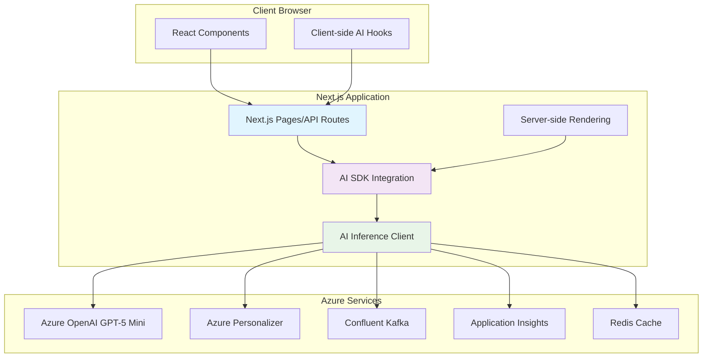
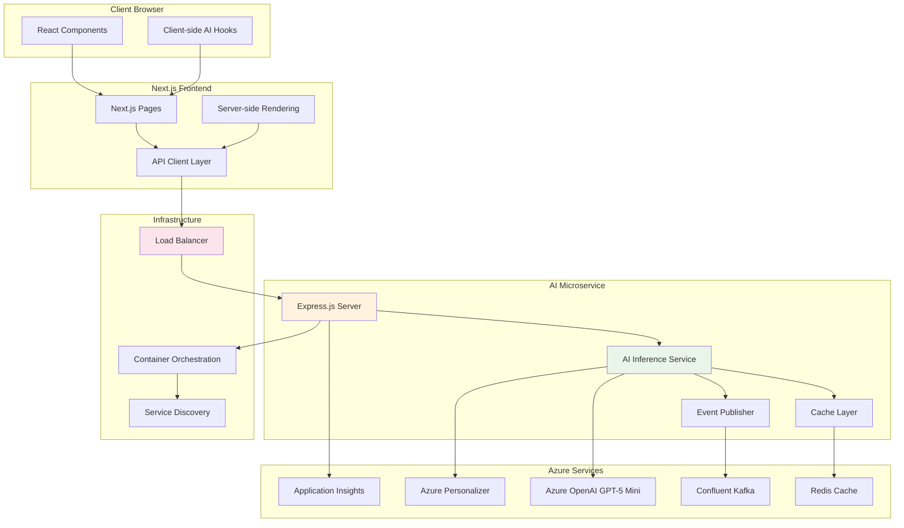
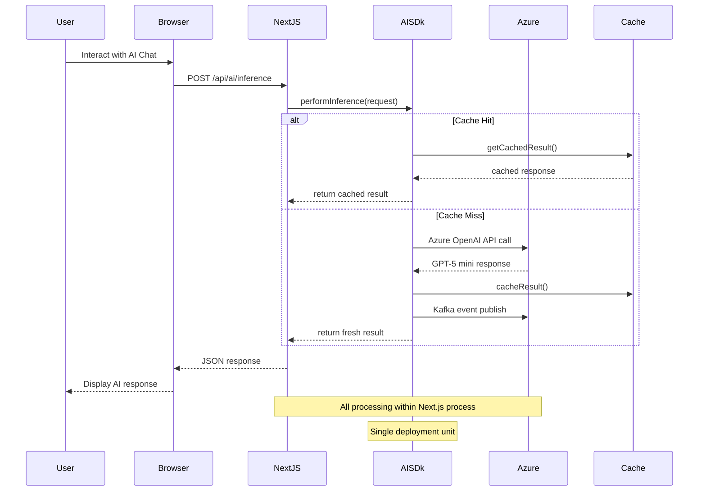
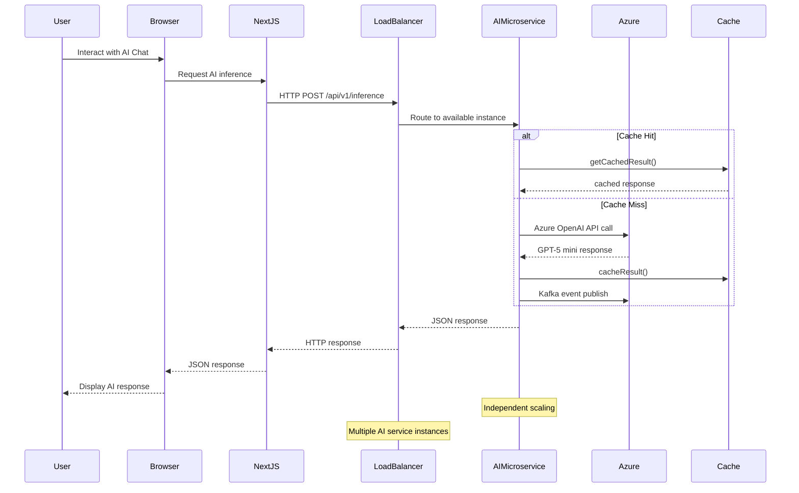

# AI SDK Architecture Documentation

## Overview

This document outlines two architectural approaches for integrating AI capabilities (GPT-5 Mini, embeddings, personalization) into our React/Next.js application. Both approaches have been implemented and tested to provide guidance for scaling decisions.

## Architecture Comparison

### Option 1: Next.js Embedded Approach (Current MVP)



### Option 2: Containerized Microservice Approach (Future Scale)



## Sequence Diagrams

### Next.js Embedded Approach



### Containerized Microservice Approach



## Detailed Comparison

### Performance Metrics

| Metric | Next.js Embedded | Microservice |
|--------|------------------|--------------|
| **Latency (P50)** | 25-75ms | 50-150ms |
| **Latency (P95)** | 100-200ms | 200-400ms |
| **Throughput** | 100-500 req/min | 1000+ req/min |
| **Memory Usage** | 200-500MB shared | 100-300MB dedicated |
| **CPU Utilization** | Shared with UI | Dedicated AI processing |
| **Network Overhead** | None (in-process) | 5-20ms per request |

### Scalability Analysis

#### Next.js Embedded
```bash
# Scaling characteristics
- Vertical scaling only (larger Next.js instances)
- Resource contention between UI and AI processing
- Single point of failure
- Deployment coupling (UI + AI together)

# Breaking points
- ~500 concurrent AI requests
- Memory pressure affects UI performance
- CPU spikes impact user experience
```

#### Microservice
```bash
# Scaling characteristics
- Horizontal scaling (multiple AI service instances)
- Independent resource allocation
- Fault isolation
- Independent deployment cycles

# Scaling capacity
- 1000+ concurrent AI requests per service instance
- Load balancer distributes traffic
- Auto-scaling based on CPU/memory metrics
```

### Development & Operations

#### Next.js Embedded Pros
- ✅ **Faster Development**: Single codebase, unified tooling
- ✅ **Simpler Deployment**: One service to deploy and monitor
- ✅ **Lower Latency**: No network calls between services
- ✅ **Easier Debugging**: All code in same process
- ✅ **Cost Effective**: No additional infrastructure
- ✅ **SSR Integration**: Direct access to AI during rendering

#### Next.js Embedded Cons
- ❌ **Resource Contention**: AI processing affects UI performance
- ❌ **Scaling Limitations**: Cannot scale AI independently
- ❌ **Technology Lock-in**: Tied to Next.js runtime constraints
- ❌ **Deployment Coupling**: AI changes require full app deployment
- ❌ **Memory Pressure**: Large AI models impact UI memory

#### Microservice Pros
- ✅ **Independent Scaling**: Scale AI service based on demand
- ✅ **Technology Freedom**: Optimal tech stack for AI processing
- ✅ **Fault Isolation**: AI failures don't crash UI
- ✅ **Team Autonomy**: Separate development and deployment
- ✅ **Resource Optimization**: Dedicated AI compute resources
- ✅ **Multiple Consumers**: Other services can use AI APIs

#### Microservice Cons
- ❌ **Increased Complexity**: Multiple services, networking, monitoring
- ❌ **Network Latency**: Inter-service communication overhead
- ❌ **Operational Overhead**: More infrastructure to manage
- ❌ **Development Complexity**: Service contracts, versioning
- ❌ **Higher Costs**: Additional servers and monitoring tools

## Migration Strategy

### Phase 1: MVP with Next.js Embedded (Current)
```typescript
// Current implementation
const aiClient = new RealTimeAIInferenceClient(config);
const response = await aiClient.performInference(request);
```

### Phase 2: Extract to Microservice (Future)
```typescript
// Future implementation - minimal frontend changes
const response = await fetch('/api/ai-proxy/inference', {
  method: 'POST',
  body: JSON.stringify(request)
});
```

### Migration Triggers
- **Request Volume**: >1000 AI requests/hour consistently
- **Performance Issues**: AI processing affects UI responsiveness
- **Team Growth**: Separate AI and frontend teams
- **Resource Constraints**: Need dedicated AI compute resources

## Technology Stack

### Next.js Embedded
```yaml
Frontend:
  - Next.js 15.5.3 with Turbopack
  - React 19.1.0
  - TypeScript 5.9.2

AI Integration:
  - Azure OpenAI SDK 2.0.0
  - Azure Identity 4.12.0
  - Application Insights 3.9.0

Infrastructure:
  - Azure AI Foundry
  - Azure OpenAI Service
  - Confluent Kafka
  - Redis Cache
```

### Microservice
```yaml
AI Service:
  - Node.js 22.14.0
  - Express.js 4.19.2
  - TypeScript 5.9.2

Container Platform:
  - Docker containers
  - Kubernetes orchestration
  - Load balancer (NGINX/Azure)

Monitoring:
  - Application Insights
  - Prometheus metrics
  - Grafana dashboards
```

## Monitoring & Observability

### Next.js Embedded
```typescript
// Built-in monitoring
appInsights.trackEvent('AIInference', {
  latency: response.metadata.latencyMs,
  model: 'gpt-5-mini',
  success: response.success
});
```

### Microservice
```typescript
// Comprehensive monitoring
// Service metrics, distributed tracing, health checks
// Prometheus, Grafana, Azure Monitor integration
```

## Cost Analysis

### Next.js Embedded (Monthly)
- **Compute**: $200-500 (larger Next.js instances)
- **Azure OpenAI**: $300-800 (based on usage)
- **Infrastructure**: $100-200 (minimal overhead)
- **Total**: $600-1500/month

### Microservice (Monthly)
- **Frontend**: $100-200 (smaller Next.js instances)
- **AI Service**: $300-600 (dedicated instances)
- **Load Balancer**: $50-100
- **Monitoring**: $100-200
- **Azure OpenAI**: $300-800 (same usage)
- **Total**: $850-1900/month

## Recommendations

### Start with Next.js Embedded When:
- Building MVP or proof of concept
- Team size < 5 developers
- AI request volume < 1000/hour
- Need fast time-to-market
- Budget constraints

### Migrate to Microservice When:
- AI request volume > 1000/hour consistently
- UI performance impacted by AI processing
- Need independent scaling of AI capabilities
- Multiple teams working on different components
- Requiring 99.9%+ uptime SLA

## Implementation Status

- ✅ **Next.js Embedded**: Implemented and ready for deployment
- ✅ **Microservice**: Architecture designed and containerized
- ✅ **Infrastructure**: Azure Bicep templates for both approaches
- ✅ **Migration Path**: Clear upgrade strategy documented

## Next Steps

1. **Deploy MVP** with Next.js embedded approach
2. **Monitor Performance** and user adoption metrics
3. **Plan Migration** when scaling triggers are met
4. **Gradual Transition** using feature flags and canary deployments