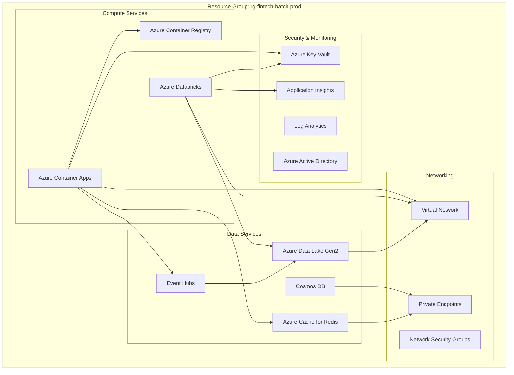

# Azure Deployment Guide - Batch Inference Service

## 🎯 Overview

This guide provides comprehensive instructions for deploying the **Batch Inference Service** to Azure, including all necessary Azure resources, configurations, and operational procedures.

## 🏗️ Azure Infrastructure Requirements

### Core Azure Services



## 📋 Pre-Deployment Checklist

### 1. Azure Subscription Setup

```bash
# Login to Azure
az login

# Set subscription
az account set --subscription "your-subscription-id"

# Register required providers
az provider register --namespace Microsoft.App
az provider register --namespace Microsoft.Databricks
az provider register --namespace Microsoft.EventHub
az provider register --namespace Microsoft.Storage
```

### 2. Resource Group Creation

```bash
# Create resource group
az group create \
    --name rg-fintech-batch-prod \
    --location eastus2
```

### 3. Service Principal Setup

```bash
# Create service principal for CI/CD
az ad sp create-for-rbac \
    --name sp-fintech-batch-deploy \
    --role Contributor \
    --scopes /subscriptions/{subscription-id}/resourceGroups/rg-fintech-batch-prod
```

## 🔧 Infrastructure Deployment

### Step 1: Deploy Core Infrastructure with Bicep

Create `main.bicep`:

```bicep
@description('Environment name')
param environmentName string = 'prod'

@description('Location for all resources')
param location string = resourceGroup().location

@description('Resource token for unique naming')
var resourceToken = toLower(uniqueString(subscription().id, environmentName, location))

// Container Apps Environment
module containerAppsEnvironment 'modules/container-apps-environment.bicep' = {
  name: 'container-apps-environment'
  params: {
    name: 'cae-batch-${resourceToken}'
    location: location
    logAnalyticsWorkspaceName: logAnalyticsWorkspace.outputs.name
  }
}

// Azure Databricks
module databricks 'modules/databricks.bicep' = {
  name: 'databricks'
  params: {
    workspaceName: 'dbw-batch-${resourceToken}'
    location: location
    managedResourceGroupName: 'rg-databricks-managed-${resourceToken}'
  }
}

// Azure Data Lake Gen2
module dataLake 'modules/data-lake.bicep' = {
  name: 'data-lake'
  params: {
    storageAccountName: 'stadl${resourceToken}'
    location: location
    containerNames: ['raw-data', 'processed-data', 'model-artifacts', 'inference-results']
  }
}

// Event Hubs
module eventHubs 'modules/event-hubs.bicep' = {
  name: 'event-hubs'
  params: {
    namespaceName: 'evhns-batch-${resourceToken}'
    location: location
    hubNames: ['batch-inference-input', 'batch-inference-output', 'model-updates', 'metrics']
  }
}

// Azure Container Registry
module containerRegistry 'modules/container-registry.bicep' = {
  name: 'container-registry'
  params: {
    registryName: 'acr${resourceToken}'
    location: location
    sku: 'Premium'
  }
}

// Key Vault
module keyVault 'modules/key-vault.bicep' = {
  name: 'key-vault'
  params: {
    keyVaultName: 'kv-batch-${resourceToken}'
    location: location
  }
}

// Log Analytics Workspace
resource logAnalyticsWorkspace 'Microsoft.OperationalInsights/workspaces@2021-06-01' = {
  name: 'law-batch-${resourceToken}'
  location: location
  properties: {
    sku: {
      name: 'PerGB2018'
    }
    retentionInDays: 30
  }
}

// Outputs
output containerAppsEnvironmentName string = containerAppsEnvironment.outputs.name
output databricksWorkspaceName string = databricks.outputs.workspaceName
output dataLakeStorageAccountName string = dataLake.outputs.storageAccountName
output eventHubsNamespaceName string = eventHubs.outputs.namespaceName
output containerRegistryName string = containerRegistry.outputs.registryName
output keyVaultName string = keyVault.outputs.keyVaultName
```

### Step 2: Deploy Infrastructure

```bash
# Deploy infrastructure
az deployment group create \
    --resource-group rg-fintech-batch-prod \
    --template-file main.bicep \
    --parameters environmentName=prod
```

## 🐳 Container Deployment

### Step 1: Build and Push Container Image

```bash
# Navigate to batch inference service
cd backend/microservices/batch-inference-service

# Build Docker image
docker build -t batch-inference-service:latest .

# Tag for Azure Container Registry
docker tag batch-inference-service:latest acr{resourceToken}.azurecr.io/batch-inference-service:latest

# Login to ACR
az acr login --name acr{resourceToken}

# Push image
docker push acr{resourceToken}.azurecr.io/batch-inference-service:latest
```

### Step 2: Deploy to Azure Container Apps

Create `container-app.bicep`:

```bicep
param containerAppName string = 'ca-batch-inference'
param containerAppEnvironmentName string
param containerRegistryName string
param keyVaultName string
param location string = resourceGroup().location

resource containerApp 'Microsoft.App/containerApps@2023-05-01' = {
  name: containerAppName
  location: location
  properties: {
    environmentId: resourceId('Microsoft.App/managedEnvironments', containerAppEnvironmentName)
    configuration: {
      secrets: [
        {
          name: 'registry-password'
          keyVaultUrl: 'https://${keyVaultName}.vault.azure.net/secrets/acr-password'
          identity: 'system'
        }
      ]
      registries: [
        {
          server: '${containerRegistryName}.azurecr.io'
          username: containerRegistryName
          passwordSecretRef: 'registry-password'
        }
      ]
      ingress: {
        external: true
        targetPort: 8086
        allowInsecure: false
        traffic: [
          {
            weight: 100
            latestRevision: true
          }
        ]
      }
    }
    template: {
      containers: [
        {
          name: 'batch-inference-service'
          image: '${containerRegistryName}.azurecr.io/batch-inference-service:latest'
          env: [
            {
              name: 'SPRING_PROFILES_ACTIVE'
              value: 'azure,prod'
            }
            {
              name: 'AZURE_DATABRICKS_WORKSPACE_URL'
              secretRef: 'databricks-workspace-url'
            }
            {
              name: 'AZURE_DATABRICKS_TOKEN'
              secretRef: 'databricks-token'
            }
            {
              name: 'KAFKA_BOOTSTRAP_SERVERS'
              secretRef: 'kafka-bootstrap-servers'
            }
          ]
          resources: {
            cpu: 2
            memory: '4Gi'
          }
        }
      ]
      scale: {
        minReplicas: 1
        maxReplicas: 5
        rules: [
          {
            name: 'http-scale'
            http: {
              metadata: {
                concurrentRequests: '10'
              }
            }
          }
        ]
      }
    }
  }
  identity: {
    type: 'SystemAssigned'
  }
}
```

## ⚙️ Azure Databricks Configuration

### Step 1: Workspace Setup

```python
# databricks-setup.py
import requests
import json

def setup_databricks_workspace(workspace_url, access_token):
    headers = {
        'Authorization': f'Bearer {access_token}',
        'Content-Type': 'application/json'
    }
    
    # Create cluster configuration
    cluster_config = {
        "cluster_name": "batch-inference-cluster",
        "spark_version": "13.3.x-scala2.12",
        "node_type_id": "Standard_D4s_v3",
        "driver_node_type_id": "Standard_D4s_v3",
        "num_workers": 2,
        "autoscale": {
            "min_workers": 2,
            "max_workers": 20
        },
        "auto_termination_minutes": 30,
        "spark_conf": {
            "spark.databricks.cluster.profile": "serverless",
            "spark.databricks.repl.allowedLanguages": "python,sql,scala,r",
            "spark.serializer": "org.apache.spark.serializer.KryoSerializer"
        },
        "spark_env_vars": {
            "MLFLOW_TRACKING_URI": "databricks"
        },
        "enable_elastic_disk": True,
        "disk_spec": {
            "disk_type": {
                "azure_disk_volume_type": "PREMIUM_LRS"
            },
            "disk_size": 100
        }
    }
    
    # Create cluster
    response = requests.post(
        f"{workspace_url}/api/2.0/clusters/create",
        headers=headers,
        data=json.dumps(cluster_config)
    )
    
    return response.json()

# Install required libraries
def install_libraries(workspace_url, access_token, cluster_id):
    libraries = [
        {"pypi": {"package": "mlflow==2.8.1"}},
        {"pypi": {"package": "azure-storage-file-datalake==12.12.0"}},
        {"pypi": {"package": "confluent-kafka==2.3.0"}},
        {"pypi": {"package": "delta-spark==3.0.0"}}
    ]
    
    library_config = {
        "cluster_id": cluster_id,
        "libraries": libraries
    }
    
    response = requests.post(
        f"{workspace_url}/api/2.0/libraries/install",
        headers=headers,
        data=json.dumps(library_config)
    )
    
    return response.json()
```

### Step 2: MLflow Configuration

```python
# mlflow-setup.py
import mlflow
from mlflow.tracking import MlflowClient

def setup_mlflow_experiments():
    # Set tracking URI to Databricks
    mlflow.set_tracking_uri("databricks")
    
    # Create experiments
    experiments = [
        "batch-inference-models",
        "feature-engineering",
        "model-validation"
    ]
    
    client = MlflowClient()
    
    for exp_name in experiments:
        try:
            experiment_id = mlflow.create_experiment(exp_name)
            print(f"Created experiment: {exp_name} (ID: {experiment_id})")
        except Exception as e:
            print(f"Experiment {exp_name} already exists: {e}")
    
    return client

def register_model_registry():
    client = MlflowClient()
    
    # Create registered models
    models = [
        {
            "name": "credit-risk-model",
            "description": "Credit risk assessment model for loan applications"
        },
        {
            "name": "fraud-detection-model", 
            "description": "Real-time fraud detection model"
        },
        {
            "name": "customer-segmentation-model",
            "description": "Customer segmentation for personalized offerings"
        }
    ]
    
    for model in models:
        try:
            client.create_registered_model(
                model["name"],
                description=model["description"]
            )
            print(f"Registered model: {model['name']}")
        except Exception as e:
            print(f"Model {model['name']} already exists: {e}")
```

## 🔐 Security Configuration

### Step 1: Key Vault Secrets

```bash
# Store sensitive configuration in Key Vault
KV_NAME="kv-batch-{resourceToken}"

# Databricks secrets
az keyvault secret set \
    --vault-name $KV_NAME \
    --name "databricks-workspace-url" \
    --value "https://adb-{workspace-id}.{region}.azuredatabricks.net"

az keyvault secret set \
    --vault-name $KV_NAME \
    --name "databricks-token" \
    --value "{databricks-access-token}"

# Kafka configuration
az keyvault secret set \
    --vault-name $KV_NAME \
    --name "kafka-bootstrap-servers" \
    --value "{event-hub-connection-string}"

# MLflow tracking URI
az keyvault secret set \
    --vault-name $KV_NAME \
    --name "mlflow-tracking-uri" \
    --value "databricks"
```

### Step 2: Managed Identity Permissions

```bash
# Get Container App managed identity
IDENTITY_ID=$(az containerapp identity show \
    --name ca-batch-inference \
    --resource-group rg-fintech-batch-prod \
    --query principalId -o tsv)

# Grant Key Vault access
az keyvault set-policy \
    --name $KV_NAME \
    --object-id $IDENTITY_ID \
    --secret-permissions get list

# Grant Data Lake access
az role assignment create \
    --assignee $IDENTITY_ID \
    --role "Storage Blob Data Contributor" \
    --scope "/subscriptions/{subscription-id}/resourceGroups/rg-fintech-batch-prod"

# Grant Event Hubs access
az role assignment create \
    --assignee $IDENTITY_ID \
    --role "Azure Event Hubs Data Owner" \
    --scope "/subscriptions/{subscription-id}/resourceGroups/rg-fintech-batch-prod"
```

## 🚀 Deployment Automation

### GitHub Actions Workflow

Create `.github/workflows/deploy-batch-inference.yml`:

```yaml
name: Deploy Batch Inference Service

on:
  push:
    branches: [main]
    paths: ['backend/microservices/batch-inference-service/**']
  workflow_dispatch:

env:
  AZURE_RESOURCE_GROUP: rg-fintech-batch-prod
  CONTAINER_APP_NAME: ca-batch-inference
  CONTAINER_REGISTRY: acr{resourceToken}

jobs:
  build-and-deploy:
    runs-on: ubuntu-latest
    
    steps:
    - name: Checkout code
      uses: actions/checkout@v4
    
    - name: Azure Login
      uses: azure/login@v1
      with:
        creds: ${{ secrets.AZURE_CREDENTIALS }}
    
    - name: Build and push Docker image
      working-directory: backend/microservices/batch-inference-service
      run: |
        # Login to ACR
        az acr login --name ${{ env.CONTAINER_REGISTRY }}
        
        # Build image
        docker build -t batch-inference-service:${{ github.sha }} .
        
        # Tag and push
        docker tag batch-inference-service:${{ github.sha }} \
          ${{ env.CONTAINER_REGISTRY }}.azurecr.io/batch-inference-service:${{ github.sha }}
        
        docker push ${{ env.CONTAINER_REGISTRY }}.azurecr.io/batch-inference-service:${{ github.sha }}
    
    - name: Deploy to Container Apps
      run: |
        az containerapp update \
          --name ${{ env.CONTAINER_APP_NAME }} \
          --resource-group ${{ env.AZURE_RESOURCE_GROUP }} \
          --image ${{ env.CONTAINER_REGISTRY }}.azurecr.io/batch-inference-service:${{ github.sha }}
    
    - name: Verify deployment
      run: |
        # Wait for deployment to complete
        sleep 60
        
        # Test health endpoint
        APP_URL=$(az containerapp show \
          --name ${{ env.CONTAINER_APP_NAME }} \
          --resource-group ${{ env.AZURE_RESOURCE_GROUP }} \
          --query "properties.configuration.ingress.fqdn" -o tsv)
        
        curl -f https://$APP_URL/actuator/health || exit 1
```

## 📊 Monitoring and Observability

### Application Insights Configuration

```yaml
# application-azure.yml
management:
  endpoints:
    web:
      exposure:
        include: health,metrics,prometheus,info
  metrics:
    export:
      azure-monitor:
        enabled: true
        instrumentation-key: ${APPLICATIONINSIGHTS_CONNECTION_STRING}

logging:
  level:
    com.fintech.batchinference: DEBUG
    org.apache.spark: WARN
    org.apache.kafka: WARN

azure:
  application-insights:
    instrumentation-key: ${APPLICATIONINSIGHTS_CONNECTION_STRING}
    sampling-percentage: 10.0
    enable-legacy-request-id-propagation: true
```

### Custom Dashboards

```json
{
  "dashboard": {
    "name": "Batch Inference Service Dashboard",
    "widgets": [
      {
        "type": "metric",
        "title": "Job Success Rate",
        "query": "customMetrics | where name == 'batch.job.success.rate'"
      },
      {
        "type": "metric", 
        "title": "Processing Throughput",
        "query": "customMetrics | where name == 'batch.records.processed.per.second'"
      },
      {
        "type": "log",
        "title": "Recent Errors",
        "query": "traces | where severityLevel >= 3 | order by timestamp desc"
      },
      {
        "type": "metric",
        "title": "Cluster Utilization",
        "query": "customMetrics | where name == 'spark.cluster.cpu.utilization'"
      }
    ]
  }
}
```

## 🔄 Operational Procedures

### Daily Operations Checklist

```bash
#!/bin/bash
# daily-ops-check.sh

echo "=== Daily Batch Inference Service Health Check ==="

# 1. Check Container App status
echo "Checking Container App status..."
az containerapp show \
    --name ca-batch-inference \
    --resource-group rg-fintech-batch-prod \
    --query "properties.runningStatus"

# 2. Check recent job executions
echo "Checking recent job executions..."
az monitor metrics list \
    --resource "/subscriptions/{sub-id}/resourceGroups/rg-fintech-batch-prod" \
    --metric "batch.jobs.completed" \
    --interval PT1H

# 3. Check Databricks cluster health
echo "Checking Databricks clusters..."
curl -X GET \
    -H "Authorization: Bearer ${DATABRICKS_TOKEN}" \
    "${DATABRICKS_WORKSPACE_URL}/api/2.0/clusters/list"

# 4. Verify Data Lake storage
echo "Checking Data Lake storage..."
az storage blob list \
    --container-name processed-data \
    --account-name "stadl{resourceToken}" \
    --output table

# 5. Test API endpoint
echo "Testing API health endpoint..."
APP_URL=$(az containerapp show \
    --name ca-batch-inference \
    --resource-group rg-fintech-batch-prod \
    --query "properties.configuration.ingress.fqdn" -o tsv)

curl -s https://$APP_URL/actuator/health | jq '.'
```

### Disaster Recovery Procedures

```bash
#!/bin/bash
# disaster-recovery.sh

echo "=== Batch Inference Service Disaster Recovery ==="

# 1. Backup current configuration
echo "Backing up configuration..."
az containerapp show \
    --name ca-batch-inference \
    --resource-group rg-fintech-batch-prod > backup-config.json

# 2. Export MLflow models
echo "Backing up MLflow models..."
mlflow models list --output-format json > backup-models.json

# 3. Backup Databricks notebooks
echo "Backing up Databricks notebooks..."
databricks workspace export_dir \
    /Users/batch-inference \
    ./backup-notebooks \
    --format SOURCE

# 4. Restore from backup (if needed)
restore_service() {
    echo "Restoring service from backup..."
    
    # Recreate container app
    az containerapp create \
        --name ca-batch-inference-restore \
        --resource-group rg-fintech-batch-prod \
        --environment cae-batch-{resourceToken} \
        --image acr{resourceToken}.azurecr.io/batch-inference-service:latest
    
    # Restore MLflow models
    mlflow models restore-deleted-model \
        --name credit-risk-model
    
    echo "Service restored successfully"
}
```

## 🧪 Testing Procedures

### Integration Testing

```bash
#!/bin/bash
# integration-test.sh

echo "=== Integration Testing ==="

APP_URL="https://ca-batch-inference.{random-id}.eastus2.azurecontainerapps.io"

# 1. Test health endpoint
echo "Testing health endpoint..."
response=$(curl -s -o /dev/null -w "%{http_code}" $APP_URL/actuator/health)
if [ $response -eq 200 ]; then
    echo "✓ Health check passed"
else
    echo "✗ Health check failed (HTTP $response)"
    exit 1
fi

# 2. Test batch job submission
echo "Testing batch job submission..."
job_response=$(curl -s -X POST \
    -H "Content-Type: application/json" \
    -d '{
        "dataSource": "user-events", 
        "modelName": "credit-risk-model",
        "outputDestination": "inference-results"
    }' \
    $APP_URL/api/v1/batch/inference)

job_id=$(echo $job_response | jq -r '.jobId')
echo "Submitted job: $job_id"

# 3. Monitor job progress
echo "Monitoring job progress..."
for i in {1..30}; do
    status=$(curl -s $APP_URL/api/v1/batch/inference/$job_id/status | jq -r '.status')
    echo "Job status: $status"
    
    if [ "$status" = "COMPLETED" ]; then
        echo "✓ Job completed successfully"
        break
    elif [ "$status" = "FAILED" ]; then
        echo "✗ Job failed"
        exit 1
    fi
    
    sleep 10
done

echo "Integration test completed successfully"
```

## 📈 Performance Optimization

### Auto-scaling Configuration

```yaml
# auto-scaling-rules.yml
scale:
  minReplicas: 1
  maxReplicas: 10
  rules:
    - name: cpu-scaling
      custom:
        type: cpu
        metadata:
          type: Utilization
          value: "70"
    
    - name: memory-scaling
      custom:
        type: memory
        metadata:
          type: Utilization
          value: "80"
    
    - name: queue-scaling
      custom:
        type: kafka
        metadata:
          topic: batch-inference-input
          lagThreshold: "1000"
          consumerGroup: batch-inference-group
```

### Cost Optimization

```bash
# cost-optimization.sh

# 1. Schedule cluster auto-termination
az databricks cluster update \
    --cluster-id $CLUSTER_ID \
    --auto-termination-minutes 15

# 2. Use spot instances for non-critical workloads
az containerapp update \
    --name ca-batch-inference \
    --resource-group rg-fintech-batch-prod \
    --workload-profile-name "Spot"

# 3. Archive old data to cool storage
az storage blob set-tier \
    --container-name processed-data \
    --account-name "stadl{resourceToken}" \
    --name "data/2023/*" \
    --tier Cool
```

## ✅ Deployment Verification

### Post-Deployment Checklist

- [ ] **Infrastructure**: All Azure resources deployed successfully
- [ ] **Container**: Application running and healthy in Container Apps
- [ ] **Databricks**: Cluster created and accessible
- [ ] **MLflow**: Model registry configured and accessible
- [ ] **Security**: All secrets stored in Key Vault
- [ ] **Monitoring**: Application Insights collecting metrics
- [ ] **Networking**: Private endpoints configured correctly
- [ ] **Testing**: Integration tests passing
- [ ] **Documentation**: Deployment procedures documented
- [ ] **Alerts**: Monitoring alerts configured and tested

### Success Criteria

| Component | Success Criteria | Verification Method |
|-----------|-----------------|-------------------|
| **Container App** | HTTP 200 on health endpoint | `curl /actuator/health` |
| **Databricks** | Cluster in RUNNING state | Databricks API check |
| **Data Lake** | Read/write access working | Test file operations |
| **Event Hubs** | Message publishing/consuming | Kafka client test |
| **MLflow** | Models accessible | Model registry API |
| **Monitoring** | Metrics flowing to App Insights | Azure portal verification |

## 🆘 Troubleshooting Guide

### Common Issues and Solutions

#### Issue: Container App fails to start

```bash
# Check logs
az containerapp logs show \
    --name ca-batch-inference \
    --resource-group rg-fintech-batch-prod \
    --follow

# Common fixes:
# 1. Check environment variables
# 2. Verify Key Vault permissions
# 3. Validate container image
```

#### Issue: Databricks cluster creation fails

```bash
# Check quota limits
az vm list-usage --location eastus2 --output table

# Request quota increase if needed
az support tickets create \
    --ticket-name "Databricks Quota Increase" \
    --issue-type "quota" \
    --severity "moderate"
```

#### Issue: Job execution failures

```bash
# Check Spark logs in Databricks
# Verify data source connectivity
# Check MLflow model availability
# Review resource allocation
```

This comprehensive deployment guide ensures a successful and secure deployment of the Batch Inference Service to Azure with proper monitoring, security, and operational procedures in place.