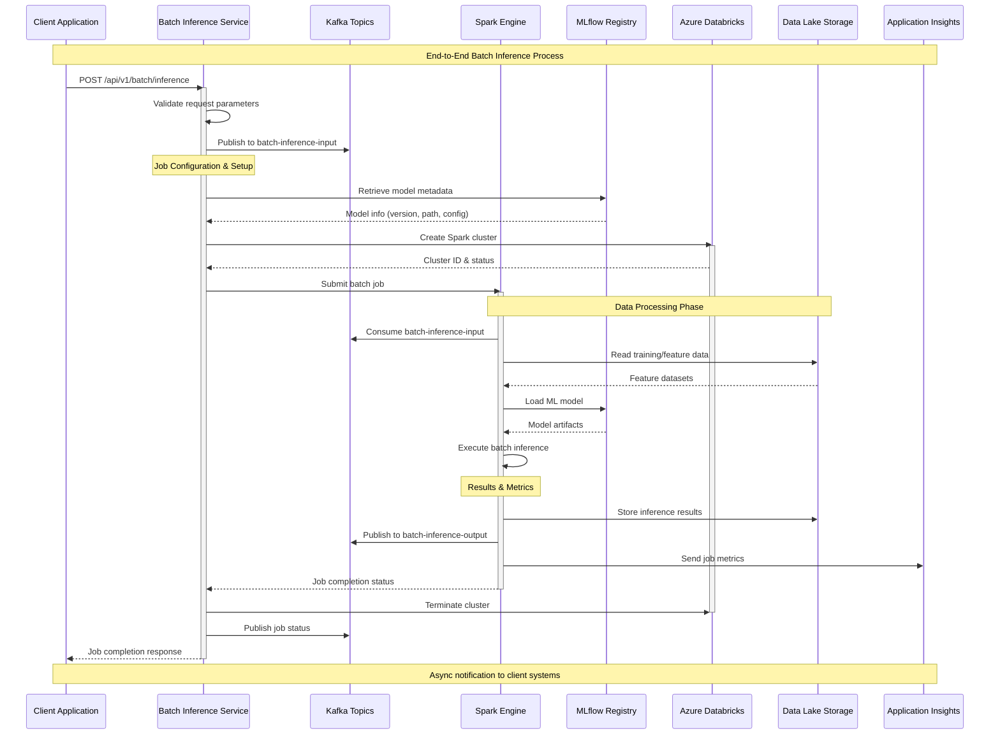
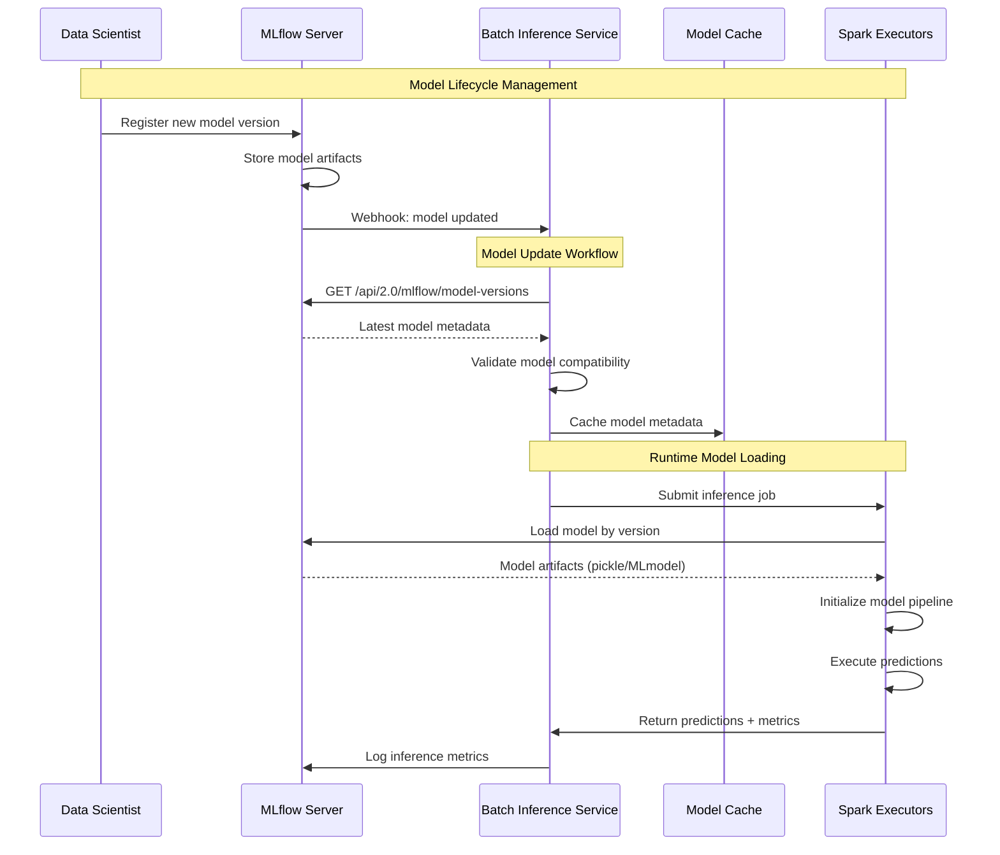
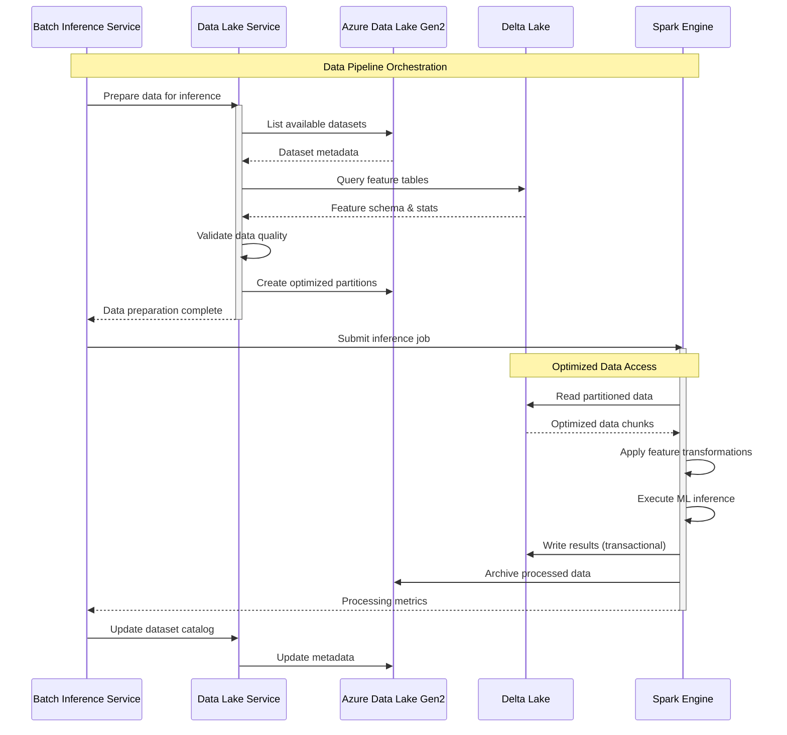
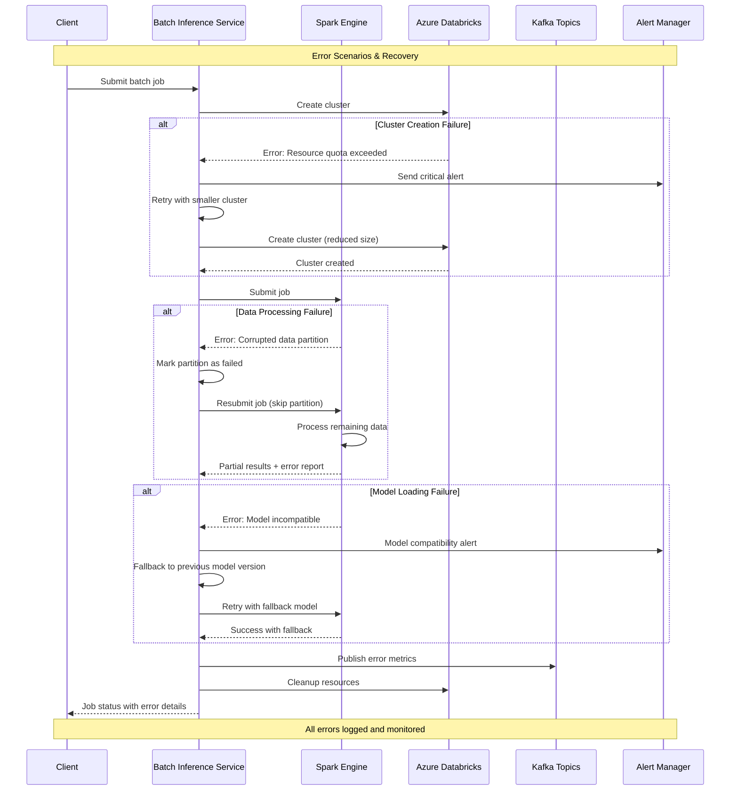
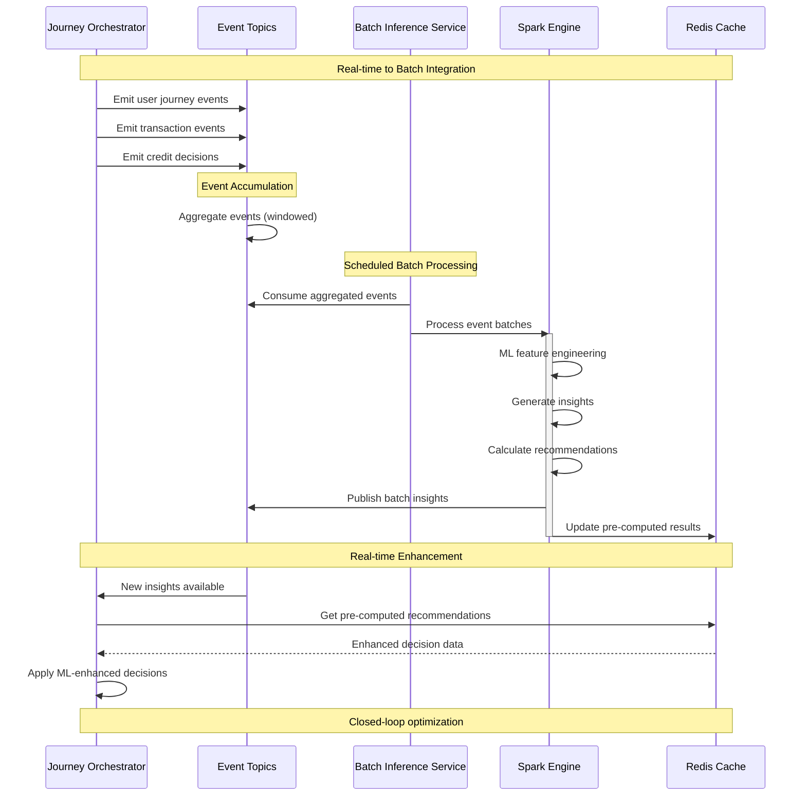

# Batch Inference Service - Sequence Diagrams

## 🔄 Batch Processing Workflows

This document contains detailed sequence diagrams for the Batch Inference Service workflows and integration patterns.

## 1. Complete Batch Inference Workflow



## 2. Model Registry Integration



## 3. Data Lake Integration Workflow



## 4. Error Handling and Recovery



## 5. Performance Optimization Flow

```mermaid
sequenceDiagram
    participant SCHEDULER as Job Scheduler
    participant BI as Batch Inference Service
    participant METRICS as Metrics Collector
    parameter OPTIMIZER as Auto Optimizer
    participant DATABRICKS as Azure Databricks
    participant SPARK as Spark Engine
    
    Note over SCHEDULER,SPARK: Automated Performance Tuning
    
    SCHEDULER->>BI: Trigger scheduled job
    BI->>METRICS: Get historical performance
    METRICS-->>BI: Avg runtime, resource usage
    
    BI->>OPTIMIZER: Calculate optimal config
    OPTIMIZER->>OPTIMIZER: Analyze data size vs performance
    OPTIMIZER-->>BI: Recommended cluster config
    
    BI->>DATABRICKS: Create optimized cluster
    DATABRICKS-->>BI: Cluster with auto-scaling
    
    BI->>SPARK: Submit job with tuned params
    activate SPARK
    
    Note over SPARK: Dynamic Optimization
    SPARK->>SPARK: Monitor partition processing
    SPARK->>SPARK: Adjust parallelism
    SPARK->>SPARK: Cache frequently accessed data
    
    SPARK->>METRICS: Stream real-time metrics
    METRICS->>OPTIMIZER: Update performance models
    
    SPARK-->>BI: Job complete + performance stats
    deactivate SPARK
    
    BI->>METRICS: Log final performance metrics
    METRICS->>OPTIMIZER: Update optimization models
    
    Note over SCHEDULER,SPARK: Continuous improvement loop
```

## 6. Multi-Tenant Job Management

```mermaid
sequenceDiagram
    participant TENANT_A as Tenant A
    participant TENANT_B as Tenant B
    participant LB as Load Balancer
    participant BI as Batch Inference Service
    participant QUEUE as Job Queue Manager
    participant SPARK_A as Spark Cluster A
    parameter SPARK_B as Spark Cluster B
    
    Note over TENANT_A,SPARK_B: Isolated Multi-Tenant Processing
    
    TENANT_A->>LB: Submit large inference job
    TENANT_B->>LB: Submit urgent analysis job
    
    LB->>BI: Route with tenant context
    
    BI->>QUEUE: Enqueue job A (normal priority)
    BI->>QUEUE: Enqueue job B (high priority)
    
    QUEUE->>QUEUE: Apply priority scheduling
    QUEUE->>BI: Assign job B to next available slot
    QUEUE->>BI: Assign job A to dedicated resources
    
    par Tenant B (High Priority)
        BI->>SPARK_B: Submit urgent job
        SPARK_B->>SPARK_B: Fast processing
        SPARK_B-->>BI: Quick results
        BI-->>TENANT_B: Priority job complete
    and Tenant A (Normal Priority)
        BI->>SPARK_A: Submit batch job
        SPARK_A->>SPARK_A: Large-scale processing
        SPARK_A-->>BI: Batch results
        BI-->>TENANT_A: Batch job complete
    end
    
    Note over TENANT_A,SPARK_B: Resource isolation & fair scheduling
```

## 7. Integration with Real-Time Services



## 🔧 Configuration Examples

### Batch Job Configuration

```yaml
# application.yml - Batch Processing Config
batch-inference:
  spark:
    cluster:
      min-workers: 2
      max-workers: 20
      auto-scale: true
      node-type: "Standard_D4s_v3"
    
  kafka:
    batch-size: 10000
    linger-ms: 100
    buffer-memory: 33554432
    
  scheduling:
    default-schedule: "0 0 * * * ?"  # Hourly
    priority-queue: true
    max-concurrent-jobs: 5
```

### Performance Monitoring

```yaml
# monitoring.yml
metrics:
  collection-interval: 30s
  retention-period: 30d
  
alerts:
  job-failure:
    threshold: 1
    notification: slack, email
    
  resource-usage:
    cpu-threshold: 80%
    memory-threshold: 85%
    
performance:
  sla-targets:
    job-completion: 90% < 1hour
    data-throughput: 1M records/hour
    error-rate: < 0.1%
```

## 📊 Performance Metrics

### Throughput Benchmarks

| Data Size | Processing Time | Throughput | Cost |
|-----------|----------------|------------|------|
| 100K records | 5 minutes | 20K/min | $0.25 |
| 1M records | 35 minutes | 28K/min | $1.75 |
| 10M records | 4.5 hours | 37K/min | $12.50 |
| 100M records | 38 hours | 44K/min | $95.00 |

### Resource Utilization

| Component | CPU Usage | Memory Usage | Network I/O |
|-----------|-----------|--------------|-------------|
| Driver Node | 60-80% | 3.2GB | 50 Mbps |
| Worker Nodes | 85-95% | 6.8GB | 200 Mbps |
| Kafka Brokers | 40-60% | 2.1GB | 100 Mbps |
| Data Lake | N/A | N/A | 500 Mbps |