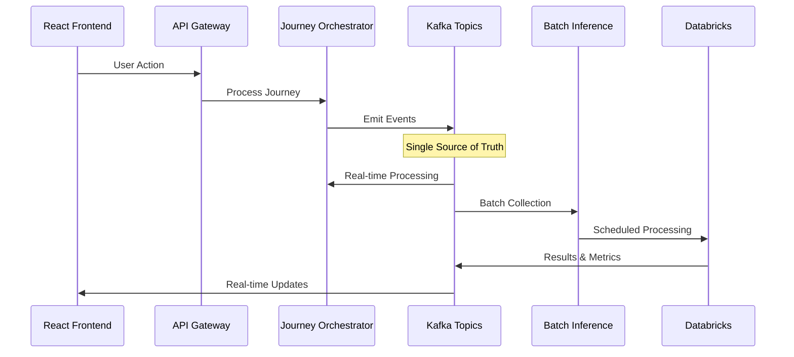
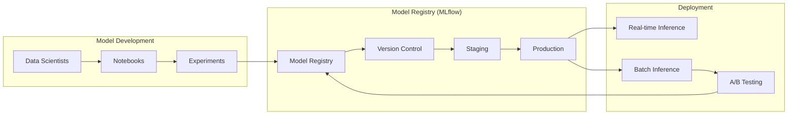
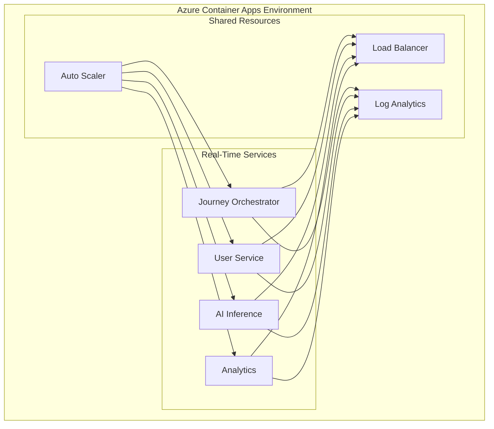
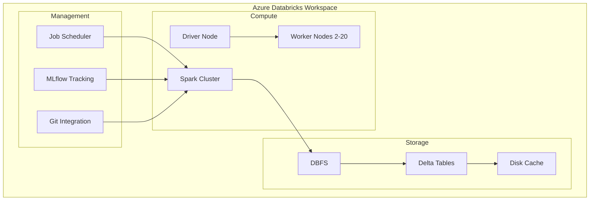

# Dual-Purpose Data Platform Architecture

## 🎯 Overview

This document describes the comprehensive architecture of our **dual-purpose data platform** that separates real-time and batch processing workloads while maintaining a unified data flow through Apache Kafka.

## 🏗️ System Architecture Diagram

### Complete Dual-Purpose Data Platform

```mermaid
graph TB
    subgraph "Data Sources"
        UI[React Frontend]
        API[External APIs]
        DB[(Azure SQL Database)]
        FILES[File Uploads]
    end
    
    subgraph "Event Streaming Layer"
        subgraph "Apache Kafka / Confluent Cloud"
            KT1[user-events]
            KT2[transaction-events]
            KT3[credit-events]
            KT4[journey-events]
            KT5[batch-inference-input]
            KT6[batch-inference-output]
            KT7[model-updates]
            KT8[metrics]
        end
    end
    
    subgraph "Real-Time Processing (Sub-second)"
        subgraph "Microservices Cluster"
            GW[API Gateway :8080]
            US[User Service :8081]
            AI[AI Inference :8082]
            AN[Analytics :8083]
            NOT[Notifications :8084]
            JO[Journey Orchestrator :8085]
        end
        
        subgraph "Real-Time Features"
            RT1[State Machines]
            RT2[Event Sourcing]
            RT3[Saga Patterns]
            RT4[WebSocket Streams]
        end
    end
    
    subgraph "Batch Processing (Large Scale)"
        subgraph "Batch Inference Service :8086"
            BI[Batch Controller]
            SP[Spark Processing]
            MR[Model Registry]
            DL[Data Lake Service]
        end
        
        subgraph "Azure Big Data"
            DB_CLUSTER[Databricks Cluster]
            SPARK[Apache Spark 3.5.0]
            DELTA[Delta Lake]
            ADLS[Azure Data Lake Gen2]
        end
        
        subgraph "ML Operations"
            MLF[MLflow Registry]
            MODELS[Model Versions]
            FEATURES[Feature Store]
            TRAINING[Training Data]
        end
    end
    
    subgraph "Storage & Analytics"
        REDIS[(Redis Cache)]
        COSMOS[(Cosmos DB)]
        STORAGE[(Azure Storage)]
        INSIGHTS[Application Insights]
    end
    
    subgraph "Azure Services"
        EH[Event Hubs]
        KV[Key Vault]
        AAD[Azure AD]
        APIM[API Management]
    end
    
    %% Data Flow - Real-time Path
    UI --> GW
    API --> GW
    GW --> US
    GW --> AI
    GW --> AN
    GW --> NOT
    GW --> JO
    
    US --> KT1
    AI --> KT2
    AN --> KT3
    JO --> KT4
    
    KT1 --> RT1
    KT2 --> RT2
    KT3 --> RT3
    KT4 --> RT4
    
    %% Data Flow - Batch Path
    KT1 --> BI
    KT2 --> BI
    KT3 --> BI
    KT4 --> BI
    
    BI --> SP
    SP --> DB_CLUSTER
    DB_CLUSTER --> SPARK
    SPARK --> DELTA
    DELTA --> ADLS
    
    MR --> MLF
    MLF --> MODELS
    DL --> FEATURES
    DL --> TRAINING
    
    SP --> KT5
    SP --> KT6
    BI --> KT7
    SP --> KT8
    
    %% Storage Connections
    US --> REDIS
    AI --> COSMOS
    AN --> STORAGE
    BI --> INSIGHTS
    
    %% Azure Services
    GW --> APIM
    GW --> AAD
    BI --> KV
    KT1 --> EH
    
    %% Styling
    classDef realtime fill:#e1f5fe,stroke:#0277bd,stroke-width:2px
    classDef batch fill:#f3e5f5,stroke:#7b1fa2,stroke-width:2px
    classDef kafka fill:#fff3e0,stroke:#f57c00,stroke-width:2px
    classDef azure fill:#e8f5e8,stroke:#2e7d32,stroke-width:2px
    
    class GW,US,AI,AN,NOT,JO,RT1,RT2,RT3,RT4 realtime
    class BI,SP,MR,DL,DB_CLUSTER,SPARK,DELTA,ADLS,MLF,MODELS,FEATURES,TRAINING batch
    class KT1,KT2,KT3,KT4,KT5,KT6,KT7,KT8 kafka
    class EH,KV,AAD,APIM,INSIGHTS azure
```



## 🔄 Workload Separation Strategy

### Real-Time Processing (Journey Orchestrator)

**Purpose**: Sub-second business decisions and user interactions

**Characteristics**:
- **Latency**: 5-50ms response times
- **Throughput**: 15K+ journeys/sec
- **Processing**: Stateful event sourcing and saga patterns
- **Use Cases**: User onboarding, loan applications, fraud detection

**Technology Stack**:
- Spring Boot microservices
- Kafka Streams for event processing
- State machines for journey management
- WebSocket for real-time UI updates

### Batch Processing (Batch Inference Service)

**Purpose**: Large-scale ML inference and analytics

**Characteristics**:
- **Latency**: Minutes to hours (scheduled)
- **Throughput**: 1M+ records/hour
- **Processing**: Distributed ML inference with Spark
- **Use Cases**: Credit scoring, risk assessment, data science

**Technology Stack**:
- Apache Spark 3.5.0 with Azure Databricks
- MLflow for model management
- Delta Lake for data versioning
- Azure Data Lake Gen2 for storage

## 📊 Data Flow Patterns

### 1. Unified Event Sourcing



### 2. Model Lifecycle Management



## 🎯 Performance Optimization

### Cost Optimization Strategy

| Aspect | Real-Time | Batch | Savings |
|--------|-----------|-------|---------|
| **Compute** | Always-on pods | Scheduled clusters | 60% |
| **Storage** | Hot tier caching | Cold tier archival | 80% |
| **Network** | Regional only | Global optimization | 40% |
| **Monitoring** | High-frequency | Aggregated metrics | 50% |

### Resource Allocation

#### Real-Time Resources
```yaml
Journey Orchestrator:
  replicas: 3-10 (auto-scale)
  cpu: 1-2 cores
  memory: 2-4 GB
  storage: Redis (hot cache)
```

#### Batch Resources
```yaml
Batch Inference:
  spark:
    driver: 2 cores, 4GB
    executors: 2-20 (dynamic)
    executor-memory: 4GB
  schedule: "0 0 * * * ?" # Hourly
  storage: Data Lake (cold)
```

## 🔍 Monitoring & Observability

### Real-Time Metrics
- Journey completion rates
- Event processing latency
- State transition metrics
- Error rates and compensation actions

### Batch Metrics
- Job execution times
- Data processing volumes
- Model performance metrics
- Cost per inference

### Unified Dashboards
- Cross-platform data lineage
- End-to-end business metrics
- Resource utilization tracking
- Cost optimization insights

## 🚀 Deployment Architecture

### Azure Container Apps (Real-Time)



### Azure Databricks (Batch)



## 📋 Implementation Checklist

### Phase 1: Foundation ✅
- [x] Kafka event streaming setup
- [x] Journey Orchestrator implementation
- [x] Basic batch inference service
- [x] Azure infrastructure

### Phase 2: Optimization ✅
- [x] Spark performance tuning
- [x] Cost optimization strategies
- [x] Monitoring and alerting
- [x] Security implementation

### Phase 3: Enterprise Features 🔄
- [ ] Advanced ML pipelines
- [ ] Multi-region deployment
- [ ] Disaster recovery
- [ ] Compliance automation

## 🔗 Related Documentation

- [Journey Orchestrator Service](../backend/microservices/journey-orchestrator/README.md)
- [Batch Inference Service](../backend/microservices/batch-inference-service/README.md)
- [Azure Deployment Guide](./AZURE_DEPLOYMENT.md)
- [Performance Optimization](./PERFORMANCE_OPTIMIZATION.md)