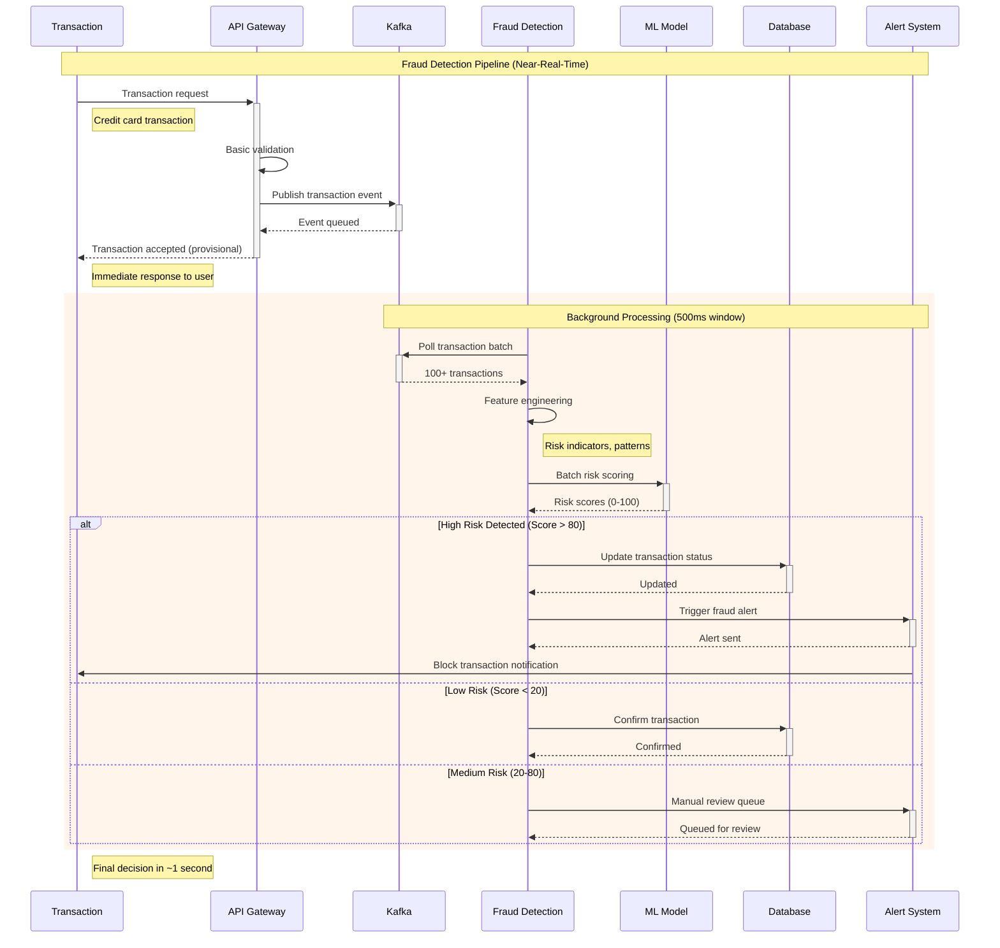
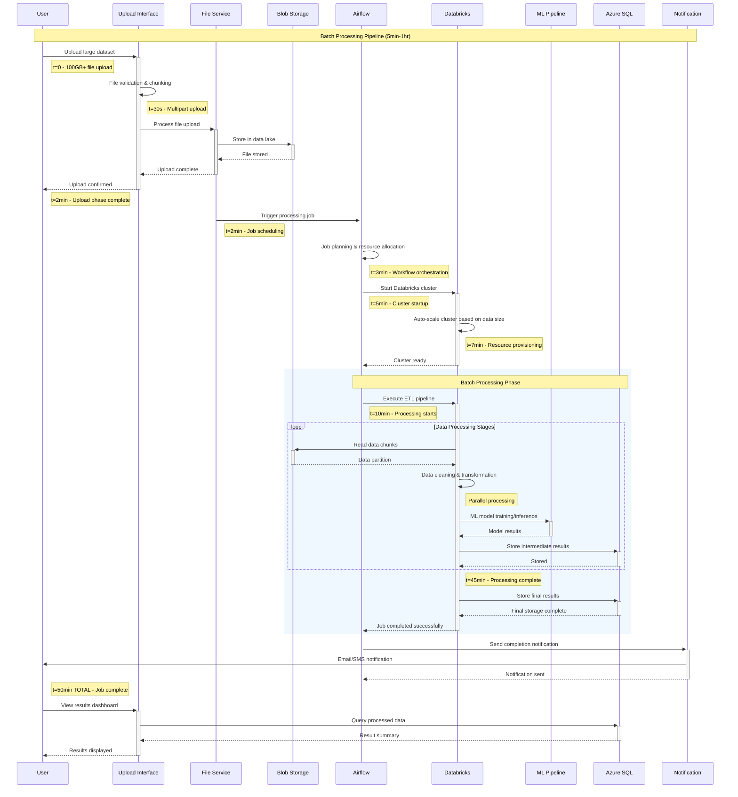
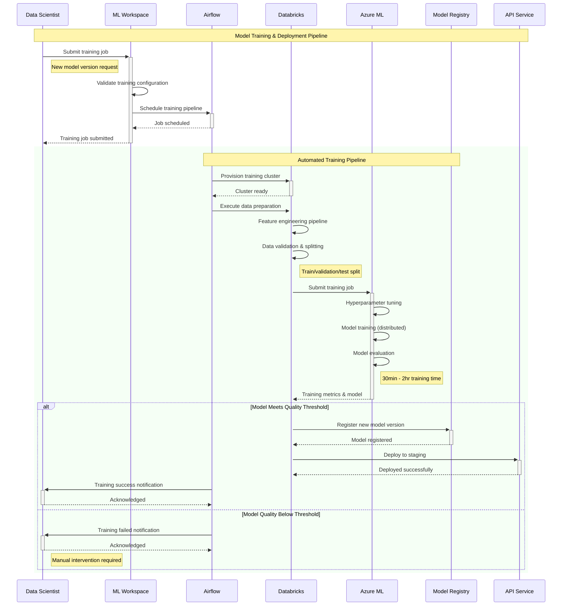
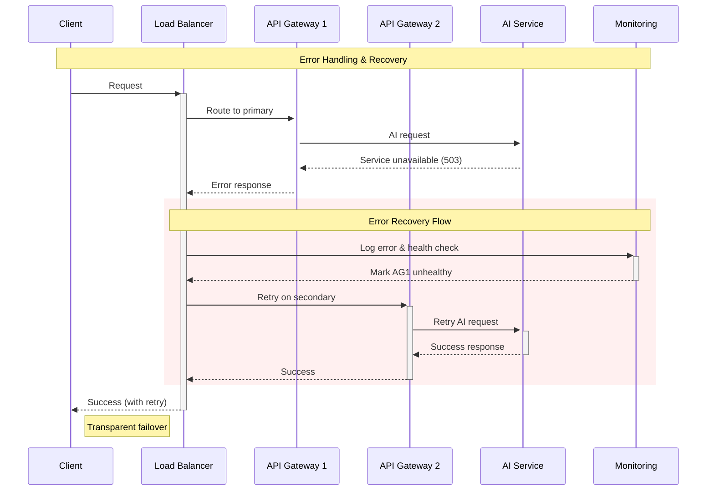
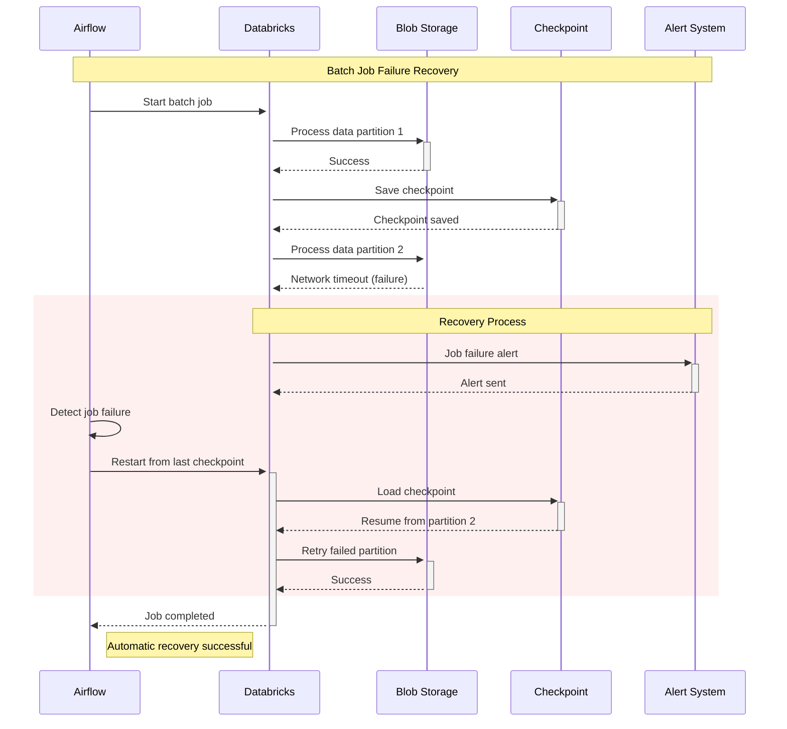
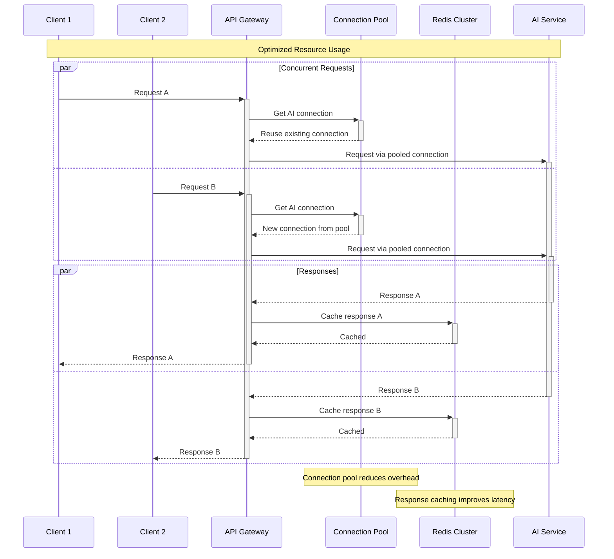

# AI Inference Sequence Diagrams

This document contains detailed sequence diagrams showing the request/response flows, timing, and data paths for all three AI inference modes.

## Real-Time Inference Sequence Diagram

### Interactive Request Flow (25-100ms)

```mermaid
sequenceDiagram
    participant U as User/Client
    participant LB as Load Balancer
    participant AG as API Gateway
    participant RC as Redis Cache
    participant IM as In-Memory Cache
    participant AI as AI Service
    participant Mon as Monitoring

    Note over U,Mon: Real-Time Inference (Target: 25-100ms)
    
    U->>+LB: HTTP Request with prompt
    Note right of U: t=0ms
    
    LB->>+AG: Route to healthy instance
    Note right of LB: t=5ms (routing)
    
    AG->>+AG: Authenticate & Rate Limit
    Note right of AG: t=10ms (auth check)
    
    AG->>+RC: Check cache key
    Note right of AG: t=15ms
    
    alt Cache Hit (80% probability)
        RC-->>-AG: Return cached response
        Note right of RC: t=20ms (Redis lookup)
        AG-->>-LB: Cached response
        LB-->>-U: Response (200 OK)
        Note right of U: t=25ms TOTAL
    else Cache Miss (20% probability)
        RC-->>AG: Cache miss
        Note right of RC: t=20ms
        
        AG->>+IM: Check in-memory cache
        Note right of AG: t=22ms
        
        alt In-Memory Hit (50% of misses)
            IM-->>-AG: Return cached response
            Note right of IM: t=25ms
            AG->>RC: Store in Redis for future
            AG-->>-LB: Response
            LB-->>-U: Response (200 OK)
            Note right of U: t=30ms TOTAL
        else Complete Miss
            IM-->>AG: Miss
            Note right of IM: t=25ms
            
            AG->>+AI: AI inference request
            Note right of AG: t=30ms
            
            AI->>AI: Process with GPT-4 Turbo
            Note right of AI: t=30-80ms (AI processing)
            
            AI-->>-AG: AI response
            Note right of AI: t=80ms
            
            par Store in caches
                AG->>RC: Store in Redis
                AG->>IM: Store in memory
            and Return response
                AG-->>-LB: Response
                LB-->>-U: Response (200 OK)
            end
            Note right of U: t=90ms TOTAL
        end
    end
    
    AG->>+Mon: Log metrics (async)
    Mon-->>-AG: Logged
    Note right of Mon: Performance tracking
```

### WebSocket Real-Time Updates

```mermaid
sequenceDiagram
    participant C as Client
    participant WS as WebSocket Gateway
    participant AG as API Gateway
    participant AI as AI Service
    participant RC as Redis Cache

    Note over C,RC: Real-Time Streaming Inference
    
    C->>+WS: Establish WebSocket connection
    WS-->>-C: Connection established
    
    loop Continuous Interaction
        C->>+WS: Stream partial prompt
        WS->>+AG: Process partial input
        
        AG->>+RC: Check partial match cache
        alt Partial Match Found
            RC-->>-AG: Partial suggestions
            AG-->>-WS: Incremental response
            WS-->>C: Real-time suggestions
        else No Match
            RC-->>AG: No match
            AG->>+AI: Incremental AI call
            AI-->>-AG: Partial AI response
            AG-->>-WS: Streaming response
            WS-->>C: Real-time AI output
        end
        
        Note right of C: Sub-100ms per interaction
    end
```

## Near-Real-Time Inference Sequence Diagram

### Event Streaming Flow (500ms-1s)

```mermaid
sequenceDiagram
    participant E as Event Source
    participant IG as Ingestion Gateway
    participant K as Kafka Cluster
    participant SS as Spark Streaming
    participant ML as ML Engine
    participant CS as Cosmos DB
    participant WS as WebSocket
    participant C as Client

    Note over E,C: Near-Real-Time Stream Processing (500ms-1s batches)
    
    E->>+IG: Stream of events
    Note right of E: t=0ms - Event generated
    
    IG->>IG: Event validation & enrichment
    Note right of IG: t=10ms - Processing
    
    IG->>+K: Publish to Kafka topic
    Note right of IG: t=20ms - Kafka publish
    K-->>-IG: Ack
    
    par Micro-batch Collection
        loop Every 500ms
            SS->>+K: Poll for new events
            K-->>-SS: Batch of events (100-1000 events)
            Note right of K: t=500ms - Batch ready
            
            SS->>SS: Aggregate & transform events
            Note right of SS: t=550ms - Data processing
            
            SS->>+ML: Batch inference request
            Note right of SS: t=600ms
            
            ML->>ML: Feature engineering
            Note right of ML: t=650ms - ML processing
            
            ML->>ML: Model inference (batch)
            Note right of ML: t=750ms - Batch prediction
            
            ML-->>-SS: Batch predictions
            Note right of ML: t=850ms
            
            SS->>+CS: Store results
            CS-->>-SS: Stored
            Note right = CS: t=900ms - Persistence
            
            SS->>+WS: Publish results
            WS-->>-SS: Published
            Note right of WS: t=950ms
        end
    and Real-time Client Updates
        WS->>+C: Push batch results
        C-->>-WS: Ack received
        Note right of C: t=1000ms TOTAL - Client updated
    end
```

### Fraud Detection Example Flow



## Batch Processing Sequence Diagram

### Large Dataset Processing Flow (5min-1hr)



### ML Model Training Workflow



## Error Handling & Recovery Sequences

### Real-Time Error Recovery



### Batch Job Recovery



## Performance Optimization Patterns

### Connection Pooling & Caching



---

*These sequence diagrams represent the current implementation and are updated as the system evolves.*