# Analytics Sequence Diagrams

## Real-Time Streaming Analytics Sequence

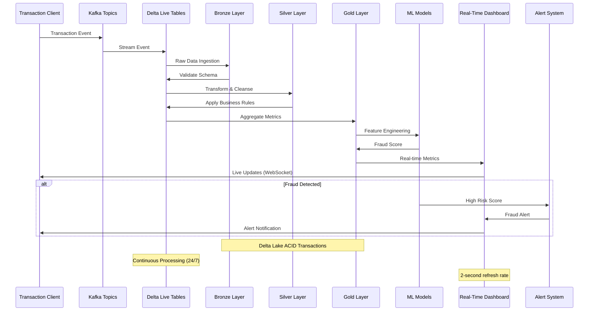
```mermaid
sequenceDiagram
    participant Client as Transaction Client
    participant Kafka as Kafka Topics
    participant DLT as Delta Live Tables
    participant Bronze as Bronze Layer
    participant Silver as Silver Layer  
    participant Gold as Gold Layer
    participant ML as ML Models
    participant Dashboard as Real-Time Dashboard
    participant Alerts as Alert System

    Client->>Kafka: Transaction Event
    Kafka->>DLT: Stream Event
    DLT->>Bronze: Raw Data Ingestion
    Bronze->>DLT: Validate Schema
    DLT->>Silver: Transform & Cleanse
    Silver->>DLT: Apply Business Rules
    DLT->>Gold: Aggregate Metrics
    
    Gold->>ML: Feature Engineering
    ML->>Gold: Fraud Score
    
    Gold->>Dashboard: Real-time Metrics
    Dashboard->>Client: Live Updates (WebSocket)
    
    alt Fraud Detected
        ML->>Alerts: High Risk Score
        Alerts->>Dashboard: Fraud Alert
        Dashboard->>Client: Alert Notification
    end
    
    Note over Bronze,Gold: Delta Lake ACID Transactions
    Note over DLT: Continuous Processing (24/7)
    Note over Dashboard: 2-second refresh rate
```

## Batch Processing Analytics Sequence

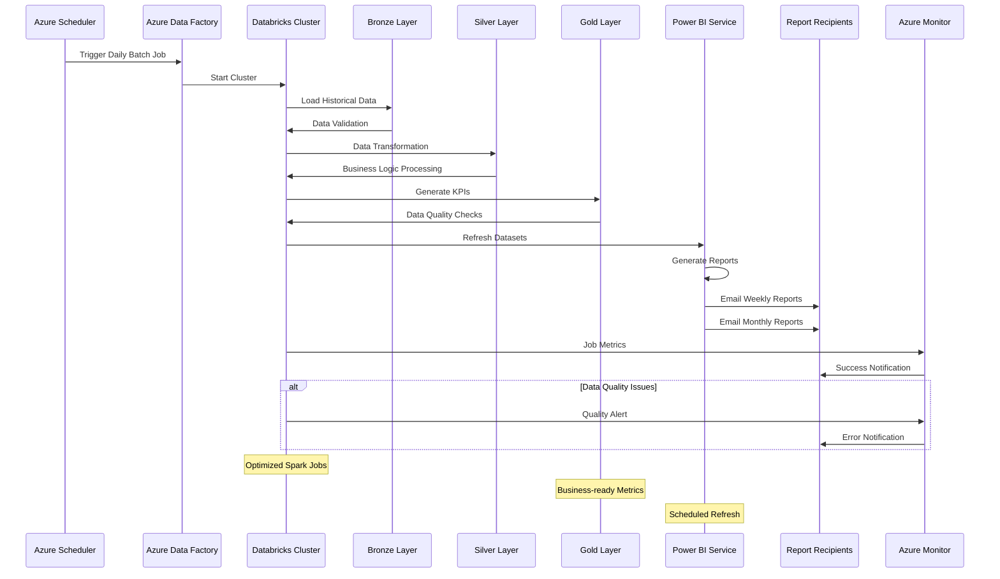
```mermaid
sequenceDiagram
    participant Scheduler as Azure Scheduler
    participant ADF as Azure Data Factory
    participant Databricks as Databricks Cluster
    participant Bronze as Bronze Layer
    participant Silver as Silver Layer
    participant Gold as Gold Layer
    participant PowerBI as Power BI Service
    participant Recipients as Report Recipients
    participant Monitor as Azure Monitor

    Scheduler->>ADF: Trigger Daily Batch Job
    ADF->>Databricks: Start Cluster
    Databricks->>Bronze: Load Historical Data
    Bronze->>Databricks: Data Validation
    
    Databricks->>Silver: Data Transformation
    Silver->>Databricks: Business Logic Processing
    Databricks->>Gold: Generate KPIs
    
    Gold->>Databricks: Data Quality Checks
    Databricks->>PowerBI: Refresh Datasets
    PowerBI->>PowerBI: Generate Reports
    
    PowerBI->>Recipients: Email Weekly Reports
    PowerBI->>Recipients: Email Monthly Reports
    
    Databricks->>Monitor: Job Metrics
    Monitor->>Recipients: Success Notification
    
    alt Data Quality Issues
        Databricks->>Monitor: Quality Alert
        Monitor->>Recipients: Error Notification
    end
    
    Note over Databricks: Optimized Spark Jobs
    Note over Gold: Business-ready Metrics
    Note over PowerBI: Scheduled Refresh
```

## Business Intelligence Report Generation Sequence

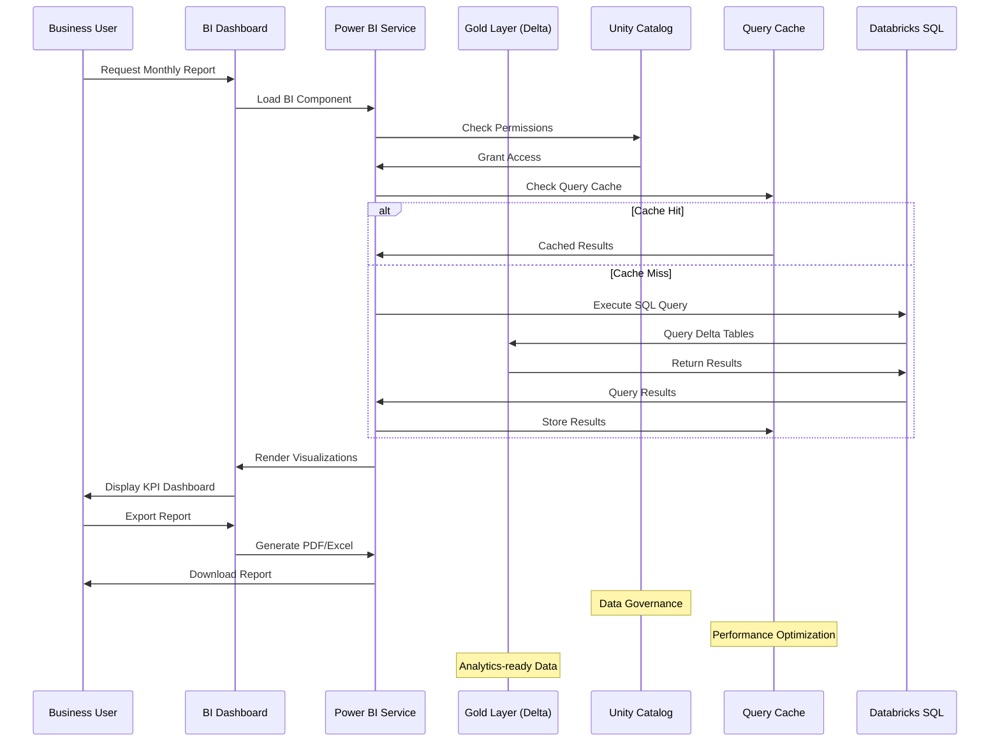
```mermaid
sequenceDiagram
    participant User as Business User
    participant BI as BI Dashboard
    participant PowerBI as Power BI Service
    participant Gold as Gold Layer (Delta)
    participant Unity as Unity Catalog
    participant Cache as Query Cache
    participant Databricks as Databricks SQL

    User->>BI: Request Monthly Report
    BI->>PowerBI: Load BI Component
    PowerBI->>Unity: Check Permissions
    Unity->>PowerBI: Grant Access
    
    PowerBI->>Cache: Check Query Cache
    alt Cache Hit
        Cache->>PowerBI: Cached Results
    else Cache Miss
        PowerBI->>Databricks: Execute SQL Query
        Databricks->>Gold: Query Delta Tables
        Gold->>Databricks: Return Results
        Databricks->>PowerBI: Query Results
        PowerBI->>Cache: Store Results
    end
    
    PowerBI->>BI: Render Visualizations
    BI->>User: Display KPI Dashboard
    
    User->>BI: Export Report
    BI->>PowerBI: Generate PDF/Excel
    PowerBI->>User: Download Report
    
    Note over Unity: Data Governance
    Note over Cache: Performance Optimization
    Note over Gold: Analytics-ready Data
```

## Data Pipeline Health Monitoring Sequence

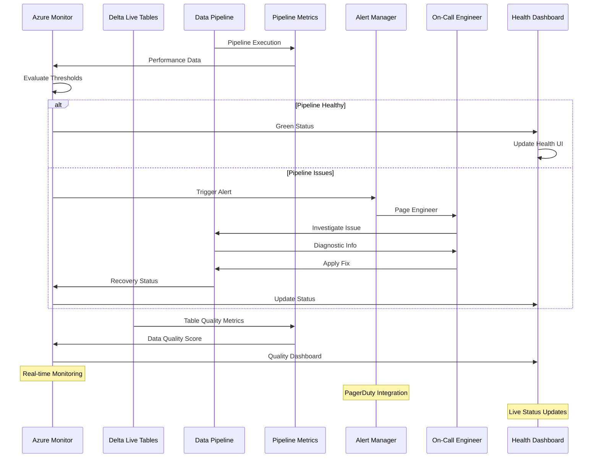
```mermaid
sequenceDiagram
    participant Monitor as Azure Monitor
    participant DLT as Delta Live Tables
    participant Pipeline as Data Pipeline
    participant Metrics as Pipeline Metrics
    participant Alerts as Alert Manager
    participant OnCall as On-Call Engineer
    participant Dashboard as Health Dashboard

    Pipeline->>Metrics: Pipeline Execution
    Metrics->>Monitor: Performance Data
    Monitor->>Monitor: Evaluate Thresholds
    
    alt Pipeline Healthy
        Monitor->>Dashboard: Green Status
        Dashboard->>Dashboard: Update Health UI
    else Pipeline Issues
        Monitor->>Alerts: Trigger Alert
        Alerts->>OnCall: Page Engineer
        OnCall->>Pipeline: Investigate Issue
        Pipeline->>OnCall: Diagnostic Info
        OnCall->>Pipeline: Apply Fix
        Pipeline->>Monitor: Recovery Status
        Monitor->>Dashboard: Update Status
    end
    
    DLT->>Metrics: Table Quality Metrics
    Metrics->>Monitor: Data Quality Score
    Monitor->>Dashboard: Quality Dashboard
    
    Note over Monitor: Real-time Monitoring
    Note over Alerts: PagerDuty Integration
    Note over Dashboard: Live Status Updates
```

## Fraud Detection ML Pipeline Sequence

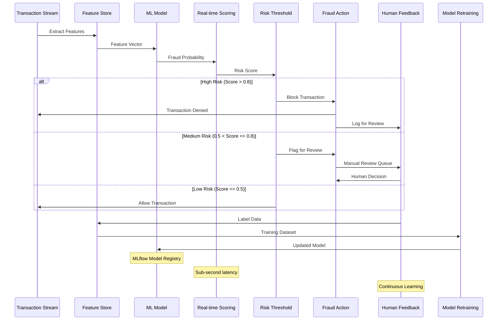
```mermaid
sequenceDiagram
    participant Transaction as Transaction Stream
    participant Features as Feature Store
    participant Model as ML Model
    participant Scoring as Real-time Scoring
    participant Threshold as Risk Threshold
    participant Action as Fraud Action
    participant Feedback as Human Feedback
    participant Retraining as Model Retraining

    Transaction->>Features: Extract Features
    Features->>Model: Feature Vector
    Model->>Scoring: Fraud Probability
    Scoring->>Threshold: Risk Score
    
    alt High Risk (Score > 0.8)
        Threshold->>Action: Block Transaction
        Action->>Transaction: Transaction Denied
        Action->>Feedback: Log for Review
    else Medium Risk (0.5 < Score <= 0.8)
        Threshold->>Action: Flag for Review
        Action->>Feedback: Manual Review Queue
        Feedback->>Action: Human Decision
    else Low Risk (Score <= 0.5)
        Threshold->>Transaction: Allow Transaction
    end
    
    Feedback->>Features: Label Data
    Features->>Retraining: Training Dataset
    Retraining->>Model: Updated Model
    
    Note over Model: MLflow Model Registry
    Note over Scoring: Sub-second latency
    Note over Feedback: Continuous Learning
```

## Power BI DirectQuery Sequence

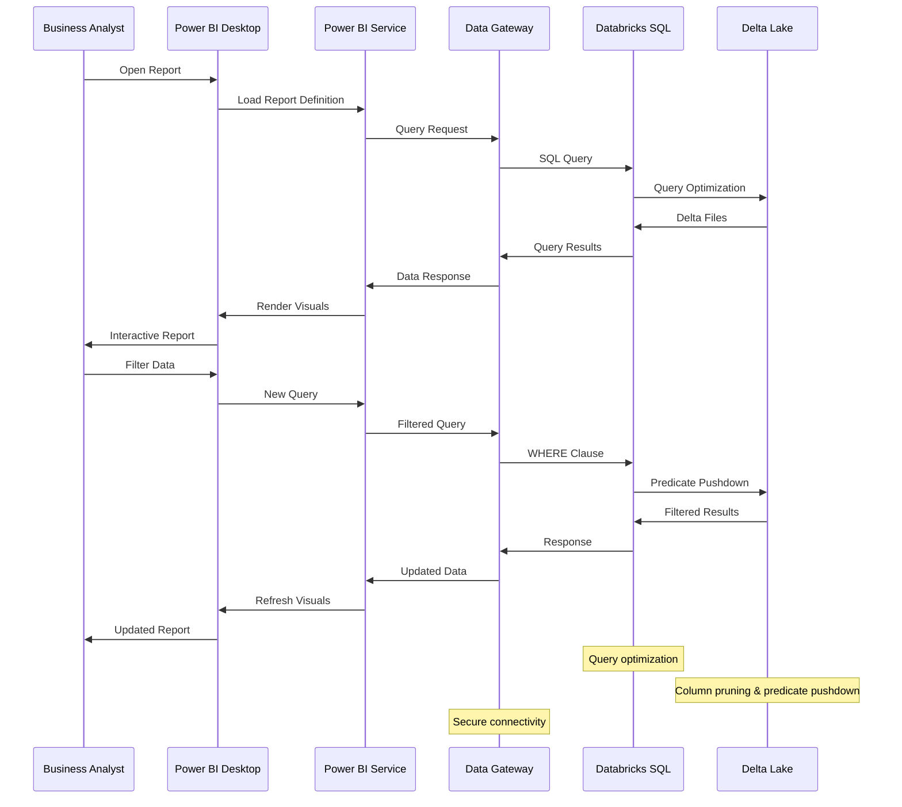
```mermaid
sequenceDiagram
    participant User as Business Analyst
    participant PowerBI as Power BI Desktop
    participant Service as Power BI Service
    participant Gateway as Data Gateway
    participant Databricks as Databricks SQL
    participant Delta as Delta Lake

    User->>PowerBI: Open Report
    PowerBI->>Service: Load Report Definition
    Service->>Gateway: Query Request
    Gateway->>Databricks: SQL Query
    
    Databricks->>Delta: Query Optimization
    Delta->>Databricks: Delta Files
    Databricks->>Gateway: Query Results
    Gateway->>Service: Data Response
    Service->>PowerBI: Render Visuals
    PowerBI->>User: Interactive Report
    
    User->>PowerBI: Filter Data
    PowerBI->>Service: New Query
    Service->>Gateway: Filtered Query
    Gateway->>Databricks: WHERE Clause
    Databricks->>Delta: Predicate Pushdown
    Delta->>Databricks: Filtered Results
    Databricks->>Gateway: Response
    Gateway->>Service: Updated Data
    Service->>PowerBI: Refresh Visuals
    PowerBI->>User: Updated Report
    
    Note over Databricks: Query optimization
    Note over Delta: Column pruning & predicate pushdown
    Note over Gateway: Secure connectivity
```

## Weekly Business Review Sequence

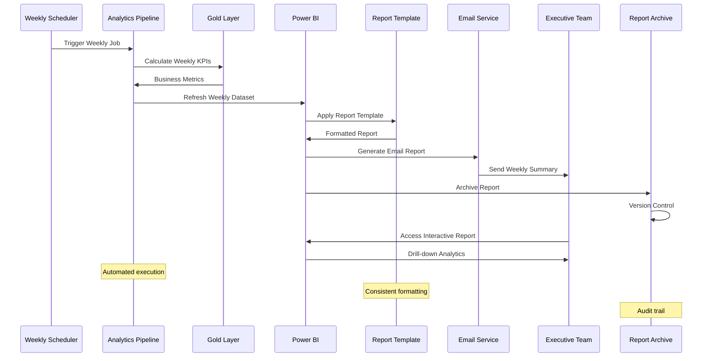
```mermaid
sequenceDiagram
    participant Scheduler as Weekly Scheduler
    participant Pipeline as Analytics Pipeline  
    participant Gold as Gold Layer
    participant PowerBI as Power BI
    participant Template as Report Template
    participant Email as Email Service
    participant Executives as Executive Team
    participant Storage as Report Archive

    Scheduler->>Pipeline: Trigger Weekly Job
    Pipeline->>Gold: Calculate Weekly KPIs
    Gold->>Pipeline: Business Metrics
    
    Pipeline->>PowerBI: Refresh Weekly Dataset
    PowerBI->>Template: Apply Report Template
    Template->>PowerBI: Formatted Report
    
    PowerBI->>Email: Generate Email Report
    Email->>Executives: Send Weekly Summary
    
    PowerBI->>Storage: Archive Report
    Storage->>Storage: Version Control
    
    Executives->>PowerBI: Access Interactive Report
    PowerBI->>Executives: Drill-down Analytics
    
    Note over Pipeline: Automated execution
    Note over Template: Consistent formatting
    Note over Storage: Audit trail
```

## Data Lineage Tracking Sequence

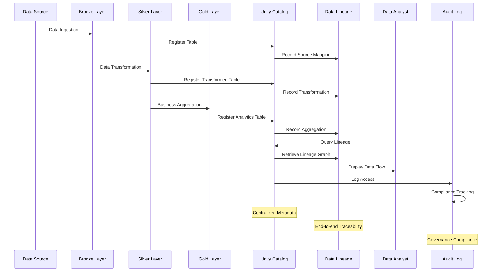
```mermaid
sequenceDiagram
    participant Source as Data Source
    participant Bronze as Bronze Layer
    participant Silver as Silver Layer
    participant Gold as Gold Layer
    participant Unity as Unity Catalog
    participant Lineage as Data Lineage
    participant Analyst as Data Analyst
    participant Audit as Audit Log

    Source->>Bronze: Data Ingestion
    Bronze->>Unity: Register Table
    Unity->>Lineage: Record Source Mapping
    
    Bronze->>Silver: Data Transformation
    Silver->>Unity: Register Transformed Table
    Unity->>Lineage: Record Transformation
    
    Silver->>Gold: Business Aggregation
    Gold->>Unity: Register Analytics Table
    Unity->>Lineage: Record Aggregation
    
    Analyst->>Unity: Query Lineage
    Unity->>Lineage: Retrieve Lineage Graph
    Lineage->>Analyst: Display Data Flow
    
    Unity->>Audit: Log Access
    Audit->>Audit: Compliance Tracking
    
    Note over Unity: Centralized Metadata
    Note over Lineage: End-to-end Traceability
    Note over Audit: Governance Compliance
```

## XAI Real-Time Inference & Explanation Sequence

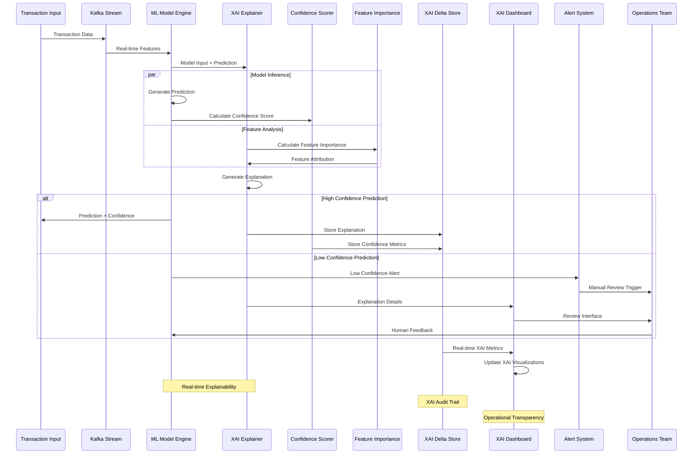
```mermaid
sequenceDiagram
    participant Client as Transaction Input
    participant Stream as Kafka Stream
    participant ML as ML Model Engine
    participant Explainer as XAI Explainer
    participant Confidence as Confidence Scorer
    participant FeatureCalc as Feature Importance
    participant Storage as XAI Delta Store
    participant Dashboard as XAI Dashboard
    participant Alert as Alert System
    participant Ops as Operations Team

    Client->>Stream: Transaction Data
    Stream->>ML: Real-time Features
    ML->>Explainer: Model Input + Prediction
    
    par Model Inference
        ML->>ML: Generate Prediction
        ML->>Confidence: Calculate Confidence Score
    and Feature Analysis
        Explainer->>FeatureCalc: Calculate Feature Importance
        FeatureCalc->>Explainer: Feature Attribution
    end
    
    Explainer->>Explainer: Generate Explanation
    
    alt High Confidence Prediction
        ML->>Client: Prediction + Confidence
        Explainer->>Storage: Store Explanation
        Confidence->>Storage: Store Confidence Metrics
    else Low Confidence Prediction
        ML->>Alert: Low Confidence Alert
        Alert->>Ops: Manual Review Trigger
        Explainer->>Dashboard: Explanation Details
        Dashboard->>Ops: Review Interface
        Ops->>ML: Human Feedback
    end
    
    Storage->>Dashboard: Real-time XAI Metrics
    Dashboard->>Dashboard: Update XAI Visualizations
    
    Note over ML,Explainer: Real-time Explainability
    Note over Storage: XAI Audit Trail
    Note over Dashboard: Operational Transparency
```

## XAI Strategic Validation & Feedback Sequence

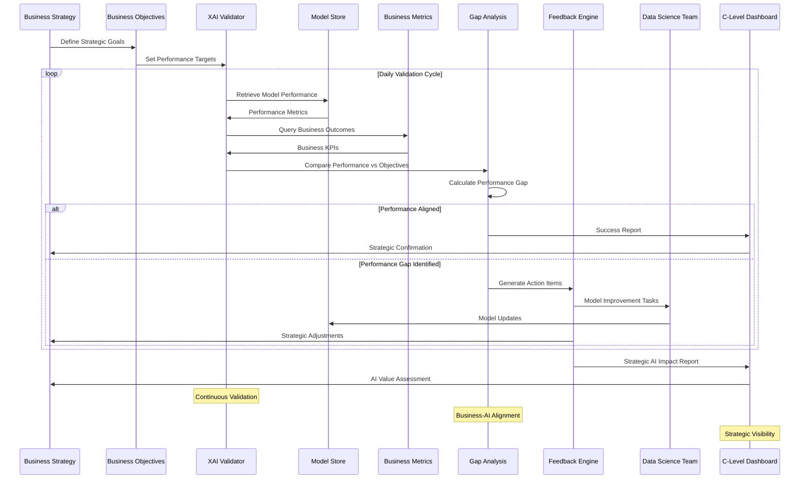
```mermaid
sequenceDiagram
    participant Business as Business Strategy
    participant Objectives as Business Objectives
    participant Validator as XAI Validator
    participant ModelStore as Model Store
    participant Metrics as Business Metrics
    participant Analysis as Gap Analysis
    participant Feedback as Feedback Engine
    participant DataScience as Data Science Team
    participant Executive as C-Level Dashboard

    Business->>Objectives: Define Strategic Goals
    Objectives->>Validator: Set Performance Targets
    
    loop Daily Validation Cycle
        Validator->>ModelStore: Retrieve Model Performance
        ModelStore->>Validator: Performance Metrics
        Validator->>Metrics: Query Business Outcomes
        Metrics->>Validator: Business KPIs
        
        Validator->>Analysis: Compare Performance vs Objectives
        Analysis->>Analysis: Calculate Performance Gap
        
        alt Performance Aligned
            Analysis->>Executive: Success Report
            Executive->>Business: Strategic Confirmation
        else Performance Gap Identified
            Analysis->>Feedback: Generate Action Items
            Feedback->>DataScience: Model Improvement Tasks
            DataScience->>ModelStore: Model Updates
            Feedback->>Business: Strategic Adjustments
        end
    end
    
    Feedback->>Executive: Strategic AI Impact Report
    Executive->>Business: AI Value Assessment
    
    Note over Validator: Continuous Validation
    Note over Analysis: Business-AI Alignment
    Note over Executive: Strategic Visibility
```

## XAI Model Drift Detection & Response Sequence

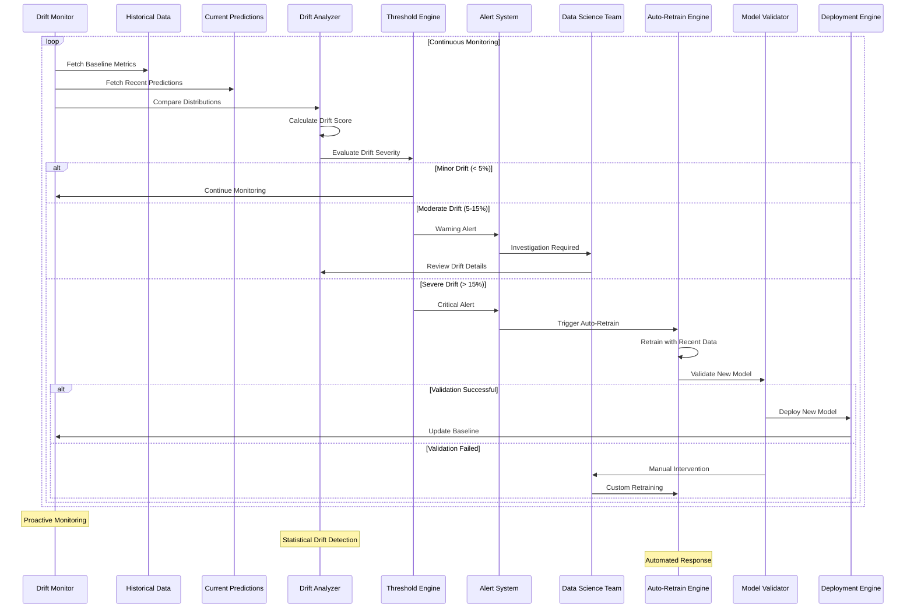
```mermaid
sequenceDiagram
    participant Monitor as Drift Monitor
    participant Historical as Historical Data
    participant Current as Current Predictions
    participant Analyzer as Drift Analyzer
    participant Threshold as Threshold Engine
    participant Alert as Alert System
    participant DataScience as Data Science Team
    participant AutoML as Auto-Retrain Engine
    participant Validator as Model Validator
    participant Deployment as Deployment Engine

    loop Continuous Monitoring
        Monitor->>Historical: Fetch Baseline Metrics
        Monitor->>Current: Fetch Recent Predictions
        
        Monitor->>Analyzer: Compare Distributions
        Analyzer->>Analyzer: Calculate Drift Score
        Analyzer->>Threshold: Evaluate Drift Severity
        
        alt Minor Drift (< 5%)
            Threshold->>Monitor: Continue Monitoring
        else Moderate Drift (5-15%)
            Threshold->>Alert: Warning Alert
            Alert->>DataScience: Investigation Required
            DataScience->>Analyzer: Review Drift Details
        else Severe Drift (> 15%)
            Threshold->>Alert: Critical Alert
            Alert->>AutoML: Trigger Auto-Retrain
            AutoML->>AutoML: Retrain with Recent Data
            AutoML->>Validator: Validate New Model
            
            alt Validation Successful
                Validator->>Deployment: Deploy New Model
                Deployment->>Monitor: Update Baseline
            else Validation Failed
                Validator->>DataScience: Manual Intervention
                DataScience->>AutoML: Custom Retraining
            end
        end
    end
    
    Note over Monitor: Proactive Monitoring
    Note over Analyzer: Statistical Drift Detection
    Note over AutoML: Automated Response
```

## XAI Business Impact Measurement Sequence

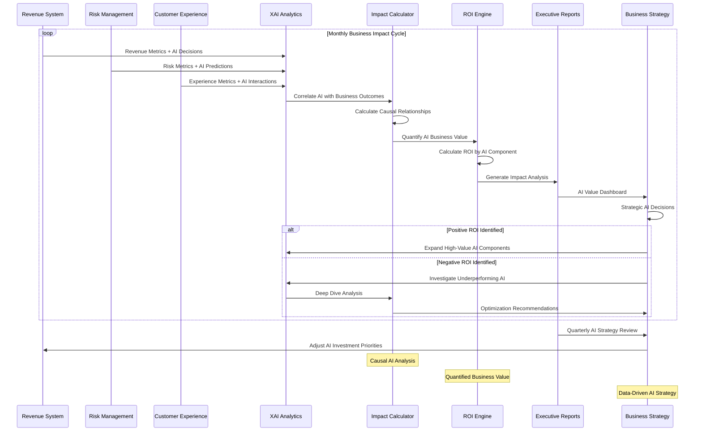
```mermaid
sequenceDiagram
    participant Revenue as Revenue System
    participant Risk as Risk Management
    participant Customer as Customer Experience
    participant XAI as XAI Analytics
    participant Impact as Impact Calculator
    participant ROI as ROI Engine
    participant Report as Executive Reports
    participant Strategy as Business Strategy

    loop Monthly Business Impact Cycle
        Revenue->>XAI: Revenue Metrics + AI Decisions
        Risk->>XAI: Risk Metrics + AI Predictions
        Customer->>XAI: Experience Metrics + AI Interactions
        
        XAI->>Impact: Correlate AI with Business Outcomes
        Impact->>Impact: Calculate Causal Relationships
        Impact->>ROI: Quantify AI Business Value
        
        ROI->>ROI: Calculate ROI by AI Component
        ROI->>Report: Generate Impact Analysis
        
        Report->>Strategy: AI Value Dashboard
        Strategy->>Strategy: Strategic AI Decisions
        
        alt Positive ROI Identified
            Strategy->>XAI: Expand High-Value AI Components
        else Negative ROI Identified
            Strategy->>XAI: Investigate Underperforming AI
            XAI->>Impact: Deep Dive Analysis
            Impact->>Strategy: Optimization Recommendations
        end
    end
    
    Report->>Strategy: Quarterly AI Strategy Review
    Strategy->>Revenue: Adjust AI Investment Priorities
    
    Note over Impact: Causal AI Analysis
    Note over ROI: Quantified Business Value
    Note over Strategy: Data-Driven AI Strategy
```

## XAI Regulatory Compliance & Audit Sequence

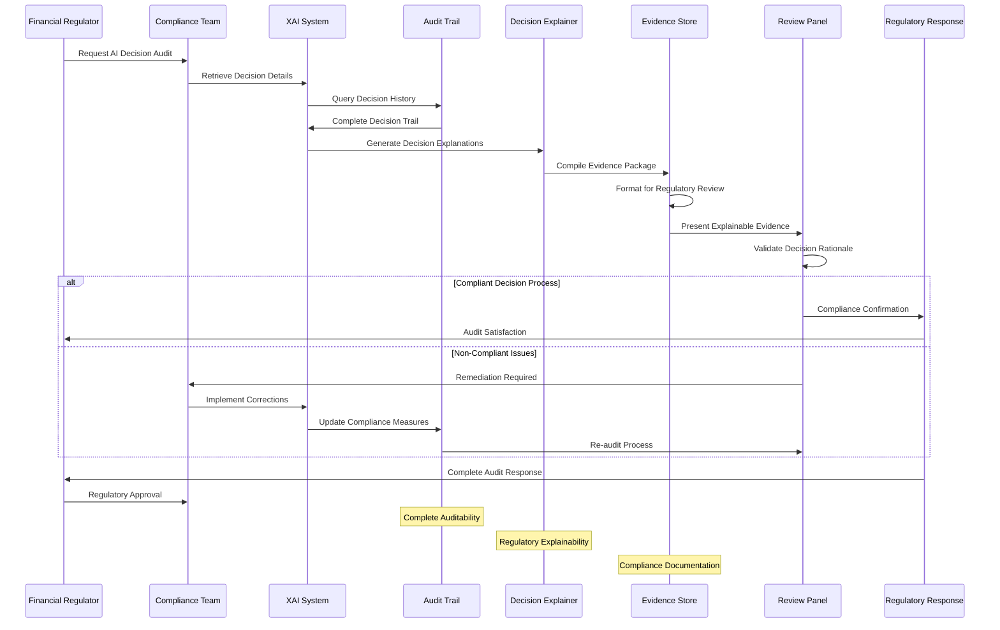
```mermaid
sequenceDiagram
    participant Regulator as Financial Regulator
    participant Compliance as Compliance Team
    participant XAI as XAI System
    participant AuditLog as Audit Trail
    participant Explainer as Decision Explainer
    participant Evidence as Evidence Store
    participant Review as Review Panel
    participant Response as Regulatory Response

    Regulator->>Compliance: Request AI Decision Audit
    Compliance->>XAI: Retrieve Decision Details
    XAI->>AuditLog: Query Decision History
    AuditLog->>XAI: Complete Decision Trail
    
    XAI->>Explainer: Generate Decision Explanations
    Explainer->>Evidence: Compile Evidence Package
    Evidence->>Evidence: Format for Regulatory Review
    
    Evidence->>Review: Present Explainable Evidence
    Review->>Review: Validate Decision Rationale
    
    alt Compliant Decision Process
        Review->>Response: Compliance Confirmation
        Response->>Regulator: Audit Satisfaction
    else Non-Compliant Issues
        Review->>Compliance: Remediation Required
        Compliance->>XAI: Implement Corrections
        XAI->>AuditLog: Update Compliance Measures
        AuditLog->>Review: Re-audit Process
    end
    
    Response->>Regulator: Complete Audit Response
    Regulator->>Compliance: Regulatory Approval
    
    Note over AuditLog: Complete Auditability
    Note over Explainer: Regulatory Explainability  
    Note over Evidence: Compliance Documentation
```

## Key Sequence Characteristics

### Real-Time Processing
- **Latency**: Sub-second to 2-second processing
- **Throughput**: 10,000+ events per second  
- **Scalability**: Auto-scaling based on load
- **Reliability**: Checkpointing and exactly-once semantics

### Batch Processing
- **Schedule**: Daily, weekly, monthly cadence
- **Volume**: Petabyte-scale data processing
- **Optimization**: Spark optimization and caching
- **Monitoring**: Comprehensive job monitoring

### Business Intelligence
- **Interactivity**: Real-time dashboard updates
- **Performance**: Query caching and optimization
- **Security**: Role-based access control
- **Governance**: Data lineage and audit trails

### Machine Learning
- **Training**: Automated model retraining
- **Serving**: Real-time model inference
- **Monitoring**: Model performance tracking
- **Feedback**: Continuous learning loop

### Data Quality
- **Validation**: Schema and data quality checks
- **Monitoring**: Continuous quality monitoring
- **Alerting**: Automated quality alerts
- **Remediation**: Data quality improvement workflows

### Explainable AI (XAI)

- **Real-Time Explanations**: Sub-second feature importance and confidence scoring
- **Strategic Validation**: Daily business objective alignment checks
- **Drift Detection**: Continuous statistical monitoring with automated responses
- **Business Impact**: Monthly ROI calculation and causal analysis
- **Regulatory Compliance**: Complete audit trails with explainable evidence
- **Stakeholder Transparency**: Role-based explanation interfaces for operations and executives
- **Feedback Integration**: Automated model improvement based on explanation insights
- **Performance Correlation**: Real-time correlation between AI decisions and business outcomes

## Human-in-the-Loop (HITL) Feedback Sequence

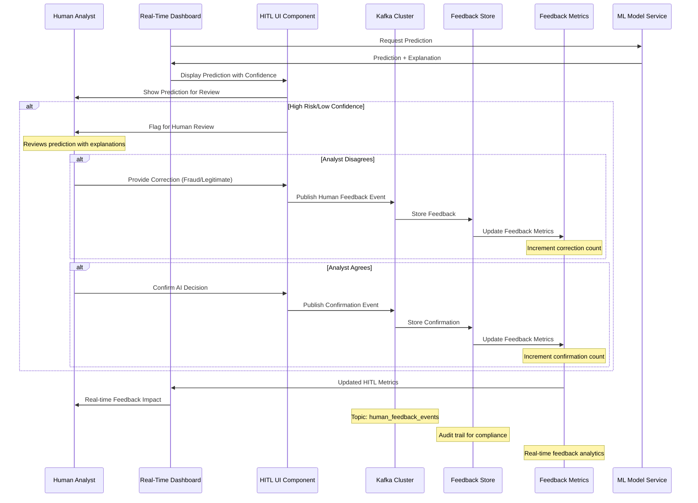
```mermaid
sequenceDiagram
    participant Analyst as Human Analyst
    participant Dashboard as Real-Time Dashboard
    participant UI as HITL UI Component
    participant Kafka as Kafka Cluster
    participant Feedback as Feedback Store
    participant Metrics as Feedback Metrics
    participant Model as ML Model Service

    Dashboard->>Model: Request Prediction
    Model->>Dashboard: Prediction + Explanation
    Dashboard->>UI: Display Prediction with Confidence
    UI->>Analyst: Show Prediction for Review
    
    alt High Risk/Low Confidence
        UI->>Analyst: Flag for Human Review
        Note over Analyst: Reviews prediction with explanations
        
        alt Analyst Disagrees
            Analyst->>UI: Provide Correction (Fraud/Legitimate)
            UI->>Kafka: Publish Human Feedback Event
            Kafka->>Feedback: Store Feedback
            Feedback->>Metrics: Update Feedback Metrics
            Note over Metrics: Increment correction count
        end
        
        alt Analyst Agrees
            Analyst->>UI: Confirm AI Decision
            UI->>Kafka: Publish Confirmation Event
            Kafka->>Feedback: Store Confirmation
            Feedback->>Metrics: Update Feedback Metrics
            Note over Metrics: Increment confirmation count
        end
    end
    
    Metrics->>Dashboard: Updated HITL Metrics
    Dashboard->>Analyst: Real-time Feedback Impact
    
    Note over Kafka: Topic: human_feedback_events
    Note over Feedback: Audit trail for compliance
    Note over Metrics: Real-time feedback analytics
```

## Self-Reinforcement Learning (SRL) Pipeline Sequence

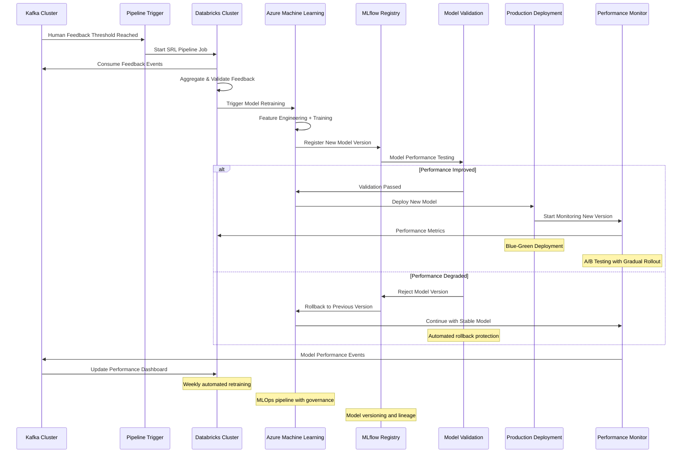
```mermaid
sequenceDiagram
    participant Kafka as Kafka Cluster
    participant Trigger as Pipeline Trigger
    participant Databricks as Databricks Cluster
    participant AzureML as Azure Machine Learning
    participant MLflow as MLflow Registry
    participant Validation as Model Validation
    participant Deployment as Production Deployment
    participant Monitor as Performance Monitor

    Kafka->>Trigger: Human Feedback Threshold Reached
    Trigger->>Databricks: Start SRL Pipeline Job
    
    Databricks->>Kafka: Consume Feedback Events
    Databricks->>Databricks: Aggregate & Validate Feedback
    Databricks->>AzureML: Trigger Model Retraining
    
    AzureML->>AzureML: Feature Engineering + Training
    AzureML->>MLflow: Register New Model Version
    MLflow->>Validation: Model Performance Testing
    
    alt Performance Improved
        Validation->>AzureML: Validation Passed
        AzureML->>Deployment: Deploy New Model
        Deployment->>Monitor: Start Monitoring New Version
        Monitor->>Databricks: Performance Metrics
        
        Note over Deployment: Blue-Green Deployment
        Note over Monitor: A/B Testing with Gradual Rollout
    else Performance Degraded
        Validation->>MLflow: Reject Model Version
        MLflow->>AzureML: Rollback to Previous Version
        AzureML->>Monitor: Continue with Stable Model
        
        Note over Validation: Automated rollback protection
    end
    
    Monitor->>Kafka: Model Performance Events
    Kafka->>Databricks: Update Performance Dashboard
    
    Note over Databricks: Weekly automated retraining
    Note over AzureML: MLOps pipeline with governance
    Note over MLflow: Model versioning and lineage
```

## Azure AI Foundry Integration Sequence

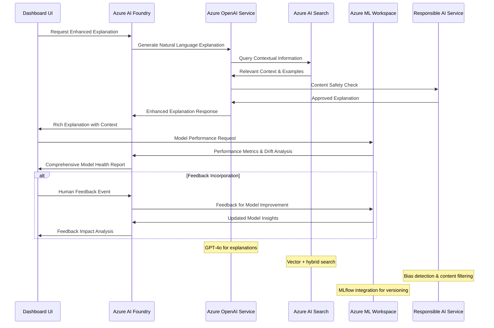
```mermaid
sequenceDiagram
    participant UI as Dashboard UI
    participant Foundry as Azure AI Foundry
    participant OpenAI as Azure OpenAI Service
    participant Search as Azure AI Search
    participant ML as Azure ML Workspace
    participant Responsible as Responsible AI Service

    UI->>Foundry: Request Enhanced Explanation
    Foundry->>OpenAI: Generate Natural Language Explanation
    OpenAI->>Search: Query Contextual Information
    Search->>OpenAI: Relevant Context & Examples
    OpenAI->>Responsible: Content Safety Check
    Responsible->>OpenAI: Approved Explanation
    OpenAI->>Foundry: Enhanced Explanation Response
    Foundry->>UI: Rich Explanation with Context
    
    UI->>ML: Model Performance Request
    ML->>Foundry: Performance Metrics & Drift Analysis
    Foundry->>UI: Comprehensive Model Health Report
    
    alt Feedback Incorporation
        UI->>Foundry: Human Feedback Event
        Foundry->>ML: Feedback for Model Improvement
        ML->>Foundry: Updated Model Insights
        Foundry->>UI: Feedback Impact Analysis
    end
    
    Note over OpenAI: GPT-4o for explanations
    Note over Search: Vector + hybrid search
    Note over Responsible: Bias detection & content filtering
    Note over ML: MLflow integration for versioning
```

## End-to-End HITL+SRL+XAI Workflow

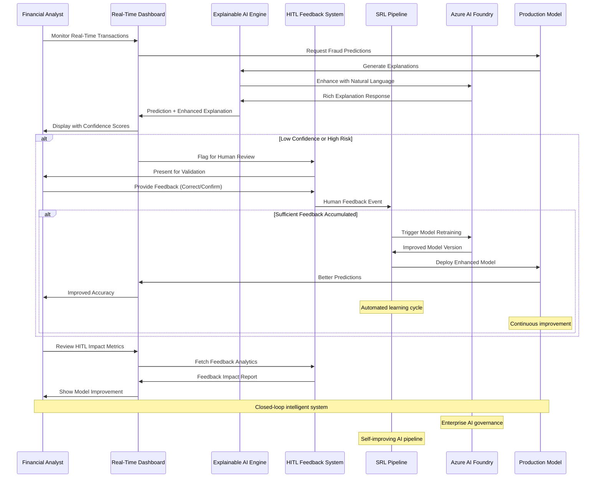
```mermaid
sequenceDiagram
    participant User as Financial Analyst
    participant Dashboard as Real-Time Dashboard
    participant XAI as Explainable AI Engine
    participant HITL as HITL Feedback System
    participant SRL as SRL Pipeline
    participant Azure as Azure AI Foundry
    participant Production as Production Model

    User->>Dashboard: Monitor Real-Time Transactions
    Dashboard->>Production: Request Fraud Predictions
    Production->>XAI: Generate Explanations
    XAI->>Azure: Enhance with Natural Language
    Azure->>XAI: Rich Explanation Response
    XAI->>Dashboard: Prediction + Enhanced Explanation
    Dashboard->>User: Display with Confidence Scores
    
    alt Low Confidence or High Risk
        Dashboard->>HITL: Flag for Human Review
        HITL->>User: Present for Validation
        User->>HITL: Provide Feedback (Correct/Confirm)
        HITL->>SRL: Human Feedback Event
        
        alt Sufficient Feedback Accumulated
            SRL->>Azure: Trigger Model Retraining
            Azure->>SRL: Improved Model Version
            SRL->>Production: Deploy Enhanced Model
            Production->>Dashboard: Better Predictions
            Dashboard->>User: Improved Accuracy
            
            Note over SRL: Automated learning cycle
            Note over Production: Continuous improvement
        end
    end
    
    User->>Dashboard: Review HITL Impact Metrics
    Dashboard->>HITL: Fetch Feedback Analytics
    HITL->>Dashboard: Feedback Impact Report
    Dashboard->>User: Show Model Improvement
    
    Note over User,Production: Closed-loop intelligent system
    Note over Azure: Enterprise AI governance
    Note over SRL: Self-improving AI pipeline
```

## Performance Monitoring & Feedback Loop

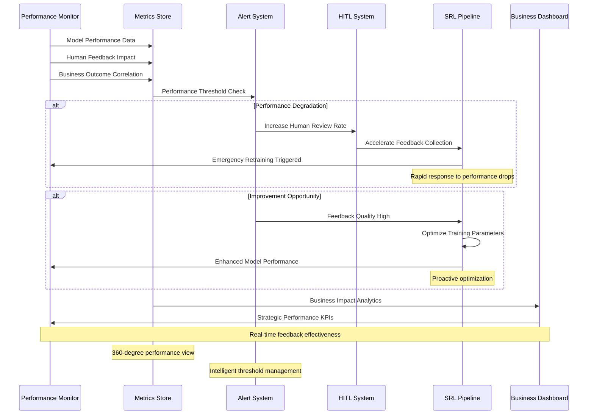
```mermaid
sequenceDiagram
    participant Monitor as Performance Monitor
    participant Metrics as Metrics Store
    participant Alerts as Alert System
    participant HITL as HITL System
    participant SRL as SRL Pipeline
    participant Dashboard as Business Dashboard

    Monitor->>Metrics: Model Performance Data
    Monitor->>Metrics: Human Feedback Impact
    Monitor->>Metrics: Business Outcome Correlation
    
    Metrics->>Alerts: Performance Threshold Check
    
    alt Performance Degradation
        Alerts->>HITL: Increase Human Review Rate
        HITL->>SRL: Accelerate Feedback Collection
        SRL->>Monitor: Emergency Retraining Triggered
        
        Note over SRL: Rapid response to performance drops
    end
    
    alt Improvement Opportunity
        Alerts->>SRL: Feedback Quality High
        SRL->>SRL: Optimize Training Parameters
        SRL->>Monitor: Enhanced Model Performance
        
        Note over SRL: Proactive optimization
    end
    
    Metrics->>Dashboard: Business Impact Analytics
    Dashboard->>Monitor: Strategic Performance KPIs
    
    Note over Monitor,Dashboard: Real-time feedback effectiveness
    Note over Metrics: 360-degree performance view
    Note over Alerts: Intelligent threshold management

```
