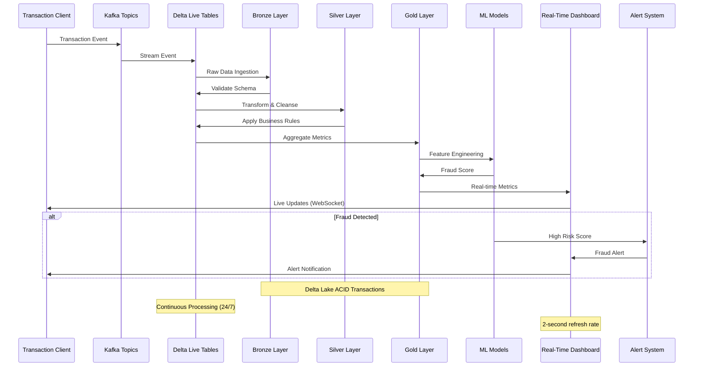
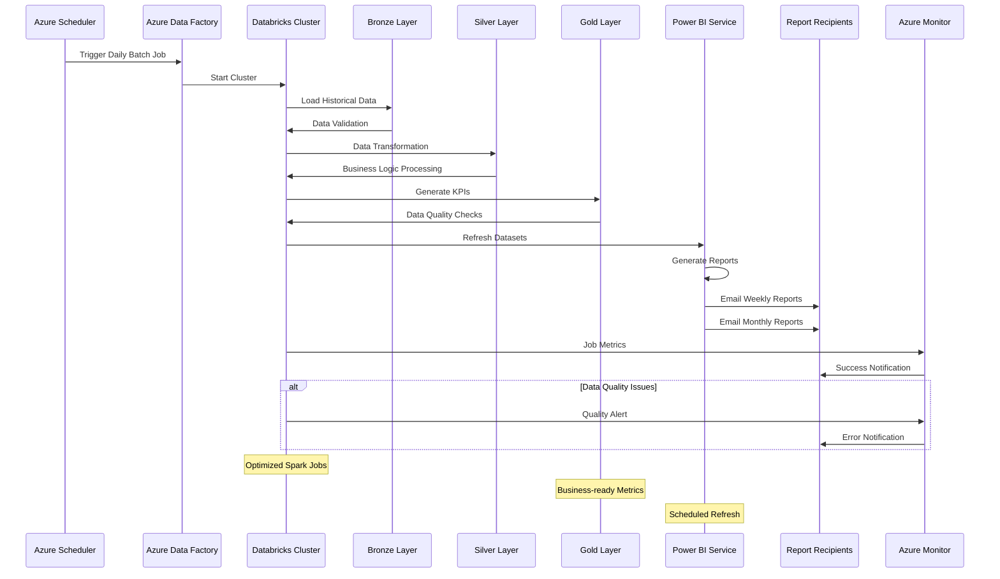
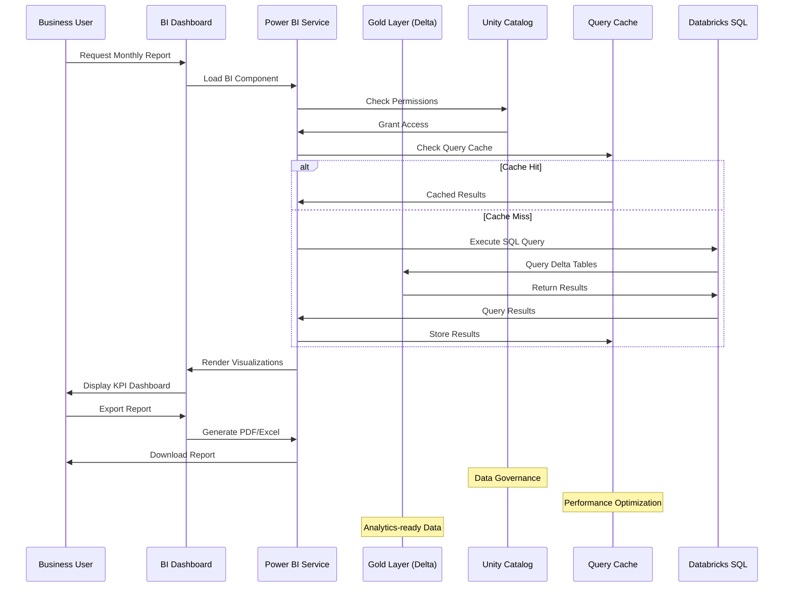
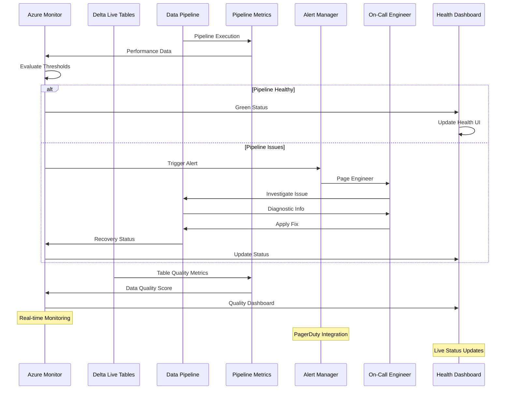
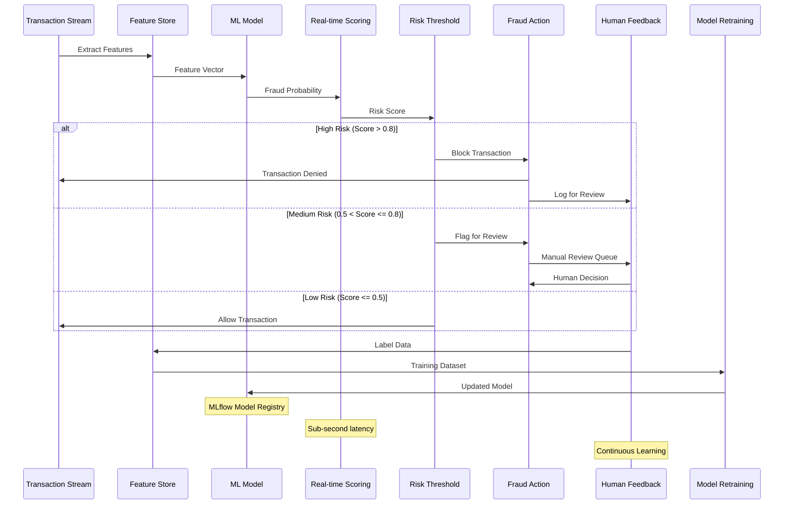
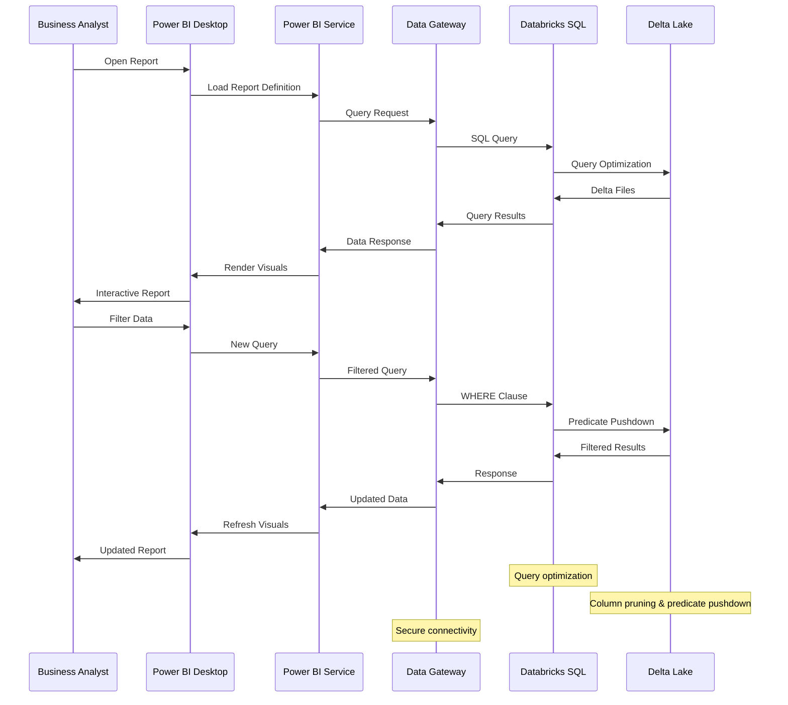
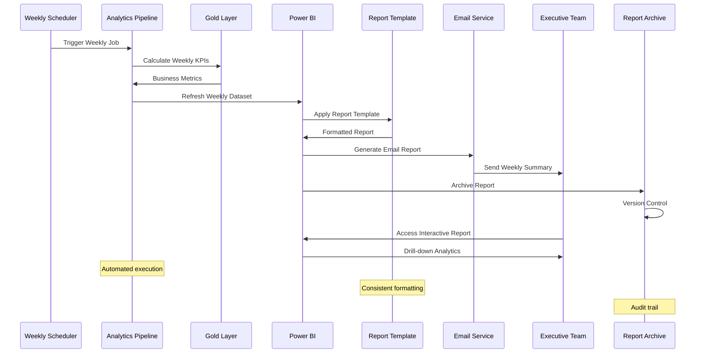
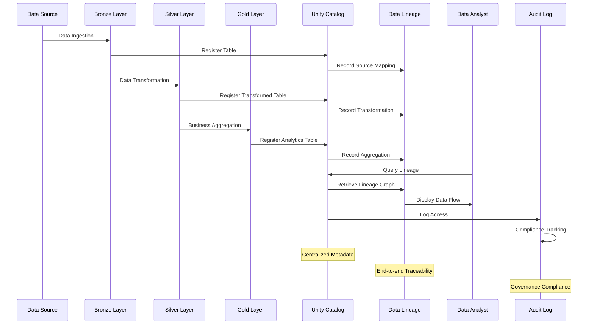

# Analytics Sequence Diagrams

## Real-Time Streaming Analytics Sequence

## Batch Processing Analytics Sequence

## Business Intelligence Report Generation Sequence

## Data Pipeline Health Monitoring Sequence

## Fraud Detection ML Pipeline Sequence

## Power BI DirectQuery Sequence

## Weekly Business Review Sequence

## Data Lineage Tracking Sequence

## Key Sequence Characteristics

### Real-Time Processing
- **Latency**: Sub-second to 2-second processing
- **Throughput**: 10,000+ events per second  
- **Scalability**: Auto-scaling based on load
- **Reliability**: Checkpointing and exactly-once semantics

### Batch Processing
- **Schedule**: Daily, weekly, monthly cadence
- **Volume**: Petabyte-scale data processing
- **Optimization**: Spark optimization and caching
- **Monitoring**: Comprehensive job monitoring

### Business Intelligence
- **Interactivity**: Real-time dashboard updates
- **Performance**: Query caching and optimization
- **Security**: Role-based access control
- **Governance**: Data lineage and audit trails

### Machine Learning
- **Training**: Automated model retraining
- **Serving**: Real-time model inference
- **Monitoring**: Model performance tracking
- **Feedback**: Continuous learning loop

### Data Quality
- **Validation**: Schema and data quality checks
- **Monitoring**: Continuous quality monitoring
- **Alerting**: Automated quality alerts
- **Remediation**: Data quality improvement workflows