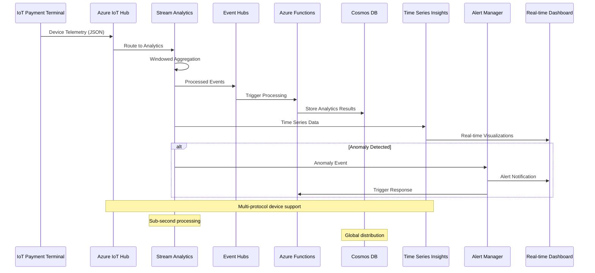
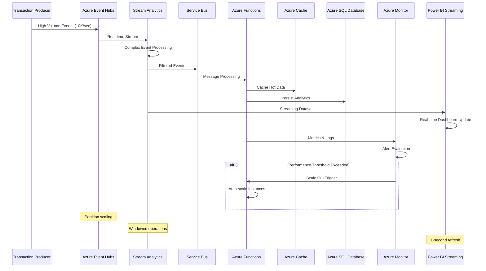
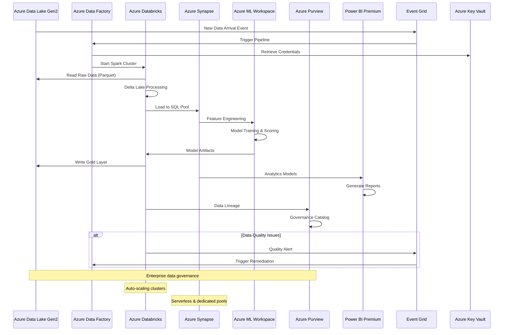
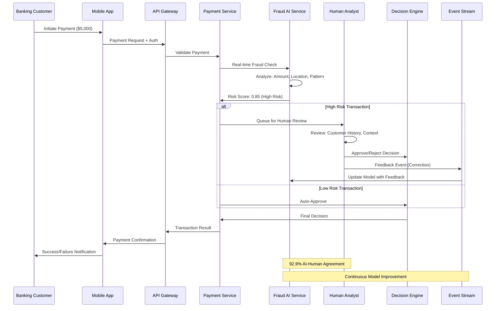
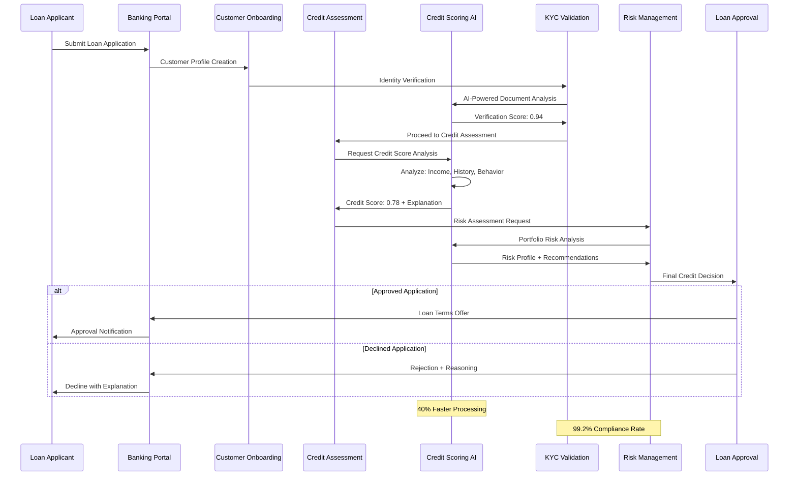
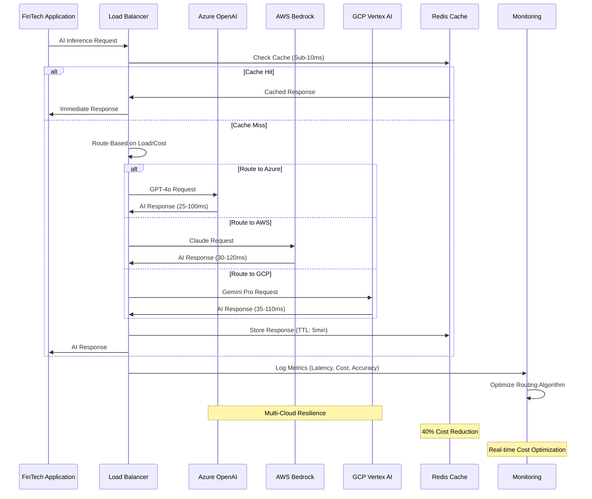
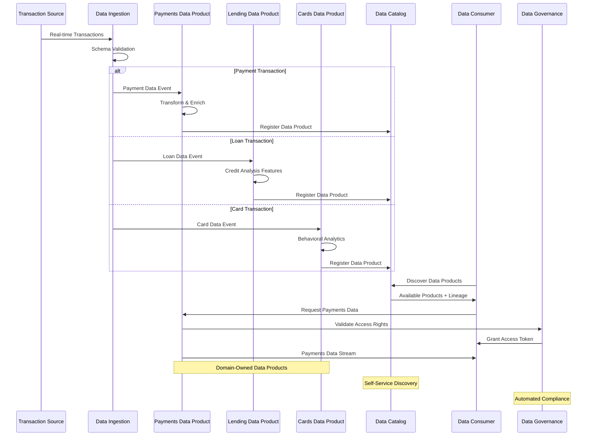

# Analytics Sequence Diagrams

This document contains comprehensive sequence diagrams for the FinTech AI Platform's analytics workflows, demonstrating real-time and batch processing patterns following Microsoft Azure architecture styles and Well-Architected Framework principles.

## Azure Architecture Integration

Our analytics workflows implement Microsoft Azure's recommended patterns for:
- **Event-Driven Architecture**: Real-time data processing with Azure Event Hubs and Stream Analytics
- **Big Data Architecture**: Scalable batch processing with Azure Databricks and Synapse Analytics  
- **Microservices Architecture**: Decoupled analytics services with API Gateway and service mesh
- **IoT Architecture**: Device data ingestion and processing with Azure IoT Hub and Time Series Insights

## Azure IoT Data Ingestion Sequence



## Azure Event Streaming Architecture



## Azure Big Data Analytics Workflow



## FinTech Payment Fraud Detection Workflow



## BIAN-Aligned Loan Origination with AI Credit Scoring



## Cloud-Agnostic AI Inference Pattern



## Data Mesh Workflow for Financial Data Products



## Analytics Sequence Diagrams

## Real-Time Streaming Analytics Sequence


## Batch Processing Analytics Sequence


## Business Intelligence Report Generation Sequence


## Data Pipeline Health Monitoring Sequence


## Fraud Detection ML Pipeline Sequence


## Power BI DirectQuery Sequence


## Weekly Business Review Sequence


## Data Lineage Tracking Sequence


## XAI Real-Time Inference & Explanation Sequence


## XAI Strategic Validation & Feedback Sequence


## XAI Model Drift Detection & Response Sequence


## XAI Business Impact Measurement Sequence


## XAI Regulatory Compliance & Audit Sequence


## Key Sequence Characteristics

### Real-Time Processing
- **Latency**: Sub-second to 2-second processing
- **Throughput**: 10,000+ events per second  
- **Scalability**: Auto-scaling based on load
- **Reliability**: Checkpointing and exactly-once semantics

### Batch Processing
- **Schedule**: Daily, weekly, monthly cadence
- **Volume**: Petabyte-scale data processing
- **Optimization**: Spark optimization and caching
- **Monitoring**: Comprehensive job monitoring

### Business Intelligence
- **Interactivity**: Real-time dashboard updates
- **Performance**: Query caching and optimization
- **Security**: Role-based access control
- **Governance**: Data lineage and audit trails

### Machine Learning
- **Training**: Automated model retraining
- **Serving**: Real-time model inference
- **Monitoring**: Model performance tracking
- **Feedback**: Continuous learning loop

### Data Quality
- **Validation**: Schema and data quality checks
- **Monitoring**: Continuous quality monitoring
- **Alerting**: Automated quality alerts
- **Remediation**: Data quality improvement workflows

### Explainable AI (XAI)

- **Real-Time Explanations**: Sub-second feature importance and confidence scoring
- **Strategic Validation**: Daily business objective alignment checks
- **Drift Detection**: Continuous statistical monitoring with automated responses
- **Business Impact**: Monthly ROI calculation and causal analysis
- **Regulatory Compliance**: Complete audit trails with explainable evidence
- **Stakeholder Transparency**: Role-based explanation interfaces for operations and executives
- **Feedback Integration**: Automated model improvement based on explanation insights
- **Performance Correlation**: Real-time correlation between AI decisions and business outcomes

## Human-in-the-Loop (HITL) Feedback Sequence

```mermaid
sequenceDiagram
    participant Analyst as Human Analyst
    participant Dashboard as Real-Time Dashboard
    participant UI as HITL UI Component
    participant Kafka as Kafka Cluster
    participant Feedback as Feedback Store
    participant Metrics as Feedback Metrics
    participant Model as ML Model Service

    Dashboard->>Model: Request Prediction
    Model->>Dashboard: Prediction + Explanation
    Dashboard->>UI: Display Prediction with Confidence
    UI->>Analyst: Show Prediction for Review
    
    alt High Risk/Low Confidence
        UI->>Analyst: Flag for Human Review
        Note over Analyst: Reviews prediction with explanations
        
        alt Analyst Disagrees
            Analyst->>UI: Provide Correction (Fraud/Legitimate)
            UI->>Kafka: Publish Human Feedback Event
            Kafka->>Feedback: Store Feedback
            Feedback->>Metrics: Update Feedback Metrics
            Note over Metrics: Increment correction count
        end
        
        alt Analyst Agrees
            Analyst->>UI: Confirm AI Decision
            UI->>Kafka: Publish Confirmation Event
            Kafka->>Feedback: Store Confirmation
            Feedback->>Metrics: Update Feedback Metrics
            Note over Metrics: Increment confirmation count
        end
    end
    
    Metrics->>Dashboard: Updated HITL Metrics
    Dashboard->>Analyst: Real-time Feedback Impact
    
    Note over Kafka: Topic: human_feedback_events
    Note over Feedback: Audit trail for compliance
    Note over Metrics: Real-time feedback analytics
```

## Self-Reinforcement Learning (SRL) Pipeline Sequence

```mermaid
sequenceDiagram
    participant Kafka as Kafka Cluster
    participant Trigger as Pipeline Trigger
    participant Databricks as Databricks Cluster
    participant AzureML as Azure Machine Learning
    participant MLflow as MLflow Registry
    participant Validation as Model Validation
    participant Deployment as Production Deployment
    participant Monitor as Performance Monitor

    Kafka->>Trigger: Human Feedback Threshold Reached
    Trigger->>Databricks: Start SRL Pipeline Job
    
    Databricks->>Kafka: Consume Feedback Events
    Databricks->>Databricks: Aggregate & Validate Feedback
    Databricks->>AzureML: Trigger Model Retraining
    
    AzureML->>AzureML: Feature Engineering + Training
    AzureML->>MLflow: Register New Model Version
    MLflow->>Validation: Model Performance Testing
    
    alt Performance Improved
        Validation->>AzureML: Validation Passed
        AzureML->>Deployment: Deploy New Model
        Deployment->>Monitor: Start Monitoring New Version
        Monitor->>Databricks: Performance Metrics
        
        Note over Deployment: Blue-Green Deployment
        Note over Monitor: A/B Testing with Gradual Rollout
    else Performance Degraded
        Validation->>MLflow: Reject Model Version
        MLflow->>AzureML: Rollback to Previous Version
        AzureML->>Monitor: Continue with Stable Model
        
        Note over Validation: Automated rollback protection
    end
    
    Monitor->>Kafka: Model Performance Events
    Kafka->>Databricks: Update Performance Dashboard
    
    Note over Databricks: Weekly automated retraining
    Note over AzureML: MLOps pipeline with governance
    Note over MLflow: Model versioning and lineage
```

## Azure AI Foundry Integration Sequence

```mermaid
sequenceDiagram
    participant UI as Dashboard UI
    participant Foundry as Azure AI Foundry
    participant OpenAI as Azure OpenAI Service
    participant Search as Azure AI Search
    participant ML as Azure ML Workspace
    participant Responsible as Responsible AI Service

    UI->>Foundry: Request Enhanced Explanation
    Foundry->>OpenAI: Generate Natural Language Explanation
    OpenAI->>Search: Query Contextual Information
    Search->>OpenAI: Relevant Context & Examples
    OpenAI->>Responsible: Content Safety Check
    Responsible->>OpenAI: Approved Explanation
    OpenAI->>Foundry: Enhanced Explanation Response
    Foundry->>UI: Rich Explanation with Context
    
    UI->>ML: Model Performance Request
    ML->>Foundry: Performance Metrics & Drift Analysis
    Foundry->>UI: Comprehensive Model Health Report
    
    alt Feedback Incorporation
        UI->>Foundry: Human Feedback Event
        Foundry->>ML: Feedback for Model Improvement
        ML->>Foundry: Updated Model Insights
        Foundry->>UI: Feedback Impact Analysis
    end
    
    Note over OpenAI: GPT-4o for explanations
    Note over Search: Vector + hybrid search
    Note over Responsible: Bias detection & content filtering
    Note over ML: MLflow integration for versioning
```

## End-to-End HITL+SRL+XAI Workflow

```mermaid
sequenceDiagram
    participant User as Financial Analyst
    participant Dashboard as Real-Time Dashboard
    participant XAI as Explainable AI Engine
    participant HITL as HITL Feedback System
    participant SRL as SRL Pipeline
    participant Azure as Azure AI Foundry
    participant Production as Production Model

    User->>Dashboard: Monitor Real-Time Transactions
    Dashboard->>Production: Request Fraud Predictions
    Production->>XAI: Generate Explanations
    XAI->>Azure: Enhance with Natural Language
    Azure->>XAI: Rich Explanation Response
    XAI->>Dashboard: Prediction + Enhanced Explanation
    Dashboard->>User: Display with Confidence Scores
    
    alt Low Confidence or High Risk
        Dashboard->>HITL: Flag for Human Review
        HITL->>User: Present for Validation
        User->>HITL: Provide Feedback (Correct/Confirm)
        HITL->>SRL: Human Feedback Event
        
        alt Sufficient Feedback Accumulated
            SRL->>Azure: Trigger Model Retraining
            Azure->>SRL: Improved Model Version
            SRL->>Production: Deploy Enhanced Model
            Production->>Dashboard: Better Predictions
            Dashboard->>User: Improved Accuracy
            
            Note over SRL: Automated learning cycle
            Note over Production: Continuous improvement
        end
    end
    
    User->>Dashboard: Review HITL Impact Metrics
    Dashboard->>HITL: Fetch Feedback Analytics
    HITL->>Dashboard: Feedback Impact Report
    Dashboard->>User: Show Model Improvement
    
    Note over User,Production: Closed-loop intelligent system
    Note over Azure: Enterprise AI governance
    Note over SRL: Self-improving AI pipeline
```

## Azure Kubernetes Service (AKS) Analytics Microservices

```mermaid
sequenceDiagram
    participant Gateway as Azure API Gateway
    participant AKS as AKS Cluster
    participant Analytics as Analytics Service
    participant Cache as Azure Redis Cache
    participant Database as Azure SQL Database
    participant ServiceMesh as Istio Service Mesh
    participant Monitor as Azure Monitor
    participant AAD as Azure Active Directory

    Gateway->>AAD: Authentication Request
    AAD->>Gateway: JWT Token
    Gateway->>ServiceMesh: Authenticated Request
    
    ServiceMesh->>Analytics: Route to Analytics Pod
    Analytics->>Cache: Check Cache (Redis)
    
    alt Cache Hit
        Cache->>Analytics: Return Cached Result
    else Cache Miss
        Analytics->>Database: Query Analytics Data
        Database->>Analytics: Return Query Results
        Analytics->>Cache: Store in Cache
    end
    
    Analytics->>ServiceMesh: Analytics Response
    ServiceMesh->>Gateway: Service Response
    Gateway->>Gateway: Response Processing
    
    AKS->>Monitor: Pod Metrics
    Analytics->>Monitor: Application Metrics
    Monitor->>Monitor: Alerting Rules
    
    alt Performance Issue
        Monitor->>AKS: Scale Trigger
        AKS->>AKS: Horizontal Pod Autoscaler
    end
    
    Note over AKS: Multi-zone deployment
    Note over ServiceMesh: Circuit breaker pattern
    Note over Monitor: Application Insights integration
```

## Azure Synapse Serverless Analytics Pipeline

```mermaid
sequenceDiagram
    participant Client as Analytics Client
    participant Synapse as Azure Synapse Workspace
    participant Serverless as Serverless SQL Pool
    participant DataLake as Azure Data Lake
    participant PowerBI as Power BI Service
    participant Purview as Azure Purview
    participant Monitor as Azure Monitor
    participant Security as Azure Security Center

    Client->>Synapse: Analytics Query Request
    Synapse->>Serverless: Route to Serverless Pool
    Serverless->>DataLake: Query Data Lake (Parquet)
    
    DataLake->>Purview: Data Access Audit
    Purview->>Security: Compliance Check
    Security->>Serverless: Access Approved
    
    Serverless->>Serverless: Query Optimization
    Serverless->>DataLake: Parallel Data Read
    DataLake->>Serverless: Query Results
    
    Serverless->>PowerBI: Analytics Dataset
    PowerBI->>PowerBI: Report Generation
    PowerBI->>Client: Interactive Dashboard
    
    Serverless->>Monitor: Query Performance
    Monitor->>Monitor: Cost Analysis
    
    alt Query Optimization Needed
        Monitor->>Synapse: Performance Alert
        Synapse->>Serverless: Query Tuning
    end
    
    Note over Serverless: Pay-per-query model
    Note over DataLake: Columnar storage optimization
    Note over Purview: Data governance automation
```

## Azure DevOps MLOps Pipeline

```mermaid
sequenceDiagram
    participant Developer as ML Engineer
    participant ADO as Azure DevOps
    participant ACR as Azure Container Registry
    participant AKS as AKS ML Cluster
    participant MLWorkspace as Azure ML Workspace
    participant Monitor as Application Insights
    participant KeyVault as Azure Key Vault
    participant Artifacts as Azure Artifacts

    Developer->>ADO: Commit ML Model Code
    ADO->>ADO: Trigger CI/CD Pipeline
    ADO->>KeyVault: Retrieve ML Secrets
    
    ADO->>MLWorkspace: Train Model
    MLWorkspace->>MLWorkspace: Model Validation
    MLWorkspace->>Artifacts: Store Model Artifacts
    
    ADO->>ACR: Build Model Container
    ACR->>ACR: Security Scanning
    ACR->>AKS: Deploy to Staging
    
    AKS->>Monitor: Model Performance Tests
    Monitor->>ADO: Test Results
    
    alt Tests Pass
        ADO->>AKS: Deploy to Production
        AKS->>Monitor: Production Monitoring
        Monitor->>Developer: Deployment Success
    else Tests Fail
        ADO->>Developer: Pipeline Failure Alert
    end
    
    Monitor->>MLWorkspace: Model Drift Detection
    MLWorkspace->>ADO: Retrain Trigger
    
    Note over ADO: GitOps workflow
    Note over MLWorkspace: Automated model management
    Note over Monitor: ML model observability
```

## Performance Monitoring & Feedback Loop

```mermaid
sequenceDiagram
    participant Monitor as Performance Monitor
    participant Metrics as Metrics Store
    participant Alerts as Alert System
    participant HITL as HITL System
    participant SRL as SRL Pipeline
    participant Dashboard as Business Dashboard

    Monitor->>Metrics: Model Performance Data
    Monitor->>Metrics: Human Feedback Impact
    Monitor->>Metrics: Business Outcome Correlation
    
    Metrics->>Alerts: Performance Threshold Check
    
    alt Performance Degradation
        Alerts->>HITL: Increase Human Review Rate
        HITL->>SRL: Accelerate Feedback Collection
        SRL->>Monitor: Emergency Retraining Triggered
        
        Note over SRL: Rapid response to performance drops
    end
    
    alt Improvement Opportunity
        Alerts->>SRL: Feedback Quality High
        SRL->>SRL: Optimize Training Parameters
        SRL->>Monitor: Enhanced Model Performance
        
        Note over SRL: Proactive optimization
    end
    
    Metrics->>Dashboard: Business Impact Analytics
    Dashboard->>Monitor: Strategic Performance KPIs
    
    Note over Monitor,Dashboard: Real-time feedback effectiveness
    Note over Metrics: 360-degree performance view
    Note over Alerts: Intelligent threshold management
```

## Azure Well-Architected Framework Compliance

### Key Azure Services Integration

- **Reliability**: Multi-region AKS deployment with Azure Traffic Manager
- **Security**: Azure AD integration with Key Vault secrets management  
- **Cost Optimization**: Serverless SQL pools with auto-scaling AKS clusters
- **Performance**: Azure Redis Cache with Application Insights monitoring
- **Operational Excellence**: Azure DevOps MLOps with automated testing

### Enterprise Analytics Patterns

- **Circuit Breaker**: Istio service mesh resilience patterns
- **Bulkhead**: Isolated resource pools for different workloads
- **Event Sourcing**: Azure Event Hubs with Stream Analytics processing
- **CQRS**: Separate read/write models with Cosmos DB and Azure SQL

This comprehensive sequence diagram collection demonstrates Microsoft Azure's recommended architecture patterns for enterprise FinTech analytics, ensuring scalability, security, and operational excellence.
