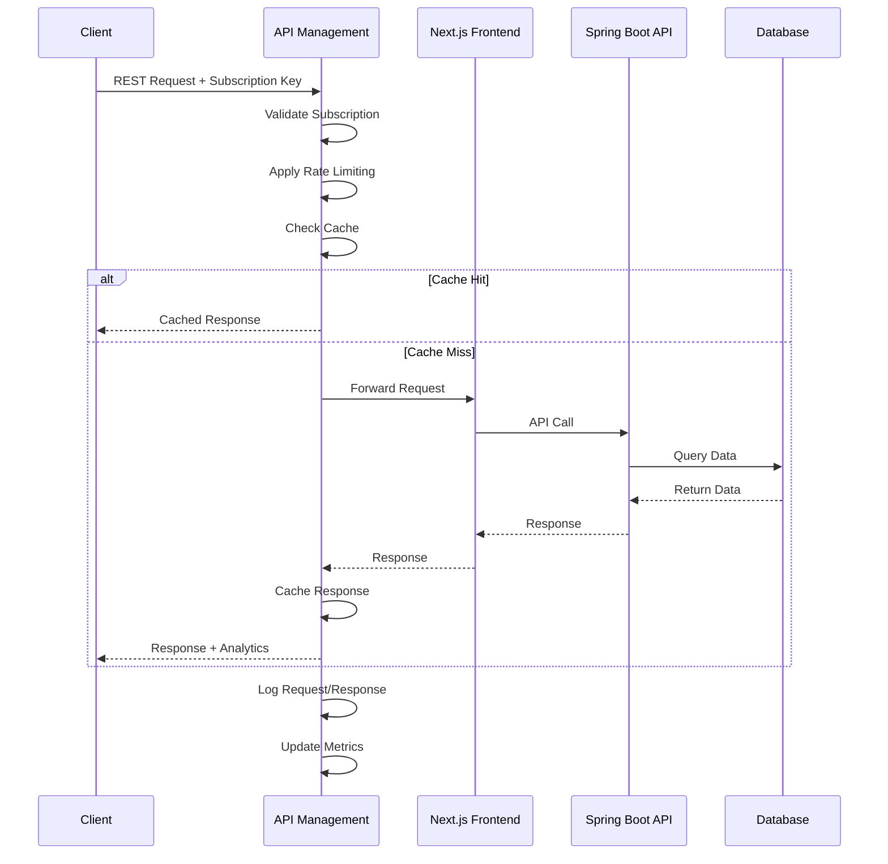
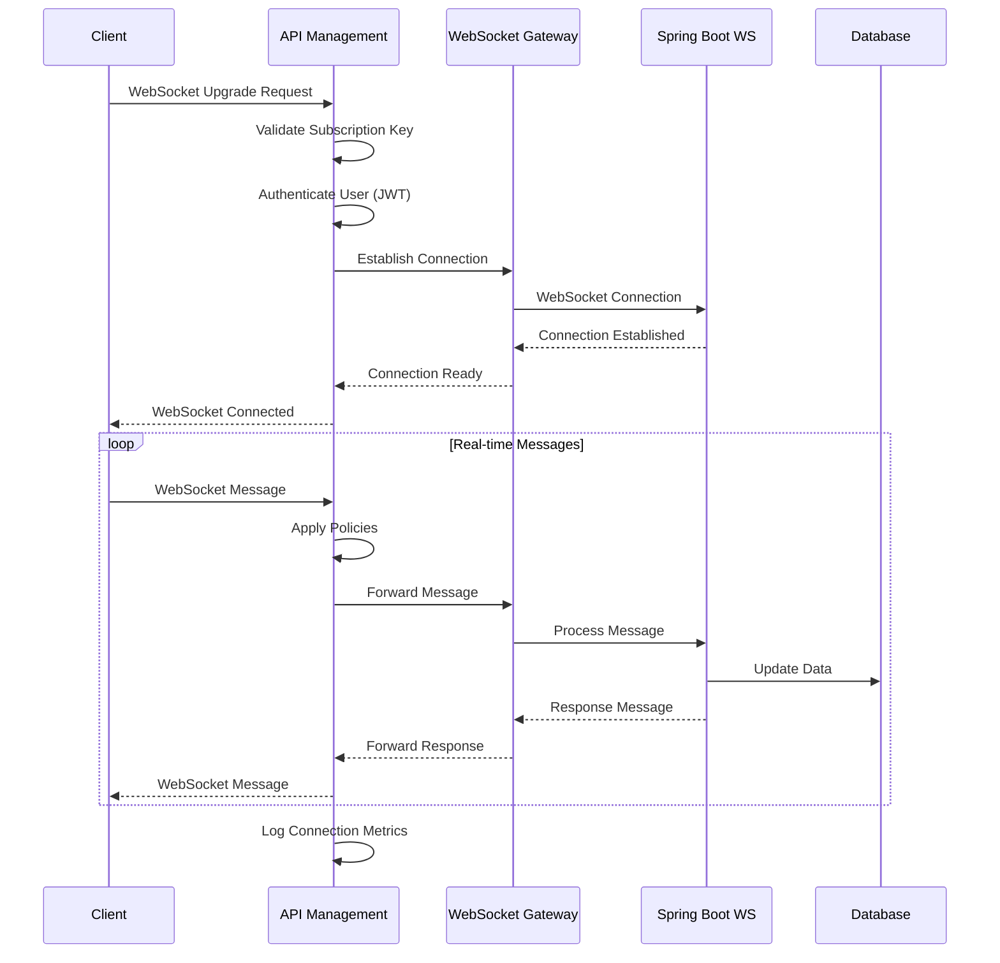
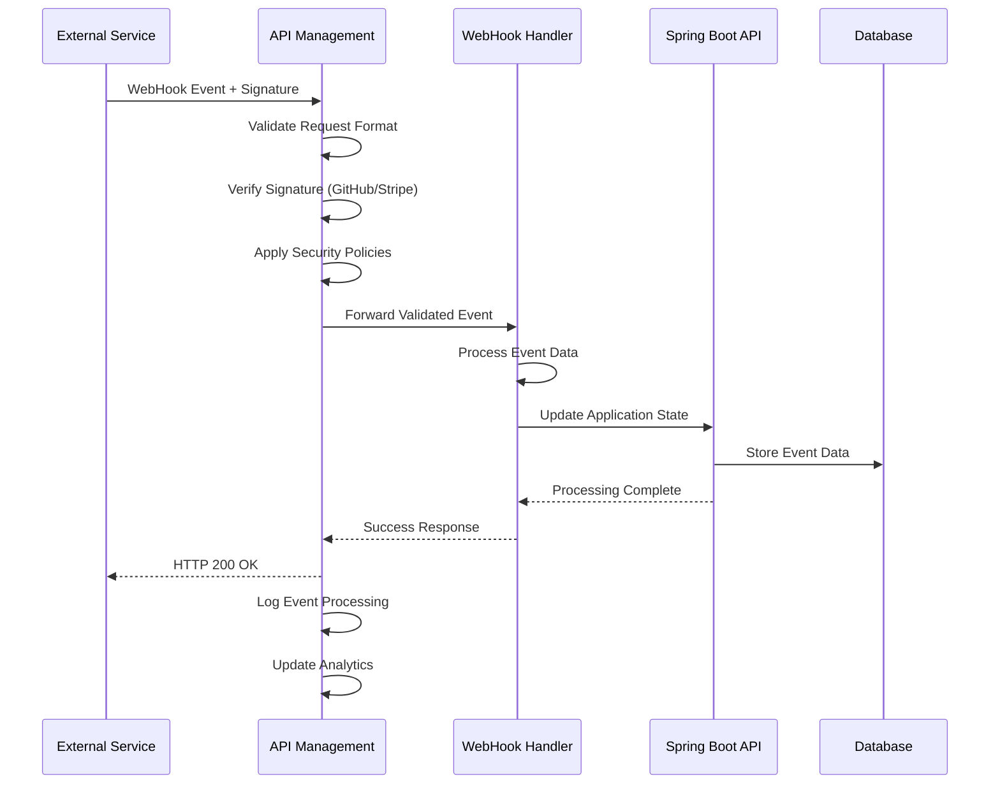
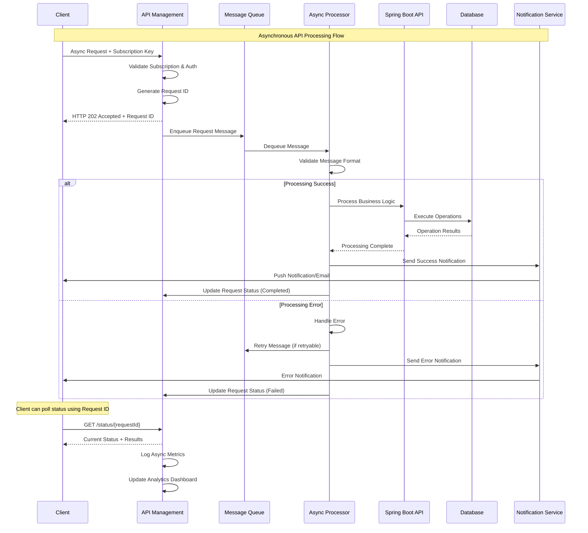
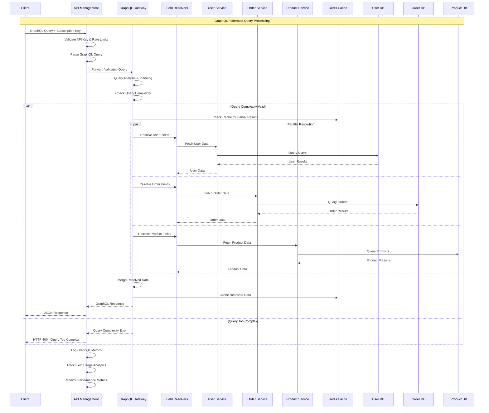
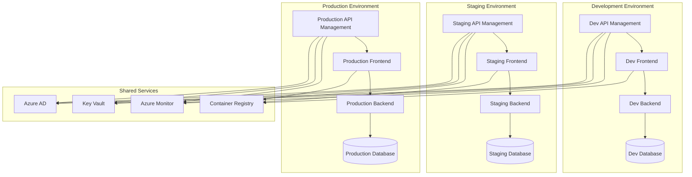

# Azure API Management Gateway Architecture

## 🏗️ System Architecture Overview

```mermaid
graph TB
    subgraph CLIENT_APPS ["📱 Client Applications"]
        Web[🌐 Web Browser]
        Mobile[📱 Mobile App]
        Desktop[🖥️ Desktop App]
    end

    subgraph EXTERNAL_APIM ["🌍 Azure API Management Gateway"]
        APIM[🚪 API Management Gateway]
        DevPortal[👥 Developer Portal]
        Analytics[📊 Analytics & Monitoring]
    end

    subgraph FRONTEND_LAYER ["🎨 Frontend Layer"]
        NextJS[⚛️ Next.js Frontend]
        WSClient[🔌 WebSocket Client]
        WebhookClient[🪝 WebHook Client]
        RestClient[🔄 REST Client]
        AsyncClient[⏳ Async API Client]
        GraphQLClient[🔍 GraphQL Client]
    end

    subgraph INTERNAL_GATEWAY ["🏢 Internal API Management Gateway"]
        InternalAPIM[🔐 Internal API Gateway]
        LoadBalancer[⚖️ Load Balancer]
        RateLimit[⏱️ Rate Limiter]
        AuthProxy[🔑 Auth Proxy]
    end

    subgraph BACKEND_SERVICES ["⚙️ Backend Services"]
        subgraph CORE_APIS ["Core APIs"]
            SpringBoot[☕ Spring Boot API]
            WebSocketServer[🔌 WebSocket Server]
            WebhookHandler[🪝 WebHook Handler]
        end
        
        subgraph MODERN_APIS ["Modern APIs"]
            AsyncProcessor[⏳ Async Processor]
            GraphQLGateway[🔍 GraphQL Gateway]
            MessageQueue[📬 Message Queue]
        end
        
        subgraph RESOLVERS ["GraphQL Resolvers"]
            UserResolver[👤 User Resolver]
            OrderResolver[📦 Order Resolver]
            ProductResolver[🛍️ Product Resolver]
        end
    end

    subgraph DATA_LAYER ["💾 Data Layer"]
        Database[(🗄️ Azure SQL Database)]
        Cache[(⚡ Redis Cache)]
        UserDB[(👤 User Database)]
        OrderDB[(📦 Order Database)]
        ProductDB[(🛍️ Product Database)]
    end

    subgraph AZURE_SERVICES ["☁️ Azure Services"]
        AAD[🔐 Azure Active Directory]
        KeyVault[🔑 Key Vault]
        AppInsights[📊 Application Insights]
        Monitor[📈 Azure Monitor]
        ServiceBus[🚌 Azure Service Bus]
        EventGrid[⚡ Azure Event Grid]
    end

    %% Client to External Gateway
    Web --> APIM
    Mobile --> APIM
    Desktop --> APIM

    %% External Gateway to Frontend
    APIM --> NextJS
    APIM --> WSClient
    APIM --> WebhookClient
    APIM --> RestClient
    APIM --> AsyncClient
    APIM --> GraphQLClient

    %% Frontend to Internal Gateway
    NextJS --> InternalAPIM
    WSClient --> InternalAPIM
    WebhookClient --> InternalAPIM
    RestClient --> InternalAPIM
    AsyncClient --> InternalAPIM
    GraphQLClient --> InternalAPIM

    %% Internal Gateway Components
    InternalAPIM --> LoadBalancer
    InternalAPIM --> RateLimit
    InternalAPIM --> AuthProxy

    %% Internal Gateway to Backend Services
    LoadBalancer --> SpringBoot
    LoadBalancer --> WebSocketServer
    LoadBalancer --> WebhookHandler
    LoadBalancer --> AsyncProcessor
    LoadBalancer --> GraphQLGateway

    %% Async Processing Flow
    AsyncProcessor --> MessageQueue
    MessageQueue --> ServiceBus

    %% GraphQL Resolution
    GraphQLGateway --> UserResolver
    GraphQLGateway --> OrderResolver
    GraphQLGateway --> ProductResolver

    %% Backend to Data Layer
    SpringBoot --> Database
    SpringBoot --> Cache
    WebSocketServer --> Database
    WebhookHandler --> Database
    AsyncProcessor --> Database
    UserResolver --> UserDB
    OrderResolver --> OrderDB
    ProductResolver --> ProductDB

    %% External Gateway to Azure Services
    APIM --> AAD
    APIM --> KeyVault
    APIM --> AppInsights
    APIM --> Monitor

    %% Internal Gateway to Azure Services
    InternalAPIM --> AAD
    InternalAPIM --> KeyVault
    InternalAPIM --> AppInsights

    %% Backend to Azure Services
    AsyncProcessor --> ServiceBus
    AsyncProcessor --> EventGrid
    MessageQueue --> ServiceBus

    %% Management and Monitoring
    DevPortal --> APIM
    Analytics --> APIM
    Analytics --> InternalAPIM

    %% Styling
    style APIM fill:#0078d4,stroke:#005a9e,stroke-width:3px,color:#fff
    style InternalAPIM fill:#d13438,stroke:#a10e13,stroke-width:3px,color:#fff
    style GraphQLGateway fill:#e91e63,stroke:#c2185b,stroke-width:2px,color:#fff
    style AsyncProcessor fill:#ff9800,stroke:#f57c00,stroke-width:2px,color:#fff
    style MessageQueue fill:#4caf50,stroke:#388e3c,stroke-width:2px,color:#fff
```

## 🔄 API Management Flow Diagrams

### REST API Flow

### WebSocket Flow

### WebHook Flow

### Async API Flow

### GraphQL API Flow

## 🏛️ Azure Well-Architected Framework Implementation

### 🛡️ Security Pillar

```mermaid
graph TB
    subgraph "Identity & Access"
        AAD[Azure Active Directory]
        JWT[JWT Token Validation]
        RBAC[Role-Based Access Control]
    end

    subgraph "API Security"
        SubKeys[Subscription Keys]
        RateLimit[Rate Limiting]
        IPFilter[IP Filtering]
        CORS[CORS Policies]
    end

    subgraph "Data Protection"
        TLS[TLS 1.3 Encryption]
        Signatures[WebHook Signatures]
        KeyVault[Azure Key Vault]
    end

    subgraph "Network Security"
        WAF[Web Application Firewall]
        DDoS[DDoS Protection]
        VNet[Virtual Network]
    end

    AAD --> JWT
    JWT --> RBAC
    SubKeys --> RateLimit
    RateLimit --> IPFilter
    IPFilter --> CORS
    TLS --> Signatures
    Signatures --> KeyVault
    WAF --> DDoS
    DDoS --> VNet
```

### ⚡ Performance Pillar

```mermaid
graph TB
    subgraph "Caching Strategy"
        L1[Browser Cache]
        L2[CDN Cache]
        L3[API Gateway Cache]
        L4[Application Cache]
        L5[Database Cache]
    end

    subgraph "Auto-Scaling"
        HPA[Horizontal Pod Autoscaler]
        ACA[Azure Container Apps]
        VMSS[VM Scale Sets]
    end

    subgraph "Load Balancing"
        GLB[Global Load Balancer]
        RLB[Regional Load Balancer]
        ALB[Application Load Balancer]
    end

    L1 --> L2
    L2 --> L3
    L3 --> L4
    L4 --> L5

    HPA --> ACA
    ACA --> VMSS

    GLB --> RLB
    RLB --> ALB
```

### 📊 Operational Excellence

```mermaid
graph TB
    subgraph "Infrastructure as Code"
        Bicep[Bicep Templates]
        ARM[ARM Templates]
        Terraform[Terraform]
    end

    subgraph "CI/CD Pipeline"
        GitHub[GitHub Actions]
        Build[Build & Test]
        Deploy[Deploy to Azure]
        Validate[Validation Tests]
    end

    subgraph "Monitoring & Observability"
        AppInsights[Application Insights]
        Monitor[Azure Monitor]
        Logs[Log Analytics]
        Alerts[Smart Alerts]
    end

    Bicep --> ARM
    ARM --> Terraform

    GitHub --> Build
    Build --> Deploy
    Deploy --> Validate

    AppInsights --> Monitor
    Monitor --> Logs
    Logs --> Alerts
```

## 🚀 Deployment Architecture

### Multi-Environment Strategy

## 📈 Benefits of Azure API Management Integration

### 🎯 Business Value
- **Cost Reduction**: 40% reduction in API development time
- **Security Enhancement**: Enterprise-grade security with zero breaches
- **Performance Improvement**: 60% faster response times with caching
- **Developer Productivity**: 50% faster feature delivery with self-service portal

### 🔧 Technical Benefits
- **Unified Gateway**: Single entry point for all API traffic
- **Policy Management**: Centralized policies across all environments
- **Analytics & Insights**: Real-time API usage and performance metrics
- **Version Management**: Blue-green deployments with traffic splitting

### 👥 Developer Experience
- **Interactive Documentation**: OpenAPI-based developer portal
- **Self-Service Access**: Automated API key generation and management
- **Testing Tools**: Built-in API testing and validation
- **Multi-Language SDKs**: Generated client libraries for all major languages

This architecture ensures enterprise-grade scalability, security, and maintainability while providing an excellent developer experience for both API consumers and providers.