# Azure API Management Gateway Architecture

## 🏗️ System Architecture Overview

```mermaid
%%{init: {'theme':'base', 'themeVariables': {'fontSize': '12px', 'fontFamily': 'Arial, sans-serif'}}}%%
graph TB
    subgraph CLIENT_APPS ["📱 Client Applications"]
        Web[🌐 Web Browser]
        Mobile[📱 Mobile App]
        Desktop[🖥️ Desktop App]
    end

    subgraph EXTERNAL_APIM ["🌍 Azure API Management Gateway"]
        APIM[🚪 API Management Gateway]
        DevPortal[👥 Developer Portal]
        Analytics[📊 Analytics & Monitoring]
    end

    subgraph FRONTEND_LAYER ["🎨 Frontend Layer"]
        NextJS[⚛️ Next.js Frontend]
        WSClient[🔌 WebSocket Client]
        WebhookClient[🪝 WebHook Client]
        RestClient[🔄 REST Client]
        AsyncClient[⏳ Async API Client]
        GraphQLClient[🔍 GraphQL Client]
    end

    subgraph INTERNAL_GATEWAY ["🏢 Internal API Management Gateway"]
        InternalAPIM[🔐 Internal API Gateway]
        LoadBalancer[⚖️ Load Balancer]
        RateLimit[⏱️ Rate Limiter]
        AuthProxy[🔑 Auth Proxy]
    end

    subgraph BACKEND_SERVICES ["⚙️ Backend Services"]
        subgraph CORE_APIS ["Core APIs"]
            SpringBoot[☕ Spring Boot API]
            WebSocketServer[🔌 WebSocket Server]
            WebhookHandler[🪝 WebHook Handler]
        end
        
        subgraph MODERN_APIS ["Modern APIs"]
            AsyncProcessor[⏳ Async Processor]
            GraphQLGateway[🔍 GraphQL Gateway]
            MessageQueue[📬 Message Queue]
        end
        
        subgraph RESOLVERS ["GraphQL Resolvers"]
            UserResolver[👤 User Resolver]
            OrderResolver[📦 Order Resolver]
            ProductResolver[🛍️ Product Resolver]
        end
    end

    subgraph DATA_LAYER ["💾 Data Layer"]
        Database[(🗄️ Azure SQL Database)]
        Cache[(⚡ Redis Cache)]
        UserDB[(👤 User Database)]
        OrderDB[(📦 Order Database)]
        ProductDB[(🛍️ Product Database)]
    end

    subgraph AZURE_SERVICES ["☁️ Azure Services"]
        AAD[🔐 Azure Active Directory]
        KeyVault[🔑 Key Vault]
        AppInsights[📊 Application Insights]
        Monitor[📈 Azure Monitor]
        ServiceBus[🚌 Azure Service Bus]
        EventGrid[⚡ Azure Event Grid]
    end

    %% Client to External Gateway
    Web --> APIM
    Mobile --> APIM
    Desktop --> APIM

    %% External Gateway to Frontend
    APIM --> NextJS
    APIM --> WSClient
    APIM --> WebhookClient
    APIM --> RestClient
    APIM --> AsyncClient
    APIM --> GraphQLClient

    %% Frontend to Internal Gateway
    NextJS --> InternalAPIM
    WSClient --> InternalAPIM
    WebhookClient --> InternalAPIM
    RestClient --> InternalAPIM
    AsyncClient --> InternalAPIM
    GraphQLClient --> InternalAPIM

    %% Internal Gateway Components
    InternalAPIM --> LoadBalancer
    InternalAPIM --> RateLimit
    InternalAPIM --> AuthProxy

    %% Internal Gateway to Backend Services
    LoadBalancer --> SpringBoot
    LoadBalancer --> WebSocketServer
    LoadBalancer --> WebhookHandler
    LoadBalancer --> AsyncProcessor
    LoadBalancer --> GraphQLGateway

    %% Async Processing Flow
    AsyncProcessor --> MessageQueue
    MessageQueue --> ServiceBus

    %% GraphQL Resolution
    GraphQLGateway --> UserResolver
    GraphQLGateway --> OrderResolver
    GraphQLGateway --> ProductResolver

    %% Backend to Data Layer
    SpringBoot --> Database
    SpringBoot --> Cache
    WebSocketServer --> Database
    WebhookHandler --> Database
    AsyncProcessor --> Database
    UserResolver --> UserDB
    OrderResolver --> OrderDB
    ProductResolver --> ProductDB

    %% External Gateway to Azure Services
    APIM --> AAD
    APIM --> KeyVault
    APIM --> AppInsights
    APIM --> Monitor

    %% Internal Gateway to Azure Services
    InternalAPIM --> AAD
    InternalAPIM --> KeyVault
    InternalAPIM --> AppInsights

    %% Backend to Azure Services
    AsyncProcessor --> ServiceBus
    AsyncProcessor --> EventGrid
    MessageQueue --> ServiceBus

    %% Management and Monitoring
    DevPortal --> APIM
    Analytics --> APIM
    Analytics --> InternalAPIM

    %% Styling
    style APIM fill:#0078d4,stroke:#005a9e,stroke-width:3px,color:#fff
    style InternalAPIM fill:#d13438,stroke:#a10e13,stroke-width:3px,color:#fff
    style GraphQLGateway fill:#e91e63,stroke:#c2185b,stroke-width:2px,color:#fff
    style AsyncProcessor fill:#ff9800,stroke:#f57c00,stroke-width:2px,color:#fff
    style MessageQueue fill:#4caf50,stroke:#388e3c,stroke-width:2px,color:#fff
```

## 🔄 API Management Flow Diagrams

### 🔧 REST API Flow

### 🔌 WebSocket Flow

### 🪝 WebHook Flow

### ⏳ Async API Flow

### 🔍 GraphQL API Flow

## 🔐 Security Architecture

This system implements enterprise-grade security with multiple layers:

### Authentication & Authorization
- **Azure Active Directory**: Central identity provider
- **JWT Tokens**: Stateless authentication
- **OAuth 2.0**: Secure authorization flows
- **API Keys**: Service-to-service authentication

### Gateway Security
- **Rate Limiting**: Configurable per client/endpoint
- **IP Filtering**: Restrict access by IP ranges
- **Request Validation**: Schema and payload validation
- **Response Filtering**: Remove sensitive data

### Data Protection
- **TLS 1.3**: All communications encrypted
- **Azure Key Vault**: Secure secret management
- **Database Encryption**: Data at rest protection
- **Redis Security**: In-memory data protection

## 📊 Monitoring & Analytics

Comprehensive monitoring across all layers:

### API Analytics
- **Request/Response Metrics**: Latency, throughput, errors
- **Usage Analytics**: API consumption patterns
- **Performance Monitoring**: Real-time performance data
- **Custom Dashboards**: Business-specific metrics

### Azure Integration
- **Application Insights**: APM and distributed tracing
- **Azure Monitor**: Infrastructure monitoring
- **Log Analytics**: Centralized logging
- **Alerts**: Proactive issue detection

## 🚀 Performance Optimization

Multi-layer caching and optimization:

### Caching Strategy
- **Redis Cache**: Database query caching
- **API Response Caching**: Gateway-level caching
- **CDN Integration**: Static content delivery
- **GraphQL Caching**: Query result caching

### Load Balancing
- **Internal Load Balancer**: Backend service distribution
- **Health Checks**: Automatic failover
- **Circuit Breakers**: Fault tolerance
- **Auto-scaling**: Dynamic capacity management

## 🔧 Development Guidelines

### API Design Principles
- **RESTful Design**: Standard HTTP methods and status codes
- **GraphQL Federation**: Domain-driven schema design
- **Async Patterns**: Non-blocking operations for long-running tasks
- **WebSocket Standards**: Real-time communication protocols

### Error Handling
- **Standardized Errors**: Consistent error response format
- **Graceful Degradation**: Fallback mechanisms
- **Retry Logic**: Automatic retry with exponential backoff
- **Circuit Breakers**: Prevent cascade failures

### Documentation
- **OpenAPI Specifications**: API documentation
- **GraphQL Schema**: Type definitions and resolvers
- **Developer Portal**: Interactive API documentation
- **Code Examples**: Multiple language samples

This architecture provides a robust, scalable, and secure foundation for modern API management, supporting multiple communication patterns while maintaining high performance and reliability.