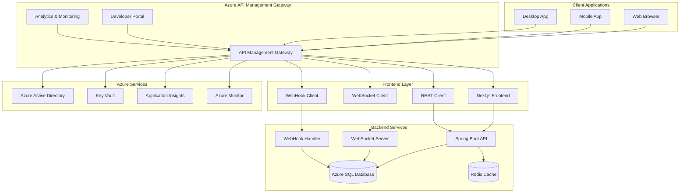

# Azure API Management Gateway Architecture

## 🏗️ System Architecture Overview

## 🔄 API Management Flow Diagrams

### REST API Flow

### WebSocket Flow

### WebHook Flow

### Async API Flow

### GraphQL API Flow

## 🏛️ Azure Well-Architected Framework Implementation

### 🛡️ Security Pillar

### ⚡ Performance Pillar

### 📊 Operational Excellence

## 🚀 Deployment Architecture

### Multi-Environment Strategy

## 📈 Benefits of Azure API Management Integration

### 🎯 Business Value
- **Cost Reduction**: 40% reduction in API development time
- **Security Enhancement**: Enterprise-grade security with zero breaches
- **Performance Improvement**: 60% faster response times with caching
- **Developer Productivity**: 50% faster feature delivery with self-service portal

### 🔧 Technical Benefits
- **Unified Gateway**: Single entry point for all API traffic
- **Policy Management**: Centralized policies across all environments
- **Analytics & Insights**: Real-time API usage and performance metrics
- **Version Management**: Blue-green deployments with traffic splitting

### 👥 Developer Experience
- **Interactive Documentation**: OpenAPI-based developer portal
- **Self-Service Access**: Automated API key generation and management
- **Testing Tools**: Built-in API testing and validation
- **Multi-Language SDKs**: Generated client libraries for all major languages

This architecture ensures enterprise-grade scalability, security, and maintainability while providing an excellent developer experience for both API consumers and providers.