# Azure Cloud Architecture

This document outlines the comprehensive Azure cloud architecture for the React + Java + Azure Golden Path application, demonstrating enterprise-grade scalability, security, and observability aligned with the **Azure Well-Architected Framework**.

## 🎯 Azure Well-Architected Framework Alignment

This architecture is designed following the [Azure Well-Architected Framework](https://learn.microsoft.com/en-us/azure/well-architected/) - a set of quality-driven tenets, architectural decision points, and review tools to help build a technical foundation for workloads that achieve:

- ✅ **Resilient, available, and recoverable** systems
- ✅ **Secure** infrastructure and applications  
- ✅ **Sufficient return on investment** with cost optimization
- ✅ **Responsible development and operations** practices
- ✅ **Acceptable performance** within required timeframes

### 🏛️ Five Pillars of Architectural Excellence

#### 🛡️ Reliability

**Design for business requirements, resilience, recovery, and operations while keeping it simple.**

**Our Implementation:**

- **Zone Redundancy**: Azure App Service and AKS deployed across availability zones
- **Auto-scaling**: Horizontal Pod Autoscaler (HPA) and cluster autoscaler for AKS
- **Health Monitoring**: Application Insights, Azure Monitor, and custom health checks
- **Backup & Recovery**: Automated backups for Azure SQL Database and Cosmos DB
- **Circuit Breakers**: Implement resilience patterns in microservices communication
- **Disaster Recovery**: Multi-region deployment with failover capabilities

#### 🔒 Security

**Protect confidentiality, integrity, and availability through defense-in-depth.**

**Our Implementation:**

- **Identity & Access**: Azure Active Directory with RBAC and Conditional Access
- **Network Security**: Private endpoints, NSGs, and Azure Firewall
- **Application Security**: Web Application Firewall (WAF) and API Management
- **Data Protection**: Encryption at rest/transit, Azure Key Vault for secrets
- **Container Security**: Image scanning, admission controllers, and security policies
- **Zero Trust**: Verify-first approach with least privilege access

#### 💰 Cost Optimization

**Optimize usage and rate utilization while maintaining cost-efficient mindset.**

**Our Implementation:**

- **Right-sizing**: Monitor and adjust compute resources based on usage
- **Reserved Instances**: Long-term commitments for predictable workloads  
- **Spot Instances**: Use Azure Spot VMs for development and batch workloads
- **Auto-shutdown**: Scheduled shutdown for non-production environments
- **Cost Monitoring**: Azure Cost Management with budgets and alerts
- **Resource Tagging**: Comprehensive tagging strategy for cost allocation

#### ⚙️ Operational Excellence

**Streamline operations with standards, comprehensive monitoring, and safe deployment practices.**

**Our Implementation:**

- **Infrastructure as Code**: ARM templates, Bicep, and Terraform for deployment
- **CI/CD Pipelines**: Azure DevOps with automated testing and deployment
- **Monitoring & Alerting**: Comprehensive observability with Azure Monitor
- **GitOps**: Configuration management through Git workflows
- **Automated Testing**: Unit, integration, and end-to-end testing in pipelines
- **Release Management**: Blue-green deployments and canary releases

#### ⚡ Performance Efficiency

**Scale horizontally, test early and often, and monitor solution health.**

**Our Implementation:**

- **Horizontal Scaling**: Auto-scaling for App Service and AKS workloads
- **Caching Strategy**: Azure CDN, Redis Cache, and application-level caching
- **Database Optimization**: SQL Database performance tuning and indexing
- **Load Testing**: Regular performance testing with Azure Load Testing
- **APM**: Application Performance Monitoring with Application Insights
- **Geographic Distribution**: Multi-region deployment for global performance

### 🔄 Continuous Assessment & Improvement

**Well-Architected Review Process:**

1. **Regular Assessments**: Quarterly [Azure Well-Architected Review](https://learn.microsoft.com/en-us/assessments/azure-architecture-review/) assessments
2. **Azure Advisor Integration**: Continuous recommendations from Azure Advisor
3. **Metrics & KPIs**: Track architectural health across all five pillars
4. **Iterative Improvements**: Implement recommendations based on assessment results
5. **Documentation Updates**: Keep architecture documentation current with changes

**Assessment Tools:**

- [Core Well-Architected Review](https://learn.microsoft.com/en-us/assessments/azure-architecture-review/)
- [Azure Advisor](https://learn.microsoft.com/en-us/azure/advisor/) for continuous optimization
- Custom dashboards for architectural health monitoring

## 🏗️ High-Level Architecture Overview

```mermaid
graph TB
    subgraph "External"
        User[👤 Users]
        Dev[👨‍💻 Developers]
        Admin[👩‍💼 Administrators]
    end

    subgraph "Azure Front Door & CDN"
        AFD[Azure Front Door]
        CDN[Azure CDN]
    end

    subgraph "Azure App Service Environment"
        ASE[App Service Environment]
        subgraph "Frontend Apps"
            WebApp[React/Next.js Web App]
            API[API Gateway]
        end
        subgraph "Backend Services"
            SpringApp[Spring Boot App]
            AuthService[Auth Service]
            NotificationService[Notification Service]
        end
    end

    subgraph "Azure Container Services"
        AKS[Azure Kubernetes Service]
        ACR[Azure Container Registry]
        subgraph "Microservices"
            UserMS[User Service]
            PaymentMS[Payment Service]
            WebSocketMS[WebSocket Service]
        end
    end

    subgraph "Data Layer"
        SQL[Azure SQL Database]
        Redis[Azure Cache for Redis]
        Cosmos[Azure Cosmos DB]
        Storage[Azure Blob Storage]
    end

    subgraph "Security & Identity"
        AAD[Azure Active Directory]
        KeyVault[Azure Key Vault]
        AppGateway[Application Gateway WAF]
    end

    subgraph "Monitoring & Observability"
        Monitor[Azure Monitor]
        AppInsights[Application Insights]
        LogAnalytics[Log Analytics]
        Grafana[Azure Managed Grafana]
    end

    subgraph "DevOps & CI/CD"
        DevOps[Azure DevOps]
        GitHub[GitHub Actions]
        Pipeline[Build Pipeline]
    end

    %% User flows
    User --> AFD
    Dev --> GitHub
    Admin --> Monitor

    %% Frontend flow
    AFD --> CDN
    CDN --> AppGateway
    AppGateway --> ASE
    ASE --> WebApp
    ASE --> API

    %% Backend flow
    API --> SpringApp
    SpringApp --> AKS
    AKS --> UserMS
    AKS --> PaymentMS
    AKS --> WebSocketMS

    %% Data connections
    SpringApp --> SQL
    SpringApp --> Redis
    UserMS --> SQL
    PaymentMS --> Cosmos
    WebSocketMS --> Redis
    WebApp --> Storage

    %% Security
    AAD --> SpringApp
    AAD --> WebApp
    KeyVault --> SpringApp
    KeyVault --> AKS

    %% Monitoring
    WebApp --> AppInsights
    SpringApp --> AppInsights
    AKS --> Monitor
    Monitor --> LogAnalytics
    LogAnalytics --> Grafana

    %% DevOps
    GitHub --> Pipeline
    Pipeline --> ACR
    Pipeline --> ASE
    Pipeline --> AKS
```



## 🌐 Frontend Architecture (Azure Static Web Apps + App Service)

```mermaid
graph TB
    subgraph "Client Layer"
        Browser[🌐 Web Browser]
        Mobile[📱 Mobile App]
        PWA[📲 Progressive Web App]
    end

    subgraph "Azure Front Door"
        AFD[Azure Front Door]
        WAF[Web Application Firewall]
        SSL[SSL Termination]
    end

    subgraph "Azure CDN"
        CDN[Azure CDN Premium]
        EdgeCache[Edge Caching]
        Compression[Gzip Compression]
    end

    subgraph "Azure App Service"
        WebApp[Next.js App Service]
        subgraph "Features"
            SSR[Server-Side Rendering]
            API_Routes[API Routes]
            WebSocket_API[WebSocket API]
        end
        AutoScale[Auto Scaling]
        Slots[Deployment Slots]
    end

    subgraph "Static Assets"
        StaticWebApp[Azure Static Web Apps]
        BlobStorage[Azure Blob Storage]
        StaticAssets[JS/CSS/Images]
    end

    subgraph "Security"
        AAD_Auth[Azure AD Authentication]
        JWT[JWT Token Validation]
        CORS[CORS Configuration]
    end

    subgraph "Monitoring"
        AppInsights_FE[Application Insights]
        RUM[Real User Monitoring]
        Performance[Performance Tracking]
    end

    %% User connections
    Browser --> AFD
    Mobile --> AFD
    PWA --> AFD

    %% Frontend flow
    AFD --> WAF
    WAF --> SSL
    SSL --> CDN
    CDN --> EdgeCache
    EdgeCache --> WebApp
    
    %% Static content
    CDN --> StaticWebApp
    StaticWebApp --> BlobStorage
    BlobStorage --> StaticAssets

    %% App Service features
    WebApp --> SSR
    WebApp --> API_Routes
    WebApp --> WebSocket_API
    WebApp --> AutoScale
    WebApp --> Slots

    %% Security integration
    WebApp --> AAD_Auth
    AAD_Auth --> JWT
    WebApp --> CORS

    %% Monitoring
    WebApp --> AppInsights_FE
    AppInsights_FE --> RUM
    AppInsights_FE --> Performance
```



## ⚙️ Backend Architecture (Azure Kubernetes Service + App Service)


## 💾 Data Architecture (Multi-Database Strategy)


## 🔒 Security Architecture


## 📊 Monitoring & Observability Architecture


## 🚀 CI/CD Pipeline Architecture


## 🌍 Global Distribution & Disaster Recovery


## 📈 Scaling Strategy

### Horizontal Scaling
- **App Service**: Auto-scaling based on CPU, memory, and custom metrics
- **AKS**: Cluster autoscaler and Horizontal Pod Autoscaler (HPA)
- **SQL Database**: Elastic pools and read replicas
- **Cosmos DB**: Auto-scaling throughput

### Vertical Scaling
- **App Service**: Scale up/down service plans
- **AKS**: Node pool scaling
- **SQL Database**: vCore scaling
- **Virtual Machines**: VM size adjustments

### Geographic Scaling
- **Multi-region deployment**: Active-passive and active-active configurations
- **CDN**: Global edge locations
- **Traffic routing**: DNS-based and application-level routing

## 🔧 Configuration Management

### Environment-Specific Configurations
- **Development**: Single region, basic tiers
- **Staging**: Production-like, limited scale
- **Production**: Multi-region, premium tiers, high availability

### Feature Flags
- **Azure App Configuration**: Centralized feature flag management
- **Conditional deployments**: Environment-based feature activation
- **A/B testing**: User-based feature toggles

## 💰 Cost Optimization

### Resource Optimization
- **Reserved Instances**: Long-term commitments for cost savings
- **Spot Instances**: Cost-effective compute for development
- **Auto-shutdown**: Development environment scheduling

### Monitoring & Budgets
- **Azure Cost Management**: Budget alerts and recommendations
- **Resource tagging**: Cost allocation and tracking
- **Right-sizing**: Continuous optimization recommendations

## 📚 Azure Reference Architectures

This section integrates official Microsoft Learn reference architectures and best practices for common workloads, providing proven patterns for production deployments.

### 🌐 Web Application Reference Architectures

#### Basic Web Application Architecture

Based on [Azure Basic Web Application Reference](https://learn.microsoft.com/en-us/azure/architecture/reference-architectures/app-service-web-app/basic-web-app):

```mermaid
graph TB
    subgraph "Basic Web App Pattern"
        User[👤 User]
        AppService[Azure App Service]
        SQLDb[Azure SQL Database]
        AAD[Microsoft Entra ID]
        Monitor[Azure Monitor]
        AppInsights[Application Insights]
    end
    
    User -->|HTTPS| AppService
    AppService -->|Authentication| AAD
    AppService -->|Data Access| SQLDb
    AppService -->|Telemetry| AppInsights
    AppInsights --> Monitor
    
    style AppService fill:#e1f5fe
    style SQLDb fill:#fff3e0
    style AAD fill:#f3e5f5
```



**Key Features:**

- Single-region deployment for learning and POC
- Integrated authentication with Microsoft Entra ID
- Direct SQL Database connectivity
- Built-in monitoring with Application Insights
- Cost-optimized for development scenarios

#### Zone-Redundant Web Application Architecture

Based on [Baseline Highly Available Zone-Redundant Web Application](https://learn.microsoft.com/en-us/azure/architecture/web-apps/app-service/architectures/baseline-zone-redundant):

```mermaid
graph TB
    subgraph "Production Web App Pattern"
        subgraph "Network Security"
            AppGW[Application Gateway + WAF]
            PEP[Private Endpoints]
        end
        
        subgraph "Compute (Zone-Redundant)"
            AppService[App Service Premium]
            ASP[App Service Plan]
        end
        
        subgraph "Data (Zone-Redundant)"
            SQLDb[Azure SQL Database]
            KeyVault[Azure Key Vault]
        end
        
        subgraph "Monitoring"
            LogAnalytics[Log Analytics]
            AppInsights[Application Insights]
        end
    end
    
    Internet[🌐 Internet] --> AppGW
    AppGW --> AppService
    AppService -.->|Private Link| PEP
    PEP --> SQLDb
    PEP --> KeyVault
    AppService --> AppInsights
    AppInsights --> LogAnalytics
    
    style AppGW fill:#ffebee
    style AppService fill:#e8f5e8
    style SQLDb fill:#fff3e0
```



### 🏗️ Microservices Reference Architectures

#### Azure Kubernetes Service (AKS) Microservices

Based on [Microservices Architecture on AKS](https://learn.microsoft.com/en-us/azure/architecture/reference-architectures/containers/aks-microservices/aks-microservices):

```mermaid
graph TB
    subgraph "AKS Microservices Pattern"
        subgraph "Ingress Layer"
            AppGW[Application Gateway]
            Ingress[NGINX Ingress]
        end
        
        subgraph "AKS Cluster"
            subgraph "System Namespace"
                IngressController[Ingress Controller]
                DNS[Core DNS]
            end
            
            subgraph "Application Namespace"
                APIGateway[API Gateway]
                UserSvc[User Service]
                PaymentSvc[Payment Service]
                NotificationSvc[Notification Service]
            end
            
            subgraph "Monitoring Namespace"
                Prometheus[Prometheus]
                Grafana[Grafana]
            end
        end
        
        subgraph "Data Stores"
            SQL[Azure SQL]
            Cosmos[Cosmos DB]
            Redis[Azure Cache for Redis]
        end
        
        subgraph "Supporting Services"
            ACR[Container Registry]
            KeyVault[Key Vault]
            ServiceBus[Service Bus]
        end
    end
    
    Internet[🌐 Internet] --> AppGW
    AppGW --> Ingress
    Ingress --> APIGateway
    APIGateway --> UserSvc
    APIGateway --> PaymentSvc
    APIGateway --> NotificationSvc
    
    UserSvc --> SQL
    PaymentSvc --> Cosmos
    NotificationSvc --> ServiceBus
    UserSvc --> Redis
    
    UserSvc --> Prometheus
    PaymentSvc --> Prometheus
    NotificationSvc --> Prometheus
    Prometheus --> Grafana
```



### 📊 Data Analytics Reference Architectures

#### Cloud-Scale Analytics Architecture

Based on [Cloud-Scale Analytics Reference](https://learn.microsoft.com/en-us/azure/cloud-adoption-framework/scenarios/cloud-scale-analytics/architectures/reference-architecture-overview):


### 🛡️ Security Reference Patterns

#### Mission-Critical Baseline Architecture

Based on [Mission-Critical Baseline Architecture](https://learn.microsoft.com/en-us/azure/architecture/reference-architectures/containers/aks/baseline-aks):

```mermaid
graph TB
    subgraph "Network Security Perimeter"
        subgraph "Hub Network"
            Firewall[Azure Firewall]
            Bastion[Azure Bastion]
            VPN[VPN Gateway]
        end
        
        subgraph "Spoke Network - Production"
            AppGW[Application Gateway + WAF]
            subgraph "AKS Private Cluster"
                Nodes[Worker Nodes]
                Pods[Application Pods]
            end
            PrivateEndpoints[Private Endpoints]
        end
    end
    
    subgraph "Identity & Access"
        AAD[Azure AD]
        Workload[Workload Identity]
        RBAC[RBAC Policies]
    end
    
    subgraph "Security Services"
        KeyVault[Azure Key Vault]
        Defender[Microsoft Defender]
        Sentinel[Azure Sentinel]
        PolicyEngine[Azure Policy]
    end
    
    subgraph "Data Protection"
        SQL[Azure SQL (Private)]
        Storage[Storage Account (Private)]
        Backup[Azure Backup]
        Encryption[Disk Encryption]
    end
    
    Internet[🌐 Internet] --> Firewall
    Firewall --> AppGW
    AppGW -.->|Private| Nodes
    Nodes --> Pods
    
    AAD --> Workload
    Workload --> Pods
    RBAC --> Pods
    
    Pods -.->|Private Endpoint| PrivateEndpoints
    PrivateEndpoints --> SQL
    PrivateEndpoints --> Storage
    PrivateEndpoints --> KeyVault
    
    Defender --> Nodes
    Sentinel --> Firewall
    PolicyEngine --> Nodes
    
    style Firewall fill:#ffebee
    style AppGW fill:#ffebee
    style KeyVault fill:#f3e5f5
    style AAD fill:#f3e5f5
```

### 🏢 Enterprise-Scale Reference Architecture

#### Landing Zone Architecture

Based on [Azure Enterprise-Scale Landing Zones](https://learn.microsoft.com/en-us/azure/cloud-adoption-framework/ready/enterprise-scale/):


### 🔄 Integration Patterns

#### Event-Driven Architecture

Based on [Event-Driven Architecture Patterns](https://learn.microsoft.com/en-us/azure/architecture/guide/architecture-styles/event-driven):

```mermaid
graph TB
    subgraph "Event Sources"
        WebApp[Web Application]
        MobileApp[Mobile Application]
        IoTDevices[IoT Devices]
        ThirdParty[Third-party APIs]
    end
    
    subgraph "Event Ingestion"
        EventHub[Azure Event Hubs]
        ServiceBus[Azure Service Bus]
        EventGrid[Azure Event Grid]
    end
    
    subgraph "Event Processing"
        StreamAnalytics[Stream Analytics]
        Functions[Azure Functions]
        LogicApps[Logic Apps]
        AKSJobs[AKS Jobs]
    end
    
    subgraph "Event Storage"
        EventStore[Event Store (Cosmos DB)]
        DataLake[Azure Data Lake]
        SQL[Azure SQL Database]
    end
    
    subgraph "Event Consumers"
        Notifications[Notification Service]
        Analytics[Analytics Dashboard]
        ML[ML Pipeline]
        Archive[Archive Storage]
    end
    
    WebApp --> EventHub
    MobileApp --> ServiceBus
    IoTDevices --> EventHub
    ThirdParty --> EventGrid
    
    EventHub --> StreamAnalytics
    ServiceBus --> Functions
    EventGrid --> LogicApps
    EventHub --> AKSJobs
    
    StreamAnalytics --> EventStore
    Functions --> SQL
    LogicApps --> EventStore
    AKSJobs --> DataLake
    
    EventStore --> Analytics
    SQL --> Notifications
    DataLake --> ML
    EventStore --> Archive
```

## 🎯 Architecture Decision Framework

### Technology Selection Matrix

Based on [Azure Compute Decision Tree](https://learn.microsoft.com/en-us/azure/architecture/guide/technology-choices/compute-decision-tree):

| Workload Type | Recommended Service | Alternative | Use Case |
|---------------|-------------------|-------------|----------|
| **Web Applications** | Azure App Service | Azure Static Web Apps | Traditional web apps, APIs |
| **Microservices** | Azure Kubernetes Service | Azure Container Apps | Complex distributed systems |
| **Serverless** | Azure Functions | Azure Container Apps | Event-driven processing |
| **Batch Processing** | Azure Batch | Azure Container Instances | Large-scale parallel workloads |
| **Data Analytics** | Azure Synapse Analytics | Azure Databricks | Big data and analytics |

### Scaling Patterns

Based on [Azure Auto-scaling Best Practices](https://learn.microsoft.com/en-us/azure/architecture/best-practices/auto-scaling):

#### Horizontal Scaling Patterns


## 📋 Implementation Checklists

### Web Application Deployment Checklist

- [ ] **Security**: WAF enabled, private endpoints configured
- [ ] **Reliability**: Zone redundancy enabled, backup configured
- [ ] **Performance**: CDN configured, auto-scaling enabled
- [ ] **Monitoring**: Application Insights integrated, alerts configured
- [ ] **Compliance**: Logs retention configured, audit trails enabled

### Microservices Deployment Checklist

- [ ] **Container Security**: Base image scanning, runtime security
- [ ] **Service Mesh**: Traffic encryption, observability
- [ ] **Data Management**: Database per service, event sourcing
- [ ] **API Management**: Rate limiting, authentication, monitoring
- [ ] **Deployment**: Blue-green deployment, canary releases

### Data Platform Deployment Checklist

- [ ] **Data Governance**: Data classification, lineage tracking
- [ ] **Security**: Encryption at rest/transit, access controls
- [ ] **Performance**: Partitioning strategy, indexing optimization
- [ ] **Backup & Recovery**: Automated backups, disaster recovery
- [ ] **Monitoring**: Performance metrics, data quality monitoring

## 🏛️ Well-Architected Framework Implementation Guide

This section provides detailed implementation guidance for each Well-Architected Framework pillar, demonstrating how our architecture meets the quality-driven tenets and architectural decision points.

### 🛡️ Reliability Implementation

#### Design Principles Applied

**RE:01 - Design for business requirements**
- Service Level Objectives (SLOs): 99.9% uptime for web applications, 99.99% for data services
- Recovery Time Objective (RTO): < 4 hours for critical services
- Recovery Point Objective (RPO): < 15 minutes for transactional data

**RE:02 - Design for resilience**


**Implementation Details:**
- **Zone-redundant deployments**: App Service Premium, AKS across AZs
- **Database HA**: SQL Database Business Critical with read replicas  
- **Container reliability**: Pod disruption budgets and anti-affinity rules
- **Health monitoring**: Liveness, readiness, and startup probes
- **Automated failover**: Traffic Manager with health check endpoints

#### Reliability Checklist ✅

- [ ] **RE:01** - SLOs defined and monitored for all critical services
- [ ] **RE:02** - Failure mode analysis completed for each component
- [ ] **RE:03** - Redundancy implemented across availability zones
- [ ] **RE:04** - Health monitoring with automated alerts configured
- [ ] **RE:05** - Disaster recovery procedures tested quarterly
- [ ] **RE:06** - Capacity planning based on growth projections
- [ ] **RE:07** - Dependencies mapped with criticality assessment

### 🔒 Security Implementation

#### Design Principles Applied

**SE:01 - Zero Trust principles**
- Verify every request regardless of source location
- Least privilege access with just-in-time elevation
- Continuous monitoring and validation

**SE:02 - Defense in depth**


**Implementation Details:**
- **Identity management**: Azure AD with MFA and Conditional Access
- **Network isolation**: Private endpoints and virtual network integration
- **Secrets management**: Azure Key Vault with RBAC and access policies
- **Container security**: Pod Security Standards and admission controllers
- **Data encryption**: TDE for databases, encryption at rest for storage

#### Security Checklist ✅

- [ ] **SE:01** - Zero Trust network access implemented
- [ ] **SE:02** - Multi-factor authentication enforced
- [ ] **SE:03** - Secrets stored in Azure Key Vault
- [ ] **SE:04** - Network segmentation with private endpoints
- [ ] **SE:05** - Container images scanned for vulnerabilities
- [ ] **SE:06** - Data classified and protected accordingly
- [ ] **SE:07** - Security monitoring with Azure Sentinel

### 💰 Cost Optimization Implementation

#### Design Principles Applied

**CO:01 - Align usage to business goals**
- Resource allocation based on actual workload requirements
- Cost allocation tags aligned with business units
- Regular usage analysis and optimization

**CO:02 - Continuous optimization mindset**


**Implementation Details:**
- **Resource right-sizing**: Regular analysis with Azure Advisor recommendations
- **Commitment discounts**: Reserved instances for predictable workloads
- **Auto-scaling policies**: Scale down during off-peak hours
- **Development optimization**: Use Azure Dev/Test subscriptions
- **Storage optimization**: Implement lifecycle policies for blob storage

#### Cost Optimization Checklist ✅

- [ ] **CO:01** - Cost budgets and alerts configured
- [ ] **CO:02** - Resource tagging strategy implemented
- [ ] **CO:03** - Right-sizing analysis performed monthly
- [ ] **CO:04** - Reserved instances purchased for steady workloads
- [ ] **CO:05** - Auto-scaling configured for variable workloads
- [ ] **CO:06** - Development environments scheduled for shutdown
- [ ] **CO:07** - Cost allocation reports generated weekly

### ⚙️ Operational Excellence Implementation

#### Design Principles Applied

**OE:01 - Embrace DevOps culture**
- Infrastructure as Code for all deployments
- Automated testing and deployment pipelines
- Collaborative development practices

**OE:02 - Establish observability**


**Implementation Details:**
- **Infrastructure as Code**: Bicep templates with Azure DevOps pipelines
- **Application monitoring**: Application Insights with custom telemetry
- **Log aggregation**: Centralized logging with Log Analytics workspace
- **Automated deployment**: GitOps workflows with Azure Arc
- **Performance monitoring**: End-to-end observability with distributed tracing

#### Operational Excellence Checklist ✅

- [ ] **OE:01** - Infrastructure deployed via code (IaC)
- [ ] **OE:02** - Automated testing in CI/CD pipelines
- [ ] **OE:03** - Comprehensive monitoring and alerting
- [ ] **OE:04** - Incident response procedures documented
- [ ] **OE:05** - Regular architectural reviews conducted
- [ ] **OE:06** - Documentation kept current with changes
- [ ] **OE:07** - Team training on operational procedures

### ⚡ Performance Efficiency Implementation

#### Design Principles Applied

**PE:01 - Scale horizontally**
- Auto-scaling for compute resources
- Database read replicas for query performance
- Content delivery network for global reach

**PE:02 - Test early and often**
```mermaid
graph TB
    subgraph "Performance Testing Strategy"
        subgraph "Load Testing"
            LT[Azure Load Testing]
            ST[Stress Testing]
            VT[Volume Testing]
        end
        
        subgraph "Monitoring"
            APM[Application Performance Monitoring]
            UM[User Experience Monitoring]
            IM[Infrastructure Monitoring]
        end
        
        subgraph "Optimization"
            QO[Query Optimization]
            CO[Code Optimization]
            RO[Resource Optimization]
        end
    end
    
    LT --> APM
    ST --> UM
    VT --> IM
    APM --> QO
    UM --> CO
    IM --> RO
```

**Implementation Details:**
- **Horizontal scaling**: AKS cluster autoscaler and HPA policies
- **Caching strategy**: Multi-layer caching with Redis and CDN
- **Database performance**: SQL Database performance recommendations
- **Load testing**: Regular performance testing with realistic workloads
- **Optimization**: Continuous performance monitoring and tuning

#### Performance Efficiency Checklist ✅

- [ ] **PE:01** - Auto-scaling policies configured and tested
- [ ] **PE:02** - Performance baselines established
- [ ] **PE:03** - Regular load testing performed
- [ ] **PE:04** - Database query performance optimized
- [ ] **PE:05** - CDN configured for static content
- [ ] **PE:06** - Application performance monitoring enabled
- [ ] **PE:07** - Capacity planning based on growth trends

### 🔄 Well-Architected Assessment Integration

#### Continuous Improvement Process

**Quarterly Assessment Cycle:**
1. **Assessment Phase** (Week 1)
   - Complete Azure Well-Architected Review
   - Gather metrics from all monitoring systems
   - Review incident reports and performance data

2. **Analysis Phase** (Week 2-3)
   - Analyze assessment results and recommendations
   - Prioritize improvements based on business impact
   - Create improvement roadmap

3. **Implementation Phase** (Week 4-12)
   - Implement high-priority recommendations
   - Update documentation and procedures
   - Test changes in non-production environments

4. **Validation Phase** (Week 12-13)
   - Validate improvements in production
   - Update architectural documentation
   - Prepare for next assessment cycle

**Key Performance Indicators (KPIs):**
- **Reliability**: Uptime percentage, MTTR, MTBF
- **Security**: Security incidents, vulnerability remediation time
- **Cost**: Cost per transaction, budget variance, optimization savings
- **Operations**: Deployment frequency, change failure rate, recovery time
- **Performance**: Response time, throughput, user satisfaction

---

This architecture provides:

- ✅ **Enterprise-grade scalability** with auto-scaling capabilities
- ✅ **High availability** with multi-region deployment
- ✅ **Security** with defense-in-depth approach
- ✅ **Observability** with comprehensive monitoring
- ✅ **Cost optimization** with intelligent resource management
- ✅ **DevOps integration** with automated CI/CD pipelines
- ✅ **Microsoft Learn alignment** with official reference architectures
- ✅ **Production-ready patterns** with proven deployment strategies
- ✅ **Well-Architected Framework compliance** with continuous assessment and improvement
