# Azure Cloud Architecture

This document outlines the comprehensive Azure cloud architecture for the React + Java + Azure Golden Path application, demonstrating enterprise-grade scalability, security, and observability.

## 🏗️ High-Level Architecture Overview

```mermaid
graph TB
    subgraph "External"
        User[👤 Users]
        Dev[👨‍💻 Developers]
        Admin[👩‍💼 Administrators]
    end

    subgraph "Azure Front Door & CDN"
        AFD[Azure Front Door]
        CDN[Azure CDN]
    end

    subgraph "Azure App Service Environment"
        ASE[App Service Environment]
        subgraph "Frontend Apps"
            WebApp[React/Next.js Web App]
            API[API Gateway]
        end
        subgraph "Backend Services"
            SpringApp[Spring Boot App]
            AuthService[Auth Service]
            NotificationService[Notification Service]
        end
    end

    subgraph "Azure Container Services"
        AKS[Azure Kubernetes Service]
        ACR[Azure Container Registry]
        subgraph "Microservices"
            UserMS[User Service]
            PaymentMS[Payment Service]
            WebSocketMS[WebSocket Service]
        end
    end

    subgraph "Data Layer"
        SQL[Azure SQL Database]
        Redis[Azure Cache for Redis]
        Cosmos[Azure Cosmos DB]
        Storage[Azure Blob Storage]
    end

    subgraph "Security & Identity"
        AAD[Azure Active Directory]
        KeyVault[Azure Key Vault]
        AppGateway[Application Gateway WAF]
    end

    subgraph "Monitoring & Observability"
        Monitor[Azure Monitor]
        AppInsights[Application Insights]
        LogAnalytics[Log Analytics]
        Grafana[Azure Managed Grafana]
    end

    subgraph "DevOps & CI/CD"
        DevOps[Azure DevOps]
        GitHub[GitHub Actions]
        Pipeline[Build Pipeline]
    end

    %% User flows
    User --> AFD
    Dev --> GitHub
    Admin --> Monitor

    %% Frontend flow
    AFD --> CDN
    CDN --> AppGateway
    AppGateway --> ASE
    ASE --> WebApp
    ASE --> API

    %% Backend flow
    API --> SpringApp
    SpringApp --> AKS
    AKS --> UserMS
    AKS --> PaymentMS
    AKS --> WebSocketMS

    %% Data connections
    SpringApp --> SQL
    SpringApp --> Redis
    UserMS --> SQL
    PaymentMS --> Cosmos
    WebSocketMS --> Redis
    WebApp --> Storage

    %% Security
    AAD --> SpringApp
    AAD --> WebApp
    KeyVault --> SpringApp
    KeyVault --> AKS

    %% Monitoring
    WebApp --> AppInsights
    SpringApp --> AppInsights
    AKS --> Monitor
    Monitor --> LogAnalytics
    LogAnalytics --> Grafana

    %% DevOps
    GitHub --> Pipeline
    Pipeline --> ACR
    Pipeline --> ASE
    Pipeline --> AKS
```

## 🌐 Frontend Architecture (Azure Static Web Apps + App Service)

## ⚙️ Backend Architecture (Azure Kubernetes Service + App Service)

## 💾 Data Architecture (Multi-Database Strategy)

## 🔒 Security Architecture

## 📊 Monitoring & Observability Architecture

## 🚀 CI/CD Pipeline Architecture

## 🌍 Global Distribution & Disaster Recovery

## 📈 Scaling Strategy

### Horizontal Scaling
- **App Service**: Auto-scaling based on CPU, memory, and custom metrics
- **AKS**: Cluster autoscaler and Horizontal Pod Autoscaler (HPA)
- **SQL Database**: Elastic pools and read replicas
- **Cosmos DB**: Auto-scaling throughput

### Vertical Scaling
- **App Service**: Scale up/down service plans
- **AKS**: Node pool scaling
- **SQL Database**: vCore scaling
- **Virtual Machines**: VM size adjustments

### Geographic Scaling
- **Multi-region deployment**: Active-passive and active-active configurations
- **CDN**: Global edge locations
- **Traffic routing**: DNS-based and application-level routing

## 🔧 Configuration Management

### Environment-Specific Configurations
- **Development**: Single region, basic tiers
- **Staging**: Production-like, limited scale
- **Production**: Multi-region, premium tiers, high availability

### Feature Flags
- **Azure App Configuration**: Centralized feature flag management
- **Conditional deployments**: Environment-based feature activation
- **A/B testing**: User-based feature toggles

## 💰 Cost Optimization

### Resource Optimization
- **Reserved Instances**: Long-term commitments for cost savings
- **Spot Instances**: Cost-effective compute for development
- **Auto-shutdown**: Development environment scheduling

### Monitoring & Budgets
- **Azure Cost Management**: Budget alerts and recommendations
- **Resource tagging**: Cost allocation and tracking
- **Right-sizing**: Continuous optimization recommendations

---

This architecture provides:
- ✅ **Enterprise-grade scalability** with auto-scaling capabilities
- ✅ **High availability** with multi-region deployment
- ✅ **Security** with defense-in-depth approach
- ✅ **Observability** with comprehensive monitoring
- ✅ **Cost optimization** with intelligent resource management
- ✅ **DevOps integration** with automated CI/CD pipelines