# Azure Data & AI Platform Architecture

## 🏗️ Comprehensive Data & AI Platform Overview

```mermaid
%%{init: {'theme':'base', 'themeVariables': {'fontSize': '12px', 'fontFamily': 'Arial, sans-serif'}}}%%
graph TB
    subgraph DATA_SOURCES ["📊 Data Sources"]
        APIData[🔄 API Data]
        WebData[🌐 Web Data]
        MobileData[📱 Mobile Data]
        IoTData[📡 IoT Sensors]
        ThirdParty[🏢 Third-Party APIs]
        FileUploads[📁 File Uploads]
    end

    subgraph INGESTION_LAYER ["📥 Data Ingestion Layer"]
        subgraph REAL_TIME ["Real-Time Ingestion"]
            KafkaConnect[🔌 Kafka Connect]
            EventHubs[🎯 Azure Event Hubs]
            StreamIngestion[📡 Stream Ingestion]
        end
        
        subgraph BATCH_INGESTION ["Batch Ingestion"]
            ADF[🏭 Azure Data Factory]
            BlobTrigger[📦 Blob Triggered]
            ScheduledJobs[⏰ Scheduled Jobs]
        end
    end

    subgraph STREAMING_LAYER ["🌊 Real-Time Streaming Layer"]
        subgraph KAFKA_CLUSTER ["Apache Kafka Cluster"]
            KafkaProducer[📤 Kafka Producer]
            KafkaBroker[🔄 Kafka Broker]
            KafkaConsumer[📥 Kafka Consumer]
            KafkaTopics[📋 Kafka Topics]
        end
        
        subgraph STREAM_PROCESSING ["Stream Processing"]
            FlinkStreaming[⚡ Apache Flink]
            FlinkCEP[🧠 Flink CEP Engine]
            FlinkSQL[📊 Flink SQL]
            FlinkWindows[🪟 Windowing Functions]
        end
        
        subgraph AZURE_STREAMING ["Azure Streaming"]
            StreamAnalytics[🌊 Azure Stream Analytics]
            RealTimeAnalytics[⚡ Real-Time Analytics]
        end
    end

    subgraph DATA_PROCESSING ["🔧 Data Processing Layer"]
        subgraph SPARK_CLUSTER ["Apache Spark Cluster"]
            SparkStreaming[📡 Spark Streaming]
            SparkBatch[📦 Spark Batch]
            SparkML[🤖 Spark MLlib]
            SparkSQL[🗃️ Spark SQL]
            SparkGraphX[🕸️ Spark GraphX]
        end
        
        subgraph DATABRICKS ["Azure Databricks"]
            DatabricksWorkspace[🏢 Databricks Workspace]
            DatabricksNotebooks[📝 Notebooks]
            DatabricksJobs[⚙️ Automated Jobs]
            MLFlow[🧪 MLflow]
            DeltaEngine[⚡ Delta Engine]
            AutoML[🤖 AutoML]
        end
        
        subgraph DATA_PREP ["Data Preparation"]
            DataCleaning[🧹 Data Cleaning]
            FeatureEngineering[⚙️ Feature Engineering]
            DataValidation[✅ Data Validation]
            SchemaEvolution[🔄 Schema Evolution]
        end
    end

    subgraph LAKEHOUSE_STORAGE ["🏞️ Lakehouse Architecture"]
        subgraph DATA_LAKE ["Azure Data Lake Gen2"]
            RawData[(📥 Raw Zone)]
            ProcessedData[(🔄 Processed Zone)]
            CuratedData[(✨ Curated Zone)]
            ArchiveData[(📚 Archive Zone)]
        end
        
        subgraph DELTA_LAKE ["Delta Lake"]
            DeltaLake[(🔺 Delta Lake)]
            DeltaStreaming[📡 Delta Streaming]
            DeltaVersioning[🔢 Versioning]
            DeltaOptimize[⚡ Optimization]
        end
        
        subgraph SYNAPSE ["Azure Synapse"]
            SynapseSQL[(🔗 Synapse SQL)]
            SynapsePool[🏊 SQL Pool]
            SynapseSpark[⚡ Synapse Spark]
            SynapsePipeline[🔄 Synapse Pipeline]
        end
    end

    subgraph AI_ML_LAYER ["🤖 AI & Machine Learning Layer"]
        subgraph ML_TRAINING ["Model Training"]
            MLTraining[🎯 ML Training]
            HyperparamTuning[🔧 Hyperparameter Tuning]
            ModelValidation[✅ Model Validation]
            ModelRegistry[📚 Model Registry]
        end
        
        subgraph FOUNDATION_MODELS ["Foundation Models"]
            OpenAI[🧠 OpenAI GPT]
            AzureOpenAI[🤖 Azure OpenAI]
            CognitiveServices[🧠 Cognitive Services]
            CustomModels[⚙️ Custom Models]
        end
        
        subgraph ML_INFERENCE ["Model Inference"]
            RealTimeInference[⚡ Real-Time Inference]
            BatchInference[📦 Batch Inference]
            EdgeInference[📱 Edge Inference]
            ModelServing[🚀 Model Serving]
        end
        
        subgraph AI_ORCHESTRATION ["AI Orchestration"]
            MLOps[⚙️ MLOps Pipeline]
            ModelMonitoring[📊 Model Monitoring]
            ModelDrift[📈 Drift Detection]
            AutoRetraining[🔄 Auto Retraining]
        end
    end

    subgraph OPERATIONAL_STORAGE ["💾 Operational Storage"]
        subgraph TRANSACTIONAL ["Transactional Databases"]
            AzureSQL[(🗄️ Azure SQL Database)]
            CosmosDB[(🌐 Cosmos DB)]
            PostgreSQL[(🐘 PostgreSQL)]
            MySQL[(🐬 MySQL)]
        end
        
        subgraph NOSQL ["NoSQL & Search"]
            MongoDB[(🍃 MongoDB)]
            ElasticSearch[(🔍 Elasticsearch)]
            RedisCache[(⚡ Redis Cache)]
            TableStorage[(📋 Table Storage)]
        end
    end

    subgraph BI_ANALYTICS ["📊 Business Intelligence & Analytics"]
        subgraph VISUALIZATION ["Data Visualization"]
            PowerBI[📈 Power BI]
            Grafana[📉 Grafana]
            Superset[📊 Apache Superset]
            Tableau[📋 Tableau]
            CustomDash[🎛️ Custom Dashboards]
        end
        
        subgraph ANALYTICS_TYPES ["Analytics Types"]
            DescriptiveAnalytics[📊 Descriptive Analytics]
            DiagnosticAnalytics[🔍 Diagnostic Analytics]
            PredictiveAnalytics[🔮 Predictive Analytics]
            PrescriptiveAnalytics[💡 Prescriptive Analytics]
        end
        
        subgraph ADVANCED_ANALYTICS ["Advanced Analytics"]
            RealTimeBI[⚡ Real-Time BI]
            NearRealTime[🕐 Near Real-Time]
            BatchAnalytics[📦 Batch Analytics]
            MLPredictions[🔮 ML Predictions]
            AnomalyDetection[🚨 Anomaly Detection]
        end
    end

    subgraph DATA_GOVERNANCE ["🛡️ Data Governance & Security"]
        subgraph GOVERNANCE ["Data Governance"]
            DataCatalog[📚 Data Catalog]
            DataLineage[🔗 Data Lineage]
            DataQuality[✅ Data Quality]
            MetadataManagement[📝 Metadata Management]
        end
        
        subgraph SECURITY ["Data Security"]
            DataEncryption[🔒 Data Encryption]
            AccessControl[🔐 Access Control]
            DataMasking[🎭 Data Masking]
            AuditLogging[📝 Audit Logging]
        end
        
        subgraph COMPLIANCE ["Compliance"]
            GDPR[📋 GDPR Compliance]
            DataRetention[📅 Data Retention]
            PrivacyControls[🔒 Privacy Controls]
            ComplianceReporting[📊 Compliance Reporting]
        end
    end

    subgraph AZURE_AI_SERVICES ["☁️ Azure AI Services"]
        subgraph COGNITIVE_SERVICES ["Cognitive Services"]
            ComputerVision[👁️ Computer Vision]
            SpeechServices[🎙️ Speech Services]
            LanguageServices[📝 Language Services]
            DecisionServices[🎯 Decision Services]
        end
        
        subgraph AI_PLATFORM ["AI Platform Services"]
            MachineLearning[🤖 Azure ML]
            BotServices[🤖 Bot Services]
            CognitiveSearch[🔍 Cognitive Search]
            FormRecognizer[📄 Form Recognizer]
        end
    end

    %% Data Source to Ingestion
    APIData --> KafkaConnect
    WebData --> EventHubs
    MobileData --> StreamIngestion
    IoTData --> EventHubs
    ThirdParty --> ADF
    FileUploads --> BlobTrigger

    %% Ingestion to Streaming
    KafkaConnect --> KafkaProducer
    EventHubs --> KafkaProducer
    StreamIngestion --> KafkaProducer
    KafkaProducer --> KafkaBroker
    KafkaBroker --> KafkaTopics
    KafkaTopics --> KafkaConsumer

    %% Batch Ingestion to Storage
    ADF --> RawData
    BlobTrigger --> RawData
    ScheduledJobs --> RawData

    %% Streaming Processing
    KafkaConsumer --> FlinkStreaming
    FlinkStreaming --> FlinkCEP
    FlinkStreaming --> FlinkSQL
    FlinkSQL --> FlinkWindows
    KafkaConsumer --> SparkStreaming
    EventHubs --> StreamAnalytics

    %% Data Processing Flows
    RawData --> SparkBatch
    SparkStreaming --> ProcessedData
    SparkBatch --> ProcessedData
    ProcessedData --> DataCleaning
    DataCleaning --> FeatureEngineering
    FeatureEngineering --> CuratedData

    %% Databricks Integration
    SparkBatch --> DatabricksWorkspace
    SparkStreaming --> DatabricksWorkspace
    DatabricksWorkspace --> DatabricksNotebooks
    DatabricksWorkspace --> DatabricksJobs
    DatabricksJobs --> MLFlow
    DatabricksJobs --> AutoML

    %% Delta Lake Integration
    ProcessedData --> DeltaLake
    DeltaStreaming --> DeltaLake
    DeltaLake --> DeltaVersioning
    DeltaLake --> DeltaOptimize
    FlinkStreaming --> DeltaStreaming
    SparkStreaming --> DeltaStreaming

    %% Synapse Integration
    DeltaLake --> SynapseSQL
    CuratedData --> SynapseSQL
    SynapseSQL --> SynapsePool
    SynapsePipeline --> SynapseSpark

    %% ML Training Pipeline
    CuratedData --> MLTraining
    FeatureEngineering --> MLTraining
    MLTraining --> HyperparamTuning
    HyperparamTuning --> ModelValidation
    ModelValidation --> ModelRegistry
    MLFlow --> ModelRegistry

    %% AI Inference
    ModelRegistry --> RealTimeInference
    ModelRegistry --> BatchInference
    RealTimeInference --> ModelServing
    BatchInference --> MLPredictions

    %% Foundation Models
    AzureOpenAI --> RealTimeInference
    CognitiveServices --> RealTimeInference
    CustomModels --> ModelRegistry

    %% MLOps Pipeline
    ModelRegistry --> MLOps
    MLOps --> ModelMonitoring
    ModelMonitoring --> ModelDrift
    ModelDrift --> AutoRetraining
    AutoRetraining --> MLTraining

    %% Operational Storage
    ProcessedData --> AzureSQL
    CuratedData --> CosmosDB
    MLPredictions --> RedisCache
    RealTimeInference --> ElasticSearch

    %% Analytics and BI
    SynapseSQL --> PowerBI
    DeltaLake --> PowerBI
    RealTimeInference --> RealTimeBI
    FlinkSQL --> NearRealTime
    SparkSQL --> BatchAnalytics
    MLPredictions --> PredictiveAnalytics
    ModelMonitoring --> AnomalyDetection

    %% Visualization
    PowerBI --> DescriptiveAnalytics
    Grafana --> RealTimeBI
    Superset --> NearRealTime
    CustomDash --> BatchAnalytics

    %% Data Governance
    CuratedData --> DataCatalog
    DataCatalog --> DataLineage
    MLTraining --> DataQuality
    ProcessedData --> MetadataManagement

    %% Security Integration
    DataCatalog --> DataEncryption
    MetadataManagement --> AccessControl
    AzureSQL --> DataMasking
    MLOps --> AuditLogging

    %% AI Services Integration
    ComputerVision --> RealTimeInference
    SpeechServices --> BatchInference
    LanguageServices --> ModelServing
    CognitiveSearch --> ElasticSearch

    %% Styling
    style KafkaBroker fill:#000000,stroke:#333333,stroke-width:3px,color:#fff
    style FlinkStreaming fill:#e6193c,stroke:#b71c1c,stroke-width:2px,color:#fff
    style SparkBatch fill:#e25a00,stroke:#d84315,stroke-width:2px,color:#fff
    style DatabricksWorkspace fill:#ff3621,stroke:#d32f2f,stroke-width:3px,color:#fff
    style DeltaLake fill:#00d4ff,stroke:#0288d1,stroke-width:3px,color:#fff
    style PowerBI fill:#f2c811,stroke:#f57f17,stroke-width:2px,color:#000
    style AzureOpenAI fill:#00bcf2,stroke:#0288d1,stroke-width:3px,color:#fff
    style MLFlow fill:#0078d4,stroke:#005a9e,stroke-width:2px,color:#fff
    style SynapseSQL fill:#ffb900,stroke:#f57f17,stroke-width:2px,color:#000
```

## 🔄 Data Flow Sequences

### 📊 Real-Time Analytics Pipeline

### 🤖 ML Training & Inference Pipeline

### 🔍 Batch Processing Pipeline

## 🏗️ Lakehouse Architecture Patterns

### 📊 Data Zones Organization

The lakehouse follows a medallion architecture:

#### 🥉 Bronze Zone (Raw Data)
- **Purpose**: Store raw data in its original format
- **Data Quality**: No validation or cleaning
- **Format**: Parquet, JSON, CSV, Avro
- **Retention**: Long-term historical data
- **Access**: Data engineers and data scientists

#### 🥈 Silver Zone (Processed Data)
- **Purpose**: Cleaned, validated, and standardized data
- **Data Quality**: Schema enforcement and data validation
- **Format**: Delta Lake tables with versioning
- **Retention**: Medium-term operational data
- **Access**: Analytics teams and business users

#### 🥇 Gold Zone (Curated Data)
- **Purpose**: Business-ready aggregated data
- **Data Quality**: High-quality, business-validated data
- **Format**: Optimized Delta Lake tables
- **Retention**: Business-defined retention policies
- **Access**: Business intelligence and reporting tools

## 🤖 AI & ML Operations (MLOps)

### 🔄 Model Lifecycle Management

```mermaid
%%{init: {'theme':'base', 'themeVariables': {'fontSize': '12px', 'fontFamily': 'Arial, sans-serif'}}}%%
graph LR
    subgraph DEVELOPMENT ["🛠️ Development"]
        DataPrep[📊 Data Preparation]
        FeatureEng[⚙️ Feature Engineering]
        ModelDev[🧠 Model Development]
        Validation[✅ Validation]
    end
    
    subgraph DEPLOYMENT ["🚀 Deployment"]
        ModelReg[📚 Model Registry]
        Staging[🎭 Staging Environment]
        Production[🏭 Production Deployment]
        Monitoring[📊 Monitoring]
    end
    
    subgraph OPERATIONS ["⚙️ Operations"]
        Performance[📈 Performance Tracking]
        DriftDetection[🚨 Drift Detection]
        Retraining[🔄 Automated Retraining]
        Rollback[↩️ Model Rollback]
    end
    
    DataPrep --> FeatureEng
    FeatureEng --> ModelDev
    ModelDev --> Validation
    Validation --> ModelReg
    ModelReg --> Staging
    Staging --> Production
    Production --> Monitoring
    Monitoring --> Performance
    Performance --> DriftDetection
    DriftDetection --> Retraining
    Retraining --> ModelReg
    DriftDetection --> Rollback
```

### 🎯 Model Serving Patterns

#### ⚡ Real-Time Inference
- **Use Case**: Low-latency predictions (< 100ms)
- **Technology**: Azure Container Instances, AKS
- **Examples**: Fraud detection, recommendation engines
- **Scaling**: Auto-scaling based on request volume

#### 📦 Batch Inference
- **Use Case**: High-volume batch predictions
- **Technology**: Azure Batch, Databricks Jobs
- **Examples**: Customer segmentation, risk scoring
- **Scheduling**: Daily, weekly, or event-triggered

#### 📱 Edge Inference
- **Use Case**: Offline or low-connectivity scenarios
- **Technology**: Azure IoT Edge, ONNX Runtime
- **Examples**: Manufacturing quality control, mobile apps
- **Deployment**: Edge devices and mobile applications

## 🔍 Advanced Analytics Capabilities

### 📊 Analytics Maturity Levels

#### 1️⃣ Descriptive Analytics
- **What happened?**: Historical reporting and dashboards
- **Tools**: Power BI, Tableau, Excel
- **Data Sources**: Curated data from Gold zone
- **Update Frequency**: Daily to real-time

#### 2️⃣ Diagnostic Analytics
- **Why did it happen?**: Root cause analysis and drill-down
- **Tools**: Advanced BI tools, statistical analysis
- **Techniques**: Correlation analysis, anomaly detection
- **Data Requirements**: Detailed dimensional data

#### 3️⃣ Predictive Analytics
- **What will happen?**: Forecasting and trend analysis
- **Tools**: Machine learning models, time series analysis
- **Algorithms**: Regression, classification, clustering
- **Applications**: Demand forecasting, churn prediction

#### 4️⃣ Prescriptive Analytics
- **What should we do?**: Optimization and recommendation
- **Tools**: Advanced ML, optimization algorithms
- **Techniques**: Reinforcement learning, simulation
- **Outcomes**: Automated decision-making

## 🛡️ Data Governance Framework

### 📚 Data Catalog & Discovery

```mermaid
%%{init: {'theme':'base', 'themeVariables': {'fontSize': '12px', 'fontFamily': 'Arial, sans-serif'}}}%%
graph TB
    subgraph DISCOVERY ["🔍 Data Discovery"]
        AutoCrawling[🤖 Automated Crawling]
        ManualReg[📝 Manual Registration]
        SchemaInference[🧠 Schema Inference]
    end
    
    subgraph CATALOG ["📚 Data Catalog"]
        Metadata[📊 Metadata Store]
        DataLineage[🔗 Data Lineage]
        BusinessGloss[📖 Business Glossary]
        DataQuality[✅ Quality Metrics]
    end
    
    subgraph ACCESS ["🔐 Access Management"]
        RoleBasedAccess[👥 Role-Based Access]
        DataClassification[🏷️ Data Classification]
        PrivacyTags[🔒 Privacy Tags]
        UsageTracking[📊 Usage Analytics]
    end
    
    AutoCrawling --> Metadata
    ManualReg --> Metadata
    SchemaInference --> Metadata
    Metadata --> DataLineage
    Metadata --> BusinessGloss
    Metadata --> DataQuality
    DataLineage --> RoleBasedAccess
    BusinessGloss --> DataClassification
    DataQuality --> PrivacyTags
    DataClassification --> UsageTracking
```

### 🔒 Data Security & Privacy

#### 🛡️ Security Layers
- **Network Security**: VNet isolation, private endpoints
- **Identity & Access**: Azure AD integration, RBAC
- **Data Protection**: Encryption at rest and in transit
- **Monitoring**: Security audit logs and alerting

#### 🔐 Privacy Controls
- **Data Masking**: Dynamic and static data masking
- **Anonymization**: PII removal and pseudonymization
- **Retention Policies**: Automated data lifecycle management
- **Consent Management**: GDPR compliance tracking

## 🚀 Deployment & Operations

### 🏗️ Infrastructure as Code

All infrastructure components are deployed using:
- **Azure Resource Manager (ARM)** templates
- **Terraform** for multi-cloud scenarios
- **Azure DevOps** pipelines for CI/CD
- **GitHub Actions** for automated deployments

### 📊 Monitoring & Alerting

#### 🔍 Observability Stack
- **Azure Monitor**: Infrastructure and application metrics
- **Application Insights**: Distributed tracing and APM
- **Log Analytics**: Centralized logging and queries
- **Grafana**: Custom dashboards and visualization

#### 🚨 Alert Categories
- **Infrastructure**: Resource utilization and availability
- **Data Quality**: Schema changes and data anomalies
- **Model Performance**: Accuracy degradation and drift
- **Security**: Unauthorized access and data breaches

## 📈 Performance Optimization

### ⚡ Query Optimization
- **Delta Lake**: Z-ordering and data skipping
- **Synapse SQL**: Distributed query processing
- **Spark**: Adaptive query execution (AQE)
- **Caching**: Multi-level caching strategies

### 🔄 Resource Management
- **Auto-scaling**: Dynamic cluster sizing
- **Spot Instances**: Cost optimization for batch workloads
- **Reserved Capacity**: Predictable performance for critical workloads
- **Resource Pools**: Isolated compute for different workloads

This comprehensive Data & AI Platform provides enterprise-grade capabilities for modern data processing, machine learning, and analytics workloads, supporting both real-time and batch processing patterns with robust governance and security controls.