# Azure Frontend Development Architecture

## 🏗️ High-Level Enterprise Frontend Architecture

```mermaid
%%{init: {'theme':'base', 'themeVariables': {'fontSize': '16px', 'fontFamily': 'Arial, sans-serif'}}}%%
graph TB
    subgraph PRESENTATION_LAYER ["🎨 Presentation Layer"]
        subgraph USER_INTERFACES ["👥 User Interfaces"]
            WebUI[🌐 Web Application<br/>React + Next.js]
            MobileUI[📱 Mobile App<br/>React Native / PWA]
            DesktopUI[🖥️ Desktop App<br/>Electron / Tauri]
        end
        
        subgraph UI_FRAMEWORKS ["⚛️ UI Framework Stack"]
            ReactCore[⚛️ React 18+<br/>Concurrent Features]
            NextJSFramework[▲ Next.js 14+<br/>App Router]
            TypeScriptLang[📝 TypeScript<br/>Type Safety]
            StyledComponents[🎨 Styled System<br/>Tailwind CSS]
        end
    end

    subgraph APPLICATION_LAYER ["⚙️ Application Layer"]
        subgraph RENDERING_STRATEGIES ["🖼️ Rendering Strategies"]
            SSRStrategy[🏢 Server-Side Rendering<br/>Dynamic Content]
            SSGStrategy[📄 Static Site Generation<br/>Marketing Pages]
            CSRStrategy[⚛️ Client-Side Rendering<br/>Interactive Features]
            ISRStrategy[🔄 Incremental Static Regeneration<br/>Hybrid Content]
        end
        
        subgraph STATE_ARCHITECTURE ["📊 State Architecture"]
            ClientStateManager[💾 Client State<br/>Zustand / Redux]
            ServerStateManager[🏢 Server State<br/>React Query / SWR]
            CacheManager[⚡ Cache Management<br/>Multi-layer Caching]
            OfflineManager[📴 Offline State<br/>Service Workers]
        end
    end

    subgraph COMMUNICATION_LAYER ["💬 Communication Layer"]
        subgraph API_STRATEGIES ["🔌 API Communication"]
            RESTfulAPIs[🔄 RESTful APIs<br/>Traditional HTTP]
            GraphQLAPI[🔍 GraphQL<br/>Unified Data Layer]
            WebSocketAPI[🔌 WebSocket<br/>Real-time Updates]
            WebHooksAPI[🪝 WebHooks<br/>Event Notifications]
        end
        
        subgraph SECURITY_LAYER ["🔐 Security & Auth"]
            Authentication[🔑 Authentication<br/>Azure AD B2C]
            Authorization[🛡️ Authorization<br/>RBAC / Claims]
            TokenManagement[🎫 Token Management<br/>JWT + Refresh]
            SecurityHeaders[🔒 Security Headers<br/>CSP / CORS]
        end
    end

    subgraph INFRASTRUCTURE_LAYER ["☁️ Infrastructure Layer"]
        subgraph HOSTING_PLATFORMS ["🚀 Hosting Platforms"]
            StaticWebApps[📄 Azure Static Web Apps<br/>JAMstack Hosting]
            AppServiceHost[☁️ Azure App Service<br/>Server-side Hosting]
            ContainerHost[📦 Container Apps<br/>Microservices]
            CDNDistribution[🌐 Azure CDN + Front Door<br/>Global Distribution]
        end
        
        subgraph DEVOPS_PIPELINE ["🔄 DevOps Pipeline"]
            SourceControl[📚 GitHub<br/>Version Control]
            CICDPipeline[⚙️ GitHub Actions<br/>CI/CD Pipeline]
            BuildOptimization[🏗️ Build Optimization<br/>Webpack / Vite]
            Monitoring[📊 Application Insights<br/>Performance Monitoring]
        end
    end

    subgraph DESIGN_SYSTEM_LAYER ["🎨 Design System & UI/UX Layer"]
        subgraph DESIGN_FOUNDATION ["🎯 Design Foundation"]
            DesignTokens[🎨 Design Tokens<br/>Colors, Typography, Spacing]
            FigmaIntegration[🎨 Figma Integration<br/>Design Handoff & Assets]
            BrandGuidelines[📏 Brand Guidelines<br/>Logo, Voice, Iconography]
            ThemeManagement[🌙 Theme Management<br/>Light/Dark/Custom Themes]
        end
        
        subgraph COMPONENT_LIBRARY ["🧩 Component Library"]
            AtomicComponents[⚛️ Atomic Components<br/>Buttons, Inputs, Labels]
            MoleculeComponents[🔗 Molecule Components<br/>Forms, Cards, Navigation]
            OrganismComponents[🏛️ Organism Components<br/>Headers, Sidebars, Layouts]
            TemplateComponents[📐 Template Components<br/>Page Layouts & Structures]
        end
    end

    subgraph ACCESSIBILITY_LAYER ["♿ Accessibility & Inclusive Design Layer"]
        subgraph SEMANTIC_HTML ["🏷️ Semantic HTML Foundation"]
            SemanticElements[📝 Semantic Elements<br/>Article, Section, Nav, Main]
            AccessibleForms[📋 Accessible Forms<br/>Labels, Fieldsets, Validation]
            LandmarkElements[🗺️ Landmark Elements<br/>Header, Footer, Aside, Main]
            StructuredContent[📚 Structured Content<br/>Headings, Lists, Tables]
        end
        
        subgraph ARIA_IMPLEMENTATION ["🔊 ARIA Implementation"]
            ARIALabels[🏷️ ARIA Labels<br/>aria-label, aria-labelledby]
            ARIAStates[⚡ ARIA States<br/>aria-expanded, aria-selected]
            ARIAProperties[📋 ARIA Properties<br/>aria-describedby, aria-controls]
            LiveRegions[📢 Live Regions<br/>aria-live, aria-atomic]
        end
    end

    %% Layer Connections
    WebUI --> ReactCore
    MobileUI --> NextJSFramework
    DesktopUI --> TypeScriptLang
    
    ReactCore --> SSRStrategy
    NextJSFramework --> SSGStrategy
    TypeScriptLang --> CSRStrategy
    StyledComponents --> ISRStrategy
    
    SSRStrategy --> ClientStateManager
    SSGStrategy --> ServerStateManager
    CSRStrategy --> CacheManager
    ISRStrategy --> OfflineManager
    
    ClientStateManager --> RESTfulAPIs
    ServerStateManager --> GraphQLAPI
    CacheManager --> WebSocketAPI
    OfflineManager --> WebHooksAPI
    
    RESTfulAPIs --> Authentication
    GraphQLAPI --> Authorization
    WebSocketAPI --> TokenManagement
    WebHooksAPI --> SecurityHeaders
    
    Authentication --> StaticWebApps
    Authorization --> AppServiceHost
    TokenManagement --> ContainerHost
    SecurityHeaders --> CDNDistribution
    
    StaticWebApps --> SourceControl
    AppServiceHost --> CICDPipeline
    ContainerHost --> BuildOptimization
    CDNDistribution --> Monitoring

    %% Design System Connections
    DesignTokens --> AtomicComponents
    FigmaIntegration --> DesignTokens
    BrandGuidelines --> ThemeManagement
    ThemeManagement --> StyledComponents
    
    AtomicComponents --> MoleculeComponents
    MoleculeComponents --> OrganismComponents
    OrganismComponents --> TemplateComponents
    TemplateComponents --> WebUI
    
    %% Accessibility Connections
    SemanticElements --> ReactCore
    AccessibleForms --> MoleculeComponents
    LandmarkElements --> TemplateComponents
    StructuredContent --> OrganismComponents
    
    ARIALabels --> AtomicComponents
    ARIAStates --> MoleculeComponents
    ARIAProperties --> OrganismComponents
    LiveRegions --> WebUI

    %% Styling for better visibility
    style PRESENTATION_LAYER fill:#e3f2fd,stroke:#1976d2,stroke-width:3px
    style APPLICATION_LAYER fill:#f3e5f5,stroke:#7b1fa2,stroke-width:3px
    style COMMUNICATION_LAYER fill:#e8f5e8,stroke:#388e3c,stroke-width:3px
    style INFRASTRUCTURE_LAYER fill:#fff3e0,stroke:#f57c00,stroke-width:3px
    style DESIGN_SYSTEM_LAYER fill:#fce4ec,stroke:#c2185b,stroke-width:3px
    style ACCESSIBILITY_LAYER fill:#e8f5e8,stroke:#4caf50,stroke-width:3px
    
    style ReactCore fill:#61dafb,stroke:#21a0c4,stroke-width:2px,color:#000
    style NextJSFramework fill:#000000,stroke:#333333,stroke-width:2px,color:#fff
    style TypeScriptLang fill:#3178c6,stroke:#2d5aa0,stroke-width:2px,color:#fff
    style GraphQLAPI fill:#e10098,stroke:#c51077,stroke-width:2px,color:#fff
    style StaticWebApps fill:#0078d4,stroke:#005a9e,stroke-width:2px,color:#fff
    style FigmaIntegration fill:#f24e1e,stroke:#e03d00,stroke-width:2px,color:#fff
    style DesignTokens fill:#ff6f00,stroke:#e65100,stroke-width:2px,color:#fff
    style SemanticElements fill:#4caf50,stroke:#388e3c,stroke-width:2px,color:#fff
```

## 🏗️ Executive Architecture Summary

### 🎯 **Architecture Principles**

| Principle | Implementation | Benefits |
|-----------|---------------|----------|
| **🚀 Performance First** | SSG + ISR + Edge Caching | Lightning-fast loading times |
| **📱 Mobile-First Design** | Responsive + PWA capabilities | Universal device support |
| **🔒 Security by Design** | Azure AD B2C + Zero Trust | Enterprise-grade security |
| **⚡ Real-Time Capabilities** | WebSocket + Server-Sent Events | Live user experiences |
| **🌐 Global Scale** | Azure CDN + Front Door | Worldwide performance |
| **🛡️ Resilience & Reliability** | Multi-layer caching + Offline support | 99.9% availability |

### 📊 **Technology Stack Overview**

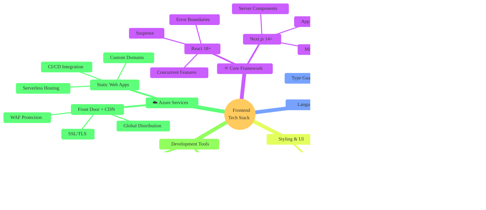
```mermaid
%%{init: {'theme':'base', 'themeVariables': {'fontSize': '14px', 'fontFamily': 'Arial, sans-serif'}}}%%
mindmap
  root((🎯 Frontend<br/>Tech Stack))
    ⚛️ Core Framework
      React 18+
        Concurrent Features
        Suspense
        Error Boundaries
      Next.js 14+
        App Router
        Server Components
        Middleware
    📝 Language & Types  
      TypeScript
        Strict Mode
        Advanced Types
        Type Guards
      JavaScript ES2023
        Modern Syntax
        Async/Await
        Modules
    🎨 Styling & UI
      Tailwind CSS
        Utility-First
        Custom Components
        Responsive Design
      Styled Components
        CSS-in-JS
        Theming
        Dynamic Styles
    🔧 Development Tools
      Vite/Webpack
        Hot Reload
        Tree Shaking
        Code Splitting
      ESLint + Prettier
        Code Quality
        Consistent Formatting
        Best Practices
    ☁️ Azure Services
      Static Web Apps
        Serverless Hosting
        CI/CD Integration
        Custom Domains
      Front Door + CDN
        Global Distribution
        WAF Protection
        SSL/TLS
```

### 🎭 **Rendering Strategy Matrix**

| Use Case | Strategy | Performance | SEO | Complexity |
|----------|----------|-------------|-----|------------|
| **🏠 Marketing Pages** | SSG | ⭐⭐⭐⭐⭐ | ⭐⭐⭐⭐⭐ | ⭐⭐ |
| **📊 User Dashboards** | CSR | ⭐⭐⭐ | ⭐ | ⭐⭐⭐ |
| **🛍️ E-commerce** | SSR | ⭐⭐⭐⭐ | ⭐⭐⭐⭐ | ⭐⭐⭐⭐ |
| **📰 Blog/News** | ISR | ⭐⭐⭐⭐⭐ | ⭐⭐⭐⭐⭐ | ⭐⭐⭐ |
| **💬 Real-time Apps** | Hybrid | ⭐⭐⭐⭐ | ⭐⭐⭐ | ⭐⭐⭐⭐⭐ |

## 🌐 Frontend Architecture Overview

```mermaid
%%{init: {'theme':'base', 'themeVariables': {'fontSize': '14px', 'fontFamily': 'Arial, sans-serif'}}}%%
graph TB
    subgraph USER_DEVICES ["📱 User Devices & Browsers"]
        WebBrowser[🌐 Web Browsers]
        MobileApp[📱 Mobile Apps]
        DesktopApp[🖥️ Desktop Apps]
        PWA[📲 Progressive Web Apps]
    end

    subgraph FRONTEND_PATTERNS ["🎨 Frontend Architecture Patterns"]
        subgraph RENDERING ["🖼️ Rendering Patterns"]
            CSR[⚛️ Client-Side Rendering]
            SSR[🏢 Server-Side Rendering]
            SSG[📄 Static Site Generation]
            ISR[🔄 Incremental Static Regeneration]
            Hybrid[🔗 Hybrid Rendering]
        end
        
        subgraph COMMUNICATION ["💬 Communication Patterns"]
            RestAPI[🔄 REST APIs]
            GraphQL[🔍 GraphQL]
            WebSocket[🔌 WebSocket]
            WebHooks[🪝 WebHooks]
            EventDriven[⚡ Event-Driven]
        end
        
        subgraph STATE_MANAGEMENT ["📊 State Management"]
            ClientState[💾 Client State]
            ServerState[🏢 Server State]
            CacheState[⚡ Cache State]
            OfflineState[📴 Offline State]
        end
    end

    subgraph FRONTEND_STACK ["⚙️ Frontend Technology Stack"]
        subgraph FRAMEWORKS ["🏗️ Frameworks & Libraries"]
            NextJS[⚛️ Next.js]
            React[⚛️ React]
            TypeScript[📝 TypeScript]
            TailwindCSS[🎨 Tailwind CSS]
        end
        
        subgraph DEVELOPMENT ["🛠️ Development Tools"]
            Vite[⚡ Vite/Webpack]
            ESLint[✅ ESLint]
            Prettier[💅 Prettier]
            Testing[🧪 Testing Suite]
        end
        
        subgraph DEPLOYMENT ["🚀 Deployment & Hosting"]
            StaticSites[📄 Azure Static Web Apps]
            AppService[☁️ Azure App Service]
            CDN[🌐 Azure CDN]
            FrontDoor[🚪 Azure Front Door]
        end
    end

    subgraph BACKEND_INTEGRATION ["🔗 Backend Integration"]
        subgraph API_LAYER ["🔌 API Layer"]
            APIGateway[🚪 API Management Gateway]
            GraphQLGateway[🔍 GraphQL Gateway]
            WebSocketServer[🔌 WebSocket Server]
            WebHookHandler[🪝 WebHook Handler]
        end
        
        subgraph DATA_SERVICES ["💾 Data Services"]
            Database[🗄️ Database]
            Cache[⚡ Redis Cache]
            Storage[📦 Blob Storage]
            Search[🔍 Cognitive Search]
        end
        
        subgraph EXTERNAL_SERVICES ["🌍 External Services"]
            ThirdPartyAPIs[🔌 Third-Party APIs]
            PaymentGateways[💳 Payment Gateways]
            AuthProviders[🔐 Auth Providers]
            CDNServices[🌐 CDN Services]
        end
    end

    subgraph INFRASTRUCTURE ["☁️ Azure Infrastructure"]
        subgraph COMPUTE ["⚙️ Compute Services"]
            AppServicePlan[🏢 App Service Plan]
            ContainerApps[📦 Container Apps]
            Functions[⚡ Azure Functions]
            Kubernetes[☸️ AKS]
        end
        
        subgraph NETWORKING ["🌐 Networking"]
            VirtualNetwork[🏠 Virtual Network]
            LoadBalancer[⚖️ Load Balancer]
            ApplicationGateway[🚪 Application Gateway]
            PrivateEndpoints[🔐 Private Endpoints]
        end
        
        subgraph MONITORING ["📊 Monitoring & Analytics"]
            AppInsights[📊 Application Insights]
            LogAnalytics[📝 Log Analytics]
            Monitor[📈 Azure Monitor]
            FrontDoorAnalytics[📊 Front Door Analytics]
        end
    end

    %% User Devices to Frontend Patterns
    WebBrowser --> CSR
    WebBrowser --> SSR
    MobileApp --> RestAPI
    DesktopApp --> WebSocket
    PWA --> Hybrid

    %% Frontend Patterns Connections
    CSR --> ClientState
    SSR --> ServerState
    SSG --> CacheState
    ISR --> CacheState
    Hybrid --> ClientState
    Hybrid --> ServerState

    RestAPI --> APIGateway
    GraphQL --> GraphQLGateway
    WebSocket --> WebSocketServer
    WebHooks --> WebHookHandler
    EventDriven --> WebSocketServer

    %% Frontend Stack to Deployment
    NextJS --> StaticSites
    React --> AppService
    TypeScript --> CDN
    TailwindCSS --> FrontDoor

    Vite --> StaticSites
    Testing --> AppService
    ESLint --> CDN
    Prettier --> FrontDoor

    %% Backend Integration
    APIGateway --> Database
    GraphQLGateway --> Cache
    WebSocketServer --> Storage
    WebHookHandler --> Search

    APIGateway --> ThirdPartyAPIs
    WebSocketServer --> PaymentGateways
    WebHookHandler --> AuthProviders
    CDN --> CDNServices

    %% Infrastructure Connections
    StaticSites --> AppServicePlan
    AppService --> ContainerApps
    CDN --> Functions
    FrontDoor --> Kubernetes

    StaticSites --> VirtualNetwork
    AppService --> LoadBalancer
    CDN --> ApplicationGateway
    FrontDoor --> PrivateEndpoints

    APIGateway --> AppInsights
    WebSocketServer --> LogAnalytics
    CDN --> Monitor
    FrontDoor --> FrontDoorAnalytics

    %% Styling
    style NextJS fill:#000000,stroke:#333333,stroke-width:3px,color:#fff
    style React fill:#61dafb,stroke:#21a0c4,stroke-width:2px,color:#000
    style TypeScript fill:#3178c6,stroke:#2d5aa0,stroke-width:2px,color:#fff
    style WebSocket fill:#ff6b6b,stroke:#e55656,stroke-width:2px,color:#fff
    style GraphQL fill:#e10098,stroke:#c51077,stroke-width:2px,color:#fff
    style StaticSites fill:#0078d4,stroke:#005a9e,stroke-width:3px,color:#fff
    style CDN fill:#ff9800,stroke:#f57c00,stroke-width:2px,color:#fff
    style AppInsights fill:#9c27b0,stroke:#7b1fa2,stroke-width:2px,color:#fff
```

## 🎨 Enterprise Design System Architecture

### 🎯 Design System Foundation & Figma Integration

```mermaid
%%{init: {'theme':'base', 'themeVariables': {'fontSize': '14px', 'fontFamily': 'Arial, sans-serif'}}}%%
graph TB
    subgraph DESIGN_TOOLS ["🎨 Design Tools & Workflow"]
        subgraph FIGMA_ECOSYSTEM ["🎨 Figma Ecosystem"]
            FigmaDesigns[🎨 Figma Design Files<br/>UI Components & Layouts]
            FigmaTokens[🎯 Figma Design Tokens<br/>Colors, Typography, Spacing]
            FigmaComponents[🧩 Figma Component Library<br/>Master Components]
            FigmaDevMode[🔧 Figma Dev Mode<br/>Design Handoff & Specs]
        end
        
        subgraph DESIGN_TOKENS ["🎯 Design Token System"]
            ColorTokens[🎨 Color Tokens<br/>Primary, Secondary, Semantic]
            TypographyTokens[📝 Typography Tokens<br/>Fonts, Sizes, Line Heights]
            SpacingTokens[📏 Spacing Tokens<br/>Margins, Padding, Grid]
            RadiusTokens[🔵 Border Radius Tokens<br/>Corner Styles]
            ShadowTokens[🌑 Shadow Tokens<br/>Elevation Levels]
            MotionTokens[⚡ Motion Tokens<br/>Transitions, Animations]
        end
    end

    subgraph IMPLEMENTATION_LAYER ["⚙️ Implementation Layer"]
        subgraph TOKEN_GENERATION ["🔄 Token Generation"]
            StyleDictionary[📚 Style Dictionary<br/>Token Transformation]
            CSSVariables[🎨 CSS Custom Properties<br/>Runtime Tokens]
            JSTokens[📝 JavaScript Tokens<br/>Typed Token Objects]
            TailwindConfig[🎨 Tailwind Config<br/>Utility Classes]
        end
        
        subgraph BRAND_SYSTEM ["🏢 Brand System"]
            BrandGuidelines[📏 Brand Guidelines<br/>Logo, Voice, Messaging]
            IconLibrary[🎯 Icon Library<br/>SVG Icon System]
            IllustrationSystem[🎨 Illustration System<br/>Brand Illustrations]
            PhotographyGuidelines[📸 Photography Guidelines<br/>Style & Treatment]
        end
    end

    subgraph THEME_MANAGEMENT ["🌙 Theme Management"]
        subgraph THEME_SYSTEM ["🎨 Multi-Theme System"]
            LightTheme[☀️ Light Theme<br/>Default Brand Colors]
            DarkTheme[🌙 Dark Theme<br/>Dark Mode Variants]
            HighContrastTheme[🔆 High Contrast<br/>Accessibility Theme]
            CustomThemes[🎨 Custom Themes<br/>White Label Brands]
        end
        
        subgraph THEME_SWITCHING ["🔄 Dynamic Theme Switching"]
            ThemeProvider[🎯 Theme Provider<br/>React Context]
            ThemeStorage[💾 Theme Persistence<br/>Local Storage]
            SystemPreference[⚙️ System Preference<br/>OS Theme Detection]
            ThemeToggle[🔄 Theme Toggle<br/>User Controls]
        end
    end

    %% Design Workflow Connections
    FigmaDesigns --> FigmaTokens
    FigmaTokens --> StyleDictionary
    FigmaComponents --> FigmaDevMode
    FigmaDevMode --> CSSVariables
    
    %% Token System Connections
    ColorTokens --> CSSVariables
    TypographyTokens --> CSSVariables
    SpacingTokens --> TailwindConfig
    RadiusTokens --> CSSVariables
    ShadowTokens --> CSSVariables
    MotionTokens --> JSTokens
    
    StyleDictionary --> CSSVariables
    StyleDictionary --> JSTokens
    StyleDictionary --> TailwindConfig
    
    %% Brand System Connections
    BrandGuidelines --> ColorTokens
    IconLibrary --> JSTokens
    IllustrationSystem --> FigmaComponents
    PhotographyGuidelines --> BrandGuidelines
    
    %% Theme System Connections
    CSSVariables --> LightTheme
    CSSVariables --> DarkTheme
    CSSVariables --> HighContrastTheme
    CSSVariables --> CustomThemes
    
    LightTheme --> ThemeProvider
    DarkTheme --> ThemeProvider
    HighContrastTheme --> ThemeProvider
    CustomThemes --> ThemeProvider
    
    ThemeProvider --> ThemeStorage
    SystemPreference --> ThemeToggle
    ThemeToggle --> ThemeProvider

    %% Styling
    style DESIGN_TOOLS fill:#fce4ec,stroke:#c2185b,stroke-width:3px
    style IMPLEMENTATION_LAYER fill:#e3f2fd,stroke:#1976d2,stroke-width:3px
    style THEME_MANAGEMENT fill:#f3e5f5,stroke:#7b1fa2,stroke-width:3px
    
    style FigmaDesigns fill:#f24e1e,stroke:#e03d00,stroke-width:2px,color:#fff
    style StyleDictionary fill:#ff6f00,stroke:#e65100,stroke-width:2px,color:#fff
    style ThemeProvider fill:#9c27b0,stroke:#7b1fa2,stroke-width:2px,color:#fff
```

### 🧩 Atomic Design Component Architecture

```mermaid
%%{init: {'theme':'base', 'themeVariables': {'fontSize': '14px', 'fontFamily': 'Arial, sans-serif'}}}%%
graph TB
    subgraph ATOMIC_DESIGN ["⚛️ Atomic Design Methodology"]
        subgraph ATOMS ["⚛️ Atoms - Basic Building Blocks"]
            Button[🔘 Button<br/>Primary, Secondary, Tertiary]
            Input[📝 Input<br/>Text, Email, Password]
            Label[🏷️ Label<br/>Form Labels & Descriptions]
            Icon[🎯 Icon<br/>SVG Icon Components]
            Avatar[👤 Avatar<br/>User Profile Images]
            Badge[🏷️ Badge<br/>Status & Notification]
            Spinner[⏳ Spinner<br/>Loading Indicators]
            Tooltip[💬 Tooltip<br/>Contextual Help]
        end
        
        subgraph MOLECULES ["🔗 Molecules - Component Combinations"]
            SearchBox[🔍 Search Box<br/>Input + Button + Icon]
            FormField[📋 Form Field<br/>Label + Input + Validation]
            CardHeader[📋 Card Header<br/>Title + Subtitle + Actions]
            NavigationItem[🔗 Navigation Item<br/>Icon + Label + Badge]
            UserProfile[👤 User Profile<br/>Avatar + Name + Status]
            Pagination[📄 Pagination<br/>Numbers + Navigation]
            ProgressBar[📊 Progress Bar<br/>Indicator + Label]
            Breadcrumb[🍞 Breadcrumb<br/>Navigation Path]
        end
        
        subgraph ORGANISMS ["🏛️ Organisms - Complex Components"]
            Header[📋 Header<br/>Navigation + Logo + User Menu]
            Sidebar[📂 Sidebar<br/>Navigation + User Info]
            DataTable[📊 Data Table<br/>Headers + Rows + Actions]
            Modal[📱 Modal<br/>Header + Content + Actions]
            Card[📋 Card<br/>Header + Content + Footer]
            Form[📝 Form<br/>Fields + Validation + Actions]
            Chart[📊 Chart<br/>Data Visualization]
            Calendar[📅 Calendar<br/>Date Selection Interface]
        end
        
        subgraph TEMPLATES ["📐 Templates - Layout Structures"]
            DashboardTemplate[📊 Dashboard Template<br/>Header + Sidebar + Content]
            FormTemplate[📝 Form Template<br/>Multi-step Form Layout]
            ListTemplate[📋 List Template<br/>Searchable Data Lists]
            DetailTemplate[📋 Detail Template<br/>Item Detail Views]
            LandingTemplate[🏠 Landing Template<br/>Marketing Page Layout]
            AuthTemplate[🔐 Auth Template<br/>Login/Register Pages]
        end
    end

    subgraph COMPONENT_FEATURES ["🔧 Component Features & Patterns"]
        subgraph COMPOSITION ["🧩 Component Composition"]
            CompoundComponents[🔗 Compound Components<br/>Flexible API Design]
            RenderProps[⚛️ Render Props<br/>Flexible Rendering]
            PolymorphicComponents[🔄 Polymorphic Components<br/>Element Type Flexibility]
            ForwardRef[↗️ Forward Ref<br/>Ref Forwarding]
        end
        
        subgraph ACCESSIBILITY ["♿ Accessibility Features"]
            KeyboardNavigation[⌨️ Keyboard Navigation<br/>Tab Order & Focus]
            ScreenReaderSupport[👁️ Screen Reader Support<br/>ARIA Labels & Descriptions]
            FocusManagement[🎯 Focus Management<br/>Trap & Restoration]
            ColorContrast[🎨 Color Contrast<br/>WCAG Compliance]
        end
        
        subgraph PERFORMANCE ["⚡ Performance Optimization"]
            LazyLoading[📦 Lazy Loading<br/>Code Splitting]
            Memoization[💾 Memoization<br/>React.memo & useMemo]
            VirtualScrolling[📜 Virtual Scrolling<br/>Large Lists]
            TreeShaking[🌳 Tree Shaking<br/>Bundle Optimization]
        end
    end

    %% Atomic Design Flow
    Button --> SearchBox
    Input --> SearchBox
    Icon --> SearchBox
    
    Label --> FormField
    Input --> FormField
    
    Icon --> NavigationItem
    Label --> NavigationItem
    Badge --> NavigationItem
    
    Avatar --> UserProfile
    Label --> UserProfile
    Badge --> UserProfile
    
    SearchBox --> Header
    NavigationItem --> Header
    UserProfile --> Header
    
    NavigationItem --> Sidebar
    UserProfile --> Sidebar
    
    FormField --> Form
    Button --> Form
    
    CardHeader --> Card
    Button --> Card
    
    Header --> DashboardTemplate
    Sidebar --> DashboardTemplate
    Card --> DashboardTemplate
    
    Form --> FormTemplate
    Button --> FormTemplate
    
    %% Feature Integration
    CompoundComponents --> Card
    RenderProps --> DataTable
    PolymorphicComponents --> Button
    ForwardRef --> Input
    
    KeyboardNavigation --> Modal
    ScreenReaderSupport --> Form
    FocusManagement --> Modal
    ColorContrast --> Button
    
    LazyLoading --> Chart
    Memoization --> DataTable
    VirtualScrolling --> DataTable
    TreeShaking --> Icon

    %% Styling
    style ATOMIC_DESIGN fill:#e8f5e8,stroke:#4caf50,stroke-width:3px
    style COMPONENT_FEATURES fill:#fff3e0,stroke:#ff9800,stroke-width:3px
    
    style Button fill:#2196f3,stroke:#1976d2,stroke-width:2px,color:#fff
    style SearchBox fill:#4caf50,stroke:#388e3c,stroke-width:2px,color:#fff
    style Header fill:#9c27b0,stroke:#7b1fa2,stroke-width:2px,color:#fff
    style DashboardTemplate fill:#ff5722,stroke:#d84315,stroke-width:2px,color:#fff
```

### ♿ Semantic HTML & ARIA Architecture

```mermaid
%%{init: {'theme':'base', 'themeVariables': {'fontSize': '14px', 'fontFamily': 'Arial, sans-serif'}}}%%
graph TB
    subgraph SEMANTIC_HTML ["🏷️ Semantic HTML Foundation"]
        subgraph DOCUMENT_STRUCTURE ["📄 Document Structure"]
            HTMLDocument[📄 HTML Document<br/>lang, dir, role]
            HeaderElement[📋 Header Element<br/>Site/Page Header]
            MainElement[📄 Main Element<br/>Primary Content]
            FooterElement[📋 Footer Element<br/>Site/Page Footer]
            AsideElement[📂 Aside Element<br/>Sidebar Content]
            NavElement[🔗 Nav Element<br/>Navigation Menus]
            SectionElement[📋 Section Element<br/>Content Sections]
            ArticleElement[📄 Article Element<br/>Standalone Content]
        end
        
        subgraph FORM_ELEMENTS ["📝 Accessible Form Elements"]
            FormElement[📝 Form Element<br/>action, method, novalidate]
            FieldsetElement[🔲 Fieldset Element<br/>Related Form Controls]
            LegendElement[📋 Legend Element<br/>Fieldset Description]
            LabelElement[🏷️ Label Element<br/>for, aria-labelledby]
            InputElement[📝 Input Element<br/>type, required, aria-*]
            TextareaElement[📝 Textarea Element<br/>rows, cols, maxlength]
            SelectElement[📋 Select Element<br/>multiple, size]
            ButtonElement[🔘 Button Element<br/>type, disabled]
        end
        
        subgraph CONTENT_ELEMENTS ["📚 Content Elements"]
            HeadingElements[📋 Heading Elements<br/>h1, h2, h3, h4, h5, h6]
            ListElements[📋 List Elements<br/>ul, ol, dl]
            TableElements[📊 Table Elements<br/>table, thead, tbody, tfoot]
            MediaElements[🎥 Media Elements<br/>img, video, audio]
            LinkElements[🔗 Link Elements<br/>a, href, target]
        end
    end

    subgraph ARIA_IMPLEMENTATION ["🔊 ARIA Implementation"]
        subgraph ARIA_ROLES ["🎭 ARIA Roles"]
            LandmarkRoles[🗺️ Landmark Roles<br/>banner, main, navigation]
            WidgetRoles[🔧 Widget Roles<br/>button, dialog, menu]
            DocumentRoles[📄 Document Roles<br/>article, document, img]
            CompositeRoles[🧩 Composite Roles<br/>grid, listbox, tablist]
        end
        
        subgraph ARIA_PROPERTIES ["📋 ARIA Properties"]
            LabelProperties[🏷️ Label Properties<br/>aria-label, aria-labelledby]
            DescriptionProperties[📄 Description Properties<br/>aria-describedby, aria-details]
            RelationshipProperties[🔗 Relationship Properties<br/>aria-controls, aria-owns]
            DragDropProperties[🎯 Drag & Drop Properties<br/>aria-grabbed, aria-dropeffect]
        end
        
        subgraph ARIA_STATES ["⚡ ARIA States"]
            InteractionStates[🔄 Interaction States<br/>aria-expanded, aria-selected]
            VisibilityStates[👁️ Visibility States<br/>aria-hidden, aria-modal]
            ValidationStates[✅ Validation States<br/>aria-invalid, aria-required]
            BusyStates[⏳ Busy States<br/>aria-busy, aria-live]
        end
        
        subgraph LIVE_REGIONS ["📢 Live Regions"]
            LiveRegionTypes[📢 Live Region Types<br/>polite, assertive, off]
            LiveRegionUpdates[🔄 Live Updates<br/>aria-atomic, aria-relevant]
            StatusAnnouncements[📢 Status Announcements<br/>Success, Error Messages]
            ProgressAnnouncements[📊 Progress Updates<br/>Loading, Completion States]
        end
    end

    subgraph ACCESSIBILITY_PATTERNS ["♿ Accessibility Patterns"]
        subgraph NAVIGATION_PATTERNS ["🔗 Navigation Patterns"]
            SkipLinks[⏭️ Skip Links<br/>Skip to Main Content]
            FocusManagement[🎯 Focus Management<br/>Tab Order & Focus Trap]
            KeyboardNavigation[⌨️ Keyboard Navigation<br/>Arrow Keys, Enter, Escape]
            Breadcrumbs[🍞 Breadcrumb Navigation<br/>Hierarchical Path]
        end
        
        subgraph INTERACTION_PATTERNS ["🔄 Interaction Patterns"]
            ModalDialogs[📱 Modal Dialogs<br/>Focus Trap & Restoration]
            DropdownMenus[📋 Dropdown Menus<br/>ARIA Menu Pattern]
            TabPanels[📑 Tab Panels<br/>ARIA Tablist Pattern]
            Accordions[📂 Accordions<br/>Collapsible Content]
        end
        
        subgraph FEEDBACK_PATTERNS ["📢 Feedback Patterns"]
            ErrorHandling[❌ Error Handling<br/>Inline & Summary Errors]
            LoadingStates[⏳ Loading States<br/>Spinner & Progress]
            SuccessMessages[✅ Success Messages<br/>Action Confirmations]
            NotificationSystem[📢 Notifications<br/>Toast & Alert Messages]
        end
    end

    %% Document Structure Flow
    HTMLDocument --> HeaderElement
    HTMLDocument --> MainElement
    HTMLDocument --> FooterElement
    HeaderElement --> NavElement
    MainElement --> SectionElement
    MainElement --> ArticleElement
    SectionElement --> AsideElement
    
    %% Form Structure Flow
    FormElement --> FieldsetElement
    FieldsetElement --> LegendElement
    FieldsetElement --> LabelElement
    LabelElement --> InputElement
    LabelElement --> TextareaElement
    LabelElement --> SelectElement
    FormElement --> ButtonElement
    
    %% ARIA Integration
    HeaderElement --> LandmarkRoles
    NavElement --> LandmarkRoles
    MainElement --> LandmarkRoles
    ButtonElement --> WidgetRoles
    FormElement --> DocumentRoles
    
    LabelElement --> LabelProperties
    InputElement --> DescriptionProperties
    ButtonElement --> RelationshipProperties
    
    ButtonElement --> InteractionStates
    ModalDialogs --> VisibilityStates
    FormElement --> ValidationStates
    LoadingStates --> BusyStates
    
    %% Accessibility Pattern Integration
    HeaderElement --> SkipLinks
    NavElement --> KeyboardNavigation
    ButtonElement --> FocusManagement
    
    ModalDialogs --> WidgetRoles
    DropdownMenus --> CompositeRoles
    TabPanels --> CompositeRoles
    Accordions --> InteractionStates
    
    ErrorHandling --> ValidationStates
    LoadingStates --> LiveRegionTypes
    SuccessMessages --> StatusAnnouncements
    NotificationSystem --> LiveRegionUpdates

    %% Styling
    style SEMANTIC_HTML fill:#e8f5e8,stroke:#4caf50,stroke-width:3px
    style ARIA_IMPLEMENTATION fill:#e3f2fd,stroke:#2196f3,stroke-width:3px
    style ACCESSIBILITY_PATTERNS fill:#fce4ec,stroke:#e91e63,stroke-width:3px
    
    style HTMLDocument fill:#4caf50,stroke:#388e3c,stroke-width:2px,color:#fff
    style LandmarkRoles fill:#2196f3,stroke:#1976d2,stroke-width:2px,color:#fff
    style ModalDialogs fill:#e91e63,stroke:#c2185b,stroke-width:2px,color:#fff
```

## 🖼️ Rendering Architecture Patterns

### ⚛️ Client-Side Rendering (CSR) Flow

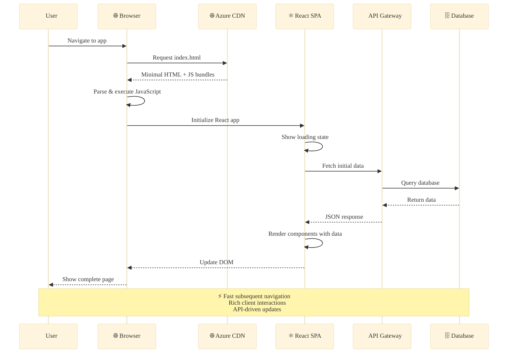
```mermaid
%%{init: {'theme':'base', 'themeVariables': {'fontSize': '12px', 'fontFamily': 'Arial, sans-serif'}}}%%
sequenceDiagram
    participant User as 👤 User
    participant Browser as 🌐 Browser
    participant CDN as 🌐 Azure CDN
    participant SPA as ⚛️ React SPA
    participant API as 🔌 API Gateway
    participant DB as 🗄️ Database

    User->>Browser: Navigate to app
    Browser->>CDN: Request index.html
    CDN-->>Browser: Minimal HTML + JS bundles
    Browser->>Browser: Parse & execute JavaScript
    Browser->>SPA: Initialize React app
    SPA->>SPA: Show loading state
    SPA->>API: Fetch initial data
    API->>DB: Query database
    DB-->>API: Return data
    API-->>SPA: JSON response
    SPA->>SPA: Render components with data
    SPA-->>Browser: Update DOM
    Browser-->>User: Show complete page

    Note over User,DB: ⚡ Fast subsequent navigation<br/>💾 Rich client interactions<br/>🔄 API-driven updates
```

### 🏢 Server-Side Rendering (SSR) Flow

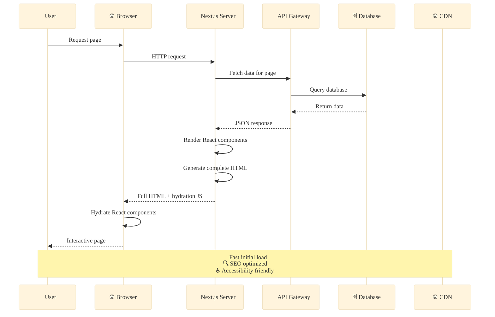
```mermaid
%%{init: {'theme':'base', 'themeVariables': {'fontSize': '12px', 'fontFamily': 'Arial, sans-serif'}}}%%
sequenceDiagram
    participant User as 👤 User
    participant Browser as 🌐 Browser
    participant NextJS as 🏢 Next.js Server
    participant API as 🔌 API Gateway
    participant DB as 🗄️ Database
    participant CDN as 🌐 CDN

    User->>Browser: Request page
    Browser->>NextJS: HTTP request
    NextJS->>API: Fetch data for page
    API->>DB: Query database
    DB-->>API: Return data
    API-->>NextJS: JSON response
    NextJS->>NextJS: Render React components
    NextJS->>NextJS: Generate complete HTML
    NextJS-->>Browser: Full HTML + hydration JS
    Browser->>Browser: Hydrate React components
    Browser-->>User: Interactive page

    Note over User,CDN: 🚀 Fast initial load<br/>🔍 SEO optimized<br/>♿ Accessibility friendly
```

### 📄 Static Site Generation (SSG) Flow

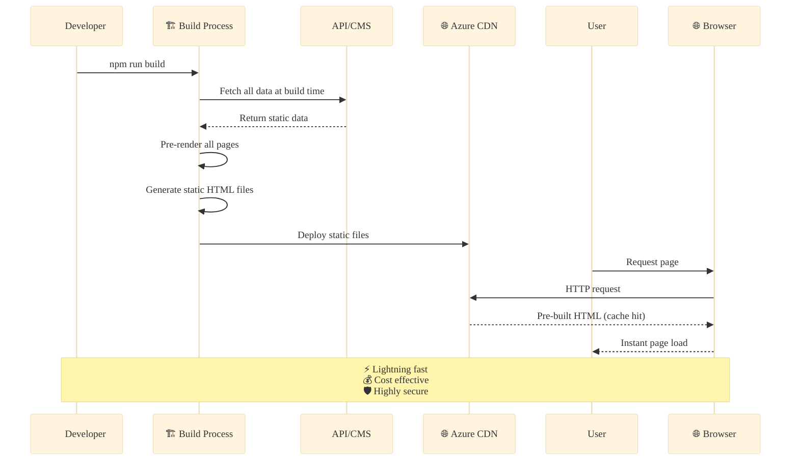
```mermaid
%%{init: {'theme':'base', 'themeVariables': {'fontSize': '12px', 'fontFamily': 'Arial, sans-serif'}}}%%
sequenceDiagram
    participant Dev as 👨‍💻 Developer
    participant Build as 🏗️ Build Process
    participant API as 🔌 API/CMS
    participant CDN as 🌐 Azure CDN
    participant User as 👤 User
    participant Browser as 🌐 Browser

    Dev->>Build: npm run build
    Build->>API: Fetch all data at build time
    API-->>Build: Return static data
    Build->>Build: Pre-render all pages
    Build->>Build: Generate static HTML files
    Build->>CDN: Deploy static files
    
    User->>Browser: Request page
    Browser->>CDN: HTTP request
    CDN-->>Browser: Pre-built HTML (cache hit)
    Browser-->>User: Instant page load

    Note over Dev,Browser: ⚡ Lightning fast<br/>💰 Cost effective<br/>🛡️ Highly secure
```

### 🔄 Incremental Static Regeneration (ISR) Flow

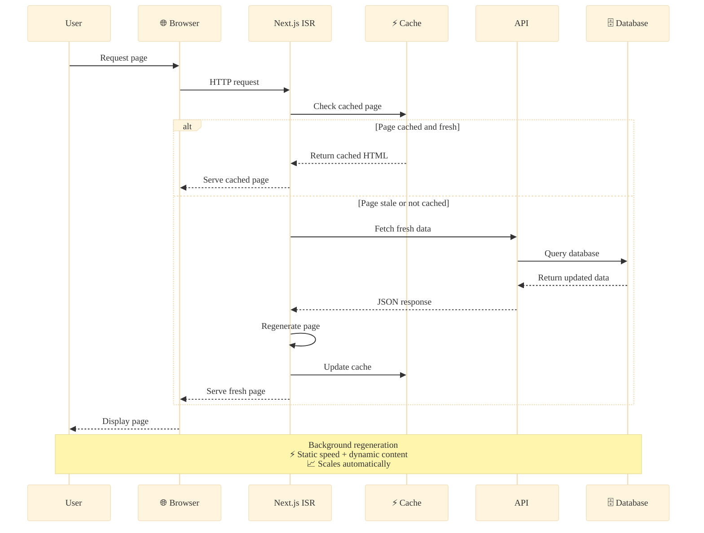
```mermaid
%%{init: {'theme':'base', 'themeVariables': {'fontSize': '12px', 'fontFamily': 'Arial, sans-serif'}}}%%
sequenceDiagram
    participant User as 👤 User
    participant Browser as 🌐 Browser
    participant NextJS as 🔄 Next.js ISR
    participant Cache as ⚡ Cache
    participant API as 🔌 API
    participant DB as 🗄️ Database

    User->>Browser: Request page
    Browser->>NextJS: HTTP request
    NextJS->>Cache: Check cached page
    
    alt Page cached and fresh
        Cache-->>NextJS: Return cached HTML
        NextJS-->>Browser: Serve cached page
    else Page stale or not cached
        NextJS->>API: Fetch fresh data
        API->>DB: Query database
        DB-->>API: Return updated data
        API-->>NextJS: JSON response
        NextJS->>NextJS: Regenerate page
        NextJS->>Cache: Update cache
        NextJS-->>Browser: Serve fresh page
    end
    
    Browser-->>User: Display page

    Note over User,DB: 🔄 Background regeneration<br/>⚡ Static speed + dynamic content<br/>📈 Scales automatically
```

### 🔗 Hybrid Rendering Flow

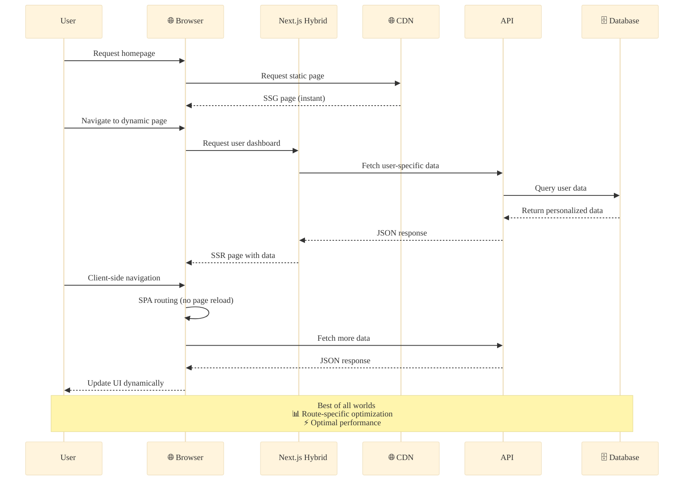
```mermaid
%%{init: {'theme':'base', 'themeVariables': {'fontSize': '12px', 'fontFamily': 'Arial, sans-serif'}}}%%
sequenceDiagram
    participant User as 👤 User
    participant Browser as 🌐 Browser
    participant NextJS as 🔗 Next.js Hybrid
    participant CDN as 🌐 CDN
    participant API as 🔌 API
    participant DB as 🗄️ Database

    User->>Browser: Request homepage
    Browser->>CDN: Request static page
    CDN-->>Browser: SSG page (instant)
    
    User->>Browser: Navigate to dynamic page
    Browser->>NextJS: Request user dashboard
    NextJS->>API: Fetch user-specific data
    API->>DB: Query user data
    DB-->>API: Return personalized data
    API-->>NextJS: JSON response
    NextJS-->>Browser: SSR page with data
    
    User->>Browser: Client-side navigation
    Browser->>Browser: SPA routing (no page reload)
    Browser->>API: Fetch more data
    API-->>Browser: JSON response
    Browser-->>User: Update UI dynamically

    Note over User,DB: 🎯 Best of all worlds<br/>📊 Route-specific optimization<br/>⚡ Optimal performance
```

## 💬 Communication Patterns

### 🔄 REST API Communication Flow

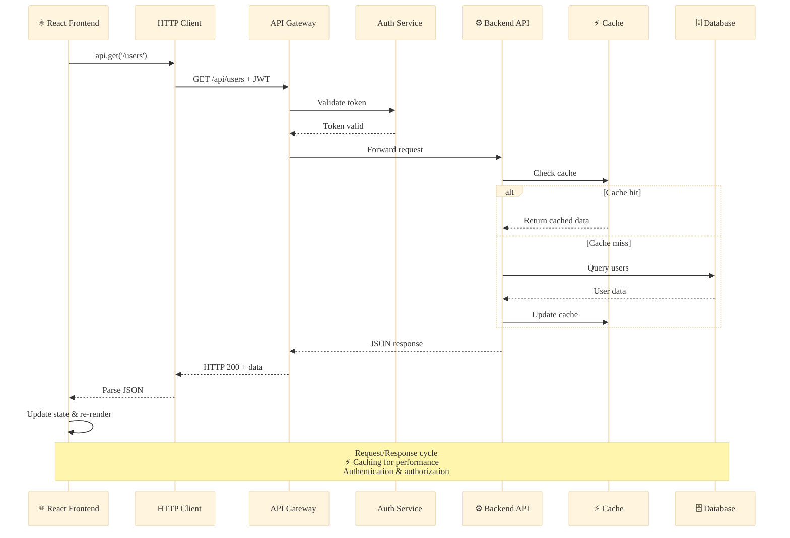
```mermaid
%%{init: {'theme':'base', 'themeVariables': {'fontSize': '12px', 'fontFamily': 'Arial, sans-serif'}}}%%
sequenceDiagram
    participant Frontend as ⚛️ React Frontend
    participant HTTPClient as 📡 HTTP Client
    participant APIGateway as 🚪 API Gateway
    participant Auth as 🔐 Auth Service
    participant Backend as ⚙️ Backend API
    participant Cache as ⚡ Cache
    participant DB as 🗄️ Database

    Frontend->>HTTPClient: api.get('/users')
    HTTPClient->>APIGateway: GET /api/users + JWT
    APIGateway->>Auth: Validate token
    Auth-->>APIGateway: Token valid
    APIGateway->>Backend: Forward request
    Backend->>Cache: Check cache
    
    alt Cache hit
        Cache-->>Backend: Return cached data
    else Cache miss
        Backend->>DB: Query users
        DB-->>Backend: User data
        Backend->>Cache: Update cache
    end
    
    Backend-->>APIGateway: JSON response
    APIGateway-->>HTTPClient: HTTP 200 + data
    HTTPClient-->>Frontend: Parse JSON
    Frontend->>Frontend: Update state & re-render

    Note over Frontend,DB: 🔄 Request/Response cycle<br/>⚡ Caching for performance<br/>🔐 Authentication & authorization
```

### 🔍 GraphQL Communication Flow

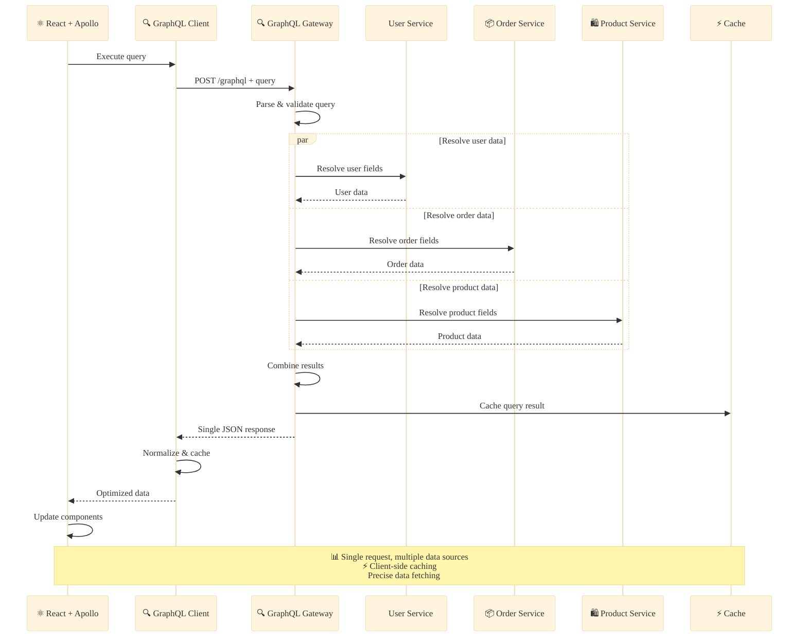
```mermaid
%%{init: {'theme':'base', 'themeVariables': {'fontSize': '12px', 'fontFamily': 'Arial, sans-serif'}}}%%
sequenceDiagram
    participant Frontend as ⚛️ React + Apollo
    participant GraphQL as 🔍 GraphQL Client
    participant Gateway as 🔍 GraphQL Gateway
    participant UserAPI as 👤 User Service
    participant OrderAPI as 📦 Order Service
    participant ProductAPI as 🛍️ Product Service
    participant Cache as ⚡ Cache

    Frontend->>GraphQL: Execute query
    GraphQL->>Gateway: POST /graphql + query
    Gateway->>Gateway: Parse & validate query
    
    par Resolve user data
        Gateway->>UserAPI: Resolve user fields
        UserAPI-->>Gateway: User data
    and Resolve order data
        Gateway->>OrderAPI: Resolve order fields
        OrderAPI-->>Gateway: Order data
    and Resolve product data
        Gateway->>ProductAPI: Resolve product fields
        ProductAPI-->>Gateway: Product data
    end
    
    Gateway->>Gateway: Combine results
    Gateway->>Cache: Cache query result
    Gateway-->>GraphQL: Single JSON response
    GraphQL->>GraphQL: Normalize & cache
    GraphQL-->>Frontend: Optimized data
    Frontend->>Frontend: Update components

    Note over Frontend,Cache: 📊 Single request, multiple data sources<br/>⚡ Client-side caching<br/>🎯 Precise data fetching
```

### 🔌 WebSocket Real-Time Communication

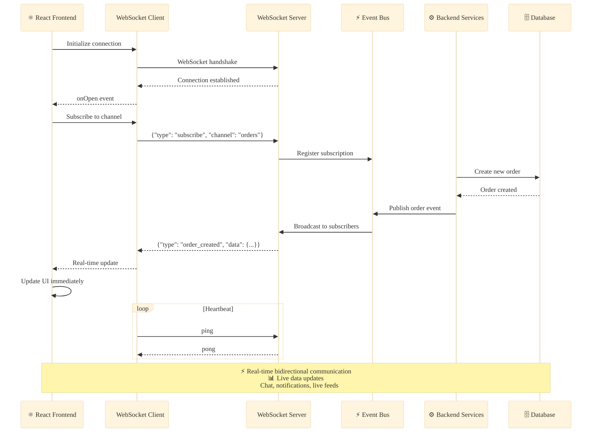
```mermaid
%%{init: {'theme':'base', 'themeVariables': {'fontSize': '12px', 'fontFamily': 'Arial, sans-serif'}}}%%
sequenceDiagram
    participant Frontend as ⚛️ React Frontend
    participant WSClient as 🔌 WebSocket Client
    participant WSServer as 🔌 WebSocket Server
    participant EventBus as ⚡ Event Bus
    participant Backend as ⚙️ Backend Services
    participant DB as 🗄️ Database

    Frontend->>WSClient: Initialize connection
    WSClient->>WSServer: WebSocket handshake
    WSServer-->>WSClient: Connection established
    WSClient-->>Frontend: onOpen event
    
    Frontend->>WSClient: Subscribe to channel
    WSClient->>WSServer: {"type": "subscribe", "channel": "orders"}
    WSServer->>EventBus: Register subscription
    
    Backend->>DB: Create new order
    DB-->>Backend: Order created
    Backend->>EventBus: Publish order event
    EventBus->>WSServer: Broadcast to subscribers
    WSServer-->>WSClient: {"type": "order_created", "data": {...}}
    WSClient-->>Frontend: Real-time update
    Frontend->>Frontend: Update UI immediately
    
    loop Heartbeat
        WSClient->>WSServer: ping
        WSServer-->>WSClient: pong
    end

    Note over Frontend,DB: ⚡ Real-time bidirectional communication<br/>📊 Live data updates<br/>💬 Chat, notifications, live feeds
```

### 🪝 WebHook Integration Pattern

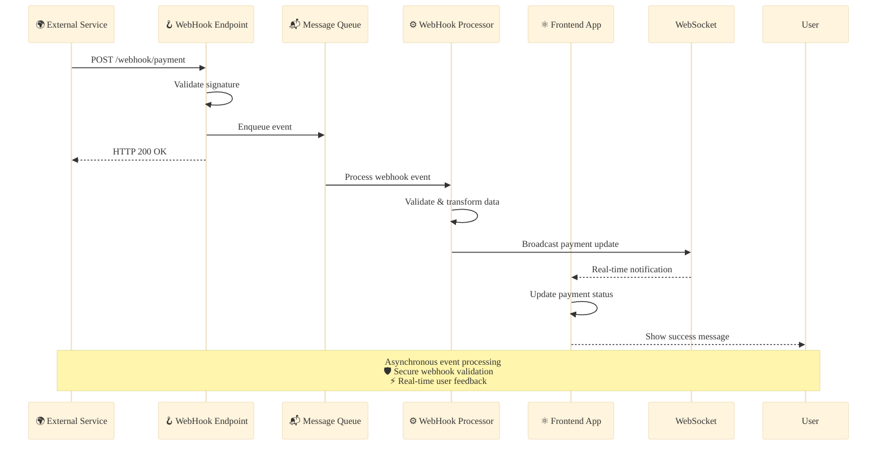
```mermaid
%%{init: {'theme':'base', 'themeVariables': {'fontSize': '12px', 'fontFamily': 'Arial, sans-serif'}}}%%
sequenceDiagram
    participant External as 🌍 External Service
    participant Webhook as 🪝 WebHook Endpoint
    participant Queue as 📬 Message Queue
    participant Processor as ⚙️ WebHook Processor
    participant Frontend as ⚛️ Frontend App
    participant WebSocket as 🔌 WebSocket
    participant User as 👤 User

    External->>Webhook: POST /webhook/payment
    Webhook->>Webhook: Validate signature
    Webhook->>Queue: Enqueue event
    Webhook-->>External: HTTP 200 OK
    
    Queue->>Processor: Process webhook event
    Processor->>Processor: Validate & transform data
    Processor->>WebSocket: Broadcast payment update
    WebSocket-->>Frontend: Real-time notification
    Frontend->>Frontend: Update payment status
    Frontend-->>User: Show success message
    
    Note over External,User: 🔄 Asynchronous event processing<br/>🛡️ Secure webhook validation<br/>⚡ Real-time user feedback
```

## 📊 State Management Architecture

### 💾 Client State Management Flow

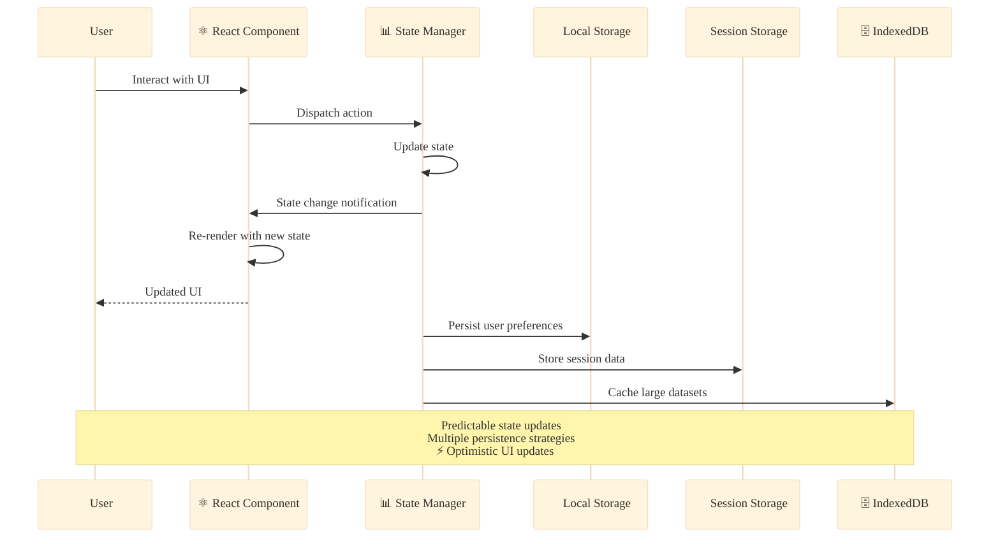
```mermaid
%%{init: {'theme':'base', 'themeVariables': {'fontSize': '12px', 'fontFamily': 'Arial, sans-serif'}}}%%
sequenceDiagram
    participant User as 👤 User
    participant Component as ⚛️ React Component
    participant StateManager as 📊 State Manager
    participant LocalStorage as 💾 Local Storage
    participant SessionStorage as 🔄 Session Storage
    participant IndexedDB as 🗄️ IndexedDB

    User->>Component: Interact with UI
    Component->>StateManager: Dispatch action
    StateManager->>StateManager: Update state
    StateManager->>Component: State change notification
    Component->>Component: Re-render with new state
    Component-->>User: Updated UI
    
    StateManager->>LocalStorage: Persist user preferences
    StateManager->>SessionStorage: Store session data
    StateManager->>IndexedDB: Cache large datasets
    
    Note over User,IndexedDB: 🎯 Predictable state updates<br/>💾 Multiple persistence strategies<br/>⚡ Optimistic UI updates
```

### ⚡ Caching Strategy Architecture

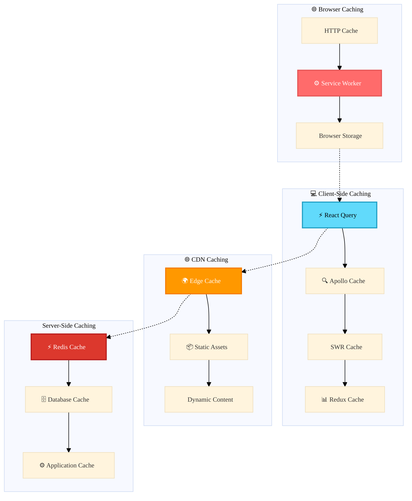
```mermaid
%%{init: {'theme':'base', 'themeVariables': {'fontSize': '12px', 'fontFamily': 'Arial, sans-serif'}}}%%
graph TB
    subgraph BROWSER_CACHE ["🌐 Browser Caching"]
        HTTPCache[📄 HTTP Cache]
        ServiceWorker[⚙️ Service Worker]
        BrowserStorage[💾 Browser Storage]
    end
    
    subgraph CLIENT_CACHE ["💻 Client-Side Caching"]
        ReactQuery[⚡ React Query]
        Apollo[🔍 Apollo Cache]
        SWRCache[🔄 SWR Cache]
        ReduxCache[📊 Redux Cache]
    end
    
    subgraph CDN_CACHE ["🌐 CDN Caching"]
        EdgeCache[🌍 Edge Cache]
        StaticAssets[📦 Static Assets]
        DynamicContent[🔄 Dynamic Content]
    end
    
    subgraph SERVER_CACHE ["🏢 Server-Side Caching"]
        RedisCache[⚡ Redis Cache]
        DatabaseCache[🗄️ Database Cache]
        ApplicationCache[⚙️ Application Cache]
    end
    
    HTTPCache --> ServiceWorker
    ServiceWorker --> BrowserStorage
    
    ReactQuery --> Apollo
    Apollo --> SWRCache
    SWRCache --> ReduxCache
    
    EdgeCache --> StaticAssets
    StaticAssets --> DynamicContent
    
    RedisCache --> DatabaseCache
    DatabaseCache --> ApplicationCache
    
    %% Cross-layer connections
    BrowserStorage -.-> ReactQuery
    ReactQuery -.-> EdgeCache
    EdgeCache -.-> RedisCache
    
    style ReactQuery fill:#61dafb,stroke:#21a0c4,stroke-width:2px,color:#000
    style ServiceWorker fill:#ff6b6b,stroke:#e55656,stroke-width:2px,color:#fff
    style EdgeCache fill:#ff9800,stroke:#f57c00,stroke-width:2px,color:#fff
    style RedisCache fill:#dc382d,stroke:#b71c1c,stroke-width:2px,color:#fff
```

## 🛠️ Frontend SDK Architecture

### 📚 SDK Development Pattern

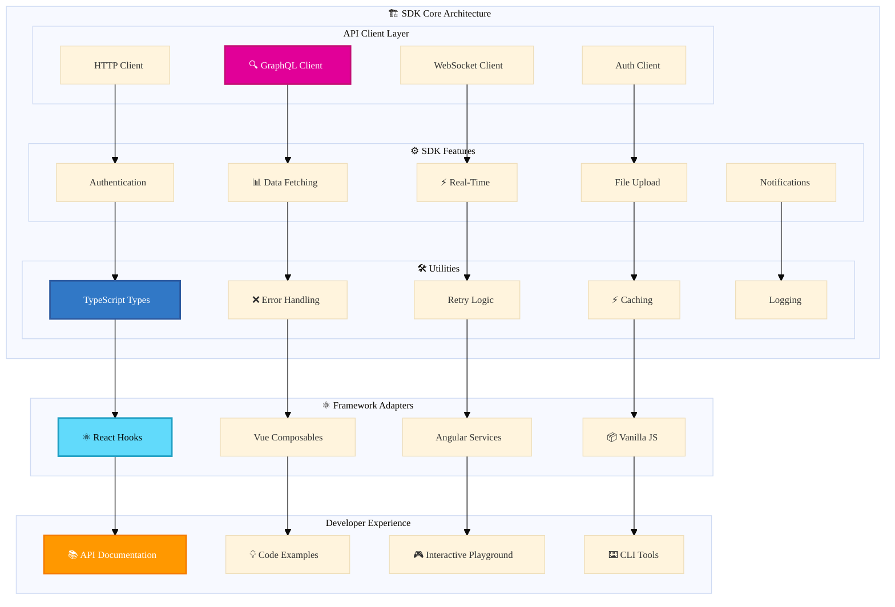
```mermaid
%%{init: {'theme':'base', 'themeVariables': {'fontSize': '12px', 'fontFamily': 'Arial, sans-serif'}}}%%
graph TB
    subgraph SDK_CORE ["🏗️ SDK Core Architecture"]
        subgraph API_CLIENT ["🔌 API Client Layer"]
            HTTPClient[📡 HTTP Client]
            GraphQLClient[🔍 GraphQL Client]
            WebSocketClient[🔌 WebSocket Client]
            AuthClient[🔐 Auth Client]
        end
        
        subgraph SDK_FEATURES ["⚙️ SDK Features"]
            Authentication[🔐 Authentication]
            DataFetching[📊 Data Fetching]
            RealTime[⚡ Real-Time]
            FileUpload[📁 File Upload]
            Notifications[🔔 Notifications]
        end
        
        subgraph SDK_UTILITIES ["🛠️ Utilities"]
            TypeDefinitions[📝 TypeScript Types]
            ErrorHandling[❌ Error Handling]
            RetryLogic[🔄 Retry Logic]
            Caching[⚡ Caching]
            Logging[📝 Logging]
        end
    end
    
    subgraph FRAMEWORK_ADAPTERS ["⚛️ Framework Adapters"]
        ReactAdapter[⚛️ React Hooks]
        VueAdapter[💚 Vue Composables]
        AngularAdapter[🔴 Angular Services]
        VanillaAdapter[📦 Vanilla JS]
    end
    
    subgraph DEVELOPER_EXPERIENCE ["👨‍💻 Developer Experience"]
        Documentation[📚 API Documentation]
        Examples[💡 Code Examples]
        Playground[🎮 Interactive Playground]
        CLI[⌨️ CLI Tools]
    end
    
    HTTPClient --> Authentication
    GraphQLClient --> DataFetching
    WebSocketClient --> RealTime
    AuthClient --> FileUpload
    
    Authentication --> TypeDefinitions
    DataFetching --> ErrorHandling
    RealTime --> RetryLogic
    FileUpload --> Caching
    Notifications --> Logging
    
    TypeDefinitions --> ReactAdapter
    ErrorHandling --> VueAdapter
    RetryLogic --> AngularAdapter
    Caching --> VanillaAdapter
    
    ReactAdapter --> Documentation
    VueAdapter --> Examples
    AngularAdapter --> Playground
    VanillaAdapter --> CLI
    
    style ReactAdapter fill:#61dafb,stroke:#21a0c4,stroke-width:2px,color:#000
    style GraphQLClient fill:#e10098,stroke:#c51077,stroke-width:2px,color:#fff
    style TypeDefinitions fill:#3178c6,stroke:#2d5aa0,stroke-width:2px,color:#fff
    style Documentation fill:#ff9800,stroke:#f57c00,stroke-width:2px,color:#fff
```

### 📱 Progressive Web App (PWA) Architecture

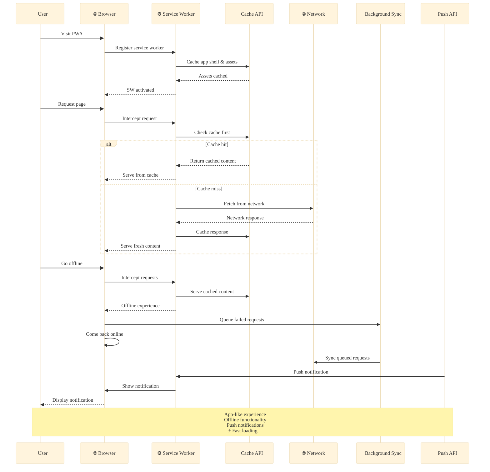
```mermaid
%%{init: {'theme':'base', 'themeVariables': {'fontSize': '12px', 'fontFamily': 'Arial, sans-serif'}}}%%
sequenceDiagram
    participant User as 👤 User
    participant Browser as 🌐 Browser
    participant ServiceWorker as ⚙️ Service Worker
    participant Cache as 💾 Cache API
    participant Network as 🌐 Network
    participant BackgroundSync as 🔄 Background Sync
    participant PushAPI as 📱 Push API

    User->>Browser: Visit PWA
    Browser->>ServiceWorker: Register service worker
    ServiceWorker->>Cache: Cache app shell & assets
    Cache-->>ServiceWorker: Assets cached
    ServiceWorker-->>Browser: SW activated
    
    User->>Browser: Request page
    Browser->>ServiceWorker: Intercept request
    ServiceWorker->>Cache: Check cache first
    
    alt Cache hit
        Cache-->>ServiceWorker: Return cached content
        ServiceWorker-->>Browser: Serve from cache
    else Cache miss
        ServiceWorker->>Network: Fetch from network
        Network-->>ServiceWorker: Network response
        ServiceWorker->>Cache: Cache response
        ServiceWorker-->>Browser: Serve fresh content
    end
    
    User->>Browser: Go offline
    Browser->>ServiceWorker: Intercept requests
    ServiceWorker->>Cache: Serve cached content
    ServiceWorker-->>Browser: Offline experience
    
    Browser->>BackgroundSync: Queue failed requests
    Browser->>Browser: Come back online
    BackgroundSync->>Network: Sync queued requests
    
    PushAPI->>ServiceWorker: Push notification
    ServiceWorker->>Browser: Show notification
    Browser-->>User: Display notification

    Note over User,PushAPI: 📱 App-like experience<br/>📴 Offline functionality<br/>🔔 Push notifications<br/>⚡ Fast loading
```

## 🔐 Authentication & Authorization Patterns

### 🔐 OAuth 2.0 + JWT Flow

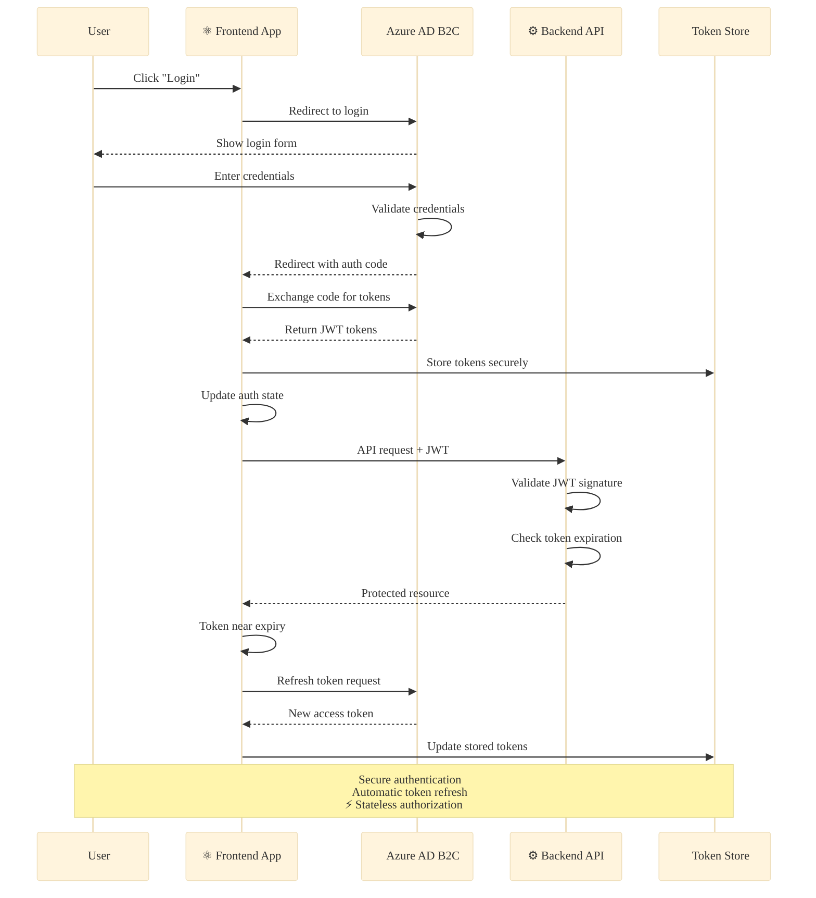
```mermaid
%%{init: {'theme':'base', 'themeVariables': {'fontSize': '12px', 'fontFamily': 'Arial, sans-serif'}}}%%
sequenceDiagram
    participant User as 👤 User
    participant Frontend as ⚛️ Frontend App
    participant AuthProvider as 🔐 Azure AD B2C
    participant Backend as ⚙️ Backend API
    participant TokenStore as 🔑 Token Store

    User->>Frontend: Click "Login"
    Frontend->>AuthProvider: Redirect to login
    AuthProvider-->>User: Show login form
    User->>AuthProvider: Enter credentials
    AuthProvider->>AuthProvider: Validate credentials
    AuthProvider-->>Frontend: Redirect with auth code
    Frontend->>AuthProvider: Exchange code for tokens
    AuthProvider-->>Frontend: Return JWT tokens
    Frontend->>TokenStore: Store tokens securely
    Frontend->>Frontend: Update auth state
    
    Frontend->>Backend: API request + JWT
    Backend->>Backend: Validate JWT signature
    Backend->>Backend: Check token expiration
    Backend-->>Frontend: Protected resource
    
    Frontend->>Frontend: Token near expiry
    Frontend->>AuthProvider: Refresh token request
    AuthProvider-->>Frontend: New access token
    Frontend->>TokenStore: Update stored tokens

    Note over User,TokenStore: 🔐 Secure authentication<br/>🔄 Automatic token refresh<br/>⚡ Stateless authorization
```

## 🚀 Deployment Architecture

### 📄 Azure Static Web Apps Deployment

```mermaid
%%{init: {'theme':'base', 'themeVariables': {'fontSize': '12px', 'fontFamily': 'Arial, sans-serif'}}}%%
sequenceDiagram
    participant Dev as 👨‍💻 Developer
    participant GitHub as 📚 GitHub
    participant GitHubActions as ⚙️ GitHub Actions
    participant StaticWebApps as 📄 Azure Static Web Apps
    participant CDN as 🌐 Azure CDN
    participant User as 👤 User

    Dev->>GitHub: Push code to main branch
    GitHub->>GitHubActions: Trigger workflow
    GitHubActions->>GitHubActions: npm install
    GitHubActions->>GitHubActions: npm run build
    GitHubActions->>GitHubActions: npm run test
    GitHubActions->>StaticWebApps: Deploy build artifacts
    StaticWebApps->>CDN: Distribute to edge locations
    CDN-->>StaticWebApps: Deployment complete
    StaticWebApps-->>GitHubActions: Deployment status
    GitHubActions-->>GitHub: Update deployment status
    
    User->>CDN: Request website
    CDN-->>User: Serve from nearest edge
    
    Note over Dev,User: 🚀 Automated CI/CD<br/>🌐 Global distribution<br/>⚡ Edge-optimized delivery
```

### ☁️ Azure App Service Deployment

```mermaid
%%{init: {'theme':'base', 'themeVariables': {'fontSize': '12px', 'fontFamily': 'Arial, sans-serif'}}}%%
sequenceDiagram
    participant Dev as 👨‍💻 Developer
    participant ACR as 📦 Azure Container Registry
    participant AppService as ☁️ App Service
    participant AppGateway as 🚪 Application Gateway
    participant FrontDoor as 🚪 Azure Front Door
    participant User as 👤 User

    Dev->>ACR: Push Docker image
    ACR->>AppService: Pull container image
    AppService->>AppService: Start container instances
    AppService->>AppGateway: Register backend
    AppGateway->>FrontDoor: Configure routing
    FrontDoor-->>AppService: Health check
    AppService-->>FrontDoor: Healthy
    
    User->>FrontDoor: Request application
    FrontDoor->>AppGateway: Route request
    AppGateway->>AppService: Forward to container
    AppService-->>AppGateway: Response
    AppGateway-->>FrontDoor: Response
    FrontDoor-->>User: Optimized delivery
    
    Note over Dev,User: 📦 Containerized deployment<br/>🔄 Auto-scaling<br/>🛡️ WAF protection<br/>🌐 Global acceleration
```

## 📊 Performance Optimization Patterns

### ⚡ Code Splitting & Lazy Loading

```mermaid
%%{init: {'theme':'base', 'themeVariables': {'fontSize': '12px', 'fontFamily': 'Arial, sans-serif'}}}%%
graph TB
    subgraph INITIAL_BUNDLE ["📦 Initial Bundle"]
        AppShell[🏠 App Shell]
        CoreComponents[⚛️ Core Components]
        Router[🛣️ Router]
        AuthModule[🔐 Auth Module]
    end
    
    subgraph LAZY_LOADED ["⏳ Lazy Loaded Chunks"]
        Dashboard[📊 Dashboard Chunk]
        UserProfile[👤 Profile Chunk]
        Settings[⚙️ Settings Chunk]
        Reports[📈 Reports Chunk]
    end
    
    subgraph VENDOR_CHUNKS ["📚 Vendor Chunks"]
        ReactChunk[⚛️ React Library]
        UtilsChunk[🛠️ Utilities]
        UIChunk[🎨 UI Components]
        ChartsChunk[📊 Charts Library]
    end
    
    subgraph OPTIMIZATION ["🚀 Optimization"]
        TreeShaking[🌳 Tree Shaking]
        Minification[📦 Minification]
        Compression[🗜️ Gzip/Brotli]
        Prefetching[⚡ Resource Hints]
    end
    
    AppShell --> Dashboard
    CoreComponents --> UserProfile
    Router --> Settings
    AuthModule --> Reports
    
    Dashboard --> ReactChunk
    UserProfile --> UtilsChunk
    Settings --> UIChunk
    Reports --> ChartsChunk
    
    ReactChunk --> TreeShaking
    UtilsChunk --> Minification
    UIChunk --> Compression
    ChartsChunk --> Prefetching
    
    style Dashboard fill:#4caf50,stroke:#388e3c,stroke-width:2px,color:#fff
    style ReactChunk fill:#61dafb,stroke:#21a0c4,stroke-width:2px,color:#000
    style TreeShaking fill:#ff9800,stroke:#f57c00,stroke-width:2px,color:#fff
```

## 🧪 Testing Architecture

### 🧪 Testing Strategy Pyramid

```mermaid
%%{init: {'theme':'base', 'themeVariables': {'fontSize': '12px', 'fontFamily': 'Arial, sans-serif'}}}%%
graph TB
    subgraph TESTING_PYRAMID ["🔺 Testing Pyramid"]
        subgraph E2E_TESTS ["🎭 End-to-End Tests"]
            PlaywrightTests[🎭 Playwright]
            CypressTests[🌲 Cypress]
            UserFlows[👤 User Flows]
        end
        
        subgraph INTEGRATION_TESTS ["🔗 Integration Tests"]
            ComponentIntegration[⚛️ Component Integration]
            APIIntegration[🔌 API Integration]
            RoutingTests[🛣️ Routing Tests]
        end
        
        subgraph UNIT_TESTS ["🧪 Unit Tests"]
            ComponentTests[⚛️ Component Tests]
            HookTests[🪝 Hook Tests]
            UtilityTests[🛠️ Utility Tests]
            StateTests[📊 State Tests]
        end
        
        subgraph STATIC_ANALYSIS ["📝 Static Analysis"]
            TypeScript[📝 TypeScript]
            ESLint[✅ ESLint]
            Prettier[💅 Prettier]
            SonarQube[🔍 SonarQube]
        end
    end
    
    subgraph TESTING_TOOLS ["🛠️ Testing Tools"]
        Jest[🃏 Jest]
        TestingLibrary[🧪 Testing Library]
        MockServiceWorker[🎭 MSW]
        Storybook[📚 Storybook]
    end
    
    PlaywrightTests --> ComponentIntegration
    CypressTests --> APIIntegration
    UserFlows --> RoutingTests
    
    ComponentIntegration --> ComponentTests
    APIIntegration --> HookTests
    RoutingTests --> UtilityTests
    
    ComponentTests --> TypeScript
    HookTests --> ESLint
    UtilityTests --> Prettier
    StateTests --> SonarQube
    
    Jest --> PlaywrightTests
    TestingLibrary --> ComponentTests
    MockServiceWorker --> APIIntegration
    Storybook --> ComponentTests
    
    style E2E_TESTS fill:#ff5722,stroke:#d84315,stroke-width:2px,color:#fff
    style INTEGRATION_TESTS fill:#ff9800,stroke:#f57c00,stroke-width:2px,color:#fff
    style UNIT_TESTS fill:#4caf50,stroke:#388e3c,stroke-width:2px,color:#fff
    style STATIC_ANALYSIS fill:#2196f3,stroke:#1976d2,stroke-width:2px,color:#fff
```

## 📱 Mobile-First Architecture

### 📱 Responsive Design System

```mermaid
%%{init: {'theme':'base', 'themeVariables': {'fontSize': '12px', 'fontFamily': 'Arial, sans-serif'}}}%%
graph TB
    subgraph BREAKPOINTS ["📐 Responsive Breakpoints"]
        Mobile[📱 Mobile (320-768px)]
        Tablet[📋 Tablet (768-1024px)]
        Desktop[🖥️ Desktop (1024-1440px)]
        Ultrawide[🖥️ Ultrawide (1440px+)]
    end
    
    subgraph DESIGN_TOKENS ["🎨 Design System"]
        Colors[🎨 Color Palette]
        Typography[📝 Typography Scale]
        Spacing[📏 Spacing System]
        Components[🧩 Component Library]
    end
    
    subgraph LAYOUT_PATTERNS ["📐 Layout Patterns"]
        FlexboxGrid[📦 Flexbox Grid]
        CSSGrid[🏗️ CSS Grid]
        Container[📦 Container Queries]
        Intrinsic[🔄 Intrinsic Layouts]
    end
    
    subgraph PERFORMANCE ["⚡ Mobile Performance"]
        ImageOptimization[🖼️ Image Optimization]
        FontLoading[📝 Font Loading]
        CriticalCSS[🎨 Critical CSS]
        LazyLoading[⏳ Lazy Loading]
    end
    
    Mobile --> Colors
    Tablet --> Typography
    Desktop --> Spacing
    Ultrawide --> Components
    
    Colors --> FlexboxGrid
    Typography --> CSSGrid
    Spacing --> Container
    Components --> Intrinsic
    
    FlexboxGrid --> ImageOptimization
    CSSGrid --> FontLoading
    Container --> CriticalCSS
    Intrinsic --> LazyLoading
    
    style Mobile fill:#4caf50,stroke:#388e3c,stroke-width:2px,color:#fff
    style Components fill:#e91e63,stroke:#c2185b,stroke-width:2px,color:#fff
    style CSSGrid fill:#9c27b0,stroke:#7b1fa2,stroke-width:2px,color:#fff
    style ImageOptimization fill:#ff9800,stroke:#f57c00,stroke-width:2px,color:#fff
```

## 🎨 Comprehensive UI/UX Architecture & Best Practices

### 🎯 User Experience Design Principles

```mermaid
%%{init: {'theme':'base', 'themeVariables': {'fontSize': '14px', 'fontFamily': 'Arial, sans-serif'}}}%%
graph TB
    subgraph UX_PRINCIPLES ["🎯 UX Design Principles"]
        subgraph CORE_PRINCIPLES ["🎯 Core UX Principles"]
            UserCentered[👤 User-Centered Design<br/>Research & Empathy]
            Accessibility[♿ Accessibility First<br/>WCAG 2.1 Compliance]
            Performance[⚡ Performance Focused<br/>Core Web Vitals]
            Consistency[🔄 Design Consistency<br/>Pattern Library]
            Simplicity[✨ Simplicity<br/>Progressive Disclosure]
            Feedback[📢 User Feedback<br/>Clear Communication]
        end
        
        subgraph INTERACTION_DESIGN ["🔄 Interaction Design"]
            MicroInteractions[✨ Micro-interactions<br/>Hover, Focus, Loading]
            TransitionDesign[🔄 Transition Design<br/>Smooth Animations]
            GestureSupport[👆 Gesture Support<br/>Touch & Mouse Interactions]
            KeyboardFirst[⌨️ Keyboard First<br/>Navigation & Shortcuts]
        end
        
        subgraph VISUAL_HIERARCHY ["📐 Visual Hierarchy"]
            TypographyScale[📝 Typography Scale<br/>Heading & Body Text]
            ColorHierarchy[🎨 Color Hierarchy<br/>Primary, Secondary, Accent]
            SpacingSystem[📏 Spacing System<br/>Consistent Margins & Padding]
            GridSystem[📏 Grid System<br/>Layout & Alignment]
        end
    end

    subgraph UX_PATTERNS ["🎨 UX Pattern Library"]
        subgraph NAVIGATION_PATTERNS ["🔗 Navigation Patterns"]
            GlobalNavigation[🌐 Global Navigation<br/>Primary Site Navigation]
            LocalNavigation[📍 Local Navigation<br/>Section-specific Nav]
            BreadcrumbNav[🍞 Breadcrumb Navigation<br/>Hierarchical Path]
            PaginationNav[📄 Pagination<br/>Large Dataset Navigation]
            TabNavigation[📑 Tab Navigation<br/>Content Organization]
            SidebarNav[📂 Sidebar Navigation<br/>Persistent Side Menu]
        end
        
        subgraph CONTENT_PATTERNS ["📚 Content Patterns"]
            CardLayouts[📋 Card Layouts<br/>Information Containers]
            ListViews[📋 List Views<br/>Data Presentation]
            TableViews[📊 Table Views<br/>Structured Data]
            DetailViews[📄 Detail Views<br/>Individual Item Views]
            DashboardLayouts[📊 Dashboard Layouts<br/>Data Overview]
            LandingPages[🏠 Landing Pages<br/>Marketing & Conversion]
        end
        
        subgraph FORM_PATTERNS ["📝 Form Patterns"]
            SimpleForm[📝 Simple Forms<br/>Single-step Forms]
            MultiStepForm[📋 Multi-step Forms<br/>Wizard Pattern]
            InlineEditing[✏️ Inline Editing<br/>Quick Data Updates]
            FormValidation[✅ Form Validation<br/>Real-time Feedback]
            FileUpload[📎 File Upload<br/>Drag & Drop Interface]
            SearchForms[🔍 Search Forms<br/>Query Input & Filters]
        end
    end

    subgraph DESIGN_WORKFLOW ["🔄 Design-Development Workflow"]
        subgraph DESIGN_PROCESS ["🎨 Design Process"]
            UserResearch[👥 User Research<br/>Interviews & Surveys]
            UserPersonas[👤 User Personas<br/>Target Audience Profiles]
            UserJourneys[🗺️ User Journeys<br/>Experience Mapping]
            Wireframing[📐 Wireframing<br/>Structure & Layout]
            Prototyping[🎮 Prototyping<br/>Interactive Mockups]
            UsabilityTesting[🧪 Usability Testing<br/>Validation & Iteration]
        end
        
        subgraph DESIGN_HANDOFF ["🤝 Design Handoff"]
            DesignSpecs[📋 Design Specifications<br/>Detailed Requirements]
            AssetExport[📦 Asset Export<br/>Optimized Graphics]
            ComponentSpecs[🧩 Component Specs<br/>Behavior Documentation]
            InteractionSpecs[🔄 Interaction Specs<br/>Animation & Transitions]
            ResponsiveSpecs[📱 Responsive Specs<br/>Breakpoint Definitions]
            AccessibilitySpecs[♿ Accessibility Specs<br/>ARIA & Semantic Requirements]
        end
        
        subgraph QUALITY_ASSURANCE ["✅ Quality Assurance"]
            DesignReview[👁️ Design Review<br/>Cross-functional Review]
            CodeReview[💻 Code Review<br/>Implementation Validation]
            AccessibilityAudit[♿ Accessibility Audit<br/>Compliance Testing]
            PerformanceAudit[⚡ Performance Audit<br/>Speed & Optimization]
            BrowserTesting[🌐 Browser Testing<br/>Cross-platform Validation]
            DeviceTesting[📱 Device Testing<br/>Responsive Validation]
        end
    end

    subgraph RESPONSIVE_DESIGN ["📱 Responsive Design Architecture"]
        subgraph BREAKPOINT_SYSTEM ["📏 Breakpoint System"]
            MobileFirst[📱 Mobile First<br/>320px - 768px]
            TabletView[📱 Tablet View<br/>768px - 1024px]
            DesktopView[🖥️ Desktop View<br/>1024px - 1440px]
            LargeDesktop[🖥️ Large Desktop<br/>1440px+]
        end
        
        subgraph LAYOUT_STRATEGIES ["📐 Layout Strategies"]
            FluidGrid[📏 Fluid Grid<br/>Flexible Columns]
            FlexboxLayout[📐 Flexbox Layout<br/>1D Layout System]
            GridLayout[📊 CSS Grid<br/>2D Layout System]
            ContainerQueries[📦 Container Queries<br/>Component-based Responsive]
        end
        
        subgraph CONTENT_STRATEGY ["📚 Content Strategy"]
            ProgressiveDisclosure[📂 Progressive Disclosure<br/>Information Hierarchy]
            ContentPriority[🎯 Content Priority<br/>Mobile Content Strategy]
            ImageOptimization[🖼️ Image Optimization<br/>Responsive Images]
            TypographyScaling[📝 Typography Scaling<br/>Fluid Typography]
        end
    end

    %% UX Principle Connections
    UserCentered --> UserResearch
    Accessibility --> AccessibilityAudit
    Performance --> PerformanceAudit
    Consistency --> ComponentSpecs
    Simplicity --> ProgressiveDisclosure
    Feedback --> MicroInteractions
    
    MicroInteractions --> TransitionDesign
    TransitionDesign --> InteractionSpecs
    GestureSupport --> DeviceTestingc
    KeyboardFirst --> AccessibilitySpecs
    
    %% Pattern Connections
    GlobalNavigation --> SidebarNav
    BreadcrumbNav --> LocalNavigation
    TabNavigation --> ContentPriority
    
    CardLayouts --> ResponsiveSpecs
    ListViews --> TableViews
    DashboardLayouts --> GridLayout
    
    SimpleForm --> FormValidation
    MultiStepForm --> UserJourneys
    InlineEditing --> MicroInteractions
    
    %% Workflow Connections
    UserResearch --> UserPersonas
    UserPersonas --> UserJourneys
    UserJourneys --> Wireframing
    Wireframing --> Prototyping
    Prototyping --> UsabilityTesting
    
    DesignSpecs --> AssetExport
    ComponentSpecs --> InteractionSpecs
    ResponsiveSpecs --> AccessibilitySpecs
    
    DesignReview --> CodeReview
    AccessibilityAudit --> BrowserTesting
    PerformanceAudit --> DeviceTestingtion
    
    %% Responsive Design Connections
    MobileFirst --> TabletView
    TabletView --> DesktopView
    DesktopView --> LargeDesktop
    
    FluidGrid --> FlexboxLayout
    FlexboxLayout --> GridLayout
    GridLayout --> ContainerQueries
    
    ProgressiveDisclosure --> ContentPriority
    ImageOptimization --> TypographyScaling

    %% Styling
    style UX_PRINCIPLES fill:#e8f5e8,stroke:#4caf50,stroke-width:3px
    style UX_PATTERNS fill:#e3f2fd,stroke:#2196f3,stroke-width:3px
    style DESIGN_WORKFLOW fill:#fce4ec,stroke:#e91e63,stroke-width:3px
    style RESPONSIVE_DESIGN fill:#fff3e0,stroke:#ff9800,stroke-width:3px
    
    style UserCentered fill:#4caf50,stroke:#388e3c,stroke-width:2px,color:#fff
    style GlobalNavigation fill:#2196f3,stroke:#1976d2,stroke-width:2px,color:#fff
    style UserResearch fill:#e91e63,stroke:#c2185b,stroke-width:2px,color:#fff
    style MobileFirst fill:#ff9800,stroke:#f57c00,stroke-width:2px,color:#fff
```

### 🎨 Design System Implementation Guide

| Component Type | Figma Integration | Development Approach | Accessibility Priority |
|----------------|-------------------|---------------------|------------------------|
| **🎨 Design Tokens** | Auto-sync with Figma Variables | Style Dictionary transformation | Color contrast validation |
| **⚛️ Atomic Components** | Component library sync | TypeScript + Storybook | ARIA patterns implementation |
| **🔗 Molecule Components** | Figma variant mapping | Compound component patterns | Keyboard navigation support |
| **🏛️ Organism Components** | Responsive behavior specs | Layout composition patterns | Screen reader optimization |
| **📐 Templates** | Breakpoint specifications | Grid system implementation | Focus management |

### 🔄 Design-Development Workflow

| Phase | Design Activity | Development Activity | Quality Gates |
|-------|----------------|---------------------|---------------|
| **🎯 Discovery** | User research & personas | Technical feasibility | Accessibility requirements |
| **📐 Ideation** | Wireframes & user flows | Architecture planning | Performance targets |
| **🎨 Design** | High-fidelity mockups | Component planning | Design system compliance |
| **🔧 Development** | Design QA & feedback | Implementation & testing | Code review & accessibility audit |
| **🚀 Launch** | Usage analytics setup | Performance monitoring | User feedback collection |

This comprehensive Frontend Development Architecture document provides detailed patterns and flows for modern frontend development using React, Next.js, and Azure services. The architecture covers all the patterns you requested and more, providing a complete guide for building scalable, performant, and maintainable frontend applications.

## 🎯 Key Takeaways

- **🎨 Design System Integration**: Comprehensive Figma integration with design tokens, component libraries, and automated design-to-code workflows
- **♿ Accessibility-First Architecture**: Complete semantic HTML and ARIA implementation with WCAG 2.1 compliance patterns
- **🧩 Atomic Design Methodology**: Scalable component architecture from atoms to templates with composition patterns
- **🎯 UI/UX Best Practices**: User-centered design principles with responsive design and interaction patterns
- **📱 Multi-Pattern Support**: CSR, SSR, SSG, ISR, and Hybrid rendering patterns for optimal performance
- **⚡ Real-Time Communication**: WebSocket and WebHook integration patterns for dynamic applications
- **📊 Modern State Management**: Client and server state with advanced caching strategies
- **🔧 Developer Experience**: Comprehensive SDK patterns and testing strategies
- **📱 Mobile-First Design**: Progressive Web App capabilities with responsive breakpoint systems
- **☁️ Azure Integration**: Full Azure service integration for enterprise-grade frontend applications

## 📚 Additional Resources

- [Next.js Documentation](https://nextjs.org/docs)
- [React Documentation](https://react.dev)
- [Azure Static Web Apps](https://docs.microsoft.com/en-us/azure/static-web-apps/)
- [Azure Front Door](https://docs.microsoft.com/en-us/azure/frontdoor/)
- [Azure Application Gateway](https://docs.microsoft.com/en-us/azure/application-gateway/)
