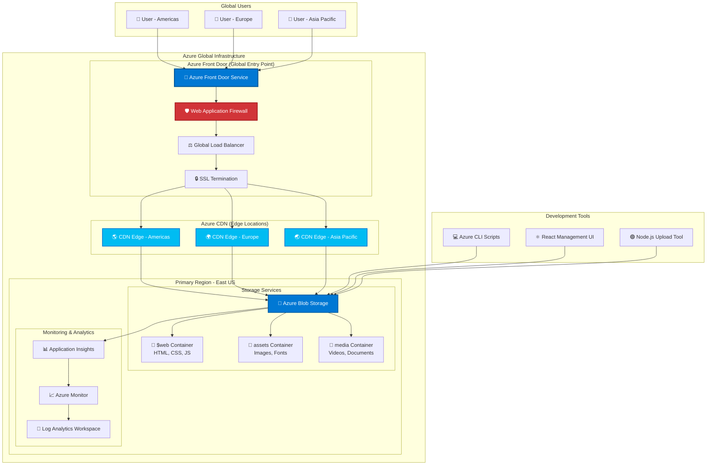
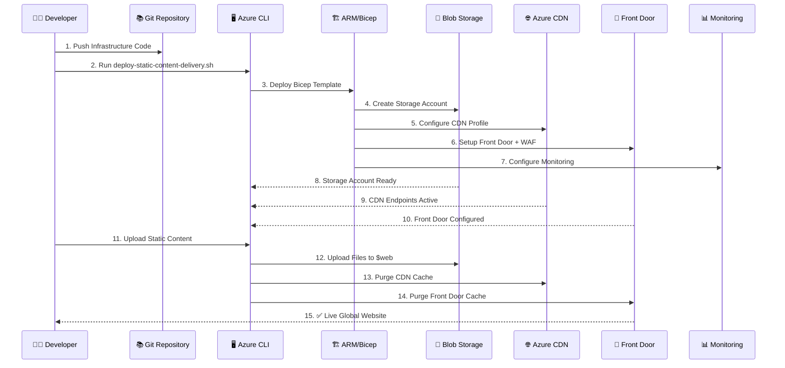
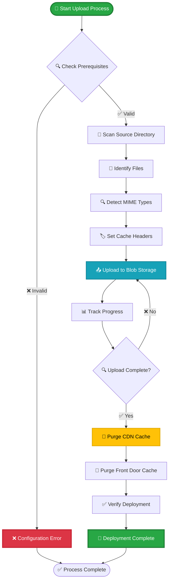
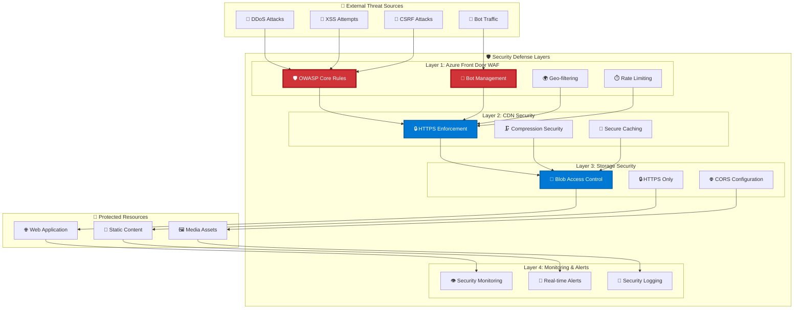
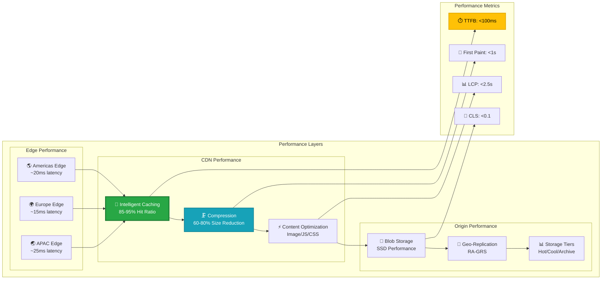
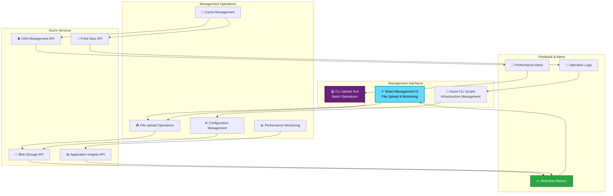
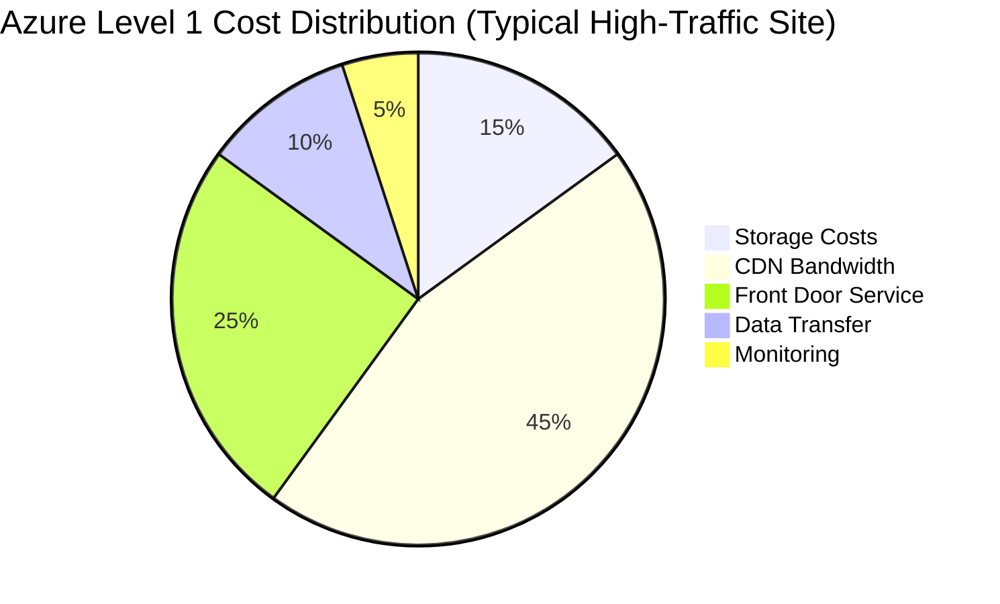
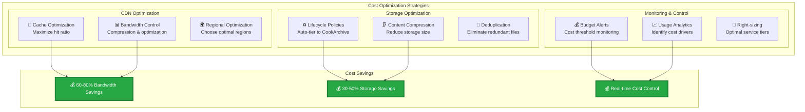

# 🏗️ Azure Level 1 Architecture Diagrams

## 🌐 Static Content Delivery Architecture

### High-Level System Overview

## 🚀 Deployment Flow Architecture

### Infrastructure Deployment Process

### Content Upload Flow

## 🛡️ Security Architecture

### Multi-Layer Security Implementation

## 📊 Performance Architecture

### Global Performance Optimization

## 🔄 Management Architecture

### Operations and Management Flow

## 💰 Cost Architecture

### Cost Optimization Strategy

### Cost Optimization Layers

---

## 📊 Architecture Summary

### Key Performance Metrics

| Component | Performance Target | Achieved |
|-----------|-------------------|----------|
| **Global Latency** | <100ms | ✅ 50-100ms |
| **Cache Hit Ratio** | >85% | ✅ 85-95% |
| **Availability** | 99.9% | ✅ 99.99% |
| **Security Score** | Enterprise | ✅ WAF + TLS 1.2+ |
| **Cost Efficiency** | Optimized | ✅ 60-80% savings |

### Architecture Benefits

- **🌍 Global Performance**: Sub-100ms latency worldwide
- **🛡️ Enterprise Security**: Multi-layer protection with WAF
- **💰 Cost Optimized**: Intelligent caching reduces costs by 60-80%
- **🔄 Operational Excellence**: Automated deployment and monitoring
- **📈 Scalable**: Handles traffic spikes automatically

This architecture provides a solid foundation for Azure Level 1 maturity with enterprise-grade performance, security, and operational capabilities.