# Level 0 Agentic End-to-End Development Architecture - Single to Multi-Agent DevOps

## Executive Summary

This document presents a comprehensive Level 0 architecture for agentic end-to-end software development, demonstrating the evolution from single-agent code assistance to fully automated multi-agent DevOps pipelines. The architecture specifically addresses FinTech development requirements with emphasis on security, compliance, and reliability.

## 🎯 Strategic Development Automation Framework

### Vision Statement

**Transform software development from human-centric workflows to AI-native development ecosystems where intelligent agents collaborate to deliver production-ready FinTech applications with minimal human intervention while maintaining the highest standards of security, compliance, and quality.**

### Business Value Proposition

## 🏗️ Level 0 Strategic Development Architecture

### Multi-Agent Development Ecosystem

```mermaid
graph TB
    subgraph "Strategic Development Platform"
        subgraph "Agent Orchestration Layer"
            DevOrchestrator[Development Orchestrator<br/>🎯 Workflow coordination]
            TaskRouter[Task Router<br/>📋 Agent assignment]
            StateManager[State Manager<br/>🔄 Development state]
            EventBus[Event Bus<br/>📡 Real-time communication]
        end
        
        subgraph "Development Agent Swarm"
            RequirementsAgent[Requirements Agent<br/>📋 Business analysis]
            ArchitectAgent[Architecture Agent<br/>🏗️ System design]
            CodeAgent[Code Generation Agent<br/>💻 Implementation]
            TestAgent[Testing Agent<br/>🧪 Quality assurance]
            SecurityAgent[Security Agent<br/>🛡️ Security analysis]
            ComplianceAgent[Compliance Agent<br/>📜 Regulatory adherence]
            ReviewAgent[Code Review Agent<br/>👁️ Code quality]
            DevOpsAgent[DevOps Agent<br/>🚀 Deployment automation]
            MonitoringAgent[Monitoring Agent<br/>📊 Performance tracking]
        end
        
        subgraph "Specialized AI Services"
            FoundationModels[Foundation Models<br/>GPT-4o, Claude 3.5, Gemini Pro]
            CodeModels[Code-Specific Models<br/>GitHub Copilot, CodeT5+]
            SecurityModels[Security Models<br/>CodeQL, Semgrep AI]
            ComplianceModels[Compliance Models<br/>FinTech regulatory AI]
        end
        
        subgraph "Development Infrastructure"
            GitPlatform[Git Platform<br/>GitHub Enterprise/GitLab]
            CIPlatform[CI/CD Platform<br/>Azure DevOps/Jenkins]
            CloudInfra[Cloud Infrastructure<br/>Azure/AWS multi-cloud]
            MonitoringStack[Monitoring Stack<br/>Prometheus, Grafana, ELK]
        end
        
        subgraph "FinTech Domain Knowledge"
            BankingRegs[Banking Regulations<br/>Basel III, GDPR, PCI DSS]
            SecurityStandards[Security Standards<br/>NIST, ISO 27001]
            ComplianceFrameworks[Compliance Frameworks<br/>SOX, FFIEC, FCA]
            IndustryBestPractices[Industry Best Practices<br/>FinTech development patterns]
        end
    end
    
    DevOrchestrator --> TaskRouter
    TaskRouter --> StateManager
    StateManager --> EventBus
    
    EventBus --> RequirementsAgent
    EventBus --> ArchitectAgent
    EventBus --> CodeAgent
    EventBus --> TestAgent
    EventBus --> SecurityAgent
    EventBus --> ComplianceAgent
    EventBus --> ReviewAgent
    EventBus --> DevOpsAgent
    EventBus --> MonitoringAgent
    
    RequirementsAgent --> FoundationModels
    ArchitectAgent --> FoundationModels
    CodeAgent --> CodeModels
    TestAgent --> CodeModels
    SecurityAgent --> SecurityModels
    ComplianceAgent --> ComplianceModels
    ReviewAgent --> CodeModels
    DevOpsAgent --> FoundationModels
    MonitoringAgent --> FoundationModels
    
    DevOpsAgent --> GitPlatform
    DevOpsAgent --> CIPlatform
    DevOpsAgent --> CloudInfra
    MonitoringAgent --> MonitoringStack
    
    ComplianceAgent --> BankingRegs
    SecurityAgent --> SecurityStandards
    ComplianceAgent --> ComplianceFrameworks
    ArchitectAgent --> IndustryBestPractices
```

## 🤖 Single Agent Evolution Pathway

### Phase 1: Code Assistant Agent (Current State)

**Individual Developer Augmentation**

### Phase 2: Specialized Development Agent

**Domain-Specific Development Assistance**

### Phase 3: Autonomous Development Agent

**Independent Feature Development**

## 🤖🤖 Multi-Agent Orchestration Architecture

### Development Agent Swarm Coordination

```mermaid
graph TB
    subgraph "Multi-Agent Development Swarm"
        subgraph "Planning & Analysis Layer"
            ProductOwnerAgent[Product Owner Agent<br/>📋 Requirements & priorities]
            BusinessAnalystAgent[Business Analyst Agent<br/>📊 Business logic analysis]
            TechnicalArchitectAgent[Technical Architect Agent<br/>🏗️ System architecture]
        end
        
        subgraph "Implementation Layer"
            BackendAgent[Backend Development Agent<br/>⚙️ Server-side implementation]
            FrontendAgent[Frontend Development Agent<br/>🎨 UI/UX implementation]
            DatabaseAgent[Database Agent<br/>🗄️ Data modeling & queries]
            IntegrationAgent[Integration Agent<br/>🔗 API & service integration]
        end
        
        subgraph "Quality Assurance Layer"
            UnitTestAgent[Unit Test Agent<br/>🧪 Unit test generation]
            IntegrationTestAgent[Integration Test Agent<br/>🔄 End-to-end testing]
            PerformanceTestAgent[Performance Test Agent<br/>⚡ Load & stress testing]
            SecurityTestAgent[Security Test Agent<br/>🛡️ Security validation]
        end
        
        subgraph "Operations Layer"
            InfrastructureAgent[Infrastructure Agent<br/>☁️ Cloud provisioning]
            DeploymentAgent[Deployment Agent<br/>🚀 Release automation]
            MonitoringSetupAgent[Monitoring Setup Agent<br/>📊 Observability setup]
            IncidentResponseAgent[Incident Response Agent<br/>🚨 Issue resolution]
        end
        
        subgraph "Governance Layer"
            SecurityOfficerAgent[Security Officer Agent<br/>🔒 Security governance]
            ComplianceOfficerAgent[Compliance Officer Agent<br/>📜 Regulatory compliance]
            QualityGateAgent[Quality Gate Agent<br/>✅ Release approval]
            AuditAgent[Audit Agent<br/>📋 Audit trail management]
        end
    end
    
    ProductOwnerAgent --> BusinessAnalystAgent
    BusinessAnalystAgent --> TechnicalArchitectAgent
    
    TechnicalArchitectAgent --> BackendAgent
    TechnicalArchitectAgent --> FrontendAgent
    TechnicalArchitectAgent --> DatabaseAgent
    TechnicalArchitectAgent --> IntegrationAgent
    
    BackendAgent --> UnitTestAgent
    FrontendAgent --> UnitTestAgent
    DatabaseAgent --> IntegrationTestAgent
    IntegrationAgent --> IntegrationTestAgent
    
    UnitTestAgent --> PerformanceTestAgent
    IntegrationTestAgent --> SecurityTestAgent
    
    PerformanceTestAgent --> InfrastructureAgent
    SecurityTestAgent --> DeploymentAgent
    
    InfrastructureAgent --> MonitoringSetupAgent
    DeploymentAgent --> IncidentResponseAgent
    
    SecurityTestAgent --> SecurityOfficerAgent
    IntegrationTestAgent --> ComplianceOfficerAgent
    
    SecurityOfficerAgent --> QualityGateAgent
    ComplianceOfficerAgent --> QualityGateAgent
    QualityGateAgent --> AuditAgent
```

### Agent Collaboration Patterns

```mermaid
graph LR
    subgraph "Collaboration Mechanisms"
        subgraph "Communication"
            MessageBus[Message Bus<br/>📡 Asynchronous messaging]
            SharedState[Shared State<br/>🔄 Global context]
            EventDriven[Event-Driven<br/>⚡ Real-time coordination]
        end
        
        subgraph "Coordination"
            TaskQueue[Task Queue<br/>📋 Work distribution]
            DependencyGraph[Dependency Graph<br/>🔗 Task sequencing]
            ConflictResolution[Conflict Resolution<br/>⚖️ Merge conflicts]
        end
        
        subgraph "Knowledge Sharing"
            SharedMemory[Shared Memory<br/>🧠 Collective knowledge]
            LearningLoop[Learning Loop<br/>📈 Continuous improvement]
            BestPractices[Best Practices<br/>📚 Knowledge base]
        end
    end
    
    MessageBus --> TaskQueue
    SharedState --> DependencyGraph
    EventDriven --> ConflictResolution
    
    TaskQueue --> SharedMemory
    DependencyGraph --> LearningLoop
    ConflictResolution --> BestPractices
```

## 🛠️ Development Lifecycle Automation

### End-to-End Development Pipeline

```mermaid
graph TB
    subgraph "Automated Development Lifecycle"
        subgraph "Phase 1: Requirements & Planning"
            RequirementCapture[Requirement Capture<br/>📋 Stakeholder input analysis]
            BusinessLogicExtraction[Business Logic Extraction<br/>🧠 Domain model creation]
            TechnicalPlanning[Technical Planning<br/>🏗️ Architecture design]
            TaskBreakdown[Task Breakdown<br/>📊 Work item creation]
        end
        
        subgraph "Phase 2: Design & Architecture"
            SystemDesign[System Design<br/>🏛️ High-level architecture]
            DatabaseDesign[Database Design<br/>🗄️ Data model creation]
            APIDesign[API Design<br/>🔗 Interface specification]
            SecurityDesign[Security Design<br/>🛡️ Security architecture]
        end
        
        subgraph "Phase 3: Implementation"
            CodeGeneration[Code Generation<br/>💻 Implementation automation]
            ComponentDevelopment[Component Development<br/>🧩 Modular implementation]
            IntegrationDevelopment[Integration Development<br/>🔗 Service connectivity]
            UIUXDevelopment[UI/UX Development<br/>🎨 User interface creation]
        end
        
        subgraph "Phase 4: Testing & Quality"
            UnitTesting[Unit Testing<br/>🧪 Component validation]
            IntegrationTesting[Integration Testing<br/>🔄 System validation]
            SecurityTesting[Security Testing<br/>🛡️ Vulnerability assessment]
            PerformanceTesting[Performance Testing<br/>⚡ Performance validation]
        end
        
        subgraph "Phase 5: Deployment & Operations"
            InfrastructureProvisioning[Infrastructure Provisioning<br/>☁️ Environment setup]
            ApplicationDeployment[Application Deployment<br/>🚀 Release automation]
            MonitoringSetup[Monitoring Setup<br/>📊 Observability configuration]
            IncidentManagement[Incident Management<br/>🚨 Issue response]
        end
        
        subgraph "Phase 6: Maintenance & Evolution"
            PerformanceOptimization[Performance Optimization<br/>⚡ Continuous tuning]
            SecurityUpdates[Security Updates<br/>🔒 Vulnerability patching]
            FeatureEvolution[Feature Evolution<br/>🔄 Enhancement delivery]
            ComplianceUpdates[Compliance Updates<br/>📜 Regulatory adaptation]
        end
    end
    
    RequirementCapture --> BusinessLogicExtraction
    BusinessLogicExtraction --> TechnicalPlanning
    TechnicalPlanning --> TaskBreakdown
    
    TaskBreakdown --> SystemDesign
    SystemDesign --> DatabaseDesign
    DatabaseDesign --> APIDesign
    APIDesign --> SecurityDesign
    
    SecurityDesign --> CodeGeneration
    CodeGeneration --> ComponentDevelopment
    ComponentDevelopment --> IntegrationDevelopment
    IntegrationDevelopment --> UIUXDevelopment
    
    UIUXDevelopment --> UnitTesting
    UnitTesting --> IntegrationTesting
    IntegrationTesting --> SecurityTesting
    SecurityTesting --> PerformanceTesting
    
    PerformanceTesting --> InfrastructureProvisioning
    InfrastructureProvisioning --> ApplicationDeployment
    ApplicationDeployment --> MonitoringSetup
    MonitoringSetup --> IncidentManagement
    
    IncidentManagement --> PerformanceOptimization
    PerformanceOptimization --> SecurityUpdates
    SecurityUpdates --> FeatureEvolution
    FeatureEvolution --> ComplianceUpdates
    
    ComplianceUpdates -.->|Continuous Loop| RequirementCapture
```

## 🔒 Security & Compliance Integration

### Security-First Development Architecture

```mermaid
graph TB
    subgraph "Security & Compliance Framework"
        subgraph "Security Agent Capabilities"
            ThreatModeling[Threat Modeling<br/>🎯 Security risk assessment]
            VulnerabilityScanning[Vulnerability Scanning<br/>🔍 Automated security testing]
            SecureCodeGeneration[Secure Code Generation<br/>🛡️ Security-by-design]
            PenetrationTesting[Penetration Testing<br/>⚔️ Security validation]
        end
        
        subgraph "Compliance Agent Capabilities"
            RegulatoryMapping[Regulatory Mapping<br/>📋 Compliance requirement tracking]
            AuditTrailGeneration[Audit Trail Generation<br/>📊 Automated documentation]
            PolicyEnforcement[Policy Enforcement<br/>⚖️ Automated compliance checks]
            ReportGeneration[Report Generation<br/>📄 Regulatory reporting]
        end
        
        subgraph "FinTech Regulatory Requirements"
            BaselIII[Basel III<br/>💰 Capital requirements]
            GDPR[GDPR<br/>🔒 Data protection]
            PCIDSS[PCI DSS<br/>💳 Payment security]
            SOX[SOX<br/>📊 Financial reporting]
            FFIEC[FFIEC<br/>🏦 Banking supervision]
            FCA[FCA<br/>🇬🇧 UK financial conduct]
        end
        
        subgraph "Security Standards"
            NIST[NIST Framework<br/>🛡️ Cybersecurity framework]
            ISO27001[ISO 27001<br/>📋 Information security]
            OWASP[OWASP Top 10<br/>🔍 Web security]
            ZeroTrust[Zero Trust<br/>🔐 Never trust, always verify]
        end
    end
    
    ThreatModeling --> VulnerabilityScanning
    VulnerabilityScanning --> SecureCodeGeneration
    SecureCodeGeneration --> PenetrationTesting
    
    RegulatoryMapping --> AuditTrailGeneration
    AuditTrailGeneration --> PolicyEnforcement
    PolicyEnforcement --> ReportGeneration
    
    ThreatModeling --> BaselIII
    VulnerabilityScanning --> GDPR
    SecureCodeGeneration --> PCIDSS
    PenetrationTesting --> SOX
    
    RegulatoryMapping --> FFIEC
    AuditTrailGeneration --> FCA
    
    BaselIII --> NIST
    GDPR --> ISO27001
    PCIDSS --> OWASP
    SOX --> ZeroTrust
```

### Automated Compliance Validation

```mermaid
graph LR
    subgraph "Compliance Automation Pipeline"
        PolicyDefinition[Policy Definition<br/>📋 Regulatory requirements]
        CodeAnalysis[Code Analysis<br/>🔍 Compliance scanning]
        ViolationDetection[Violation Detection<br/>⚠️ Non-compliance identification]
        AutoRemediation[Auto-Remediation<br/>🔧 Automated fixes]
        ComplianceReport[Compliance Report<br/>📊 Audit documentation]
        
        PolicyDefinition --> CodeAnalysis
        CodeAnalysis --> ViolationDetection
        ViolationDetection --> AutoRemediation
        AutoRemediation --> ComplianceReport
    end
    
    subgraph "Continuous Compliance"
        RealTimeMonitoring[Real-Time Monitoring<br/>📡 Continuous scanning]
        PolicyUpdates[Policy Updates<br/>🔄 Regulatory changes]
        TrainingData[Training Data<br/>📚 Learning from violations]
        
        ComplianceReport --> RealTimeMonitoring
        RealTimeMonitoring --> PolicyUpdates
        PolicyUpdates --> TrainingData
        TrainingData -.->|Feedback| PolicyDefinition
    end
```

## 📊 Performance Metrics & ROI Analysis

### Development Velocity Metrics

| Metric | Manual Development | Single Agent | Multi-Agent | Improvement |
|--------|-------------------|--------------|-------------|-------------|
| **Feature Development Time** | 4-8 weeks | 2-4 weeks | 3-7 days | 85% faster |
| **Code Quality Score** | 75% | 85% | 95% | 27% improvement |
| **Security Vulnerability Rate** | 15 per 1000 LOC | 8 per 1000 LOC | 2 per 1000 LOC | 87% reduction |
| **Test Coverage** | 60% | 75% | 95% | 58% improvement |
| **Time to Production** | 2-4 months | 1-2 months | 1-2 weeks | 90% faster |
| **Defect Escape Rate** | 5% | 3% | 0.5% | 90% reduction |

### Financial Impact Analysis

### Agent Performance Benchmarks

## 🛣️ Implementation Roadmap

### Phase-Based Implementation Strategy

### Technology Stack Evolution

| Phase | Technology Stack | Key Capabilities | Timeline |
|-------|-----------------|-----------------|----------|
| **Phase 1: Foundation** | GitHub Copilot, OpenAI GPT-4, Basic CI/CD | Code completion, simple automation | Q1-Q2 2024 |
| **Phase 2: Specialization** | Claude 3.5, Domain-specific models, Enhanced tooling | FinTech-aware development, security integration | Q2-Q4 2024 |
| **Phase 3: Orchestration** | Multi-agent frameworks, Event-driven architecture | Agent collaboration, workflow automation | Q4 2024-Q2 2025 |
| **Phase 4: Production** | Enterprise-grade security, Compliance automation | Full-scale deployment, regulatory compliance | Q2-Q4 2025 |
| **Phase 5: Evolution** | Advanced AI models, Industry expansion | Next-generation capabilities, broader adoption | 2026+ |

## 🎯 Success Criteria & KPIs

### Technical Success Metrics

- **Development Velocity**: 75% reduction in feature development time
- **Code Quality**: 95% adherence to coding standards
- **Security Compliance**: 99% security requirement coverage
- **Test Coverage**: 95% automated test coverage
- **Deployment Success**: 99.5% successful deployments

### Business Success Metrics

- **Time to Market**: 85% faster feature delivery
- **Cost Reduction**: 60% lower development costs
- **Quality Improvement**: 90% reduction in production defects
- **Compliance Score**: 100% regulatory adherence
- **Developer Satisfaction**: 90% developer approval rating

### Strategic Success Metrics

- **Innovation Velocity**: 3x faster experimentation
- **Market Responsiveness**: 50% faster response to market changes
- **Competitive Advantage**: 40% lead time over competitors
- **Regulatory Readiness**: 100% preparation for new regulations
- **Scalability**: Support for 10x development team growth

---

## Next Steps

This comprehensive architecture provides the foundation for implementing agentic end-to-end development. The next phase involves creating detailed sequence diagrams showing the progression from single agent development to multi-agent DevOps automation.

**Related Documents:**

- [Level 0 AI Inference Architecture](./level-0-ai-inference-architecture.md)
- [AI Inference Sequence Diagrams](./level-0-ai-inference-sequences.md)
- [Agentic Business Workflow Architecture](./level-0-agentic-workflow-architecture.md)
- [Business Workflow Sequence Diagrams](./level-0-agentic-workflow-sequences.md)
- [Development Lifecycle Sequences](./level-0-agentic-development-sequences.md)