# Level 0 Agentic Development Lifecycle Sequences - BDT, TDD & DevOps Automation

## Executive Summary

This document provides comprehensive sequence diagrams showing the evolution from single-agent development assistance to sophisticated multi-agent DevOps automation in FinTech environments. The diagrams demonstrate AI-driven development workflows including UI/UX design with Figma, Behavior-Driven Testing (BDT), Test-Driven Development (TDD), peer programming, and complete DevOps automation.

## 🎨 Phase 1: Single Agent UI/UX Design with Figma

### 1. Design System Agent - FinTech Component Library Creation

**Single Agent Figma Integration**
**Target Completion: 2-4 hours**


## 🎨🤝 Phase 2: Multi-Agent UI/UX Design with BDT Outcomes

### 2. Collaborative Design Swarm - Product Development with BDT

**Multi-Agent Design Collaboration**
**Target Completion: 1-2 days**


## 💻 Phase 3: Single Agent Code Development with BDT and TDD

### 3. TDD Development Agent - Feature Implementation

**Single Agent TDD Workflow**
**Target Completion: 4-8 hours**

```mermaid
sequenceDiagram
    participant Developer as Developer
    participant IDE as Development IDE
    participant TDDAgent as TDD Development Agent
    parameter BDTSpecs as BDT Specifications
    participant TestFramework as Testing Framework
    participant CodeGenerator as Code Generator
    participant QualityChecker as Quality Checker
    participant GitRepository as Git Repository

    Note over Developer,GitRepository: Single Agent TDD Development with BDT
    
    Developer->>+IDE: Request feature implementation
    Note right of Developer: "Implement account balance display"
    
    IDE->>+TDDAgent: Initialize TDD workflow
    TDDAgent->>+BDTSpecs: Load behavior specifications
    BDTSpecs-->>-TDDAgent: BDT scenarios loaded
    Note right of BDTSpecs: Given-When-Then specifications
    
    Note over TDDAgent,CodeGenerator: TDD Red-Green-Refactor Cycle
    
    loop TDD Cycle Iteration
        TDDAgent->>+TestFramework: Write failing test (RED)
        TestFramework->>TestFramework: Create unit test from BDT
        TestFramework->>TestFramework: Run test suite
        TestFramework-->>-TDDAgent: Test fails as expected
        Note right of TestFramework: 15-20 minutes test writing
        
        TDDAgent->>+CodeGenerator: Implement minimal code (GREEN)
        CodeGenerator->>CodeGenerator: Generate code to pass test
        CodeGenerator->>CodeGenerator: Focus on single requirement
        CodeGenerator-->>-TDDAgent: Code implementation complete
        Note right of CodeGenerator: 30-45 minutes coding
        
        TDDAgent->>+TestFramework: Run test suite
        TestFramework->>TestFramework: Execute all tests
        TestFramework-->>-TDDAgent: Tests pass
        
        TDDAgent->>+QualityChecker: Refactor code (REFACTOR)
        QualityChecker->>QualityChecker: Analyze code quality
        QualityChecker->>QualityChecker: Suggest improvements
        QualityChecker->>QualityChecker: Apply refactoring
        QualityChecker-->>-TDDAgent: Code refactored
        Note right of QualityChecker: 20-30 minutes refactoring
        
        TDDAgent->>+TestFramework: Verify tests still pass
        TestFramework-->>-TDDAgent: All tests passing
        
        alt More BDT Scenarios Remaining
            TDDAgent->>TDDAgent: Continue to next scenario
        else All Scenarios Complete
            TDDAgent->>TDDAgent: Feature implementation complete
        end
    end
    
    TDDAgent->>+QualityChecker: Final code review
    QualityChecker->>QualityChecker: Code coverage analysis (95%+ target)
    QualityChecker->>QualityChecker: Security vulnerability scan
    QualityChecker->>QualityChecker: Performance analysis
    QualityChecker-->>-TDDAgent: Quality checks passed
    Note right of QualityChecker: 30 minutes final review
    
    TDDAgent->>+GitRepository: Commit feature implementation
    GitRepository->>GitRepository: Create feature branch
    GitRepository->>GitRepository: Commit with BDT traceability
    GitRepository-->>-TDDAgent: Code committed
    
    TDDAgent-->>-Developer: "Feature complete with 100% test coverage"
    Note right of Developer: 4-6 hours total (depending on complexity)
```

## 💻🤝 Phase 4: Multi-Agent Peer Programming with TDD

### 4. Pair Programming Swarm - Collaborative Development

**Multi-Agent Collaborative TDD**
**Target Completion: 2-4 hours**



```mermaid
sequenceDiagram
    participant LeadDev as Lead Developer
    participant IDEWorkspace as IDE Workspace
    participant PairOrchestrator as Pair Programming Orchestrator
    participant DriverAgent as Driver Agent
    participant NavigatorAgent as Navigator Agent
    participant TestSpecialist as Test Specialist Agent
    participant RefactorAgent as Refactor Agent
    participant CodeReviewer as Code Review Agent
    participant QualityGate as Quality Gate Agent

    Note over LeadDev,QualityGate: Multi-Agent Pair Programming with TDD
    
    LeadDev->>+IDEWorkspace: Start pair programming session
    Note right of LeadDev: "Complex payment processing feature"
    
    IDEWorkspace->>+PairOrchestrator: Initialize pair session
    PairOrchestrator->>PairOrchestrator: Assign agent roles
    PairOrchestrator->>PairOrchestrator: Load BDT specifications
    PairOrchestrator->>PairOrchestrator: Set up collaboration workspace
    
    Note over DriverAgent,RefactorAgent: Collaborative TDD Implementation
    
    loop TDD Pair Programming Cycle
        PairOrchestrator->>+TestSpecialist: Define test strategy
        TestSpecialist->>TestSpecialist: Analyze BDT scenario
        TestSpecialist->>TestSpecialist: Design test structure
        TestSpecialist-->>-PairOrchestrator: Test strategy ready
        
        PairOrchestrator->>+DriverAgent: Implement test (Driver role)
        DriverAgent->>DriverAgent: Write failing test
        DriverAgent->>DriverAgent: Focus on implementation
        DriverAgent-->>-PairOrchestrator: Test implemented
        Note right of DriverAgent: 10-15 minutes focused coding
        
        PairOrchestrator->>+NavigatorAgent: Review approach (Navigator role)
        NavigatorAgent->>NavigatorAgent: Analyze test design
        NavigatorAgent->>NavigatorAgent: Suggest improvements
        NavigatorAgent->>NavigatorAgent: Consider edge cases
        NavigatorAgent-->>-PairOrchestrator: Navigation feedback
        Note right of NavigatorAgent: 5-10 minutes strategic thinking
        
        alt Navigator Suggests Changes
            PairOrchestrator->>DriverAgent: Apply navigator suggestions
            DriverAgent->>DriverAgent: Modify test implementation
        else Test Approved
            PairOrchestrator->>DriverAgent: Proceed with implementation
        end
        
        PairOrchestrator->>+DriverAgent: Implement code to pass test
        DriverAgent->>DriverAgent: Write minimal implementation
        DriverAgent->>DriverAgent: Run tests continuously
        DriverAgent-->>-PairOrchestrator: Implementation complete
        Note right of DriverAgent: 20-30 minutes implementation
        
        PairOrchestrator->>+NavigatorAgent: Review implementation
        NavigatorAgent->>NavigatorAgent: Check code quality
        NavigatorAgent->>NavigatorAgent: Verify test coverage
        NavigatorAgent->>NavigatorAgent: Identify refactoring opportunities
        NavigatorAgent-->>-PairOrchestrator: Review complete
        
        PairOrchestrator->>+RefactorAgent: Refactor code
        RefactorAgent->>RefactorAgent: Apply clean code principles
        RefactorAgent->>RefactorAgent: Optimize performance
        RefactorAgent->>RefactorAgent: Ensure maintainability
        RefactorAgent-->>-PairOrchestrator: Refactoring complete
        Note right of RefactorAgent: 15-20 minutes refactoring
        
        PairOrchestrator->>PairOrchestrator: Switch agent roles
        Note right of PairOrchestrator: Driver ↔ Navigator rotation
        
        alt More Scenarios to Implement
            PairOrchestrator->>PairOrchestrator: Continue with next scenario
        else Feature Complete
            PairOrchestrator->>PairOrchestrator: Proceed to final review
        end
    end
    
    PairOrchestrator->>+CodeReviewer: Comprehensive code review
    CodeReviewer->>CodeReviewer: Analyze code architecture
    CodeReviewer->>CodeReviewer: Verify BDT compliance
    CodeReviewer->>CodeReviewer: Check security practices
    CodeReviewer-->>-PairOrchestrator: Review complete
    
    PairOrchestrator->>+QualityGate: Final quality validation
    QualityGate->>QualityGate: Test coverage verification (98%+)
    QualityGate->>QualityGate: Performance benchmarks
    QualityGate->>QualityGate: Security compliance check
    QualityGate-->>-PairOrchestrator: Quality gate passed
    
    PairOrchestrator-->>-LeadDev: "Feature complete - Ready for integration"
    Note right of LeadDev: 2-3 hours with agent collaboration
```

## 🧪 Phase 5: Multi-Agent Automated Testing & Quality Assurance

### 5. Testing Swarm - Comprehensive Quality Assurance

**Multi-Agent Testing Automation with TDD & BDT**
**Target Completion: 1-2 hours**


## 🚀 Phase 6: DevOps Pipeline Automation

### 6. DevOps Agent Swarm - Automated Deployment Pipeline

**Multi-Agent CI/CD Automation**
**Target Completion: 30-45 minutes**


## 📊 Phase 7: Production Monitoring & Incident Response

### 7. Monitoring & Response Swarm - Intelligent Operations

**Multi-Agent Production Operations**
**Target Response: 30 seconds - 5 minutes**


## 🔄 Phase 8: Continuous Learning & Improvement

### 8. Learning Agent Swarm - Continuous System Evolution

**Multi-Agent Learning & Optimization**
**Target Cycle: Weekly optimization cycles**


## 📊 Performance Metrics & Comparison

### Development Lifecycle Performance

| Phase | Manual Process | Single Agent | Multi-Agent | Improvement |
|-------|---------------|--------------|-------------|-------------|
| **UI/UX Design** | 2-3 weeks | 1-2 weeks | 2-3 days | 85% faster |
| **BDT Specification** | 1-2 weeks | 3-5 days | 1 day | 90% faster |
| **Code Development** | 2-4 weeks | 1-2 weeks | 2-4 days | 80% faster |
| **Testing & QA** | 1-2 weeks | 3-5 days | 1-2 hours | 95% faster |
| **DevOps Pipeline** | 4-8 hours | 2-3 hours | 30-45 minutes | 85% faster |
| **Incident Response** | 15-60 minutes | 5-15 minutes | 30 seconds-5 minutes | 90% faster |
| **Learning Cycle** | Manual/Quarterly | Monthly | Weekly | 75% more frequent |

### Quality Metrics Comparison


## 🎯 Agent Collaboration Patterns

### Cross-Phase Agent Interaction


---

## Next Steps

These comprehensive sequence diagrams demonstrate the complete evolution from single-agent development assistance to sophisticated multi-agent DevOps automation. The final step is to create comprehensive documentation tying all components together with executive summaries and implementation roadmaps.

**Related Documents:**

- [Level 0 AI Inference Architecture](./level-0-ai-inference-architecture.md)
- [AI Inference Sequence Diagrams](./level-0-ai-inference-sequences.md)
- [Agentic Business Workflow Architecture](./level-0-agentic-workflow-architecture.md)
- [Business Workflow Sequence Diagrams](./level-0-agentic-workflow-sequences.md)
- [Agentic Development Architecture](./level-0-agentic-development-architecture.md)
- [Comprehensive Architecture Summary](./comprehensive-architecture-summary.md)