# Level 0 Agentic Business Workflow Automation - MCP Architecture

## Executive Summary

This document defines the Level 0 enterprise architecture for Agentic Business Workflow Automation using Model Context Protocol (MCP) in FinTech and Tier 1 banking environments. This architecture demonstrates the evolution from single-agent automation to sophisticated multi-agent orchestration for complex banking operations.

## 🏗️ Level 0 Agentic Workflow Architecture

### Strategic MCP-Based Automation Platform

```mermaid
graph TB
    %% Human Interface Layer
    subgraph "Human-AI Collaboration Layer"
        BusinessUser[Business Users<br/>Loan Officers, Risk Analysts]
        Supervisor[Supervisory Approval<br/>Senior Management]
        ComplianceOfficer[Compliance Officers<br/>Regulatory Oversight]
        
        BusinessUser --> MCPGateway
        Supervisor --> MCPGateway
        ComplianceOfficer --> MCPGateway
    end
    
    %% MCP Gateway & Orchestration
    subgraph "MCP Gateway & Orchestration"
        MCPGateway[MCP Gateway<br/>Unified Agent Interface]
        WorkflowOrchestrator[Workflow Orchestrator<br/>Multi-Agent Coordination]
        TaskRouter[Task Router<br/>Agent Assignment]
        
        MCPGateway --> WorkflowOrchestrator
        WorkflowOrchestrator --> TaskRouter
    end
    
    %% Single Agent Layer (Phase 1)
    subgraph "Single Agent Automation (Phase 1)"
        direction TB
        LoanAgent[Loan Processing Agent<br/>MCP Server: loan-automation]
        KYCAgent[KYC Compliance Agent<br/>MCP Server: kyc-verification]
        RiskAgent[Risk Assessment Agent<br/>MCP Server: risk-analysis]
        
        TaskRouter --> LoanAgent
        TaskRouter --> KYCAgent
        TaskRouter --> RiskAgent
    end
    
    %% Multi-Agent Layer (Phase 2)
    subgraph "Multi-Agent Orchestration (Phase 2)"
        direction TB
        
        subgraph "Customer Onboarding Swarm"
            CustomerAgent[Customer Data Agent]
            IdentityAgent[Identity Verification Agent]
            CreditAgent[Credit Assessment Agent]
            ComplianceAgent[Compliance Verification Agent]
            
            CustomerAgent <--> IdentityAgent
            IdentityAgent <--> CreditAgent
            CreditAgent <--> ComplianceAgent
        end
        
        subgraph "Transaction Processing Swarm"
            PaymentAgent[Payment Processing Agent]
            FraudAgent[Fraud Detection Agent]
            AMLAgent[AML Monitoring Agent]
            SettlementAgent[Settlement Agent]
            
            PaymentAgent <--> FraudAgent
            FraudAgent <--> AMLAgent
            AMLAgent <--> SettlementAgent
        end
        
        subgraph "Risk Management Swarm"
            CreditRiskAgent[Credit Risk Agent]
            MarketRiskAgent[Market Risk Agent]
            OperationalRiskAgent[Operational Risk Agent]
            PortfolioAgent[Portfolio Management Agent]
            
            CreditRiskAgent <--> MarketRiskAgent
            MarketRiskAgent <--> OperationalRiskAgent
            OperationalRiskAgent <--> PortfolioAgent
        end
        
        WorkflowOrchestrator --> CustomerAgent
        WorkflowOrchestrator --> PaymentAgent
        WorkflowOrchestrator --> CreditRiskAgent
    end
    
    %% MCP Framework Core
    subgraph "MCP Framework Core"
        MCPRegistry[MCP Server Registry<br/>Agent Discovery]
        MCPLifecycle[MCP Lifecycle Manager<br/>Agent Deployment]
        ProtocolHandler[JSON-RPC Protocol Handler<br/>Inter-Agent Communication]
        StateManager[Workflow State Manager<br/>Conversation Memory]
        
        MCPRegistry --> MCPLifecycle
        MCPLifecycle --> ProtocolHandler
        ProtocolHandler --> StateManager
    end
    
    %% Banking Domain Services
    subgraph "Banking Domain Services (MCP Servers)"
        direction LR
        CustomerMCP[Customer Management<br/>MCP Server]
        AccountMCP[Account Operations<br/>MCP Server]
        TransactionMCP[Transaction Processing<br/>MCP Server]
        RiskMCP[Risk Management<br/>MCP Server]
        ComplianceMCP[Compliance & Reporting<br/>MCP Server]
        
        CustomerMCP --> MCPRegistry
        AccountMCP --> MCPRegistry
        TransactionMCP --> MCPRegistry
        RiskMCP --> MCPRegistry
        ComplianceMCP --> MCPRegistry
    end
    
    %% External Integration
    subgraph "External Systems Integration"
        CoreBanking[Core Banking System<br/>Temenos, FIS]
        CreditBureau[Credit Bureau APIs<br/>Experian, Equifax]
        RegulatoryAPI[Regulatory Systems<br/>Federal Reserve, OCC]
        PartnerBanks[Partner Bank APIs<br/>Correspondent Banking]
        
        CustomerMCP --> CoreBanking
        AccountMCP --> CreditBureau
        ComplianceMCP --> RegulatoryAPI
        TransactionMCP --> PartnerBanks
    end
    
    %% Event & Data Architecture
    subgraph "Event-Driven Architecture"
        EventBus[Apache Kafka<br/>Event Streaming]
        EventStore[Event Store<br/>Audit Trail]
        CQRS[CQRS Pattern<br/>Command/Query Separation]
        
        EventBus --> EventStore
        EventStore --> CQRS
    end
    
    %% Connections to Event Architecture
    StateManager --> EventBus
    CustomerMCP --> EventBus
    TransactionMCP --> EventBus
    ComplianceMCP --> EventBus
    
    %% Styling
    classDef humanInterface fill:#e3f2fd,stroke:#1976d2,stroke-width:2px
    classDef mcpGateway fill:#f3e5f5,stroke:#7b1fa2,stroke-width:2px
    classDef singleAgent fill:#e8f5e8,stroke:#388e3c,stroke-width:2px
    classDef multiAgent fill:#fff3e0,stroke:#f57c00,stroke-width:2px
    classDef mcpCore fill:#ffebee,stroke:#d32f2f,stroke-width:2px
    classDef bankingServices fill:#f1f8e9,stroke:#689f38,stroke-width:2px
    classDef externalSystems fill:#fce4ec,stroke:#c2185b,stroke-width:2px
    classDef eventArchitecture fill:#f9fbe7,stroke:#827717,stroke-width:2px
    
    class BusinessUser,Supervisor,ComplianceOfficer humanInterface
    class MCPGateway,WorkflowOrchestrator,TaskRouter mcpGateway
    class LoanAgent,KYCAgent,RiskAgent singleAgent
    class CustomerAgent,IdentityAgent,CreditAgent,ComplianceAgent,PaymentAgent,FraudAgent,AMLAgent,SettlementAgent,CreditRiskAgent,MarketRiskAgent,OperationalRiskAgent,PortfolioAgent multiAgent
    class MCPRegistry,MCPLifecycle,ProtocolHandler,StateManager mcpCore
    class CustomerMCP,AccountMCP,TransactionMCP,RiskMCP,ComplianceMCP bankingServices
    class CoreBanking,CreditBureau,RegulatoryAPI,PartnerBanks externalSystems
    class EventBus,EventStore,CQRS eventArchitecture
```

## 🤖 Single Agent to Multi-Agent Evolution

### Phase 1: Single Agent Automation

#### Individual Agent Capabilities

```mermaid
graph TB
    subgraph "Loan Processing Agent"
        A1[Document Ingestion<br/>PDF, Forms, Images]
        A2[Data Extraction<br/>OCR, NLP Processing]
        A3[Validation Rules<br/>Business Logic]
        A4[Decision Logic<br/>AI-Powered Assessment]
        A5[Output Generation<br/>Reports, Recommendations]
        
        A1 --> A2 --> A3 --> A4 --> A5
    end
    
    subgraph "KYC Compliance Agent"
        B1[Identity Verification<br/>Document Analysis]
        B2[Sanctions Screening<br/>Watchlist Matching]
        B3[PEP Screening<br/>Politically Exposed Persons]
        B4[Risk Assessment<br/>Customer Due Diligence]
        B5[Compliance Reporting<br/>Regulatory Submission]
        
        B1 --> B2 --> B3 --> B4 --> B5
    end
    
    subgraph "Risk Assessment Agent"
        C1[Credit Analysis<br/>Financial Statement Review]
        C2[Behavioral Scoring<br/>Transaction Patterns]
        C3[Portfolio Impact<br/>Concentration Risk]
        C4[Regulatory Capital<br/>Basel III Calculations]
        C5[Risk Monitoring<br/>Ongoing Assessment]
        
        C1 --> C2 --> C3 --> C4 --> C5
    end
```

### Phase 2: Multi-Agent Orchestration

#### Agent Swarm Communication Patterns

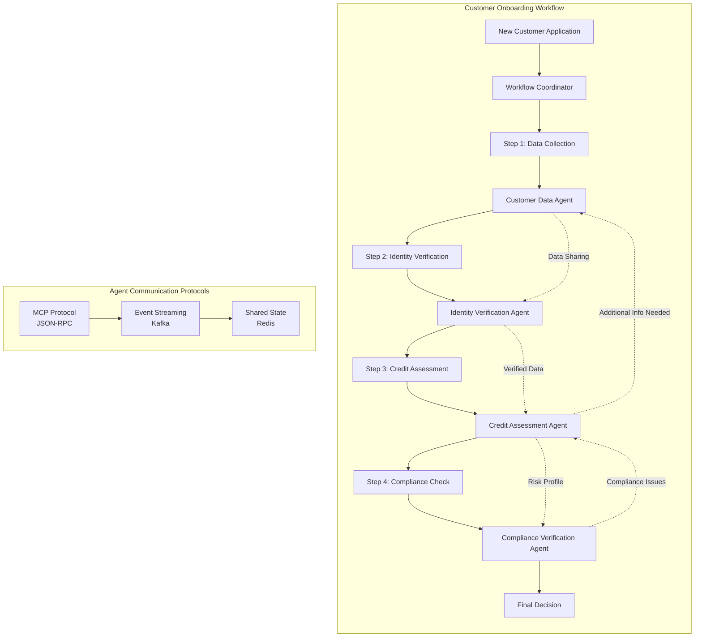

## 🏛️ MCP Server Architecture Patterns

### Banking Domain MCP Servers

```mermaid
graph LR
    subgraph "Customer Management MCP Server"
        CM1[Customer Registration Tool]
        CM2[Profile Management Tool]
        CM3[Relationship Mapping Tool]
        CM4[Communication History Tool]
        
        CM1 --> CM2 --> CM3 --> CM4
    end
    
    subgraph "Account Operations MCP Server"
        AO1[Account Opening Tool]
        AO2[Balance Management Tool]
        AO3[Statement Generation Tool]
        AO4[Account Closure Tool]
        
        AO1 --> AO2 --> AO3 --> AO4
    end
    
    subgraph "Transaction Processing MCP Server"
        TP1[Payment Initiation Tool]
        TP2[Transaction Validation Tool]
        TP3[Settlement Processing Tool]
        TP4[Transaction Monitoring Tool]
        
        TP1 --> TP2 --> TP3 --> TP4
    end
    
    subgraph "Risk Management MCP Server"
        RM1[Credit Scoring Tool]
        RM2[Portfolio Analysis Tool]
        RM3[Stress Testing Tool]
        RM4[Risk Reporting Tool]
        
        RM1 --> RM2 --> RM3 --> RM4
    end
    
    subgraph "Compliance & Reporting MCP Server"
        CR1[Regulatory Reporting Tool]
        CR2[Audit Trail Tool]
        CR3[KYC Verification Tool]
        CR4[AML Monitoring Tool]
        
        CR1 --> CR2 --> CR3 --> CR4
    end
```

### MCP Tool Taxonomy for Banking

| MCP Server | Tools | Purpose | Compliance |
|------------|-------|---------|------------|
| **Customer Management** | `register_customer`, `update_profile`, `get_customer_360` | Customer lifecycle management | GDPR, CCPA |
| **Account Operations** | `open_account`, `close_account`, `generate_statement` | Core banking operations | SOX, Basel III |
| **Transaction Processing** | `initiate_payment`, `validate_transaction`, `process_settlement` | Payment processing | PCI DSS, PSD2 |
| **Risk Management** | `assess_credit_risk`, `calculate_var`, `stress_test_portfolio` | Risk assessment | Basel III, CCAR |
| **Compliance & Reporting** | `generate_sar`, `kyc_verification`, `aml_screening` | Regulatory compliance | BSA, AML, KYC |

## 🔄 Workflow Orchestration Patterns

### Complex Banking Workflow: Commercial Loan Origination

```mermaid
graph TB
    subgraph "Multi-Agent Commercial Loan Workflow"
        Start[Loan Application Received] --> InitAgent[Initialization Agent]
        
        InitAgent --> ParallelPhase1{Parallel Processing Phase 1}
        
        ParallelPhase1 --> CustomerDD[Customer Due Diligence Agent]
        ParallelPhase1 --> FinancialAnalysis[Financial Analysis Agent]
        ParallelPhase1 --> CollateralEval[Collateral Evaluation Agent]
        
        CustomerDD --> Sync1[Synchronization Point 1]
        FinancialAnalysis --> Sync1
        CollateralEval --> Sync1
        
        Sync1 --> RiskAssessment[Risk Assessment Agent]
        RiskAssessment --> ComplianceReview[Compliance Review Agent]
        
        ComplianceReview --> Decision{Credit Decision}
        
        Decision -->|Approved| DocumentationAgent[Documentation Agent]
        Decision -->|Conditional| ConditionalAgent[Conditional Approval Agent]
        Decision -->|Declined| NotificationAgent[Notification Agent]
        
        DocumentationAgent --> FundingAgent[Funding Agent]
        ConditionalAgent --> ConditionMonitor[Condition Monitoring Agent]
        
        FundingAgent --> OnboardingAgent[Relationship Onboarding Agent]
        ConditionMonitor --> DocumentationAgent
        
        OnboardingAgent --> End[Loan Funded & Active]
        NotificationAgent --> End
    end
    
    subgraph "Agent Coordination Mechanisms"
        EventBus[Event Bus<br/>Inter-Agent Communication]
        WorkflowState[Workflow State Manager<br/>Progress Tracking]
        ErrorHandler[Error Handling Agent<br/>Exception Management]
        
        EventBus --> WorkflowState
        WorkflowState --> ErrorHandler
    end
```

### Agent Communication Patterns

#### 1. Request-Response Pattern (Synchronous)
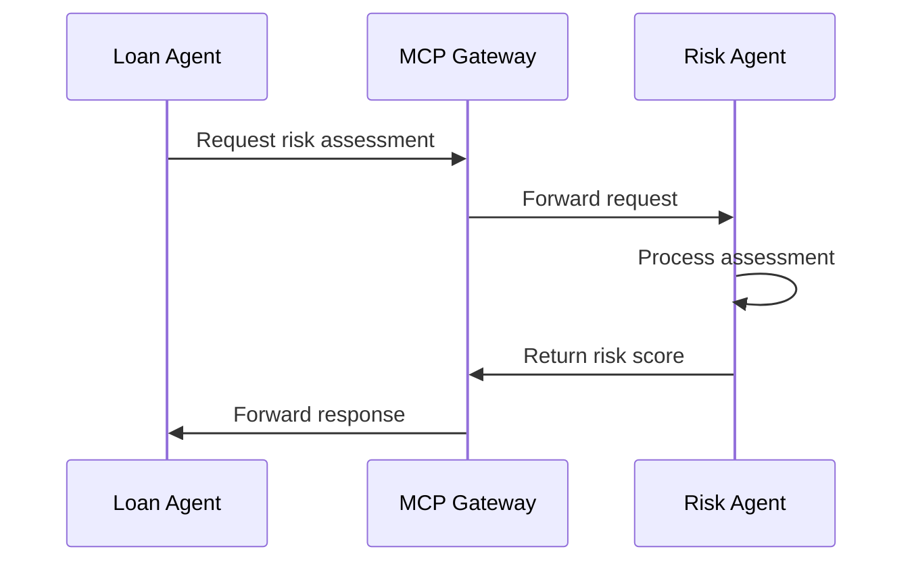

#### 2. Event-Driven Pattern (Asynchronous)
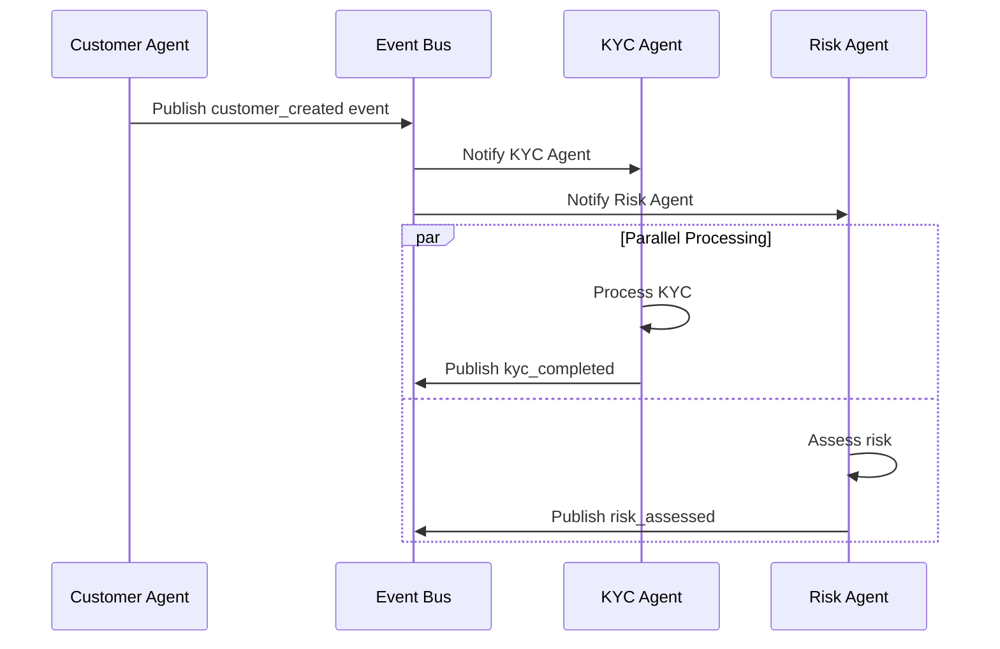

#### 3. Workflow Coordination Pattern
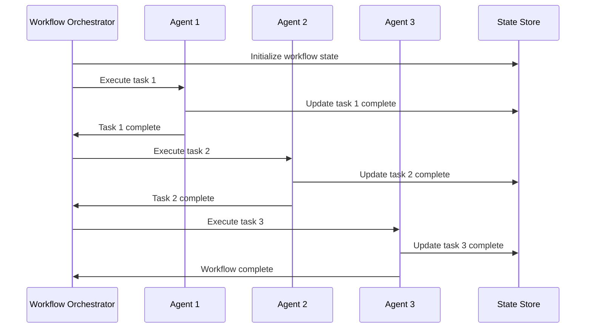

## 🛡️ Security & Governance

### Agent Security Framework

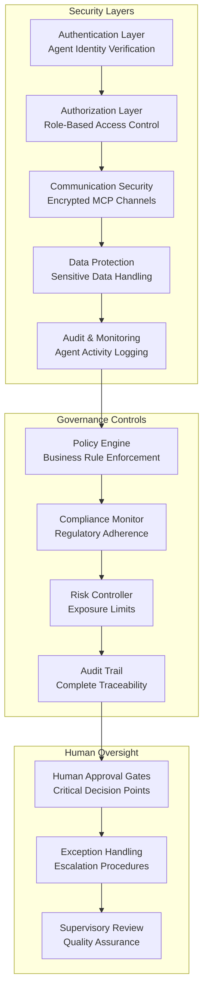

### Regulatory Compliance Framework

| Regulation | Compliance Requirement | Agent Implementation |
|------------|------------------------|---------------------|
| **Basel III** | Capital adequacy monitoring | Risk Assessment Agent continuous monitoring |
| **GDPR** | Data privacy and consent | Customer Data Agent with privacy controls |
| **SOX** | Financial reporting accuracy | Audit Trail Agent for all financial transactions |
| **BSA/AML** | Anti-money laundering | AML Monitoring Agent with real-time screening |
| **CCAR** | Capital planning and stress testing | Portfolio Management Agent stress testing |

## 📊 Performance & Scalability

### Agent Performance Metrics

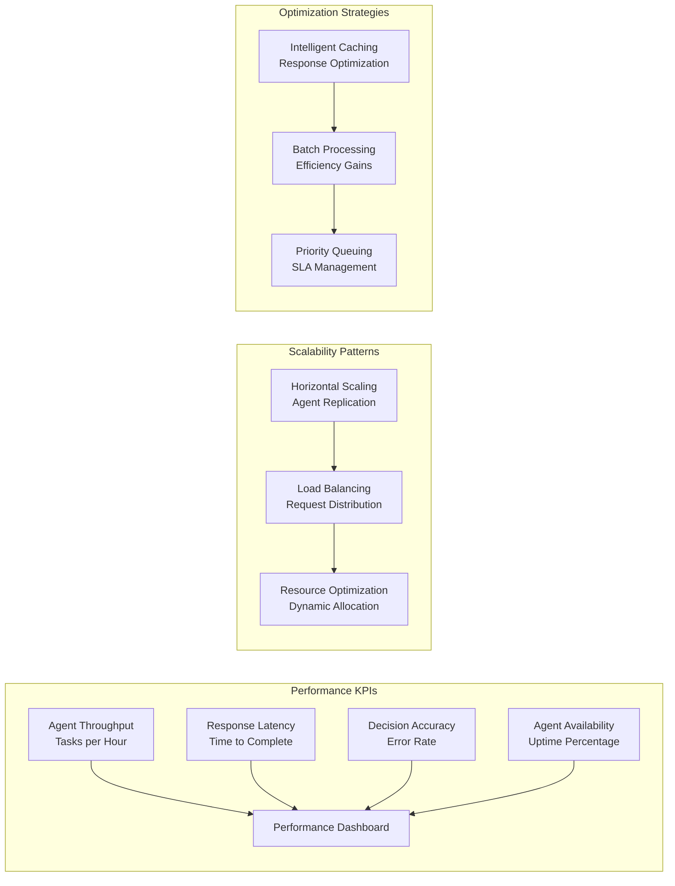

### Target Performance Benchmarks

| Workflow Type | Target Completion Time | Agent Count | Parallel Tasks |
|---------------|----------------------|-------------|----------------|
| **Customer Onboarding** | < 30 minutes | 4 agents | 2 parallel phases |
| **Loan Origination** | < 4 hours | 8 agents | 3 parallel phases |
| **Transaction Processing** | < 30 seconds | 6 agents | Real-time |
| **Risk Assessment** | < 5 minutes | 5 agents | 2 parallel phases |
| **Compliance Reporting** | < 2 hours | 3 agents | Sequential |

## 💰 Business Value & ROI

### Automation Impact Analysis

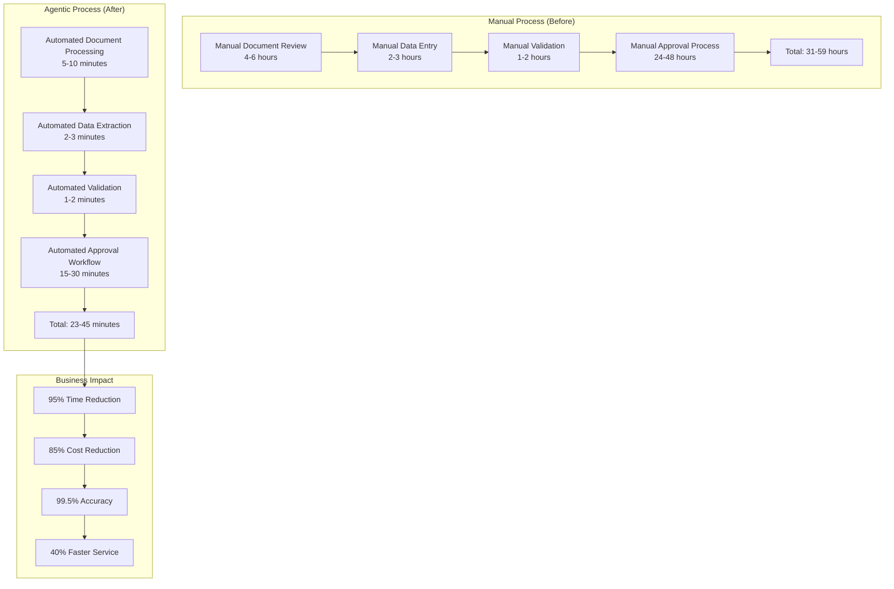

### ROI Projections (3-Year)

| Metric | Year 1 | Year 2 | Year 3 | Total |
|--------|--------|--------|--------|-------|
| **Cost Savings** | $2.5M | $4.2M | $5.8M | $12.5M |
| **Revenue Enhancement** | $1.8M | $3.5M | $5.2M | $10.5M |
| **Risk Reduction** | $800K | $1.2M | $1.6M | $3.6M |
| **Compliance Efficiency** | $500K | $750K | $1M | $2.25M |
| **Total Value** | **$5.6M** | **$9.65M** | **$13.6M** | **$28.85M** |

## 🎯 Implementation Roadmap

### Phase 1: Single Agent Foundation (Months 1-6)

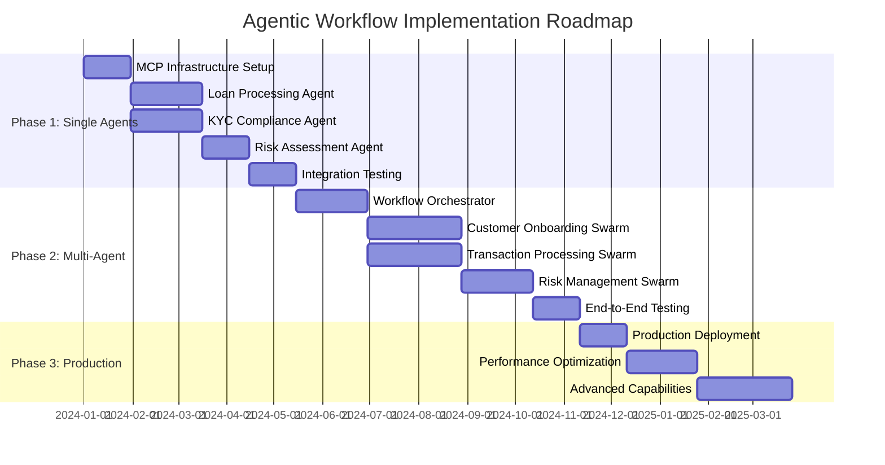

### Success Criteria

1. **Technical Metrics**
   - 99.9% agent availability
   - < 30 second workflow completion for simple tasks
   - < 4 hour completion for complex workflows
   - Zero security incidents

2. **Business Metrics**
   - 85% reduction in manual processing time
   - 95% straight-through processing rate
   - 40% improvement in customer satisfaction
   - 100% regulatory compliance

3. **Operational Metrics**
   - 50% reduction in operational errors
   - 60% improvement in staff productivity
   - 30% reduction in operational costs
   - 24/7 automated processing capability

---

## Next Steps

This Agentic Business Workflow Architecture provides the foundation for intelligent automation in banking operations. The next phase involves detailed sequence diagrams showing the progression from single-agent to multi-agent orchestration patterns.

**Related Documents:**
- [Level 0 AI Inference Architecture](./level-0-ai-inference-architecture.md)
- [AI Inference Sequence Diagrams](./level-0-ai-inference-sequences.md)
- [Agentic Business Workflow Sequences](./level-0-agentic-workflow-sequences.md)
- [Agentic Development Architecture](./level-0-agentic-development-architecture.md)