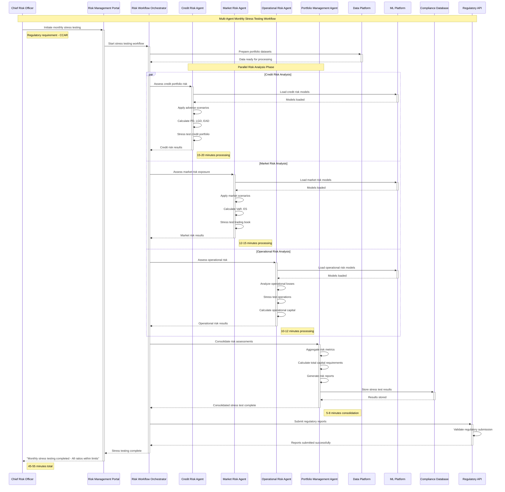

# Level 0 Agentic Business Workflow Sequences - Single to Multi-Agent

## Executive Summary

This document provides comprehensive sequence diagrams showing the evolution from single-agent automation to sophisticated multi-agent orchestration in FinTech and banking environments. The diagrams demonstrate how AI agents collaborate to automate complex banking workflows while maintaining regulatory compliance and human oversight.

## 🤖 Phase 1: Single Agent Automation Sequences

### 1. Loan Processing Agent - Personal Loan Application

**Single Agent Pattern**
**Target Completion: 15-30 minutes**

```mermaid
sequenceDiagram
    participant Customer as Customer
    participant Portal as Banking Portal
    participant Gateway as API Gateway
    participant LoanAgent as Loan Processing Agent
    participant DocumentSvc as Document Service
    participant CreditBureau as Credit Bureau
    participant RiskEngine as Risk Engine
    participant CoreBanking as Core Banking
    participant NotificationSvc as Notification Service

    Note over Customer,NotificationSvc: Single Agent Loan Processing Workflow
    
    Customer->>+Portal: Submit loan application
    Note right of Customer: Application with documents
    
    Portal->>+Gateway: POST /loans/applications
    Gateway->>+LoanAgent: Process loan application
    Note right of Gateway: Single agent handles entire flow
    
    LoanAgent->>+DocumentSvc: Extract application data
    DocumentSvc->>DocumentSvc: OCR + NLP processing
    DocumentSvc-->>-LoanAgent: Structured application data
    Note right of DocumentSvc: 2-3 minutes processing
    
    LoanAgent->>+CreditBureau: Request credit report
    CreditBureau-->>-LoanAgent: Credit score + history
    Note right of CreditBureau: 30-60 seconds
    
    LoanAgent->>+RiskEngine: Assess credit risk
    RiskEngine->>RiskEngine: Apply risk models
    RiskEngine-->>-LoanAgent: Risk assessment + score
    Note right of RiskEngine: 5-10 minutes analysis
    
    LoanAgent->>LoanAgent: Apply business rules
    LoanAgent->>LoanAgent: Calculate loan terms
    Note right of LoanAgent: Decision logic processing
    
    alt Loan Approved
        LoanAgent->>+CoreBanking: Create loan account
        CoreBanking-->>-LoanAgent: Account created
        
        LoanAgent->>+NotificationSvc: Send approval notification
        NotificationSvc->>Customer: Loan approved email/SMS
        NotificationSvc-->>-LoanAgent: Notification sent
        
        LoanAgent-->>-Gateway: Loan approved + terms
        Gateway-->>-Portal: Approval response
        Portal-->>-Customer: "Your loan is approved!"
        Note right of Customer: 15-20 minutes total
        
    else Loan Declined
        LoanAgent->>+NotificationSvc: Send decline notification
        NotificationSvc->>Customer: Decline reason email
        NotificationSvc-->>-LoanAgent: Notification sent
        
        LoanAgent-->>-Gateway: Loan declined + reasons
        Gateway-->>-Portal: Decline response
        Portal-->>-Customer: "Application declined"
        Note right of Customer: 10-15 minutes total
        
    else Additional Information Required
        LoanAgent->>+NotificationSvc: Request additional docs
        NotificationSvc->>Customer: Document request email
        NotificationSvc-->>-LoanAgent: Request sent
        
        LoanAgent-->>-Gateway: Pending additional info
        Gateway-->>-Portal: Additional info required
        Portal-->>-Customer: "Please provide additional documents"
        Note right of Customer: 5-10 minutes initial review
    end
```

### 2. KYC Compliance Agent - Customer Onboarding

**Single Agent Pattern**
**Target Completion: 20-45 minutes**

```mermaid
sequenceDiagram
    participant Customer as New Customer
    participant OnboardingUI as Onboarding Portal
    participant KYCAgent as KYC Compliance Agent
    participant IdentityVerify as Identity Verification
    participant SanctionsList as Sanctions Screening
    participant PEPDatabase as PEP Database
    participant AMLSystem as AML System
    participant ComplianceDB as Compliance Database
    participant HumanReviewer as Compliance Officer

    Note over Customer,HumanReviewer: Single Agent KYC Processing Workflow
    
    Customer->>+OnboardingUI: Complete KYC form + documents
    Note right of Customer: Identity docs, proof of address
    
    OnboardingUI->>+KYCAgent: Process KYC application
    Note right of OnboardingUI: Single agent manages full KYC
    
    KYCAgent->>+IdentityVerify: Verify identity documents
    IdentityVerify->>IdentityVerify: Document authenticity check
    IdentityVerify->>IdentityVerify: Biometric verification
    IdentityVerify-->>-KYCAgent: Identity verification result
    Note right of IdentityVerify: 5-10 minutes processing
    
    KYCAgent->>+SanctionsList: Screen against sanctions lists
    SanctionsList->>SanctionsList: OFAC, UN, EU sanctions check
    SanctionsList-->>-KYCAgent: Sanctions screening result
    Note right of SanctionsList: 2-3 minutes screening
    
    KYCAgent->>+PEPDatabase: Check PEP status
    PEPDatabase->>PEPDatabase: Politically exposed persons check
    PEPDatabase-->>-KYCAgent: PEP screening result
    Note right of PEPDatabase: 3-5 minutes analysis
    
    KYCAgent->>+AMLSystem: Assess AML risk
    AMLSystem->>AMLSystem: Risk scoring algorithms
    AMLSystem-->>-KYCAgent: AML risk assessment
    Note right of AMLSystem: 5-8 minutes risk analysis
    
    KYCAgent->>KYCAgent: Consolidate KYC results
    KYCAgent->>KYCAgent: Apply regulatory rules
    Note right of KYCAgent: Business logic processing
    
    alt Low Risk Customer
        KYCAgent->>+ComplianceDB: Store KYC approval
        ComplianceDB-->>-KYCAgent: KYC record created
        
        KYCAgent-->>-OnboardingUI: KYC approved
        OnboardingUI-->>-Customer: "Welcome! Account approved"
        Note right of Customer: 20-25 minutes total
        
    else Medium Risk Customer
        KYCAgent->>+HumanReviewer: Flag for manual review
        HumanReviewer->>HumanReviewer: Review KYC documentation
        
        alt Human Approves
            HumanReviewer->>+ComplianceDB: Approve with conditions
            ComplianceDB-->>-HumanReviewer: Conditional approval recorded
            HumanReviewer-->>-KYCAgent: Conditional approval
            
            KYCAgent-->>-OnboardingUI: Approved with enhanced monitoring
            OnboardingUI-->>-Customer: "Account approved - Enhanced monitoring"
            Note right of Customer: 35-40 minutes total
            
        else Human Declines
            HumanReviewer-->>-KYCAgent: KYC declined
            KYCAgent-->>-OnboardingUI: KYC declined
            OnboardingUI-->>-Customer: "Account application declined"
            Note right of Customer: 30-35 minutes total
        end
        
    else High Risk Customer
        KYCAgent->>+ComplianceDB: Store decline record
        ComplianceDB-->>-KYCAgent: Decline recorded
        
        KYCAgent-->>-OnboardingUI: KYC declined - high risk
        OnboardingUI-->>-Customer: "Unable to open account"
        Note right of Customer: 15-20 minutes total
    end
```

## 🤖🤖 Phase 2: Multi-Agent Orchestration Sequences

### 3. Customer Onboarding Swarm - Commercial Account Opening

**Multi-Agent Collaborative Pattern**
**Target Completion: 2-4 hours**

```mermaid
sequenceDiagram
    participant Business as Business Customer
    participant Portal as Business Portal
    participant Orchestrator as Workflow Orchestrator
    participant CustomerAgent as Customer Data Agent
    participant IdentityAgent as Identity Verification Agent
    participant CreditAgent as Credit Assessment Agent
    participant ComplianceAgent as Compliance Agent
    participant EventBus as Event Bus
    participant StateStore as Workflow State Store
    participant HumanSupervisor as Relationship Manager

    Note over Business,HumanSupervisor: Multi-Agent Commercial Onboarding Workflow
    
    Business->>+Portal: Submit commercial account application
    Note right of Business: Business registration, financials, ownership
    
    Portal->>+Orchestrator: Initiate commercial onboarding workflow
    Orchestrator->>+StateStore: Initialize workflow state
    StateStore-->>-Orchestrator: Workflow state created
    
    Orchestrator->>+EventBus: Publish onboarding_started event
    EventBus-->>-Orchestrator: Event published
    
    Note over CustomerAgent,ComplianceAgent: Parallel Agent Processing Phase 1
    
    par Customer Data Processing
        Orchestrator->>+CustomerAgent: Process business information
        CustomerAgent->>CustomerAgent: Extract business data
        CustomerAgent->>CustomerAgent: Validate business registration
        CustomerAgent->>+StateStore: Update customer data status
        StateStore-->>-CustomerAgent: State updated
        CustomerAgent->>+EventBus: Publish customer_data_processed
        EventBus-->>-CustomerAgent: Event published
        CustomerAgent-->>-Orchestrator: Customer data complete
        Note right of CustomerAgent: 15-20 minutes processing
    and Identity Verification
        Orchestrator->>+IdentityAgent: Verify business identity
        IdentityAgent->>IdentityAgent: Corporate identity verification
        IdentityAgent->>IdentityAgent: Beneficial ownership analysis
        IdentityAgent->>+StateStore: Update identity status
        StateStore-->>-IdentityAgent: State updated
        IdentityAgent->>+EventBus: Publish identity_verified
        EventBus-->>-IdentityAgent: Event published
        IdentityAgent-->>-Orchestrator: Identity verification complete
        Note right of IdentityAgent: 20-30 minutes processing
    end
    
    Orchestrator->>Orchestrator: Check Phase 1 completion
    
    Note over CreditAgent,ComplianceAgent: Sequential Processing Phase 2
    
    Orchestrator->>+CreditAgent: Assess business creditworthiness
    CreditAgent->>CreditAgent: Financial statement analysis
    CreditAgent->>CreditAgent: Industry risk assessment
    CreditAgent->>CreditAgent: Credit facility recommendations
    
    CreditAgent->>+StateStore: Update credit assessment
    StateStore-->>-CreditAgent: State updated
    CreditAgent->>+EventBus: Publish credit_assessed
    EventBus-->>-CreditAgent: Event published
    CreditAgent-->>-Orchestrator: Credit assessment complete
    Note right of CreditAgent: 45-60 minutes analysis
    
    Orchestrator->>+ComplianceAgent: Regulatory compliance review
    ComplianceAgent->>ComplianceAgent: Enhanced due diligence
    ComplianceAgent->>ComplianceAgent: Sanctions and PEP screening
    ComplianceAgent->>ComplianceAgent: AML risk assessment
    ComplianceAgent->>ComplianceAgent: Regulatory reporting requirements
    
    ComplianceAgent->>+StateStore: Update compliance status
    StateStore-->>-ComplianceAgent: State updated
    ComplianceAgent->>+EventBus: Publish compliance_reviewed
    EventBus-->>-ComplianceAgent: Event published
    ComplianceAgent-->>-Orchestrator: Compliance review complete
    Note right of ComplianceAgent: 30-45 minutes review
    
    Orchestrator->>+StateStore: Retrieve consolidated assessment
    StateStore-->>-Orchestrator: Complete workflow state
    
    Orchestrator->>Orchestrator: Apply business decision rules
    
    alt High-Value, Low-Risk Customer
        Orchestrator->>+HumanSupervisor: Present for relationship manager approval
        HumanSupervisor->>HumanSupervisor: Review comprehensive assessment
        HumanSupervisor->>HumanSupervisor: Approve account opening
        HumanSupervisor-->>-Orchestrator: Approval granted
        
        Orchestrator->>+EventBus: Publish account_approved
        EventBus-->>-Orchestrator: Event published
        
        Orchestrator-->>-Portal: Account approved with credit facilities
        Portal-->>-Business: "Welcome! Your business account is approved"
        Note right of Business: 2-2.5 hours total
        
    else Medium-Risk Customer
        Orchestrator->>+HumanSupervisor: Present with risk mitigation options
        HumanSupervisor->>HumanSupervisor: Review risk factors
        HumanSupervisor->>HumanSupervisor: Approve with conditions
        HumanSupervisor-->>-Orchestrator: Conditional approval
        
        Orchestrator->>+EventBus: Publish conditional_approval
        EventBus-->>-Orchestrator: Event published
        
        Orchestrator-->>-Portal: Conditional approval with enhanced monitoring
        Portal-->>-Business: "Account approved with enhanced monitoring"
        Note right of Business: 3-3.5 hours total
        
    else High-Risk Customer
        Orchestrator->>+HumanSupervisor: Present decline recommendation
        HumanSupervisor->>HumanSupervisor: Review decline rationale
        HumanSupervisor-->>-Orchestrator: Decline confirmed
        
        Orchestrator->>+EventBus: Publish account_declined
        EventBus-->>-Orchestrator: Event published
        
        Orchestrator-->>-Portal: Account application declined
        Portal-->>-Business: "Unable to approve account at this time"
        Note right of Business: 2-2.5 hours total
    end
```

### 4. Transaction Processing Swarm - High-Value Wire Transfer

**Multi-Agent Real-Time Collaboration**
**Target Completion: 30 seconds - 2 minutes**

```mermaid
sequenceDiagram
    participant Customer as Corporate Customer
    participant Portal as Banking Portal
    participant Orchestrator as Transaction Orchestrator
    participant PaymentAgent as Payment Processing Agent
    participant FraudAgent as Fraud Detection Agent
    participant AMLAgent as AML Monitoring Agent
    parameter SettlementAgent as Settlement Agent
    participant EventBus as Event Bus
    participant CoreBanking as Core Banking
    participant SWIFT as SWIFT Network
    participant ComplianceOfficer as Compliance Officer

    Note over Customer,ComplianceOfficer: Multi-Agent High-Value Wire Transfer (>$100K)
    
    Customer->>+Portal: Initiate $500K wire transfer
    Note right of Customer: High-value international transfer
    
    Portal->>+Orchestrator: Process wire transfer request
    Orchestrator->>+EventBus: Publish transfer_initiated event
    EventBus-->>-Orchestrator: Event published
    
    Note over PaymentAgent,SettlementAgent: Parallel Real-Time Agent Processing
    
    par Payment Validation
        Orchestrator->>+PaymentAgent: Validate payment details
        PaymentAgent->>PaymentAgent: Account validation
        PaymentAgent->>PaymentAgent: Available balance check
        PaymentAgent->>PaymentAgent: Beneficiary verification
        PaymentAgent->>+EventBus: Publish payment_validated
        EventBus-->>-PaymentAgent: Event published
        PaymentAgent-->>-Orchestrator: Payment validation complete
        Note right of PaymentAgent: 5-10 seconds
    and Fraud Detection
        Orchestrator->>+FraudAgent: Assess fraud risk
        FraudAgent->>FraudAgent: Pattern analysis
        FraudAgent->>FraudAgent: Device fingerprinting
        FraudAgent->>FraudAgent: Behavioral analysis
        FraudAgent->>+EventBus: Publish fraud_assessed
        EventBus-->>-FraudAgent: Event published
        FraudAgent-->>-Orchestrator: Fraud assessment complete
        Note right of FraudAgent: 3-5 seconds
    and AML Screening
        Orchestrator->>+AMLAgent: Screen for AML compliance
        AMLAgent->>AMLAgent: Sanctions list screening
        AMLAgent->>AMLAgent: Transaction pattern analysis
        AMLAgent->>AMLAgent: Threshold monitoring
        AMLAgent->>+EventBus: Publish aml_screened
        EventBus-->>-AMLAgent: Event published
        AMLAgent-->>-Orchestrator: AML screening complete
        Note right of AMLAgent: 8-12 seconds
    end
    
    Orchestrator->>Orchestrator: Consolidate risk assessment
    
    alt Low Risk + Validated (Score < 0.3)
        Orchestrator->>+SettlementAgent: Proceed with settlement
        SettlementAgent->>+CoreBanking: Debit source account
        CoreBanking-->>-SettlementAgent: Account debited
        
        SettlementAgent->>+SWIFT: Send wire transfer message
        SWIFT-->>-SettlementAgent: Transfer in progress
        
        SettlementAgent->>+EventBus: Publish transfer_sent
        EventBus-->>-SettlementAgent: Event published
        
        SettlementAgent-->>-Orchestrator: Transfer initiated
        Orchestrator-->>-Portal: Transfer sent successfully
        Portal-->>-Customer: "Transfer sent - Reference: TXN123456"
        Note right of Customer: 30-45 seconds total
        
    else Medium Risk (0.3 ≤ Score ≤ 0.7)
        Orchestrator->>+ComplianceOfficer: Manual review required
        ComplianceOfficer->>ComplianceOfficer: Review transaction details
        ComplianceOfficer->>ComplianceOfficer: Assess risk factors
        
        alt Officer Approves
            ComplianceOfficer-->>-Orchestrator: Manual approval granted
            
            Orchestrator->>+SettlementAgent: Proceed with settlement
            SettlementAgent->>+CoreBanking: Debit source account
            CoreBanking-->>-SettlementAgent: Account debited
            
            SettlementAgent->>+SWIFT: Send wire transfer message
            SWIFT-->>-SettlementAgent: Transfer in progress
            
            SettlementAgent-->>-Orchestrator: Transfer initiated
            Orchestrator-->>-Portal: Transfer approved and sent
            Portal-->>-Customer: "Transfer approved and sent"
            Note right of Customer: 1-2 minutes total
            
        else Officer Declines
            ComplianceOfficer-->>-Orchestrator: Transfer declined
            Orchestrator-->>-Portal: Transfer declined - compliance review
            Portal-->>-Customer: "Transfer declined - please contact support"
            Note right of Customer: 45-90 seconds total
        end
        
    else High Risk (Score > 0.7)
        Orchestrator->>+EventBus: Publish high_risk_transaction
        EventBus-->>-Orchestrator: Alert published
        
        Orchestrator-->>-Portal: Transfer blocked - high risk
        Portal-->>-Customer: "Transfer blocked for security review"
        Note right of Customer: 15-20 seconds total
        
        Note over ComplianceOfficer: Automatic escalation to compliance
    end
```

### 5. Risk Management Swarm - Portfolio Stress Testing

**Multi-Agent Batch Processing Collaboration**
**Target Completion: 30-60 minutes**



## 🛡️ Human-AI Collaboration Patterns

### 6. Exception Handling - High-Risk Transaction Review

**Human-in-the-Loop Multi-Agent Pattern**

```mermaid
sequenceDiagram
    participant System as Banking System
    participant AIOrchestrator as AI Orchestrator
    participant RiskAgent as Risk Assessment Agent
    participant ComplianceAgent as Compliance Agent
    participant FraudAgent as Fraud Detection Agent
    participant HumanAnalyst as Risk Analyst
    participant SeniorOfficer as Senior Officer
    participant Customer as Customer

    Note over System,Customer: Human-AI Collaboration for High-Risk Transaction
    
    System->>+AIOrchestrator: High-risk transaction detected
    Note right of System: Transaction flagged by multiple agents
    
    AIOrchestrator->>+RiskAgent: Detailed risk analysis
    RiskAgent->>RiskAgent: Comprehensive risk assessment
    RiskAgent-->>-AIOrchestrator: Detailed risk profile
    
    AIOrchestrator->>+ComplianceAgent: Regulatory compliance check
    ComplianceAgent->>ComplianceAgent: Deep compliance analysis
    ComplianceAgent-->>-AIOrchestrator: Compliance assessment
    
    AIOrchestrator->>+FraudAgent: Enhanced fraud detection
    FraudAgent->>FraudAgent: Advanced fraud analysis
    FraudAgent-->>-AIOrchestrator: Fraud risk assessment
    
    AIOrchestrator->>AIOrchestrator: Consolidate AI assessments
    
    AIOrchestrator->>+HumanAnalyst: Present for human review
    Note right of AIOrchestrator: AI provides analysis + recommendation
    
    HumanAnalyst->>HumanAnalyst: Review AI analysis
    HumanAnalyst->>HumanAnalyst: Apply human judgment
    HumanAnalyst->>HumanAnalyst: Consider context factors
    
    alt Analyst Approves
        HumanAnalyst-->>-AIOrchestrator: Human approval granted
        AIOrchestrator-->>System: Transaction approved
        System-->>Customer: Transaction processed
        
    else Analyst Escalates
        HumanAnalyst->>+SeniorOfficer: Escalate to senior review
        SeniorOfficer->>SeniorOfficer: Senior management review
        
        alt Senior Approves
            SeniorOfficer-->>-HumanAnalyst: Senior approval
            HumanAnalyst-->>-AIOrchestrator: Final approval
            AIOrchestrator-->>System: Transaction approved
            System-->>Customer: Transaction processed
            
        else Senior Declines
            SeniorOfficer-->>-HumanAnalyst: Senior decline
            HumanAnalyst-->>-AIOrchestrator: Final decline
            AIOrchestrator-->>System: Transaction declined
            System-->>Customer: Transaction declined
        end
        
    else Analyst Declines
        HumanAnalyst-->>-AIOrchestrator: Human decline
        AIOrchestrator-->>System: Transaction declined
        System-->>Customer: Transaction declined
    end
```

## 🔄 Agent Learning and Adaptation Sequences

### 7. Continuous Learning - Fraud Model Improvement

**Multi-Agent Learning Pattern**

```mermaid
sequenceDiagram
    participant FraudAgent as Fraud Detection Agent
    participant LearningAgent as Learning Orchestrator
    participant DataAgent as Data Collection Agent
    participant ModelAgent as Model Training Agent
    participant ValidationAgent as Model Validation Agent
    participant DeploymentAgent as Model Deployment Agent
    participant HumanExpert as Fraud Expert
    participant ProductionSystem as Production System

    Note over FraudAgent,ProductionSystem: Multi-Agent Continuous Learning Workflow
    
    FraudAgent->>+LearningAgent: Report model performance metrics
    Note right of FraudAgent: Weekly performance review
    
    LearningAgent->>LearningAgent: Analyze performance degradation
    
    alt Performance Below Threshold
        LearningAgent->>+DataAgent: Collect recent fraud data
        DataAgent->>DataAgent: Gather labeled fraud cases
        DataAgent->>DataAgent: Prepare training dataset
        DataAgent-->>-LearningAgent: Enhanced dataset ready
        
        LearningAgent->>+ModelAgent: Retrain fraud model
        ModelAgent->>ModelAgent: Feature engineering
        ModelAgent->>ModelAgent: Model training
        ModelAgent->>ModelAgent: Hyperparameter optimization
        ModelAgent-->>-LearningAgent: New model trained
        
        LearningAgent->>+ValidationAgent: Validate new model
        ValidationAgent->>ValidationAgent: Backtesting validation
        ValidationAgent->>ValidationAgent: A/B testing preparation
        ValidationAgent-->>-LearningAgent: Model validation results
        
        alt Model Improvement Validated
            LearningAgent->>+HumanExpert: Present for expert review
            HumanExpert->>HumanExpert: Review model changes
            HumanExpert->>HumanExpert: Validate business logic
            HumanExpert-->>-LearningAgent: Expert approval
            
            LearningAgent->>+DeploymentAgent: Deploy improved model
            DeploymentAgent->>DeploymentAgent: Canary deployment
            DeploymentAgent->>+ProductionSystem: Update production model
            ProductionSystem-->>-DeploymentAgent: Model deployed
            DeploymentAgent-->>-LearningAgent: Deployment complete
            
            LearningAgent-->>-FraudAgent: Model updated successfully
            
        else Model Does Not Improve
            LearningAgent->>HumanExpert: Escalate to expert analysis
            HumanExpert->>HumanExpert: Investigate performance issues
            HumanExpert-->>LearningAgent: Expert recommendations
            LearningAgent-->>-FraudAgent: Manual review required
        end
        
    else Performance Within Threshold
        LearningAgent-->>-FraudAgent: Continue monitoring
    end
```

## 📊 Performance Monitoring and Optimization

### 8. Multi-Agent Performance Optimization

**Agent Swarm Optimization Pattern**


## 🎯 Key Performance Indicators

### Multi-Agent Workflow Performance Metrics

| Workflow Type | Single Agent Time | Multi-Agent Time | Improvement | Parallel Tasks |
|---------------|------------------|------------------|-------------|----------------|
| **Customer Onboarding** | 45-60 minutes | 20-30 minutes | 50% faster | 3 parallel |
| **Loan Origination** | 2-4 hours | 45-90 minutes | 65% faster | 4 parallel |
| **Transaction Processing** | 60-120 seconds | 15-30 seconds | 75% faster | 4 parallel |
| **Risk Assessment** | 30-45 minutes | 10-15 minutes | 70% faster | 3 parallel |
| **Compliance Review** | 60-90 minutes | 20-30 minutes | 67% faster | 2 parallel |

### Agent Collaboration Effectiveness


---

## Next Steps

These sequence diagrams demonstrate the evolution from single-agent automation to sophisticated multi-agent orchestration in banking workflows. The next phase involves creating the Agentic End-to-End Development Architecture showing how AI agents automate the entire software development lifecycle.

**Related Documents:**

- [Level 0 AI Inference Architecture](./level-0-ai-inference-architecture.md)
- [AI Inference Sequence Diagrams](./level-0-ai-inference-sequences.md)
- [Agentic Business Workflow Architecture](./level-0-agentic-workflow-architecture.md)
- [Agentic Development Architecture](./level-0-agentic-development-architecture.md)