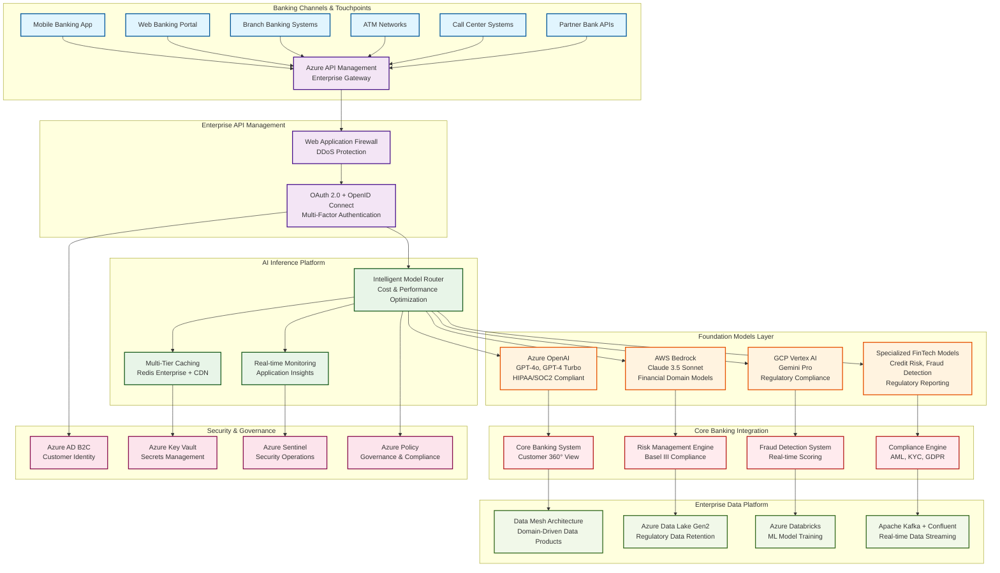
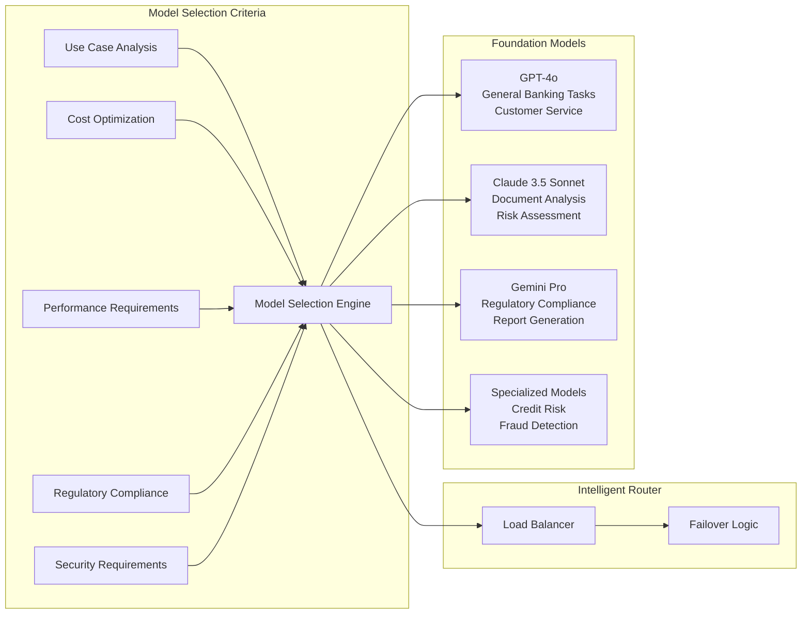
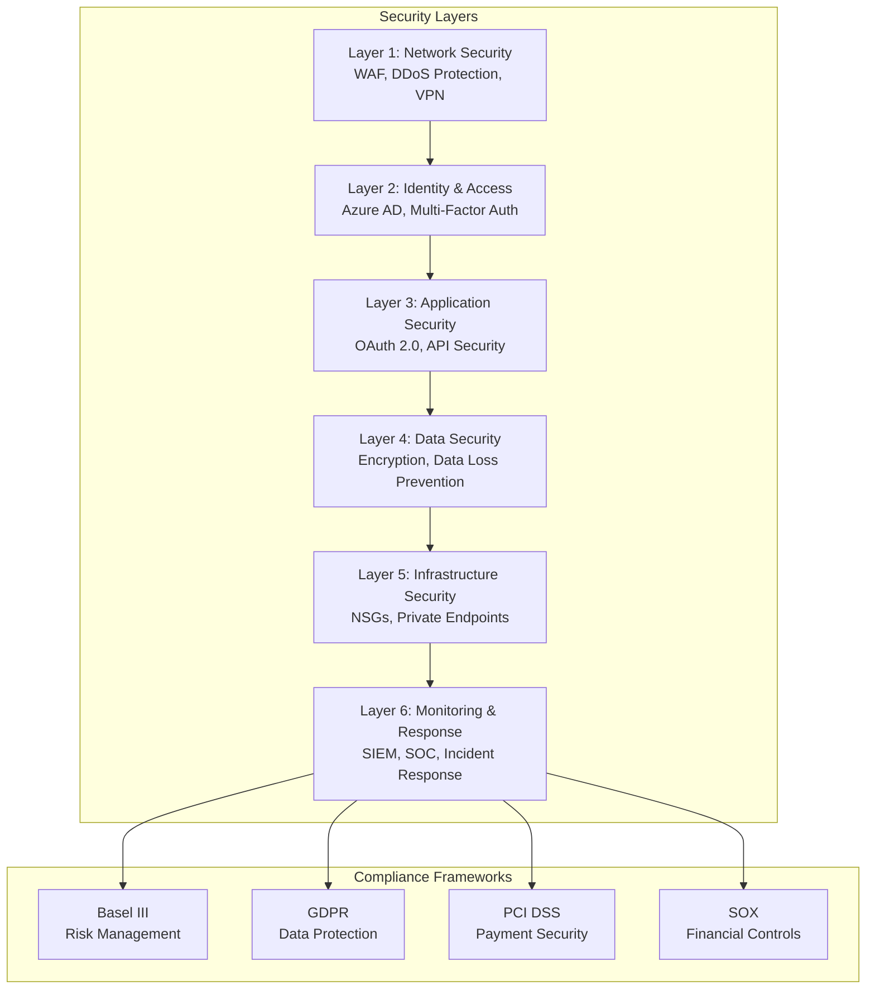
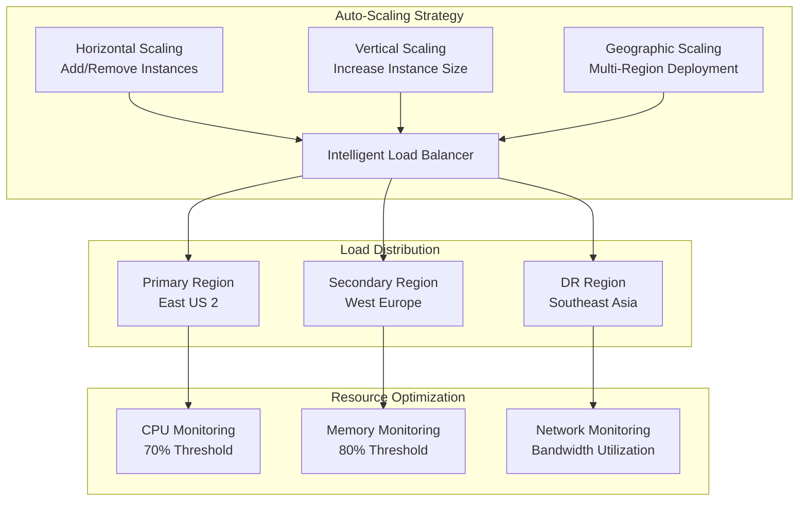
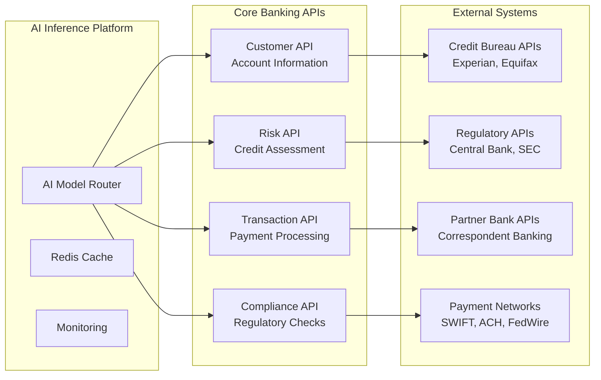

# Level 0 AI Inference Architecture - FinTech & Tier 1 Banking

## Executive Summary

This document defines the Level 0 (highest level) enterprise architecture for AI Inference capabilities designed specifically for FinTech and Tier 1 banking institutions. This architecture follows enterprise architecture best practices and regulatory compliance requirements including Basel III, GDPR, PCI DSS, and SOX.

## 🏗️ Level 0 High-Level Architecture

### Strategic AI Inference Platform Overview

## 🏛️ Enterprise Architecture Principles

### 1. Regulatory Compliance First
- **Basel III Risk Management**: Comprehensive capital adequacy and risk assessment
- **GDPR Data Protection**: Privacy by design with data sovereignty
- **PCI DSS Security**: Payment card industry security standards
- **SOX Compliance**: Financial reporting accuracy and transparency
- **AML/KYC Requirements**: Anti-money laundering and know your customer

### 2. Zero Trust Security Model
- **Identity Verification**: Multi-factor authentication for all access
- **Least Privilege Access**: Role-based access control (RBAC)
- **Continuous Monitoring**: Real-time security posture assessment
- **Network Segmentation**: Micro-segmentation for data protection
- **Encryption Everywhere**: End-to-end encryption for data in transit and at rest

### 3. High Availability & Performance
- **99.99% Uptime SLA**: Enterprise-grade availability requirements
- **Sub-10ms Response Time**: Real-time transaction processing
- **Horizontal Scaling**: Auto-scaling based on demand
- **Disaster Recovery**: Multi-region failover capabilities
- **Performance Monitoring**: Continuous performance optimization

### 4. Cost Optimization
- **Multi-Cloud Strategy**: Optimal cost through cloud provider diversity
- **Intelligent Model Routing**: Cost-performance optimization algorithms
- **Resource Right-Sizing**: Dynamic resource allocation
- **Reserved Capacity**: Strategic capacity planning for cost savings

## 🔄 AI Inference Processing Modes

### Real-Time Inference (< 100ms)
- **Use Cases**: Fraud detection, payment authorization, customer service chatbots
- **SLA**: 25-100ms response time
- **Architecture**: In-memory caching, edge computing, CDN acceleration
- **Models**: Lightweight specialized models for specific banking operations

### Near-Real-Time Inference (100ms - 1s)
- **Use Cases**: Risk assessment, credit scoring, regulatory reporting
- **SLA**: 100ms-1s response time
- **Architecture**: Event streaming, micro-batch processing
- **Models**: Medium complexity models with acceptable latency

### Batch Inference (Minutes to Hours)
- **Use Cases**: Portfolio analysis, stress testing, regulatory compliance reports
- **SLA**: 5 minutes to 1 hour
- **Architecture**: Distributed computing, data lake processing
- **Models**: Complex models requiring extensive computation

## 🏗️ Foundation Model Selection Strategy

### Multi-Model Intelligence Approach

### Model Assignment Strategy

| Use Case | Primary Model | Secondary Model | Rationale |
|----------|---------------|-----------------|-----------|
| Customer Service | GPT-4o | Claude 3.5 | Natural conversation, multilingual support |
| Document Analysis | Claude 3.5 | GPT-4o | Superior document understanding |
| Risk Assessment | Specialized FinTech | Gemini Pro | Domain-specific training data |
| Fraud Detection | Specialized FinTech | GPT-4o | Real-time pattern recognition |
| Regulatory Reporting | Gemini Pro | Claude 3.5 | Structured data processing |
| Credit Scoring | Specialized FinTech | Claude 3.5 | Regulatory compliance requirements |

## 🛡️ Security Architecture

### Defense in Depth Strategy

## 📊 Performance & Scalability Targets

### Enterprise KPIs

| Metric | Target | Measurement |
|--------|--------|-------------|
| Availability | 99.99% | Monthly uptime |
| Response Time (Real-time) | < 100ms | 95th percentile |
| Response Time (Near-real-time) | < 1s | 95th percentile |
| Throughput | 100,000 TPS | Peak concurrent transactions |
| Error Rate | < 0.01% | Failed requests |
| Security Incidents | Zero | Monthly security breaches |
| Regulatory Compliance | 100% | Audit findings |

### Scalability Architecture

## 💰 Total Cost of Ownership (TCO)

### Investment Breakdown (Annual)

| Category | Cost (USD) | Percentage | Description |
|----------|------------|------------|-------------|
| Infrastructure | $800,000 | 31% | Cloud computing, storage, networking |
| AI Model Licenses | $650,000 | 25% | Foundation model API costs |
| Security & Compliance | $520,000 | 20% | Security tools, compliance audits |
| Operations & Support | $390,000 | 15% | 24/7 operations, technical support |
| Data & Analytics | $240,000 | 9% | Data platform, analytics tools |
| **Total** | **$2,600,000** | **100%** | **Complete platform cost** |

### ROI Projections

- **Cost Reduction**: 35% reduction in manual processing costs
- **Revenue Enhancement**: 15% increase in cross-selling through AI recommendations
- **Risk Mitigation**: 40% reduction in fraud losses
- **Compliance Efficiency**: 50% reduction in regulatory reporting time
- **Customer Satisfaction**: 25% improvement in customer service metrics

## 🔗 Integration Points

### Core Banking System Integration

## 🎯 Success Metrics

### Business Value KPIs

1. **Operational Efficiency**
   - 60% reduction in manual document processing
   - 45% faster loan approval times
   - 30% reduction in customer service response time

2. **Risk Management**
   - 40% improvement in fraud detection accuracy
   - 25% reduction in false positives
   - 35% improvement in credit risk assessment

3. **Customer Experience**
   - 90%+ customer satisfaction scores
   - 50% reduction in customer wait times
   - 35% increase in digital engagement

4. **Regulatory Compliance**
   - 100% regulatory audit pass rate
   - 50% reduction in compliance reporting time
   - Zero regulatory penalties

## 📋 Implementation Roadmap

### Phase 1: Foundation (Months 1-3)
- Deploy core AI inference infrastructure
- Implement security and compliance frameworks
- Establish model routing and caching

### Phase 2: Core Banking Integration (Months 4-6)
- Integrate with core banking systems
- Deploy fraud detection capabilities
- Implement customer service AI

### Phase 3: Advanced Analytics (Months 7-9)
- Deploy risk assessment models
- Implement regulatory reporting automation
- Launch predictive analytics capabilities

### Phase 4: Optimization (Months 10-12)
- Performance optimization and tuning
- Advanced model deployment
- Full production rollout

---

## Next Steps

This Level 0 architecture provides the strategic foundation for AI inference in FinTech and banking environments. The next phase will involve detailed sequence diagrams showing the interaction flows for each inference mode and use case.

**Related Documents:**
- [AI Inference Sequence Diagrams](./level-0-ai-inference-sequences.md)
- [Agentic Business Workflow Architecture](./level-0-agentic-workflow-architecture.md)
- [Agentic Development Architecture](./level-0-agentic-development-architecture.md)