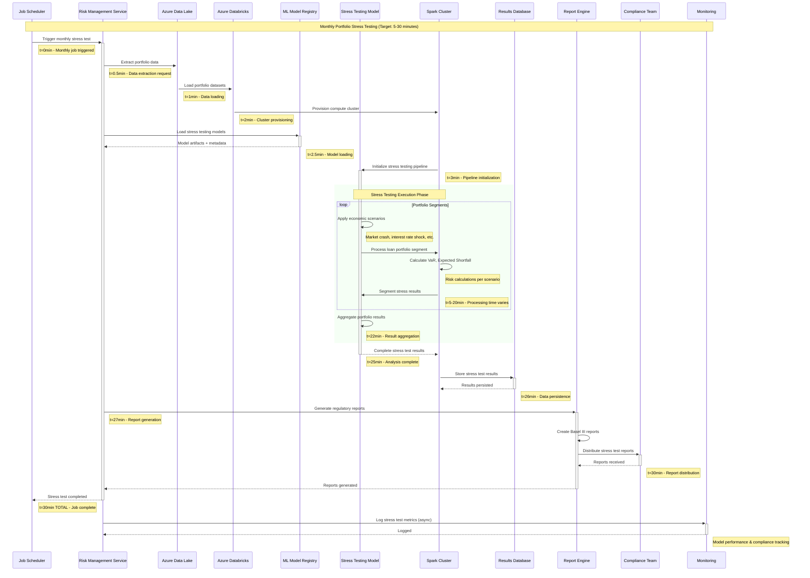
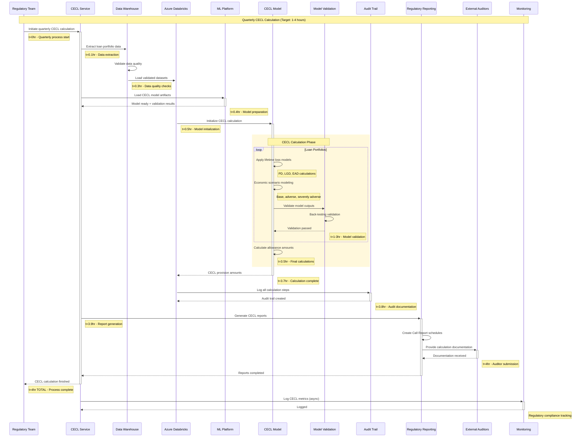
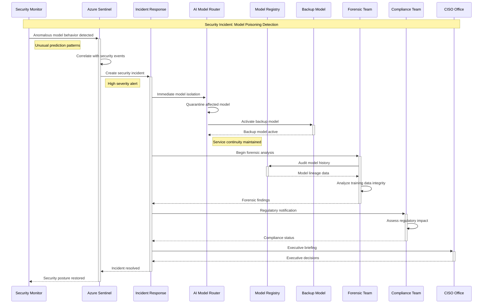
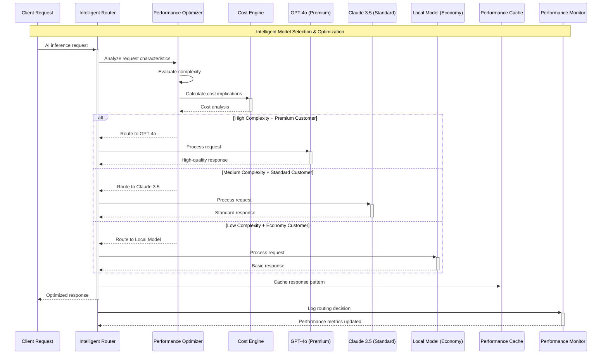

# Level 0 AI Inference Sequence Diagrams - FinTech & Banking

## Executive Summary

This document provides comprehensive sequence diagrams for AI inference operations in FinTech and Tier 1 banking environments. The diagrams show detailed interaction flows, timing requirements, and security checkpoints for enterprise-grade AI operations.

## 🔄 Real-Time AI Inference Sequences

### 1. Fraud Detection - Real-Time Transaction Analysis

**Target Performance: < 100ms**
**Use Case: Credit card transaction authorization**

```mermaid
sequenceDiagram
    participant Customer as Customer
    participant POS as Point of Sale
    participant Gateway as Payment Gateway
    participant AuthSvc as Authorization Service
    participant AIRouter as AI Model Router
    participant Cache as Redis Cache
    participant FraudModel as Fraud Detection Model
    participant RiskEngine as Risk Engine
    participant CoreBanking as Core Banking
    participant Monitor as Monitoring

    Note over Customer,Monitor: Real-Time Fraud Detection (Target: < 100ms)
    
    Customer->>+POS: Swipe/Insert Card
    Note right of Customer: t=0ms - Transaction initiated
    
    POS->>+Gateway: Transaction Request
    Note right of POS: t=5ms - POS processing
    
    Gateway->>+AuthSvc: Authorization Request + Customer ID
    Note right of Gateway: t=10ms - Gateway routing
    
    AuthSvc->>+Cache: Check fraud pattern cache
    Note right of AuthSvc: t=15ms - Cache lookup
    
    alt Cache Hit (Fraud Pattern Exists)
        Cache-->>-AuthSvc: Known fraud pattern
        Note right of Cache: t=20ms - Immediate response
        AuthSvc->>+Monitor: Log fraud attempt
        AuthSvc-->>-Gateway: DECLINE (High Risk)
        Gateway-->>-POS: Transaction Declined
        POS-->>-Customer: Card Declined
        Note right of Customer: t=30ms TOTAL - Fast decline
    else Cache Miss (New Pattern)
        Cache-->>-AuthSvc: No cached result
        Note right of Cache: t=20ms - Cache miss
        
        AuthSvc->>+AIRouter: Real-time fraud analysis request
        Note right of AuthSvc: t=25ms - AI routing
        
        AIRouter->>+FraudModel: Analyze transaction pattern
        Note right of AIRouter: t=30ms - Model selection
        
        par Parallel Analysis
            FraudModel->>FraudModel: Pattern matching
            Note right of FraudModel: t=30-60ms - AI processing
        and
            AuthSvc->>+RiskEngine: Customer risk profile
            RiskEngine->>+CoreBanking: Account history
            CoreBanking-->>-RiskEngine: Transaction history
            RiskEngine-->>-AuthSvc: Risk score
        end
        
        FraudModel-->>-AIRouter: Fraud probability score
        Note right of FraudModel: t=65ms - AI result
        
        AIRouter-->>-AuthSvc: Consolidated fraud assessment
        Note right of AIRouter: t=70ms - Result consolidation
        
        alt Low Fraud Risk (Score < 0.3)
            AuthSvc->>+CoreBanking: Proceed with authorization
            CoreBanking-->>-AuthSvc: Authorization approved
            AuthSvc->>Cache: Cache low-risk pattern
            AuthSvc-->>-Gateway: APPROVE
            Gateway-->>-POS: Transaction Approved
            POS-->>-Customer: Payment Successful
            Note right of Customer: t=90ms TOTAL - Approved
        else High Fraud Risk (Score > 0.7)
            AuthSvc->>+Monitor: Log high-risk transaction
            AuthSvc->>Cache: Cache fraud pattern
            AuthSvc-->>-Gateway: DECLINE (Fraud Risk)
            Gateway-->>-POS: Transaction Declined
            POS-->>-Customer: Additional Verification Required
            Note right of Customer: t=85ms TOTAL - Risk-based decline
        else Medium Risk (0.3 ≤ Score ≤ 0.7)
            AuthSvc-->>-Gateway: STEP_UP_AUTH (SMS/Push)
            Gateway-->>-POS: Additional Verification
            POS-->>-Customer: Verify via Mobile App
            Note right of Customer: t=80ms TOTAL - Step-up auth
        end
    end
    
    AuthSvc->>+Monitor: Transaction metrics (async)
    Monitor-->>-AuthSvc: Logged
    Note right of Monitor: Performance & fraud analytics
```

### 2. Customer Service Chatbot - Real-Time Response

**Target Performance: < 100ms**
**Use Case: Banking customer inquiry**

```mermaid
sequenceDiagram
    participant Customer as Customer
    participant ChatUI as Chat Interface
    participant Gateway as API Gateway
    participant Auth as Authentication
    participant ChatSvc as Chat Service
    participant AIRouter as AI Model Router
    participant Cache as Response Cache
    participant GPT4 as GPT-4o Model
    participant CustomerAPI as Customer API
    participant ProductAPI as Product API
    participant Monitor as Monitoring

    Note over Customer,Monitor: Real-Time Customer Service (Target: < 100ms)
    
    Customer->>+ChatUI: "What's my account balance?"
    Note right of Customer: t=0ms - Customer query
    
    ChatUI->>+Gateway: POST /chat/query + session_token
    Note right of ChatUI: t=5ms - UI processing
    
    Gateway->>+Auth: Validate JWT token
    Auth-->>-Gateway: Token valid + customer_id
    Note right of Auth: t=10ms - Authentication
    
    Gateway->>+ChatSvc: Route to chat service
    Note right of Gateway: t=15ms - Service routing
    
    ChatSvc->>+Cache: Check response cache (query + customer_id)
    Note right of ChatSvc: t=20ms - Cache lookup
    
    alt Cache Hit (Recent Similar Query)
        Cache-->>-ChatSvc: Cached personalized response
        Note right of Cache: t=25ms - Immediate response
        ChatSvc-->>-Gateway: Response with account balance
        Gateway-->>-ChatUI: JSON response
        ChatUI-->>-Customer: "Your checking account balance is $1,234.56"
        Note right of Customer: t=35ms TOTAL - Cached response
    else Cache Miss (New/Updated Query)
        Cache-->>-ChatSvc: No cached result
        Note right of Cache: t=25ms - Cache miss
        
        ChatSvc->>+AIRouter: Process natural language query
        Note right of ChatSvc: t=30ms - AI routing
        
        AIRouter->>+GPT4: Analyze query intent + extract parameters
        Note right of AIRouter: t=35ms - Model selection
        
        par Parallel Data Retrieval
            GPT4->>GPT4: Intent: "account_balance_inquiry"
            Note right of GPT4: t=35-60ms - NLP processing
        and
            ChatSvc->>+CustomerAPI: GET /customers/{id}/accounts
            CustomerAPI-->>-ChatSvc: Account details
        and
            ChatSvc->>+ProductAPI: GET /products/features
            ProductAPI-->>-ChatSvc: Available services
        end
        
        GPT4-->>-AIRouter: Structured intent + personalization context
        Note right of GPT4: t=65ms - AI analysis complete
        
        AIRouter-->>-ChatSvc: Processed query with context
        Note right of AIRouter: t=70ms - Context enrichment
        
        ChatSvc->>ChatSvc: Generate personalized response
        Note right of ChatSvc: t=75ms - Response generation
        
        ChatSvc->>Cache: Cache response (TTL: 300s)
        ChatSvc-->>-Gateway: Personalized response
        Gateway-->>-ChatUI: JSON with account info
        ChatUI-->>-Customer: "Your checking account balance is $1,234.56. Would you like to see recent transactions?"
        Note right of Customer: t=90ms TOTAL - Fresh response
    end
    
    ChatSvc->>+Monitor: Log interaction metrics (async)
    Monitor-->>-ChatSvc: Logged
    Note right of Monitor: Customer satisfaction tracking
```

## 🔄 Near-Real-Time AI Inference Sequences

### 3. Credit Risk Assessment - Loan Application

**Target Performance: < 1 second**
**Use Case: Personal loan application processing**

```mermaid
sequenceDiagram
    participant Customer as Customer
    participant LoanApp as Loan Application
    participant Gateway as API Gateway
    participant LoanSvc as Loan Service
    participant AIRouter as AI Model Router
    participant RiskModel as Credit Risk Model
    participant CreditBureau as Credit Bureau API
    participant IncomeVerify as Income Verification
    participant ComplianceEngine as Compliance Engine
    participant DecisionEngine as Decision Engine
    participant CoreBanking as Core Banking
    participant Monitor as Monitoring

    Note over Customer,Monitor: Credit Risk Assessment (Target: < 1 second)
    
    Customer->>+LoanApp: Submit loan application
    Note right of Customer: t=0ms - Application submitted
    
    LoanApp->>+Gateway: POST /loans/applications + customer_data
    Note right of LoanApp: t=50ms - Form processing
    
    Gateway->>+LoanSvc: Route to loan processing service
    Note right of Gateway: t=100ms - Gateway routing
    
    LoanSvc->>+AIRouter: Credit risk assessment request
    Note right of LoanSvc: t=150ms - Service initialization
    
    AIRouter->>+RiskModel: Analyze creditworthiness
    Note right of AIRouter: t=200ms - Model selection
    
    par Parallel Data Collection
        RiskModel->>+CreditBureau: GET credit report
        CreditBureau-->>-RiskModel: Credit score + history
        Note right of CreditBureau: t=200-400ms - Credit check
    and
        LoanSvc->>+IncomeVerify: Verify income documents
        IncomeVerify-->>-LoanSvc: Income verification result
        Note right of IncomeVerify: t=200-500ms - Income verification
    and
        LoanSvc->>+ComplianceEngine: Regulatory compliance check
        ComplianceEngine-->>-LoanSvc: Compliance status
        Note right of ComplianceEngine: t=200-300ms - Compliance check
    end
    
    RiskModel->>RiskModel: Calculate comprehensive risk score
    Note right of RiskModel: t=550ms - ML processing
    
    RiskModel-->>-AIRouter: Risk assessment + recommendation
    Note right of RiskModel: t=650ms - Risk analysis complete
    
    AIRouter->>+DecisionEngine: Risk score + business rules
    Note right of AIRouter: t=700ms - Decision routing
    
    DecisionEngine->>DecisionEngine: Apply business logic
    Note right of DecisionEngine: t=750ms - Business rules
    
    alt Low Risk (Score > 750, Income Verified, Compliant)
        DecisionEngine->>+CoreBanking: Pre-approve loan
        CoreBanking-->>-DecisionEngine: Loan pre-approved
        DecisionEngine-->>-AIRouter: APPROVED + loan terms
        AIRouter-->>-LoanSvc: Approval with conditions
        LoanSvc-->>-Gateway: Loan approved
        Gateway-->>-LoanApp: Application approved
        LoanApp-->>-Customer: "Congratulations! Your loan is pre-approved."
        Note right of Customer: t=900ms TOTAL - Approved
    else Medium Risk (650 ≤ Score ≤ 750)
        DecisionEngine-->>-AIRouter: CONDITIONAL + additional requirements
        AIRouter-->>-LoanSvc: Conditional approval
        LoanSvc-->>-Gateway: Additional documentation required
        Gateway-->>-LoanApp: Please provide additional documents
        LoanApp-->>-Customer: "We need additional documentation to process your application."
        Note right of Customer: t=850ms TOTAL - Conditional
    else High Risk (Score < 650)
        DecisionEngine-->>-AIRouter: DECLINED + reasons
        AIRouter-->>-LoanSvc: Application declined
        LoanSvc-->>-Gateway: Loan declined
        Gateway-->>-LoanApp: Application declined
        LoanApp-->>-Customer: "We're unable to approve your application at this time."
        Note right of Customer: t=800ms TOTAL - Declined
    end
    
    LoanSvc->>+Monitor: Log decision metrics (async)
    Monitor-->>-LoanSvc: Logged
    Note right of Monitor: Risk model performance tracking
```

### 4. Anti-Money Laundering (AML) Monitoring

**Target Performance: < 1 second**
**Use Case: Transaction pattern analysis**

```mermaid
sequenceDiagram
    participant Transaction as Transaction System
    participant EventStream as Event Streaming
    participant AMLSvc as AML Service
    participant AIRouter as AI Model Router
    participant PatternModel as Pattern Detection Model
    participant SanctionsList as Sanctions Screening
    participant RiskProfile as Risk Profiling
    participant CaseManagement as Case Management
    participant Compliance as Compliance Team
    participant Monitor as Monitoring

    Note over Transaction,Monitor: AML Pattern Detection (Target: < 1 second)
    
    Transaction->>+EventStream: Publish transaction event
    Note right of Transaction: t=0ms - Transaction completed
    
    EventStream->>+AMLSvc: Stream transaction for AML analysis
    Note right of EventStream: t=50ms - Event processing
    
    AMLSvc->>+AIRouter: Analyze transaction pattern
    Note right of AMLSvc: t=100ms - AML service processing
    
    AIRouter->>+PatternModel: Detect suspicious patterns
    Note right of AIRouter: t=150ms - Pattern analysis
    
    par Parallel Screening
        PatternModel->>PatternModel: Analyze transaction patterns
        Note right of PatternModel: t=150-400ms - ML analysis
    and
        AMLSvc->>+SanctionsList: Screen against watchlists
        SanctionsList-->>-AMLSvc: Sanctions screening result
        Note right of SanctionsList: t=150-250ms - Sanctions check
    and
        AMLSvc->>+RiskProfile: Check customer risk profile
        RiskProfile-->>-AMLSvc: Customer risk indicators
        Note right of RiskProfile: t=150-300ms - Risk profiling
    end
    
    PatternModel-->>-AIRouter: Suspicious activity score
    Note right of PatternModel: t=450ms - Pattern analysis complete
    
    AIRouter-->>-AMLSvc: Consolidated AML assessment
    Note right of AIRouter: t=500ms - Assessment complete
    
    alt Low Suspicion (Score < 0.3)
        AMLSvc-->>-EventStream: Clear transaction
        Note right of AMLSvc: t=550ms - Normal processing
        EventStream-->>Transaction: Transaction cleared
        Note right of Transaction: t=600ms TOTAL - Clear
    else Medium Suspicion (0.3 ≤ Score ≤ 0.7)
        AMLSvc->>+Monitor: Enhanced monitoring alert
        AMLSvc-->>-EventStream: Flag for enhanced monitoring
        EventStream-->>Transaction: Transaction flagged
        Note right of Transaction: t=650ms TOTAL - Enhanced monitoring
    else High Suspicion (Score > 0.7)
        AMLSvc->>+CaseManagement: Create SAR case
        CaseManagement->>+Compliance: Alert compliance team
        Compliance-->>-CaseManagement: Case assigned
        CaseManagement-->>-AMLSvc: Case created
        AMLSvc-->>-EventStream: Transaction under investigation
        EventStream-->>Transaction: Transaction held
        Note right of Transaction: t=750ms TOTAL - Investigation
    end
    
    AMLSvc->>+Monitor: Log AML metrics (async)
    Monitor-->>-AMLSvc: Logged
    Note right of Monitor: AML effectiveness tracking
```

## 🔄 Batch AI Inference Sequences

### 5. Portfolio Risk Analysis - Stress Testing

**Target Performance: 5-30 minutes**
**Use Case: Monthly portfolio stress testing**



### 6. Regulatory Reporting - CECL Calculation

**Target Performance: 1-4 hours**
**Use Case: Quarterly CECL provisioning**



## 🛡️ Security & Error Handling Sequences

### 7. Security Incident Response - Model Poisoning Detection



## 📊 Performance Optimization Patterns

### 8. Model Routing Optimization



## 🎯 Key Performance Indicators

### Response Time Targets by Use Case

| Use Case | Target Response Time | SLA | Typical Volume |
|----------|---------------------|-----|----------------|
| Fraud Detection | < 100ms | 99.9% | 10,000/min |
| Customer Service | < 100ms | 99.5% | 5,000/min |
| Credit Risk Assessment | < 1s | 99.0% | 1,000/hour |
| AML Monitoring | < 1s | 99.5% | 50,000/day |
| Portfolio Stress Testing | < 30min | 100% | 1/month |
| CECL Calculation | < 4hrs | 100% | 1/quarter |

### Security Requirements

- **End-to-End Encryption**: All data in transit and at rest
- **Zero Trust Architecture**: Verify every request
- **Audit Logging**: Complete transaction trails
- **Regulatory Compliance**: SOX, Basel III, GDPR, PCI DSS
- **Incident Response**: < 15 minutes detection to response

---

## Next Steps

These sequence diagrams provide the detailed interaction flows for AI inference operations. The next phase involves creating the Agentic Business Workflow Architecture showing how AI agents automate complex banking processes.

**Related Documents:**
- [Level 0 AI Inference Architecture](./level-0-ai-inference-architecture.md)
- [Agentic Business Workflow Architecture](./level-0-agentic-workflow-architecture.md)
- [Agentic Development Architecture](./level-0-agentic-development-architecture.md)