# 🏗️ Enterprise Microservices Architecture

> **Complete system architecture for the React + Next.js + Java + Azure Golden Path template with Journey Orchestrator**

## 🎯 Architecture Overview

This document provides comprehensive architectural diagrams for our enterprise-grade microservices system, featuring:

- **6 Core Microservices** with event-driven communication
- **Journey Orchestrator** for business process management
- **Event Comparison Demo** showcasing architectural patterns
- **Azure Well-Architected Framework** compliance

## 🧩 Microservices Architecture

### 🏛️ Complete System Architecture

```mermaid
graph TB
    subgraph "🌐 Frontend Layer"
        subgraph "📄 Static Content (Azure Level 1)"
            AFD[Azure Front Door + WAF]
            CDN[Azure CDN - Global]
            BLOB[Azure Blob Storage]
        end
        
        subgraph "⚛️ React Applications"
            MAIN[Main React App<br/>Next.js 15.5.3<br/>Port: 3000]
            MF1[Micro-Frontend 1<br/>Portfolio Module<br/>Port: 3001]
            MF2[Micro-Frontend 2<br/>Analytics Module<br/>Port: 3002]
            DEMO[Event Comparison Demo<br/>Journey Orchestration<br/>/event-comparison]
        end
    end
    
    subgraph "🌐 API Gateway Layer"
        GATEWAY[🚪 API Gateway<br/>Spring Cloud Gateway<br/>Port: 8080]
        CACHE[🧠 Redis Cache<br/>Response Caching]
        RATE[⏱️ Rate Limiting<br/>Request Throttling]
        AUTH[🔐 JWT Authentication<br/>Security Layer]
    end
    
    subgraph "🏗️ Microservices Layer"
        USER[👤 User Service<br/>User Management<br/>Port: 8081]
        AI[🤖 AI Inference Service<br/>GPT-5 Mini Integration<br/>Port: 8082]
        ANALYTICS[📊 Analytics Service<br/>Data Processing<br/>Port: 8083]
        NOTIFICATIONS[🔔 Notification Service<br/>Multi-channel Messaging<br/>Port: 8084]
        JOURNEY[🎯 Journey Orchestrator<br/>Business Process Management<br/>Port: 8085]
    end
    
    subgraph "🌊 Event Backbone"
        KAFKA[Apache Kafka<br/>Event Streaming<br/>Port: 9092]
        WEBHOOKS[🪝 Webhook Handlers<br/>External Events]
        EVENTS[⚡ Event Bus<br/>Microservice Communication]
        ORCHESTRATION[🎼 Journey Events<br/>Orchestration States]
    end
    
    subgraph "💾 Data Layer"
        SQL[Azure SQL Database<br/>Primary Data Store]
        REDIS[Redis Cache<br/>Session Management]
        STORAGE[Azure Storage<br/>File Management]
        JOURNEY_STORE[Journey State Store<br/>Process Tracking]
    end
    
    subgraph "📊 Monitoring & Security"
        INSIGHTS[Application Insights<br/>APM & Analytics]
        MONITOR[Azure Monitor<br/>Infrastructure Monitoring]
        VAULT[Azure Key Vault<br/>Secrets Management]
        TRACING[Distributed Tracing<br/>Request Flow Tracking]
    end
    
    AFD --> CDN
    CDN --> BLOB
    MAIN --> GATEWAY
    MF1 --> GATEWAY
    MF2 --> GATEWAY
    DEMO --> GATEWAY
    
    GATEWAY --> CACHE
    GATEWAY --> RATE
    GATEWAY --> AUTH
    GATEWAY --> USER
    GATEWAY --> AI
    GATEWAY --> ANALYTICS
    GATEWAY --> NOTIFICATIONS
    GATEWAY --> JOURNEY
    
    USER --> KAFKA
    ANALYTICS --> KAFKA
    NOTIFICATIONS --> KAFKA
    JOURNEY --> KAFKA
    
    KAFKA --> EVENTS
    KAFKA --> ORCHESTRATION
    WEBHOOKS --> EVENTS
    
    USER --> SQL
    JOURNEY --> JOURNEY_STORE
    ANALYTICS --> REDIS
    AI --> STORAGE
    
    GATEWAY --> INSIGHTS
    JOURNEY --> INSIGHTS
    ANALYTICS --> MONITOR
    JOURNEY --> TRACING
    AUTH --> VAULT
```



### 📋 Microservices Details

| Service | Technology | Responsibilities | Key Features |
|---------|------------|------------------|-------------|
| **🚪 API Gateway** | Spring Cloud Gateway | Routing, Security, Rate Limiting | JWT Auth, Circuit Breaker, Load Balancing |
| **👤 User Service** | Spring Boot + JPA | User management, Authentication | Profile management, Security, CRUD operations |
| **🤖 AI Inference** | Spring Boot + Azure OpenAI | GPT-5 Mini integration | Real-time inference, Caching, Prompt engineering |
| **📊 Analytics** | Spring Boot + Kafka Streams | Data processing, Metrics | Real-time analytics, Aggregations, Dashboards |
| **🔔 Notifications** | Spring Boot + WebSocket | Multi-channel messaging | Email, SMS, Push, Real-time alerts |
| **🎯 Journey Orchestrator** | Spring Boot + State Machine | Business process orchestration | Saga patterns, State management, Compensation |

## 🎯 Journey Orchestrator Architecture

### 🔄 Business Process Flow

```mermaid
sequenceDiagram
    participant Frontend as 🖥️ Frontend
    participant Gateway as 🚪 API Gateway
    participant Journey as 🎯 Journey Orchestrator
    participant User as 👤 User Service
    participant AI as 🤖 AI Service
    participant Notifications as 🔔 Notification Service
    participant Kafka as 🌊 Kafka

    Frontend->>Gateway: Start Loan Application Journey
    Gateway->>Journey: POST /journeys/loan-application
    
    Journey->>Kafka: Publish LoanApplicationSubmitted
    Journey->>Journey: Update State: INITIATED → IN_PROGRESS
    
    Journey->>User: Validate User Profile
    User->>Journey: User Validation Result
    
    Journey->>AI: AI Credit Assessment
    AI->>Journey: Credit Score & Recommendations
    
    Journey->>Kafka: Publish CreditCheckCompleted
    Journey->>Journey: Update State: IN_PROGRESS → ASSESSMENT_COMPLETE
    
    Journey->>Notifications: Send Status Update
    Notifications->>Frontend: Real-time Status Update
    
    Journey->>Kafka: Publish LoanApplicationCompleted
    Journey->>Journey: Update State: ASSESSMENT_COMPLETE → COMPLETED
    
    Journey->>Frontend: Journey Completion Response
```



### 🎨 Journey State Machine


## 🌊 Event-Driven Architecture Patterns

### 🏗️ Three-Pattern Comparison Architecture

```mermaid
graph TB
    subgraph "🖥️ Frontend Demo Layer"
        COMPARISON[Event Comparison Demo<br/>/event-comparison]
        WEBHOOK_UI[WebHook Demo UI]
        KAFKA_UI[Kafka Demo UI]
        JOURNEY_UI[Journey Demo UI]
    end
    
    subgraph "🔀 Pattern 1: WebHooks"
        WH_RECEIVER[WebHook Receiver<br/>HTTP Endpoint]
        WH_PROCESSOR[Webhook Processor<br/>Simple Event Handler]
        WH_STORAGE[Webhook Events<br/>In-Memory Store]
    end
    
    subgraph "🌊 Pattern 2: Apache Kafka"
        KAFKA_PRODUCER[Kafka Producer<br/>Event Publisher]
        KAFKA_BROKER[Kafka Broker<br/>Event Streaming]
        KAFKA_CONSUMER[Kafka Consumer<br/>Event Processor]
        KAFKA_STORAGE[Kafka Topics<br/>Persistent Event Log]
    end
    
    subgraph "🎯 Pattern 3: Journey Orchestration"
        JOURNEY_STARTER[Journey Starter<br/>Process Initiator]
        JOURNEY_ENGINE[Journey Engine<br/>State Machine]
        JOURNEY_HANDLERS[Event Handlers<br/>Business Logic]
        JOURNEY_STATE[Journey State<br/>Process Tracking]
    end
    
    subgraph "📊 Comparison Metrics"
        THROUGHPUT[Throughput Comparison<br/>Events/Second]
        LATENCY[Latency Comparison<br/>Response Time]
        RELIABILITY[Reliability Comparison<br/>Delivery Guarantees]
    end
    
    COMPARISON --> WEBHOOK_UI
    COMPARISON --> KAFKA_UI
    COMPARISON --> JOURNEY_UI
    
    WEBHOOK_UI --> WH_RECEIVER
    WH_RECEIVER --> WH_PROCESSOR
    WH_PROCESSOR --> WH_STORAGE
    
    KAFKA_UI --> KAFKA_PRODUCER
    KAFKA_PRODUCER --> KAFKA_BROKER
    KAFKA_BROKER --> KAFKA_CONSUMER
    KAFKA_CONSUMER --> KAFKA_STORAGE
    
    JOURNEY_UI --> JOURNEY_STARTER
    JOURNEY_STARTER --> JOURNEY_ENGINE
    JOURNEY_ENGINE --> JOURNEY_HANDLERS
    JOURNEY_HANDLERS --> JOURNEY_STATE
    
    WH_STORAGE --> THROUGHPUT
    KAFKA_STORAGE --> LATENCY
    JOURNEY_STATE --> RELIABILITY
```



### 📊 Performance Characteristics

| Pattern | Throughput | Latency | Reliability | Use Case |
|---------|------------|---------|-------------|----------|
| **🪝 WebHooks** | 100-1K events/sec | 100-500ms | Best effort | Simple integrations |
| **🌊 Kafka** | 1M+ events/sec | 1-10ms | At-least-once | High-throughput streaming |
| **🎯 Journey Orchestration** | 15K+ journeys/sec | 5-50ms | Orchestrated delivery | Business processes |

## 🔧 Deployment Architecture

### 🐳 Container Architecture


## 🏗️ Development Environment

### 🚀 Local Development Setup

```bash
# Start infrastructure services
docker-compose up -d kafka redis postgres

# Start microservices
./start-microservices.sh

# Start frontend applications
npm run dev:all

# Access applications
open http://localhost:3000  # Main App
open http://localhost:3000/event-comparison  # Journey Demo
```

### 🧪 Testing Architecture

```mermaid
graph LR
    subgraph "🧪 Testing Layers"
        UNIT[Unit Tests<br/>JUnit, Jest]
        INTEGRATION[Integration Tests<br/>TestContainers]
        E2E[E2E Tests<br/>Playwright]
        LOAD[Load Tests<br/>K6, Artillery]
    end
    
    subgraph "🎯 Journey Testing"
        JOURNEY_UNIT[Journey State Tests]
        JOURNEY_INTEGRATION[Event Flow Tests]
        JOURNEY_E2E[Complete Journey Tests]
    end
    
    subgraph "📊 Performance Testing"
        THROUGHPUT_TEST[Throughput Testing]
        LATENCY_TEST[Latency Testing]
        RELIABILITY_TEST[Reliability Testing]
    end
    
    UNIT --> JOURNEY_UNIT
    INTEGRATION --> JOURNEY_INTEGRATION
    E2E --> JOURNEY_E2E
    
    LOAD --> THROUGHPUT_TEST
    LOAD --> LATENCY_TEST
    LOAD --> RELIABILITY_TEST
```



## 📚 Related Documentation

- [Journey Orchestrator Implementation](../backend/microservices/journey-orchestrator/README.md)
- [Event Comparison Demo Guide](../frontend/src/app/event-comparison/README.md)
- [Microservices API Documentation](../docs/api/README.md)
- [Deployment Guide](../docs/deployment/README.md)
- [Testing Strategy](../docs/testing/README.md)

---

*This architecture supports enterprise-grade scalability, reliability, and maintainability while providing excellent developer experience and operational visibility.*