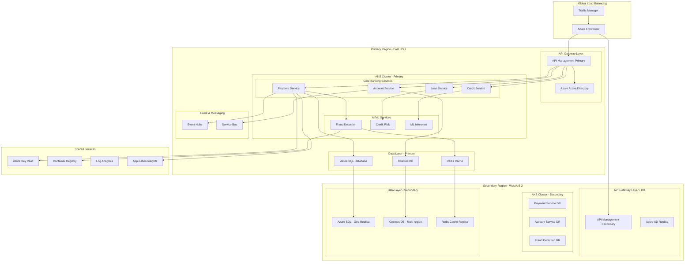
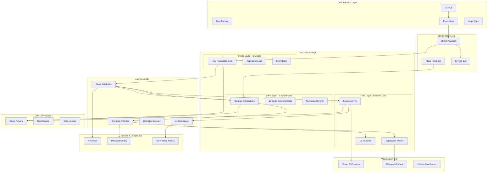
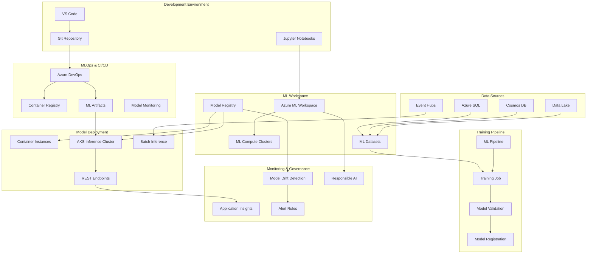
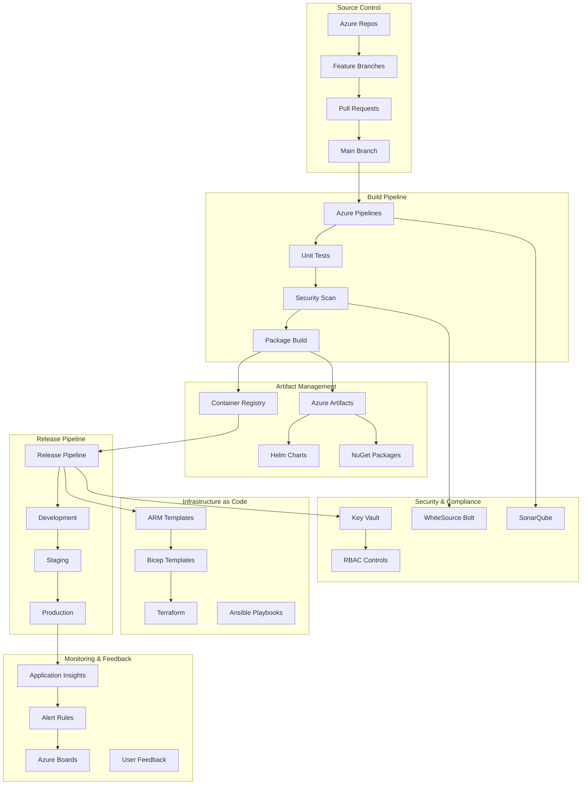

# Azure Reference Architectures for FinTech AI Platform

This document provides comprehensive Azure reference architectures following Microsoft's Well-Architected Framework and official architecture patterns for enterprise FinTech applications.

## Multi-Region FinTech Microservices Architecture

## Azure Data Platform Architecture

## Azure AI/ML Pipeline Architecture

## Azure Security & Compliance Architecture

```mermaid
graph TB
    subgraph "Identity & Access Management"
        AAD[Azure Active Directory]
        B2C[Azure AD B2C]
        PIM[Privileged Identity Management]
        CONDITIONAL[Conditional Access]
    end
    
    subgraph "Network Security"
        VNET[Virtual Network]
        NSG[Network Security Groups]
        FIREWALL[Azure Firewall]
        BASTION[Azure Bastion]
    end
    
    subgraph "Application Security"
        APIM[API Management]
        WAF[Web Application Firewall]
        DDoS[DDoS Protection]
        SSL[SSL/TLS Termination]
    end
    
    subgraph "Data Protection"
        KV[Key Vault]
        HSM[Hardware Security Module]
        ENCRYPTION[Data Encryption]
        BACKUP[Azure Backup]
    end
    
    subgraph "Monitoring & Compliance"
        DEFENDER[Microsoft Defender]
        SENTINEL[Azure Sentinel]
        POLICY[Azure Policy]
        COMPLIANCE[Compliance Manager]
    end
    
    subgraph "Secrets Management"
        MSI[Managed Identity]
        SPN[Service Principal]
        RBAC[Role-Based Access Control]
        SECRETS[Secret Rotation]
    end
    
    AAD --> B2C
    AAD --> PIM
    PIM --> CONDITIONAL
    
    VNET --> NSG
    NSG --> FIREWALL
    FIREWALL --> BASTION
    
    APIM --> WAF
    WAF --> DDoS
    DDoS --> SSL
    
    KV --> HSM
    HSM --> ENCRYPTION
    ENCRYPTION --> BACKUP
    
    DEFENDER --> SENTINEL
    SENTINEL --> POLICY
    POLICY --> COMPLIANCE
    
    AAD --> MSI
    MSI --> SPN
    SPN --> RBAC
    RBAC --> SECRETS
```

## Azure DevOps & CI/CD Architecture

## Azure Well-Architected Framework Implementation

### Reliability Patterns
- **Multi-region deployment** with automatic failover
- **Circuit breaker** pattern for service resilience
- **Bulkhead isolation** for fault tolerance
- **Health checks** with automated recovery

### Security Patterns  
- **Zero trust architecture** with Azure AD integration
- **Defense in depth** with multiple security layers
- **Least privilege access** with RBAC and PIM
- **Secrets management** with Key Vault and MSI

### Cost Optimization Patterns
- **Serverless computing** with Azure Functions and Logic Apps
- **Auto-scaling** based on demand metrics
- **Reserved instances** for predictable workloads
- **Cost monitoring** with Azure Cost Management

### Performance Patterns
- **CDN distribution** with Azure Front Door
- **Caching strategies** with Redis and API Management
- **Database optimization** with read replicas and partitioning
- **Monitoring** with Application Insights and Log Analytics

### Operational Excellence Patterns
- **Infrastructure as Code** with Bicep and Terraform
- **CI/CD automation** with Azure DevOps pipelines
- **Monitoring and alerting** with comprehensive dashboards
- **Documentation** with automated architecture diagrams

These reference architectures demonstrate enterprise-grade Azure implementations following Microsoft's architectural guidance and Well-Architected Framework principles for mission-critical FinTech applications.