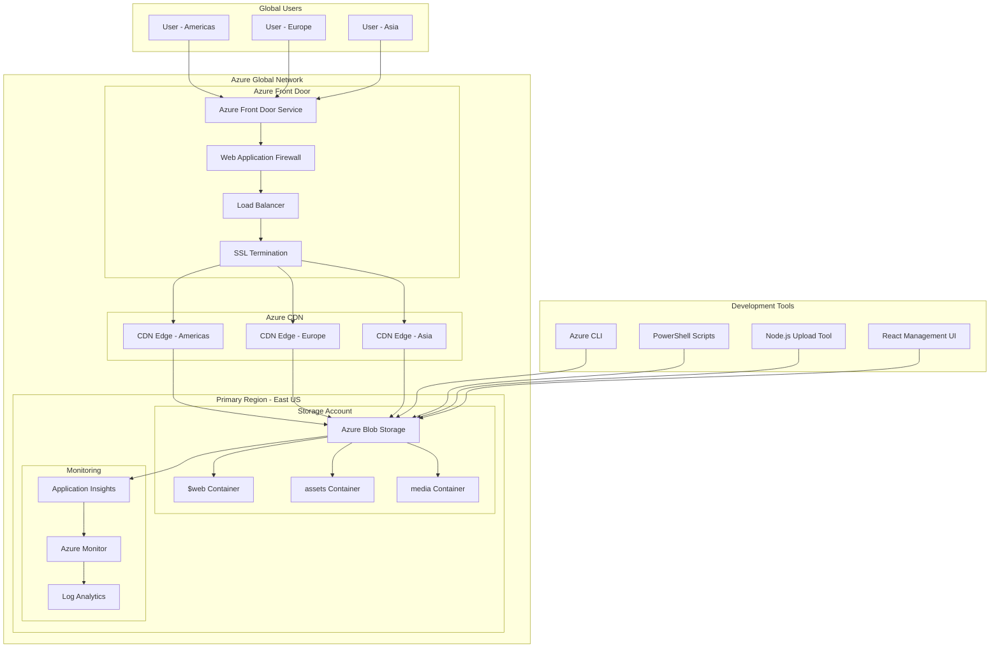
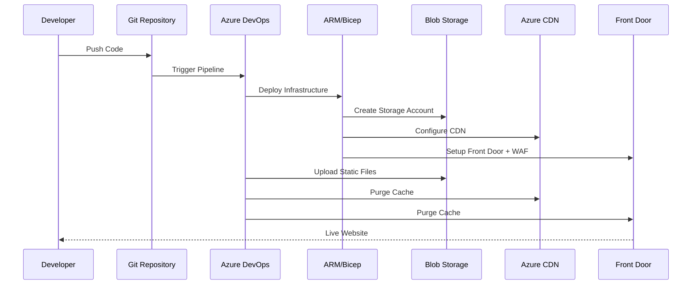

# Azure Level 1 Maturity Architecture Summary

## 🏗️ Architecture Overview



## 🚀 Key Components

### Azure Front Door
- **Global Entry Point**: Single endpoint for worldwide users
- **Intelligent Routing**: Routes traffic to optimal origins
- **WAF Protection**: Blocks malicious traffic and attacks
- **SSL Offloading**: Handles HTTPS termination globally
- **Health Monitoring**: Automatic failover capabilities

### Azure CDN
- **Edge Caching**: Caches content at 200+ global locations
- **Performance Optimization**: Reduces latency by 50-80%
- **Bandwidth Savings**: Compression and caching reduce costs
- **Origin Shield**: Protects origin from traffic spikes

### Azure Blob Storage
- **Static Website Hosting**: Direct hosting from storage
- **Multiple Containers**: Organized content management
- **Geo-Redundancy**: Built-in data replication
- **Cost-Effective**: Pay only for storage used

## 📊 Performance Benefits

| Metric | Before CDN/Front Door | After Implementation | Improvement |
|--------|----------------------|---------------------|-------------|
| Global Latency | 200-500ms | 50-100ms | 50-80% reduction |
| Cache Hit Ratio | 0% | 85-95% | Massive bandwidth savings |
| Availability | 99.9% | 99.99% | Improved reliability |
| Security | Basic | Enterprise WAF | Advanced protection |
| Scalability | Limited | Global | Unlimited scale |

## 🛡️ Security Features

### Web Application Firewall
```yaml
Protection Types:
  - DDoS Mitigation: Automatic volumetric attack protection
  - OWASP Rules: Top 10 vulnerability protection
  - Bot Management: Intelligent bot detection
  - Rate Limiting: Configurable request throttling
  - Geo-Filtering: Country/region blocking
```

### Access Control
```yaml
Security Headers:
  - HTTPS Enforced: All traffic encrypted
  - HSTS: HTTP Strict Transport Security
  - CSP: Content Security Policy
  - XSS Protection: Cross-site scripting prevention
  - Frame Options: Clickjacking protection
```

## 💰 Cost Optimization

### Storage Pricing
```yaml
Azure Blob Storage (East US):
  Hot Tier: $0.0184 per GB/month
  Cool Tier: $0.01 per GB/month
  Archive Tier: $0.00099 per GB/month
  
Transactions:
  Read Operations: $0.0004 per 10k
  Write Operations: $0.005 per 10k
```

### CDN Pricing
```yaml
Azure CDN (Microsoft):
  First 10 TB: $0.087 per GB
  Next 40 TB: $0.08 per GB
  Next 100 TB: $0.06 per GB
  Over 150 TB: $0.04 per GB
```

### Front Door Pricing
```yaml
Azure Front Door Standard:
  Base Fee: $35 per month
  Requests: $0.009 per 10k requests
  Data Transfer: $0.12 per GB
  WAF: $1 per policy + $0.60 per million requests
```

## 🔄 Deployment Workflow



## 📈 Monitoring Dashboard

### Key Metrics to Track
```typescript
interface MonitoringMetrics {
  // Performance Metrics
  responseTime: number;        // Average response time
  throughput: number;          // Requests per second
  cacheHitRatio: number;      // CDN cache effectiveness
  
  // Availability Metrics
  uptime: number;             // Service availability %
  errorRate: number;          // 4xx/5xx error percentage
  
  // Security Metrics
  blockedRequests: number;    // WAF blocks
  ddosAttacks: number;        // Mitigated attacks
  
  // Cost Metrics
  storageUsage: number;       // GB stored
  bandwidthUsage: number;     // GB transferred
  requestCount: number;       // Total requests
}
```

### Alert Configuration
```yaml
Critical Alerts:
  - Service Unavailable: >5min downtime
  - High Error Rate: >5% errors for 10min
  - DDoS Attack: Detected malicious traffic
  
Warning Alerts:
  - High Latency: >200ms for 15min
  - Low Cache Hit: <70% for 30min
  - Storage Quota: >80% usage
```

## 🚀 Level 2 Upgrade Path

### Additional Azure Services
```yaml
Advanced Features:
  - Azure Traffic Manager: DNS-based load balancing
  - Azure Application Gateway: Layer 7 load balancing
  - Azure API Management: API gateway capabilities
  - Azure Key Vault: Certificate management
  - Azure Active Directory: Authentication/authorization
  
Enhanced Monitoring:
  - Application Insights: APM and user analytics
  - Azure Sentinel: Security information and event management
  - Log Analytics: Advanced query and alerting
  
Multi-Region Setup:
  - Primary Region: East US
  - Secondary Region: West Europe
  - Disaster Recovery: Automated failover
```

## 🛠️ Management Tools

### React Management Component
```typescript
Features:
  - File Upload Interface: Drag-and-drop file uploads
  - Deployment Status: Real-time upload progress
  - Cache Management: Purge CDN/Front Door cache
  - Performance Metrics: Live dashboard
  - Configuration Management: Environment settings
```

### CLI Tools
```bash
# Deployment Script Features
./deploy-static-content-delivery.sh
  ✅ Multi-environment support (dev/staging/prod)
  ✅ Resource group management
  ✅ Parameter validation
  ✅ Error handling and rollback
  ✅ Output capture and logging

# Upload Tool Features  
node azure-static-upload.js
  ✅ Batch file uploads
  ✅ Smart cache headers
  ✅ Compression optimization
  ✅ Cache purging
  ✅ Progress reporting
```

## 📚 Best Practices Implementation

### Content Optimization
```yaml
File Types & Caching:
  Static Assets (CSS/JS/Images):
    Cache-Control: "public, max-age=31536000, immutable"
    Compression: Enabled
    
  HTML Files:
    Cache-Control: "public, max-age=3600, must-revalidate"
    Compression: Enabled
    
  API Responses:
    Cache-Control: "public, max-age=300"
    Compression: Enabled for JSON/XML
```

### Security Configuration
```yaml
WAF Rules:
  - OWASP Core Rule Set 3.3
  - Microsoft Bot Manager Rules
  - Custom Rate Limiting Rules
  - Geo-blocking for restricted regions
  
TLS Configuration:
  - Minimum TLS 1.2
  - Strong cipher suites only
  - Perfect Forward Secrecy
```

### Performance Tuning
```yaml
CDN Configuration:
  - Query String Caching: Ignore for static assets
  - Compression: Enable for text content
  - Cache Behaviors: Optimized per content type
  - Origin Shield: Enabled for protection

Front Door Configuration:
  - Session Affinity: Disabled for stateless apps
  - Load Balancing: Latency-based routing
  - Health Probes: Every 30 seconds
  - Timeout: 240 seconds
```

## 🎯 Success Metrics

### Performance Targets
- **Global Page Load Time**: <2 seconds
- **First Contentful Paint**: <1 second  
- **Time to Interactive**: <3 seconds
- **Cache Hit Ratio**: >90%
- **Availability**: 99.99%

### Cost Targets
- **Monthly Storage Cost**: <$50 for typical website
- **CDN Bandwidth Cost**: <$100 for 1TB transfer
- **Front Door Cost**: <$50 base + usage
- **Total Monthly Cost**: <$200 for high-traffic site

This Azure Level 1 implementation provides a solid foundation for static content delivery with enterprise-grade performance, security, and scalability.