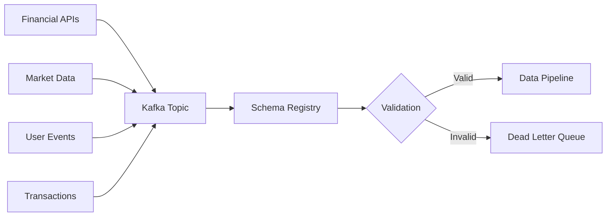

# Modern Big Data Platform Architecture with Azure Databricks

## Overview

This document outlines the integration of a modern big data platform with Azure Databricks to ensure real-time, near-time, and batch inference with accurate data through a unified, event-driven architecture that applies governance and quality controls at every stage.

## 🌐 1. Unified Event-Driven Backbone

### Architecture Overview
```
┌─────────────────────────────────────────────────────────────────────────────────────┐
│                           UNIFIED EVENT-DRIVEN PLATFORM                              │
├─────────────────────────────────────────────────────────────────────────────────────┤
│                                                                                     │
│  ┌─────────────────┐    ┌─────────────────┐    ┌─────────────────┐                 │
│  │   Data Sources  │    │  Apache Kafka   │    │  Azure Databricks│                │
│  │                 │    │  Event Backbone │    │  Processing Hub   │                │
│  │ • Financial APIs│───▶│                 │───▶│                  │                │
│  │ • Market Data   │    │ • Partitioned   │    │ • Real-time      │                │
│  │ • User Events   │    │ • Replicated    │    │ • Near-time      │                │
│  │ • Transactions  │    │ • Immutable Log │    │ • Batch          │                │
│  └─────────────────┘    └─────────────────┘    └─────────────────┘                 │
│           │                       │                       │                        │
│           │                       │                       │                        │
│  ┌─────────────────┐    ┌─────────────────┐    ┌─────────────────┐                 │
│  │  Schema Registry│    │ AI Governance   │    │ Quality Control │                 │
│  │                 │    │                 │    │                 │                 │
│  │ • Avro/Protobuf │    │ • Auto-classify │    │ • Completeness  │                 │
│  │ • Validation    │    │ • Monitor       │    │ • Validity      │                 │
│  │ • Contracts     │    │ • Enforce Policy│    │ • Consistency   │                 │
│  └─────────────────┘    └─────────────────┘    └─────────────────┘                 │
│                                                                                     │
└─────────────────────────────────────────────────────────────────────────────────────┘
```

### Apache Kafka/Confluent Cloud as Central Message Bus

#### High-Throughput Data Ingestion
- **Partitioned Architecture**: Distributes events across multiple brokers and partitions
- **Parallel Processing**: Enables massive parallel ingestion for high-volume data loads
- **Immutable Log**: Append-only log ensures data integrity and auditability
- **Replication**: Multi-broker replication prevents data loss

#### Configuration Example
```yaml
kafka:
  cluster:
    bootstrap-servers: "kafka-cluster.azure.com:9092"
    partitions: 12
    replication-factor: 3
    min-insync-replicas: 2
  topics:
    financial-transactions:
      partitions: 24
      retention: 7d
    market-data:
      partitions: 36
      retention: 30d
    user-events:
      partitions: 12
      retention: 90d
```

## 🤖 2. AI-Assisted Data Governance & Schema Registry

### Schema Registry Implementation

#### Avro Schema Example for Financial Transactions
```json
{
  "type": "record",
  "name": "FinancialTransaction",
  "namespace": "com.fintech.events",
  "fields": [
    {
      "name": "transactionId",
      "type": "string",
      "doc": "Unique transaction identifier"
    },
    {
      "name": "userId",
      "type": "string",
      "doc": "User identifier"
    },
    {
      "name": "amount",
      "type": {
        "type": "bytes",
        "logicalType": "decimal",
        "precision": 18,
        "scale": 2
      },
      "doc": "Transaction amount"
    },
    {
      "name": "currency",
      "type": "string",
      "doc": "Currency code (ISO 4217)"
    },
    {
      "name": "timestamp",
      "type": {
        "type": "long",
        "logicalType": "timestamp-millis"
      },
      "doc": "Transaction timestamp"
    },
    {
      "name": "metadata",
      "type": {
        "type": "map",
        "values": "string"
      },
      "default": {},
      "doc": "Additional transaction metadata"
    }
  ]
}
```

### AI-Powered Governance Features

#### 1. Proactive Monitoring
```python
class AIGovernanceEngine:
    def __init__(self):
        self.anomaly_detector = AnomalyDetector()
        self.pattern_analyzer = PatternAnalyzer()
        self.compliance_checker = ComplianceChecker()
    
    def monitor_data_flow(self, event_stream):
        """Continuously analyze data flows for anomalies"""
        for event in event_stream:
            # Detect anomalies in real-time
            if self.anomaly_detector.is_anomalous(event):
                self.alert_governance_team(event)
            
            # Analyze patterns
            patterns = self.pattern_analyzer.analyze(event)
            if patterns.deviation > threshold:
                self.flag_pattern_deviation(event, patterns)
    
    def auto_classify_data(self, event):
        """Automatically classify and tag data"""
        classifications = []
        
        # PII Detection
        if self.contains_pii(event):
            classifications.append("PII")
        
        # Financial Data Classification
        if self.is_financial_data(event):
            classifications.append("FINANCIAL")
        
        # Sensitivity Level
        sensitivity = self.calculate_sensitivity(event)
        classifications.append(f"SENSITIVITY_{sensitivity}")
        
        return classifications
```

#### 2. Auto-Classification Rules
- **PII Detection**: Automatically identify and tag personally identifiable information
- **Financial Data Classification**: Classify transaction types, amounts, and risk levels
- **Sensitivity Scoring**: Assign sensitivity levels based on data content and context
- **Compliance Tagging**: Automatically apply regulatory compliance tags (GDPR, PCI-DSS, SOX)

#### 3. Policy Enforcement
```yaml
governance_policies:
  data_retention:
    pii_data: 
      retention_period: "2_years"
      encryption_required: true
    financial_transactions:
      retention_period: "7_years"
      audit_trail_required: true
  access_control:
    pii_data:
      roles: ["data_protection_officer", "compliance_team"]
      audit_access: true
    financial_data:
      roles: ["financial_analyst", "risk_manager"]
      time_based_access: true
  data_quality:
    validation_rules:
      - field: "amount"
        rule: "positive_number"
      - field: "currency"
        rule: "iso_4217_code"
      - field: "timestamp"
        rule: "within_24_hours"
```

## 📊 3. Data Quality and Loss Tracking

### Apache Spark Data Quality Framework

#### Real-Time Quality Checks
```scala
import org.apache.spark.sql.DataFrame
import org.apache.spark.sql.functions._

class DataQualityFramework {
  
  def validateCompleteness(df: DataFrame, requiredFields: List[String]): DataFrame = {
    val completenessChecks = requiredFields.map { field =>
      when(col(field).isNull or col(field) === "", "INCOMPLETE")
        .otherwise("COMPLETE")
        .alias(s"${field}_completeness")
    }
    
    df.select(col("*") +: completenessChecks: _*)
  }
  
  def validateValidity(df: DataFrame): DataFrame = {
    df.withColumn("amount_validity", 
        when(col("amount") > 0, "VALID")
        .otherwise("INVALID"))
      .withColumn("currency_validity",
        when(col("currency").rlike("^[A-Z]{3}$"), "VALID")
        .otherwise("INVALID"))
      .withColumn("timestamp_validity",
        when(col("timestamp").between(
          unix_timestamp() - 86400, // 24 hours ago
          unix_timestamp()
        ), "VALID").otherwise("INVALID"))
  }
  
  def checkConsistency(df: DataFrame): DataFrame = {
    val windowSpec = Window.partitionBy("userId")
      .orderBy("timestamp")
      .rowsBetween(-5, 0)
    
    df.withColumn("avg_transaction_amount",
        avg("amount").over(windowSpec))
      .withColumn("consistency_check",
        when(abs(col("amount") - col("avg_transaction_amount")) / 
             col("avg_transaction_amount") > 0.5, "INCONSISTENT")
        .otherwise("CONSISTENT"))
  }
  
  def detectDuplicates(df: DataFrame): DataFrame = {
    val duplicateCheck = df.groupBy("transactionId")
      .count()
      .filter(col("count") > 1)
      .select("transactionId")
    
    df.join(duplicateCheck, Seq("transactionId"), "left_anti")
      .withColumn("uniqueness", lit("UNIQUE"))
      .union(
        df.join(duplicateCheck, Seq("transactionId"), "inner")
          .withColumn("uniqueness", lit("DUPLICATE"))
      )
  }
}
```

### Exactly-Once Processing Semantics

#### Kafka Streams Configuration
```java
Properties config = new Properties();
config.put(StreamsConfig.APPLICATION_ID_CONFIG, "financial-data-processor");
config.put(StreamsConfig.BOOTSTRAP_SERVERS_CONFIG, "kafka-cluster:9092");
config.put(StreamsConfig.PROCESSING_GUARANTEE_CONFIG, 
           StreamsConfig.EXACTLY_ONCE_V2);
config.put(StreamsConfig.REPLICATION_FACTOR_CONFIG, 3);

// Enable idempotence for exactly-once semantics
config.put(ProducerConfig.ENABLE_IDEMPOTENCE_CONFIG, true);
config.put(ProducerConfig.ACKS_CONFIG, "all");
config.put(ProducerConfig.RETRIES_CONFIG, Integer.MAX_VALUE);
```

### Data Lineage and Provenance Tracking

#### Lineage Metadata Structure
```json
{
  "dataLineage": {
    "recordId": "tx_12345",
    "sourceSystem": "trading_platform",
    "ingestionTimestamp": "2025-09-13T10:30:00Z",
    "transformations": [
      {
        "stage": "validation",
        "processor": "schema_validator",
        "timestamp": "2025-09-13T10:30:01Z",
        "status": "passed",
        "rules_applied": ["schema_check", "pii_detection"]
      },
      {
        "stage": "enrichment",
        "processor": "data_enricher",
        "timestamp": "2025-09-13T10:30:02Z",
        "status": "completed",
        "enrichments": ["geo_location", "risk_score"]
      },
      {
        "stage": "quality_check",
        "processor": "quality_validator",
        "timestamp": "2025-09-13T10:30:03Z",
        "status": "passed",
        "metrics": {
          "completeness": 1.0,
          "validity": 1.0,
          "consistency": 0.95
        }
      }
    ],
    "currentLocation": "azure_databricks_delta_lake",
    "accessHistory": [
      {
        "user": "ml_training_pipeline",
        "timestamp": "2025-09-13T11:00:00Z",
        "operation": "read",
        "purpose": "model_training"
      }
    ]
  }
}
```

## 🏗️ 4. Azure Databricks Integration Architecture

### Unified Processing Platform
```
┌─────────────────────────────────────────────────────────────────────────────────────┐
│                           AZURE DATABRICKS PLATFORM                                  │
├─────────────────────────────────────────────────────────────────────────────────────┤
│                                                                                     │
│  ┌─────────────────┐    ┌─────────────────┐    ┌─────────────────┐                 │
│  │   Real-time     │    │   Near-time     │    │     Batch       │                 │
│  │   Processing    │    │   Processing    │    │   Processing    │                 │
│  │                 │    │                 │    │                 │                 │
│  │ • Structured    │    │ • Micro-batch   │    │ • ETL Jobs      │                 │
│  │   Streaming     │    │ • Sliding Window│    │ • ML Training   │                 │
│  │ • Delta Live    │    │ • Aggregations  │    │ • Historical    │                 │
│  │   Tables        │    │ • Event Time   │    │   Analysis      │                 │
│  │ • Auto Scaling  │    │   Processing    │    │ • Reporting     │                 │
│  └─────────────────┘    └─────────────────┘    └─────────────────┘                 │
│           │                       │                       │                        │
│           └───────────────────────┼───────────────────────┘                        │
│                                   │                                                │
│  ┌─────────────────────────────────┼─────────────────────────────────────────────┐ │
│  │                    DELTA LAKE STORAGE LAYER                                   │ │
│  │                                                                               │ │
│  │  • ACID Transactions            • Time Travel                                │ │
│  │  • Schema Evolution             • Data Versioning                           │ │
│  │  • Unified Batch & Streaming    • Audit Logging                            │ │
│  └───────────────────────────────────────────────────────────────────────────────┘ │
│                                                                                     │
└─────────────────────────────────────────────────────────────────────────────────────┘
```

### Performance Characteristics by Processing Mode

| Processing Mode | Latency | Throughput | Use Cases | Data Freshness |
|----------------|---------|------------|-----------|----------------|
| **Real-time** | 25-100ms | 10K-100K events/sec | Trading decisions, Fraud detection | < 1 second |
| **Near-time** | 500ms-1s | 50K-500K events/sec | Risk monitoring, Dashboards | 1-60 seconds |
| **Batch** | 5min-1hr | 1M+ events/batch | ML training, Compliance reports | Hours to days |

### Technology Stack Integration

#### Core Components
- **Apache Kafka**: Event streaming backbone
- **Azure Databricks**: Unified analytics platform
- **Delta Lake**: Reliable data lake storage
- **Apache Spark**: Distributed processing engine
- **MLflow**: ML lifecycle management
- **Azure Monitor**: Observability and monitoring

#### Processing Guarantees
- **Exactly-once semantics**: No data loss or duplication
- **ACID transactions**: Data consistency across all operations
- **Schema evolution**: Backward/forward compatibility
- **Time travel**: Point-in-time data recovery

## 🔄 5. End-to-End Data Flow

### 1. Data Ingestion


### 2. Real-time Processing Pipeline
```python
from pyspark.sql import SparkSession
from pyspark.sql.functions import *
from pyspark.sql.types import *

# Initialize Spark with Delta Lake
spark = SparkSession.builder \
    .appName("RealTimeInference") \
    .config("spark.sql.extensions", "io.delta.sql.DeltaSparkSessionExtension") \
    .config("spark.sql.catalog.spark_catalog", "org.apache.spark.sql.delta.catalog.DeltaCatalog") \
    .getOrCreate()

# Read from Kafka
raw_stream = spark \
    .readStream \
    .format("kafka") \
    .option("kafka.bootstrap.servers", "kafka-cluster:9092") \
    .option("subscribe", "financial-transactions") \
    .option("startingOffsets", "latest") \
    .load()

# Parse and validate
parsed_stream = raw_stream \
    .select(from_json(col("value").cast("string"), transaction_schema).alias("data")) \
    .select("data.*") \
    .withColumn("processing_timestamp", current_timestamp()) \
    .withColumn("data_quality_score", calculate_quality_score(col("amount"), col("currency")))

# Real-time inference
inference_stream = parsed_stream \
    .withColumn("fraud_score", ml_model_predict(col("amount"), col("user_id"))) \
    .withColumn("risk_category", 
        when(col("fraud_score") > 0.8, "HIGH")
        .when(col("fraud_score") > 0.5, "MEDIUM")
        .otherwise("LOW"))

# Write to Delta Lake with quality metrics
query = inference_stream \
    .writeStream \
    .format("delta") \
    .outputMode("append") \
    .option("checkpointLocation", "/tmp/checkpoints/real-time") \
    .trigger(processingTime="1 second") \
    .table("financial_data.real_time_transactions")
```

### 3. Data Quality Monitoring Dashboard
```sql
-- Real-time data quality metrics
SELECT 
    window.start as window_start,
    window.end as window_end,
    COUNT(*) as total_records,
    SUM(CASE WHEN data_quality_score >= 0.9 THEN 1 ELSE 0 END) / COUNT(*) * 100 as quality_percentage,
    AVG(fraud_score) as avg_fraud_score,
    COUNT(DISTINCT user_id) as unique_users,
    SUM(amount) as total_transaction_value
FROM financial_data.real_time_transactions
WHERE processing_timestamp >= current_timestamp() - INTERVAL 1 HOUR
GROUP BY window(processing_timestamp, "5 minutes")
ORDER BY window_start DESC
```

## 🛡️ 6. Security and Compliance

### Data Encryption
- **In-transit**: TLS 1.3 for all data transfers
- **At-rest**: AES-256 encryption for Delta Lake storage
- **In-processing**: Memory encryption during Spark processing

### Access Control
```yaml
rbac_policies:
  data_scientists:
    permissions:
      - read: ["financial_data.aggregated_*"]
      - execute: ["ml_training_jobs"]
    restrictions:
      - no_pii_access: true
      - time_limited: "business_hours"
  
  compliance_officers:
    permissions:
      - read: ["financial_data.*", "audit_logs.*"]
      - export: ["compliance_reports"]
    restrictions:
      - audit_all_access: true
      - require_approval: ["data_export"]
```

### Audit Trail
```json
{
  "audit_log": {
    "timestamp": "2025-09-13T10:30:00Z",
    "user": "ml_engineer_001",
    "action": "read_financial_data",
    "resource": "financial_data.real_time_transactions",
    "filter_applied": "user_id IS NOT NULL",
    "records_accessed": 15420,
    "purpose": "fraud_model_training",
    "approval_id": "APPR_2025_001234"
  }
}
```

## 📈 7. Performance Monitoring and Optimization

### Key Metrics to Track
1. **Data Quality Metrics**
   - Completeness percentage
   - Validity score
   - Consistency index
   - Uniqueness ratio

2. **Processing Performance**
   - End-to-end latency
   - Throughput (events/second)
   - Resource utilization
   - Error rates

3. **Business Impact**
   - Model accuracy
   - False positive rates
   - Business value generated
   - Compliance adherence

### Auto-scaling Configuration
```yaml
databricks_cluster:
  min_workers: 2
  max_workers: 20
  auto_scale:
    enabled: true
    target_cpu: 70%
    scale_up_cooldown: 300s
    scale_down_cooldown: 600s
  
  instance_types:
    driver: "Standard_DS4_v2"
    worker: "Standard_DS3_v2"
  
  auto_termination: 30  # minutes of inactivity
```

This comprehensive architecture ensures that your AI inference platform operates on clean, trusted data while maintaining high performance, scalability, and compliance standards.