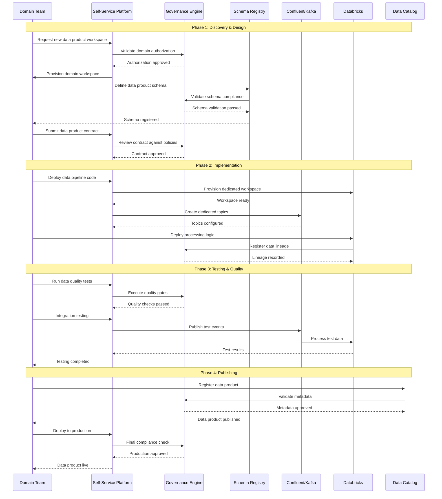
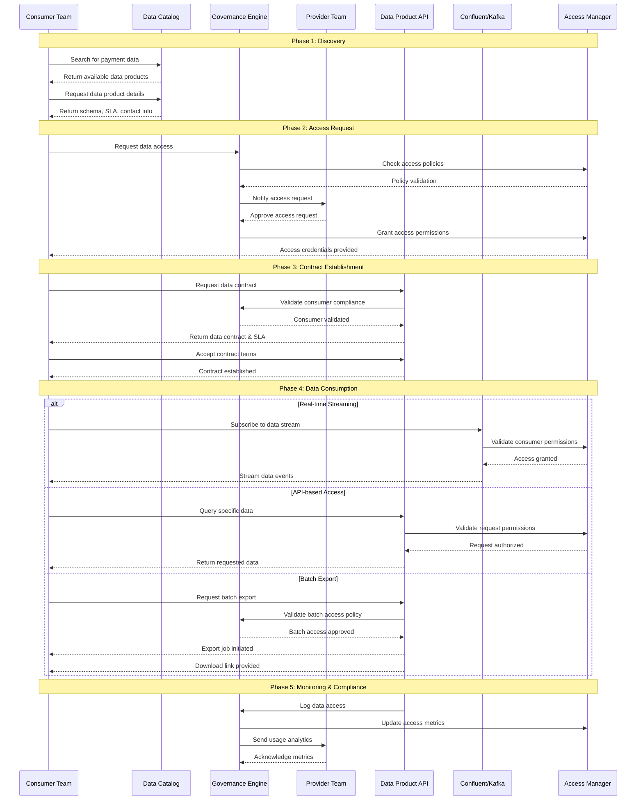
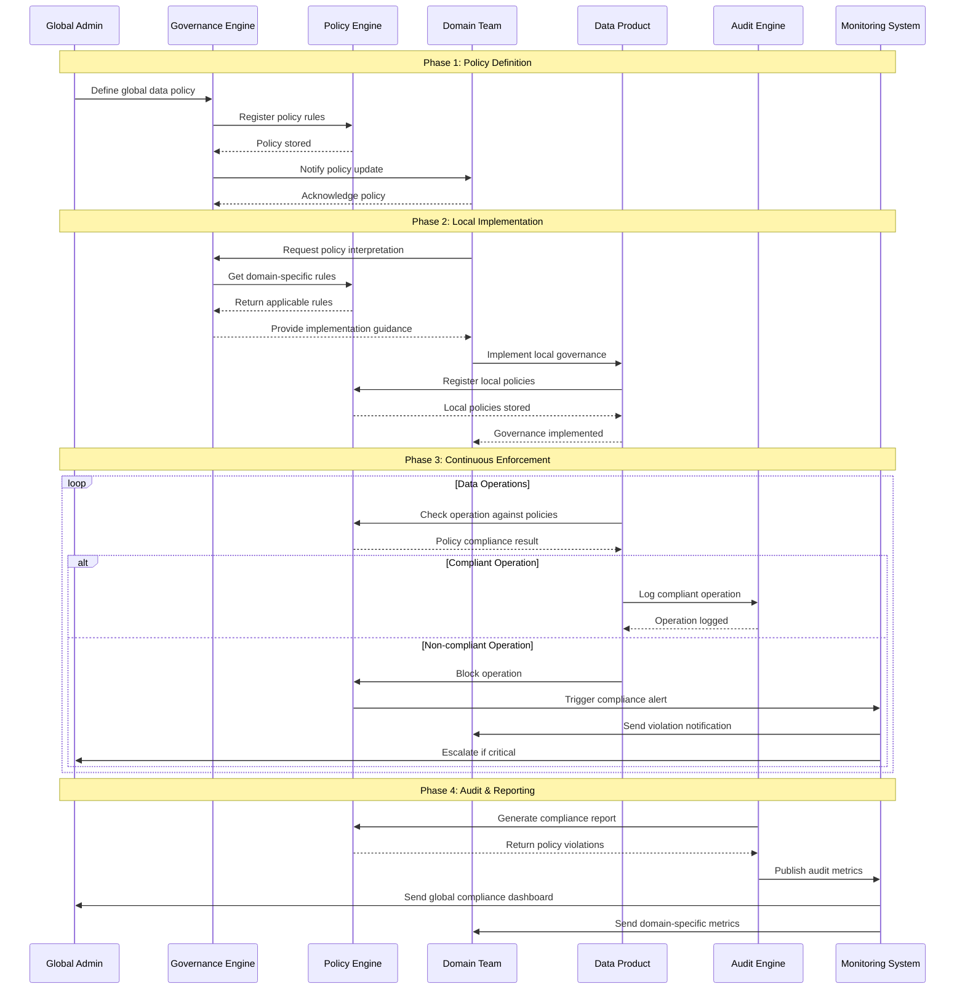
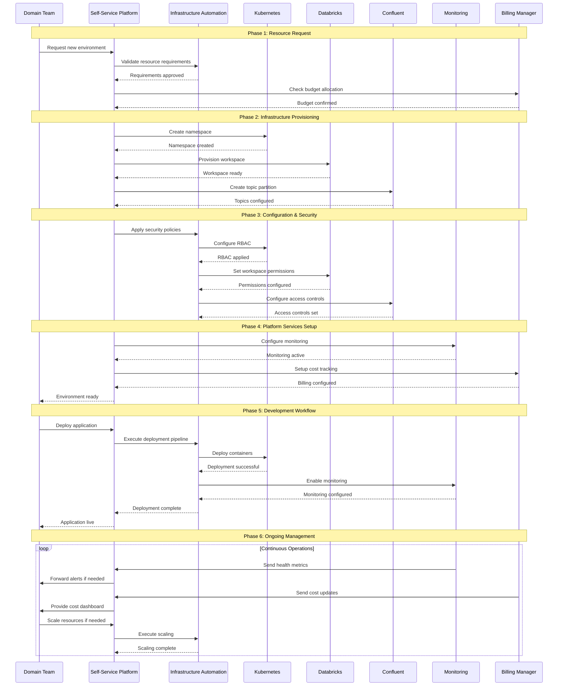
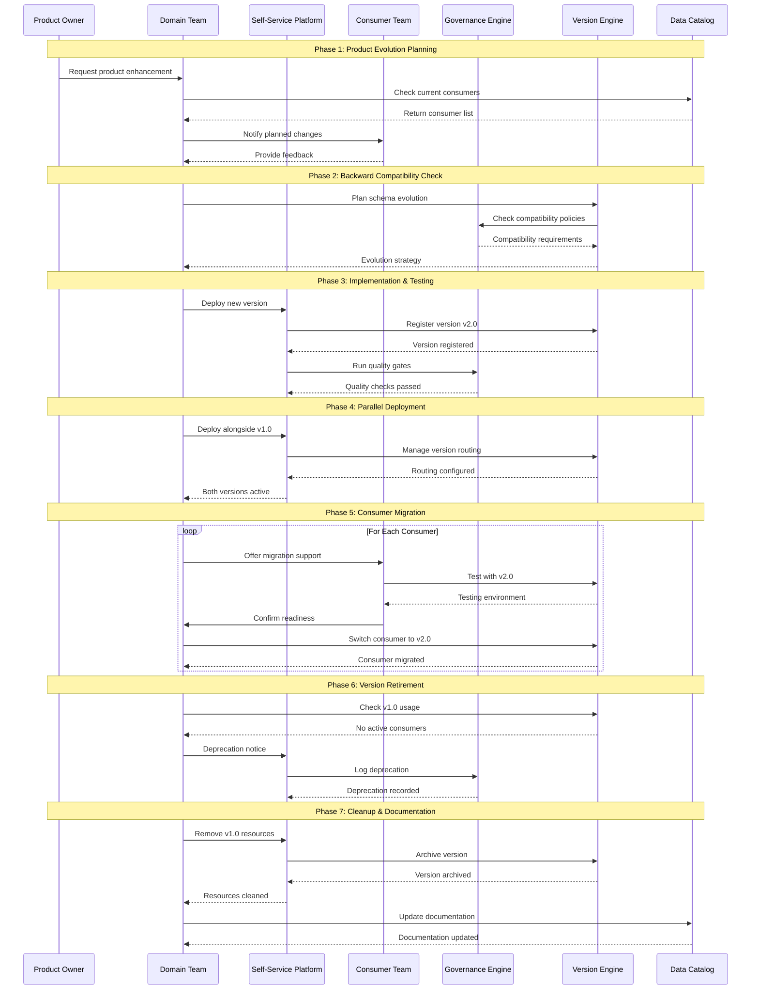
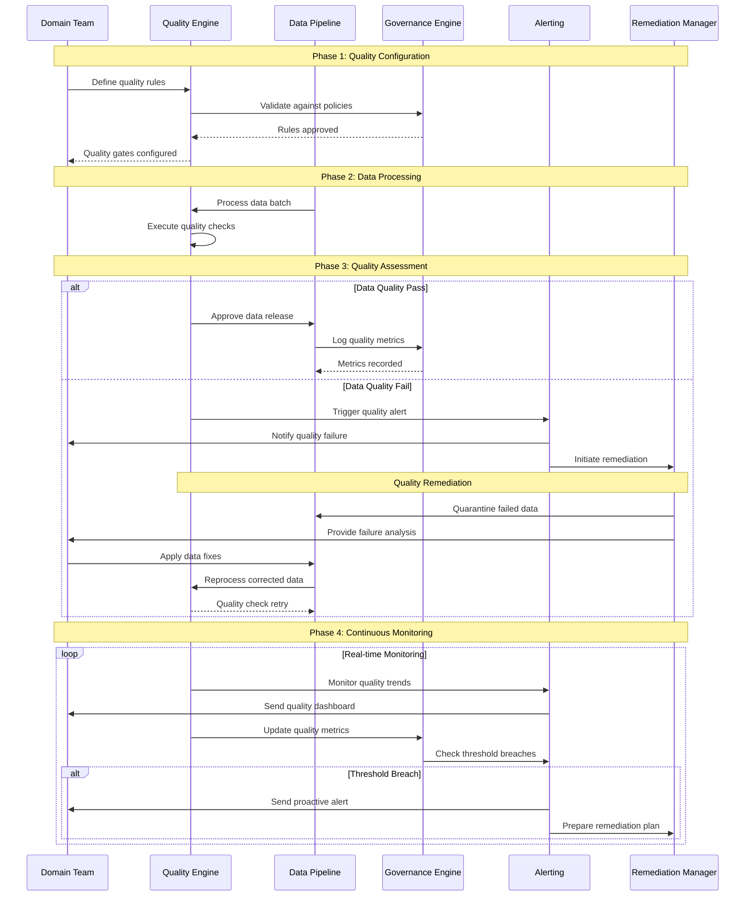
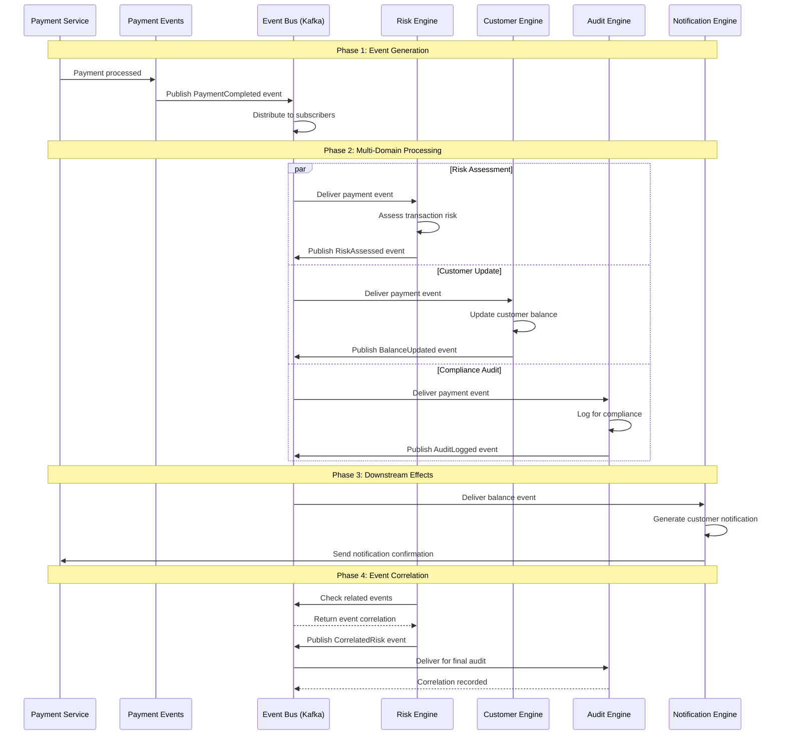
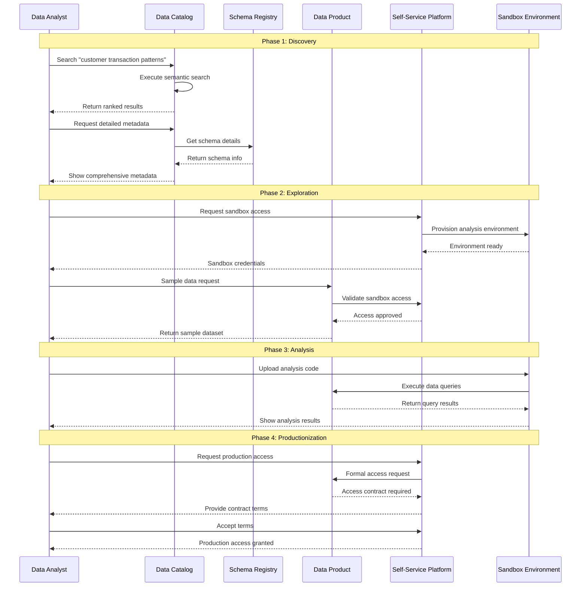

# Data Mesh Sequence Diagrams

## Overview

This document provides comprehensive sequence diagrams illustrating the Data Mesh workflows, including data product creation, cross-domain consumption, governance enforcement, self-service platform interactions, and end-to-end lifecycle management.

## 1. Data Product Creation Workflow

### New Data Product Development Sequence

## 2. Cross-Domain Data Consumption

### Inter-Domain Data Product Access Sequence

## 3. Federated Governance Enforcement

### Policy Definition and Enforcement Sequence

## 4. Self-Service Platform Interaction

### Automated Provisioning and Management Sequence

## 5. Data Product Lifecycle Management

### End-to-End Product Evolution Sequence

## 6. Quality Gate Enforcement

### Automated Quality Control Sequence

## 7. Event-Driven Data Product Communication

### Real-time Inter-Domain Event Flow

## 8. Self-Service Data Discovery

### Consumer-Driven Data Discovery Sequence

---

These sequence diagrams illustrate the comprehensive workflows within a Data Mesh architecture, showing how different components interact to enable decentralized data product management while maintaining governance and quality standards. Each diagram represents critical operational patterns that enable the Data Mesh paradigm to function effectively at scale.