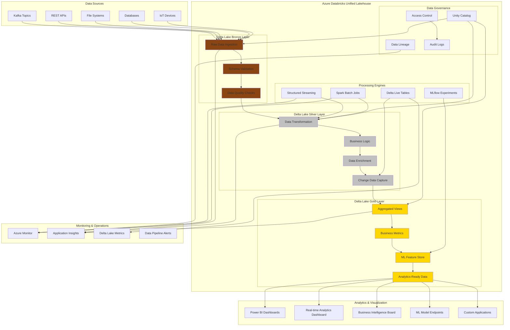
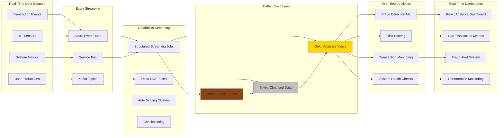
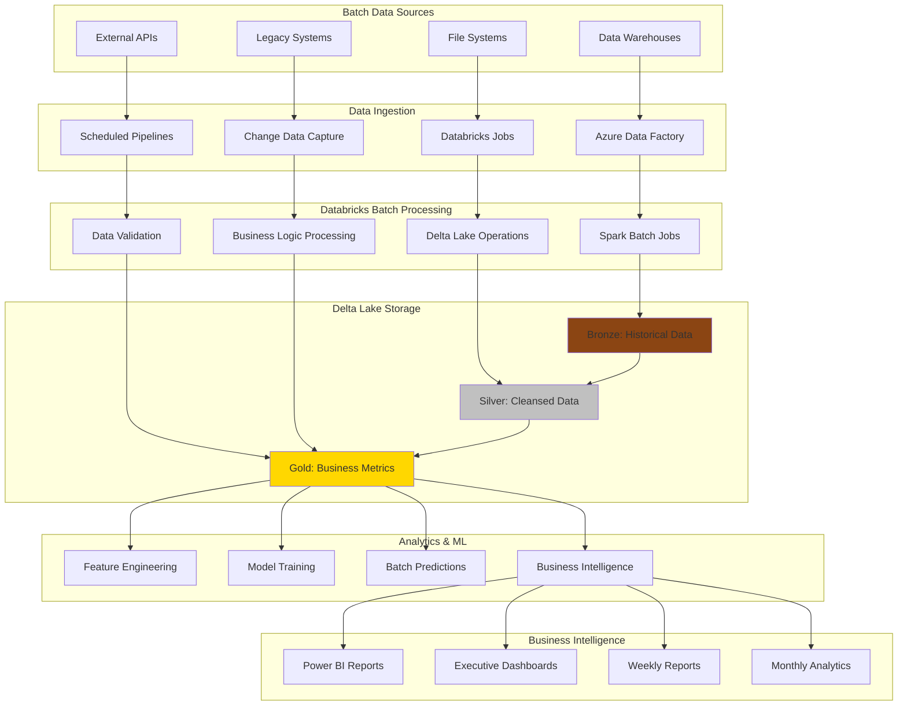
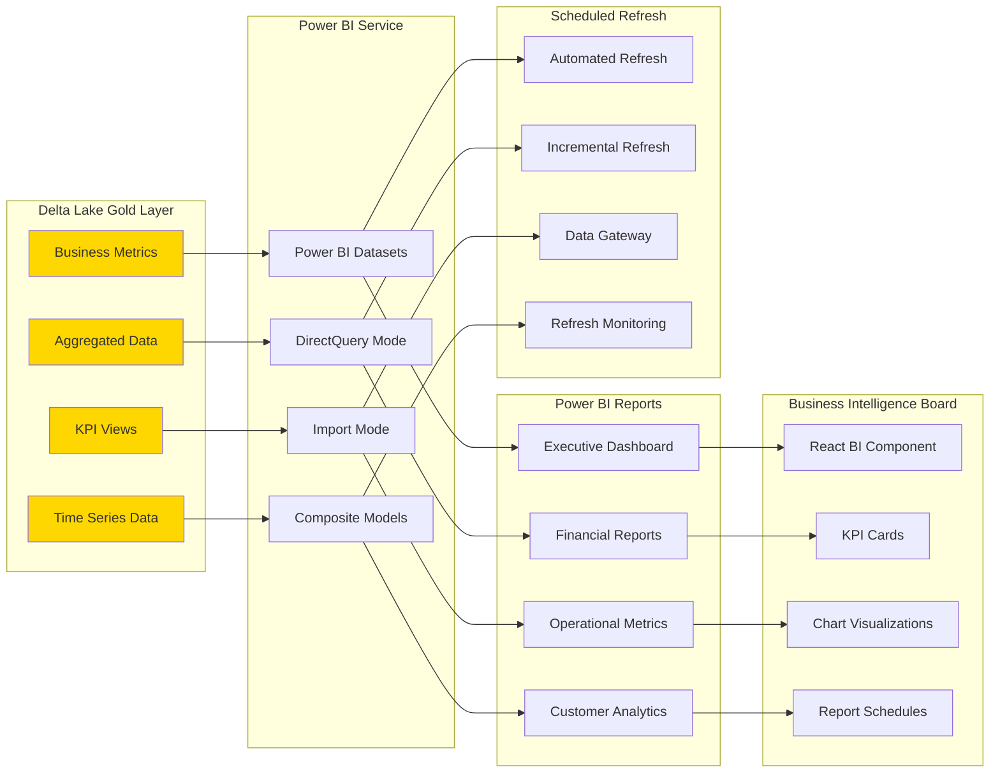
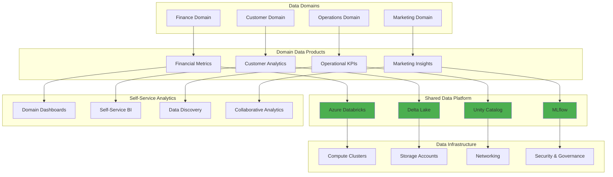
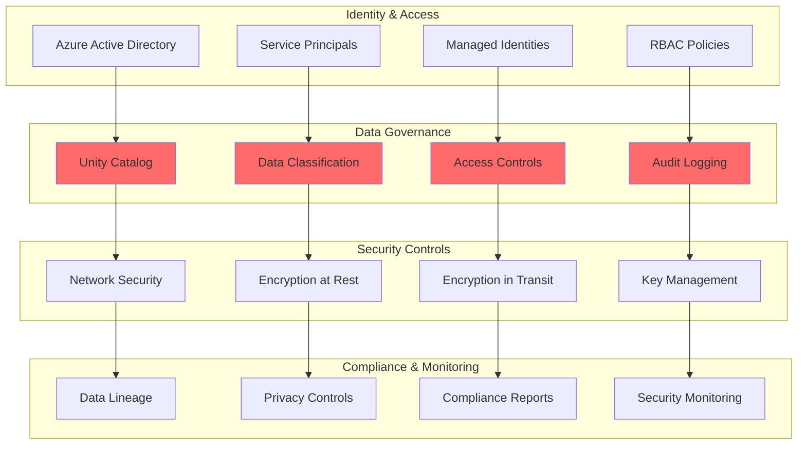
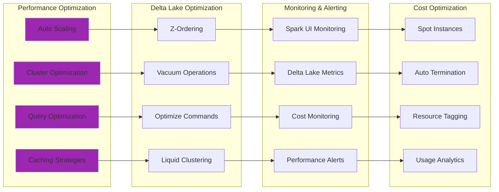
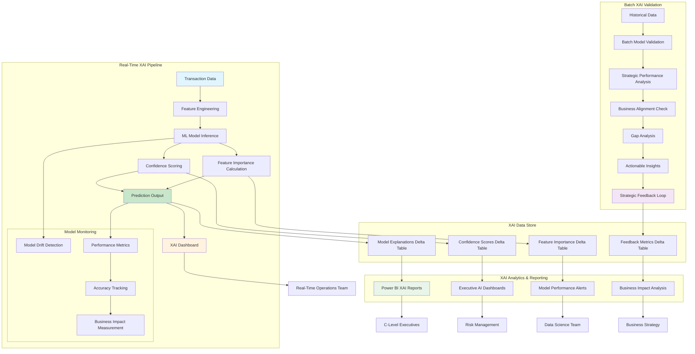
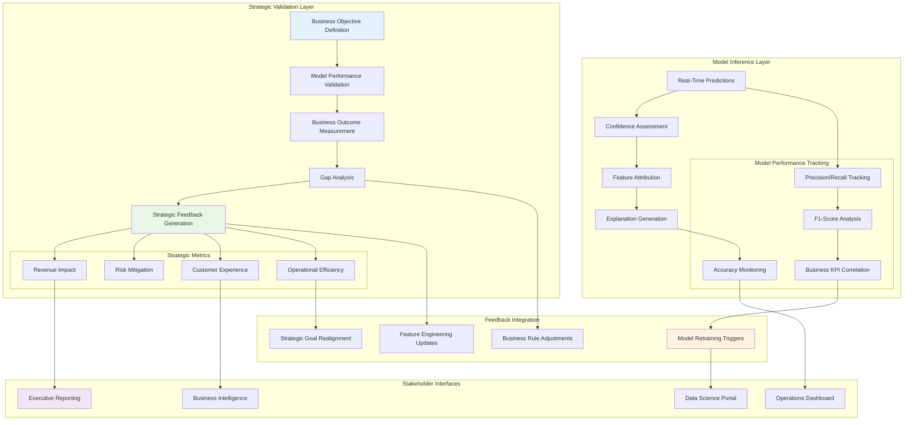
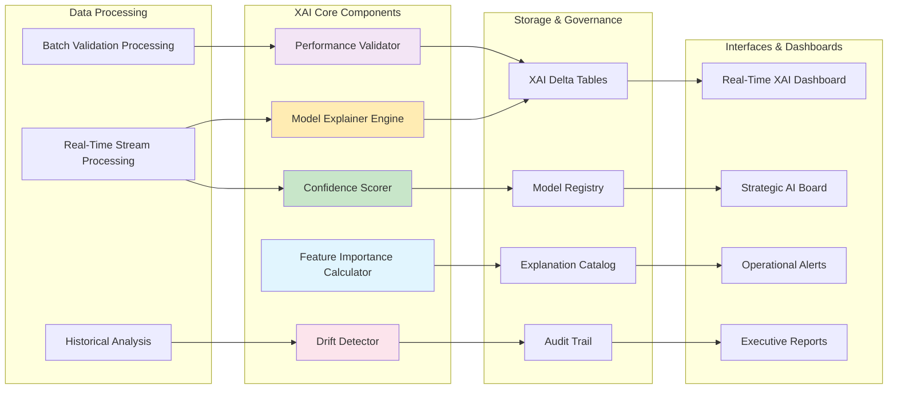

# Azure Databricks Unified Analytics Architecture

## Architecture Overview

## Real-Time Streaming Architecture

## Batch Processing Architecture

## Power BI Integration Architecture

## Data Mesh Implementation

## Security & Governance Architecture

## Performance & Optimization

## Key Architecture Principles

### 1. Unified Lakehouse Architecture
- **Bronze Layer**: Raw data ingestion with minimal processing
- **Silver Layer**: Cleansed and validated data with business logic
- **Gold Layer**: Analytics-ready data optimized for consumption

### 2. Real-Time and Batch Processing
- **Streaming**: Delta Live Tables for continuous data processing
- **Batch**: Scheduled Spark jobs for heavy analytics workloads
- **Unified**: Same compute engine for both processing modes

### 3. Data Mesh Implementation
- **Domain Ownership**: Business domains own their data products
- **Self-Service**: Democratized access to analytics tools
- **Federated Governance**: Centralized governance with domain autonomy

### 4. Power BI Integration
- **DirectQuery**: Real-time connectivity to Delta Lake
- **Scheduled Refresh**: Automated data refresh for reports
- **Composite Models**: Blend of real-time and cached data

### 5. Security and Governance
- **Unity Catalog**: Centralized metadata and governance
- **RBAC**: Role-based access control
- **Audit Logging**: Comprehensive activity tracking
- **Data Lineage**: End-to-end data flow tracking

### 6. Performance Optimization
- **Auto Scaling**: Dynamic cluster scaling based on workload
- **Delta Optimization**: Z-ordering, vacuum, and optimize operations
- **Caching**: Intelligent caching for frequently accessed data
- **Cost Management**: Spot instances and auto-termination

## Explainable AI (XAI) Architecture

### XAI Operational Transparency Framework

### XAI Model Validation & Feedback Architecture

### XAI Component Integration

## XAI Implementation Principles

### 1. Operational Transparency
- **Real-Time Explanations**: Every prediction includes feature importance and confidence scores
- **Model Monitoring**: Continuous tracking of model performance and drift
- **Auditability**: Complete audit trail of model decisions and explanations
- **Stakeholder Access**: Role-based access to appropriate level of model insights

### 2. Strategic Validation
- **Business Alignment**: Model performance validated against business objectives
- **Impact Measurement**: Quantified business impact of AI decisions
- **Feedback Loops**: Strategic insights feed back into model improvement
- **Executive Reporting**: C-level visibility into AI performance and business value

### 3. Continuous Improvement
- **Automated Retraining**: Model updates based on performance degradation
- **Feature Evolution**: Dynamic feature engineering based on explanation insights
- **Business Rule Integration**: AI explanations inform business rule updates
- **Cross-Functional Collaboration**: Data science, business, and operations alignment

### 4. Governance & Compliance
- **Regulatory Compliance**: Meeting explainability requirements for financial services
- **Ethical AI**: Ensuring fair and unbiased model decisions
- **Documentation**: Comprehensive documentation of model behavior and decisions
- **Risk Management**: Proactive identification and mitigation of model risks

### 5. Technology Integration
- **Delta Lake Foundation**: All XAI data stored in Delta Lake for consistency
- **MLflow Integration**: Model explanations tracked with model versions
- **Power BI Visualization**: Executive dashboards for strategic AI insights
- **Real-Time Processing**: Streaming explanations for operational decision making