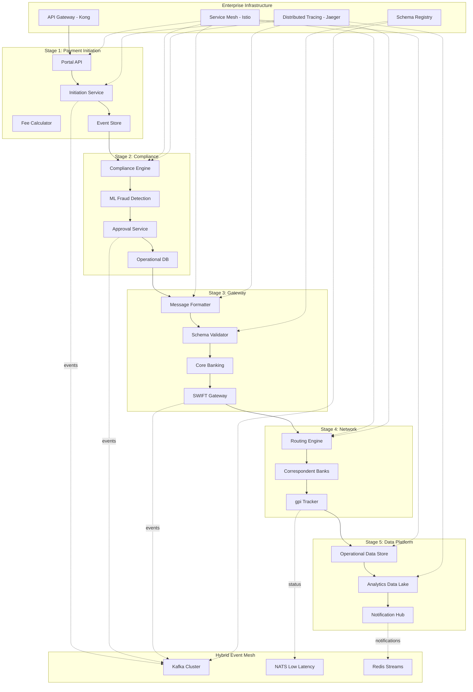
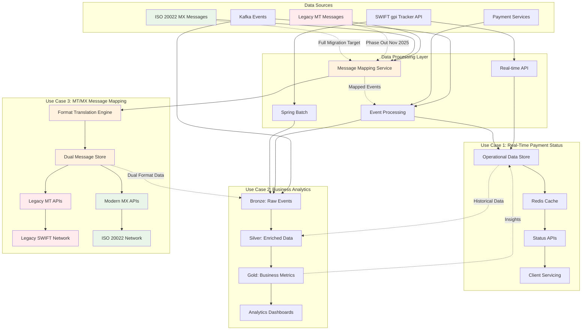

# Level 0 - Enterprise Cross-Border Payment Architecture (Simplified)

This Level 0 architecture provides a clean, working enterprise-grade view of the cross-border payment lifecycle with Hybrid Event Mesh and enterprise components.

## 🎯 Enterprise Architecture Overview

### Purpose
- **Executive View**: Strategic overview with enterprise-grade capabilities and ROI benefits
- **Engineering View**: Microservices, event mesh, and distributed system components
- **Security View**: Zero-trust architecture with service mesh and distributed tracing
- **Operations View**: Observability, monitoring, and performance optimization

### Scope
Complete enterprise cross-border payment lifecycle incorporating:
- **PMPG Use-Case 1a**: Account-to-Account remittances (GP2P category)
- **ISO 20022 Standards**: Native message support with schema evolution
- **BIAN Architecture**: Service domain alignment with enterprise patterns
- **Hybrid Event Mesh**: Kafka + NATS + Redis for optimized messaging
- **Service Mesh**: Zero-trust security and observability
- **Distributed Tracing**: End-to-end transaction visibility

## 🏗️ Enterprise 5-Stage Architecture with Event Mesh



## 🎯 Enhanced Target Benefits by Stage

| Stage | Kubernetes Namespace | Event Mesh Topics | Target Benefits | Enterprise Features |
|-------|---------------------|-------------------|-----------------|-------------------|
| **1. Initiation** | `payment-initiation` | `payment.initiated`, `fee.calculated` | ✅ **Fee Transparency** | Rate limiting, API versioning |
| **2. Approval** | `payment-compliance` | `compliance.screened`, `approval.decided` | ✅ **Enhanced Fraud Screening** | ML-based detection, audit trails |
| **3. Gateway** | `payment-gateway` | `message.formatted`, `swift.transmitted` | ✅ **Payment Accuracy** | Schema validation, message evolution |
| **4. Routing** | `payment-network` | `gpi.status.updated`, `network.routed` | ✅ **Real-time Traceability** | Low-latency NATS, distributed tracing |
| **5. Integration** | `payment-analytics` | `analytics.processed`, `notification.sent` | ✅ **Completion Alert** | Redis streams, real-time dashboards |

## 🏗️ Stage 5 Enhanced: Payment Integration with Data Platform Design

### 📊 Payment Status and Analytics Use Cases

#### **Use Case 1: Real-Time Payment Status Visibility**
Provide real-time and historical payment status visibility to client service and operations teams.

**Capabilities:**
- **Client Service Dashboard**: Real-time UETR tracking with status updates
- **Operations Console**: Historical payment trends and exception handling
- **Customer Portal Integration**: Self-service payment status queries
- **SLA Monitoring**: Payment processing time analytics and alerts

#### **Use Case 2: Business Analytics and Data Visualization**
Enable comprehensive business analytics and data visualization for trend analysis and reconciliation.

**Capabilities:**
- **Executive Dashboards**: Cross-border payment volume and revenue analytics
- **Compliance Reporting**: AML/OFAC screening results and audit trails
- **Trend Analysis**: Currency flows, corridor performance, and seasonal patterns
- **Reconciliation**: End-to-end payment matching and exception resolution

### 🏛️ Use Case-Driven Data Architecture



### 📋 Data Platform Implementation Details

#### **Initial Load Strategy**
```yaml
historical_ingestion:
  scope: "124 days of ISO 20022 (MX) payment messages"
  api_source: "SWIFT gpi Tracker API"
  key_strategy: "UETR-based retrieval"
  orchestration: "Spring Batch framework"
  
  batch_processing:
    chunk_size: 1000
    parallel_jobs: 8
    retry_attempts: 3
    error_handling: "Dead letter queue"
```

#### **Real-Time Processing**
```yaml
kafka_integration:
  topics:
    - "payment.status.updated"
    - "gpi.tracker.events"
    - "analytics.enriched"
  
  partitioning_strategy:
    currency: "12 partitions (USD, EUR, GBP, etc.)"
    region: "8 partitions (APAC, EMEA, Americas)"
    
  event_enrichment:
    - "Customer metadata lookup"
    - "Corridor-specific processing rules"
    - "Compliance scoring"
    - "SLA benchmarking"
```

#### **Scheduled Refresh Logic**
```yaml
batch_refresh:
  frequency: "Every 4 hours"
  api_optimization: "Minimize redundant SWIFT API calls"
  
  refresh_strategy:
    - "Delta processing for active payments"
    - "Status update for pending transactions"
    - "Final settlement confirmation"
    
  fallback_triggers:
    - "Missing UETR in Operational Data Store"
    - "Client query for unknown payment"
    - "Real-time status validation request"
```

### 🏛️ Use Case-Driven Implementation Architecture

#### **Use Case 1: Real-Time Payment Status Visibility**

```yaml
operational_data_store:
  technology: "Azure SQL Database / PostgreSQL"
  purpose: "Sub-second payment status queries for client service"
  
  data_model:
    primary_table: "payment_status_current"
    fields:
      - "uetr (Primary Key)"
      - "customer_id" 
      - "payment_amount"
      - "currency"
      - "corridor (from_country/to_country)"
      - "current_status"
      - "last_updated_timestamp"
      - "gpi_status_code"
      - "correspondent_banks"
  
  performance_targets:
    query_response: "< 50ms P95"
    availability: "99.95% uptime"
    concurrent_users: "5,000+ client service agents"
    
  apis:
    - "GET /api/v1/payments/{uetr}/status"
    - "GET /api/v1/customers/{id}/payments/active"
    - "POST /api/v1/payments/search"
    - "GET /api/v1/payments/{uetr}/timeline"
  
  caching_strategy:
    technology: "Redis Cluster"
    hot_data: "Active payments (< 30 days)"
    ttl: "15 minutes for status data"
    cache_warming: "Predictive pre-loading for high-volume customers"
```

#### **Use Case 2: Business Analytics and Trend Analysis**

```yaml
analytics_platform:
  architecture: "Modern Data Stack with Medallion Pattern"
  
  bronze_layer:
    purpose: "Raw event ingestion and audit trail"
    storage: "Azure Data Lake Gen2 / S3"
    format: "Parquet with Delta Lake"
    sources:
      - "SWIFT gpi Tracker events"
      - "Kafka payment lifecycle events"
      - "Core banking transaction logs"
      - "Compliance screening results"
  
  silver_layer:
    purpose: "Cleansed and enriched business data"
    processing: "Apache Spark / Databricks"
    transformations:
      - "Data quality validation"
      - "Currency normalization"
      - "Corridor performance calculations"
      - "Customer segmentation enrichment"
      - "Compliance risk scoring"
  
  gold_layer:
    purpose: "Business-ready analytics and KPIs"
    storage: "Snowflake Data Cloud"
    data_marts:
      - "Executive dashboard (daily/monthly aggregations)"
      - "Operations performance (SLA tracking)"
      - "Compliance reporting (regulatory metrics)"
      - "Revenue analytics (fee analysis)"
      - "Customer insights (payment patterns)"
  
#### **Use Case 3: ISO MT/MX Message Coexistence (Migration)**

```yaml
message_mapping_service:
  technology: "Spring Boot with Apache Camel"
  purpose: "Dual format support during MT to MX migration until November 2025"
  
  data_model:
    dual_message_store: "MongoDB for schema flexibility"
    fields:
      - "message_id (Primary Key)"
      - "uetr"
      - "source_format (MT103, MT200, pacs.008, pain.001)"
      - "target_format (auto-mapped equivalent)"
      - "original_message_content"
      - "translated_message_content"
      - "mapping_confidence_score"
      - "validation_status"
      - "processing_timestamp"
      - "migration_phase (dual/mx_only)"
  
  performance_targets:
    async_processing: "< 500ms for Kafka message mapping"
    sync_api: "< 200ms for real-time translation API"
    availability: "99.9% uptime (critical for migration)"
    throughput: "50,000 message mappings/hour"
    accuracy: "> 99.5% mapping confidence score"
    
  processing_modes:
    async_kafka:
      input_topic: "swift.mt.messages"
      output_topic: "swift.mx.translated"
      use_case: "Batch processing and analytics ingestion"
      retry_policy: "3 attempts with exponential backoff"
      
    sync_api:
      endpoint: "POST /api/v1/messages/translate"
      use_case: "Real-time message transformation"
      timeout: "10 seconds with circuit breaker"
      caching: "Redis for common translation patterns"
  
  migration_timeline:
    phase_1: "Sep 2025 - Dual format support (MT + MX)"
    phase_2: "Oct 2025 - MX preference with MT fallback"
    phase_3: "Nov 2025 - MX only (MT deprecated)"
    rollback_plan: "MT reactivation capability until Dec 2025"
```### 🔒 Compliance and Governance Framework

#### **AML and OFAC Screening**
```yaml
compliance_screening:
  aml_logic:
    - "Real-time transaction pattern analysis"
    - "Velocity checking (amount thresholds)"
    - "Geographic risk assessment"
    - "Beneficial ownership validation"
  
  ofac_screening:
    - "Sanctions list integration (real-time)"
    - "Fuzzy name matching algorithms"
    - "Secondary screening workflows"
    - "False positive reduction ML"
  
  integration_points:
    ingestion: "Bronze → Silver layer screening"
    enrichment: "Silver layer enhanced validation"
    real_time: "API query screening"
```

#### **Data Governance and Security**
```yaml
data_governance:
  access_controls:
    technology: "Azure RBAC + API Gateway"
    role_based_access:
      - "client_service: Read-only payment status"
      - "operations: Full payment lifecycle access"
      - "analytics: Aggregated reporting data"
      - "compliance: Full audit trail access"
  
  audit_logging:
    - "All data access events logged"
    - "API query tracking with user attribution"
    - "Data modification audit trails"
    - "Compliance report generation tracking"
  
  data_lineage:
    - "Source-to-target mapping"
    - "Transformation logic documentation"
    - "Data quality rule tracking"
    - "Impact analysis capabilities"
```

### 📈 Performance and Scalability Metrics

#### **Use Case-Specific Performance KPIs**

```yaml
use_case_1_operational_kpis:
  purpose: "Real-time payment status visibility"
  targets:
    api_response_time: "< 50ms P95 for status queries"
    database_query_time: "< 25ms for UETR lookups"
    cache_hit_ratio: "> 95% for active payments"
    availability: "99.95% uptime (4.38 hours downtime/year)"
    concurrent_users: "5,000+ client service agents"
    throughput: "10,000 status queries/second peak"
  
  performance_monitoring:
    dashboards: "Real-time Grafana dashboards"
    alerting: "PagerDuty for > 100ms response times"
    sla_tracking: "Monthly business reviews"

use_case_2_analytics_kpis:
  purpose: "Business analytics and trend analysis"
  targets:
    batch_processing_sla: "< 2 hours for daily analytics refresh"
    streaming_latency: "< 30 seconds for real-time KPIs"
    data_freshness: "< 15 minutes for operational dashboards"
    query_performance: "< 5 seconds for executive dashboards"
    availability: "99.5% uptime for analytics platform"
    concurrent_analysts: "500+ business users"
  
  data_volume_targets:
    ingestion_throughput: "100,000 payment events/second"
    storage_scalability: "Petabyte-scale with auto-partitioning"
    retention_management: "7 years compliance data"
    compute_scaling: "Auto-scaling 10-100 Spark nodes"

use_case_3_migration_kpis:
  purpose: "ISO MT/MX message coexistence and migration"
  targets:
    async_mapping_latency: "< 500ms for Kafka message transformation"
    sync_api_response: "< 200ms for real-time translation API"
    mapping_accuracy: "> 99.5% confidence score for MT to MX translation"
    availability: "99.9% uptime (critical for migration period)"
    throughput: "50,000 message mappings/hour"
    error_rate: "< 0.1% for message transformation failures"
  
  migration_timeline:
    phase_1_start: "September 2025 - Dual format support begins"
    phase_2_transition: "October 2025 - MX preference with MT fallback"
    phase_3_completion: "November 2025 - MX only (MT deprecated)"
    rollback_capability: "December 2025 - MT reactivation if needed"
  
  compliance_tracking:
    message_audit: "100% message transformation logging"
    format_distribution: "Weekly MT vs MX volume reporting"
    migration_progress: "Daily progress tracking to Nov 2025 target"
    rollback_preparedness: "Monthly rollback scenario testing"
```

### 🔄 Use Case Integration Patterns

#### **Dual-Purpose Event Processing**

```yaml
event_flow_architecture:
  shared_ingestion:
    source: "Kafka payment lifecycle events"
    partition_strategy: "By UETR for order preservation"
    
  branching_logic:
    operational_path:
      purpose: "Use Case 1 - Real-time status"
      processing: "Stream to operational database immediately"
      latency: "< 100ms from event to queryable"
      technology: "Kafka Connect → Azure SQL Database"
      
    analytics_path:
      purpose: "Use Case 2 - Business analytics"
      processing: "Store in data lake for batch processing"
      latency: "< 30 seconds to Bronze layer"
      technology: "Kafka → Delta Lake → Databricks"
      
    mapping_path:
      purpose: "Use Case 3 - MT/MX message mapping"
      processing: "Dual format transformation and routing"
      latency: "< 500ms for async, < 200ms for sync API"
      technology: "Apache Camel → MongoDB → Dual APIs"

data_consistency:
  pattern: "Event-driven eventual consistency"
  guarantee: "All events processed at least once"
  ordering: "Partition-level ordering by UETR"
  reconciliation: "Daily reconciliation jobs between operational and analytics"
```

#### **API Strategy by Use Case**

```yaml
api_design:
  operational_apis:
    base_url: "https://api.bank.com/payments/v1"
    authentication: "OAuth 2.0 + mTLS"
    rate_limits: "1000 req/sec per client service team"
    
    endpoints:
      status_lookup:
        path: "GET /payments/{uetr}/status"
        response_time: "< 50ms P95"
        cache_strategy: "Redis with 5-minute TTL"
        
      customer_payments:
        path: "GET /customers/{id}/payments"
        response_time: "< 100ms P95"
        pagination: "Cursor-based, 50 records max"
        
      search_payments:
        path: "POST /payments/search"
        response_time: "< 200ms P95"
        filters: "status, date range, corridor, amount"
  
  analytics_apis:
    base_url: "https://analytics.bank.com/v1"
    authentication: "OAuth 2.0 + RBAC"
    rate_limits: "100 req/sec per analyst user"
    
    endpoints:
      corridor_analytics:
        path: "GET /corridors/{from}/{to}/metrics"
        response_time: "< 5 seconds"
        aggregation_level: "Daily, weekly, monthly"
        
      executive_dashboard:
        path: "GET /dashboard/executive"
        response_time: "< 3 seconds"
        refresh_strategy: "Pre-computed with 1-hour cache"
        
      compliance_reports:
        path: "GET /compliance/reports/{type}"
        response_time: "< 10 seconds"
        formats: "JSON, CSV, PDF"
  
  message_mapping_apis:
    base_url: "https://mapping.bank.com/v1"
    authentication: "OAuth 2.0 + certificate-based auth"
    rate_limits: "500 req/sec per mapping service client"
    
    endpoints:
      translate_message:
        path: "POST /messages/translate"
        request_body: "source_format, target_format, message_content"
        response_time: "< 200ms P95"
        supported_formats: "MT103, MT200, pacs.008, pain.001"
        
      validate_mapping:
        path: "POST /messages/validate"
        response_time: "< 100ms P95"
        validation_rules: "ISO 20022 schema compliance"
        
      mapping_confidence:
        path: "GET /messages/{message_id}/confidence"
        response_time: "< 50ms P95"
        confidence_scoring: "ML-based accuracy prediction"
        
      migration_status:
        path: "GET /migration/status"
        response_time: "< 100ms P95"
        metrics: "MT vs MX volume, migration progress"
```

#### **MT/MX Message Mapping Kafka Architecture**

```yaml
kafka_topics_mapping:
  input_topics:
    swift_mt_messages:
      partitions: 8
      replication_factor: 3
      retention: "30 days"
      key_schema: "mt_message_key.avsc"
      value_schema: "mt_message_content.avsc"
      
    swift_mx_messages:
      partitions: 12
      replication_factor: 3
      retention: "30 days"
      key_schema: "mx_message_key.avsc" 
      value_schema: "mx_message_content.avsc"
  
  processing_topics:
    message_mapping_requests:
      partitions: 6
      replication_factor: 3
      retention: "7 days"
      use_case: "Async mapping job queue"
      
    mapping_results:
      partitions: 6
      replication_factor: 3
      retention: "90 days"
      use_case: "Completed translations for audit"
      
    mapping_errors:
      partitions: 2
      replication_factor: 3
      retention: "90 days"
      use_case: "Failed translations for manual review"
  
  output_topics:
    dual_format_messages:
      partitions: 12
      replication_factor: 3
      retention: "30 days"
      content: "Both MT and MX versions for compatibility"
      
    migration_metrics:
      partitions: 1
      replication_factor: 3
      retention: "365 days"
      use_case: "Migration progress tracking"

message_transformation_logic:
  technology: "Apache Camel with custom processors"
  
  mapping_rules:
    mt103_to_pacs008:
      field_mappings:
        - "MT103.20 → pacs.008.TxId"
        - "MT103.23B → pacs.008.BkToCstmrDbtCdtNtfctn"
        - "MT103.32A → pacs.008.IntrBkSttlmAmt"
        - "MT103.50K → pacs.008.Dbtr"
        - "MT103.59 → pacs.008.Cdtr"
      
    pain001_to_mt101:
      field_mappings:
        - "pain.001.GrpHdr.MsgId → MT101.20"
        - "pain.001.PmtInf.PmtMtd → MT101.23"
        - "pain.001.CdtTrfTxInf.Amt → MT101.32B"
        - "pain.001.Dbtr → MT101.50"
        - "pain.001.Cdtr → MT101.59"
  
  validation_engine:
    schema_validation: "XSD validation for ISO 20022"
    business_rules: "SWIFT gpi compliance checks"
    data_quality: "Field completeness and format validation"
    confidence_scoring: "ML model for translation accuracy"
```

## 🏛️ Enterprise System Components Detail

### 🚪 Enterprise API Gateway Layer (Kong Enterprise)

```yaml
api_gateway:
  technology: "Kong Enterprise"
  capabilities:
    - "Rate limiting per customer tier (1000/5000/10000 req/min)"
    - "OAuth 2.0 / OIDC integration with enterprise IdP"
    - "API versioning strategy (v1, v2, v3)"
    - "Request/response transformation"
    - "Circuit breaker patterns"
    - "Real-time analytics and monitoring"
  
  endpoints:
    - "POST /api/v1/payments/initiate"
    - "GET /api/v1/payments/{uetr}/status"
    - "GET /api/v1/payments/{uetr}/tracking"
    - "POST /api/v1/payments/{uetr}/cancel"
```

### 📨 Hybrid Event Mesh Architecture

```yaml
event_mesh:
  primary_backbone: "Apache Kafka"
  partitions_strategy:
    payment_initiated: 12    # Customer volume scaling
    compliance_screened: 6   # Compliance workload
    message_formatted: 8     # Message processing
    gpi_status_updated: 12   # High frequency updates
    
  low_latency_layer: "NATS"
  use_cases:
    - "Real-time status notifications (< 10ms)"
    - "gpi status updates"
    - "Customer alert delivery"
    
  real_time_streams: "Redis Streams"
  use_cases:
    - "Live dashboard updates"
    - "Real-time analytics"
    - "WebSocket notifications"

  schema_registry: "Confluent Schema Registry"
  evolution_strategy: "AVRO with backward compatibility"
```

### 🔐 Service Mesh Implementation (Istio)

```yaml
service_mesh:
  technology: "Istio"
  
  security:
    - "mTLS between all services (automatic)"
    - "Zero-trust network policies"
    - "JWT validation at service level"
    - "Certificate rotation automation"
    
  traffic_management:
    - "Canary deployments (10%/50%/100%)"
    - "Circuit breaker (5 failures = trip)"
    - "Retry policies with exponential backoff"
    - "Load balancing algorithms"
    
  observability:
    - "Automatic metrics collection (RED/USE)"
    - "Distributed tracing propagation"
    - "Access logging standardization"
    - "Service topology visualization"
```

### 📊 Distributed Tracing Strategy (Jaeger)

```yaml
distributed_tracing:
  technology: "Jaeger"
  
  trace_spans:
    stage_1: "payment-initiation.process"
    stage_2: "compliance.screen → fraud.detect → approval.decide"
    stage_3: "message.format → swift.transmit"
    stage_4: "network.route → gpi.track"
    stage_5: "analytics.process → notification.send"
    
  sampling_strategy:
    production: "1% sampling with error sampling 100%"
    development: "100% sampling"
    
  retention: "7 days for traces, 30 days for errors"
  
  custom_tags:
    - "uetr: transaction_id"
    - "customer_id: customer_identifier"
    - "stage: processing_stage"
    - "compliance_score: risk_level"
```

## 🗂️ Kubernetes Namespace & Domain Architecture

### Domain-Driven Namespace Strategy

```yaml
# Namespace: payment-initiation (Domain: Customer Experience)
payment_initiation:
  services:
    portal_api:
      replicas: 3
      resources: {cpu: "500m", memory: "1Gi"}
      
    initiation_service:
      replicas: 2  
      resources: {cpu: "750m", memory: "1.5Gi"}
      
    fee_calculator:
      replicas: 2
      resources: {cpu: "250m", memory: "512Mi"}

# Namespace: payment-compliance (Domain: Risk Management)
payment_compliance:
  services:
    compliance_engine:
      replicas: 2
      resources: {cpu: "1000m", memory: "2Gi"}  # ML workloads
      
    fraud_detection:
      replicas: 3
      resources: {cpu: "1500m", memory: "3Gi"}  # Heavy ML processing
      
    approval_workflow:
      replicas: 2
      resources: {cpu: "500m", memory: "1Gi"}

# Namespace: payment-gateway (Domain: Message Processing)
payment_gateway:
  services:
    message_formatter:
      replicas: 3
      resources: {cpu: "750m", memory: "1.5Gi"}
      
    schema_validator:
      replicas: 2
      resources: {cpu: "500m", memory: "1Gi"}
      
    swift_gateway:
      replicas: 3  # High availability critical
      resources: {cpu: "1000m", memory: "2Gi"}

# Namespace: payment-network (Domain: Network Operations)
payment_network:
  services:
    routing_engine:
      replicas: 2
      resources: {cpu: "750m", memory: "1.5Gi"}
      
    gpi_tracker:
      replicas: 3
      resources: {cpu: "500m", memory: "1Gi"}
      
    network_orchestrator:
      replicas: 2
      resources: {cpu: "1000m", memory: "2Gi"}

# Namespace: payment-analytics (Domain: Data & Analytics)
payment_analytics:
  services:
    analytics_engine:
      replicas: 2
      resources: {cpu: "2000m", memory: "4Gi"}  # Big data processing
      
    notification_hub:
      replicas: 3
      resources: {cpu: "500m", memory: "1Gi"}
      
    ml_insights:
      replicas: 1
      resources: {cpu: "1000m", memory: "2Gi"}
```

## 📨 Enhanced Kafka Topic Architecture

### Production-Ready Topic Configuration

```yaml
kafka_topics:
  # Stage 1: Customer Experience Events
  payment.initiated:
    partitions: 12
    replication_factor: 3
    retention_ms: 604800000  # 7 days
    key_schema: "customer_payment_key.avsc"
    value_schema: "payment_initiated_v1.avsc"
    
  fee.calculated:
    partitions: 8
    replication_factor: 3
    retention_ms: 604800000
    key_schema: "fee_calculation_key.avsc" 
    value_schema: "fee_calculated_v1.avsc"

  # Stage 2: Risk Management Events
  compliance.screened:
    partitions: 6
    replication_factor: 3
    retention_ms: 2592000000  # 30 days (compliance audit)
    key_schema: "compliance_case_key.avsc"
    value_schema: "compliance_screened_v1.avsc"
    
  fraud.detected:
    partitions: 4
    replication_factor: 3
    retention_ms: 2592000000  # 30 days
    key_schema: "fraud_case_key.avsc"
    value_schema: "fraud_detected_v1.avsc"

  # Stage 3: Message Processing Events  
  message.formatted:
    partitions: 8
    replication_factor: 3
    retention_ms: 1209600000  # 14 days
    key_schema: "message_reference_key.avsc"
    value_schema: "message_formatted_v1.avsc"
    
  swift.transmitted:
    partitions: 6
    replication_factor: 3
    retention_ms: 1209600000
    key_schema: "swift_reference_key.avsc"
    value_schema: "swift_transmitted_v1.avsc"

  # Stage 4: Network Operations Events
  gpi.status.updated:
    partitions: 12  # High frequency
    replication_factor: 3
    retention_ms: 2592000000  # 30 days
    key_schema: "uetr_key.avsc"
    value_schema: "gpi_status_v1.avsc"
    
  network.routed:
    partitions: 6
    replication_factor: 3
    retention_ms: 604800000
    key_schema: "routing_key.avsc"
    value_schema: "network_routed_v1.avsc"

  # Stage 5: Customer Communication Events
  notification.sent:
    partitions: 8
    replication_factor: 3
    retention_ms: 604800000
    key_schema: "customer_notification_key.avsc"
    value_schema: "notification_sent_v1.avsc"
    
  analytics.processed:
    partitions: 4
    replication_factor: 3
    retention_ms: 7776000000  # 90 days
    key_schema: "analytics_batch_key.avsc"
    value_schema: "analytics_processed_v1.avsc"
```

## 🔒 Enterprise Security & Compliance Framework

### Zero-Trust Security Model

```yaml
security_framework:
  identity_provider: "Keycloak / Azure AD"
  api_authentication: "OAuth 2.0 + OIDC"
  service_to_service: "mTLS (Istio managed)"
  secrets_management: "HashiCorp Vault"
  policy_enforcement: "Open Policy Agent (OPA)"
  
  compliance_controls:
    pci_dss: "Level 1 compliance"
    sox: "Financial controls automation"
    gdpr: "Data privacy by design"
    pmpg: "Use-Case 1a full compliance"
```

### Monitoring & Observability Stack

```yaml
observability:
  metrics: "Prometheus + Grafana"
  logging: "Fluentd + Elasticsearch + Kibana"
  tracing: "Jaeger with OpenTelemetry"
  alerting: "AlertManager + PagerDuty"
  
  sli_slo_definitions:
    availability: "99.9% uptime"
    latency_p95: "< 500ms end-to-end"
    error_rate: "< 0.1%"
    throughput: "> 10,000 TPS peak"
```

## 📈 Performance & Scalability Targets

### Enterprise KPIs

- **Transaction Throughput**: 10,000+ TPS sustained
- **End-to-End Latency**: < 500ms P95
- **Availability**: 99.9% (8.77 hours downtime/year)
- **Error Rate**: < 0.1%
- **Fraud Detection**: < 100ms ML inference
- **Customer Notification**: < 5 seconds delivery

### Auto-scaling Configuration

```yaml
hpa_configuration:
  payment_initiation: "Scale 1-10 pods at 70% CPU"
  fraud_detection: "Scale 2-15 pods at 60% CPU"
  message_formatter: "Scale 3-12 pods at 80% CPU"
  analytics_engine: "Scale 1-8 pods at 75% Memory"
```

## 🚀 Implementation Roadmap

### Phase 1 (Immediate - Next 3 months)
1. ✅ **Hybrid Event Mesh**: Kafka + NATS + Redis implementation
2. ✅ **Schema Registry**: AVRO schema management
3. ✅ **Service Mesh**: Istio deployment with mTLS
4. ✅ **Distributed Tracing**: Jaeger integration across all stages
5. ✅ **API Gateway**: Kong Enterprise with OAuth 2.0

### Phase 2 (Medium-term - 6 months)
1. **Advanced ML**: Enhanced fraud detection models
2. **Event Sourcing**: Complete audit trail implementation  
3. **Multi-region**: Geographic distribution
4. **Advanced Analytics**: Real-time dashboards and ML insights

### Phase 3 (Long-term - 12 months)
1. **AI-Powered Routing**: Intelligent payment path optimization
2. **Blockchain Integration**: Settlement layer enhancement
3. **Edge Computing**: Regional processing capabilities
4. **Advanced Compliance**: Real-time regulatory reporting

---

**This enterprise architecture provides a production-ready foundation for scaling cross-border payments to millions of transactions while maintaining security, compliance, and operational excellence.**