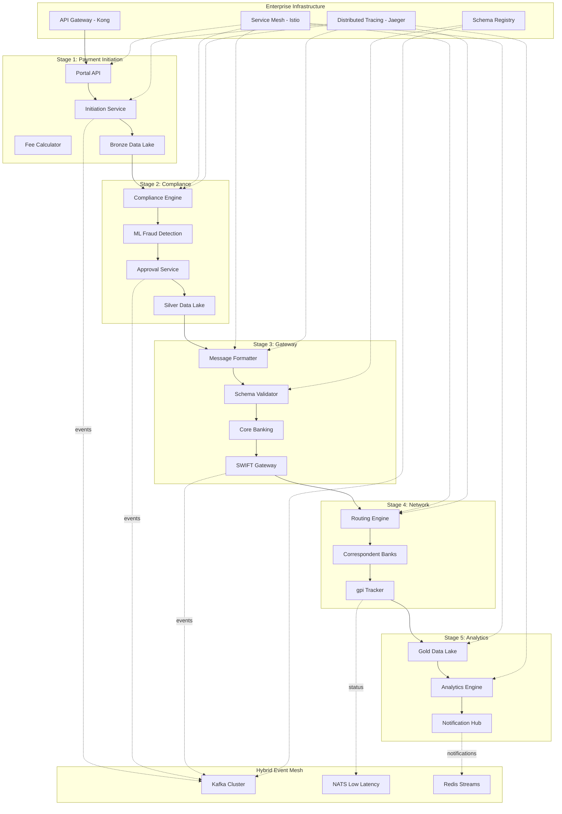

# Level 0 - Enterprise Cross-Border Payment Architecture (Simplified)

This Level 0 architecture provides a clean, working enterprise-grade view of the cross-border payment lifecycle with Hybrid Event Mesh and enterprise components.

## 🎯 Enterprise Architecture Overview

### Purpose
- **Executive View**: Strategic overview with enterprise-grade capabilities and ROI benefits
- **Engineering View**: Microservices, event mesh, and distributed system components
- **Security View**: Zero-trust architecture with service mesh and distributed tracing
- **Operations View**: Observability, monitoring, and performance optimization

### Scope
Complete enterprise cross-border payment lifecycle incorporating:
- **PMPG Use-Case 1a**: Account-to-Account remittances (GP2P category)
- **ISO 20022 Standards**: Native message support with schema evolution
- **BIAN Architecture**: Service domain alignment with enterprise patterns
- **Hybrid Event Mesh**: Kafka + NATS + Redis for optimized messaging
- **Service Mesh**: Zero-trust security and observability
- **Distributed Tracing**: End-to-end transaction visibility

## 🏗️ Enterprise 5-Stage Architecture with Event Mesh



## 🎯 Enhanced Target Benefits by Stage

| Stage | Kubernetes Namespace | Event Mesh Topics | Target Benefits | Enterprise Features |
|-------|---------------------|-------------------|-----------------|-------------------|
| **1. Initiation** | `payment-initiation` | `payment.initiated`, `fee.calculated` | ✅ **Fee Transparency** | Rate limiting, API versioning |
| **2. Approval** | `payment-compliance` | `compliance.screened`, `approval.decided` | ✅ **Enhanced Fraud Screening** | ML-based detection, audit trails |
| **3. Gateway** | `payment-gateway` | `message.formatted`, `swift.transmitted` | ✅ **Payment Accuracy** | Schema validation, message evolution |
| **4. Routing** | `payment-network` | `gpi.status.updated`, `network.routed` | ✅ **Real-time Traceability** | Low-latency NATS, distributed tracing |
| **5. Integration** | `payment-analytics` | `analytics.processed`, `notification.sent` | ✅ **Completion Alert** | Redis streams, real-time dashboards |

## 🏛️ Enterprise System Components Detail

### 🚪 Enterprise API Gateway Layer (Kong Enterprise)

```yaml
api_gateway:
  technology: "Kong Enterprise"
  capabilities:
    - "Rate limiting per customer tier (1000/5000/10000 req/min)"
    - "OAuth 2.0 / OIDC integration with enterprise IdP"
    - "API versioning strategy (v1, v2, v3)"
    - "Request/response transformation"
    - "Circuit breaker patterns"
    - "Real-time analytics and monitoring"
  
  endpoints:
    - "POST /api/v1/payments/initiate"
    - "GET /api/v1/payments/{uetr}/status"
    - "GET /api/v1/payments/{uetr}/tracking"
    - "POST /api/v1/payments/{uetr}/cancel"
```

### 📨 Hybrid Event Mesh Architecture

```yaml
event_mesh:
  primary_backbone: "Apache Kafka"
  partitions_strategy:
    payment_initiated: 12    # Customer volume scaling
    compliance_screened: 6   # Compliance workload
    message_formatted: 8     # Message processing
    gpi_status_updated: 12   # High frequency updates
    
  low_latency_layer: "NATS"
  use_cases:
    - "Real-time status notifications (< 10ms)"
    - "gpi status updates"
    - "Customer alert delivery"
    
  real_time_streams: "Redis Streams"
  use_cases:
    - "Live dashboard updates"
    - "Real-time analytics"
    - "WebSocket notifications"

  schema_registry: "Confluent Schema Registry"
  evolution_strategy: "AVRO with backward compatibility"
```

### 🔐 Service Mesh Implementation (Istio)

```yaml
service_mesh:
  technology: "Istio"
  
  security:
    - "mTLS between all services (automatic)"
    - "Zero-trust network policies"
    - "JWT validation at service level"
    - "Certificate rotation automation"
    
  traffic_management:
    - "Canary deployments (10%/50%/100%)"
    - "Circuit breaker (5 failures = trip)"
    - "Retry policies with exponential backoff"
    - "Load balancing algorithms"
    
  observability:
    - "Automatic metrics collection (RED/USE)"
    - "Distributed tracing propagation"
    - "Access logging standardization"
    - "Service topology visualization"
```

### 📊 Distributed Tracing Strategy (Jaeger)

```yaml
distributed_tracing:
  technology: "Jaeger"
  
  trace_spans:
    stage_1: "payment-initiation.process"
    stage_2: "compliance.screen → fraud.detect → approval.decide"
    stage_3: "message.format → swift.transmit"
    stage_4: "network.route → gpi.track"
    stage_5: "analytics.process → notification.send"
    
  sampling_strategy:
    production: "1% sampling with error sampling 100%"
    development: "100% sampling"
    
  retention: "7 days for traces, 30 days for errors"
  
  custom_tags:
    - "uetr: transaction_id"
    - "customer_id: customer_identifier"
    - "stage: processing_stage"
    - "compliance_score: risk_level"
```

## 🗂️ Kubernetes Namespace & Domain Architecture

### Domain-Driven Namespace Strategy

```yaml
# Namespace: payment-initiation (Domain: Customer Experience)
payment_initiation:
  services:
    portal_api:
      replicas: 3
      resources: {cpu: "500m", memory: "1Gi"}
      
    initiation_service:
      replicas: 2  
      resources: {cpu: "750m", memory: "1.5Gi"}
      
    fee_calculator:
      replicas: 2
      resources: {cpu: "250m", memory: "512Mi"}

# Namespace: payment-compliance (Domain: Risk Management)
payment_compliance:
  services:
    compliance_engine:
      replicas: 2
      resources: {cpu: "1000m", memory: "2Gi"}  # ML workloads
      
    fraud_detection:
      replicas: 3
      resources: {cpu: "1500m", memory: "3Gi"}  # Heavy ML processing
      
    approval_workflow:
      replicas: 2
      resources: {cpu: "500m", memory: "1Gi"}

# Namespace: payment-gateway (Domain: Message Processing)
payment_gateway:
  services:
    message_formatter:
      replicas: 3
      resources: {cpu: "750m", memory: "1.5Gi"}
      
    schema_validator:
      replicas: 2
      resources: {cpu: "500m", memory: "1Gi"}
      
    swift_gateway:
      replicas: 3  # High availability critical
      resources: {cpu: "1000m", memory: "2Gi"}

# Namespace: payment-network (Domain: Network Operations)
payment_network:
  services:
    routing_engine:
      replicas: 2
      resources: {cpu: "750m", memory: "1.5Gi"}
      
    gpi_tracker:
      replicas: 3
      resources: {cpu: "500m", memory: "1Gi"}
      
    network_orchestrator:
      replicas: 2
      resources: {cpu: "1000m", memory: "2Gi"}

# Namespace: payment-analytics (Domain: Data & Analytics)
payment_analytics:
  services:
    analytics_engine:
      replicas: 2
      resources: {cpu: "2000m", memory: "4Gi"}  # Big data processing
      
    notification_hub:
      replicas: 3
      resources: {cpu: "500m", memory: "1Gi"}
      
    ml_insights:
      replicas: 1
      resources: {cpu: "1000m", memory: "2Gi"}
```

## 📨 Enhanced Kafka Topic Architecture

### Production-Ready Topic Configuration

```yaml
kafka_topics:
  # Stage 1: Customer Experience Events
  payment.initiated:
    partitions: 12
    replication_factor: 3
    retention_ms: 604800000  # 7 days
    key_schema: "customer_payment_key.avsc"
    value_schema: "payment_initiated_v1.avsc"
    
  fee.calculated:
    partitions: 8
    replication_factor: 3
    retention_ms: 604800000
    key_schema: "fee_calculation_key.avsc" 
    value_schema: "fee_calculated_v1.avsc"

  # Stage 2: Risk Management Events
  compliance.screened:
    partitions: 6
    replication_factor: 3
    retention_ms: 2592000000  # 30 days (compliance audit)
    key_schema: "compliance_case_key.avsc"
    value_schema: "compliance_screened_v1.avsc"
    
  fraud.detected:
    partitions: 4
    replication_factor: 3
    retention_ms: 2592000000  # 30 days
    key_schema: "fraud_case_key.avsc"
    value_schema: "fraud_detected_v1.avsc"

  # Stage 3: Message Processing Events  
  message.formatted:
    partitions: 8
    replication_factor: 3
    retention_ms: 1209600000  # 14 days
    key_schema: "message_reference_key.avsc"
    value_schema: "message_formatted_v1.avsc"
    
  swift.transmitted:
    partitions: 6
    replication_factor: 3
    retention_ms: 1209600000
    key_schema: "swift_reference_key.avsc"
    value_schema: "swift_transmitted_v1.avsc"

  # Stage 4: Network Operations Events
  gpi.status.updated:
    partitions: 12  # High frequency
    replication_factor: 3
    retention_ms: 2592000000  # 30 days
    key_schema: "uetr_key.avsc"
    value_schema: "gpi_status_v1.avsc"
    
  network.routed:
    partitions: 6
    replication_factor: 3
    retention_ms: 604800000
    key_schema: "routing_key.avsc"
    value_schema: "network_routed_v1.avsc"

  # Stage 5: Customer Communication Events
  notification.sent:
    partitions: 8
    replication_factor: 3
    retention_ms: 604800000
    key_schema: "customer_notification_key.avsc"
    value_schema: "notification_sent_v1.avsc"
    
  analytics.processed:
    partitions: 4
    replication_factor: 3
    retention_ms: 7776000000  # 90 days
    key_schema: "analytics_batch_key.avsc"
    value_schema: "analytics_processed_v1.avsc"
```

## 🔒 Enterprise Security & Compliance Framework

### Zero-Trust Security Model

```yaml
security_framework:
  identity_provider: "Keycloak / Azure AD"
  api_authentication: "OAuth 2.0 + OIDC"
  service_to_service: "mTLS (Istio managed)"
  secrets_management: "HashiCorp Vault"
  policy_enforcement: "Open Policy Agent (OPA)"
  
  compliance_controls:
    pci_dss: "Level 1 compliance"
    sox: "Financial controls automation"
    gdpr: "Data privacy by design"
    pmpg: "Use-Case 1a full compliance"
```

### Monitoring & Observability Stack

```yaml
observability:
  metrics: "Prometheus + Grafana"
  logging: "Fluentd + Elasticsearch + Kibana"
  tracing: "Jaeger with OpenTelemetry"
  alerting: "AlertManager + PagerDuty"
  
  sli_slo_definitions:
    availability: "99.9% uptime"
    latency_p95: "< 500ms end-to-end"
    error_rate: "< 0.1%"
    throughput: "> 10,000 TPS peak"
```

## 📈 Performance & Scalability Targets

### Enterprise KPIs

- **Transaction Throughput**: 10,000+ TPS sustained
- **End-to-End Latency**: < 500ms P95
- **Availability**: 99.9% (8.77 hours downtime/year)
- **Error Rate**: < 0.1%
- **Fraud Detection**: < 100ms ML inference
- **Customer Notification**: < 5 seconds delivery

### Auto-scaling Configuration

```yaml
hpa_configuration:
  payment_initiation: "Scale 1-10 pods at 70% CPU"
  fraud_detection: "Scale 2-15 pods at 60% CPU"
  message_formatter: "Scale 3-12 pods at 80% CPU"
  analytics_engine: "Scale 1-8 pods at 75% Memory"
```

## 🚀 Implementation Roadmap

### Phase 1 (Immediate - Next 3 months)
1. ✅ **Hybrid Event Mesh**: Kafka + NATS + Redis implementation
2. ✅ **Schema Registry**: AVRO schema management
3. ✅ **Service Mesh**: Istio deployment with mTLS
4. ✅ **Distributed Tracing**: Jaeger integration across all stages
5. ✅ **API Gateway**: Kong Enterprise with OAuth 2.0

### Phase 2 (Medium-term - 6 months)
1. **Advanced ML**: Enhanced fraud detection models
2. **Event Sourcing**: Complete audit trail implementation  
3. **Multi-region**: Geographic distribution
4. **Advanced Analytics**: Real-time dashboards and ML insights

### Phase 3 (Long-term - 12 months)
1. **AI-Powered Routing**: Intelligent payment path optimization
2. **Blockchain Integration**: Settlement layer enhancement
3. **Edge Computing**: Regional processing capabilities
4. **Advanced Compliance**: Real-time regulatory reporting

---

**This enterprise architecture provides a production-ready foundation for scaling cross-border payments to millions of transactions while maintaining security, compliance, and operational excellence.**