# Level 0 - Cross-Border Payment Architecture (5-Stage Overview)

This Level 0 architecture provides a comprehensive view of the cross-border payment lifecycle based on the 5-stage approach, designed for executive and engineering stakeholders.

## 🎯 Architecture Overview

### Purpose
- **Executive View**: Strategic overview of payment capabilities and target benefits
- **Engineering View**: System components, integration points, and data flows
- **Compliance View**: BIAN service domains and regulatory alignment
- **Operational View**: Real-time monitoring and performance metrics

### Scope
Complete cross-border payment lifecycle from initiation through settlement, incorporating:
- **PMPG Use-Case 1a**: Account-to-Account remittances (GP2P category)
- **ISO 20022 Standards**: Native message support with MT fallback
- **BIAN Architecture**: Service domain alignment for enterprise consistency
- **Data Medallion Pattern**: Bronze → Silver → Gold progression

## 🏗️ 5-Stage Architecture Components

```mermaid
graph TB
    subgraph "🚀 STAGE 1: PAYMENT INITIATION"
        A1[👤 Customer Portal] --> A2[🔌 API Gateway]
        A2 --> A3[💰 Payment Initiation Service]
        A3 --> A4[⚙️ Workflow Engine]
        A3 --> A5[🏛️ Bronze Data Lake]
    end

    subgraph "📋 STAGE 2: PAYMENT APPROVAL"
        A4 --> B1[🛡️ Compliance Engine]
        B1 --> B2[🔍 Fraud Detection Service]
        B2 --> B3[✅ Approval Service]
        B3 --> B4[🏛️ Silver Data Lake]
    end

    subgraph "🌐 STAGE 3: PAYMENT GATEWAY"
        B3 --> C1[🔧 Payment Formatter]
        C1 --> C2[✓ Message Validation]
        C2 --> C3[🏦 Core Banking]
        C3 --> C4[🌐 SWIFT Gateway]
    end

    subgraph "🔗 STAGE 4: ROUTING & EXECUTION"
        C4 --> D1[🏦 Correspondent A]
        D1 --> D2[🏦 Correspondent B]
        D2 --> D3[🏛️ Beneficiary Bank]
        D3 --> D4[📍 gpi Tracker]
    end

    subgraph "📈 STAGE 5: PAYMENT INTEGRATION"
        D4 --> E1[🏛️ Gold Data Lake]
        E1 --> E2[📊 Analytics Dashboard]
        E2 --> E3[📧 Notification Service]
        E3 --> E4[🌐 Customer Portal]
        E4 --> A1
    end

    %% Data Flow Connections
    A5 -.-> B4
    B4 -.-> E1
    
    %% Cross-stage Integrations
    D4 -.-> E2
    E3 -.-> A1
```



## 🎯 Target Benefits by Stage

| Stage | Primary Systems | Target Benefits Achieved | BIAN Domains |
|-------|----------------|---------------------------|--------------|
| **1. Initiation** | Frontend, Payment Core, Workflow | ✅ **Fee Transparency** | Payment Initiation |
| **2. Approval** | Compliance, Fraud Detection | ✅ **Enhanced Fraud Screening** | Party Authentication, Fraud Detection |
| **3. Gateway** | Formatter, Validation, SWIFT | ✅ **Payment Accuracy & Sender Clarity** | Payment Execution |
| **4. Routing** | SWIFT Network, Correspondents | ✅ **Real-time Traceability** | Payment Execution (Network) |
| **5. Integration** | Data Platform, Analytics | ✅ **Completion Alert & Investigation Reduction** | Customer Case Management |

## 🏛️ System Components Detail

### Stage 1: Payment Initiation Layer
- **Customer Portal**: Multi-channel access (Web, Mobile, API)
- **API Gateway**: Authentication, rate limiting, request routing
- **Payment Initiation Service**: UETR generation, fee calculation, validation
- **Workflow Engine (Camunda)**: BPMN 2.0 process orchestration
- **Bronze Data Lake**: Raw event capture with immutable audit trail

### Stage 2: Compliance & Approval Layer
- **Compliance Engine**: AML/KYC screening, sanctions checking
- **Fraud Detection Service**: ML-based risk assessment, behavioral analysis
- **Approval Service**: Dual approval workflow, maker-checker controls
- **Silver Data Lake**: Enriched data with compliance metadata

### Stage 3: Message Processing Layer
- **Payment Formatter**: ISO 20022 message assembly, MT fallback
- **Message Validation**: Schema validation, business rule checking
- **Core Banking Integration**: Account validation, balance checks
- **SWIFT Gateway**: Message transmission, gpi integration

### Stage 4: Network Execution Layer
- **SWIFT Network**: Global messaging infrastructure
- **Correspondent Banks**: Multi-hop routing, currency conversion
- **Beneficiary Bank**: Final settlement, account crediting
- **gpi Tracker**: Real-time status updates, end-to-end tracking

### Stage 5: Analytics & Customer Experience Layer
- **Gold Data Lake**: Analytics-ready data, operational metrics
- **Analytics Dashboard**: Real-time KPIs, performance monitoring
- **Notification Service**: Multi-channel alerts, status updates
- **Customer Experience**: Portal updates, transaction history

## 📊 Data Medallion Architecture

### Bronze Layer (Stages 1-2)
```json
{
  "layer": "bronze",
  "purpose": "Raw event ingestion",
  "content": [
    "Payment requests with original payload",
    "UETR generation events",
    "Initial compliance screening results",
    "Approval workflow state changes"
  ],
  "retention": "7 years (regulatory requirement)"
}
```

### Silver Layer (Stages 2-3)
```json
{
  "layer": "silver",
  "purpose": "Validated and enriched data",
  "content": [
    "Enhanced compliance metadata",
    "Risk scores and fraud indicators",
    "Formatted ISO 20022 messages",
    "SWIFT transmission confirmations"
  ],
  "retention": "5 years (operational requirement)"
}
```

### Gold Layer (Stages 4-5)
```json
{
  "layer": "gold",
  "purpose": "Analytics-ready operational data",
  "content": [
    "End-to-end transaction records",
    "Performance metrics and KPIs",
    "Customer experience data",
    "Regulatory reporting datasets"
  ],
  "retention": "3 years (business intelligence)"
}
```

## 🔄 Message Flow Patterns

### ISO 20022 Message Types
- **pain.001**: Customer Credit Transfer Initiation (Stage 1 → 2)
- **pacs.008**: Financial Institution Credit Transfer (Stage 3 → 4)
- **pacs.002**: Payment Status Report (Stage 4 → 5)
- **camt.056**: FI to FI Payment Cancellation Request (Exception handling)

### Legacy MT Fallback
- **MT101**: Customer Transfer Initiation → pain.001 conversion
- **MT103**: Single Customer Credit Transfer → pacs.008 mapping
- **MT910**: Confirmation of Credit → pacs.002 equivalent

### API Integration Points
```yaml
payment_apis:
  initiation: "POST /api/v1/payments/initiate"
  status: "GET /api/v1/payments/{uetr}/status"
  tracking: "GET /api/v1/payments/{uetr}/tracking"
  
gpi_apis:
  status_update: "GET /gpi/v1/payments/{uetr}"
  tracker: "POST /gpi/v1/tracker/updates"
  
notification_apis:
  webhook: "POST /webhooks/payment/status"
  alerts: "POST /api/v1/notifications/send"
```

## 🛡️ Security & Compliance Framework

### Authentication & Authorization
- **OAuth 2.0**: Customer and API authentication
- **JWT Tokens**: Session management and authorization
- **API Keys**: System-to-system authentication
- **mTLS**: SWIFT network security

### Regulatory Compliance
- **PMPG Standards**: Use-Case 1a implementation
- **BIAN Architecture**: Service domain alignment
- **Data Protection**: GDPR, regional privacy laws
- **Financial Regulations**: AML, KYC, sanctions compliance

## 📈 Performance & Monitoring

### Real-time Metrics (Gold Layer)
- **Transaction Volume**: Payments per hour/day
- **Success Rate**: End-to-end completion percentage
- **Processing Time**: Average time per stage
- **Cost Efficiency**: Cost per successful transaction
- **Customer Satisfaction**: Real-time feedback scores

### Operational Dashboards
- **Executive Dashboard**: High-level KPIs and trends
- **Operations Dashboard**: Real-time monitoring and alerts
- **Compliance Dashboard**: Risk metrics and regulatory reporting
- **Customer Dashboard**: Transaction status and history

## 🔮 Future Architecture Considerations

### Scalability Enhancements
- **Microservices**: Further decomposition for scale
- **Event Streaming**: Enhanced Kafka integration
- **API Gateway**: Rate limiting and throttling improvements
- **Database Optimization**: Sharding and read replicas

### Technology Evolution
- **Central Bank Digital Currencies (CBDC)**: Future integration points
- **Blockchain Integration**: DLT for settlement optimization
- **AI/ML Enhancement**: Advanced fraud detection and routing
- **Real-time Gross Settlement**: RTGS integration capabilities

## 📚 Related Documentation

### Sequence Diagrams
- [L0 Overview - 5 Stages](sequence-diagrams/l0-overview-5-stages.md) - High-level flow
- [Stage 1: Payment Initiation](sequence-diagrams/stage1-payment-initiation.md) - Detailed customer experience
- [Stage 2: Payment Approval](sequence-diagrams/stage2-payment-approval.md) - Compliance and fraud screening
- [Stage 3: Payment Gateway](sequence-diagrams/stage3-payment-gateway.md) - Message formatting
- [Stage 4: Routing & Execution](sequence-diagrams/stage4-routing-execution.md) - Network processing
- [Stage 5: Payment Integration](sequence-diagrams/stage5-payment-integration.md) - Analytics and notifications

### Implementation Guides
- [Remittances Use-Case 1a Summary](remittances-use-case-1a-summary.md) - PMPG compliance guide
- [BIAN Service Domain Mapping](bian-service-domains.md) - Enterprise architecture alignment

### Reference Standards
- [PMPG Market Guidance](references/20250115_pmpg-market-guidance_0.pdf) - Industry standards
- [JPMorgan ISO 20022 Guides](references/) - Implementation experience and mapping guides

---

**Next Steps:**
1. Develop Level 1 architecture diagrams for each stage
2. Create detailed integration specifications
3. Define API contracts and data schemas
4. Establish performance benchmarks and SLAs
