# Azure API Management - Request Flow Diagrams

This document illustrates the comprehensive request flow through Azure API Management, demonstrating how it serves as the central API gateway for our enterprise architecture.

## 🔗 API Management Overview

Azure API Management acts as the **single entry point** for all API communications, providing security, performance optimization, and developer experience enhancements while maintaining Azure Well-Architected Framework compliance.

## 🔄 Complete Request Flow

```mermaid
sequenceDiagram
    participant Client as 🌐 Frontend Client
    participant APIM as 🔗 Azure API Management
    participant Cache as 💾 Response Cache
    participant KeyVault as 🔑 Azure Key Vault
    participant Backend as 🌱 Backend Service
    participant AppInsights as 📊 Application Insights
    participant LogAnalytics as 📝 Log Analytics

    Note over Client, LogAnalytics: Complete API Request Lifecycle

    %% Request initiation
    Client->>APIM: 1. API Request with Auth Header
    
    %% Security validation
    APIM->>APIM: 2. IP Filter & WAF Check
    APIM->>KeyVault: 3. Retrieve API Keys/Certificates
    KeyVault-->>APIM: 4. Security Credentials
    APIM->>APIM: 5. JWT/OAuth Validation
    
    %% Policy enforcement
    APIM->>APIM: 6. Rate Limiting Check
    APIM->>APIM: 7. Quota Validation
    APIM->>APIM: 8. Request Transformation
    
    %% Cache check
    APIM->>Cache: 9. Check Cache for Response
    alt Cache Hit
        Cache-->>APIM: 10a. Cached Response
        APIM->>AppInsights: 11a. Log Cache Hit Metrics
        APIM-->>Client: 12a. Return Cached Response
    else Cache Miss
        Cache-->>APIM: 10b. Cache Miss
        
        %% Backend request
        APIM->>Backend: 11b. Forward Request to Backend
        Backend->>Backend: 12b. Process Business Logic
        Backend-->>APIM: 13b. Backend Response
        
        %% Response processing
        APIM->>APIM: 14b. Response Transformation
        APIM->>Cache: 15b. Store Response in Cache
        APIM->>AppInsights: 16b. Log Request Metrics
        APIM-->>Client: 17b. Return Processed Response
    end
    
    %% Analytics and monitoring
    APIM->>LogAnalytics: 18. Send Detailed Logs
    AppInsights->>LogAnalytics: 19. Aggregate Metrics Data
    
    Note over Client, LogAnalytics: Request Complete with Full Observability
```

## 🔒 Security Policy Enforcement Flow

```mermaid
sequenceDiagram
    participant Client as 🌐 Client Application
    participant Gateway as 🔗 API Gateway
    participant Security as 🔒 Security Layer
    participant AAD as 🎫 Azure Active Directory
    participant Backend as 🌱 Backend Service
    participant Audit as 📋 Audit Log

    Note over Client, Audit: Multi-Layer Security Enforcement

    Client->>Gateway: 1. API Request
    
    %% Layer 1: Network Security
    Gateway->>Security: 2. IP Filtering & WAF
    Security->>Security: 3. Check IP Whitelist/Blacklist
    Security->>Security: 4. WAF Threat Detection
    
    %% Layer 2: Authentication
    Security->>AAD: 5. Validate JWT Token
    AAD->>AAD: 6. Check Token Signature & Claims
    AAD-->>Security: 7. Authentication Result
    
    %% Layer 3: Authorization
    Security->>Security: 8. Check API Subscription
    Security->>Security: 9. Validate Resource Permissions
    Security->>Security: 10. Apply RBAC Rules
    
    %% Layer 4: Policy Enforcement
    Security->>Security: 11. Rate Limiting Check
    Security->>Security: 12. Quota Enforcement
    Security->>Security: 13. Request Validation
    
    alt Security Passed
        Security-->>Gateway: 14a. Security Cleared
        Gateway->>Backend: 15a. Forward Authorized Request
        Backend-->>Gateway: 16a. Backend Response
        Gateway->>Audit: 17a. Log Successful Access
        Gateway-->>Client: 18a. Return Response
    else Security Failed
        Security-->>Gateway: 14b. Security Violation
        Gateway->>Audit: 15b. Log Security Failure
        Gateway-->>Client: 16b. Return 401/403 Error
    end
    
    Note over Client, Audit: Complete Security Audit Trail
```

## ⚡ Performance Optimization Flow

```mermaid
sequenceDiagram
    participant Client as 🌐 Client
    participant APIM as 🔗 API Management
    participant Cache as 💾 Multi-Layer Cache
    participant CDN as 🌐 Azure CDN
    participant LB as ⚖️ Load Balancer
    participant Backend1 as 🌱 Backend Instance 1
    participant Backend2 as 🌱 Backend Instance 2
    participant Monitor as 📊 Performance Monitor

    Note over Client, Monitor: Performance-Optimized Request Flow

    Client->>APIM: 1. API Request
    
    %% Performance preprocessing
    APIM->>Monitor: 2. Record Request Start Time
    APIM->>Cache: 3. Check Response Cache
    
    alt Cache Hit - Best Performance
        Cache-->>APIM: 4a. Return Cached Data
        APIM->>Monitor: 5a. Log Cache Hit Performance
        APIM-->>Client: 6a. Ultra-Fast Response (~10ms)
    
    else Cache Miss - Optimized Backend Call
        Cache-->>APIM: 4b. Cache Miss
        
        %% Compression and optimization
        APIM->>APIM: 5b. Apply Request Compression
        APIM->>APIM: 6b. Optimize Headers
        
        %% Load balancing
        APIM->>LB: 7b. Route to Optimal Backend
        LB->>LB: 8b. Health Check & Performance Assessment
        
        alt Backend 1 Available
            LB->>Backend1: 9ba. Route to Backend 1
            Backend1-->>LB: 10ba. Response from Backend 1
        else Backend 1 Overloaded
            LB->>Backend2: 9bb. Route to Backend 2
            Backend2-->>LB: 10bb. Response from Backend 2
        end
        
        LB-->>APIM: 11b. Optimized Backend Response
        
        %% Response optimization
        APIM->>APIM: 12b. Apply Response Compression
        APIM->>APIM: 13b. Response Transformation
        APIM->>Cache: 14b. Store in Cache for Future Requests
        APIM->>CDN: 15b. Update CDN Cache (if applicable)
        
        APIM->>Monitor: 16b. Log Performance Metrics
        APIM-->>Client: 17b. Optimized Response (~100ms)
    end
    
    Monitor->>Monitor: 18. Analyze Performance Patterns
    Monitor->>Monitor: 19. Generate Optimization Recommendations
    
    Note over Client, Monitor: Continuous Performance Optimization
```

## 👨‍💻 Developer Experience Flow

```mermaid
sequenceDiagram
    participant Dev as 👨‍💻 Developer
    participant Portal as 🌐 Developer Portal
    participant APIM as 🔗 API Management
    participant Catalog as 📚 API Catalog
    participant Console as 🧪 Test Console
    participant SDKGen as ⚙️ SDK Generator
    participant Analytics as 📊 Usage Analytics

    Note over Dev, Analytics: Complete Developer Onboarding & Experience

    %% Discovery phase
    Dev->>Portal: 1. Browse API Catalog
    Portal->>Catalog: 2. Retrieve Available APIs
    Catalog-->>Portal: 3. API Definitions & Documentation
    Portal-->>Dev: 4. Interactive API Documentation
    
    %% Trial and testing
    Dev->>Portal: 5. Request API Access
    Portal->>APIM: 6. Create Developer Subscription
    APIM-->>Portal: 7. Generate API Keys
    Portal-->>Dev: 8. Provide API Credentials
    
    %% Interactive testing
    Dev->>Console: 9. Test API in Browser Console
    Console->>APIM: 10. Execute Test Request
    APIM->>APIM: 11. Apply Development Policies
    APIM-->>Console: 12. Return Test Response
    Console-->>Dev: 13. Display Results & Examples
    
    %% SDK generation
    Dev->>SDKGen: 14. Request Client SDK
    SDKGen->>Catalog: 15. Retrieve API Specifications
    SDKGen->>SDKGen: 16. Generate Language-Specific SDK
    SDKGen-->>Dev: 17. Download Ready-to-Use SDK
    
    %% Implementation phase
    Dev->>Dev: 18. Integrate SDK in Application
    Dev->>APIM: 19. Make Production API Calls
    APIM->>Analytics: 20. Track Usage Patterns
    
    %% Self-service monitoring
    Dev->>Portal: 21. View Usage Dashboard
    Portal->>Analytics: 22. Retrieve Developer Metrics
    Analytics-->>Portal: 23. Usage Statistics & Insights
    Portal-->>Dev: 24. Personalized Analytics Dashboard
    
    Note over Dev, Analytics: Self-Service Developer Ecosystem
```

## 🚨 Error Handling & Circuit Breaker Flow

```mermaid
sequenceDiagram
    participant Client as 🌐 Client
    participant APIM as 🔗 API Management
    participant CB as 🔄 Circuit Breaker
    participant Backend as 🌱 Backend Service
    participant Monitor as 📊 Health Monitor
    participant Alerts as 🚨 Alert System
    participant Fallback as 🔄 Fallback Service

    Note over Client, Fallback: Resilient Error Handling & Recovery

    Client->>APIM: 1. API Request
    APIM->>CB: 2. Check Circuit Breaker State
    
    alt Circuit Closed (Normal Operation)
        CB-->>APIM: 3a. Circuit Closed - Proceed
        APIM->>Backend: 4a. Forward Request
        
        alt Backend Healthy Response
            Backend-->>APIM: 5aa. Successful Response
            APIM->>Monitor: 6aa. Log Success Metric
            APIM-->>Client: 7aa. Return Response
        
        else Backend Error Response
            Backend-->>APIM: 5ab. Error Response (500, timeout)
            APIM->>CB: 6ab. Record Failure
            CB->>CB: 7ab. Increment Failure Counter
            APIM->>Monitor: 8ab. Log Error Metric
            
            alt Failure Threshold Reached
                CB->>CB: 9aba. Open Circuit Breaker
                CB->>Alerts: 10aba. Trigger Circuit Open Alert
                APIM->>Fallback: 11aba. Route to Fallback
                Fallback-->>APIM: 12aba. Fallback Response
                APIM-->>Client: 13aba. Return Degraded Response
            else Below Threshold
                APIM-->>Client: 9abb. Return Error Response
            end
        end
    
    else Circuit Open (Service Down)
        CB-->>APIM: 3b. Circuit Open - Block Request
        APIM->>Fallback: 4b. Route to Fallback Service
        Fallback-->>APIM: 5b. Cached/Default Response
        APIM-->>Client: 6b. Return Fallback Response
        
        %% Periodic health check
        CB->>Backend: 7b. Health Check (Background)
        alt Backend Recovered
            Backend-->>CB: 8ba. Health Check Success
            CB->>CB: 9ba. Transition to Half-Open
            CB->>Alerts: 10ba. Service Recovery Alert
        else Backend Still Down
            Backend-->>CB: 8bb. Health Check Failed
            CB->>CB: 9bb. Keep Circuit Open
        end
    
    else Circuit Half-Open (Testing Recovery)
        CB-->>APIM: 3c. Half-Open - Limited Requests
        APIM->>Backend: 4c. Test Request
        
        alt Test Successful
            Backend-->>APIM: 5ca. Success Response
            CB->>CB: 6ca. Close Circuit Breaker
            CB->>Alerts: 7ca. Service Fully Recovered Alert
            APIM-->>Client: 8ca. Return Response
        else Test Failed
            Backend-->>APIM: 5cb. Failed Response
            CB->>CB: 6cb. Re-open Circuit Breaker
            APIM->>Fallback: 7cb. Route to Fallback
            Fallback-->>APIM: 8cb. Fallback Response
            APIM-->>Client: 9cb. Return Fallback Response
        end
    end
    
    Monitor->>Monitor: Regular Health Assessment
    Monitor->>Alerts: Generate Health Reports
    
    Note over Client, Fallback: Automated Failure Detection & Recovery
```

## 📊 Analytics & Monitoring Flow

```mermaid
sequenceDiagram
    participant API as 🔗 API Management
    participant Collector as 📊 Metrics Collector
    participant AppInsights as 📈 Application Insights
    participant LogAnalytics as 📝 Log Analytics
    participant EventHub as 📡 Event Hub
    participant Dashboard as 📊 Analytics Dashboard
    participant Alerts as 🚨 Alert System

    Note over API, Alerts: Real-time Analytics & Monitoring Pipeline

    %% Real-time metrics collection
    loop Every API Request
        API->>Collector: 1. Request/Response Metrics
        Collector->>Collector: 2. Aggregate Real-time Data
        
        %% Multiple destinations for different purposes
        par Application Performance
            Collector->>AppInsights: 3a. Performance Metrics
            AppInsights->>AppInsights: 4a. Process APM Data
        and Detailed Logging
            Collector->>LogAnalytics: 3b. Detailed Request Logs
            LogAnalytics->>LogAnalytics: 4b. Index & Store Logs
        and Event Streaming
            Collector->>EventHub: 3c. Real-time Events
            EventHub->>EventHub: 4c. Stream Processing
        end
    end
    
    %% Dashboard updates
    par Real-time Dashboard
        AppInsights->>Dashboard: 5a. Live Performance Data
        Dashboard->>Dashboard: 6a. Update Real-time Charts
    and Historical Analysis
        LogAnalytics->>Dashboard: 5b. Historical Trends
        Dashboard->>Dashboard: 6b. Generate Trend Analysis
    end
    
    %% Alerting system
    par Performance Alerts
        AppInsights->>Alerts: 7a. Performance Threshold Breach
        Alerts->>Alerts: 8a. Evaluate Alert Conditions
    and Error Rate Alerts
        LogAnalytics->>Alerts: 7b. Error Rate Spike
        Alerts->>Alerts: 8b. Process Error Patterns
    and Usage Alerts
        EventHub->>Alerts: 7c. Unusual Usage Patterns
        Alerts->>Alerts: 8c. Analyze Usage Anomalies
    end
    
    %% Alert notifications
    alt Critical Alert
        Alerts->>Alerts: 9a. Send Immediate Notification
        Note over Alerts: SMS, Email, Teams, PagerDuty
    else Warning Alert
        Alerts->>Dashboard: 9b. Update Dashboard Status
        Note over Dashboard: Visual indicators & warnings
    end
    
    %% Business intelligence
    LogAnalytics->>LogAnalytics: 10. Generate Business Reports
    AppInsights->>AppInsights: 11. Calculate SLA Metrics
    Dashboard->>Dashboard: 12. Create Executive Summaries
    
    Note over API, Alerts: Complete Observability & Business Intelligence
```

## 🔄 Configuration Management Flow

```mermaid
sequenceDiagram
    participant Admin as 👨‍💼 Admin
    participant Portal as 📝 Management Portal
    participant ARM as 🏗️ ARM Template
    participant APIM as 🔗 API Management
    participant Policy as 📋 Policy Store
    participant Backup as 💾 Configuration Backup
    participant Git as 📚 Git Repository

    Note over Admin, Git: Infrastructure as Code & Configuration Management

    %% Initial setup via IaC
    Admin->>ARM: 1. Deploy ARM/Bicep Template
    ARM->>APIM: 2. Provision API Management Instance
    APIM->>Policy: 3. Initialize Default Policies
    APIM->>Backup: 4. Create Initial Configuration Backup
    
    %% Policy configuration
    Admin->>Portal: 5. Configure API Policies
    Portal->>Policy: 6. Validate Policy Syntax
    Policy-->>Portal: 7. Validation Results
    Portal->>APIM: 8. Apply Policy Configuration
    APIM->>APIM: 9. Update Runtime Policies
    
    %% Version control integration
    APIM->>Git: 10. Export Configuration to Git
    Git->>Git: 11. Version Control Policies
    
    %% Continuous backup
    loop Configuration Changes
        APIM->>Backup: 12. Automated Configuration Backup
        Backup->>Backup: 13. Store Versioned Configuration
    end
    
    %% Disaster recovery
    alt Configuration Restore Needed
        Admin->>Backup: 14a. Initiate Configuration Restore
        Backup->>APIM: 15a. Restore Previous Configuration
        APIM->>APIM: 16a. Apply Restored Settings
        APIM->>Git: 17a. Sync with Version Control
    
    else Multi-Environment Deployment
        Admin->>Git: 14b. Trigger Environment Sync
        Git->>ARM: 15b. Deploy to Target Environment
        ARM->>APIM: 16b. Apply Environment-Specific Config
    end
    
    %% Compliance and auditing
    APIM->>Policy: 18. Log Configuration Changes
    Policy->>Policy: 19. Audit Trail Maintenance
    Portal->>Portal: 20. Generate Compliance Reports
    
    Note over Admin, Git: Automated, Auditable Configuration Management
```

## Key Benefits Summary

### 🛡️ Enterprise Security
- **Multi-layer authentication** and authorization
- **Policy-based access control** with fine-grained permissions
- **Complete audit trails** for compliance requirements
- **Zero Trust architecture** with defense-in-depth

### ⚡ Performance Excellence
- **Multi-tier caching** for optimal response times
- **Intelligent load balancing** and circuit breaker patterns
- **Response compression** and transformation
- **Global distribution** with edge optimization

### 👨‍💻 Developer Experience
- **Self-service API portal** with interactive documentation
- **Automated SDK generation** in multiple languages
- **Built-in testing console** for rapid development
- **Real-time analytics** and usage insights

### 🔄 Operational Excellence
- **Infrastructure as Code** deployment and management
- **Automated monitoring** and alerting
- **Configuration versioning** and backup
- **Multi-environment** deployment support

This Azure API Management implementation provides Level 1 Azure Well-Architected Framework compliance while delivering enterprise-grade API gateway capabilities that scale with business needs.