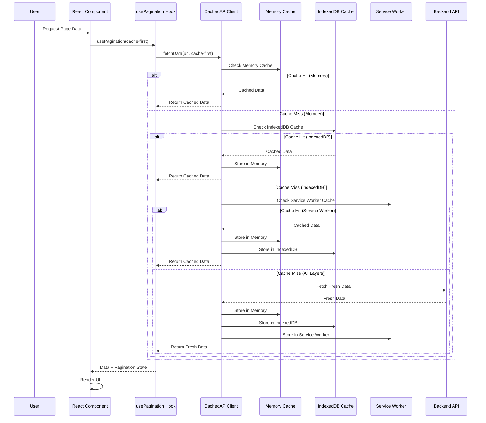
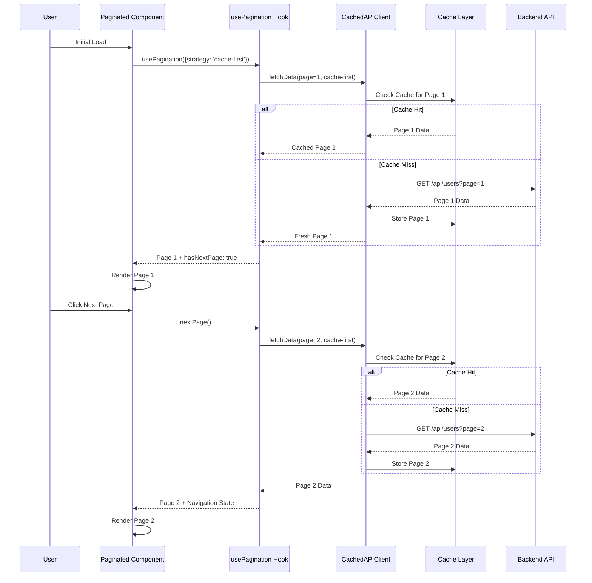
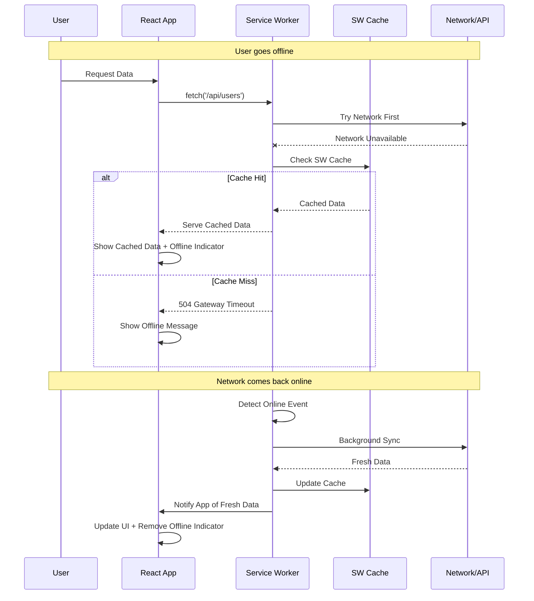
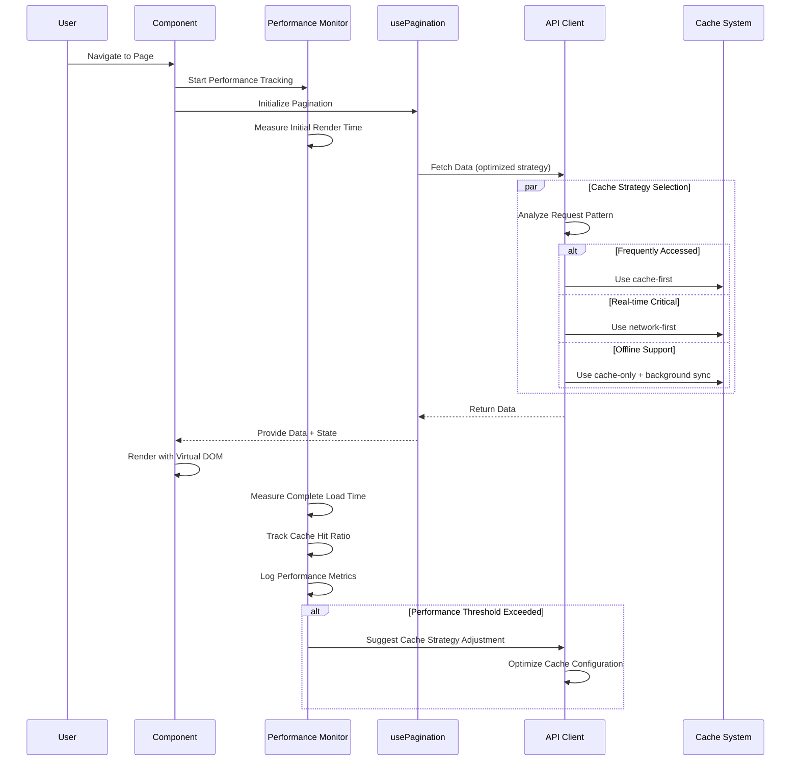

# Caching System Sequence Diagrams

## 1. Multi-Layer Caching Architecture



## 2. Pagination with Caching Strategies



## 3. Cache Invalidation and Refresh

```mermaid
sequenceDiagram
    participant User as User
    participant Component as Component
    participant Hook as usePagination Hook
    parameter Client as CachedAPIClient
    participant Cache as Cache Layer
    participant API as Backend API
    
    Note over User,API: User has cached data from previous session
    
    User->>Component: Load Page (with stale cache)
    Component->>Hook: usePagination({strategy: 'cache-first'})
    Hook->>Client: fetchData(cache-first)
    Client->>Cache: Get Cached Data
    Cache-->>Client: Stale Data (5 minutes old)
    Client-->>Hook: Stale Data
    Hook-->>Component: Show Stale Data Immediately
    
    Note over Component: User sees content instantly
    
    Client->>Client: Check Cache Age
    alt Cache Expired
        Client->>API: Background Refresh
        API-->>Client: Fresh Data
        Client->>Cache: Update Cache
        Client->>Hook: Notify Fresh Data Available
        Hook->>Component: Update with Fresh Data
        Component->>Component: Re-render with Fresh Data
    end
    
    User->>Component: Manual Refresh
    Component->>Hook: refreshData()
    Hook->>Client: fetchData(network-first)
    Client->>API: Force Fresh Fetch
    API-->>Client: Latest Data
    Client->>Cache: Invalidate + Store Fresh
    Client-->>Hook: Fresh Data
    Hook-->>Component: Updated Data
```

## 4. Offline-First Caching with Service Worker



## 5. Performance Optimization Flow



## Key Caching Features

### Multi-Layer Cache Architecture

- **Memory Cache**: Fastest access for frequently used data
- **IndexedDB Cache**: Persistent browser storage
- **Service Worker Cache**: Offline support and background sync
- **Strategic Cache Selection**: Different strategies based on use case

### Cache Strategies

- **cache-first**: Prioritize cached data for speed
- **network-first**: Ensure fresh data when needed
- **cache-only**: Full offline support
- **network-only**: Always fetch fresh data

### Performance Benefits

- **Instant Loading**: Cached data displays immediately
- **Reduced API Calls**: Less server load and bandwidth
- **Offline Support**: App works without internet
- **Background Updates**: Fresh data loads silently

### Smart Invalidation

- **Time-based Expiry**: Automatic cache refresh
- **Manual Refresh**: User-triggered updates
- **Event-based Invalidation**: Cache updates on data changes
- **Selective Clearing**: Granular cache management

These caching patterns demonstrate modern web application performance optimization strategies, ensuring fast, reliable user experiences across various network conditions.
